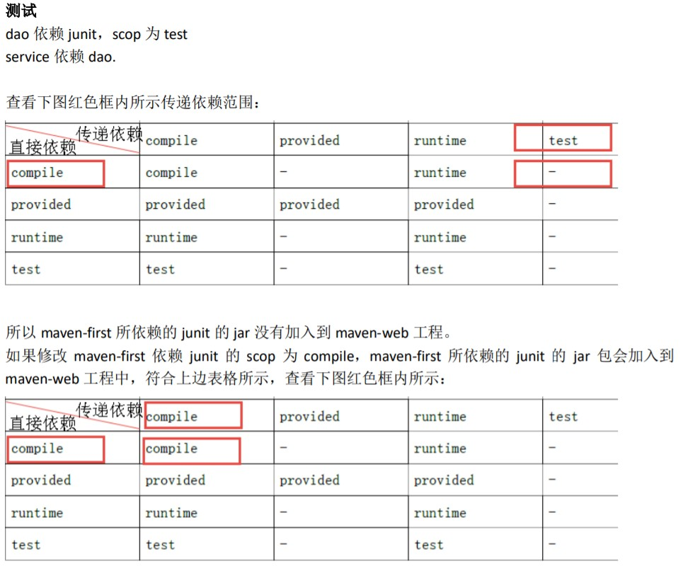
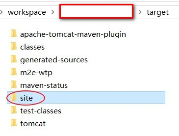
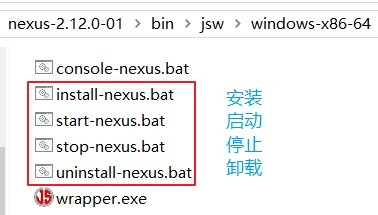

# Maven 笔记

## 1. Maven 概述

### 1.1. Maven 是什么

Maven 的 Apache 公司开源项目，是项目管理、构建工具。用来依赖管理。

Maven 是用于建立 jar 包仓库，使用依赖管理，就是对 jar 包统一管理，maven 项目中如果需要使用一个 jar 包，只需要在 maven 项目中配置需要 jar 包坐标信息，maven 程序根据 jar 包坐标的信息去 jar 包仓库中查找 jar 包

Maven 采用 Project Object Modle（POM、项目对象模型）概念来管理项目，即将项目开发和管理过程抽象成一个项目对象模型(POM)，所有的项目配置信息都定义在 pom.xml 文件中。

### 1.2. Maven 的概念模型

Maven包含了一个项目对象模型(Project Object Model)，一组标准集合，一个项目生命周期(Project Lifecycle)，一个依赖管理系统(Dependency Management System)，和用来运行定义在生命周期阶段(phase)中插件(plugin)目标(goal)的逻辑


#### 1.2.1. 项目对象模型 (Project Object Model)

一个maven工程都有一个pom.xml文件，通过pom.xml文件定义项目的坐标、项目依赖、项目信息、插件目标等。

#### 1.2.2. 依赖管理系统(Dependency Management System)

通过maven的依赖管理对项目所依赖的jar包进行统一管理。比如：项目依赖junit4.9，通过在pom.xml中定义junit4.9的依赖即使用junit4.9，如下所示是junit4.9的依赖定义：

```xml
<!-- 依赖关系 -->
<dependencies>
	<!-- 此项目运行使用junit，所以此项目依赖junit -->
	<dependency>
		<!-- junit的项目名称 -->
		<groupId>junit</groupId>
		<!-- junit的模块名称 -->
		<artifactId>junit</artifactId>
		<!-- junit版本 -->
		<version>4.9</version>
		<!-- 依赖范围：单元测试时使用junit -->
		<scope>test</scope>
	</dependency>
</dependencies>
```

#### 1.2.3. 一个项目生命周期(Project Lifecycle)

使用maven完成项目的构建，项目构建包括：清理、编译、测试、部署等过程，maven将这些过程规范为一个生命周期，如下所示是生命周期的各各阶段：


maven通过执行一些简单命令即可实现上边生命周期的各各过程，比如执行mvn compile执行编译、执行mvn clean执行清理

#### 1.2.4. 一组标准集合

maven将整个项目管理过程定义一组标准，比如：通过maven构建工程有标准的目录结构，有标准的生命周期阶段、依赖管理有标准的坐标定义等。

#### 1.2.5. 插件(plugin)目标(goal)

maven管理项目生命周期过程都是基于插件完成的。


### 1.3. 什么是项目构建

项目构建是一个项目从编写源代码到编译、测试、运行、打包、部署、运行的过程

#### 1.3.1. 传统项目构建过程

传统的使用 IDE 构建项目过程如下：

1. 在 IDE 中创建一个 java web 工程
2. 在工程中编写源代码及配置文件等
3. 对源代码进行编译，java 文件编译成 class 文件
4. 执行 Junit 单元测试
5. 将工程打成 war 包部署至 tomcat 运行

#### 1.3.2. maven 项目构建过程

maven 将项目构建的过程进行标准化，每个阶段使用一个命令完成


上图中部分阶段对应命令如下：

- 清理阶段对应 maven 的命令是 `clean`，清理输出的 class 文件
- 编译阶段对应 maven 的命令是 `compile`，将 java 代码编译成 class 文件。
- 打包阶段对应 maven 的命令是 `package`，java 工程可以打成 jar 包，web 包可以打成 war 包
- 运行一个 maven 工程（web工程）需要一个命令：`tomat:run`

**maven工程构建的优点**：

1. 一个命令完成构建、运行，方便快捷。
2. 使用maven可以分模块化的构建项目
3. maven对每个构建阶段进行规范，非常有利于大型团队协作开发。

### 1.4. 什么是依赖管理

依赖：一个 java 项目可能要使用一些第三方的 jar 包才可以运行，那么我们说这个 java 项目依赖了这些第三方的jar包

依赖管理：对项目所有依赖的 jar 包进行规范化管理

#### 1.4.1. 传统项目的依赖管理

传统的项目工程要管理所依赖的jar包完全靠人工进行，程序员从网上下载jar包添加到项目工程中

例如：程序员手工将 Hibernate、struts2、spring 的jar添加到工程中的 WEB-INF/lib 目录下


手工拷贝jar包添加到工程中存在的问题是：

1. 没有对jar包的版本统一管理，容易导致版本冲突。
2. 从网上找jar包非常不方便，有些jar找不到。
3. jar包添加到工程中导致工程过大。

#### 1.4.2. maven 项目的依赖管理

maven 项目管理所依赖的 jar 包不需要手动向工程添加 jar 包，只需要在 pom.xml（maven工程的配置文件）添加 jar 包的坐标，自动从 maven 仓库中下载 jar 包、运行


**使用maven依赖管理添加jar的好处**：

1. 通过pom.xml文件对jar包的版本进行统一管理，可避免版本冲突。
2. maven团队维护了一个非常全的maven仓库，里边包括了当前使用的jar包，maven工程可以自动从maven仓库下载jar包，非常方便。

### 1.5. 使用maven的好处

1. 一步构建。maven对项目构建的过程进行标准化，通过一个命令即可完成构建过程
2. 依赖管理。maven工程不用手动导jar包，通过在pom.xml中定义坐标从maven仓库自动下载，方便且不易出错
3. maven的跨平台，可在window、linux上使用
4. maven遵循规范开发有利于提高大型团队的开发效率，降低项目的维护成本，大公司都会考虑使用maven来构建项目

### 1.6. Maven 的两大核心

- **项目构建**：项目在编码完成后，对项目进行编译、测试、打包、部署等一系列的操作都通过**命令**来实现
- **依赖管理**：对jar包管理过程

## 2. Maven 的安装与配置

maven 程序的安装前提是：先安装JDK，它的运行依赖JDK

### 2.1. 下载 Maven 安装包

- 官方网站：https://maven.apache.org/
- 官方最新版本下载地址：https://maven.apache.org/download.cgi
- 历史版本下载地址：https://archive.apache.org/dist/maven/maven-3/
- Maven Releases History（Maven 历史版本）：https://maven.apache.org/docs/history.html

### 2.2. 环境要求

Maven 3.3+ 需要使用jdk 1.7+；请使用 `java -version` 命令检查本机的 JDK 安装信息。

### 2.3. Maven 的目录结构

下载 maven 的压缩包 `apache-maven-3.x.x-bin.zip`，解压到本地磁盘（解压目录不要有中文、空格）。maven 目录结构如下：


- 【bin】：含有mvn运行的脚本。其中 mvn.bat（以run方式运行项目）、mvnDebug.bat（以debug方式运行项目）
- 【boot】：maven运行需要 plexus-classworlds 类加载器框架
- 【conf】：包含 settings.xml 配置文件，整个maven工具核心配置文件
    - > settings.xml 中默认的用户库: `${user.home}/.m2/repository`。通过maven下载的jar包都会存储到此仓库中。可以手动修改指定的保存路径。
- 【lib】：maven 运行依赖 jar 包

### 2.4. 配置环境变量

> 电脑上需先安装java环境，至少JDK1.7+版本（将`JAVA_HOME/bin`配置环境变量path）。

如果需要使用 maven 命令行，就必须配置环境变量。注：maven环境变量的配置是可选，如果使用eclipse/idea关联运行项目，可以需要配置也能正常使用。但建议还是配置使用比较方便。

- 配置 Maven 环境变量：`MAVEN_HOME`，值为本机 Maven 根目录路径。


- 在 path 系统变量中，增加 `%MAVEN_HOME%\bin`


- *可选配置（注意：可以不配置）*

配置 MAVEN_OPTS 的环境变量，值为 `-Xms256m -Xmx512m`


### 2.5. 验证是否安装成功

查询maven的版本信息，用于检验 maven 是否配置成功。打开命令行，输入以下命令：

```bash
mvn -v
```


## 3. Maven 项目的核心概念


### 3.1. Maven 仓库

#### 3.1.1. 仓库的类型

<font color=red>本地仓库</font>

- 用来存储从远程仓库或中央仓库下载的插件和jar包，项目使用一些插件或jar包，优先从本地仓库查找
- 默认本地仓库位置在 `${user.dir}/.m2/repository`，`${user.dir}`表示windows用户目录

<font color=red>远程仓库（私服）</font>

- 如果本地需要插件或者jar包，本地仓库没有，默认去远程仓库下载
- 远程仓库可以在互联网内也可以在局域网内
- 私服在一定范围内共享资源，仅对内部开放，不对外共享。可以保存具有版权的资源，包含购买或自主研发的jar。因为中央仓库中的jar都是开源的，不能存储具有版权的资源。

<font color=red>中央仓库</font>

在maven软件中内置一个远程仓库地址，它是[中央仓库](https://repo1.maven.org/maven2)，服务于整个互联网，它是由Maven团队自己维护，里面存储了非常全的jar包，它包含了世界上大部分流行的开源项目构件

#### 3.1.2. 相关仓库服务器网址

- 中央仓库的地址：https://repo1.maven.org/maven2/
- maven坐标查找的网站：https://mvnrepository.com/

#### 3.1.3. 项目查找jar顺序

1. 先查找本地仓库
2. 再查找私服或者外网中央仓库
3. 如果在私服查找不到，再到中央仓库查找


**过程详解**：

maven的工作需要从仓库下载一些jar包，如下图所示，本地的项目A、项目B等都会通过maven软件从远程仓库（可以理解为互联网上的仓库）下载jar包并存在本地仓库，本地仓库就是本地文件夹，当第二次需要此jar包时则不再从远程仓库下载，因为本地仓库已经存在了，可以将本地仓库理解为缓存，有了本地仓库就不用每次从远程仓库下载了。

#### 3.1.4. 配置本地仓库

配置本地仓库目的：让maven程序知道仓库具体位置

1. 修改 apache-maven-x.x.x\conf\settings.xml 文件
2. 打开文件修改【`<localRepository>/path/to/local/repo</localRepository>`】路径内容，注意：内容在注释里，需要将内容复制到外面进行修改

```xml
<localRepository>D:\development\maven\repository</localRepository>
```

#### 3.1.5. 配置阿里云远程仓库

因为中央仓库的服务是在国外，访问中央仓库比较慢，所以可以修改配置，当访问阿里云的公共库。中央库里面有的jar包，阿里云仓库几乎都有

修改 maven 的 `\apache-maven-3.x.x\conf\settings.xml` 配置文件，在 `<mirrors>` 标签体内增加阿里云仓库的镜像地址：

```xml
<!-- 阿里云仓库地址(老版) -->
<mirror>
	<id>nexus</id>
	<mirrorOf>*</mirrorOf>
	<url>https://maven.aliyun.com/nexus/content/groups/public/</url>
</mirror>

<!-- 阿里云Maven中央仓库 (最新)
	https://maven.aliyun.com/mvn/guide
-->
<mirror>
  <!-- 镜像的唯一标识符，用于区分不同的 mirror 元素（名称随意，不重复即可） -->
  <id>aliyunmaven</id>
  <!-- 对哪种仓库进行镜像，即指定替代哪种仓库 -->
  <mirrorOf>*</mirrorOf>
  <!-- 镜像名称（不配置也可以） -->
  <name>阿里云公共仓库</name>
  <!-- 镜像url -->
  <url>https://maven.aliyun.com/repository/public</url>
</mirror>
```


#### 3.1.6. 全局setting与用户setting

maven仓库地址、私服等配置信息需要在 setting.xml 文件中配置，分为<font color=red>全局配置</font>和<font color=red>用户配置</font>。

- 在maven安装目录下的有 `conf/setting.xml` 文件，此 setting.xml 文件用于maven的所有project项目，它作为maven的全局配置。
- 如需要个性配置则需要在用户配置中设置，用户配置的 setting.xml 文件默认的位置在：`${user.dir}/.m2/settings.xml` 目录中，`${user.dir}` 指windows中的用户目录。

maven 会先找用户配置，如果找到则以用户配置文件为准，否则使用全局配置文件。


### 3.2. Maven 的坐标

#### 3.2.1. 定义

坐标(GAV)：是 Maven 作为查找定位jar包（项目/组件）的唯一依据。例如：`struts2-core-2.3.24.jar`

坐标的规则：`Apache(公司名称)+struts2(项目名称)+2.3.24(版本信息)`

官方中央仓库网址：https://repo1.maven.org/maven2/

#### 3.2.2. Maven 坐标主要组成

- `groupId`：定义当前Maven项目隶属项目、组织（通常是域名反转，如：org.mybatis）
- `artifactId`：定义实际项目中的一个项目（模块）名称
- `version`：定义当前项目的当前版本
- `packaging`：定义该项目的打包方式(pom/jar/war，默认是jar包)

## 4. maven的常用命令（应用）

进入项目根目录，通过（cmd）命令行界面进行操作

### 4.1. clean（清理）

```bash
mvn clean
```

将项目根目录下target目录清理掉，即将编译后的class文件清理掉

### 4.2. compile（编译）

```bash
mvn compile
```

maven工程的编译命令，作用是将src/main/java下的文件编译为class文件输出到target目录下

### 4.3. test(单元测试)

```bash
mvn test
```

单元测试类名有要求：XxxxTest.java，如果不是以Test结尾，则无法执行

将项目根目录下src/test/java目录下的单元测试类都会执行


### 4.4. package(打包)

```bash
mvn package
```

程序会根据项目的不同类型，打包成不同类型的包:

- web project  --> war包
- java project  --> jar包

将项目打包，打包后文件存在项目根目录下taget目录

### 4.5. install(安装)

```bash
mvn install
```

执行 install 将maven打成jar包或war包发布到本地仓库。解决本地多个项目公用一个jar包。

### 4.6. deploy(部署)

```bash
mvn deploy
```

将项目部署到私服上

## 5. Maven 项目的构建

### 5.1. Maven 项目工程标准目录结构约定

使用 maven 创建的工程称它为 maven 工程，maven 工程具有一定的目录规范，如下：

#### 5.1.1. 目录结构

```
MavenProject
|
|-- src
|    ├── main
|    |    ├── java       # 存放项目的.java文件
|    |    |-- resources  # 存放项目资源文件，如spring,mybatis配置文件（此两个 java 与 resources 源码包，会打入jar包或war包，实现运行有效）
|    |    └── webapp     # webapp 目录是 web 工程的主目录
|    |          └── WEB-INF
|    |                 └── web.xml
|    └── test
|         ├── java       # 存放所有单元测试.java文件，如JUnit测试类
|         └── resources  # 测试资源文件（以上 java 与 resources 两个测试包，不会打包，测试有效，实现运行无效）
|
├── target      # 项目输出位置，编译后的 .class、.jar、.war 文件会输出到此目录
└── pom.xml     # 项目对象模型 —— maven项目核心配置文件
```


#### 5.1.2. pom.xml文件

- project：任何要build的事物，Maven都认为它们是工程。这些工程被定义为工程对象模型（POM，Poject Object Model）。一个工程可以依赖其它工程，一个工程也可以由多个子工程构成。
- POM：pom(pom.xml)是Maven的核心文件，它是指示Maven如何工作的元数据文件，类似于Ant的build.xml文件。pom.xml文件位于每个工程的根目录下。
- Plug-in：Maven 是由插件组织的，它的每一个功能都由插件提供。插件提供goal，并根据在pom中找到元数据去完成工作

### 5.2. 使用命令方式创建 maven 项目

直接通过命令行使用 maven 提供的插件创建 maven项目。语法如下：

```bash
mvn archetype:generate
    -DgroupId={项目包名称}
    -DartifactId={项目名称}
    -DarchetypeArtifactId={模块名称，取值：maven-archetype-quickstart | maven-archetype-webapp 等}
    -Dversion={项目版本号}
    -DinteractiveMode=false
```

- 创建 java 工程示例：

```bash
mvn archetype:generate -DgroupId=com.moon -DartifactId=java-project-demo -DarchetypeArtifactId=maven-archetype-quickstart -Dversion=1.0.0-SNAPSHOT -DinteractiveMode=false
```

- 创建 web 工程示例：

```bash
mvn archetype:generate -DgroupId=com.moon -DartifactId=web-project-demo -DarchetypeArtifactId=maven-archetype-webapp -Dversion=1.0.0-SNAPSHOT -DinteractiveMode=false
```

> *注：最好在空的目录下创建，目录中不能有pom.xml文件*

示例创建的工程的效果（下面有些目录是自己手动补全，使用骨架命令生成的目录结构不全）：


### 5.3. 使用 IDEA 创建 maven 项目

#### 5.3.1. 配置 idea 中的 maven 环境

- 指定maven的安装目录与仓库目录


- 构建索引。	在 【Settings】 -> 【Maven】 -> 【Repositories】，点击 update 按钮，更新索引


#### 5.3.2. 创建 maven 项目

选择 【File】 -> 【New】 -> 【Project...】/【Module...】 创建项目/模块


1. 可以勾选【Create from archetype】，再选择相应的骨架创建即可
2. 也可以不勾选骨架，直接创建空的 Maven 项目


### 5.4. 使用 eclipse 创建 maven 项目（待整理）

待整理！

## 6. 依赖管理

### 6.1. 依赖配置（添加依赖）

依赖是指当前项目运行所需的 jar 包，一个项目可以设置多个依赖。

在 pom.xml 中添加 `<dependency>` 标签，语法格式如下：

```xml
<!-- 设置具体的依赖 -->
<dependency>
    <!-- 依赖所属群组id -->
    <groupId>xx.xx<groupId>
    <!-- 依赖所属项目id -->
    <artifactId>xx</artifactId>
    <!-- 依赖版本号 -->
    <version>xx.xx.xx</version>
</dependency>
```

### 6.2. 查找坐标

添加依赖需要指定依赖jar包的坐标，但是很多情况是不知道jar包的的坐标，可以通过如下方式查询：

- **方法一：从互联网搜索**
    - 网址：http://search.maven.org/
    - 网址：http://mvnrepository.com/


- **方法二：使用maven插件的索引功能**

如果在本地仓库有我们要的jar包，可以在pom.xml中右键添加依赖

### 6.3. 依赖范围

#### 6.3.1. 依赖范围语法格式

如果A依赖B，需要在A的pom.xml文件中添加B的坐标，添加坐标时可以通过 `<scope>` 标签来指定依赖范围，依赖范围决定jar包的可用的范围。语法格式如下：

```xml
<dependency>
    <groupId>xx.xx<groupId>
    <artifactId>xx</artifactId>
    <version>xx.xx.xx</version>
    <!-- 配置依赖范围。可选值：compile | runtime | test | system | provided -->
    <scope>runtime</scope>
</dependency>
```

#### 6.3.2. 依赖范围取值

- `compile`：编译范围，指A在编译时依赖B，此范围为默认依赖范围。<font color=violet>*编译范围的依赖会用在编译、测试、运行，由于运行时需要。所以编译范围的依赖会被打包到war包中*</font>。**添加依赖范围默认值是compile**
- `provided`：容器已经提供范围。provided依赖只有在当JDK或者一个容器已提供该依赖之后才使用，provided依赖<font color=violet>*在编译和测试时需要，在运行时不需要，不会打包到war包中*</font>，比如：servlet-api/jsp-api被tomcat容器提供，全用默认依赖范围，在package后jsp-api和servlet-api是存在war包中；使用provided后，打包后是不存在的
    - 
- `runtime`：运行时期有效范围。runtime依赖<font color=violet>*在运行和测试系统的时候需要，但在编译的时候不需要*</font>。比如：jdbc的数据库驱动包。由于运行时需要所以<font color=violet>*runtime范围的依赖会被打包至war包*</font>。
- `test`：test范围依赖在编译和运行时都不需要，它们<font color=violet>*只有在测试编译和测试运行阶段可用*</font>，比如：junit。由于运行时不需要所以<font color=violet>*test范围依赖不会被打包到war包中*</font>。
- `system`：system范围依赖与provided类似，但是你必须显式的提供一个对于本地系统中JAR文件的路径，<font color=violet>*需要指定systemPath磁盘路径，system依赖不推荐使用*</font>。


#### 6.3.3. 依赖范围使用例子

如果将servlet-api.jar设置为compile,打包后包含serlvet-api.jar，war包部署到tomcat跟tomcat中存在servlet-api.jar包冲突。导致运行失败


解决方法：


<font color=red>**总结：如果使用到tomcat自带jar包，将项目中依赖作用范围设置为：provided,其他可以默认**</font>


**测试总结**

- 默认引入的jar包 -> compile【默认范围可以不写】（编译、测试、运行都有效）
- servlet-api/jsp-api -> provided（编译、测试有效，运行时无效防止和tomcat下jar冲突）
- jdbc驱动jar包 -> runtime（测试、运行有效）
- junit -> test（测试有效）

依赖范围由强到弱的顺序是：compile > provided > runtime > test

### 6.4. 传递依赖

#### 6.4.1. 什么是传递依赖

依赖具有传递性。当A依赖B、B依赖C，在A中导入B后会自动导入C，<font color=red>B是A的直接依赖，C是A的传递依赖</font>，如果C依赖D则D也可能是A的传递依赖

- **直接依赖**：在当前项目中通过依赖配置建立的依赖关系
- **间接依赖**：在当前项目中引入的依赖，如果该被引入的资源依赖其他资源，那么当前项目就间接依赖其他资源

#### 6.4.2. 依赖范围对传递依赖的影响（了解）

依赖会有依赖范围，依赖范围对传递依赖也有影响，有A、B、C，A依赖B、B依赖C，C可能是A的传递依赖

| 直接依赖\传递依赖 | compile  | provided | runtime  | test |
| :-------------: | :------: | :------: | :------: | :--: |
|     compile     | compile  |    -     | runtime  |  -   |
|    provided     | provided | provided | provided |  -   |
|     runtime     | runtime  |    -     | runtime  |  -   |
|      test       |   test   |    -     |   test   |  -   |

最左边一列为直接依赖，理解为A依赖B的范围，最顶层一行为传递依赖，理解为B依赖C的范围，行与列的交叉即为A传递依赖C的范围。

> 举例：比如A对B有compile依赖，B对C有runtime依赖，那么根据表格所示A对C有runtime依赖



### 6.5. 可选依赖

配置可选依赖：在 `<dependency>` 标签体中使用 `<optional>` 标签，可以设置当前依赖的组件不向下传递。默认值为false，表示依赖会向下传递；如果设置为true，依赖不会向下传递

可选依赖作用：**控制依赖是否能向下传递**

```xml
<!-- 可选依赖 -->
<dependency>
	<groupId>log4j</groupId>
	<artifactId>log4j</artifactId>
	<version>1.2.14</version>
	<!-- 配置可选依赖：默认值为false，表示依赖会向下传递；如果设置为true，依赖不会向下传递 -->
	<optional>true</optional>
</dependency>
```

> <font color=red>**注意：模块在使用`<parent>`继承中，在父项目中的 optional 配置对子项目并无影响。**</font>

```xml
<dependencyManagement>
    <dependencies>
        <dependency>
            <groupId>junit</groupId>
            <artifactId>junit</artifactId>
            <version>4.12</version>
            <optional>true</optional>
        </dependency>
    </dependencies>
</dependencyManagement>
```

例如，在 parent 项目中配置统一的依赖版本控制，此时其他子项目需要 Junit 的 jar 包时可以直接在项目中引入，父项目中的optional配置对子项目并无影响。

又例如，在 parent 项目直接通过 `<dependencies>` 引入 Junit 依赖，而 `<optional>true</optional>` 配置只会让各个子模块此依赖不相互传递 Junit 依赖，但所有子模块都会引入 Junit 的 jar 包

因此在 Maven 项目中，恰当的使用 optional 配置，可以在很大程度上减少 jar 包的大小，提升编译和发布速度。

### 6.6. 依赖版本冲突解决

当一个项目依赖的构件比较多时，它们相互之前存在依赖，会出现依赖版本的冲突。如：

```xml
<dependencies>
	<!-- struts2-spring-plugin依赖spirng-beans-3.0.5 -->
	<dependency>
		<groupId>org.apache.struts</groupId>
		<artifactId>struts2-spring-plugin</artifactId>
		<version>2.3.24</version>
	</dependency>
	<!-- spring-context依赖spring-beans-4.2.4 -->
	<dependency>
		<groupId>org.springframework</groupId>
		<artifactId>spring-context</artifactId>
		<version>4.2.4.RELEASE</version>
	</dependency>
</dependencies>
```

#### 6.6.1. Maven自动依赖调解原则：在两个直接依赖中,以后面声明者优先

在pom文件定义依赖，以后面声明的依赖为准

```xml
<!-- 可选依赖 -->
<dependency>
	<groupId>log4j</groupId>
	<artifactId>log4j</artifactId>
	<!-- 版本1.2.14 -->
	<version>1.2.14</version>
</dependency>
<dependency>
	<groupId>log4j</groupId>
	<artifactId>log4j</artifactId>
	<!-- 版本1.2.12:两个直接依赖中,以后面声明者优先 -->
	<version>1.2.12</version>
</dependency>
```

#### 6.6.2. Maven自动依赖调解原则：在两个传递(间接)依赖中,以先声明者优先

在pom文件定义依赖，以先声明的依赖为准

```xml
<!-- 两个间接依赖中，依赖了同一个坐标不同版本的组件，以配置顺序上方为主 -->
<!-- 依赖struts-spring整合插件包 (间接依赖spring-core-3.0.5)-->
<dependency>
	<groupId>org.apache.struts</groupId>
	<artifactId>struts2-spring-plugin</artifactId>
	<version>2.3.24</version>
</dependency>
<!-- 依赖spring-aop包(间接依赖spring-core-5.0.0) -->
<dependency>
	<groupId>org.springframework</groupId>
	<artifactId>spring-aop</artifactId>
	<version>5.0.0.RELEASE</version>
</dependency>
```

#### 6.6.3. Maven自动依赖调解原则：直接依赖级别高于传递(间接)依赖

例如：A依赖spirng-beans-4.2.4，A依赖B依赖spirng-beans-3.0.5，则spring-beans-4.2.4优先被依赖在A中，因为spring-beans-4.2.4相对spirng-beans-3.0.5被A依赖的路径最近

```xml
<!-- 路径近者优先原则:直接依赖高于传递依赖 -->
<dependency>
	<groupId>org.springframework</groupId>
	<artifactId>spring-beans</artifactId>
	<version>4.2.4.RELEASE</version>
</dependency>
```

#### 6.6.4. Maven手动解决依赖冲突：排除依赖

版本的冲突可以通过排除依赖方法辅助依赖调解。比如在依赖struts2-spring-plugin的设置中添加排除依赖，排除spring-beans


<font color=red>**直接使用 `<exclusion>` 标签**</font>:

```xml
<!-- struts2-spring-plugin依赖spirng-beans-3.0.5 -->
<dependency>
	<groupId>org.apache.struts</groupId>
	<artifactId>struts2-spring-plugin</artifactId>
	<version>2.3.24</version>
	<exclusions>
		<!-- 排除 spring-beans-->
		<exclusion>
			<groupId>org.springframework</groupId>
			<artifactId>spring-beans</artifactId>
		</exclusion>
	</exclusions>
</dependency>
```

#### 6.6.5. Maven手动解决依赖冲突：锁定版本（推荐使用）

面对众多的依赖，有一种方法不用考虑依赖路径、声明优化等因素可以采用直接锁定版本的方法确定依赖构件的版本，版本锁定后则不考虑依赖的声明顺序或依赖的路径，<font color=red>**以锁定的版本为准添加到工程中，此方法在企业开发中常用**</font>

在pom.xml文件中，通过使用 `<dependencyManagement>` 标签来锁定依赖的版本。注意点如下：

1. 在工程中锁定依赖的版本并不代表在工程中添加了依赖，如果工程需要添加锁定版本的依赖则需要单独添加 `<dependencies></dependencies>` 标签
2. 如果在 `<dependencyManagement>` 中锁定了版本，那么在 `<dependency>` 下不需要再指定版本

**使用工具依赖选项卡添加锁定版本**


**手动添加锁定版本**:

```xml
<!--锁定版本为 4.2.4 -->
<dependencyManagement>
	<dependencies>
		<dependency>
			<groupId>org.springframework</groupId>
			<artifactId>spring-beans</artifactId>
			<version>4.2.4.RELEASE</version>
		</dependency>
		<dependency>
			<groupId>org.springframework</groupId>
			<artifactId>spring-context</artifactId>
			<version>4.2.4.RELEASE</version>
		</dependency>
	</dependencies>
</dependencyManagement>

<dependencies>
	<!-- struts2-spring-plugin依赖spirng-beans-3.0.5 -->
	<dependency>
		<groupId>org.apache.struts</groupId>
		<artifactId>struts2-spring-plugin</artifactId>
		<version>2.3.24</version>
	</dependency>
	<!-- spring-context依赖spring-beans-4.2.4 -->
	<!-- 这里可以不指定版本，因为上面已锁定版本 -->
	<dependency>
		<groupId>org.springframework</groupId>
		<artifactId>spring-context</artifactId>
	</dependency>
</dependencies>
```

## 7. maven项目的生命周期

### 7.1. 三套生命周期

在maven中存在“三套”生命周期，每一套生命周期相互<font color=red>**独立**</font>，互不影响。<font color=red>**在一套生命周期内，执行后面的命令前面操作会自动执行**</font>

三套生命周期分别是：

- Clean LifeCycle：在进行真正的构建之前进行一些清理工作。包括的命令：`clean`
- Default LifeCycle：默认生命周期，构建核心部分，编译，测试，打包，部署等等。包括的命令：`compile`,`test`,`package`,`install`,`deploy`
- site LifeCycle：站点生命周期，生成项目报告，站点，发布站点。包括的命令：`site`

### 7.2. 生命周期的阶段

每个生命周期都有很多阶段，每个阶段对应一个执行命令

#### 7.2.1. clean 生命周期的阶段

clean 生命周期每套生命周期都由一组阶段(Phase)组成，我们平时在命令行输入的命令总会对应于一个特定的阶段。比如，运行`mvn clean`，这个的 clean 是 clean 生命周期的一个阶段。有 clean 生命周期，也有 clean 阶段。clean 生命周期一共包含了三个阶段：

- `pre-clean`：执行一些需要在 clean 之前完成的工作
- `clean`：移除所有上一次构建生成的文件，（删除 target 目录）
- `post-clean`：执行一些需要在 clean 之后立刻完成的工作

`mvn clean` 命令中的 clean 就是上面的 clean，在一个生命周期中，运行某个阶段的时候，它之前的所有阶段都会被运行，也就是说，`mvn clean`等同于 `mvn pre-clean clean`，如果运行 `mvn post-clean`，那么 pre-clean，clean 都会被运行。这是 Maven 很重要的一个规则，可以大大简化命令行的输入

#### 7.2.2. default 生命周期（重点）

default 生命周期 default 生命周期是 Maven 生命周期中最重要的一个，绝大部分工作都发生在这个生命周期中。比较重要和常用的阶段如下

```
validate
generate-sources
process-sources
generate-resources
process-resources 复制并处理资源文件，至目标目录，准备打包。
compile 编译项目的源代码。
process-classes
generate-test-sources
process-test-sources
generate-test-resources
process-test-resources 复制并处理资源文件，至目标测试目录。
test-compile 编译测试源代码。
process-test-classes
test 使用合适的单元测试框架运行测试。这些测试代码不会被打包或部署。
prepare-package
package 接受编译好的代码，打包成可发布的格式，如 JAR 。
pre-integration-test
integration-test
post-integration-test
verify
install 将包安装至本地仓库，以让其它项目依赖。
deploy 将最终的包复制到远程的仓库，以让其它开发人员与项目共享。
```

运行任何一个阶段的时候，它前面的所有阶段都会被运行，这也就是为什么运行 `mvn install` 的时候，代码会被编译，测试，打包。此外，Maven的插件机制是完全依赖Maven的生命周期的

#### 7.2.3. site 生命周期

site 生命周期包含如下 4 个阶段：

- `pre-site`：执行一些需要在生成站点文档之前完成的工作
- `site`：生成项目的站点文档
- `post-site`：执行一些需要在生成站点文档之后完成的工作，并且为部署做准备
- `site-deploy`：将生成的站点文档部署到特定的服务器上

注：这里经常用到的是 site 阶段和 site-deploy 阶段，用以生成和发布 Maven 站点，这是 Maven 相当强大的功能，文档及统计数据自动生成

执行命令：`site`，就会在target目录下生成站点目录：





### 7.3. 命令与生命周期的阶段

每个maven命令对应生命周期的某个阶段，例如：`mvn clean`命令对应 clean 生命周期的clean阶段，`mvn test`命令对应default生命周期的test阶段。

执行命令会将该命令在的在生命周期当中之前的阶段自动执行，比如：执行 `mvn clean` 命令会自动执行pre-clean和clean两个阶段，`mvn test`命令会自动执行validate、compile、test等阶段。

<font color=red>**注意：执行某个生命周期的某个阶段不会影响其它的生命周期！**</font>

如果要同时执行多个生命周期的阶段可在命令行输入多个命令，中间以空格隔开，例如：`clean package` 该命令执行 clean 生命周期的 clean 阶段和 default 生命周期的 package 阶段。

### 7.4. 生命周期插件

插件与生命周期内的阶段绑定，在执行到对应生命周期时执行对应的插件功能。

修改 pom.xml 文件，在 `<build>` 配置相关插件，如：

```xml
<build>
    <plugins>
        <plugin>
            <groupId>org.apache.maven.plugins</groupId>
            <artifactId>maven-source-plugin</artifactId>
            <version>3.2.1</version>
            <executions>
                <execution>
                    <goals>
                        <goal>jar</goal>
                    </goals>
                    <phase>generate-test-resources</phase>
                </execution>
            </executions>
        </plugin>
    </plugins>
</build>
```

### 7.5. 跳过测试

#### 7.5.1. 应用场景

- 整体模块功能未开发
- 模块中某个功能未开发完毕
- 单个功能更新调试导致其他功能失败
- 快速打包

实现项目上线打包部署时是不被允许跳过测试，这只是用于在本地开发时，为了能快速构建项目才使用。

#### 7.5.2. 命令行跳转测试

命令语法格式：

```bash
mvn 指令 –D skipTests
```

**注意事项：执行的指令生命周期必须包含测试环节**

#### 7.5.3. IDEA 操作跳过测试


#### 7.5.4. 通过配置文件跳过测试

mavan 执行每个生命周期都是通过插件来完成，所以对相应的插件配置跳过测试即可。也可以指定执行哪些测试用例，或者指定排除不执行哪些测试用例。配置示例如下：

```xml
<build>
    <plugins>
        <plugin>
            <groupId>org.apache.maven.plugins</groupId>
            <artifactId>maven-surefire-plugin</artifactId>
            <version>2.22.2</version>
            <!-- 对某个生命周期插件进行相关配置 -->
            <configuration>
                <!-- 设置跳过测试 -->
                <skipTests>true</skipTests>
                <!-- 配置执行指定的测试用例 -->
                <includes>
                    <include>**/Product*Test.java</include>
                </includes>
                <!-- 配置排除不执行指定的测试用例 -->
                <excludes>
                    <exclude>**/**Test.java</exclude>
                </excludes>
            </configuration>
        </plugin>
    </plugins>
</build>
```


## 8. 继承和聚合

通常继承和聚合同时使用

### 8.1. 聚合

#### 8.1.1. 概述

项目开发通常是分组分模块开发，每个模块开发完成要运行整个工程需要将每个模块聚合在一起运行，比如：dao、service、web三个工程最终会打一个独立的war运行

聚合的作用：用于快速构建maven工程，一次性构建多个项目/模块

#### 8.1.2. 聚合的配置语法

- 创建一个空的maven项目，修改 pom.xml 文件，将打包类型定义为 `pom` 类型

```xml
<packaging>pom</packaging>
```

- 在 pom.xml 文件中，通过 `<modules>` 标签配置需要聚合的子工程

```xml
<!-- 父工程通过配置 modulesm，聚合子工程 -->
<modules>
    <!-- 在modules中配置相对路径，相对父工程pom.xml的路径找到子工程的pom.xml -->
    <module>xxx-controller</module>
    <module>xxx-service</module>
    <module>../xxx-config</module>
    <module>xxx-dao</module>
</modules>
```

> <font color=red>**需要注意：参与聚合操作的模块最终执行顺序与模块间的依赖关系有关，与配置顺序无关**</font>

#### 8.1.3. 在聚合父工程中定义依赖管理

- 在聚合父工程 pom 文件中，使用 `<dependencyManagement>` 标签定义依赖管理

```xml
<!--
    声明此处进行的依赖管理
    继承自该项目的所有子项目的默认依赖信息。这部分的依赖信息不会被立即解析，
    而是当子项目声明一个依赖（必须描述 groupID 和 artifactID 信息），
    如果 groupID 和 artifactID 以外的一些信息没有描述，则通过 groupID 和 artifactID 匹配到这里的依赖，并使用这里的依赖信息。
 -->
<dependencyManagement>
    <!-- 参见dependencies/dependency元素 -->
    <dependencies>
        <dependency>
            <groupId>xx.xx.xx</groupId>
            <artifactId>xxx</artifactId>
            <version>xx.xx.xx</version>
        </dependency>
    </dependencies>
</dependencyManagement>
```

- 在子工程定义依赖关系，无需声明依赖版本，版本参照父工程中依赖的版本

```xml
<dependency>
    <groupId>xx.xx.xx</groupId>
    <artifactId>xxx</artifactId>
</dependency>
```


### 8.2. 继承

#### 8.2.1. 概述

继承的作用是，可以实现在子工程中沿用父工程的配置。

继承是为了消除重复，如果将dao、service、web分开创建独立的工程则每个工程的pom.xml文件中的内容存在重复，比如：设置编译版本、锁定spring的版本的等，可以将这些重复的配置提取出来在父工程的pom.xml中定义

#### 8.2.2. 继承的配置语法

只需在子工程 pom.xml 文件中，通过 `<parent>` 标签声明继承的父工程坐标与对应的位置即可

```xml
<!-- 父工程的定义坐标信息 -->
<parent>
    <groupId>包名</groupId>
    <artifactId>项目/模块名称</artifactId>
    <version>版本号</version>
    <!-- 父工程的 pom.xml 文件位置，如果子工程在父工程的根目录下，则可以省略不配置 -->
    <relativePath/> <!-- lookup parent from repository -->
    <!-- 如配置，使用相对路径即可 -->
    <!-- <relativePath>../pom.xml</relativePath> -->
</parent>
```

### 8.3. 继承和聚合总结

- 继承主要是为了消除重复
- 聚合主要是为了快速构建运行项目

#### 8.3.1. 项目继承

maven项目继承的作用：抽取所有项目公共的配置：

1. 依赖
2. 公用的插件配置

maven项目继承：

- 父项目：抽取所有项目的公共的依赖、插件。最好在父项目中统一控制组件的版本
- 子项目：继承父项目，就可以具有父项目已经提供的依赖、公用的插件

#### 8.3.2. 通过父项目锁定依赖组件版本

- 为什么需要版本锁定？
    - 通过父项目锁定版本，然后子项目继承父项目就不能够再修改版本号（不推荐修改。）
    - 因为项目的开发，团队开发，通过父项目统一维护版本号，其他子项目不允许修改版本，更易于后期的项目维护。
- 父项目实现锁定版本：
    - 通过 `<dependencyManagement>` 标签进行版本锁定
    - 父项目锁定版本 + 抽取公用依赖配置 + 抽取公用的插件配置

#### 8.3.3. maven 聚合项目

无论是继承还是聚合，项目类型都是pom。无论是继承还是聚合，父项目或聚合项目都不需要写代码

#### 8.3.4. 总结

- 作用
    - 聚合用于快速构建项目
    - 继承用于快速配置
- 相同点
    - 聚合与继承的 pom. xml 文件打包方式均为 pom，可以将两种关系制作到同一个 pom 文件中
    - 聚合与继承均属于设计型模块，并无实际的模块内容
- 不同点
    - 聚合是在当前模块中配置关系，聚合可以感知到参与聚合的模块有哪些
    - 继承是在子模块中配置关系，父模块无法感知哪些子模块继承了自己

## 9. 属性管理

### 9.1. 自定义属性

- 作用：相当于定义变量，方便统一管理
- 使用 `<properties>` 标签定义：

```xml
<properties>
    <java.version>1.8</java.version>
    <xxx.version>xxxx</xxx.version>
</properties>
```

- 使用 `${}` 调用：

```xml
<dependency>
    <groupId>xx.xxx</groupId>
    <artifactId>xxxx</artifactId>
    <version>${xxx.version}</version>
</dependency>
```

### 9.2. 内置属性

- 使用maven内置的属性，获取内置一些配置值
- 调用格式：

```xml
${basedir}
${version}
```

### 9.3. Setting 属性

- 使用 maven 配置文件 setting 中的标签属性，用于动态配置
- 调用格式

```xml
${settings.localRepository}
```

### 9.4. Java 系统属性

- 读取 Java 系统属性
- 调用格式：

```xml
${user.home}
```

- 通过以下命令，可以查询系统属性

```bash
mvn help:system
```

### 9.5. 环境变量属性

- 读取 Java 系统属性
- 调用格式：

```xml
${env.JAVA_HOME}
```

- 通过以下命令，可以查询环境变量属性

```bash
mvn help:system
```

### 9.6. 资源配置文件引用 pom 文件

maven 可以在任意配置文件中加载 pom 文件中定义的属性，步骤如下：

- 在项目的 pom 文件中配置

```xml
<properties>
    <jdbc.url>jdbc:mysql://localhost:3306/xxx</jdbc.url>
</properties>
```

- 在 pom 文件中配置开启加载 pom 文件

```xml
<build>
    <!-- 这个元素描述了项目相关的所有资源路径列表，例如和项目相关的属性文件，这些资源被包含在最终的打包文件里。 -->
    <resources>
        <!-- 这个元素描述了项目相关或测试相关的所有资源路径 -->
        <resource>
            <!-- 是否使用参数值代替参数名。参数值取自properties元素或者文件里配置的属性，文件在filters元素里列出。 -->
            <filtering>true</filtering>
            <!-- 设定配置文件对应的位置目录，该路径相对POM路径。支持使用属性动态设定路径 -->
            <directory>${project.basedir}/src/main/resources</directory>
            <!-- 包含的模式列表，例如**/*.xml. -->
            <includes>
                <include></include>
            </includes>
            <!-- 排除的模式列表，例如**/*.xml -->
            <excludes>
                <exclude></exclude>
            </excludes>
        </resource>
    </resources>
</build>
```

- 在 properties 或者 xml 等文件调用：

```properties
jdbc.url=${jdbc.url}
```

## 10. 多环境配置

### 10.1. 定义语法

```xml
<!--
    项目构建profile，创建多环境
    根据环境参数或命令行参数激活某个构建处理
 -->
<profiles>
    <!-- 定义不同环境 -->
    <profile>
        <!-- 定义环境的唯一标识 -->
        <id>dev_env</id>
        <!-- 定义此环境下的专用的属性值、内容等 -->
        <properties>
            <xxx.xxx>xxxxxx</xxx.xxx>
        </properties>
        <!-- 设置默认启动 -->
        <activation>
            <activeByDefault>true</activeByDefault>
        </activation>
    </profile>
    <!-- 定义不同环境 -->
    <profile>
        <id>prod_env</id>
        <properties>
            <xxx.xxx>xxxxxx</xxx.xxx>
        </properties>
    </profile>
</profiles>
```

### 10.2. 加载指定环境

加载指定环境配置，通过命令运行时指定相应的环境，语法以下：

```bash
mvn 指令 –P 环境定义id
```

示例：

```bash
mvn install -P prod_env
```

## 11. Maven私服

### 11.1. 私服使用场景

项目组编写了一个通用的工具类，其它项目组将类拷贝过去使用，当工具类修改bug后通过邮件发送给各各项目组，这种分发机制不规范可能导致工具类版本不统一。

**解决方案：项目组将写的工具类通过maven构建，打成jar，将jar包发布到公司的maven仓库中，公司其它项目通过maven依赖管理从仓库自动下载jar包**。

公司在自己的局域网内搭建自己的远程仓库服务器，称为私服，私服服务器即是公司内部的maven远程仓库，每个员工的电脑上安装maven软件并且连接私服服务器，员工将自己开发的项目打成jar并发布到私服服务器，其它项目组从私服服务器下载所依赖的构件（jar）。

私服还充当一个代理服务器，当私服上没有jar包会从互联网中央仓库自动下载


### 11.2. 关于中央仓库使用的注意事项

- **地址**:

目前来说，http://repo1.maven.org/maven2/是真正的Maven中央仓库的地址，该地址内置在Maven的源码中其他的都是镜像。

如果仓库X可以提供仓库Y存储的所有内容，那么就可以认为X是Y的一个镜像，某些情况下使用镜像可以提高项目构建效率。

- **索引**:

中央仓库带有索引文件以方便用户对其进行搜索，索引每周更新一次

- **黑名单**:

如果某个IP地址恶意的下载中央仓库内容，例如全公司100台机器使用同一个IP反复下载，这个IP（甚至是IP段）会进入黑名单，因此稍有规模的使用Maven时，应该用Nexus架设私服

### 11.3. 搭建私服环境

#### 11.3.1. 下载 nexus

Nexus 是 Maven 仓库管理器，通过 nexus 可以搭建 maven 仓库，同时 nexus 还提供强大的仓库管理功能，构件搜索功能等。

- ~~下载地址：https://help.sonatype.com/repomanager3/product-information/download~~
- 下载地址：https://help.sonatype.com/repomanager3/download
- 下载文件：nexus-x.x.x-xx-bundle.zip

> 以下使用 nexus-2.12.0-01-bundle.zip 为示例

#### 11.3.2. 安装 nexus

解压nexus-2.12.0-01-bundle.zip，解压在不含中文和空格的目录下，解压完成后进入bin目录

以管理员身份运行【命令提示符】


在cmd中进入bin目录，执行 `nexus.bat install`


安装成功在服务中查看有nexus服务，启动服务【可以设置不自动开启】


#### 11.3.3. 卸载 nexus

cmd进入nexus的bin目录，执行：`nexus.bat uninstall`


#### 11.3.4. 启动 nexus

方法 1：cmd进入bin目录，执行：`nexus.bat start`


方法 2：直接启动nexus服务


查看nexus的配置文件，位置：conf/nexus.properties


```properties
# Jetty section
application-port=8081						#nexus的访问端口配置
application-host=0.0.0.0					#nexus主机监听配置(不用修改)
nexus-webapp=${bundleBasedir}/nexus		#nexus工程目录
nexus-webapp-context-path=/nexus		#nexus的web访问路径
# Nexus section
nexus-work=${bundleBasedir}/../sonatype-work/nexus	# nexus 仓库目录
runtime=${bundleBasedir}/nexus/WEB-INF					# nexus 运行程序目录
```

#### 11.3.5. 直接使用快捷方式安装、卸载、启动 nexus

进入安装目录 \nexus-2.12.0-01\bin\jsw\windows-x86-64，里面都相关的脚本。



console-nexus.bat：不需要安装成服务，点击一次运行一次，关闭后不再运行。

#### 11.3.6. 登陆nexus

访问：http://localhost:8081/nexus/

点击右上角的Log in，使用Nexus内置账户`admin`/`admin123`登陆

#### 11.3.7. nexus 的仓库有4种类型（了解）


1. `hosted`：宿主仓库，部署自己的jar到这个类型的仓库，包括releases和snapshot两部分，Releases公司内部发布版本仓库、Snapshots公司内部测试版本仓库
2. `proxy`：代理仓库，用于代理远程的公共仓库，如maven中央仓库，用户连接私服，私服自动去中央仓库下载jar包或者插件。
3. `group`：仓库组，用来合并多个hosted/proxy仓库，通常我们配置自己的maven连接仓库组。
4. `virtual`(虚拟)：兼容Maven1版本的jar或者插件

> *注：nexus 仓库默认在 根目录\sonatype-work\nexus\storage 文件夹中*

central：代理仓库，代理中央仓库


apache-snapshots：代理仓库。存储snapshots构件，代理地址https://repository.apache.org/snapshots/

- central-m1：virtual类型仓库，兼容Maven1版本的jar或者插件
- releases：本地仓库，存储releases构件。
- snapshots：本地仓库，存储snapshots构件。
- thirdparty：第三方仓库
- public：仓库组


#### 11.3.8. 修改本地仓库（snapshots）允许重复部署


### 11.4. 将项目发布到私服

#### 11.4.1. 第一步：配置settings.xml(maven的安装文件的conf目录下)

需要在客户端即部署dao工程的电脑上配置maven环境，并修改settings.xml文件，配置连接私服的用户和密码。

此用户名和密码用于私服校验，因为私服需要知道上传都的账号和密码是否和私服中的账号和密码一致。

```xml
<!-- 配置连接私服的用户和密码 -->
<server>
	<id>releases</id>
	<username>admin</username>
	<password>admin123</password>
</server>
<server>
	<id>snapshots</id>
	<username>deployment</username>
	<password>deployment123</password>
</server>
```

不需要记，复制即可

- releases 连接发布版本项目仓库
- snapshots 连接测试版本项目仓库


#### 11.4.2. 第二步：配置pom.xml

配置私服仓库的地址，本公司的自己的jar包会上传到私服的宿主仓库，根据工程的版本号决定上传到哪个宿主仓库，如果版本为release则上传到私服的release仓库，如果版本为snapshot则上传到私服的snapshot仓库

```xml
<!-- 配置上传资源到私服 -->
<distributionManagement>
	<repository>
		<id>releases</id>
		<url>http://localhost:8081/nexus/content/repositories/releases/</url>
	</repository>
	<snapshotRepository>
		<id>snapshots</id>
		<url>http://localhost:8081/nexus/content/repositories/snapshots/</url>
	</snapshotRepository>
</distributionManagement>
```

> <font color=red>**注意：pom.xml这里`<id>`和 settings.xml 配置 `<id>` 对应！**</font>


没有配置pomx.xml私服地址前


配置pom.xml私服地址后


#### 11.4.3. 第三步：测试使用 deploy 命令上传组件(项目)到私服

根据本项目pom.xml中version定义决定发布到哪个仓库，如果version定义为snapshot，执行deploy后查看nexus的snapshot仓库，如果version定义为release则项目将发布到nexus的release仓库，本项目将发布到snapshot仓库


查看上传到私服的结果，在私服查看/http方式查看/到本地查看


### 11.5. 从私服下载资源(项目)

#### 11.5.1. 管理仓库组

nexus中包括很多仓库，hosted中存放的是企业自己发布的jar包及第三方公司的jar包，proxy中存放的是中央仓库的jar，为了方便从私服下载jar包可以将多个仓库组成一个仓库组，每个工程需要连接私服的仓库组下载jar包

打开nexus配置仓库组，<font color=red>将右边的选项拖到左边</font>，组成仓库组。仓库组包括了本地仓库、代理仓库等


#### 11.5.2. 在setting.xml中配置仓库

在客户端的 setting.xml 中配置私服的仓库，由于 setting.xml 中没有 `repositories` 的配置标签需要使用 `profile` 定义仓库

```xml
<profile>
	<!--profile 的 id-->
	<id>dev</id>
	<repositories>
		<repository>
			<!--仓库 id，repositories 可以配置多个仓库，保证 id 不重复-->
			<id>nexus</id>
			<!--仓库地址，即 nexus 仓库组的地址-->
			<url>http://localhost:8081/nexus/content/groups/public/</url>
			<!--是否下载 releases 构件-->
			<releases>
				<enabled>true</enabled>
			</releases>
			<!--是否下载 snapshots 构件-->
			<snapshots>
				<enabled>true</enabled>
			</snapshots>
		</repository>
	</repositories>
	<pluginRepositories>
		<!-- 插件仓库，maven 的运行依赖插件，也需要从私服下载插件 -->
		<pluginRepository>
			<!-- 插件仓库的 id 不允许重复，如果重复后边配置会覆盖前边 -->
			<id>public</id>
			<name>Public Repositories</name>
			<url>http://localhost:8081/nexus/content/groups/public/</url>
		</pluginRepository>
	</pluginRepositories>
</profile>

<!-- 使用 profile 定义仓库需要激活才可生效 -->
<!-- 激活模板 -->
<activeProfiles>
	<activeProfile>dev</activeProfile>
</activeProfiles>
```

<font color=purple>*需要从私服下载资源，只需要配置settings.xml*</font>

配置成功后，右键 -> update project,通过eclipse查看Effective pom，有效pom是maven软件最终使用的pom内容，程序员不直接编辑有效pom

有效pom内容如下：

下边的pom内容中有两个仓库地址，maven会先从前边的仓库的找，如果找不到jar包再从下边的找，从而就实现了从私服下载jar包


#### 11.5.3. 测试从私服下载 jar 包(待测试)

删除工作区间的已经上传到私服的项目，删除本地库安装。


在任意一个项目添加依赖，就是刚才上传到私服的项目的依赖


# 扩展资料

## 1. Maven 常用命令

### 1.1. maven命令格式与参数

maven 命令的格式为 `mvn [plugin-name]:[goal-name]`，可以接受的参数如下。

- `-D` 指定参数，如 `-Dmaven.test.skip=true` 跳过单元测试
- `-P` 指定 Profile 配置，可以用于区分环境
- `-e` 显示maven运行出错的信息
- `-o` 离线执行命令，即不去远程仓库更新包
- `-X` 显示maven允许的debug信息
- `-U` 强制去远程更新snapshot的插件或依赖，默认每天只更新一次。

### 1.2. 常用maven命令

- 创建maven项目：`mvn archetype:create`
- 指定 group：`-DgroupId=packageName`
- 指定 artifact：`-DartifactId=projectName`
- 创建web项目：`-DarchetypeArtifactId=maven-archetype-webapp`
- 创建maven项目：`mvn archetype:generate`
- 验证项目是否正确：`mvn validate`
- maven 打包：`mvn package`
- 只打jar包：`mvn jar:jar`
- 生成源码jar包：`mvn source:jar`
- 产生应用需要的任何额外的源代码：`mvn generate-sources`
- 编译源代码：`mvn compile`
- 编译测试代码：`mvn test-compile`
- 运行测试：`mvn test`
- 运行检查：`mvn verify`
- 清理maven项目：`mvn clean`
- 生成eclipse项目：`mvn eclipse:eclipse`
- 清理eclipse配置：`mvn eclipse:clean`
- 生成idea项目：`mvn idea:idea`
- 安装项目到本地仓库：`mvn install`
- 发布项目到远程仓库：`mvn deploy`
- 在集成测试可以运行的环境中处理和发布包：`mvn integration-test`
- 显示maven依赖树：`mvn dependency:tree`
- 显示maven依赖列表：`mvn dependency:list`
- 下载依赖包的源码：`mvn dependency:sources`
- 安装本地jar到本地仓库：`mvn install:install-file -DgroupId=packageName -DartifactId=projectName -Dversion=version -Dpackaging=jar -Dfile=path`
- 生成项目相关信息的网站：`mvn site`
- 清除以前的包后重新打包，跳过测试类：`mvn clean package -Dmaven.test.skip=true`

### 1.3. web项目相关命令

- 启动tomcat：`mvn tomcat:run`
- 启动jetty：`mvn jetty:run`
- 运行打包部署：`mvn tomcat:deploy`
- 撤销部署：`mvn tomcat:undeploy`
- 启动web应用：`mvn tomcat:start`
- 停止web应用：`mvn tomcat:stop`
- 重新部署：`mvn tomcat:redeploy`
- 部署展开的war文件：`mvn war:exploded tomcat:exploded`

## 2. 手动添加 jar 包到本地 Maven 仓库

使用Maven的过程中，经常碰到有些jar包在中央仓库没有的情况。如果公司有私服，那么就把jar包安装到私服上。如果没有私服，那就把jar包安装到本地Maven仓库。有2种安装jar包到本地Maven仓库的方法

### 2.1. 使用 Maven 命令安装 jar 包

前提：在windows操作系统中配置好了Maven的环境变量。在windows的cmd命令下，参考下面安装命令安装jar包。注意：这个命令不能换行，中间用空格来分割的

安装指定文件到本地仓库命令：`mvn install:install-file`

- `-DgroupId=<groupId>`       : 设置项目代码的包名(一般用组织名)
- `-DartifactId=<artifactId>`  : 设置项目名或模块名
- `-Dversion=1.0.0`           : 版本号
- `-Dpackaging=jar `          : 什么类型的文件(jar包)
- `-Dfile=<myfile.jar>`       : 指定jar文件路径与文件名(同目录只需文件名)

安装命令实例：

```bash
$ mvn install:install-file -DgroupId=com.baidu -DartifactId=ueditor -Dversion=1.0.0 -Dpackaging=jar -Dfile=ueditor-1.1.2.jar
```

执行完命令后，可看到SUCCESS字样提示，代表安装成功，可以在本地仓库找到jar包

### 2.2. 使用 eclipse 安装 jar 包

使用eclipse安装也有个前提，就是eclipse的Maven要先配置好。具体操作：

1. File -->import -->Maven -->instal or deploy an artifact to a Maven repository


2. 填写相关信息，如Maven坐标，具体参考下图。完成后点击Finish


### 2.3. 两种方案的比较

方案一：缺点就是很麻烦，比如要配置环境变量，需要写很长的安装命令。不过，如果你配置好了环境变量，那就简单了。copy个安装的命令的示例，然后就直接安装了。

方案二：需要eclipse，个人推荐这种方式，比较简单。

## 3. 批量删除maven项目错误后生成`*.lastUpdated`文件

在项目运行错误后，在本地仓库下生成`.lastUpdated`文件，会影响项目的运行。使用批处理文件可以将里面文件删除，<font color=red>**注：将`REPOSITORY_PATH`变量改成本地仓库的路径**</font>

```bat
set REPOSITORY_PATH=D:\development\maven\repository
rem 正在搜索...
for /f "delims=" %%i in ('dir /b /s "%REPOSITORY_PATH%\*lastUpdated*"') do (
    del /s /q %%i
)
rem 搜索完毕
pause
```

复制以上代码，保存批处理命令`cleanLastUpdated.bat`文件
