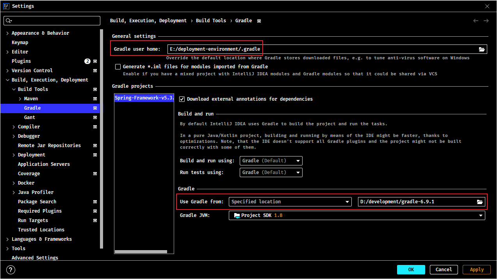

# Gradle 基础笔记

## 1. Gradle 简介

### 1.1. Gradle 简述

> 引用百度百科：radle是一个基于Apache Ant和Apache Maven概念的项目自动化构建开源工具。它使用一种基于Groovy的特定领域语言(DSL)来声明项目设置，目前也增加了基于Kotlin语言的kotlin-based DSL，抛弃了基于XML的各种繁琐配置。

### 1.2. 安装说明

- 官网：https://gradle.org/
- 下载：https://gradle.org/install/

> 引用官网的安装教程

```
Step 1. Download the latest Gradle distribution
The current Gradle release is version 6.0.1, released on 18 Nov 2019. The distribution zip file comes in two flavors:

Binary-only
Complete, with docs and sources
If in doubt, choose the binary-only version and browse docs and sources online.

Need to work with an older version? See the releases page.

Step 2. Unpack the distribution

Microsoft Windows users
Create a new directory C:\Gradle with File Explorer.

Open a second File Explorer window and go to the directory where the Gradle distribution was downloaded. Double-click the ZIP archive to expose the content. Drag the content folder gradle-6.0.1 to your newly created C:\Gradle folder.

Alternatively you can unpack the Gradle distribution ZIP into C:\Gradle using an archiver tool of your choice.

Step 3. Configure your system environment

Microsoft Windows users
In File Explorer right-click on the This PC (or Computer) icon, then click Properties -> Advanced System Settings -> Environmental Variables.

Under System Variables select Path, then click Edit. Add an entry for C:\Gradle\gradle-6.0.1\bin. Click OK to save.

Step 4. Verify your installation
Open a console (or a Windows command prompt) and run gradle -v to run gradle and display the version, e.g.:


$ gradle -v

------------------------------------------------------------
Gradle 6.0.1
------------------------------------------------------------
```

#### 1.2.1. 安装Gradle

下载 gradle，需要 JDK8 及以上的版本。解压Gradle压缩包到无中文与空格的目录

#### 1.2.2. 配置系统环境变量

1. 新建系统变量，定义变量名为`GRADLE_HOME`，变量值为gradle安装包所在目录，如：`D:\development\gradle-6.9.1\`


2. 添加到PATH环境变量中


3. 运行cmd模式下，使用`gradle -v`命令查看，出现以下信息证明安装成功


#### 1.2.3. 配置 Gradle 仓库源方式1 - 初始化配置文件

在Gradle安装目录下的 `init.d` 文件夹下，新建一个 `init.gradle` 文件，添加如下配置

```
allprojects {
    repositories {
        maven { url 'file:///D:/Java/maven_repository'}
        mavenLocal()
        maven { name "Alibaba" ; url "https://maven.aliyun.com/repository/public" }
        maven { name "Bstek" ; url "http://nexus.bsdn.org/content/groups/public/" }
        mavenCentral()
    }

    buildscript {
        repositories {
            maven { name "Alibaba" ; url 'https://maven.aliyun.com/repository/public' }
            maven { name "Bstek" ; url 'http://nexus.bsdn.org/content/groups/public/' }
            maven { name "M2" ; url 'https://plugins.gradle.org/m2/' }
        }
    }
}
```

默认情况下，Gradle 没有定义任何仓库，需要在使用外部依赖之前至少定义一个仓库，例如 Maven 中央仓库。

`repositories` 是配置获取 jar 包的顺序。以上配置是先是本地的 Maven 仓库路径；接着的 `mavenLocal()` 是获取 Maven 本地仓库的路径，是和第一条一样，但是不冲突；第三条和第四条是从国内和国外的网络上仓库获取；最后的 `mavenCentral()` 是从Apache提供的中央仓库获取 jar 包。

#### 1.2.4. 配置 Gradle 仓库源方式2（Gradle下载的文件/jar包） - 环境变量与方式（推荐）

增加一个环境变量`GRADLE_USER_HOME`，指定为想要存放的地方


- ~~修改gradle启动脚本，进入gradle安装的bin目录，使用文本编辑器打开`gradle.bat`文件，增加设置用户配置路径变量，在如图的位置添加以下语句~~（注：配置后无法使用全局命令，待研究）

```bash
set GRADLE_OPTS="-Dgradle.user.home=E:\deployment-environment\.gradle\"
```


#### 1.2.5. 配置 Gradle 仓库源方式3 - IDEA配置

在idea中修改gradle用户目录，打开设置(快捷键Ctrl+alt+S)，定位到Gradle菜单，作如下设置

- 将【Use Gradle From】选项改为【Specified location】，然后右侧就会出现一个框，选择Gradle安装目录（即将 `%GRADLE_HOME%` 的路径复制到这里即可）。如果是多模块项目，需要将每个模块都修改才可以。
- 修改【Gradle user home】，填写jar包保存路径（即复制环境变量中的【GRADLE_USER_HOME】的值）

这样 IDEA 的 Gradle 就配置好了。如果要更改 IDEA 的全局配置，在【Settings for New Projects】中配置即可，和 【Settings】的相似。



#### 1.2.6. 配置 Gradle 仓库源方式4 - 指定项目缓存目录

修改Gradle项目中的gradle.properties文件，增加以下语句。

```properties
gradle.user.home=E:\deployment-environment\.gradle\
```


> PS. 但这种方法，需要每个项目文件都要改一遍，如果只是临时修改，可以采用这种方法，如果是针对所有项目的，不建议这种方法.

## 2. 查询gradle相关命令

使用命令`gradle -?`或`gradle -h`或`gradle --help`查询gradle相关命令与说明

```console
-?, -h, --help            Shows this help message.
-a, --no-rebuild          Do not rebuild project dependencies.
-b, --build-file          Specify the build file.
--build-cache             Enables the Gradle build cache. Gradle will try to reuse outputs from previous builds.
-c, --settings-file       Specify the settings file.
--configure-on-demand     Configure necessary projects only. Gradle will attempt to reduce configuration time for large multi-project builds. [incubating]
--console                 Specifies which type of console output to generate. Values are 'plain', 'auto' (default), 'rich' or 'verbose'.
--continue                Continue task execution after a task failure.
-D, --system-prop         Set system property of the JVM (e.g. -Dmyprop=myvalue).
-d, --debug               Log in debug mode (includes normal stacktrace).
--daemon                  Uses the Gradle Daemon to run the build. Starts the Daemon if not running.
--foreground              Starts the Gradle Daemon in the foreground.
-g, --gradle-user-home    Specifies the gradle user home directory.
-I, --init-script         Specify an initialization script.
-i, --info                Set log level to info.
--include-build           Include the specified build in the composite.
-m, --dry-run             Run the builds with all task actions disabled.
--max-workers             Configure the number of concurrent workers Gradle is allowed to use.
--no-build-cache          Disables the Gradle build cache.
--no-configure-on-demand  Disables the use of configuration on demand. [incubating]
--no-daemon               Do not use the Gradle daemon to run the build. Useful occasionally if you have configured Gradle to always run with the daemon by default.
--no-parallel             Disables parallel execution to build projects.
--no-scan                 Disables the creation of a build scan. For more information about build scans, please visit https://gradle.com/build-scans.
--offline                 Execute the build without accessing network resources.
-P, --project-prop        Set project property for the build script (e.g. -Pmyprop=myvalue).
-p, --project-dir         Specifies the start directory for Gradle. Defaults to current directory.
--parallel                Build projects in parallel. Gradle will attempt to determine the optimal number of executor threads to use.
--priority                Specifies the scheduling priority for the Gradle daemon and all processes launched by it. Values are 'normal' (default) or 'low' [incubating]
--profile                 Profile build execution time and generates a report in the <build_dir>/reports/profile directory.
--project-cache-dir       Specify the project-specific cache directory. Defaults to .gradle in the root project directory.
-q, --quiet               Log errors only.
--refresh-dependencies    Refresh the state of dependencies.
--rerun-tasks             Ignore previously cached task results.
-S, --full-stacktrace     Print out the full (very verbose) stacktrace for all exceptions.
-s, --stacktrace          Print out the stacktrace for all exceptions.
--scan                    Creates a build scan. Gradle will emit a warning if the build scan plugin has not been applied. (https://gradle.com/build-scans)
--status                  Shows status of running and recently stopped Gradle Daemon(s).
--stop                    Stops the Gradle Daemon if it is running.
-t, --continuous          Enables continuous build. Gradle does not exit and will re-execute tasks when task file inputs change.
--update-locks            Perform a partial update of the dependency lock, letting passed in module notations change version. [incubating]
-v, --version             Print version info.
-w, --warn                Set log level to warn.
--warning-mode            Specifies which mode of warnings to generate. Values are 'all', 'summary'(default) or 'none'
--write-locks             Persists dependency resolution for locked configurations, ignoring existing locking information if it exists [incubating]
-x, --exclude-task        Specify a task to be excluded from execution.
```

## 3. 参考资料

- [Gradle 教程 - w3cschool](https://www.w3cschool.cn/gradle/)

