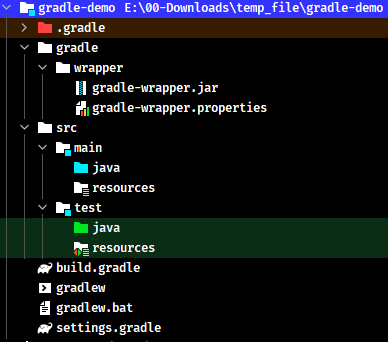

# Gradle 基础笔记

> 官网：https://gradle.org/

## 1. Gradle 简介

> 引用百度百科：Gradle是一个基于 Apache Ant 和 Apache Maven 概念的项目自动化构建开源工具。它使用一种基于 Groovy 的特定领域语言(DSL)来声明项目设置，目前也增加了基于 Kotlin 语言的 kotlin-based DSL，抛弃了基于 XML 的各种繁琐配置。

### 1.1. Gradle 的优势

- 依赖管理：即将项目中的 jar 包管理起来，可以使用 Maven 或者 Ivy 的远程仓库、或者本地文件系统等
- 编译打包：可以通过脚本实现花样打包，包括修改文件、添加抑或排除某些类或资源、采用指定 JDK 版本构建、打包后自动上传等等等等
- 多项目支持：Gradle 对多项目有着良好的支持，比如一个很具有代表性的实践就是 spring framework
- 多语言支持：无论是 java、groovy、scala、c++ 都有良好的支持
- 跨平台支持：gradle 是基于 jvm 的，只要有 jvm 就可以让 gradle 运行
- 灵活的的脚本：可以使用 groovy 灵活的编写任务完成你想要做的任何事情

### 1.2. 约定优于配置

约定优于配置(convention over configuration)，简单而言就是遵循一定的固定规则从而可以避免额外的配置。虽然这一定程度上降低了灵活性，但却能减少重复的额外配置，同时也可以帮助开发人员遵守一定的规则。当然，约定并不是强制性约束，Gradle 提供了各种灵活的途径可以让你更改默认的配置。

## 2. Gradle 安装说明

> 引用官网的安装教程

```
Step 1. Download the latest Gradle distribution
The current Gradle release is version 6.0.1, released on 18 Nov 2019. The distribution zip file comes in two flavors:

Binary-only
Complete, with docs and sources
If in doubt, choose the binary-only version and browse docs and sources online.

Need to work with an older version? See the releases page.

Step 2. Unpack the distribution

Microsoft Windows users
Create a new directory C:\Gradle with File Explorer.

Open a second File Explorer window and go to the directory where the Gradle distribution was downloaded. Double-click the ZIP archive to expose the content. Drag the content folder gradle-6.0.1 to your newly created C:\Gradle folder.

Alternatively you can unpack the Gradle distribution ZIP into C:\Gradle using an archiver tool of your choice.

Step 3. Configure your system environment

Microsoft Windows users
In File Explorer right-click on the This PC (or Computer) icon, then click Properties -> Advanced System Settings -> Environmental Variables.

Under System Variables select Path, then click Edit. Add an entry for C:\Gradle\gradle-6.0.1\bin. Click OK to save.

Step 4. Verify your installation
Open a console (or a Windows command prompt) and run gradle -v to run gradle and display the version, e.g.:


$ gradle -v

------------------------------------------------------------
Gradle 6.0.1
------------------------------------------------------------
```

### 2.1. 下载 Gradle

从 Gralde 官方网站下载 Gradle 的最新发行包，Gradle 发行包是一个 ZIP 文件。需要 JDK8 及以上的版本。解压 Gradle 压缩包到无中文与空格的目录

> 下载：https://gradle.org/install/

### 2.2. 配置系统环境变量

1. 新建系统变量，定义变量名为`GRADLE_HOME`，变量值为gradle安装包所在目录，如：`D:\development\gradle-6.9.1\`


2. 添加到 PATH 环境变量中


3. 运行cmd模式下，使用`gradle -v`命令查看，出现以下信息证明安装成功


### 2.3. 配置 Gradle 本地仓库（本地缓存）

配置 Gradle 本地仓库，用于下载与管理 jar 包，有如下几种配置方式

#### 2.3.1. 方式1：配置环境变量（推荐）

增加一个环境变量 `GRADLE_USER_HOME`，指定本地仓库的位置


> <font color=red>**注：变量的名称必须叫“`GRADLE_USER_HOME`”**</font>

#### 2.3.2. 方式2：初始化配置文件

在 Gradle 安装目录下的 `init.d` 文件夹下，新建一个 `init.gradle` 文件，添加如下配置

```groovy
allprojects {
    repositories {
        maven { url 'file:///D:/development/maven/repository' }
        mavenLocal()
        maven { name "Alibaba"; url "https://maven.aliyun.com/repository/public" }
        maven { name "Bstek"; url "http://nexus.bsdn.org/content/groups/public/" }
        mavenCentral()
    }

    buildscript {
        repositories {
            maven { name "Alibaba"; url 'https://maven.aliyun.com/repository/public' }
            maven { name "Bstek"; url 'http://nexus.bsdn.org/content/groups/public/' }
            maven { name "M2"; url 'https://plugins.gradle.org/m2/' }
        }
    }
}
```

默认情况下，Gradle 没有定义任何仓库，需要在使用外部依赖之前至少定义一个仓库，例如 Maven 中央仓库。`repositories` 是配置获取 jar 包的顺序。以上配置是

1. 先是本地的 Maven 仓库路径
2. `mavenLocal()` 是获取 Maven 本地仓库的路径，是和第一条一样，但是不冲突
3. 第三条和第四条是从国内和国外的网络上仓库获取
4. 最后的 `mavenCentral()` 是从Apache提供的中央仓库获取 jar 包

> <font color=red>**Tips：实际操作方式是 gradle 找到 maven 对应的 jar 包，然后复制到上面配置的环境变量 `GRADLE_USER_HOME` 中，所以当仓库是 gradle 和 maven 混合使用时，大概率会有两份数据冗余**</font>

#### 2.3.3. 方式3：在 gradle 启动脚本设置本地仓库位置

~~进入 gradle 安装的 bin 目录，使用文本编辑器打开 gradle 启动脚本 `gradle.bat`，增加设置用户配置路径变量，在如图的位置添加以下语句~~（注：配置后无法使用全局命令，待研究）

```bash
set GRADLE_OPTS="-Dgradle.user.home=E:\deployment-environment\.gradle\"
```


#### 2.3.4. 方式4：IDEA 专用配置

在 idea 中修改 gradle 用户目录，此方式只适用于使用 idea 进行开发。

在某个项目打开设置(快捷键Ctrl+alt+S)，定位到 Gradle 菜单，做如下设置：

- 将【Use Gradle From】选项改为【Specified location】，然后右侧就会出现一个框，选择 Gradle 安装目录（即将 `%GRADLE_HOME%` 的路径复制到这里即可）。如果是多模块项目，需要将每个模块都修改才可以。
- 修改【Gradle user home】，填写jar包保存路径（即复制环境变量中的【`GRADLE_USER_HOME`】的值）。**注：如果配置与环境变量不同的目录，会覆盖默认的 gradle 本地仓库**

这样 IDEA 的 Gradle 就配置好了。


如果要更改 IDEA 的全局配置，选择【File】->【New Projects Setup】->【Settings for New Projects...】，和 【Settings】的相似，配置【Gradle user home】即可

#### 2.3.5. 方式5：对指定项目设置缓存目录（不建议）

此方式适用指定某个项目的本地仓库缓存目录。修改 Gradle 项目中的 gradle.properties 文件，增加以下语句。

```properties
gradle.user.home=E:\deployment-environment\.gradle\
```


> PS. 但这种方法，需要每个项目文件都要改一遍，如果只是临时修改，可以采用这种方法，如果是针对所有项目的，不建议这种方法.

## 3. build.gradle 构建脚本

### 3.1. 配置说明

build.gradle 是 Gradle 的构建脚本，包含如下内容（其中标明可选的都是可以不用配置）

- 插件引入：声明项目所需的插件
- 属性定义(可选)：定义扩展属性
- 局部变量(可选)：定义局部变量
- 属性修改(可选)：指定 project 自带属性
- 仓库定义：指明要从哪些仓库下载 jar 包
- 依赖声明：声明项目中需要哪些依赖
- 自定义任务(可选)：自定义一些任务

基础示例如下：

```groovy
// 定义扩展属性(给脚本用的脚本)
buildScript {
    repositories {
        mavenCentral()
    }
}

// 应用插件，这里引入了 Gradle 的 Java 插件,此插件提供了 Java 构建和测试所需的一切
plugins {
    id 'java'
}

// 定义项目属性(可选)
group 'com.moon'
version '1.0-SNAPSHOT'

/*
 * 指定 gradle 项目使用的仓库
 * 以下配置表示，先从本地仓库寻找依赖，如果没有再从中仓库下载
 * 如果只配置中央仓库，表示直接从中央仓库下载jar包。但是如果指定下载的位置已经有了，就不会再次下载了。
 */
repositories {
    // 添加 maven 本地仓库
    mavenLocal()
    // 添加 maven 远程中央仓库
    mavenCentral()
}

/*
 * 项目所有 jar 包的依赖在 dependencies 中定义
 * 每一个 jar 包的坐标都有三个基本元素组成（group，name，version）
 * 添加依赖坐标时，需要声明 jar 包的作用域，如：compile、runtime、testCompile、testRuntime
 */
dependencies {
    testImplementation 'org.junit.jupiter:junit-jupiter-api:5.7.0'
    testRuntimeOnly 'org.junit.jupiter:junit-jupiter-engine:5.7.0'
    // 方式1: 通过 map 结构来描述依赖。分别是 group，name，version
    // compile group: 'org.springframework', name: 'spring-context', version: '5.3.19'
    // 方式2: 通过字符串简写方式描述依赖，组成结构是：'group:name:version:classifier@extension'，如版本号使用“+”加号代表了最新版本
    compile 'org.springframework:spring-context:5.3.19'
}

test {
    useJUnitPlatform()
}

// 自定义任务(可选)。此处是配置项目编译的编码方式
tasks.withType(JavaCompile) {
    options.encoding = "utf-8"
}

// 定义扩展属性(可选)
ext {
    foo = "foo"
}
// 定义局部变量(可选)
def bar = "bar"
```

### 3.2. Gradle 插件

Gradle 是一个通用工具。它可以通过脚本构建任何你想要实现的东西，真正实现开箱即用，但前提是需要在脚本中编写好代码。

Gradle 在提供了一些小但有用的功能，用于实现自动化功能。所有功能（例如以能够编译 Java 代码），都是通过插件进行添加的。插件就是 Gradle 的扩展，简而言之就是为项目添加一些非常有用的默认配置。Gradle 自带了很多插件，把插件应用到项目中可以让插件来扩展项目的功能。它可以做的事情如：

- 将任务添加到项目（如编译、测试）
- 使用有用的默认设置对已添加的任务进行预配置
- 向项目中添加依赖配置
- 通过扩展对现有类型添加新的属性和方法

#### 3.2.1. Java 插件

Java plugin 作为 Gradle 插件其中之一，提供了如编译，测试，打包等一些功能。

修改项目的 build.gradle 文件的 `plugins` 选项，配置项目插件。语法如下：

```groovy
plugins {
    id «plugin id»
    id «plugin id» version «plugin version» [apply «false»]
}
```

> 注：
>
> - 第1种：用于引用核心 Gradle 插件或已经提供给构建脚本的插件
> - 第2种：用于需要解决的二进制 Gradle 插件

示例：配置 java 插件

```groovy
plugins {
    id 'java'
}
```

示例：配置多个插件

```groovy
plugins {
    id 'java'
    id 'war'
    id 'com.example.goodbye' version '1.0.0' apply false
}
```

### 3.3. 添加 Maven 仓库

通常，一个 Java 项目拥有许多外部依赖，因此需要配置 Gradle 中 Jar 包存储的仓库位置。下面是以 Maven 仓库为例的配置，修改项目的 build.gradle 文件的 `repositories` 选项：

```groovy
/*
 * 指定 gradle 项目使用的仓库
 */
repositories {
    // 添加 maven 本地仓库
    mavenLocal()
    // 添加 maven 远程中央仓库
    mavenCentral()
    // 以上配置表示，先从本地仓库寻找依赖，如果没有再从中仓库下载
    // 如果只配置中央仓库，表示直接从中央仓库下载jar包。但是如果指定下载的位置已经有了，就不会再次下载了。
}
```

### 3.4. 依赖管理

依赖管理包括两部分，对项目依赖的管理以及发布项目的管理

- 项目依赖是指构建项目所需的构件（jar包等）
- 发布项目是指项目产出的需要上传的项目产物

#### 3.4.1. 声明依赖

##### 3.4.1.1. 依赖坐标基础语法

仓库中构件（jar包）的坐标语法如下：

```groovy
// 方式1:
configurationName group: 'xxx', name: 'xxx', version: 'x.x'
// 方式2:
configurationName 'group:name:version:classifier@extension'
```

参数解析：

|       参数名称       |                                          描述                                           |
| ------------------- | --------------------------------------------------------------------------------------- |
| `configurationName` | 依赖的作用范围                                                                          |
| `group`             | 通常用来描述组织、公司、团队或者其它有象征代表意义的名字，相当于maven坐标的`groupId`       |
| `name`              | 依赖的名称。相当于maven坐标的`artifactId`                                                |
| `version`           | 版本号                                                                                  |
| `classifier`        | 类库版本，在前三项相同的情况下，如果目标依赖还存在对应不同JDK版本的版本，可以通过此属性指明 |
| `extension`         | 依赖的归档类型，如aar、jar等，默认不指定的话是jar                                         |

声明依赖是在项目的 build.gradle 文件中 `dependencies` 选项，添加项目需要的依赖，并声明 jar 包的作用域

```groovy
/*
 * 项目所有 jar 包的依赖在 dependencies 中定义
 * 每一个 jar 包的坐标都有三个基本元素组成（group，name，version）
 * 添加依赖坐标时，需要声明 jar 包的作用域，如：compile、runtime、testCompile、testRuntime
 */
dependencies {
    testImplementation 'org.junit.jupiter:junit-jupiter-api:5.7.0'
    testRuntimeOnly 'org.junit.jupiter:junit-jupiter-engine:5.7.0'
    compile group: 'org.springframework', name: 'spring-context', version: '5.0.2.RELEASE'
}
```

##### 3.4.1.2. 采用变量统一控制版本号

```groovy
dependencies {
    def bootVersion = "2.5.8"
    compile     "org.springframework.boot:spring-boot-starter-web:${bootVersion}",  
                "org.springframework.boot:spring-boot-starter-data-jpa:${bootVersion}",
                "org.springframework.boot:spring-boot-starter-tomcat:${bootVersion}"
}
```

##### 3.4.1.3. 自动获取最新版本依赖

如果需要某个库每次构建时都检查是否有新版本，将版本号修改为“`+`”即可，让 Gradle 在每次构建时都检查并应用最新版本的依赖。

```groovy
dependencies {
    compile     "org.springframework.boot:spring-boot-starter-web:+"
}
```

#### 3.4.2. 依赖作用范围

在引入依赖时，需要声明依赖的作用范围，关于各种作用范围的见下表：

|    依赖范围名称    |                                                                                               说明                                                                                               |
| ----------------- | ------------------------------------------------------------------------------------------------------------------------------------------------------------------------------------------------ |
| `compileOnly`     | 2.12版本后新增，曾叫`provided`，后续版本改成了`compileOnly`，由java插件提供，适用于编译期需要而不需要打包的情况                                                                                       |
| `providedCompile` | war插件提供的范围类型:与`compile`作用类似，但不会被添加到最终的war包中这是由于编译、测试阶段代码需要依赖此类jar包，而运行阶段容器已经提供了相应的支持，所以无需将这些文件打入到war包中了。例如Servlet API |
| `api`             | 3.4版本以后由java-library提供。当其他模块依赖于此模块时，此模块使用`api`声明的依赖包是可以被其他模块使用                                                                                              |
| `implementation`  | 3.4版本以后由java-library提供。当其他模块依赖此模块时，此模块使用`implementation`声明的依赖包只限于模块内部使用，不允许其他模块使用。                                                                  |
| `compile`         | 编译时依赖，同时依赖也会被打包                                                                                                                                                                     |
| `providedRuntime` | 同`proiveCompile`类似                                                                                                                                                                            |
| `runtime`         | 在运行和测试系统的时候依赖，但在编译的时候不依赖                                                                                                                                                    |
| `testCompile`     | 用于编译测试的其他依赖                                                                                                                                                                            |
| `testRuntime`     | 只用于运行测试的其他依赖                                                                                                                                                                          |
| `archives`        | 由本项目生产的构件（如jar包）                                                                                                                                                                      |
| `default`         | 本项目上的默认项目依赖配置。包含本项目运行时所需要的构件和依赖                                                                                                                                       |

> tip: 需要注意的是，`provided` 范围内的传递依赖也不会被打包

#### 3.4.3. 依赖的分类

##### 3.4.3.1. 外部依赖

Gradle 支持通过 map 方式或者 `g:a:v` 的简写方式传入依赖描述，这些声明依赖会去配置的 `repository` 查找

```groovy
dependencies {
 // 采用map方式传入单个
  compile group: 'commons-lang', name: 'commons-lang', version: '2.6'
 // 采用map方式传入多个
  compile(
      [group: 'org.springframework', name: 'spring-core', version: '2.5'],
      [group: 'org.springframework', name: 'spring-aop', version: '2.5']
  )
  // 采用简写方式声明
  compile 'org.projectlombok:lombok:1.16.10' 
  // 采用简写方式传入多个 
  compile 'org.springframework:spring-core:2.5',
          'org.springframework:spring-aop:2.5'
}
```

##### 3.4.3.2. 项目依赖

此类依赖用多模块项目，语法如下：

```groovy
dependencies {
    compile project(':project-foo')
}
```

> 注：其中 `:` 是基于跟项目的相对路径描述符

##### 3.4.3.3. 文件依赖

依赖存在于本地文件系统中，即中央仓库与私服都没有的jar，，可以通过 `FileCollection` 接口及其子接口提供的方法加载这些依赖（支持文件通配符）

```groovy  
dependencies {
    // 指定多个依赖
    compile files('hibernate.jar', 'libs/spring.jar')

    // 读取lib文件夹下的全部文件作为项目依赖
    compile fileTree('libs')

    // 根据指定基准来加载依赖。分别是目录（dir）、包含（include）、排除条件（exclude）
    compile fileTree(dir: 'libs', include: 'spring*.jar', exclude: 'hibernate*.jar')
}
```

##### 3.4.3.4. 内置依赖

跟随 Gradle 发行包或者基于 Gradle API 的一些依赖，通常在插件开发时使用，当前提供了如下三种：

```groovy  
dependencies {
    // 加载Gradle自带的groovy作为依赖
    compile localGroovy()

    // 使用Gradle API作为依赖
    compile gradleApi()

    // 使用 Gradle test-kit API 作为依赖
    testCompile gradleTestKit()
}
```

#### 3.4.4. 传递依赖

传递依赖特性可以通过 `transitive` 参数进行开启或关闭，也可以采用添加 `@jar` 的方式忽略该依赖的所有传递性依赖。

```groovy
compile('com.android.support:support-v4:23.1.1'){
    transitive = false
}
```

```groovy
compile 'com.android.support:support-v4:23.1.1'@jar
```

全局性的关闭依赖的传递特性

```groovy
configurations.all {
    transitive = false
}
```

#### 3.4.5. 排除依赖

如需要排除一些传递性依赖中的某个模块，可以通过 `exclude` 来实现。`exclude` 可以接收 `group` 和 `module` 两个参数：

```groovy
dependencies {
    compile('com.github.nanchen2251:CompressHelper:1.0.5') {
        // 排除 com.android.support:appcompat-v7:23.1.1
        exclude group: 'com.android.support' // 排除组织依赖
        exclude module: 'appcompat-v7' // 排除模块依赖
    }
}
```

## 4. Gradle Java 项目构建

### 4.1. 创建 Java 项目（IDEA）

创建 Gradle 项目，选择 JDK 与相应的项目语言


修改项目的 build.gradle 配置，添加一些测试代码进行测试

> 示例工程：java-technology-stack\java-stack-gradle\gradle-java

### 4.2. Gradle 基础的目录结构

#### 4.2.1. 标准结构

Gradle 遵循 COC(convention over configuration 约定优于配置)的理念，默认情况下提供了与 maven 相同的项目结构配置。使用 IDEA 创建 Gradle 项目成功后，项目的基础目录结构如下：



```
gradle-demo
    ├──gradle
    |   └──wrapper
    |        ├──gradle-wrapper.jar
    |        └──gradle-wrapper.properties # Gradle 项目构建脚本使用的变量
    ├──src
    |   ├──main
    |   |   ├──java       # 项目源代码目录
    |   |   ├──resources  # 项目配置文件目录
    |   |   └──webapp     # web 工程放置页面元素
    |   └──test
    |       ├──java       # 单元测试代码目录
    |       └──resources  # 测试配置文件目录
    ├──build.gradle       # Gradle 项目构建配置
    ├──gradlew            # Gradle 项目构建脚本（linux 系统）
    ├──gradlew.bat        # Gradle 项目构建脚本（windows 系统）
    └──settings.gradle    # Gradle 项目信息配置
```

#### 4.2.2. 非标准结构配置

在一些老项目上，可能目录结构并不是标准结构，然而一般开发人员又不好进行结构调整。此时可以通过修改 build.gradle 配置文件中的 `sourceSet` 项来指定目录结构

```groovy
sourceSets {
    main {
        java {
            srcDir 'src/java'
        }
        resources {
            srcDir 'src/resources'
        }
    }
}
```

或者

```groovy
sourceSets {
    main.java.srcDirs = ['src/java']
    main.resources.srcDirs = ['src/resources']
}
```

### 4.3. 创建 web 项目

与创建普通 java 项目一样，只需要在 src 目录下多新增一个 webapp 目录，然后再 build.gradle 配置中增加 war 包的插件

```groovy
plugins {
    id 'java'
    id 'war'
}

group 'com.moon'
version '1.0-SNAPSHOT'

repositories {
    mavenLocal()
    mavenCentral()
}

dependencies {
    compile group: 'org.springframework', name: 'spring-webmvc', version: '5.3.19'
    compile group: 'javax.servlet', name: 'javax.servlet-api', version: '4.0.1'
    compileOnly 'javax.servlet.jsp:javax.servlet.jsp-api:2.3.3'
}

test {
    useJUnitPlatform()
}
```

修改项目的 build.gradle 配置，添加一些测试代码进行测试

> 示例工程：java-technology-stack\java-stack-gradle\gradle-web

### 4.4. 创建多模块项目

#### 4.4.1. 创建父模块

与创建普通的项目一样，为了让其他子模块共享公共的配置，需要将配置放到 `allprojects` 闭包中

```groovy
allprojects {
    plugins {
        id 'java'
    }

    group 'com.moon'
    version '1.0-SNAPSHOT'

    sourceCompatibility = 1.8

    repositories {
        mavenLocal();
        mavenCentral()
    }

    dependencies {
        compile group: 'org.springframework', name: 'spring-webmvc', version: '5.3.19'
        compile group: 'javax.servlet', name: 'javax.servlet-api', version: '4.0.1'
        compile 'javax.servlet.jsp:javax.servlet.jsp-api:2.3.3'
    }
}
```

创建相应的子模块后，会在父工程的 settings.gradle 文件中引入相应的模块名称

```groovy
rootProject.name = 'gradle-multiple-modules'
include 'gradle-multiple-dao'
include 'gradle-multiple-service'
include 'gradle-multiple-web'
```

#### 4.4.2. 子模块配置

在子模块中，可以将父工程所配置公共部分删除，只需配置该模块独有的配置即可

如果某个子模块需要依赖其他子模块，只需要修改 build.gradle 文件通过 `dependencies` 引入即可，如：

```groovy
dependencies {
    compile project(":gradle-multiple-dao")
}
```

添加一些简单的业务代码进行测试

> 示例工程：java-technology-stack\java-stack-gradle\gradle-multiple-modules

## 5. 其他

### 5.1. 查询 gradle 相关命令

使用命令`gradle -?`或`gradle -h`或`gradle --help`查询gradle相关命令与说明

```console
-?, -h, --help            Shows this help message.
-a, --no-rebuild          Do not rebuild project dependencies.
-b, --build-file          Specify the build file.
--build-cache             Enables the Gradle build cache. Gradle will try to reuse outputs from previous builds.
-c, --settings-file       Specify the settings file.
--configure-on-demand     Configure necessary projects only. Gradle will attempt to reduce configuration time for large multi-project builds. [incubating]
--console                 Specifies which type of console output to generate. Values are 'plain', 'auto' (default), 'rich' or 'verbose'.
--continue                Continue task execution after a task failure.
-D, --system-prop         Set system property of the JVM (e.g. -Dmyprop=myvalue).
-d, --debug               Log in debug mode (includes normal stacktrace).
--daemon                  Uses the Gradle Daemon to run the build. Starts the Daemon if not running.
--foreground              Starts the Gradle Daemon in the foreground.
-g, --gradle-user-home    Specifies the gradle user home directory.
-I, --init-script         Specify an initialization script.
-i, --info                Set log level to info.
--include-build           Include the specified build in the composite.
-m, --dry-run             Run the builds with all task actions disabled.
--max-workers             Configure the number of concurrent workers Gradle is allowed to use.
--no-build-cache          Disables the Gradle build cache.
--no-configure-on-demand  Disables the use of configuration on demand. [incubating]
--no-daemon               Do not use the Gradle daemon to run the build. Useful occasionally if you have configured Gradle to always run with the daemon by default.
--no-parallel             Disables parallel execution to build projects.
--no-scan                 Disables the creation of a build scan. For more information about build scans, please visit https://gradle.com/build-scans.
--offline                 Execute the build without accessing network resources.
-P, --project-prop        Set project property for the build script (e.g. -Pmyprop=myvalue).
-p, --project-dir         Specifies the start directory for Gradle. Defaults to current directory.
--parallel                Build projects in parallel. Gradle will attempt to determine the optimal number of executor threads to use.
--priority                Specifies the scheduling priority for the Gradle daemon and all processes launched by it. Values are 'normal' (default) or 'low' [incubating]
--profile                 Profile build execution time and generates a report in the <build_dir>/reports/profile directory.
--project-cache-dir       Specify the project-specific cache directory. Defaults to .gradle in the root project directory.
-q, --quiet               Log errors only.
--refresh-dependencies    Refresh the state of dependencies.
--rerun-tasks             Ignore previously cached task results.
-S, --full-stacktrace     Print out the full (very verbose) stacktrace for all exceptions.
-s, --stacktrace          Print out the stacktrace for all exceptions.
--scan                    Creates a build scan. Gradle will emit a warning if the build scan plugin has not been applied. (https://gradle.com/build-scans)
--status                  Shows status of running and recently stopped Gradle Daemon(s).
--stop                    Stops the Gradle Daemon if it is running.
-t, --continuous          Enables continuous build. Gradle does not exit and will re-execute tasks when task file inputs change.
--update-locks            Perform a partial update of the dependency lock, letting passed in module notations change version. [incubating]
-v, --version             Print version info.
-w, --warn                Set log level to warn.
--warning-mode            Specifies which mode of warnings to generate. Values are 'all', 'summary'(default) or 'none'
--write-locks             Persists dependency resolution for locked configurations, ignoring existing locking information if it exists [incubating]
-x, --exclude-task        Specify a task to be excluded from execution.
```

### 5.2. 参考资料

- [Gradle 教程 - w3cschool](https://www.w3cschool.cn/gradle/)
- [gradle使用教程，一篇就够](https://www.jianshu.com/p/7ccdca8199b8)
- [Gradle的使用教程](https://blog.csdn.net/shuair/article/details/107319204)
