# Git 笔记

## 1. Git 概述

### 1.1. Git 简介与特点

Git是分布式的版本控制工具，其特点如下：

- 速度快
- 简单的设计
- 对非线性开发模式的强力支持（允许上千个并行开发的分支）
- 完全分布式
- 有能力高效管理类似 Linux 内核一样的超大规模项目（速度快和数据多）

### 1.2. Git与SVN对比

#### 1.2.1. SVN

SVN是<font color=red>**集中式版本控制软件**</font>，版本库是集中放在中央服务器的。每个程序员使用自己电脑，首先要从中央服务器哪里得到最新的版本，编程完将完成的代码推送到中央服务器。集中式版本控制系统是必须联网才能工作

标准的集中式版本控制工具管理方式：

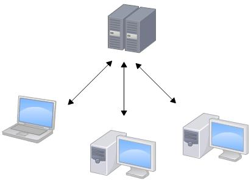

集中管理方式在一定程度上看到其他开发人员在干什么，而管理员也可以很轻松掌握每个人的开发权限。但是相较于其优点而言，集中式版本控制工具缺点很明显：

1. 服务器单点故障
2. 容错性差

<font color=red>每天都同步一次即可，需要手动同步上传代码</font>

#### 1.2.2. Git

Git是<font color=red>**分布式版本控制软件**</font>，它可以没有中央服务器，每个人的电脑就是一个完整的版本库。工作的时候就不需要联网了，因为版本都是在自己的电脑上。当多人开发时，只需把各自的修改推送到远程仓库，就可以所有成员都可以看到修改了。

分布式版本控制工具管理方式：

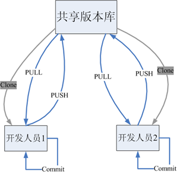

### 1.3. Git 工作流程

1. 从远程仓库中克隆 Git 资源作为本地仓库。
2. 从本地仓库中checkout代码然后进行代码修改
3. 在提交前先将代码提交到暂存区。
4. 提交修改。提交到本地仓库。本地仓库中保存修改的各个历史版本。
5. 在修改完成后，需要和团队成员共享代码时，可以将代码push到远程仓库。

Git 的工作流程图


## 2. Git 安装

### 2.1. Git 下载网址

Git下载网址：https://git-scm.com/download

> 笔记使用的版本：
>
> - window版本：Git-2.16.2-64-bit.exe
> - linux版本：git-2.16.2.tar.gz

### 2.2. Git 相关图形化客户端

- Git 第三方 GUI Clients 官方推荐整理：https://git-scm.com/downloads/guis
- Sourcetree 网址：https://www.sourcetreeapp.com/
    - 使用教程：http://blog.cocoachina.com/article/71732
- GitHub Desktop 网址：https://desktop.github.com/
- TortoiseGit 网址：https://tortoisegit.org/
- Git Extensions 网址：https://gitextensions.github.io/

### 2.3. window版 git 安装

> 示例使用Git-2.23.0-64-bit.exe

- 选择软件的安装位置

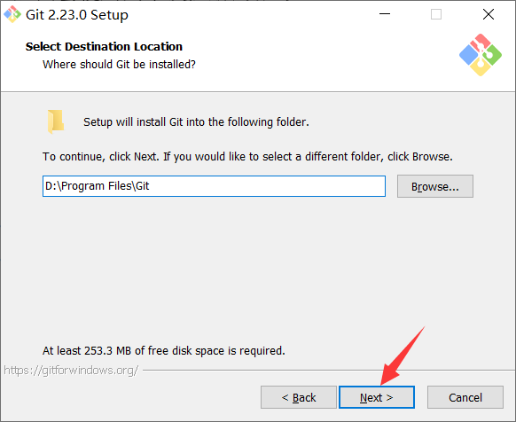

- 选择需安装的组件（默认即可，直接下一步）

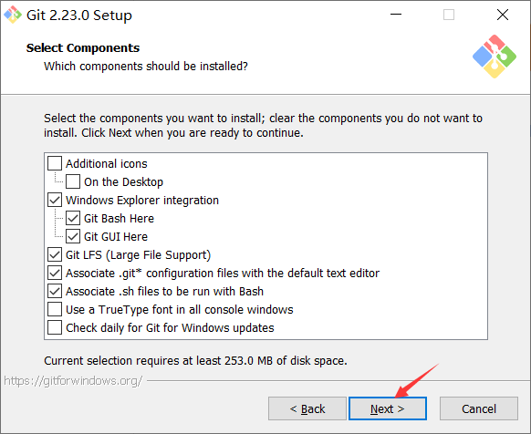

- 选择使用的编辑器（默认即可，直接下一步）

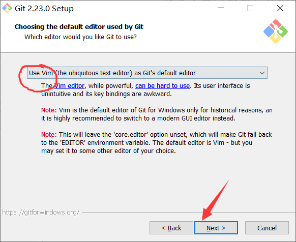

- 环境变量调整

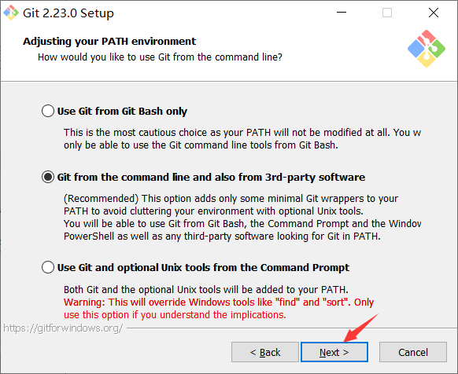

- 选择使用OpenSSH

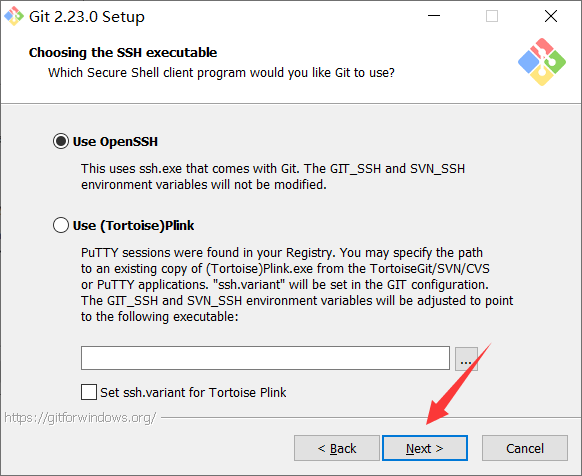

- 使用OpenSSL库


- 配置命令行会话（默认即可）

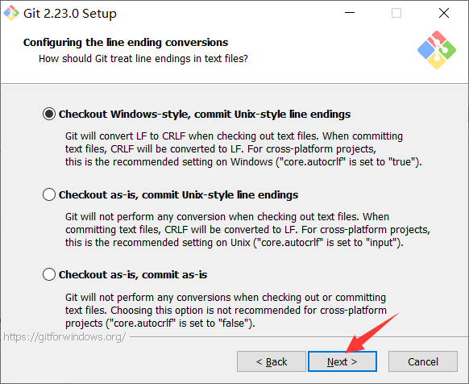

- 配置终端（默认即可）

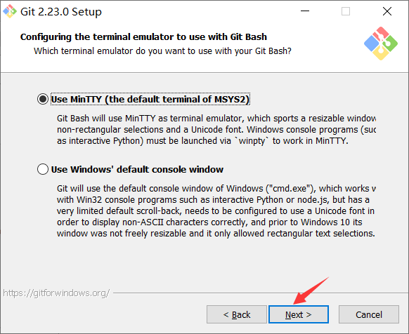

- 配置额外的选项（默认即可）

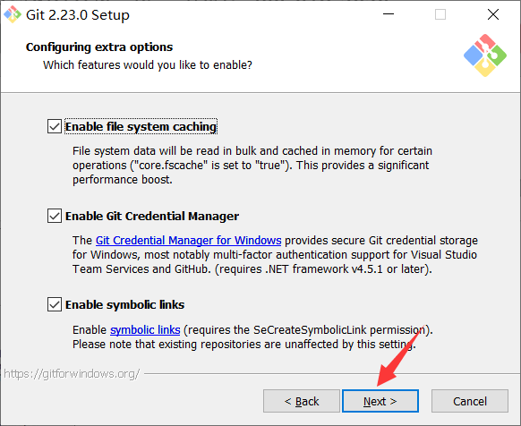

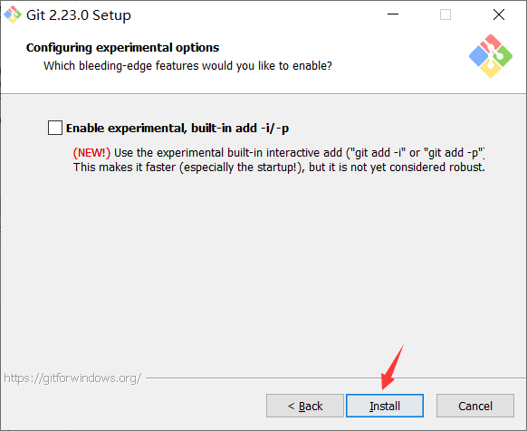

- 安装完成

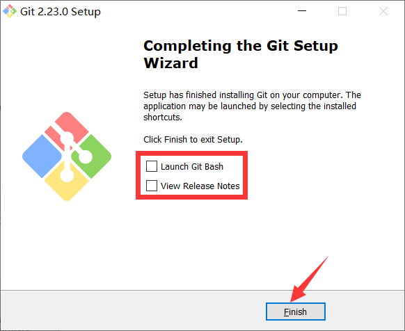

- 验证是否安装成功。打开右键菜单，若出现“Git GUI Here”、“Git Bash Here”则代表安装成功

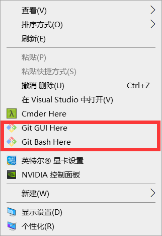

或者命令窗口，输入`git --version`查看git的版本

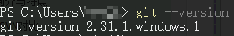

## 3. Git 配置

在安装好后首次使用前，需要先进行全局配置

### 3.1. 配置全局的用户信息

在空白位置打开右键菜单，点击【Git Bash Here】，打开Git命令行窗口。输入以下命令配置全局的用户名与邮箱

```bash
$ git config --global user.name "用户名"
$ git config --global user.email "邮箱地址"
```

查看当前全局的配置

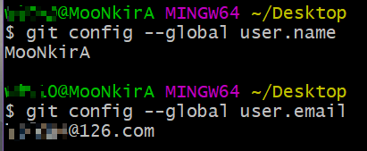

## 4. Git 常用操作命令

### 4.1. 本地仓库初始化

在空的目录中，执行以下命令，初始化git仓库，即由git来管理此目录

```bash
$ git init
```

> 执行之后会在项目目录下创建【.git】的隐藏目录，这个目录是Git所创建的，不能删除，也不能随意更改其中的内容。

### 4.2. 查看仓库当前状态

用于查询当前仓库中有那些文件存在变动

```bash
$ git status
```

### 4.3. 添加文件到缓存区

`git add` 指令，用于添加单个（多个）文件到缓存区。

添加单个文件

```bash
$ git add 文件名
```

同时添加多个文件

```bash
$ git add 文件名1 文件名2 文件名3 …
```

添加当前目录中所有文件到缓存区。

```bash
$ git add .
```

### 4.4. 提交至版本库

`git commit` 指令，将当前缓存区的内容提交到版本库。`-m` 参数用于指定本次提交的注释。**注意：注释的内容必须使用`""`英文双引号包裹**

```bash
$ git commit -m "注释内容"
```

### 4.5. 查看版本

`git log` 指令，用于查看当前git的提交记录（版本）

```bash
$ git log
```

参数 `--pretty=oneline`，将每个git的提交记录在一行显示

```bash
$ git log --pretty=oneline
```

### 4.6. 版本回退

`git reset` 指令用于版本的回退

```bash
$ git reset --hard 提交编号
```

> 注：”提交编号“是通过 `git log` 指令查看
>
> 在使用回退指令的时候 commit id 可以不用写全，git会自动识别，但是至少需要写前4位字符

### 4.7. 查看历史版本

如果发生版本回退的操作，此时使用`git log`就无法查询回退到此版本之前的操作记录，所以需要使用 `git reflog` 指令来查看历史操作，获取最新的 commit id

```bash
$ git reflog
```

### 4.8. 克隆远程仓库到本地

`clone` 指令用于克隆远程仓库到本地

```bash
$ git clone 远程仓库地址
```

> 注：远程仓库分两种，基于http/https协议或者基于ssh协议

### 4.9. 推送到远程仓库

`push` 指令用于将修改的版本推送到远程仓库

```bash
$ git push
```

基于http/https协议的远程仓库，首次提交时可能会出现403无权限的错误，需要修改【.git/config】文件内容，增加相应远程仓库的有效的用户名与密码

```
# 原配置
[remote "origin"]
	url = https://github.com/用户名/仓库名.git

# 修改为
[remote "origin"]
	url = https://用户名:密码@github.com/用户名/仓库名.git
```

> 注：推送到基于ssh协议的远程仓库，在push的时候并没有提示要求输入帐号密码，因为公私玥已经实现了用户身份鉴权，也不需要修改此配置文件。

### 4.10. 拉取版本

`pull` 指令用于拉取远程仓库的版本记录。

```bash
$ git pull
```

> 拉取时如果出现版本冲突，需要手动进行冲突的合并

## 5. 分支管理命令

### 5.1. 查看分支

```bash
$ git branch
```

> 注意：当前的分支前面有个标记“`*`”。

### 5.2. 创建分支

```bash
$ git branch 分支名
```

### 5.3. 切换分支

```bash
$ git checkout 分支名
```

### 5.4. 删除分支

```bash
$ git branch -d 分支名
```

> 注意：在删除分支的时候，一定要先退出要删除的分支（或切换到其他分支），然后才能删除该分支。

### 5.5. 合并分支

```bash
$ git merge 被合并的分支名
```

合并分支需要先使用 `checkout` 切换到待合并到的分支，然后再使用 `merge` 指令指定要合并的分支。<font color=red>**需要注意：合并所有分支之后，需要使用 `push` 指令推送到远程仓库中**</font>

## 6. git 仓库的特殊文件

### 6.1. `.gitkeep`文件

`.gitkeep`文件是用来保证当前目录即使为空，也会上传到github上

### 6.2. .gitignore 忽略规则文件（待整理）

`.gitignore` 的文件用于声明忽略文件或不忽略文件的规则，**规则对当前目录及其子目录生效**。

> 注意：该文件因为没有文件名，没办法直接在windows目录下直接创建（*win10系统后来一些版本可以直接创建没有文件名的文件*），可以通过命令行 Git Bash 来 `touch` 指令来创建。

# Git 扩展知识

## 1. git上的分支命名规范

### 1.1. git常用分支说明

- `master`
    - 主分支，永远是可用的、稳定的、可直接发布的版本，不能直接在该分支上开发。只有计划发布的版本功能在`develop`分支上全部完成，而且测试没有问题了才会合并到`master`上。
- `develop`
    - 开发主分支，代码永远是最新，所有新功能以这个分支来创建自己的开发分支，该分支只做只合并操作，不能直接在该分支上开发
    - 例如要开发一个注册功能，那么就会从`develop`分支上创建一个`feature`分支`fb-register`，在`fb-register`分支上将注册功能完成后，将代码合并到`develop`分支上。这个`fb-register`就完成了它的使命，可以删除了。如果再需要开发一个登录功能，按刚刚上述操作流程再次进行
- `feature-xxx`
    - 功能开发分支，在`develop`上创建分支，以自己开发功能模块命名，功能测试正常后合并到`develop`分支
- `release`
    - 预分布分支，在合并好`feature`分支的`develop`分支上创建，主要是用来测试bug的分支，修改好bug并确定稳定之后合并到`develop`和`master`分支，然后发布`master`分支
- `release-fix`
    - 功能bug修复分支，在`release`上创建分支修复，修复好测试出来的bug之后合并回`release`分支。
- `hotfix-xxx`
    - 紧急bug修改分支，项目上线之后可以会遇到一些环境问题需要紧急修复，在`master`分支上创建，流程跟`release`分支相似，修复完成后合并到`develop`和`master`分支

**开发项目时git分支管理流程图**

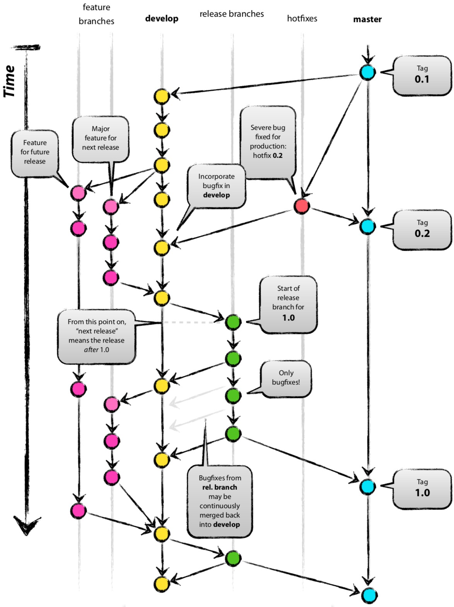

***注意事项：***

- 一个分支尽量开发一个功能模块，不要多个功能模块在一个分支上开发。
- 开发过程中，如果组员A开发的功能依赖组员B正在开发的功能，可以待组员B开发好相关功能之后，组员A直接pull组员B的分支下来开发，不需要先将组员B的分支merge到develop分支。
- feature 分支在申请合并之前，最好是先 pull 一下 develop 主分支下来，看一下有没有冲突，如果有就先解决冲突后再申请合并。

### 1.2. git分支命名规范

```
分支:		命名:		说明:

主分支		master		主分支，所有提供给用户使用的正式版本，都在这个主分支上发布
开发分支		dev 		开发分支，永远是功能最新最全的分支
功能分支		feature-*	新功能分支，某个功能点正在开发阶段
发布版本		release-*	发布定期要上线的功能
修复分支		bug-*		修复线上代码的 bug
```

## 2. git提交规范

### 2.1. 中文式提交格式参考

```
<新功能|bug修复|文档改动|格式化|重构|测试代码>: (影响范围) <主题>
# 解释为什么要做这些改动
issue #?
```

### 2.2. 提交类型

- 关于commit时类别，一般通用的如下
    - feat：新功能（feature）
    - fix：修复bug
    - docs：文档（documentation）发动
    - style：格式（不影响代码运行的变动），如格式化，缺失分号等，但不包括生产时紧急的bug修复
    - refactor：重构（即不是新增功能，也不是修改bug的代码变动）
    - perf：代码优化
    - test：增加测试
    - build：构建工具或外部依赖的更改，比如后端maven，前端package，json等
    - ci：更改项目级的配置文件或脚本
    - chore：构建过程或辅助工具的变动，除上面之外的修改
    - revert：撤销先前的提交

### 2.3. 提交注释示例

```
<类型>: <主题>

# 解释为什么要做这些改动（限制每行72个字）

# ----------------------------------------------
# 注意：
# 1. 提交模板的内容，如果最左侧带"#"，内容不会提交到git中
# 2. 主题和内容以一个空行分隔
# 3. 主题限制为最大50个字
# 4. 主题行结束不用标点
# 5. 内容每行72个字
# 6. 内容用于解释为什么和是什么，而不是怎么做
# ----------------- 例子 -------------------------
# feat: 增加账号激活功能
#
# 因为账号初始化时......
# ......
# 所以......
# ---------------- 例子结束 -----------------------
```
