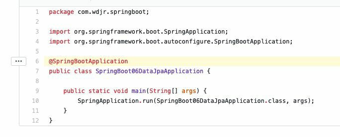
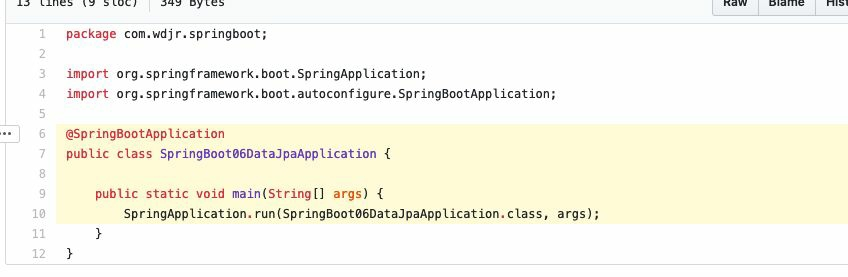

# Git 笔记

## 1. Git 概述


# Git 扩展知识

## 1. 相关设置
### 1.1. `.gitkeep`文件

`.gitkeep`文件是用来保证当前目录即使为空，也会上传到github上

### 1.2. SourceTree客户端使用

- Git(sourceTree)使用教程：http://blog.cocoachina.com/article/71732

## 2. git上的分支命名规范
### 2.1. git常用分支说明

- `master`
    - 主分支，永远是可用的、稳定的、可直接发布的版本，不能直接在该分支上开发。只有计划发布的版本功能在`develop`分支上全部完成，而且测试没有问题了才会合并到`master`上。
- `develop`
    - 开发主分支，代码永远是最新，所有新功能以这个分支来创建自己的开发分支，该分支只做只合并操作，不能直接在该分支上开发
    - 例如要开发一个注册功能，那么就会从`develop`分支上创建一个`feature`分支`fb-register`，在`fb-register`分支上将注册功能完成后，将代码合并到`develop`分支上。这个`fb-register`就完成了它的使命，可以删除了。如果再需要开发一个登录功能，按刚刚上述操作流程再次进行
- `feature-xxx`
    - 功能开发分支，在`develop`上创建分支，以自己开发功能模块命名，功能测试正常后合并到`develop`分支
- `release`
    - 预分布分支，在合并好`feature`分支的`develop`分支上创建，主要是用来测试bug的分支，修改好bug并确定稳定之后合并到`develop`和`master`分支，然后发布`master`分支
- `release-fix`
    - 功能bug修复分支，在`release`上创建分支修复，修复好测试出来的bug之后合并回`release`分支。
- `hotfix-xxx`
    - 紧急bug修改分支，项目上线之后可以会遇到一些环境问题需要紧急修复，在`master`分支上创建，流程跟`release`分支相似，修复完成后合并到`develop`和`master`分支

**开发项目时git分支管理流程图**


***注意事项：***

- 一个分支尽量开发一个功能模块，不要多个功能模块在一个分支上开发。
- 开发过程中，如果组员A开发的功能依赖组员B正在开发的功能，可以待组员B开发好相关功能之后，组员A直接pull组员B的分支下来开发，不需要先将组员B的分支merge到develop分支。
- feature 分支在申请合并之前，最好是先 pull 一下 develop 主分支下来，看一下有没有冲突，如果有就先解决冲突后再申请合并。

### 2.2. git分支命名规范

```
分支:		命名:		说明:

主分支		master		主分支，所有提供给用户使用的正式版本，都在这个主分支上发布
开发分支		dev 		开发分支，永远是功能最新最全的分支
功能分支		feature-*	新功能分支，某个功能点正在开发阶段
发布版本		release-*	发布定期要上线的功能
修复分支		bug-*		修复线上代码的 bug
```

## 3. git提交规范
### 3.1. 中文式提交格式参考

```
<新功能|bug修复|文档改动|格式化|重构|测试代码>: (影响范围) <主题>
# 解释为什么要做这些改动
issue #?
```

### 3.2. 提交类型

- 关于commit时类别，一般通用的如下
    - feat：新功能（feature）
    - fix：修复bug
    - docs：文档（documentation）发动
    - style：格式（不影响代码运行的变动），如格式化，缺失分号等，但不包括生产时紧急的bug修复
    - refactor：重构（即不是新增功能，也不是修改bug的代码变动）
    - perf：代码优化
    - test：增加测试
    - build：构建工具或外部依赖的更改，比如后端maven，前端package，json等
    - ci：更改项目级的配置文件或脚本
    - chore：构建过程或辅助工具的变动，除上面之外的修改
    - revert：撤销先前的提交

### 3.3. 提交注释示例

```
<类型>: <主题>

# 解释为什么要做这些改动（限制每行72个字）

# ----------------------------------------------
# 注意：
# 1. 提交模板的内容，如果最左侧带"#"，内容不会提交到git中
# 2. 主题和内容以一个空行分隔
# 3. 主题限制为最大50个字
# 4. 主题行结束不用标点
# 5. 内容每行72个字
# 6. 内容用于解释为什么和是什么，而不是怎么做
# ----------------- 例子 -------------------------
# feat: 增加账号激活功能
#
# 因为账号初始化时......
# ......
# 所以......
# ---------------- 例子结束 -----------------------
```

# Github 一些操作技巧
## 1. 常用词的含义

- watch：会持续收到该项目的动态
- fork，复制某个项目到自己的Github仓库中
- star，可以理解为点赞
- clone，将项目下载至本地
- follow，关注你感兴趣的作者，会收到他们的动态

## 2. Github 搜索技巧

### 2.1. 通过in关键词限制搜索范围

- `xxx in:name` ：项目名包含xxx的
- `xxx in:description` ：项目描述包含xxx的
- `xxx in:readme` ：项目的readme文件中包含xxx的

当然也可以通过xxx in:name,desciption来组合使用

### 2.2. 通过 Star 或者 Fork 数去查找项目

通过通配符 `> < =` 即可，区间范围内可通过`num1..num2`，具体操作如下：

- 要查找stars数不小于666的springboot项目，搜索：`springboot  stars:>=666`
- forks大于等于500，搜索：`springboot forks:>500`
- 查找fork在100到200之间且stars数在80到100之间的springboot项目，搜索：`springboot forks:100..200 stars:80..100`

### 2.3. awesome + 关键字

搜索和关键字匹配的优秀项目

输入`awesome springboot`，搜索优秀的springboot相关的项目，包括框架、教程等

### 2.4. 分享项目中某一行的代码

只需要在具体的网址后面拼接`#Lxx`(xx为行数)

如：需要分享这个类中的@SprintBootApplication注解，值需要在后面拼接上#L6 即可

```
https://github.com/lxy-go/SpringBoot/.../JpaApplication.java#L6
```

浏览器访问时发现高亮显示了



当然也可以段落进行高亮显示

```
https://github.com/lxy-go/SpringBoot/blob/master/SpringBoot/DataJpaApplication.java#L6-L10
```



### 2.5. 项目内搜索

打开想要搜索的项目，然后按一下【`T`】键。会跳转至一个新的网页，


如想要搜索该项目的配置文件 application.yml


类似的页面内快捷键还有很多，常用的还有【`L`】, 在文件内跳转到多少行。更多快捷键可以查看官方文档：https://help.github.com/en/articles/using-keyboard-shortcuts

### 2.6. 搜索某个地区内的大佬

可以通过`location:地区`进行检索，在具体可以通过`language:语言`缩小检索范围

如搜索地区在北京的Java方向的用户，输入：`location:beijing language:java`

## 3. 推荐一些Github插件（chrome浏览器插件）

### 3.1. Octotree

平时浏览github代码时，每个文件都需要点击才能查看，用了这个插件可以将项目的目录结构以树形结构显示，点击之后会自动跳转到相应的目录。墙裂推荐！

### 3.2. OctoLinker

该插件作用是：在浏览代码像ide那样可以链接跳转。只需要ctrl+点击变量名即可。

### 3.3. Sourcegraph

一个可以在github上浏览和搜索代码的工具，安装好插件之后会出现一个view Repository的按钮。

点击进去之后，可以随意在项目中搜索，可以查看变量和方法，以及进行跳转等等。

## 4. GitHub项目定时发布最新Hosts

项目地址：https://github.com/521xueweihan/GitHub520

该项目会自动发布在指定的地址上，结合软件使用，可以完全自动化，无需持续更新

### 4.1. 手动修改

hosts 文件在每个系统的位置如下：

- Windows 系统：C:\Windows\System32\drivers\etc\hosts
- Linux 系统：/etc/hosts
- Mac（苹果电脑）系统：/etc/hosts
- Android（安卓）系统：/system/etc/hosts
- iPhone（iOS）系统：/etc/hosts

```
# GitHub520 Host Start
185.199.108.154               github.githubassets.com
199.232.68.133                camo.githubusercontent.com
199.232.68.133                github.map.fastly.net
199.232.69.194                github.global.ssl.fastly.net
140.82.113.4                  github.com
140.82.113.5                  api.github.com
199.232.68.133                raw.githubusercontent.com
199.232.68.133                user-images.githubusercontent.com
199.232.68.133                favicons.githubusercontent.com
199.232.68.133                avatars5.githubusercontent.com
199.232.68.133                avatars4.githubusercontent.com
199.232.68.133                avatars3.githubusercontent.com
199.232.68.133                avatars2.githubusercontent.com
199.232.68.133                avatars1.githubusercontent.com
199.232.68.133                avatars0.githubusercontent.com
# Star me GitHub url: https://github.com/521xueweihan/GitHub520
# GitHub520 Host End

数据更新时间：2020-07-25T20:14:26+08:00
```

### 4.2. 激活生效

大部分情况下是直接生效，如未生效可尝试下面的办法，刷新 DNS：

1. Windows：在 CMD 窗口输入：`ipconfig /flushdns`
2. Linux 命令：`sudo rcnscd restart`
3. Mac 命令`：sudo killall -HUP mDNSResponder`

Tips： 上述方法无效可以尝试重启机器。

### 4.3. 自动修改方式

Tip：推荐 SwitchHosts 工具管理 hosts。以 SwitchHosts 为例，自动修改配置参考下面：

- Title: 随意
- Type: Remote
- URL: https://gitee.com/xueweihan/codes/6g793pm2k1hacwfbyesl464/raw?blob_name=GitHub520.yml
- Auto Refresh: 最好选 1 hour
