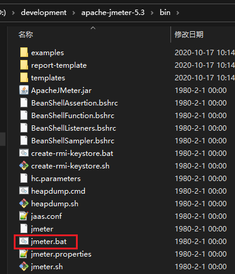
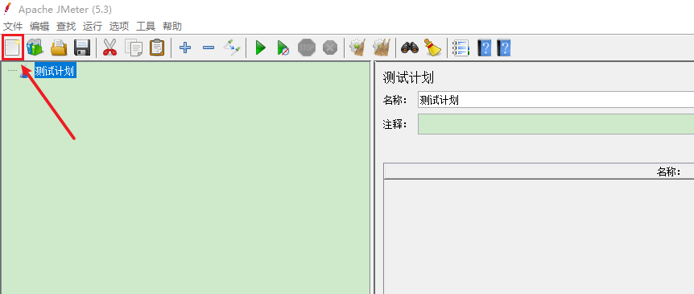
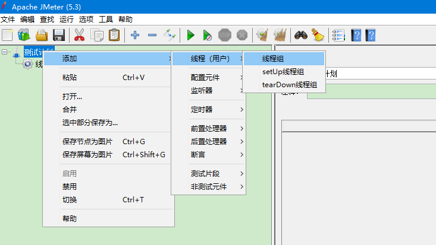
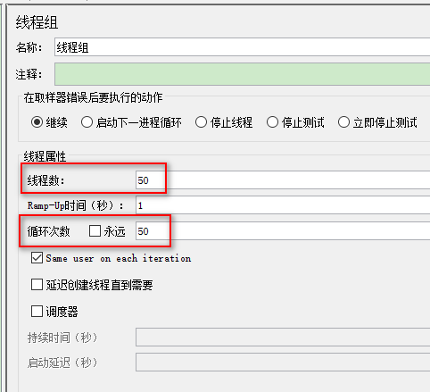
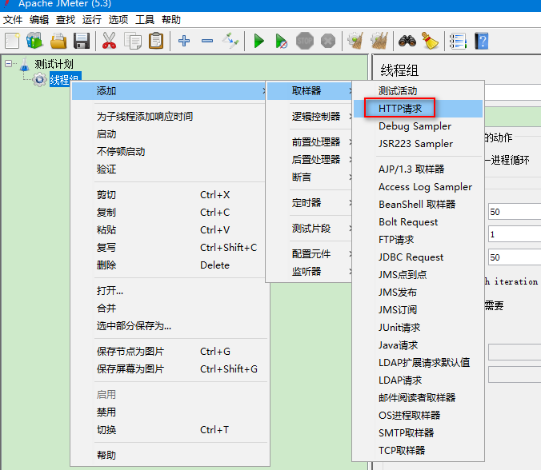
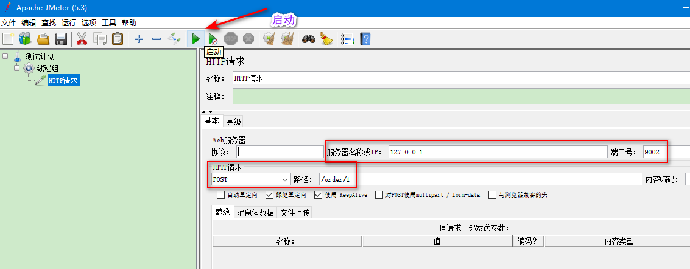

# JMeter-压力测试

## 1. JMeter 简介

Apache JMeter是Apache组织开发的基于Java的压力测试工具。用于对软件做压力测试，它最初被设计用于Web应用测试，但后来扩展到其他测试领域。 它可以用于测试静态和动态资源，例如静态文件、Java 小服务程序、CGI 脚本、Java 对象、数据库、FTP 服务器， 等等。JMeter 可以用于对服务器、网络或对象模拟巨大的负载，来自不同压力类别下测试它们的强度和分析整体性能。另外JMeter能够对应用程序做功能/回归测试，通过创建带有断言的脚本来验证你的程序返回了你期望的结果。为了最大限度的灵活性，JMeter允许使用正则表达式创建断言。

> 官网：https://jmeter.apache.org/

## 2. JMeter 基础使用

### 2.1. JMeter 安装

JMeter安装十分简单，在官网下载最新的压缩包`apache-jmeter-5.3.zip`（2020.10.17下载），解压到无中文与空格的目录下，在 `bin/jmeter.bat` 以管理员身份启动即可

进入bin目录，修改 jmeter.properties 文件中的默认语言支持为 `language=zh_CN`

### 2.2. JMeter 使用配置

1. 创建新的测试计划

2. 测试计划下创建发起请求的线程组

创建后可以配置请求的线程数以及每个请求发送的请求次数

3. 创建http请求模板

4. 配置测试的接口信息，并开启测试

