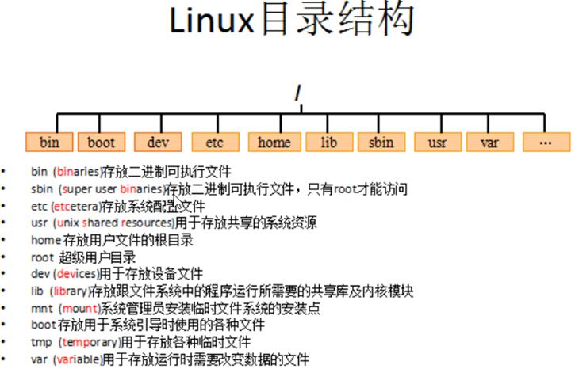

# Linux 系统基础笔记

## 1. Linux 概述

### 1.1. Unix 介绍

Unix 是一个强大的多用户、多任务操作系统

### 1.2. Linux 介绍

- Linux 是一套免费的类 Unix 操作系统
- Linux 是一套免费使用和自由传播的类 Unix 操作系统,可以任意修改其源代码。
- Linux 存在着许多不同的 Linux 版本，但它们都使用了 Linux 内核。

Linux 的特点：它是多用户，多任务，丰富的网络功能，可靠的系统安全，良好的可移植性，具有标准兼容性，良好的用户界面，出色的速度性能

- Linux 的基本思想有两点：
    1. <font color=red>**一切都是文件**</font>
    2. 每个软件都有确定的用途

全字符界面，需要任何页面效果渲染，速度快。linux安全性好，开源

比如：window系统安装tomcat软件，网络中的其他的电脑默认都可以访问tomcat。linux如果安装了tomcat，网络中的其他的电脑默认是无法访问tomcat的，必须要通过设置相关操作才可以访问。所以linux安全性方面比window做的好，从这点可以看出安全性高的linux适合做服务器，安全性低的window适合普通个人用户使用。


### 1.3. Linux 系统的应用

- 服务器系统：<font color=red>**Web 应用服务器**</font>、数据库服务器、接口服务器、DNS、FTP 等等；
- 嵌入式系统：路由器、防火墙、手机、PDA、IP 分享器、交换器、家电用品的微电脑控制器等等，高性能运算、计算密集型应用：Linux 有强大的运算能力。
- 桌面应用系统
- 移动手持系统：android底层就是linux系统

### 1.4. Linux 的版本

Linux 的版本分为两种：内核版本(https://www.kernel.org/)和发行版本。

- <font color=red>**内核版本**</font>是指在 Linus 领导下的内核小组开发维护的系统内核的版本号
- <font color=red>**发行版本**</font>是一些组织和公司根据自己发行版的不同而自定的

目前学习使用的版本 CentOS是 Linux 发行版之一。Red Hat Enterprise Linux 提供的源代码编译而成。很多公司使用 CentOS 替代商业版 RedHat Linux

### 1.5. Linux 目录结构



- `/`：根目录，一般根目录下只存放目录，不要存放文件。
    - `/etc`、`/bin`、`/dev`、`/lib`、`/sbin` 应该和根目录放置在一个分区中
- `/bin`:：`/usr/bin`: (binaries)存放二进制可执行文件。如常用的命令 `ls`、`tar`、`mv`、`cat` 等。
- `/boot`：放置 linux 系统启动时用到的一些文件。
    - `/boot/vmlinuz` 为 linux 的内核文件，以及`/boot/gurb`。建议单独分区，分区大小 100M 即可
- `/dev`：(devices) 存放 linux 系统下的设备文件，访问该目录下某个文件，相当于访问某个设备。
     - 常用的是挂载光驱 `mount` `/dev/cdrom` `/mnt`。
- <font color=red>**`/etc`：(etcetera) 系统配置文件存放的目录，不建议在此目录下存放可执行文件。**</font>
    - 重要的配置文件有`/etc/inittab`、`/etc/fstab`、`/etc/init.d`、`/etc/X11`、`/etc/sysconfig`、`/etc/xinetd.d` 修改配置文件之前记得备份。注：`/etc/X11` 存放与 x windows 有关的设置。
- `/home`：系统默认的用户家目录，新增用户账号时，用户的家目录都存放在此目录下，`~`表示当前用户的家目录，`~test` 表示用户 `test` 的家目录。建议单独分区，并设置较大的磁盘空间，方便用户存放数据
- `/lib`：(library) `/usr/lib`: `/usr/local/lib`：系统使用的函数库的目录，程序在执行过程中，需要调用一些额外的参数时需要函数库的协助，比较重要的目录为`/lib/modules`。
- <font color=red>**`/root`： 系统管理员 root 的家目录，系统第一个启动的分区为`/`，所以最好将`/root`和`/`放置在一个分区下**</font>。
- `/sbin`: (super user binaries) `/usr/sbin`: `/usr/local/sbin`： 放置系统管理员使用的可执行命令。
    - 如 `fdisk`、`shutdown`、`mount` 等。与`/bin` 不同的是，这几个目录是给系统管理员root账号使用的命令，一般用户只能"查看"而不能设置和使用。
- <font color=red>**`/usr`：(unix shared resources) 应用程序存放目录**</font>
    - `/usr/bin`：存放应用程序
    - `/usr/share`：存放共享数据
    - `/usr/lib`：存放不能直接运行的，却是许多程序运行所必需的一些函数库文件。
    - `/usr/local`：存放软件升级包。
    - `/usr/share/doc`：系统说明文件存放目录。
    - `/usr/share/man`：程序说明文件存放目录，使用 `man ls` 时会查询`/usr/share/man/man1/ls.1.gz` 的内容建议单独分区，设置较大的磁盘空间
- `/var`：(variable) 放置系统执行过程中经常变化的文件，如：
    - `/var/log`：随时更改的日志文件
    - `/var/log/message`：所有的登录文件存放目录
    - `/var/spool/mail`：邮件存放的目录
    - `/var/run`：程序或服务启动
- `/opt`：给主机额外安装软件所摆放的目录。以前的 Linux 系统中，习惯放置在 `/usr/local` 目录下
- `/tmp`：(temporary) 一般用户或正在执行的程序临时存放文件的目录,任何人都可以访问,重要数据不可放置在此目录下
- `/srv`：服务启动之后需要访问的数据目录，如 www 服务需要访问的网页数据存放在`/srv/www`内
- `/mnt`:`/media`：(mount)光盘默认挂载点，通常光盘挂载于`/mnt/cdrom`下，也不一定，可以选择任意位置进行挂载。
- `/proc`：此目录的数据都在内存中，如系统核心，外部设备，网络状态，由于数据都存放于内存中，所以不占用磁盘空间，比较重要的目录有`/proc/cpuinfo`、`/proc/interrupts`、`/proc/dma`、`/proc/ioports`、`/proc/net/*`等

## 2. Linux 系统命令格式

常见执行Linux命令的格式是：

```bash
command -options arguments

# 中文翻译
命令名称 [命令参数] [命令对象]
```

- 命令对象（arguments）：一般是指要处理的文件、目录、用户等资源
- 命令参数可以用长格式（完整的选项名称），也可以用短格式（单个字母的缩写），两者分别用“`--`”与“`-`”作为前缀

> <font color=red>**注意，命令名称、命令参数、命令对象之间请用空格键分隔。**</font>

## 3. Linux 使用小细节总结

### 3.1. 终端仿真器

```bash
[root@MoonKirA ~]#
```

以上登陆系统后显示的终端仿真器，如果提示符的最后一个字符是“`#`”，那么意味着这个终端会话是拥有超级用户权限；如果是“`$`”，则是普通用户

### 3.2. 关于文件名的重要规则

1. **以 “`.`” 字符开头的文件名是隐藏文件**。直接使用`ls`或者`ll`命令是否无法列出它们，需要使用`ls -a`或者`ll -a`才能显示这些文件。
2. **文件名和命令名是大小写敏感的**。文件名“File1”和“file1”是指两个不同的文件名。
3. **Linux 没有“文件扩展名”的概念**。与其它系统不一样，文件不是根据文件的扩展名来决定该文件的用途与内容。但是有些应用程序还是会根据扩展名来决定文件的作用！
4. **Linux 支持长文件名，文件名可能包含空格，标点符号**。<font color=red>**但标点符号仅限使用“`.`”（点），“`－`”（中划线），“`_`”（下划线）。最重要的是，不要在文件名中使用空格**</font>。如果想表示词与词间的空格，用下划线字符来代替。*过些时候，你会感激自己这样做*。

# 其他

## 1. 使用rm -f误删除后如何恢复（网上资料，待实践）

### 1.1. 模拟场景-删除

误删除服务器目录/root/selenium/Spider下的MySql.Data.dll文件：

```shell
> rm -f /root/selenium/Spider/MySql.Data.dll
> ll /root/selenium/Spider/MySql.Data.dll
ls: cannot access /root/selenium/Spider/MySql.Data.dll: No such file or directory
```

### 1.2. 恢复

1. 使用lsof命令查看当前是否有进程打开/root/selenium/Spider/MySql.Data.dll文件：

```shell
> lsof | grep /root/selenium/Spider/MySql.Data.dll
```

从上面可以看出，当前文件状态为已删除（deleted）。

2. 查看是否存在恢复数据：

> /proc/13067/fd：进程操作的文件描述符目录。  
> 86：文件描述符。

```shell
> cat /proc/13067/fd/86
```

3. 使用I/O重定向恢复文件：

```shell
> cat /proc/23778/fd/86 > /root/selenium/Spider/MySql.Data.dll
> ls -l /root/selenium/Spider/MySql.Data.dll
-rw-r--r-- 1 root root 702464 Feb 10 12:03 /root/selenium/Spider/MySql.Data.dll
```

重新运行程序：说明恢复的文件没有问题。

### 1.3. 分析

- 通过前面的模拟场景演示了恢复文件的整个过程，那么原理是什么，在什么情况下，文件才是可恢复的。
- 在Linux系统中，每个运行中的程序都有一个宿主进程彼此隔离，以/proc/进程号来体现（Linux本质上就是一个文件系统）。
- 比如：`ls -l /proc/13067` 查看进程PID为13067的进程信息；当程序运行时，操作系统会专门开辟一块内存区域，提供给当前进程使用，对于依赖的文件，操作系统会发放一个文件描述符，以便读写文件，当我们执行 rm -f 删除文件时，其实只是删除了文件的目录索引节点，对于文件系统不可见，但是对于打开它的进程依然可见，即仍然可以使用先前发放的文件描述符读写文件，正是利用这样的原理，所以我们可以使用I/O重定向的方式来恢复文件。

### 1.4. 总结

如果不小心误删了文件，不要着急，首先使用 `lsof` 查看打开该文件的进程，然后再使用 `cat /proc/进程号/fd/文件描述符` 查看恢复数据，最后使用I/O重定向的方式来恢复文件。

