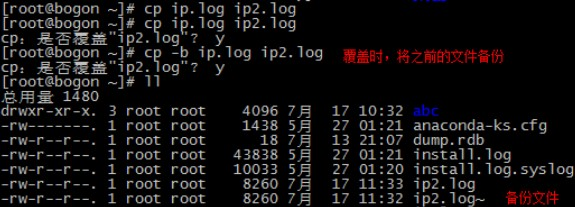

# Linux 命令

## 1. Linux 系统命令格式

常见执行 Linux 命令的格式是：

```bash
command -options arguments

# 中文翻译
命令名称 [命令参数] [命令对象]
```

- 命令对象（arguments）：一般是指要处理的文件、目录、用户等资源
- 命令参数可以用长格式（完整的选项名称），也可以用短格式（单个字母的缩写），两者分别用“`--`”与“`-`”作为前缀

> <font color=red>**注意，命令名称、命令参数、命令对象之间请用空格键分隔。**</font>

## 2. 文件管理

### 2.1. ls - 查看文件信息

`ls` 命令是Linux下最常用的指令之一，`ls` 命令为英文单词 list 的缩写。`ls` 的功能是列出指定目录下的内容及其相关属性信息。

#### 2.1.1. 语法格式与参数

语法格式：

```bash
ls [选项] [文件]
```

常用参数：

|       参数       |                                       作用                                        |
| :-------------: | -------------------------------------------------------------------------------- |
| `-a` 或 `--all` | 显示所有文件及目录 (包括以“.”开头的隐藏文件、特殊目录、“.” (当前目录) 及 “..” (父目录)) |
|      `-l`       | 使用长格式列出文件及目录信息。此命令非常常用，提供简化版命令 `ll`                       |
|      `-r`       | 将文件以相反次序显示(默认依英文字母次序)                                             |
|      `-t`       | 根据文件和目录最后的修改时间排序                                                     |
|      `-A`       | 同 `-a` ，但不列出 “.” (当前目录) 及 “..” (父目录)                                  |
|      `-S`       | 根据文件大小排序                                                                   |
|      `-R`       | 递归列出所有子目录                                                                 |
|    `--help`     | 在线帮助                                                                          |

#### 2.1.2. 示例

- 使用列表的形式，显示指定目录下的内容

```bash
ll /home/
```

- 列出当前目录中所有文件(包括隐藏文件)：

```bash
ls -a
```

- 列出当前工作目录下所有名称是 “s” 开头的文件 :

```bash
ls -ltr s*
```

- 列出当前工作目录下所有文件及目录并以文件的大小进行排序

```bash
ls -AS
```

### 2.2. cp – 复制文件或目录

`cp` 命令可以将多个文件复制到一个具体的文件名或一个已经存在的目录下，也可以同时复制多个文件到一个指定的目录中。

> 注：
> 
> - 在 linux 系统中，`/` 代表根目录，`./` 代表当前目录
> - 如果目标文件是原来已经存在的文件，则会覆盖原来文件

#### 2.2.1. 语法格式与参数

语法格式：

```bash
cp [参数] [源文件或目录] [目标文件或目录]
```

常用参数：

|         参数          |                                        作用                                         |
| :------------------: | ---------------------------------------------------------------------------------- |
|         `-f`         | 若目标文件已存在，则会直接覆盖原文件                                                   |
|         `-i`         | 若目标文件已存在，则会询问是否覆盖                                                     |
|         `-p`         | 保留源文件或目录的所有属性                                                            |
| `-r`或 `--recursive` | 递归复制文件和目录,将指定目录下的文件与子目录一并处理。                                  |
|         `-d`         | 当复制符号连接时，把目标文件或目录也建立为符号连接，并指向与源文件或目录连接的原始文件或目录 |
|         `-l`         | 对源文件建立硬连接，而非复制文件                                                       |
|         `-s`         | 对源文件建立符号连接，而非复制文件                                                     |
|         `-b`         | 覆盖已存在的文件目标前将目标文件备份                                                   |
|         `-v`         | 详细显示 `cp` 命令执行的操作过程                                                      |
|         `-a`         | 等价于“`-dpr`”选项                                                                  |

#### 2.2.2. 示例

- 无法复制目录，复制目录必须使用 `-r` 参数 

```shell
# 无法复制
cp ./abc ./xxx
# 复制目录
cp -r ./abc ./xxx
```

- 将文件test1改名为test2

```bash
cp -f test1 test2
```

- 复制多个文件

```bash
cp -r file1 file2 file3 dir
```

- 交互式地将目录 /usr/linuxcool 中的所有 `.c` 文件复制到目录 dir 中

```bash
cp -r /usr/linuxcool/*.c dir
```

- 覆盖前提示



### 2.3. mkdir – 创建目录

`mkdir` 命令是 make directoriy 缩写，功能用于创建目录。

默认状态下，如果要创建的目录已经存在，则提示已存在，而不会继续创建目录。 所以在创建目录时，应保证新建的目录与它所在目录下的文件没有重名。 mkdir命令还可以同时创建多个目录

#### 2.3.1. 语法格式与参数

语法格式：

```bash
mkdir [参数] [目录]
```

常用参数：

| 参数  |                         作用                          |
| :--: | ---------------------------------------------------- |
| `-p` | 递归创建多级目录，父目录不存在情况下先生成父目录(parents) |
| `-m` | 建立目录的同时设置目录的权限                            |
| `-z` | 设置安全上下文                                         |
| `-v` | 显示目录的创建过程中的详细信息                          |

#### 2.3.2. 示例

- 先创建目录/abc，再创建目录/abc/123

```bash
mkdir –pv ./abc/123
```

- 同时创建子目录dir1，dir2，dir3

```bash
mkdir dir1 dir2 dir3
```

- 在目录 /usr/linuxcool 下建立子目录dir，并且设置文件属主有读、写和执行权限，其他人无权访问

```bash
mkdir -m 700 /usr/linuxcool/dir
```

### 2.4. mv – 移动或改名文件

`mv` 命令是“move”单词的缩写，其功能是移动或更名现有的文件或目录。

这需要特别留意 `mv` 与 `cp` 的区别：`mv` 命令是文件的移动，文件名称发生改变，但个数并未增加。而 `cp` 命令是对文件进行复制操作，文件个数是有增加的。

#### 2.4.1. 语法格式与参数

语法格式：

```bash
mv [参数] [源文件或目录][目标文件或目录]
```

常用参数：

|        参数        |                                    作用                                    |
| :---------------: | ------------------------------------------------------------------------- |
|       `-i`        | 若存在同名文件，则向用户询问是否覆盖                                          |
| `-f` 或 `--force` | 若目标文件或目录与现有的文件或目录重复，则直接覆盖现有的文件或目录，不进行任何提示 |
|       `-b`        | 当文件存在时，覆盖前为其创建一个备份                                          |
|       `-u`        | 当源文件比目标文件新，或者目标文件不存在时，才执行移动此操作                     |

#### 2.4.2. 示例

- 移动一个空目录或一个文件

```bash
mv ./abc/123/ ./xxx/111
```

- 将文件file_1重命名为file_2

```bash
mv file_1 file_2
```

- 将文件 file 移动到目录 dir 中

```bash
mv file /dir
```

- 将目录 dir1 移动目录 dir2 中（前提是目录 dir2 已存在，若不存在则改名)：

```bash
mv /dir1 /dir2
```

- 将目录 dir1 下的文件移动到当前目录下

```bash
mv /dir1/* .
```

### 2.5. pwd – 显示当前路径

`pwd` 命令是“print working directory”中每个单词的首字母缩写，其功能是打印工作目录，即显示当前工作目录的绝对路径。

> 在实际工作中，经常会在不同目录之间进行切换，为了防止“迷路”，可以使用 `pwd` 命令快速查看当前所在的目录路径。

#### 2.5.1. 语法格式与参数

语法格式：

```bash
pwd [参数]
```

常用参数：

| 参数  |     作用     |
| :--: | ----------- |
| `-L` | 显示逻辑路径 |

#### 2.5.2. 示例

- 查看当前工作目录路径

```bash
[root@linuxcool ~]# pwd
/home/linuxcool
```

## 3. 文档编辑

### 3.1. cat – 显示文件内容

Linux 系统中有很多个用于查看文件内容的命令，每个命令又都有自己的特点，`cat` 命令就是用于查看内容较少的纯文本文件

注意：当文件内容较大时，文本内容会在屏幕上快速闪动（滚屏），用户往往看不清所显示的具体内容。因此对于较长文件内容可以按 Ctrl+S 键，停止滚屏；以及 Ctrl+Q 键可以恢复滚屏；而按 Ctrl+C（中断）键则可以终止该命令的执行。但一般查看大文件都是使用 `more` 命令！

#### 3.1.1. 语法格式与参数

语法格式：

```bash
cat [参数] [文件]
```

常用参数：

|     参数     |                   作用                    |
| :---------: | ----------------------------------------- |
|    `-n`     | 显示行数（空行也编号）                      |
|    `-s`     | 显示行数（多个空行算一个编号）               |
|    `-b`     | 显示行数（空行不编号）                      |
|    `-E`     | 每行结束处显示 `$` 符号                     |
|    `-T`     | 将 TAB 字符显示为 `^|` 符号                 |
|    `-v`     | 使用 `^` 和 `M-` 引用，除了 LFD 和 TAB 之外 |
|    `-e`     | 等价于 `-vE` 组合                          |
|    `-t`     | 等价于 `-vT` 组合                          |
|    `-A`     | 等价于 `-vET` 组合                         |
|  `--help`   | 显示帮助信息                               |
| `--version` | 显示版本信息                               |

#### 3.1.2. 示例

- 查看文件的内容

```bash
cat filename.txt
```

- 查看文件的内容，并显示行数编号

```bash
cat -n filename.txt
```

- 查看文件的内容，并添加行数编号后输出到另外一个文件中

```bash
cat -n file.log > file_new.log
```

- 清空文件的内容

```bash
cat /dev/null > /root/filename.txt
```

### 3.2. echo – 输出字符串或提取Shell变量的值

`echo` 命令用于在终端设备上输出字符串或变量提取后的值

一般使用在变量前加上 `$` 符号的方式提取出变量的值，例如：`$PATH`，然后再用 `echo` 命令予以输出。或者直接使用 `echo` 命令输出一段字符串到屏幕上，起到给用户提示的作用。

#### 3.2.1. 语法格式与参数

语法格式：

```bash
echo [参数] [字符串]
```

常用参数：

|     参数     |                作用                |
| :---------: | --------------------------------- |
|    `-n`     | 不输出结尾的换行符                  |
|  `-e "\a"`  | 发出警告音                         |
|  `-e "\b"`  | 删除前面的一个字符                  |
|  `-e "\c"`  | 结尾不加换行符                      |
|  `-e "\f"`  | 换行，光标扔停留在原来的坐标位置      |
|  `-e "\n"`  | 换行，光标移至行首                  |
|  `-e "\r"`  | 光标移至行首，但不换行               |
|    `-E`     | 禁止反斜杠转移，与 `-e` 参数功能相反 |
|  `--help`   | 查看帮助信息                       |
| `--version` | 查看版本信息                       |

#### 3.2.2. 示例

- 输出一段字符串

```bash
echo "MooNkirA" 
```

- 输出变量提取后的值，输出结果是：`/usr/local/sbin:/usr/local/bin:/usr/sbin:/usr/bin:/root/bin`

```bash
echo $PATH
```

- 对内容进行转义，不让 `$` 符号的提取变量值功能生效。输出结果是：`$PATH`

```bash
echo \$PATH
```

- 结合输出重定向符，将字符串信息导入文件中

```bash
echo "It is a test" > test_file
```

- 使用反引号符执行命令，并输出其结果到终端

```bash
echo `date`
```

- 输出带有换行符的内容，输出结果是abc各换一行

```bash
echo -e "a\nb\nc"
```

- 输出信息中删除某个字符，输出结果是：12456（*注意数字3消失了*）

```bash
echo -e "123\b456"
```

### 3.3. rm – 移除文件或目录

`rm` 命令的功能为删除一个目录中的一个或多个文件或目录，它也可以将某个目录及其下的所有文件及子目录均删除。对于链接文件，只是删除了链接，原有文件均保持不变。

> 特别注意：`rm` 是一个危险的命令，使用的时候要特别当心，尤其对于新手，否则整个系统就会毁在这个命令（比如在 `/`（根目录）下执行 `rm * -rf`）。所以，在执行 `rm` 之前最好先确认一下在哪个目录，到底要删除什么东西，操作时保持高度清醒的头脑。

#### 3.3.1. 语法格式与参数

语法格式：

```bash
rm [参数] [文件/目录]
```

常用参数：

|             参数              |                       作用                       |
| :---------------------------: | ------------------------------------------------ |
|       `-f` 或 `--force`       | 强制删除文件或目录，忽略不存在的文件，不会出现警告信息 |
|             `-i`              | 删除前会询问用户是否操作                            |
| `-r` 或 `-R` 或 `--recursive` | 递归删除，将指定目录下的所有文件及子目录一并处理       |
|             `-v`              | 显示指令的详细执行过程                             |

#### 3.3.2. 示例

- 删除前逐一询问确认是否删除

```bash
rm -i test.txt.bz2 
```

- 强制直接删除，不会有任何提示

```bash
rm -f test.txt.bz2  
```

- 递归删除目录及目录下所有文件，如没有 `-r` 参数，则会提示无法删除目录

```bash
rm -rf /data/log
```

- 删除当前目录下所有文件（慎用！！！）

```bash
rm -rf *
```

- 清空系统中所有的文件（谨慎!!!!!!!）

```bash
rm -rf /*
```

### 3.4. tail – 查看文件尾部内容


### 3.5. grep – 强大的文本搜索工具


## 4. 网络通讯

### 4.1. netstat – 显示网络状态

`netstat` 命令用于显示各种网络相关信息，如网络连接，路由表，接口状态 (Interface Statistics)，masquerade 连接，多播成员 (Multicast Memberships) 等等。

#### 4.1.1. 语法格式与参数

语法格式：

```bash
netstat [参数]
```

常用参数：

| 参数  |                 作用                  |
| :--: | ------------------------------------- |
| `-a` | 显示所有连线中的Socket                 |
| `-p` | 显示正在使用Socket的程序识别码和程序名称 |
| `-u` | 显示UDP传输协议的连线状况               |
| `-i` | 显示UDP传输协议的连线状况               |
| `-n` | 显示UDP传输协议的连线状况               |

#### 4.1.2. 示例

- 查看当前所有已经使用的端口情况

```bash
netstat -nultp
```

- 查看 82 端口的使用情况

```bash
netstat -anp | grep 82
```

> 此处注意，图中显示的 LISTENING 并不表示端口被占用，不要和 LISTEN 混淆，查看具体端口时候，必须要看到tcp，端口号，LISTEN 那一行，才表示端口被占用了。
