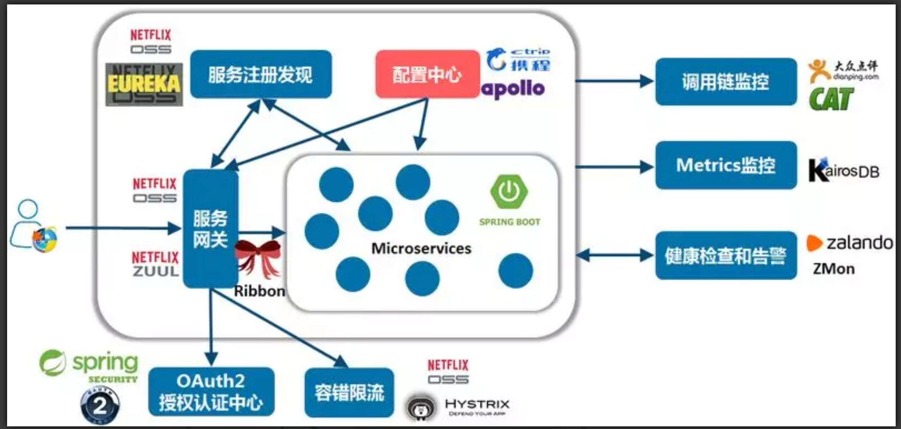
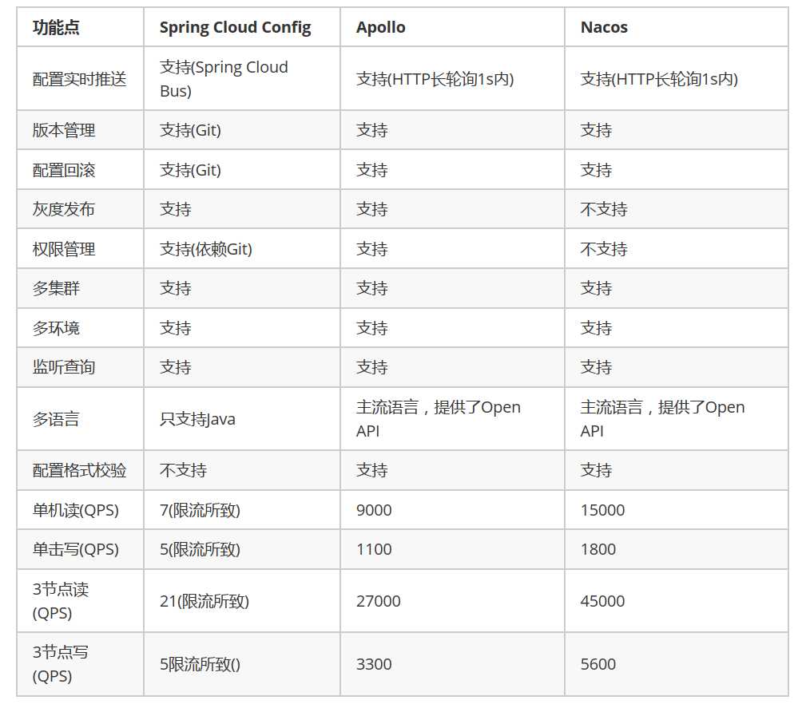
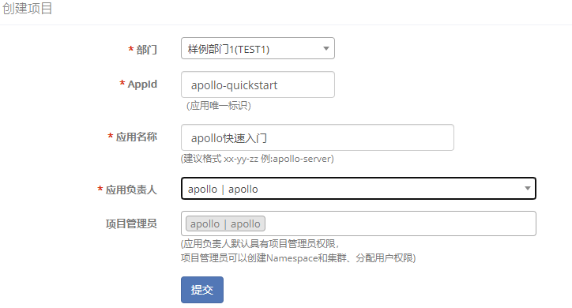
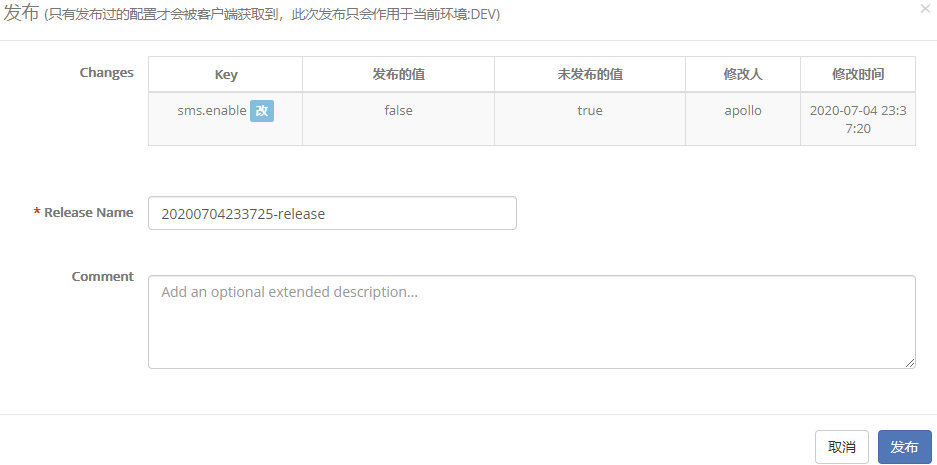

# Apollo 分布式配置中心(服务中间件)

## 1. 概念简介
### 1.1. 什么是配置

应用程序在启动和运行的时候往往需要读取一些配置信息，配置基本上伴随着应用程序的整个生命周期，比如：数据库连接参数、启动参数等。配置主要有以下几个特点：

- **配置是独立于程序的只读变量**
    - 首先，配置是独立于程序的，同一份程序在不同的配置下会有不同的行为
    - 其次，配置对于程序是只读的，程序通过读取配置来改变自己的行为，但是程序不应该去改变配置
- **配置伴随应用的整个生命周期**
    - 配置贯穿于应用的整个生命周期，应用在启动时通过读取配置来初始化，在运行时根据配置调整行为。比如：启动时需要读取服务的端口号、系统在运行过程中需要读取定时策略执行定时任务等。
- **配置可以有多种加载方式**
    - 常见的有程序内部硬编码，配置文件，环境变量，启动参数，基于数据库等
- **配置需要治理**
    - 权限控制：由于配置能改变程序的行为，不正确的配置甚至能引起灾难，所以对配置的修改必须有比较完善的权限控制
    - 不同环境、集群配置管理：同一份程序在不同的环境（开发，测试，生产）、不同的集群（如不同的数据中心）经常需要有不同的配置，所以需要有完善的环境、集群配置管理

### 1.2. 什么是配置中心

传统单体应用存在一些潜在缺陷，如随着规模的扩大，部署效率降低，团队协作效率差，系统可靠性变差，维护困难，新功能上线周期长等，所以迫切需要一种新的架构去解决这些问题，而微服务（ microservices ）架构正是当下一种流行的解法。

不过，解决一个问题的同时，往往会诞生出很多新的问题，所以微服务化的过程中伴随着很多的挑战，其中一个挑战就是有关服务（应用）配置的。当系统从一个单体应用，被拆分成分布式系统上一个个服务节点后，配置文件也必须跟着迁移（分割），这样配置就分散了，不仅如此，分散中还包含着冗余，如下图：


配置中心将配置从应用中剥离出来，统一管理，优雅的解决了配置的动态变更、持久化、运维成本等问题。

应用自身既不需要去添加管理配置接口，也不需要自己去实现配置的持久化，更不需要引入“定时任务”以便降低运维成本。

总得来说，<font color=red>**配置中心就是一种统一管理各种应用配置的基础服务组件**</font>。

在系统架构中，配置中心是整个微服务基础架构体系中的一个组件，它的功能就是**配置的管理和存取**，但它也是整个微服务架构中不可或缺的一环。如下图，




集中管理配置，那么就要将应用的配置作为一个单独的服务抽离出来了，所以也需要解决一些新的问题，比如：版本管理（为了支持回滚），权限管理等。

总结：在传统巨型单体应用纷纷转向细粒度微服务架构的历史进程中，配置中心是微服务化不可缺少的一个系统组件，在这种背景下中心化的配置服务即配置中心应运而生，一个合格的配置中心需要具备以下几点：

- 配置项容易读取和修改
- 添加新配置简单直接
- 支持对配置的修改的检视以把控风险
- 可以查看配置修改的历史记录
- 不同部署环境支持隔离

## 2. Apollo 简介

### 2.1. 主流配置中心

目前市面上用的比较多的配置中心有：（按开源时间排序）

1. Disconf （网址：https://github.com/knightliao/disconf）

2014年7月百度开源的配置管理中心，专注于各种「分布式系统配置管理」的「通用组件」和「通用平台」，提供统一的「配置管理服务」。目前已经不再维护更新。

2. Spring Cloud Config （网址：https://github.com/spring-cloud/spring-cloud-config）

2014年9月开源，Spring Cloud 生态组件，可以和Spring Cloud体系无缝整合。

3. Apollo （网址：https://github.com/ctripcorp/apollo）

2016年5月，携程开源的配置管理中心，能够集中化管理应用不同环境、不同集群的配置，配置修改后能够实时推送到应用端，并且具备规范的权限、流程治理等特性，适用于微服务配置管理场景。

4. Nacos （网址：https://github.com/alibaba/nacos）

2018年6月，阿里开源的配置中心，也可以做DNS和RPC的服务发现。

#### 2.1.1. 功能特性对比

由于Disconf不再维护，下面主要对比一下Spring Cloud Config、Apollo和Nacos。



#### 2.1.2. 对比总结

总的来看，Apollo和Nacos相对于Spring Cloud Config的生态支持更广，在配置管理流程上做的更好。Apollo相对于Nacos在配置管理做的更加全面，Nacos则使用起来相对比较简洁，在对性能要求比较高的大规模场景更适合。但对于一个开源项目的选型，项目上的人力投入（迭代进度、文档的完整性）、社区的活跃度（issue的数量和解决速度、Contributor数量、社群的交流频次等），这些因素也比较关键，考虑到Nacos开源时间不长和社区活跃度，所以从目前来看Apollo应该是最合适的配置中心选型。

### 2.2. Apollo 介绍

Apollo - A reliable configuration management system

Apollo（阿波罗）是携程框架部门研发的分布式配置中心，能够集中化管理应用的不同环境、不同集群的配置，配置修改后能够实时推送到应用端，并且具备规范的权限、流程治理等特性，适用于微服务配置管理场景。

Apollo包括服务端和客户端两部分：

- 服务端基于Spring Boot和Spring Cloud开发，打包后可以直接运行，不需要额外安装Tomcat等应用容器。
- 客户端（Java）不依赖任何框架，能够运行于所有Java运行时环境，同时对Spring/Spring Boot环境也有较好的支持。

### 2.3. Apollo 特性

基于配置的特殊性，所以Apollo设计成为一个有治理能力的配置发布平台，目前提供了以下的特性：

- **统一管理不同环境、不同集群的配置**
    - Apollo提供了一个统一界面集中式管理不同环境（environment）、不同集群（cluster）、不同命名空间（namespace）的配置。
    - 同一份代码部署在不同的集群，可以有不同的配置，比如zookeeper的地址等
    - 通过命名空间（namespace）可以很方便地支持多个不同应用共享同一份配置，同时还允许应用对共享的配置进行覆盖
- **配置修改实时生效（热发布）**
    - 用户在Apollo修改完配置并发布后，客户端能实时（1秒）接收到最新的配置，并通知到应用程序
- **版本发布管理**
    - 所有的配置发布都有版本概念，从而可以方便地支持配置的回滚
- **灰度发布**
    - 支持配置的灰度发布，比如点了发布后，只对部分应用实例生效，等观察一段时间没问题后再推给所有应用实例
- **权限管理、发布审核、操作审计**
    - 应用和配置的管理都有完善的权限管理机制，对配置的管理还分为了编辑和发布两个环节，从而减少人为的错误。
    - 所有的操作都有审计日志，可以方便地追踪问题
- **客户端配置信息监控**
    - 可以在界面上方便地看到配置在被哪些实例使用
- **提供Java和.Net原生客户端**
    - 提供了Java和.Net的原生客户端，方便应用集成
    - 支持Spring Placeholder, Annotation和Spring Boot的ConfigurationProperties，方便应用使用（需要Spring 3.1.1+）
    - 同时提供了Http接口，非Java和.Net应用也可以方便地使用
- **提供开放平台API**
    - Apollo自身提供了比较完善的统一配置管理界面，支持多环境、多数据中心配置管理、权限、流程治理等特性。不过Apollo出于通用性考虑，不会对配置的修改做过多限制，只要符合基本的格式就能保存，不会针对不同的配置值进行针对性的校验，如数据库用户名、密码，Redis服务地址等
    - 对于这类应用配置，Apollo支持应用方通过开放平台API在Apollo进行配置的修改和发布，并且具备完善的授权和权限控制

## 3. Apollo 快速入门

> 官方参考文档：https://github.com/ctripcorp/apollo/wiki

### 3.1. Apollo 执行流程


操作流程如下：

1. 在Apollo配置中心修改配置
2. 应用程序通过Apollo客户端从配置中心拉取配置信息

用户通过Apollo配置中心修改或发布配置后，会有两种机制来保证应用程序来获取最新配置：一种是Apollo配置中心会向客户端推送最新的配置；另外一种是Apollo客户端会定时从Apollo配置中心拉取最新的配置，通过以上两种机制共同来保证应用程序能及时获取到配置。

### 3.2. Apollo 安装

> 官方参考文档：https://github.com/ctripcorp/apollo/wiki/Quick-Start

#### 3.2.1. 运行时环境

- Apollo服务端：Java 1.8+
- Apollo客户端：Java 1.7+

> 由于需要同时运行服务端和客户端，所以建议安装Java 1.8+。

- MySQL版本要求：5.6.5+

> Apollo 配置中心需要依赖数据库实现，而 Apollo 的表结构对 timestamp 使用了多个default声明，所以需要5.6.5以上版本。

#### 3.2.2. 下载安装包

1. 访问Apollo的官方主页获取安装包（本次使用v1.6.1 Release版本）：

下载地址：https://github.com/ctripcorp/apollo/releases

2. 打开相应的版本发布链接，下载必须的安装包：


3. 解压安装包后将apollo-configservice-1.x.x.jar, apollo-adminservice-1.x.x.jar, apollo-portal-1.x.x.jar放置于apollo目录下

#### 3.2.3. 创建 apollo 涉及的数据库

Apollo服务端共需要两个数据库：`ApolloPortalDB` 和 `ApolloConfigDB`

<font color=red>**`ApolloPortalDB`只需要在生产环境部署一个即可，而`ApolloConfigDB`需要在每个环境部署一套。**</font>

##### 3.2.3.1. ApolloPortalDB

1. 创建ApolloPortalDB

通过各种MySQL客户端导入apolloportaldb.sql即可。sql脚本下载地址：https://github.com/ctripcorp/apollo/blob/v1.6.1/scripts/sql/apolloportaldb.sql

以MySQL原生客户端为例：

```bash
source /your_local_path/scripts/sql/apolloportaldb.sql
```

2. 验证ApolloPortalDB

导入成功后，可以通过执行以下sql语句来验证：

```sql
select `Id`, `Key`, `Value`, `Comment` from `ApolloPortalDB`.`ServerConfig` limit 1;
```


> 注：ApolloPortalDB只需要在生产环境部署一个即可

##### 3.2.3.2. ApolloConfigDB

1. 创建ApolloConfigDB

通过各种MySQL客户端导入apolloconfigdb.sql即可。sql脚本下载地址：https://github.com/ctripcorp/apollo/blob/v1.6.1/scripts/sql/apolloconfigdb.sql

以MySQL原生客户端为例：

```bash
source /your_local_path/scripts/sql/apolloconfigdb.sql
```

2. 验证ApolloConfigDB

导入成功后，可以通过执行以下sql语句来验证：

```sql
select `Id`, `Key`, `Value`, `Comment` from `ApolloConfigDB`.`ServerConfig` limit 1;
```


> 相关sql脚本汇总位置：https://github.com/MooNkirA/java-technology-stack/tree/master/java-stack-apollo/scripts/sql

### 3.3. Apollo 启动

1. Apollo默认会启动3个服务，分别使用8070, 8080, 8090端口，确保这3个端口当前未被占用
2. 启动apollo-configservice，在apollo目录下执行如下命令(根据实际情况修改)。可通过`-Dserver.port=xxxx`修改默认端口

```bash
java ‐Xms256m ‐Xmx256m ‐Dspring.datasource.url=jdbc:mysql://localhost:3306/ApolloConfigDB?characterEncoding=utf8 ‐Dspring.datasource.username=root ‐Dspring.datasource.password=123456 ‐jar apollo-configservice-1.6.1.jar
```

3. 启动apollo-adminservice

```bash
java ‐Xms256m ‐Xmx256m ‐Dspring.datasource.url=jdbc:mysql://localhost:3306/ApolloConfigDB?characterEncoding=utf8 ‐Dspring.datasource.username=root ‐Dspring.datasource.password=123456 ‐jar apollo-adminservice-1.6.1.jar
```

4. 启动apollo-portal

```bash
java ‐Xms256m ‐Xmx256m ‐Ddev_meta=http://localhost:8080/ ‐Dserver.port=8070 ‐Dspring.datasource.url=jdbc:mysql://localhost:3306/ApolloPortalDB?characterEncoding=utf8 ‐Dspring.datasource.username=root ‐Dspring.datasource.password=123456 ‐jar apollo-portal-1.6.1.jar
```

也可运行`runApollo.bat`快速启动三个服务（按需修改数据库连接地址，数据库以及密码，日志保存位置等）

- windows脚本

```bash
echo

set url="localhost:3306"
set username="root"
set password="123456"

start "configService" java -Xms256m -Xmx256m -Dapollo_profile=github -Dspring.datasource.url=jdbc:mysql://%url%/ApolloConfigDB?characterEncoding=utf8 -Dspring.datasource.username=%username% -Dspring.datasource.password=%password% -Dlogging.file=.\logs\apollo-configservice.log -jar .\apollo-configservice-1.6.1.jar
start "adminService" java -Xms256m -Xmx256m -Dapollo_profile=github -Dspring.datasource.url=jdbc:mysql://%url%/ApolloConfigDB?characterEncoding=utf8 -Dspring.datasource.username=%username% -Dspring.datasource.password=%password% -Dlogging.file=.\logs\apollo-adminservice.log -jar .\apollo-adminservice-1.6.1.jar
start "ApolloPortal" java -Xms256m -Xmx256m -Dapollo_profile=github,auth -Ddev_meta=http://localhost:8080/ -Dserver.port=8070 -Dspring.datasource.url=jdbc:mysql://%url%/ApolloPortalDB?characterEncoding=utf8 -Dspring.datasource.username=%username% -Dspring.datasource.password=%password% -Dlogging.file=.\logs\apollo-portal.log -jar .\apollo-portal-1.6.1.jar
```

- linux脚本

```bash
#!/bin/sh

url="localhost:3306"
username="root"
password="123456"

java -Xms256m -Xmx256m -Dapollo_profile=github -Dspring.datasource.url=jdbc:mysql://${url}/ApolloConfigDB?characterEncoding=utf8 -Dspring.datasource.username=${username} -Dspring.datasource.password=${password} -Dlogging.file=./logs/apollo-configservice.log -Dserver.port=8080 -jar apollo-configservice-1.6.1.jar &
java -Xms256m -Xmx256m -Dapollo_profile=github -Dspring.datasource.url=jdbc:mysql://${url}/ApolloConfigDB?characterEncoding=utf8 -Dspring.datasource.username=${username} -Dspring.datasource.password=${password} -Dlogging.file=./logs/apollo-adminservice.log -Dserver.port=8090 -jar apollo-adminservice-1.6.1.jar & 
java -Xms256m -Xmx256m -Dapollo_profile=github,auth -Ddev_meta=http://localhost:8080/ -Dserver.port=8070 -Dspring.datasource.url=jdbc:mysql://%url%/ApolloPortalDB?characterEncoding=utf8 -Dspring.datasource.username=%username% -Dspring.datasource.password=%password% -jar apollo-portal-1.6.1.jar &
```

> 相关运行脚本汇总位置：https://github.com/MooNkirA/java-technology-stack/tree/master/java-stack-apollo/scripts/run

运行runApollo.bat即可启动Apollo相关服务


5. 待启动成功后，访问管理页面
    - 本地访问url：http://localhost:8070/signin
    - 账号/密码：apollo/admin


### 3.4. Apollo 基础使用项目示例
#### 3.4.1. 发布配置

1. 打开apollo服务，创建项目apollo-quickstart




2. 新建配置项，例如：`sms.enable`。确认提交配置项


3. 发布配置项。**注意，创建或者修改后，需要点击发布后，配置才生效**


#### 3.4.2. 应用读取配置

1. 新建apollo-quickstart项目，配置pom.xml文件添加apollo依赖，配置JDK为1.8

```xml
<?xml version="1.0" encoding="UTF-8"?>

<project xmlns="http://maven.apache.org/POM/4.0.0" xmlns:xsi="http://www.w3.org/2001/XMLSchema-instance"
         xsi:schemaLocation="http://maven.apache.org/POM/4.0.0 http://maven.apache.org/xsd/maven-4.0.0.xsd">
    <parent>
        <artifactId>java-technology-stack</artifactId>
        <groupId>com.moon</groupId>
        <version>1.0-SNAPSHOT</version>
    </parent>

    <modelVersion>4.0.0</modelVersion>
    <artifactId>apollo-quickstart</artifactId>
    <name>${project.artifactId}</name>
    <packaging>jar</packaging>
    <description>apollo快速入门示例项目</description>

    <properties>
        <java.version>1.8</java.version>
        <apollo-client.version>1.1.0</apollo-client.version>
        <slf4j.version>1.7.28</slf4j.version>
    </properties>

    <dependencies>
        <dependency>
            <groupId>com.ctrip.framework.apollo</groupId>
            <artifactId>apollo-client</artifactId>
            <version>${apollo-client.version}</version>
        </dependency>
        <dependency>
            <groupId>org.slf4j</groupId>
            <artifactId>slf4j-simple</artifactId>
            <version>${slf4j.version}</version>
        </dependency>
        <dependency>
            <groupId>junit</groupId>
            <artifactId>junit</artifactId>
            <scope>test</scope>
        </dependency>
    </dependencies>

    <build>
        <plugins>
            <plugin>
                <groupId>org.apache.maven.plugins</groupId>
                <artifactId>maven-compiler-plugin</artifactId>
                <configuration>
                    <source>${java.version}</source>
                    <target>${java.version}</target>
                </configuration>
            </plugin>
        </plugins>
    </build>
</project>
```

2. 编写测试类GetConfigTest。编写代码读取`sms.enable`的值

```java
package com.moon.apollo.test.quickstart;

import com.ctrip.framework.apollo.Config;
import com.ctrip.framework.apollo.ConfigService;
import org.junit.Test;

/**
 * apollo 快速入门测试 - 读取发布的配置项
 */
public class GetConfigTest {
    /*
     * 启动时设置VM options:
     *  -Dapp.id=apollo-quickstart -Denv=DEV -Ddev_meta=http://localhost:8080
     *      app.id是对应apollo服务创建的项目AppId
     *      env是对应apollo服务的项目环境
     *      dev_meta是对应apollo-portal服务的url
     */
    @Test
    public void getAppConfigTest() {
        // 获取apollo配置对象
        Config config = ConfigService.getAppConfig();
        // 需要获取的配置对应的key
        String key = "sms.enable";
        /*
         * 通过apollo配置对象的getProperty(String key, String defaultValue)方法，获取key的值
         *  参数key：配置项的key
         *  参数defaultValue：配置项的默认值
         */
        String value = config.getProperty(key, null);
        System.out.println("sms.enable: " + value);
    }
}
```

3. 测试

配置VM options，设置系统属性：

```
-Dapp.id=apollo-quickstart -Denv=DEV -Ddev_meta=http://localhost:8080
```


运行`getAppConfigTest()`，观察控制台输出结果


通过apollo管理界面修改配置值`sms.enable`的值为false，再运行查看输出结果已为false


#### 3.4.3. 热发布

所谓的热发布即是在客户端一直运行的过程中，通过apollo管理界面修改配置，客户端可以获取配置的变化信息，配置修改实时生效

1. 修改代码为每3秒获取一次

```java
/*
 * 配置实时更新测试
 */
@Test
public void hotPublishTest() throws InterruptedException {
    // 获取apollo配置对象
    Config config = ConfigService.getAppConfig();
    // 需要获取的配置对应的key
    String key = "sms.enable";
    while (true) {
        // 获取key的值
        String value = config.getProperty(key, null);
        System.out.printf("now: %s, sms.enable: %s%n", LocalDateTime.now().toString(), value);
        Thread.sleep(3000L);
    }
}
```

2. 运行GetConfigTest观察输出结果


3. 在Apollo管理界面修改配置项


4. 发布配置



5. 在控制台查看详细情况：可以看到程序获取的`sms.enable`的值已由false变成了修改后的true


## 4. Apollo 应用

### 4.1. Apollo 工作原理


