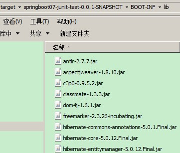

# Spring Boot笔记

## 1. Spring Boot 简介

Spring 诞生时是 Java 企业版（Java Enterprise Edition，JEE，也称 J2EE）的轻量级代替品。无需开发重量级的 Enterprise JavaBean（EJB），Spring 为企业级Java 开发提供了一种相对简单的方法，通过依赖注入和面向切面编程，用简单的Java 对象（Plain Old Java Object，POJO）实现了 EJB 的功能。

虽然 Spring 的组件代码是轻量级的，但它的配置却是重量级的。

- 第一阶段：xml配置
在Spring 1.x时代，使用Spring开发满眼都是xml配置的Bean，随着项目的扩大，我们需要把xml配置文件放到不同的配置文件里，那时需要频繁的在开发的类和配置文件之间进行切换

- 第二阶段：注解配置
在Spring 2.x 时代，随着JDK1.5带来的注解支持，Spring提供了声明Bean的注解（例如@Controller、@Service），大大减少了配置量。主要使用的方式是应用的基本配置（如数据库配置）用xml，业务配置用注解

- 第三阶段：java配置
Spring 3.0 引入了基于 Java 的配置能力，这是一种类型安全的可重构配置方式，可以代替 XML。我们目前刚好处于这个时代。现在Spring和Springboot都推荐使用java配置。

所有这些配置都代表了开发时的损耗。 因为在思考 Spring 特性配置和解决业务问题之间需要进行思维切换，所以写配置挤占了写应用程序逻辑的时间。除此之外，项目的依赖管理也是件吃力不讨好的事情。决定项目里要用哪些库就已经够让人头痛的了，你还要知道这些库的哪个版本和其他库不会有冲突，这难题实在太棘手。并且，依赖管理也是一种损耗，添加依赖不是写应用程序代码。一旦选错了依赖的版本，随之而来的不兼容问题毫无疑问会是生产力杀手。

Spring Boot 让这一切成为了过去。

Spring Boot其设计目的是用来简化Spring应用的初始搭建以及开发采用约定优于配置，只需要“run”就能创建一个独立的、生产级别的Spring应用。Spring Boot为Spring平台及第三方库提供开箱即用的设置（提供默认设置），这样我们就可以简单的开始。多数Spring Boot应用只需要很少的Spring配置。

我们可以使用SpringBoot创建java应用，并使用java –jar 启动它，或者采用传统的war部署方式。

- Spring Boot主要特点：
  - 创建独立的Spring应用程序
  - 嵌入的Tomcat，无需部署WAR文件
  - 简化Maven配置
  - 自动配置Spring
  - 提供生产就绪型功能，如指标，健康检查和外部配置
  - 绝对没有代码生成和对XML没有要求配置

## 2. Spring Boot 入门
### 2.1. 环境准备

- DataBase：MySQL
- IDE：Eclipse/idea
- SpringBoot：
  - 1.5.6 (官方网站：http://spring.io/) 2017年7月27日
  - 2.0.3版本 2018年6月16日
- SpringBoot参考文档：
  - https://docs.spring.io/spring-boot/docs/2.0.3.RELEASE/reference/htmlsingle/
- Maven：3.3.9 （官方声明Springboot 1.5.6版本需要Maven 3.2+）
- Gradle：4.0.2 (官方网站https://gradle.org/)

- 本地仓库：需要使用资料中的仓库 【仓库(SpringBoot).zip】
- 引用资料中的仓库，重新构建索引：


### 2.2. 起步依赖-eclipse
#### 2.2.1. 创建Maven工程


#### 2.2.2. 添加spring boot依赖方式1 - 使用`<parent>`标签


在pom.xml中添加依赖，效果如下：

```xml
<project xmlns="http://maven.apache.org/POM/4.0.0"
         xmlns:xsi="http://www.w3.org/2001/XMLSchema-instance"
         xsi:schemaLocation="http://maven.apache.org/POM/4.0.0
         http://maven.apache.org/xsd/maven-4.0.0.xsd">
  <modelVersion>4.0.0</modelVersion>
  <!-- 配置父级工程 -->
  <parent>
    <groupId>org.springframework.boot</groupId>
    <artifactId>spring-boot-starter-parent</artifactId>
    <version>1.5.6.RELEASE</version>
  </parent>
  <groupId>com.moon</groupId>
  <artifactId>springboot01-test</artifactId>
  <version>0.0.1-SNAPSHOT</version>

  <!-- 配置依赖关系 -->
  <dependencies>
    <!-- 配置WEB启动器 SpringMVC、Restful、jackson -->
    <dependency>
      <groupId>org.springframework.boot</groupId>
      <artifactId>spring-boot-starter-web</artifactId>
    </dependency>
  </dependencies>
</project>
```

工程自动添加了好多jar包，而这些jar包正是开发时需要导入的jar包。


这些jar包被刚才加入的spring-boot-starter-web所引用了，所以添加spring-boot-starter-web后会自动把依赖传递过来。

#### 2.2.3. 添加spring boot依赖方式2 - 定义范围`<scope>`为import

在Spring boot 项目的POM文件中，可以通过在POM文件中继承 Spring-boot-starter-parent 来引用 Srping boot 默认依赖的jar包。但使用parent这种继承的方式，只能继承一个 spring-boot-start-parent。实际开发中，很可能需要继承自己公司的标准parent配置，此时可以使用 `<scope>import</scope>` 来实现多继承。如下例：

```xml
<dependencyManagement>
    <dependencies>
        <!-- Override Spring Data release train provided by Spring Boot -->
        <dependency>
            <groupId>org.springframework.data</groupId>
            <artifactId>spring-data-releasetrain</artifactId>
            <version>Fowler-SR2</version>
            <type>pom</type>
            <scope>import</scope>
        </dependency>
        <dependency>
            <groupId>org.springframework.boot</groupId>
            <artifactId>spring-boot-dependencies</artifactId>
            <version>2.2.4.RELEASE</version>
            <type>pom</type>
            <scope>import</scope>
        </dependency>
    </dependencies>
</dependencyManagement>
```

### 2.3. 起步依赖-idea
#### 2.3.1. 创建项目

idea可以直接新建Spring boot项目。（注意，此创建文件适用创建单应用情况）

1. 新建Spring Intialzr项目


2. 填写项目信息，选择Packaging为Jar。


3. 选择项目使用的技术


4. 填写项目名称
5. 将项目设置为Maven项目
6. 项目结构与依赖与手动新建maven项目一致


### 2.4. 变更JDK版本(非必需)

- 默认情况下工程的JDK版本是1.6，但是通常使用的是1.7的版本


- 修改JDK为1.7，需要在pom.xml中添加以下配置

```xml
<!-- 定义全局属性 -->
<properties>
  <!-- 定义更改JDK版本属性 -->
  <java.version>1.7</java.version>
</properties>
```

- 使用Maven更新工程后，就发现版本已经变成1.7


- 注意：
  - 虽然JDK1.6或者1.7都可以使用SpringBoot，但SpringBoot官方建议使用JDK1.8，要使用JDK1.8，首先必须要配置JDK1.8后，才可以使用上述方法设置。
  - **如果是传统的maven项目，是需要配置jdk插件，但spring boot项目中，只需要配置`<properties>`属性即可**

### 2.5. 启动类

创建Application启动类：

```java
@SpringBootApplication // 代表为SpringBoot应用的运行主类
public class Application {
  public static void main(String[] args) {
    /** 运行SpringBoot应用 */
    SpringApplication.run(Application.class, args);
  }
}
```

- @SpringBootApplication：代表为SpringBoot应用的运行主类

```java
@SpringBootApplication( // SpringBoot应用启动类
    scanBasePackages={"com.moon.springboot"}) // 指定扫描的基础包
```

<font color="purple">注：如果配置@SpringBootApplication注解，不指定注解扫描的包，默认约定是扫描当前引导类所在的同级包下的所有包和所有类以及下级包的类（若为JPA项目还可以扫描标注@Entity的实体类），建议入口类放置的位置在groupId+arctifactID组合的包名下；如果需要指定扫描包使用注解`@SpringBootApplication(scanBasePackages = 'xxx.xxx.xx')`</font>

上面的`@SpringBootApplication`相当于下面的3个注解

- `@Configuration`：用于定义一个配置类
- `@EnableAutoConfiguration`：Spring Boot会自动根据你jar包的依赖来自动配置项目
- `@ComponentScan`：告诉Spring 哪个packages 的用注解标识的类会被spring自动扫描并且装入bean 容器。

Banner直接启动，控制台会出现Spring启动标识。

```java
@SpringBootApplication // 代表为SpringBoot应用的运行主类
public class Application {
  public static void main(String[] args) {
    /** 创建SpringApplication应用对象 */
    SpringApplication springApplication = new SpringApplication(Application.class);
    /** 设置横幅模式(设置关闭) */
    springApplication.setBannerMode(Banner.Mode.OFF);
    /** 运行 */
    springApplication.run(args);
  }
}
```

参考附录二的banner设置，可以通过修改配置文件制定自己的标识。

### 2.6. 入门程序

需求：使用Spring MVC实现Hello World输出

#### 2.6.1. 原来的实现
现在开始使用spring MVC 框架，实现json 数据的输出。如果按照我们原来的做法，需要在web.xml 中添加一个DispatcherServlet 的配置，还需要添加一个spring的配置文件，配置文件如下配置

spring 加入配置
```xml
<!-- controller注解扫描 -->
<context:component-scan base-package="com.moon.springboot.controller" />
<!-- 注解驱动 -->
<mvc:annotation-driven />
```

web.xml加入配置
```xml
<!-- 配置前端控制器 -->
<servlet>
  <servlet-name> springboot01-test</servlet-name>
  <servlet-class>org.springframework.web.servlet.DispatcherServlet</servlet-class>
  <init-param>
    <param-name>contextConfigLocation</param-name>
    <param-value>classpath:spring/*.xml</param-value>
  </init-param>
</servlet>
<servlet-mapping>
  <servlet-name> springboot01-test</servlet-name>
  <url-pattern>/</url-pattern>
</servlet-mapping>
```
还要编写Controller。。。

#### 2.6.2. SpringBoot的实现
我们不需要配置文件，直接编写Controller类即可
```java
@RestController
public class HelloController {
  // http://localhost:8080/hello
  @GetMapping("/hello")
  public String hello(){
    return "Hello World";
  }
}
```

- @RestController注解:其实就是@Controller和@ResponseBody注解加在一起
- 启动方式一：启动编写的引导类即可
- 启动方式二：使用Maven命令spring-boot:run执行即可
  - 选择 Maven Build


  - 在浏览器地址栏输入http://localhost:8080/hello 即可看到运行结果


### 2.7. Spring Boot依赖引入实现原理

在项目的pom.xml文件中继承父工程`spring-boot-starter-parent`

```xml
<!-- Inherit defaults from Spring Boot -->
<parent>
    <groupId>org.springframework.boot</groupId>
    <artifactId>spring-boot-starter-parent</artifactId>
    <version>2.1.13.RELEASE</version>
</parent>
```

通过maven的依赖传递从而实现继承spring boot的父依赖后，可以依赖spring boot项目相关的jar


## 3. Spring Boot配置文件
### 3.1. Spring boot 支持配置文件的类型

- 默认情况下，Spring Boot会加载resources目录下的application.properties或application.yml来获得配置的参数。
- SpringBoot支持一种由SpringBoot框架自制的配置文件格式。后缀为yml。yml后缀的配置文件的功能和properties后缀的配置文件的功能是一致的。
- Spring Boot能支持两种配置文件：
  - application.propertie：键值对风格配置文件
  - application.yml：层级树键值对风格配置文件

### 3.2. application.properties
#### 3.2.1. 单配置文件

```properties
# 配置数据源
spring.datasource.driverClassName=com.mysql.jdbc.Driver
spring.datasource.url=jdbc:mysql://localhost:3306/springboot_db
spring.datasource.username=root
spring.datasource.password=root
spring.datasource.type=com.mchange.v2.c3p0.ComboPooledDataSource
```

#### 3.2.2. 多配置文件

- 第一步：在application.properties配置文件下，增加多个application-xxx.properties文件名的配置文件，其中xxx是一个任意的字符串。

```properties
application-database.properties
application-jpa.properties
application-freemarker.properties
```

- 第二步：在application.properties总配置文件指定，加载的多个配置文件。**需要在application.properties中指定其它配置文件：**

```properties
spring.profiles.active=database,jpa,freemarker
```

### 3.3. application.yml
#### 3.3.1. yml配置文件简介

YML文件格式是YAML (YAML Aint Markup Language)层级树键值对格式文件。YAML是一种直观的能够被电脑识别的的数据数据序列化格式，并且容易被人类阅读，容易和脚本语言交互的，可以被支持YAML库的不同的编程语言程序导入，比如： C/C++, Ruby, Python, Java, Perl, C#, PHP等。YML文件是以数据为核心的，比传统的xml方式更加简洁。

YML文件的扩展名可以使用.yml或者.yaml。

#### 3.3.2. yml配置文件的语法
##### 3.3.2.1. 配置普通数据

语法： `key: value`。注意：value之前有一个空格

```yml
name: haohao
```

##### 3.3.2.2. 配置对象数据

- 语法：

```yml
# 方式一：
key:
    key1: value1
    key2: value2
# 方式二：
key: {key1: value1,key2: value2}
```

- 示例代码：

```yml
# 方式一：
person:
    name: haohao
    age: 31
    addr: beijing
# 方式二：
person: {name: haohao,age: 31,addr: beijing}
```

- <font color=red>**注意：key1前面的空格个数不限定，在yml语法中，相同缩进代表同一个级别**</font>

##### 3.3.2.3. 配置Map数据

**同上面的对象写法**

##### 3.3.2.4. 配置数组（List、Set）数据

- 语法：

```yml
# 方式一：
key:
    - value1
    - value2
# 方式二：
key: [value1,value2]
```

- 示例代码：

```yml
city:
    - beijing
    - tianjin
    - shanghai
    - chongqing
# 或者
city: [beijing,tianjin,shanghai,chongqing]
# 集合中的元素是对象形式
student:
    - name: zhangsan
      age: 18
      score: 100
    - name: lisi
      age: 28
      score: 88
    - name: wangwu
      age: 38
      score: 90
```

- **注意：value1与之间的“-”之间存在一个空格**

#### 3.3.3. 单配置文件

```yml
# 配置数据源
spring:
  datasource:
    url: jdbc:mysql://localhost:3306/springboot_db
    driverClassName: com.mysql.jdbc.Driver
    username: root
    password: root
    type: com.mchange.v2.c3p0.ComboPooledDataSource
```

其实application.yml配置文件就是将原来application.properties使用（.）分割的方式，改为树状结构，使用（:）分割。

**注意：最后key的字段与值之间的冒号（:）后面一定要有一个空格。**

#### 3.3.4. 多配置文件

- 第一步：在application.yml配置文件下，增加多个application-xxx.yml文件名的配置文件，其中xxx是一个任意的字符串。

```
application-database.yml
application-jpa.yml
application-freemarker.yml
```

- 第二步：在application.yml总配置文件指定，加载的多个配置文件。**需要在application.yml中指定其它配置文件：**

```yml
spring:
  profiles:
    active: database,jpa,freemarker
```

### 3.4. 使用xml配置

Spring Boot推荐无xml配置，但实际项目中，可能有一些特殊要求必须使用xml配置，在引导类中通过Spring提供的`@ImportResource`来加载xml配置

```java
@SpringBootApplication(scanBasePackages = {"com.moon.controller"})
@ImportResource({"classpath:xxx1.xml", "classpath:xxx2.xml"})
public class SpringbootdemoApplication {
  public static void main(String[] args) {
    SpringApplication.run(SpringbootdemoApplication.class, args);
  }
}
```

### 3.5. 读取配置文件
#### 3.5.1. 读取核心配置文件方式一：Environment 对象

- 在工程的src/main/resources 下修改核心配置文件
- application.properties, 添加内容如下

```properties
name=月之哀伤
url=http://www.moon.com
```

- 在Controller中添加：

```java
import org.springframework.beans.factory.annotation.Autowired;
import org.springframework.core.env.Environment;
import org.springframework.web.bind.annotation.GetMapping;
import org.springframework.web.bind.annotation.RestController;
@RestController
public class HelloController {
  @Autowired
  private Environment environment;
  // http://localhost:8080/hello
  @GetMapping("/hello")
  public String hello(){
    System.out.println(environment.getProperty("name"));
    System.out.println(environment.getProperty("url"));
    return "Hello World";
  }
}
```

就可以直接把配置文件信息打印出来。注意包名是：`org.springframework.core.env.Environment`

#### 3.5.2. 读取核心配置文件方式二：@value 注解

还是上面的例子，我们只需要是一个`@value`注解即可获取配置文件内容

```java
import org.springframework.beans.factory.annotation.Autowired;
import org.springframework.beans.factory.annotation.Value;
import org.springframework.core.env.Environment;
import org.springframework.web.bind.annotation.GetMapping;
import org.springframework.web.bind.annotation.RestController;
@RestController
public class HelloController {
    @Autowired
    private Environment environment;
    @Value("${name}")
    private String name;
    @Value("${url}")
    private String url;
    // http://localhost:8080/hello
    @GetMapping("/hello")
    public String hello(){
        System.out.println(environment.getProperty("name"));
        System.out.println(environment.getProperty("url"));
        System.out.println(name);
        System.out.println(url);
        return "Hello World";
    }
}
```

> *注：使用`@Value`注解，只能映射配置文件的字符串类型的值，不能映射对象与数组*

#### 3.5.3. 读取自定义配置文件方式三：@ConfigurationProperties 注解

- 通过注解`@ConfigurationProperties(prefix="配置文件中的key的前缀")`可以将配置文件中的配置自动与实体进行映射
- 在application.properties或者application.yml配置以下

```properties
person.name=zhangsan
person.age=18
```

```yml
person:
  name: zhangsan
  age: 18
```

- 在类（实体Bean类）中引用

```java
@Controller
@ConfigurationProperties(prefix = "person")
public class QuickStartController {
    private String name;
    private Integer age;
    @RequestMapping("/quick")
    @ResponseBody
    public String quick(){
        return "springboot 访问成功! name="+ name +",age=" + age;
    }
    public void setName(String name) {
        this.name = name;
    }
    public void setAge(Integer age) {
        this.age = age;
    }
}
```

> **注意：使用`@ConfigurationProperties`方式可以进行配置文件与实体字段的自动映射，但需要字段必须提供set方法才可以，而使用`@Value`注解修饰的字段不需要提供set方法**

#### 3.5.4. 控制方法定义在引导类中

引导类可以定义引导入口与视图跳转的控制方法

```java
@SpringBootApplication
@RestController
public class SpringbootdemoApplication {
   // 读取配置文件
   @Value("${book.author}")
   private String bookAuthor;
   @Value("${book.name}")
   private String bookName;
   // 主页请求控制
   @GetMapping("/")
   public String index() {
      return "book name is " + bookName + " and book author is: " + bookAuthor;
   }
   public static void main(String[] args) {
      SpringApplication.run(SpringbootdemoApplication.class, args);
   }
}
```

#### 3.5.5. 将配置文件的属性赋给实体类（基于properties与yml文件）

1. **方式1：读取默认配置文件**
    - 在自定义配置类中，加上注解`@ConfigurationProperties`，表明该类为配置类，并加上属性prefix，配置前缀
    - 加上`@Component`注解，Spring boot在启动时通过包扫描将该类作为一个Bean注入ioc容器
    - 在引导类中（或者本身自定义配置类），加上`@EnableConfigurationProperties`注解，并指明需要引用的JavaBean类
2. **方式2：读取自定义的配置文件**
    - 需要在自定义配置类上加`@Configuration、@PropertySource、@ConfigurationProperties`的3个注解。*需要注意，如果在Spring Boot版本为1.4或1.4之前，则需要@PropertySource注解上加location属性，并指明该配置文件的路径*
    - 在引导类中（或者本身自定义配置类），加上`@EnableConfigurationProperties`注解，并指明需要引用的JavaBean类

##### 3.5.5.1. 方式1：读取默认配置文件(yml与properties格式均可用)

- 上面使用`@Value`注入每个配置在实际项目中麻烦。通过注解`@ConfigurationProperties(prefix="配置文件中的key的前缀")`可以将配置文件中的配置自动与实体进行映射
- Spring Boot将此方式称为：基于类型安全的配置方式，通过@ConfigurationProperties将properties属性和一个Bean及其属性关联，从而实现类型安全的配置

- 在pom.xml文件引入configuration-processor的依赖

```xml
<!-- @ConfigurationProperties执行器的配置 -->
<dependency>
    <groupId>org.springframework.boot</groupId>
    <artifactId>spring-boot-configuration-processor</artifactId>
    <optional>true</optional>
</dependency>
```

- 创建类型安全的配置类

```java
package com.moon.springbootdemo.config;
import org.springframework.boot.context.properties.ConfigurationProperties;
import org.springframework.stereotype.Component;

@Component
@ConfigurationProperties(prefix = "book")
// 注：如果使用@Configuration注解，则同时需要加上@EnableConfigurationProperties指定加载的配置类
// @Configuration
// @EnableConfigurationProperties(BookSettings.class)
public class BookSettings {
    private String name;
    private String author;
    // ..省略getter、setter
}
```

- 在引导类注入安全配置类，读取配置文件内容

```java
@SpringBootApplication
@RestController
public class SpringbootdemoApplication {
    // 注入安全配置类
    @Autowired
    private BookSettings bookSettings;
    // 主页请求控制
    @GetMapping("/")
    public String index() {
        return "book name is " + bookSettings.getName() + " and book author is: " + bookSettings.getAuthor();
    }
    public static void main(String[] args) {
        SpringApplication.run(SpringbootdemoApplication.class, args);
    }
}
```

##### 3.5.5.2. 方式2：读取自定义的配置文件(只能读取properties格式，该注解并不支持加载yml！)

- 上面方式1是写在默认配置文件application.properties中，如果属性太多，实际项目中不合适，需要自定义配置文件
- **注：方式1的读取默认配置文件的方式，此方式也可以实现。省略@PropertySource注解即可**

- 在pom.xml文件中引入configuration-processor依赖

```xml
<dependency>
    <groupId>org.springframework.boot</groupId>
    <artifactId>spring-boot-configuration-processor</artifactId>
    <optional>true</optional>
</dependency>
```

- 创建配置文件config/book.properties

```properties
book.author=moonzero
book.name=moon in kira
```

- 读取自定义配置文件的实体类

```java
@Configuration
@PropertySource("classpath:config/book.properties")
// prefix用来选择属性的前缀，也就是在book.properties文件中的“book”以下的属性
// ignoreUnknownFields是用来告诉SpringBoot在有属性不能匹配到声明的域时抛出异常
@ConfigurationProperties(prefix = "book", ignoreUnknownFields = false)
// @EnableConfigurationProperties(BookSettings.class)    // 在此配置上加上@EnableConfigurationProperties后，在启动类或者控制层类都不再需要加上此注解
public class BookSettings {
    private String name;
    private String author;
    // ..省略getter、setter
}
```

- 引导类与视图控制

```java
@RestController
@SpringBootApplication
@EnableConfigurationProperties({BookSettings.class})
public class SpringbootdemoApplication {
    // 与上面方式的写法一致
}
```

### 3.6. 自定义配置类

使用`@Configuration`和`@Bean`方式

```java
@Configuration
public class MyConfig {
    // 将方法的返回值添加到容器中；容器中这个组件默认的id就是方法名
    @Bean
    public MySQLInfo mySQLInfo(){
        System.out.println("配置类@Bean给容器中添加组件了...");
        return new MySQLInfo();
    }
}
```

### 3.7. SpringBoot配置信息的查询

- SpringBoot的配置文件，主要的目的就是对配置信息进行修改的，但在配置时的key从哪里去查询呢？我们可以查阅SpringBoot的官方文档
- 文档URL：https://docs.spring.io/spring-boot/docs/2.1.4.RELEASE/reference/htmlsingle/#common-application-properties

### 3.8. 启动时使用命令行注入参数到配置文件
#### 3.8.1. SpringBoot属性加载顺序

1. 在命令行中传入的参数
2. SPRING_APPLICATION_JSON中的属性。SPRING_APPLICATION_JSON是以JSON的格式配置在系统环境变量中的内容
3. `java:comp/env`中的JNDI属性
4. Java的系统属性，可以通过`System.getProperties()`获得的内容
5. 操作系统的环境变量
6. 通过`random.*`配置的随机属性
7. 位于当前应用jar包之外，针对不同`{profile}`环境的配置文件内容，例如`application-{profile}.properties`或是YAML定义的配置文件
8. 位于当前应用jar包之内，针对不同`{profile}`环境的配置文件内容，例如`application-{profile}.properties`或是YAML定义的配置文件
9. 位于当前应用jar包之外的application.properties和YAML配置内容
10. 位于当前应用jar包之内的application.properties和YAML配置内容
11. 在`@Configuration`注解修改的类中，通过`@PropertySource`注解定义的属性
12. 应用默认属性，使用SpringApplication.setDefaultProperties定义的内容

#### 3.8.2. 项目启动示例

- 准备两套环境的配置文件，application-dev.yml和application-pro.yml
- 设置总的配置文件，application.yml
    - **注：如果使用`${}`占位符，在开发过程中可以根据输入的参数切换，但在打包输入命令是无法替换，后来发现使用`@@`包裹才能实现**

```yml
spring:
  profiles:
    active: ${activeName} # 启动时配置相关的参数，在打包时需要替换成@activeName@
```

- 输入启动的命令，带上与配置文件相应对应的参数名，直接使用jar启动输入以下命令

```shell
# 使用dev开发环境配置
java -jar moon-project.jar --spring.profiles.active=dev
# 使用pro生产环境配置
java -jar moon-project.jar --spring.profiles.active=pro
```

#### 3.8.3. 使用idea启动示例

点击项目下拉按钮后选择"Edit Configurations"，在"Configuration"下的VM options中填入需要的属性值，填写的格式如下：

```shell
# 示例，前面是配置文件没有配置，直接指定参数值；后面是配置文件使用${}指定参数名
-Dserver.port=8888 -Dspring.redis.port=6378 -D"你想配置的参数名"="参数值"
```

#### 3.8.4. 使用junit测试配置启动参数示例

可以通过@SpringBootTest注解的properties属性向Environment中设置新的属性，也可以通过使用EnvironmentTestUtils工具类来向ConfigurableEnvironment中添加新的属性。

```java
@SpringBootTest(properties = {"activeName=dev"})
@RunWith(SpringRunner.class)
public class JavMainTest {
}
```

#### 3.8.5. 个人项目实践示例
##### 3.8.5.1. 打包项目赋值参数命令

- 因为配置开发与正式版本的两套配置文件，所以开发时运行需要修改`Environment`的`VM options`的参数为：`-DactiveName=dev`，切换到开发环境的配置，再运行main方法启动
    - **注意：此方式只适用于`${}`占位符情况，如果使用`@@`，则不能使用**
- 为了兼容项目打包，配置文件是使用`@@`作为占位符，所以启动需要使用命令`spring-boot:run`

```shell
# 以开发环境配置启动
spring-boot:run -DactiveName=dev -Dmaven.test.skip=true

# 以正式环境配置启动
spring-boot:run -DactiveName=pro -Dmaven.test.skip=true
```

**使用`${}`作为动态参数的解决方案**

从spring-boot-starter-parent的pom.xml文件中查看 `delimiter that doesn't clash with Spring ${}`

```xml
<properties>
    <java.version>1.6</java.version>
    <resource.delimiter>@</resource.delimiter> <!-- delimiter that doesn't clash with Spring ${} placeholders -->
    <project.build.sourceEncoding>UTF-8</project.build.sourceEncoding>
    <project.reporting.outputEncoding>UTF-8</project.reporting.outputEncoding>
    <maven.compiler.source>${java.version}</maven.compiler.source>
    <maven.compiler.target>${java.version}</maven.compiler.target>
</properties>
```

若项目使用了 spring-boot-starter-parent 做项目版本管理，替换resource.delimiter属性

```xml
<!-- 使用spring-boot-starter-parent管理jar包版本 -->
<parent>
    <groupId>org.springframework.boot</groupId>
    <artifactId>spring-boot-starter-parent</artifactId>
    <version>1.2.5.RELEASE</version>
</parent>

<!-- 需要在<properties>中添加 -->
<properties>
    <resource.delimiter>${}</resource.delimiter>
</properties>
```

**注意：使用些方式后，使用mvn命令打包时，不使用默认值方式`${参数名:默认值}`**

##### 3.8.5.2. 项目打包命令

- 需要将依赖的公共包安装到本地仓库，到时需要依赖打包到war包中
- 项目打包：参考5.1将前端部署后，因为配置了开发环境与正式版本环境的两套配置文件，使用maven命令打包时，需要输入配置文件的参数，进行打包即可，完成后将war包放到tomcat运行部署

```shell
# 项目安装
mvn clean install -DactiveName=pro -Dmaven.test.skip=true

# 项目打包
mvn clean package -DactiveName=pro -Dmaven.test.skip=true
```

### 3.9. 实现SpringBoot配置文件放在jar外部的方式
#### 3.9.1. 通过命令行指定

SpringApplication会默认将命令行选项参数转换为配置信息。例如，启动时命令参数指定：

```bash
java -jar myproject.jar --server.port=9000
```

从命令行指定配置项的优先级最高，不过可以通过setAddCommandLineProperties来禁用

```java
SpringApplication.setAddCommandLineProperties(false)
```

#### 3.9.2. 外置配置文件

- Spring程序会按优先级从下面这些路径来加载application.properties配置文件
    - 当前目录下的`/config`目录
    - 当前目录
    - classpath里的`/config`目录
    - classpath根目录
- 因此，要外置配置文件就很简单了，在jar所在目录新建config文件夹，然后放入配置文件，或者直接放在配置文件在jar目录

#### 3.9.3. 自定义配置文件

如果不想使用application.properties作为配置文件，输入以下命令

```bash
java -jar myproject.jar --spring.config.location=classpath:/default.properties,classpath:/override.properties
```

或者

```bash
java -jar -Dspring.config.location=D:\config\config.properties springbootrestdemo-0.0.1-SNAPSHOT.jar
```

也可以直接在代码里指定

```java
@SpringBootApplication
@PropertySource(value={"file:config.properties"})
public class SpringbootrestdemoApplication {
    public static void main(String[] args) {
        SpringApplication.run(SpringbootrestdemoApplication.class, args);
    }
}
```

#### 3.9.4. 按Profile不同环境读取不同配置

- 不同环境的配置设置一个配置文件，例如：
    - dev环境下的配置配置在application-dev.properties中
    - prod环境下的配置配置在application-prod.properties中
- 在application.properties中指定使用哪一个文件

```properties
spring.profiles.active=dev
```

- 也可以在运行的时候手动指定：

```bash
java -jar myproject.jar --spring.profiles.active=prod
```

## 4. 热部署
### 4.1. 热部署配置

在开发中反复修改类、页面等资源，每次修改后都是需要重新启动才生效，这样每次启动都很麻烦，浪费了大量的时间。

1. 可以设置在修改代码后不重启就能生效，在pom.xml 中添加如下配置就可以实现这样的功能，称为热部署

```xml
<!-- 使用spring-boot-devtools提供的开发者工具，配置devtools开启热部署 -->
<dependency>
    <!--
       devtools可以实现页面热部署（即页面修改后会立即生效，这个可以直接在application.properties文件中配置spring.thymeleaf.cache=false来实现），
       实现类文件热部署（类文件修改后不会立即生效），实现对属性文件的热部署。
       即devtools会监听classpath下的文件变动，并且会立即重启应用（发生在保存时机），注意：因为其采用的虚拟机机制，该项重启是很快的
    -->
    <groupId>org.springframework.boot</groupId>
    <artifactId>spring-boot-devtools</artifactId>
    <!-- 表示依赖不会向下传递 -->
    <optional>true</optional>
</dependency>
```

2. 仅仅加入devtools在我们的eclipse中还不起作用，这时候还需要添加的spring-boot-maven-plugin

```xml
<build>
    <plugins>
        <!--
            用于将应用打成可直接运行的jar（该jar就是用于生产环境中的jar） 值得注意的是，如果没有引用spring-boot-starter-parent做parent，
               且采用了上述的第二种方式，这里也要做出相应的改动
         -->
        <plugin>
            <groupId>org.springframework.boot</groupId>
            <artifactId>spring-boot-maven-plugin</artifactId>
            <configuration>
                <!-- fork : 如果没有该项配置，这个devtools不会起作用，即应用不会restart -->
                <fork>true</fork>
            </configuration>
        </plugin>
    </plugins>
</build>
```

> 将依赖关系标记为可选`<optional>true</optional>`是一种最佳做法，可以防止使用项目将devtools传递性地应用于其他模块。

注意：IDEA进行SpringBoot热部署失败原因

出现这种情况，并不是热部署配置问题，其根本原因是因为Intellij IEDA默认情况下不会自动编译，需要对IDEA进行自动编译的设置，如下：


然后`Shift+Ctrl+Alt+/`，选择Registry


### 4.2. 排除静态资源文件

- 静态资源文件在改变之后有时候没必要触发应用程序重启，例如thymeleaf模板文件就可以实时编辑，默认情况下，更改/META-INF/maven, /META-INF/resources ,/resources ,/static ,/public 或/templates下的资源不会触发重启，而是触发live reload（devtools内嵌了一个LiveReload server，当资源发生改变时，浏览器刷新）
- 但是如果想完成静态文件变化后，要应用重启那么可以配置如下

```properties
spring.devtools.restart.exclude=static/**,public/**
# 如果想保留默认配置，同时增加新的配置，则可使用
# spring.devtools.restart.additional-exclude属性
```

### 4.3. 使用一个触发文件

若不想每次修改都触发自动重启，可以在application.xml设置`spring.devtools.restart.trigger-file`指向某个文件，只有更改这个文件时才触发自动重启。示例如下：


```yml
spring:
  devtools: # 配置更改指定文件时才触发自动重启
    restart:
      trigger-file: .trigger  # 文件所在路径是 /resources/META-INF/.trigger
```

### 4.4. 全局设置

可以通过向`$HOME`文件夹添加名为`.spring-boot-devtools.properties`的文件来配置全局devtools设置（请注意，文件名以“`.`”开头）。 添加到此文件的任何属性将适用于计算机上使用devtools的所有 Spring Boot应用程序。 例如，要配置重启始终使用触发器文件 ，可以添加以下内容：

```
〜/ .spring-boot-devtools.properties
```

### 4.5. Devtools 在 Spring Boot 中的可选配置

```properties
# Whether to enable a livereload.com-compatible server.
spring.devtools.livereload.enabled=true

# Server port.
spring.devtools.livereload.port=35729

# Additional patterns that should be excluded from triggering a full restart.
spring.devtools.restart.additional-exclude=

# Additional paths to watch for changes.
spring.devtools.restart.additional-paths=

# Whether to enable automatic restart.
spring.devtools.restart.enabled=true

# Patterns that should be excluded from triggering a full restart.
spring.devtools.restart.exclude=META-INF/maven/**,META-INF/resources/**,resources/**,static/**,public/**,templates/**,**/*Test.class,**/*Tests.class,git.properties,META-INF/build-info.properties

# Whether to log the condition evaluation delta upon restart.
spring.devtools.restart.log-condition-evaluation-delta=true

# Amount of time to wait between polling for classpath changes.
spring.devtools.restart.poll-interval=1s

# Amount of quiet time required without any classpath changes before a restart is triggered.
spring.devtools.restart.quiet-period=400ms

# Name of a specific file that, when changed, triggers the restart check. If not specified, any classpath file change triggers the restart.
spring.devtools.restart.trigger-file=
```

### 4.6. 其他热部署工具

由于Spring Boot应用只是普通的Java应用，所以JVM热交换（hot-swapping）也能开箱即用。不过JVM热交换能替换的字节码有限制，想要更**彻底的解决方案可以使用Spring Loaded项目或JRebel**。spring-boot-devtools 模块也支持应用快速重启(restart)。

## 5. 运行状态监控Actuator（待学习）

Spring Boot的Actuator 提供了运行状态监控的功能。Actuator的监控数据可以通过Rest、运程shell和JMX方式获得

## 6. Spring Boot配置原理

Spring Boot框架是一个将整合框架的整合代码都写好了的框架。所以我们要知道它的工作原理才能够，找到各种整合框架可以配置的属性，以及属性对应的属性名。

### 6.1. 配置原理说明

- SpringBoot的*spring-boot-autoconfigure-1.5.6.RELEASE.jar*中编写了所有内置支持的框架的自动整合代码。
- 所有支持的框架根据功能类型来划分包，每个包都有一个XxxAutoConfiguration配置类，都是一个基于纯注解的配置类，是各种框架整合的代码。如图所示：


- 如果配置的框架有默认的配置参数，都放在一个命名为XxxProperties的属性类，如图所示：


- 通过项目的resources下的application.properties文件可以修改每个整合框架的默认属性，从而实现了快速整合的目的。


### 6.2. 配置流程说明

- 第一步：配置一个内置整合框架的参数，先到spring-boot-autoconfigure-1.5.6.RELEASE.jar找到对应的模块。
- 第二步：如果该框架有可以配置的参数，那么对应的整合模块中一定有一个XxxProperties类，在里面可以找可以设置的参数。
- 第三步：在resources源目录下的application.properties文件里面可以修改XxxProperties类中默认的参数。


## 7. Spring Boot 视图

### 7.1. 静态资源html视图

- SpringBoot默认有四个静态资源文件夹：
  - classpath:/static/
  - classpath:/public/
  - classpath:/resources/
  - classpath:/META-INF/resources/
- 在spring-boot-autoconfigure-1.5.6.RELEASE.jar的web包的

ResourceProperties类中作了默认的配置：

```java
private static final String[] CLASSPATH_RESOUTCE_LOCATIONS = {
    "classpth:/META-INF/resources/", "classpath:/resources/",
    "classpath:/static/", "classpath:/public/" };
```

- 第一步：提供src/main/resources/public/html/user.html

```html
<!DOCTYPE html>
<html>
  <head>
    <title>SpringBoot</title>
    <meta charset="UTF-8"/>
    <meta http-equiv="pragma" content="no-cache"/>
    <link rel="shortcut icon" type="image/x-icon" href="logo.ico"/>
  </head>
  <body>
    user
  </body>
</html>
```

- 第二步：提供HelloController处理器

```java
@Controller
public class HelloController {
    @Autowired
    private Environment environment;
    @Value("${name}")
    private String name;
    @Value("${url}")
    private String url;

    // 响应数据为json格式：http://localhost:8080/hello
    @GetMapping("/hello")
    @ResponseBody
    public String hello(){
        System.out.println(environment.getProperty("name"));
        System.out.println(environment.getProperty("url"));
        System.out.println(name);
        System.out.println(url);
        return "Hello World";
    }

    // 响应数据为静态html页面： http://localhost:8080/user
    @GetMapping("/user")
    public String user(){
        return "/html/user.html";
    }
}
```

### 7.2. Jsp视图(不推荐)
- 第一步：创建Maven项目(war包)
- 第二步：配置依赖

```xml
<project xmlns="http://maven.apache.org/POM/4.0.0"
    xmlns:xsi="http://www.w3.org/2001/XMLSchema-instance"
    xsi:schemaLocation="http://maven.apache.org/POM/4.0.0
                        http://maven.apache.org/xsd/maven-4.0.0.xsd">
  <modelVersion>4.0.0</modelVersion>
  <parent>
    <groupId>org.springframework.boot</groupId>
    <artifactId>spring-boot-starter-parent</artifactId>
    <version>1.5.6.RELEASE</version>
  </parent>
  <groupId>com.moon</groupId>
  <artifactId>springboot02-jsp-test</artifactId>
  <version>0.0.1-SNAPSHOT</version>
  <packaging>war</packaging>

  <!-- 定义全局属性 -->
  <properties>
    <!-- 更改JDK版本 -->
    <java.version>1.7</java.version>
  </properties>

  <!-- 配置依赖关系 -->
  <dependencies>
    <!-- 配置web启动器(spring mvc) -->
    <dependency>
      <groupId>org.springframework.boot</groupId>
      <artifactId>spring-boot-starter-web</artifactId>
    </dependency>
    <!-- 配置devtools实现热部署 -->
    <dependency>
      <groupId>org.springframework.boot</groupId>
      <artifactId>spring-boot-devtools</artifactId>
    </dependency>
    <!-- 配置servlet-api、jsp-api、el-api依赖 -->
    <dependency>
      <groupId>org.apache.tomcat.embed</groupId>
      <artifactId>tomcat-embed-jasper</artifactId>
      <scope>provided</scope>
    </dependency>
    <!-- 配置jstl依赖 -->
    <dependency>
      <groupId>javax.servlet</groupId>
      <artifactId>jstl</artifactId>
    </dependency>
  </dependencies>
</project>
```

- 第三步：提供application.properties属性文件

```properties
# 开启jsp视图
# 设置视图前缀
spring.mvc.view.prefix=/WEB-INF/jsp/
# 设置视图后缀
spring.mvc.view.suffix=.jsp
```

- 第四步：开发处理器ItemController

```java
@Controller
public class ItemController {
  /** 查询得到数据 */
  @GetMapping("/item")
  public String item(Model model){
    /** 添加响应数据 */
    model.addAttribute("itemArr", new String[]{"iphone7手机","华为手机","小米手机"});
    /** 返回视图 */
    return "item";
  }
}
```

- 第五步：提供src/main/webapp/WEB-INF/jsp/item.jsp

```jsp
<%@ page language="java" contentType="text/html; charset=UTF-8" pageEncoding="UTF-8"%>
<%@ taglib prefix="c"  uri="http://java.sun.com/jsp/jstl/core"%>
<!DOCTYPE html PUBLIC "-//W3C//DTD HTML 4.01 Transitional//EN" "http://www.w3.org/TR/html4/loose.dtd">
<html>
  <head>
    <title>SpringBoot</title>
    <meta http-equiv="Content-Type" content="text/html; charset=UTF-8" />
  </head>
  <body>
    <ul>
      <c:forEach items="${itemArr}" var="item">
        <li>${item }</li>
      </c:forEach>
    </ul>
  </body>
</html>
```

- 第六步：开发Application作为SpringBoot引启类

```java
@SpringBootApplication // 代表为SpringBoot应用的运行主类
public class Application {
  public static void main(String[] args) {
    /** 创建SpringApplication应用对象 */
    SpringApplication springApplication = new SpringApplication(Application.class);
    /** 设置横幅模式(设置关闭) */
    springApplication.setBannerMode(Banner.Mode.OFF);
    /** 运行 */
    springApplication.run(args);
  }
}
```

访问地址：http://localhost:8080/item

### 7.3. FreeMarker视图

详见Spring Boot整合FreeMarker部分。

## 8. Spring Boot 部署
### 8.1. 配置插件

SpringBoot项目打包都需要配置spring-boot-maven-plugin插件：

```xml
<!-- 构建部分 -->
<build>
  <plugins>
    <!-- spring-boot-maven-plugin构建插件 -->
    <plugin>
      <groupId>org.springframework.boot</groupId>
      <artifactId>spring-boot-maven-plugin</artifactId>
    </plugin>
  </plugins>
</build>
```

### 8.2. 打jar包

- 目前的工程采用是jar的打包方式，所以在执行package命令后，会产生一个jar包
- 进入到这个目录用压缩软件打开此jar包，其中发现了一个叫lib的文件夹，打开lib文件夹发现此文件夹下全是工程依赖的jar包，甚至还有tomcat。这种包含有jar包的jar包，称之为fatJAR(胖jar包)



- 由于fatJAR本身就包括tomcat，我们就不需要另外部署了，直接在命令行就可以把我们的应用启动起来，在命令行，进入到jar包所在的目录，我们可以通过java –jar命令来执行此jar包

### 8.3. 打war包

spring-boot默认提供内嵌的tomcat，所以打包直接生成jar包，用java -jar命令就可以启动。但是有时候更希望一个tomcat来管理多个项目，这种情况下就需要项目是war格式的包而不是jar格式的包。

按照以下步骤完成对工程的改造

- 第一步：修改pom.xml
    1. 将打包方式改为war
    2. 添加的Tomcat依赖配置，覆盖Spring Boot自带的Tomcat依赖
    3. 可选：在`<build></build>`标签内配置项目名（该配置类似于`server.context-path=xxx`）

```xml
<!-- 配置打包方式为war包 -->
<packaging>war</packaging>

<!-- 配置tomcat启动器(tomcat我们自己提供) -->
<dependency>
  <groupId>org.springframework.boot</groupId>
  <artifactId>spring-boot-starter-tomcat</artifactId>
  <scope>provided</scope>
</dependency>

<build>
    ...
    <finalName>MoonZero</finalName>
</build>
```

> 说明：spring-boot-starter-tomcat 是原来被传递过来的依赖，默认会打到包里，所以我们再次引入此依赖，并指定依赖范围为provided，这样tomcat 相关的jar就不会打包到war 里了。
> 目的：用自己tomcat，不用它内嵌的tomcat，这样内嵌的tomcat相关jar包就不需要。

- 第二步：添加ServletInitializer

```java
package com.moon.jav;

import org.springframework.boot.Banner;
import org.springframework.boot.builder.SpringApplicationBuilder;
import org.springframework.boot.web.servlet.support.SpringBootServletInitializer;

/**
 * 定义此类作为web.xml使用
 */
public class ServletInitializer extends SpringBootServletInitializer {
    @Override
    protected SpringApplicationBuilder configure(SpringApplicationBuilder builder) {
        /* 设置启动类 */
        builder.sources(Application.class);
        /* 设置横幅模式 */
        builder.bannerMode(Banner.Mode.OFF);
        /* 返回SpringBoot应用启动对象 */
        return builder;
    }
}
```

> 说明：由于我们采用web3.0 规范，是没有web.xml 的，而此类的作用与web.xml相同。*注意：Application.class是本项目Spring Boot的启动类*

- 第三步：运行`mvn clean package`打包命令，在target目录下生成war包。将生成后将war包放入tomcat，启动tomcat，测试完成的功能是否可以使用。


### 8.4. 内嵌tomcat参数
在application.properties设置相关参数即可，如：

```properties
# 设置tomcat端口
server.port=8080
# 设置服务地址
server.address=127.0.0.1
# 设置超时时间
server.connection-timeout=1000
# 设置上下文路径
server.contextPath=/boot
```
请求地址：http://127.0.0.2/boot/findAll

---

# Spring Boot 整合
## 1. 创建Spring Boot父项目（整合Spring Cloud）
### 1.1. 创建Maven父工程（pom）

- 采用Maven多Module的形式。创建Maven工程，在主Maven工和的pom文件引入Spring Boot的版本（根据需求定版本），Spring cloud版本（根据需求定版本），并可以指定一些公共的依赖，还有一些项目的公共属性（如项目的编码）
- 其余的Module工程的pom文件继承主Maven工程，拥有父工程的公共的依赖和配置
- 此案例是基于父工程通过Spring Boot整合Spring Cloud，单独使用Spring Boot工程整合Spring Cloud方法一样

父工程的pom.xml

```xml
<?xml version="1.0" encoding="UTF-8"?>
<project xmlns="http://maven.apache.org/POM/4.0.0"
         xmlns:xsi="http://www.w3.org/2001/XMLSchema-instance"
         xsi:schemaLocation="http://maven.apache.org/POM/4.0.0 http://maven.apache.org/xsd/maven-4.0.0.xsd">
    <modelVersion>4.0.0</modelVersion>
    <!-- 父项目的坐标 -->
    <groupId>com.moon</groupId>
    <artifactId>spring-cloud-project</artifactId>
    <version>1.0-SNAPSHOT</version>
    <packaging>pom</packaging>

    <modules>
        <module>spring-boot-demo</module>
        <module>其他模块</module>
        .......
    </modules>

    <!-- 引入Spring Boot的父项目依赖 -->
    <parent>
        <groupId>org.springframework.boot</groupId>
        <artifactId>spring-boot-starter-parent</artifactId>
        <version>2.0.3.RELEASE</version>
        <relativePath/><!-- lookup parent from repository -->
    </parent>

    <!-- 配置相关属性 -->
    <properties>
        <!-- 指定整个项目的编码是UTF-8 -->
        <project.build.sourceEncoding>UTF-8</project.build.sourceEncoding>
        <project.reporting.outputEncoding>UTF-8</project.reporting.outputEncoding>
        <!-- 配置JDK编译环境，因在是Spring Boot，不需要配置JDK插件 -->
        <java.version>1.8</java.version>
        <!-- 指定spring-cloud的版本 -->
        <spring-cloud.version>Dalston.RELEASE</spring-cloud.version>
    </properties>

    <!-- 锁定依赖的版本 -->
    <dependencyManagement>
        <dependencies>
            <dependency>
                <groupId>org.springframework.cloud</groupId>
                <artifactId>spring-cloud-dependencies</artifactId>
                <version>${spring-cloud.version}</version>
            </dependency>
        </dependencies>
    </dependencyManagement>

    <!-- 配置公共的依赖 -->
    <dependencies>
        <!-- Spring Boot应用程序用于测试包括JUnit，Hamcrest和Mockito -->
        <dependency>
            <groupId>org.springframework.boot</groupId>
            <artifactId>spring-boot-starter-test</artifactId>
            <scope>test</scope>
        </dependency>
    </dependencies>
</project>
```

其他的子模块的pom.xml，继承父工程即可(下面是例子)

```xml
<?xml version="1.0" encoding="UTF-8"?>
<project xmlns="http://maven.apache.org/POM/4.0.0" xmlns:xsi="http://www.w3.org/2001/XMLSchema-instance"
         xsi:schemaLocation="http://maven.apache.org/POM/4.0.0 http://maven.apache.org/xsd/maven-4.0.0.xsd">
    <!-- 配置继承父工程 -->
    <parent>
        <groupId>com.moon</groupId>
        <artifactId>spring-cloud-project</artifactId>
        <version>1.0-SNAPSHOT</version>
    </parent>
    <!-- 本模块坐标 -->
    <modelVersion>4.0.0</modelVersion>
    <artifactId>spring-boot-demo</artifactId>
    <packaging>jar</packaging>
    <name>spring-boot-demo</name>
    <description>Demo project for Spring Boot</description>

    <!-- 配置子模块的特有依赖 -->
    <dependencies>
        <dependency>
            <groupId>org.springframework.boot</groupId>
            <artifactId>spring-boot-starter-web</artifactId>
        </dependency>
    </dependencies>

    <build>
        <plugins>
            <plugin>
                <groupId>org.springframework.boot</groupId>
                <artifactId>spring-boot-maven-plugin</artifactId>
            </plugin>
        </plugins>
    </build>
</project>
```

### 1.2. 整合开发
更多配置与开发详见工程`D:\code\IdeaProjects\spring-cloud-project`

#### 1.2.1. RestTemplate 对象

从Spring3.0开始，Spring为创建Rest API提供了良好的支持。借助 RestTemplate，Spring应用能够方便地使用REST资源

RestTemplate定义了36个与REST资源交互的方法，其中的大多数都对应于HTTP的方法。

相关的方法

- **delete()** 在特定的URL上对资源执行HTTP DELETE操作
- **exchange()**
  - 在URL上执行特定的HTTP方法，返回包含对象的ResponseEntity，这个对象是从响应体中映射得到的
- **execute()** 在URL上执行特定的HTTP方法，返回一个从响应体映射得到的对象
- **getForEntity()** 发送一个HTTP GET请求，返回的ResponseEntity包含了响应体所映射成的对象
- **getForObject()** 发送一个HTTP GET请求，返回的请求体将映射为一个对象
- **postForEntity()**
  - POST 数据到一个URL，返回包含一个对象的ResponseEntity，这个对象是从响应体中映射得到的
- **postForObject()** POST 数据到一个URL，返回根据响应体匹配形成的对象
- **headForHeaders()** 发送HTTP HEAD请求，返回包含特定资源URL的HTTP头
- **optionsForAllow()** 发送HTTP OPTIONS请求，返回对特定URL的Allow头信息
- **postForLocation()** POST 数据到一个URL，返回新创建资源的URL
- **put()** PUT 资源到特定的URL

## 2. 整合junit

1. 开启Spring Boot测试，在测试类加`@RunWith(SpringRunner.class)`。`@RunWith`是注解运行的主类
2. 测试类上添加`@SpringBootTest`注解，classes属性要指定启动类的class
    - 配置属性方式1：在`@SpringBootTest`注解加上属性webEnvironment设置web测试环境的端口，`SpringBootTest.WebEnvironment.RANDOM_PORT`为随机端口
    - 配置属性方式2：在`@SpringBootTest`注解加上属性classes指定的是引导类的字节码对象，如：`@SpringBootTest(classes = Application.class)`。*其中Application.java是Spring boot的引导类*

### 2.1. pom.xml添加test依赖

```xml
<!-- 配置测试启动器 -->
<dependency>
    <groupId>org.springframework.boot</groupId>
    <artifactId>spring-boot-starter-test</artifactId>
    <scope>test</scope>
</dependency>
```

### 2.2. 编写测试类(方式1)

```java
@RunWith(SpringRunner.class)
// 方式1：webEnvironment设置web测试环境的端口，SpringBootTest.WebEnvironment.RANDOM_PORT 为随机端口
@SpringBootTest(webEnvironment = SpringBootTest.WebEnvironment.RANDOM_PORT)
public class SpringbootdemoApplicationTests {
   @LocalServerPort
   private int port;
   private URL base;

   // TestRestTemplate是RestTemplate的测试类
   @Autowired
   private TestRestTemplate template;

   @Before
   public void setUp() throws Exception {
      this.base = new URL("http://localhost" + port + "/");
   }

   @Test
   public void getHello() {
      System.out.println(base.toString());
      System.out.println("1111");
   }
}
```

### 2.3. 编写测试类(方式2)

```java
@RunWith(SpringRunner.class)
// 方式2：设置classes属性，指定SpringBoot启动类
// @SpringBootTest(classes = Application.class)
public class MapperTest {
    @Autowired
    private UserMapper userMapper;
    @Test
    public void test() {
        List<User> users = userMapper.queryUserList();
        System.out.println(users);
    }
}
```

注：SpringRunner继承自SpringJUnit4ClassRunner，使用哪一个Spring提供的测试测试引擎都可以

```java
public final class SpringRunner extends SpringJUnit4ClassRunner
```

**注：之前的教程是写“@RunWith(SpringJUnit4ClassRunner.class) // 指定运行的主类”，但是使用的时候一直报错，不知道是不是其它地方有配置错误，还是说本来spring boot整合junit时不能这么配置。先暂时记录**

## 3. 整合c3p0
### 3.1. 自定义DataSourceConfiguration

```java
@Configuration // 定义配置信息类
public class DataSourceConfiguration {
    /** 定义创建数据源方法 */
    @Bean(name="dataSource") // 定义Bean
    @Primary // 主要的候选者
    @ConfigurationProperties(prefix="spring.datasource.c3p0") // 配置属性
    public DataSource getDataSource(){
        return DataSourceBuilder.create() // 创建数据源构建对象
               .type(ComboPooledDataSource.class) // 设置数据源类型
               .build(); // 构建数据源对象
    }
}
```

### 3.2. 在application.properties配置c3p0

```properties
# 配置c3p0
spring.datasource.c3p0.driverClass=com.mysql.jdbc.Driver
spring.datasource.c3p0.jdbcUrl=jdbc:mysql://localhost:3306/springboot_db
spring.datasource.c3p0.user=root
spring.datasource.c3p0.password=123456
spring.datasource.c3p0.maxPoolSize=30
spring.datasource.c3p0.minPoolSize=10
spring.datasource.c3p0.initialPoolSize=10
```

## 4. 整合Spring-Data-JPA
### 4.1. 环境准备

- **第一步：导入数据库表**
    - 运行SpringBoot\准备资料\springboot.sql文件创建数据库表及表中数据
- **第二步：加入Spring-Data-JPA的启动器**

```xml
<!-- 配置web启动器(spring mvc) -->
<dependency>
    <groupId>org.springframework.boot</groupId>
    <artifactId>spring-boot-starter-web</artifactId>
</dependency>
<!-- 配置devtools实现热部署 -->
<dependency>
    <groupId>org.springframework.boot</groupId>
    <artifactId>spring-boot-devtools</artifactId>
</dependency>

<!-- 配置Spring-Data-JPA启动器 -->
<dependency>
    <groupId>org.springframework.boot</groupId>
    <artifactId>spring-boot-starter-data-jpa</artifactId>
</dependency>
<!-- 配置mysql驱动 -->
<dependency>
    <groupId>mysql</groupId>
    <artifactId>mysql-connector-java</artifactId>
</dependency>
<!-- 配置c3p0连接池 -->
<dependency>
    <groupId>com.mchange</groupId>
    <artifactId>c3p0</artifactId>
    <version>0.9.5.2</version>
</dependency>
```

- **第三步：application.properties配置文件**
    - 参考spring-boot-autoconfigure-1.5.6.RELEASE.jar中orm.jpa包中属性文件类**JpaProperties**
    - 官方文档

```properties
# 配置自定义的c3p0数据源
spring.datasource.c3p0.driverClass=com.mysql.jdbc.Driver
spring.datasource.c3p0.jdbcUrl=jdbc:mysql://localhost:3306/springboot_db
spring.datasource.c3p0.user=root
spring.datasource.c3p0.password=123456
spring.datasource.c3p0.maxPoolSize=20
spring.datasource.c3p0.minPoolSize=10
spring.datasource.c3p0.initialPoolSize=10

# JPA
spring.jpa.showSql=true
spring.jpa.properties.hibernate.format_sql=true
```

- 注：
    - 其中，数据源（原生的datasource也可以，将c3p0去掉即可）配置包括driverClass(驱动类)、url(数据库地址)、user\password (用户名与密码)、其它数据源的相关参数(如：maxPoolSize等等)
    - JPA的配置包括：如showSql(是否显示sql语句)、format_sql(是否格式式sql)、hibernate.ddl-auto(配置为create时，程序启动时会在MySQ数据库中建表；配置为update时，在程序启动时不会在MySQL数据库中建表)等等


**将application.properties文件修改成application.yml文件**

```yml
spring:
    datasource:
        c3p0:
            driverClass: com.mysql.jdbc.Driver
            jdbcUrl: jdbc:mysql://localhost:3306/springboot_db
            user: root
            password: 123456
            maxPoolSize: 20
            minPoolSize: 10
            initialPoolSize: 10
    jpa:
        showSql: false
        properties:
            hibernate:
                format_sql: true
```

### 4.2. 整合开发

案例：使用Spring Boot + Spring MVC + Spring Data JPA 查询所有公告

- **第一步：创建entity**

```java
@Entity @Table(name="notice")
public class Notice implements Serializable {
    private static final long serialVersionUID = 5679176319867604937L;
    @Id @GeneratedValue(strategy=GenerationType.IDENTITY)
    @Column(name="id")
    private Long id;
    @Column(name="title")
    private String title;
    @Column(name="content")
    private String content;
    /** setter and getter method */
    public Long getId() {
        return id;
    }
    public void setId(Long id) {
        this.id = id;
    }
    public String getTitle() {
        return title;
    }
    public void setTitle(String title) {
        this.title = title;
    }
    public String getContent() {
        return content;
    }
    public void setContent(String content) {
        this.content = content;
    }
}
```

- **第二步：创建数据访问Dao**

```java
@Repository
public interface NoticeDao extends JpaRepository<Notice, Long>{
}
```

- **第三步：创建业务处理**

```java
public interface NoticeService {
    /** 查询所有的公告 */
    public List<Notice> findAll();
}

@Service
@Transactional
public class NoticeServiceImpl implements NoticeService {
    @Autowired
    private NoticeDao noticeDao;
    /** 查询所有的公告 */
    public List<Notice> findAll(){
        return noticeDao.findAll();
    }
}
```

- **第四步：创建处理器**

```java
@RestController
public class NoticeController {
    @Autowired
    private NoticeService noticeService;
    /** 查询全部公告 */
    @GetMapping("/findAll")
    public List<Notice> findAll(Model model){
        return noticeService.findAll();
    }
}
```

- **第五步：第六步：编写启动类**
- **第六步：测试**
    - 浏览器地址栏输入：http://localhost:8080/findAll

## 5. 整合FreeMarker
### 5.1. 加入依赖

```xml
<!-- FreeMarker启动器 -->
<dependency>
    <groupId>org.springframework.boot</groupId>
    <artifactId>spring-boot-starter-freemarker</artifactId>
</dependency>
```

### 5.2. 编写处理器

```java
@Controller
public class UserController {
    /* 查询 */
    @GetMapping("/user")
    public String user(Model model){
        /* 添加响应数据 */
        model.addAttribute("tip", "用户数据");
        /* 返回视图 */
        return "user";
    }
}
```

### 5.3. 编写模板

在src\main\resources\templates路径下创建user.ftl模板，内容如下。最后运行启动类测试效果

```html
<!DOCTYPE html>
<html>
    <head>
        <title>Spring Boot</title>
        <meta charset="UTF-8"/>
    </head>
    <body>
        ${tip}
    </body>
</html>
```

### 5.4. 属性配置

参考spring-boot-autoconfigure-1.5.6.RELEASE.jar中freemarker包中属性文件类**FreeMarkerProperties**

```properties
# 配置FreeMarker
# 配置模版文件加载的基础路径，多个路径中间用逗号分隔
spring.freemarker.templateLoaderPath=classpath:/templates/,classpath:/template/
# 配置模版文件的后缀名
spring.freemarker.suffix=.ftl
# 配置模版文件的编码
spring.freemarker.charset=utf-8
# 配置模版文件使用缓存
spring.freemarker.cache=true
```

**注意：也可以直接注入FreeMarkerConfigurer操作FreeMarker。**

## 6. 整合Redis
### 6.1. 加入依赖

在pom.xml中加入依赖

```xml
<!-- 配置redis启动器 -->
<dependency>
    <groupId>org.springframework.boot</groupId>
    <artifactId>spring-boot-starter-redis</artifactId>
    <version>1.4.7.RELEASE</version>
</dependency>
```

### 6.2. 配置连接Redis

在application.properties文件中添加相关配置。

```properties
# 配置Redis单机版
spring.redis.host=192.168.12.128
spring.redis.port=6379

# 配置Redis集群版
#spring.redis.cluster.nodes=192.168.12.128:7001,192.168.12.128:7002,192.168.12.128:7003,192.168.12.128:7004,192.168.12.128:7005,192.168.12.128:7006
```

**说明：切换到集群版，注释掉单机版配置信息即可。**

### 6.3. 注入RedisTemplate测试redis操作

只需要直接注入RedisTemplate即可使用以下方法操作redis的五种不同的数据类型


```java
@RunWith(SpringRunner.class)
@SpringBootTest(classes = Application.class)
public class RedisTest {
    @Autowired
    private UserRepository userRepository;
    @Autowired
    private RedisTemplate<String, String> redisTemplate;

    @Test
    public void test() throws JsonProcessingException {
        // 从redis缓存中获得指定的数据
        String userListData = redisTemplate.boundValueOps("user.findAll").get();
        // 如果redis中没有数据的话
        if (null == userListData) {
            //查询数据库获得数据
            List<User> all = userRepository.findAll();
            // 转换成json格式字符串
            ObjectMapper om = new ObjectMapper();
            userListData = om.writeValueAsString(all);
            // 将数据存储到redis中，下次在查询直接从redis中获得数据，不用在查询数据库
            redisTemplate.boundValueOps("user.findAll").set(userListData);
            System.out.println("===============从数据库获得数据===============");
        } else {
            System.out.println("===============从redis缓存中获得数据===============");
        }
        System.out.println(userListData);
    }
}
```

## 7. 整合Solr
### 7.1. 加入依赖

在pom.xml中加入依赖：

```xml
<!-- 配置solr启动器 -->
<dependency>
    <groupId>org.springframework.boot</groupId>
    <artifactId>spring-boot-starter-data-solr</artifactId>
</dependency>
```

**注意：solr-solrj的版本必须为5.0以上才可以用。**

### 7.2. 配置连接Solr

在application.properties中配置

```properties
# 配置Solr单机版
#spring.data.solr.host=http://192.168.12.128:8080/solr

# 配置Solr集群版
spring.data.solr.zkHost=192.168.12.128:3181,192.168.12.128:3182,192.168.12.128:3183
```

**说明：切换到单机版，注释掉集群版配置信息即可。**

### 7.3. SolrClient操作Solr

只需要直接注入SolrClient即可使用以下方法操Solr


## 8. 整合ActiveMQ
### 8.1. 加入依赖

在pom.xml中加入依赖

```xml
<!-- 配置ActiveMQ启动器 -->
<dependency>
    <groupId>org.springframework.boot</groupId>
    <artifactId>spring-boot-starter-activemq</artifactId>
</dependency>
```

### 8.2. 配置连接ActiveMQ

在application.properties文件中添加

```properties
# ActiveMQ消息服务器连接地址
spring.activemq.brokerUrl=tcp://192.168.12.128:61616
# 开启发布与订阅模式(默认为点对点模式)
spring.jms.pubSubDomain=true
```

### 8.3. 创建队列

在启动类中添加以下方法，创建队列

```java
@SpringBootApplication
public class Application {
    public static void main(String[] args) {
        SpringApplication.run(Application.class, args);
    }
    /* 创建点对点消息队列 */
    @Bean
    public Queue queue() {
        return new ActiveMQQueue("SpringBoot.queue");
    }
}
```

### 8.4. 发送消息

编写Controller，注入JmsTemplate发送消息

```java
@RestController
@RequestMapping("/queue")
public class QueueController {
    /* 注入JmsTemplate消息发送模版对象 */
    @Autowired
    private JmsTemplate jmsTemplate;
    /* 注入目标消息模式 */
    @Autowired
    private Destination destination;

    /* 发送消息的方法 */
    @RequestMapping("/send/{message}")
    public String send(@PathVariable String message) {
        /* 发送消息 */
        this.jmsTemplate.convertAndSend(destination, message);
        return "消息发送成功!消息内容：" + message;
    }
}
```

### 8.5. 接收消息

编写bean，在类上加@Component注解让spring管理这个bean。消费消息方法：加@JmsListener注解

```java
@Component
public class ItemMessageListener {
    /* 消费消息方法 */
    @JmsListener(destination = "SpringBoot.queue")
    public void readMessage(String message) {
        System.out.println("接受到的消息是：" + message);
    }
}
```

## 9. !!整合Swagger2(使用的时再总结，在深入理解spring cloud书中4.7章节)

Swagger2是一个功能强大的在线API文档的框架，目前版本为2.x，Swagger2提供了在线文档的查阅和测试功能。利用Swagger2很容易构建RESTful风格的API


# Spring Boot 使用总结

## 1. Spring Boot 相关的 spring 注解
### 1.1. @Configuration

这是 Spring 3.0 添加的一个注解，用于定义配置类，用来代替 applicationContext.xml 配置文件，所有这个配置文件里面能做到的事情都可以通过这个注解所在类来进行注册。被注解的类内部包含有一个或多个被`@Bean`注解的方法，这些方法将会被`AnnotationConfigApplicationContext`或`AnnotationConfigWebApplicationContext`类进行扫描，并用于构建bean定义，初始化Spring容器。

```java
@Configuration
public class TaskAutoConfiguration {
    @Bean
    @Profile("biz-electrfence-controller")
    public BizElectrfenceControllerJob bizElectrfenceControllerJob() {
        return new BizElectrfenceControllerJob();
    }

    @Bean
    @Profile("biz-consume-1-datasync")
    public BizBikeElectrFenceTradeSyncJob bizBikeElectrFenceTradeSyncJob() {
        return new BizBikeElectrFenceTradeSyncJob();
    }
}
```

### 1.2. @ComponentScan

这是 Spring 3.1 添加的一个注解，用来代替配置文件中的 component-scan 配置，开启组件扫描，即自动扫描包路径下的 `@Component` 注解进行注册 bean 实例到 context 中。

对于`@Controller`，`@Service`，`@Repository`注解，查看其源码会发现，它们中有一个共同的注解`@Component`，其实 `@ComponentScan` 注解默认就会装配标识了`@Controller`，`@Service`，`@Repository`，`@Component`注解的类到spring容器中。

```java
package com.moon.test;

import org.springframework.boot.SpringApplication;
import org.springframework.context.annotation.ComponentScan;

// 只有value属性时，value可以省略不写。@ComponentScan("com.moon.check.api")
@ComponentScan(value = "com.moon.check.api")
public class CheckApiApplication {
    public static void main(String[] args) {
        SpringApplication.run(CheckApiApplication.class, args);
    }
}
```

`@SpringBootApplication` 注解也包含了 `@ComponentScan` 注解，所以在使用中也可以通过 `@SpringBootApplication` 注解的 `scanBasePackages` 属性进行配置

```java
package com.moon.test;

import org.springframework.boot.SpringApplication;
import org.springframework.boot.autoconfigure.SpringBootApplication;

@SpringBootApplication(scanBasePackages = {"com.moon.check.api", "com.moon.check.service"})
public class CheckApiApplication {
    public static void main(String[] args) {
        SpringApplication.run(CheckApiApplication.class, args);
    }
}
```

### 1.3. @Import

这是 Spring 3.0 添加的新注解，用来导入一个或者多个 `@Configuration` 注解修饰的类，此注解在 Spring Boot 里面应用很多。

通过导入的方式实现把实例加入springIOC容器中。可以在需要时将没有被Spring容器管理的类导入至Spring容器中。

```java
//类定义
public class Square {
}

public class Circular {
}

//导入
@Import({Square.class, Circular.class})
@Configuration
public class MainConfig {
}
```

### 1.4. @ImportResource

Spring 3.0 添加的新注解，用来导入一个或者多个 Spring  配置文件，这对 Spring Boot 兼容老项目非常有用，因为有些配置无法通过 Java Config 的形式来配置就只能用这个注解来导入。

和`@Import`类似，区别就是`@ImportResource`导入的是配置文件

```java
package com.moon.test;

import org.springframework.boot.SpringApplication;
import org.springframework.context.annotation.ImportResource;

// 导入xml配置
@ImportResource("classpath:spring-redis.xml")
public class CheckApiApplication {
    public static void main(String[] args) {
        SpringApplication.run(CheckApiApplication.class, args);
    }
}
```

### 1.5. @Component

`@Component`是一个spring框架的“元注解”，意思是可以注解其他类注解，如`@Controller`、`@Service`、`@Repository`。带此注解的类被看作组件，当使用基于注解的配置和类路径扫描的时候，这些类就会被实例化。其他类级别的注解也可以被认定为是一种特殊类型的组件，比如`@Controller` 控制器（注入服务）、`@Service`服务（注入dao）`、@Repository` dao（实现dao访问）。`@Component`泛指组件，当组件不好归类的时候，可以使用这个注解进行标注，作用就相当于 XML配置`<bean id="" class=""/>`

## 2. Spring Boot 核心注解
### 2.1. @CrossOrigin (Spring Boot解决跨域问题)

> SpringBoot 与 SpringMVC 一样可以使用`@CrossOrigin`注解解决跨域问题，均要求在Spring4.2及以上的版本

#### 2.1.1. @CrossOrigin 源码解析(翻译参考网络)

```java
@Target({ ElementType.METHOD, ElementType.TYPE })
@Retention(RetentionPolicy.RUNTIME)
@Documented
public @interface CrossOrigin {

    String[] DEFAULT_ORIGINS = { "*" };

    String[] DEFAULT_ALLOWED_HEADERS = { "*" };

    boolean DEFAULT_ALLOW_CREDENTIALS = true;

    long DEFAULT_MAX_AGE = 1800;

    /**
     * 同origins属性一样
     */
    @AliasFor("origins")
    String[] value() default {};

    /**
     * 所有支持域的集合，例如"http://domain1.com"。
     * <p>这些值都显示在请求头中的Access-Control-Allow-Origin
     * "*"代表所有域的请求都支持
     * <p>如果没有定义，所有请求的域都支持
     * @see #value
     */
    @AliasFor("value")
    String[] origins() default {};

    /**
     * 允许请求头重的header，默认都支持
     */
    String[] allowedHeaders() default {};

    /**
     * 响应头中允许访问的header，默认为空
     */
    String[] exposedHeaders() default {};

    /**
     * 请求支持的方法，例如"{RequestMethod.GET, RequestMethod.POST}"}。
     * 默认支持RequestMapping中设置的方法
     */
    RequestMethod[] methods() default {};

    /**
     * 是否允许cookie随请求发送，使用时必须指定具体的域
     */
    String allowCredentials() default "";

    /**
     * 预请求的结果的有效期，默认30分钟
     */
    long maxAge() default -1;

}
```

#### 2.1.2. @CrossOrigin 注解相关属性

- origin属性
    - "*"代表所有域名都可访问
    - {"a","b",..}，指定多个域名可以访问
- maxAge属性
    - 飞行前响应的缓存持续时间的最大年龄，简单来说就是Cookie的有效期 单位为秒。若maxAge是负数，则代表为临时Cookie，不会被持久化，Cookie信息保存在浏览器内存中，浏览器关闭Cookie就消失

#### 2.1.3. 几种使用方式

1. 如果想要对某一接口配置CORS，可以在方法上添加 `@CrossOrigin` 注解

```java
@CrossOrigin(origins = {"http://localhost:9000", "null"})
@RequestMapping(value = "/test", method = RequestMethod.GET)
public String greetings() {
    return "{\"project\":\"just a test\"}";
}
```

2. 如果想对一系列接口添加 CORS 配置，可以在类上添加注解，对该类声明所有接口都有效

```java
@CrossOrigin(origins = {"http://localhost:9000", "null"})
@RestController
@SpringBootApplication
public class SpringBootCorsTestApplication {
    ......
}
```

3. 如果想添加全局配置，则需要添加一个配置类

```java
@Configuration
public class WebMvcConfig extends WebMvcConfigurerAdapter {
    @Override
    public void addCorsMappings(CorsRegistry registry) {
        registry.addMapping("/**")
                .allowedOrigins("*")
                .allowedMethods("POST", "GET", "PUT", "OPTIONS", "DELETE")
                .maxAge(3600)
                .allowCredentials(true);
    }
}
```

4. 还可以通过添加 Filter 的方式，配置 CORS 规则，并手动指定对哪些接口有效

```java
@Bean
public FilterRegistrationBean corsFilter() {
    UrlBasedCorsConfigurationSource source = new UrlBasedCorsConfigurationSource();
    CorsConfiguration config = new CorsConfiguration();
    config.setAllowCredentials(true);   config.addAllowedOrigin("http://localhost:9000");
    config.addAllowedOrigin("null");
    config.addAllowedHeader("*");
    config.addAllowedMethod("*");
    source.registerCorsConfiguration("/**", config); // CORS 配置对所有接口都有效
    FilterRegistrationBean bean = newFilterRegistrationBean(new CorsFilter(source));
    bean.setOrder(0);
    return bean;
}
```

### 2.2. @SpringBootApplication

Spring Boot 最最最核心的注解，用在 Spring Boot 主类上，标识这是一个 Spring Boot 应用，用来开启 Spring Boot 的各项能力

实际上这个注解就是 `@SpringBootConfiguration`、`@EnableAutoConfiguration`、`@ComponentScan` 这三个注解的组合，也可以用这三个注解来代替 `@SpringBootApplication` 注解。由于这些注解一般都是一起使用，所以Spring Boot提供了一个统一的注解@SpringBootApplication。

```java
package com.moon.test;

import org.mybatis.spring.boot.autoconfigure.MybatisAutoConfiguration;
import org.springframework.boot.SpringApplication;
import org.springframework.boot.autoconfigure.SpringBootApplication;
import org.springframework.boot.autoconfigure.data.mongo.MongoDataAutoConfiguration;
import org.springframework.boot.autoconfigure.jdbc.DataSourceAutoConfiguration;
import org.springframework.boot.autoconfigure.mail.MailSenderAutoConfiguration;
import org.springframework.boot.autoconfigure.mongo.MongoAutoConfiguration;
import org.springframework.boot.autoconfigure.validation.ValidationAutoConfiguration;

@SpringBootApplication(exclude = {
        MongoAutoConfiguration.class,
        MongoDataAutoConfiguration.class,
        DataSourceAutoConfiguration.class,
        ValidationAutoConfiguration.class,
        MybatisAutoConfiguration.class,
        MailSenderAutoConfiguration.class,
})
public class SpringBootApplicationDemo {
    public static void main(String[] args) {
        SpringApplication.run(SpringBootApplicationDemo.class, args);
    }
}
```

### 2.3. @EnableAutoConfiguration

允许 Spring Boot 自动配置注解，开启这个注解之后，Spring Boot 就能根据当前类路径下的包或者类来配置 Spring Bean。

> 如：当前类路径下有 Mybatis 这个 JAR 包，MybatisAutoConfiguration 注解就能根据相关参数来配置 Mybatis 的各个 Spring Bean。

`@EnableAutoConfiguration` 实现的关键在于引入了AutoConfigurationImportSelector，其核心逻辑为selectImports方法，逻辑大致如下：

- 从配置文件`META-INF/spring.factories`加载所有可能用到的自动配置类；
- 去重，并将 exclude 和 excludeName 属性携带的类排除；
- 过滤，将满足条件（`@Conditional`）的自动配置类返回；

```java
@Target(ElementType.TYPE)
@Retention(RetentionPolicy.RUNTIME)
@Documented
@Inherited
@AutoConfigurationPackage
// 导入AutoConfigurationImportSelector的子类
@Import(AutoConfigurationImportSelector.class)
public @interface EnableAutoConfiguration {

	String ENABLED_OVERRIDE_PROPERTY = "spring.boot.enableautoconfiguration";

	/**
	 * Exclude specific auto-configuration classes such that they will never be applied.
	 * @return the classes to exclude
	 */
	Class<?>[] exclude() default {};

	/**
	 * Exclude specific auto-configuration class names such that they will never be
	 * applied.
	 * @return the class names to exclude
	 * @since 1.3.0
	 */
	String[] excludeName() default {};
}
```

### 2.4. @SpringBootConfiguration

此注解就是 `@Configuration` 注解的变体，只是用来修饰是 Spring Boot 配置而已，或者可利于 Spring Boot 后续的扩展。

### 2.5. @Conditional

Spring 4.0 新提供的注解，用来标识一个 Spring Bean 或者  Configuration 配置文件，当满足指定的条件才开启配置。

通过 `@Conditional` 注解可以根据代码中设置的条件装载不同的bean，在设置条件注解之前，先要把装载的bean类去实现Condition接口，然后对该实现接口的类设置是否装载的条件。Spring Boot注解中的`@ConditionalOnProperty`、`@ConditionalOnBean`等以`@Conditional*`开头的注解，都是通过集成了`@Conditional`来实现相应功能的。

#### 2.5.1. @ConditionalOnBean

组合 `@Conditional` 注解，当容器中有指定的 Bean 才开启配置

`@ConditionalOnBean(A.class)` 仅仅在当前上下文中存在A对象时，才会实例化一个Bean，也就是说只有当A.class 在spring的applicationContext中存在时，这个当前的bean才能够创建

```java
package com.moon.test;

import org.apache.rocketmq.client.producer.DefaultMQProducer;
import org.springframework.boot.SpringBootConfiguration;
import org.springframework.boot.autoconfigure.condition.ConditionalOnBean;
import org.springframework.context.annotation.Bean;

@SpringBootConfiguration
public class SpringBootConfigurationDemo {
    // 当前环境上下文存在DefaultMQProducer实例时，才能创建RocketMQProducerLifecycle这个Bean
    @ConditionalOnBean(DefaultMQProducer.class)
    @Bean
    public RocketMQProducerLifecycle rocketMQLifecycle() {
        return new RocketMQProducerLifecycle();
    }
}
```

#### 2.5.2. @ConditionalOnMissingBean

组合 `@Conditional` 注解，和 `@ConditionalOnBean` 注解相反，当容器中没有指定的 Bean 才开启配置。

```java
@SpringBootConfiguration
public class SpringBootConfigurationDemo {
    // 仅当当前环境上下文缺失RocketMQProducer对象时，才允许创建RocketMQProducer Bean对象
    @ConditionalOnMissingBean(RocketMQProducer.class)
    @Bean
    public RocketMQProducer mqProducer() {
        return new RocketMQProducer();
    }
}
```

#### 2.5.3. @ConditionalOnClass

组合 `@Conditional` 注解，当容器中有指定的 Class 才开启配置。可以仅当某些类存在于classpath上时候才创建某个Bean。

```java
@SpringBootConfiguration
public class SpringBootConfigurationDemo {
    // 当classpath中存在类HealthIndicator时，才创建HealthIndicator Bean对象
    @ConditionalOnClass(HealthIndicator.class)
    @Bean
    public HealthIndicator rocketMQProducerHealthIndicator(Map<String, DefaultMQProducer> producers) {
        if (producers.size() == 1) {
            return new RocketMQProducerHealthIndicator(producers.values().iterator().next());
        }
    }
}
```

#### 2.5.4. @ConditionalOnMissingClass

组合 `@Conditional` 注解，和 `@ConditionalOnMissingClass` 注解相反，当容器（classpath）中没有指定的 Class 才开启配置

#### 2.5.5. @ConditionalOnWebApplication

组合 `@Conditional` 注解，当前项目类型是 WEB 项目才开启配置。当前项目有以下 3 种类型。

```java
enum Type {
    /**
     * Any web application will match.（任何Web项目都匹配）
     */
    ANY,
    /**
     * Only servlet-based web application will match.（仅但基础的Servelet项目才会匹配）
     */
    SERVLET,
    /**
     * Only reactive-based web application will match.（只有基于响应的web应用程序才匹配）
     */
    REACTIVE
}
```

#### 2.5.6. @ConditionalOnNotWebApplication

组合 `@Conditional` 注解，和 `@ConditionalOnWebApplication` 注解相反，当前项目类型不是 WEB 项目才开启配置。

#### 2.5.7. @ConditionalOnProperty

组合 `@Conditional` 注解，当指定的属性有指定的值时才开启配置。具体操作是通过其两个属性name以及havingValue来实现的，其中name用来从`application.properties`中读取某个属性值，如果该值为空，则返回false；如果值不为空，则将该值与havingValue指定的值进行比较，如果一样则返回true，否则返回false。如果返回值为false，则该configuration不生效；为true则生效。

```java
// 匹配属性rocketmq.producer.enabled值是否为true，完全匹配后创建RocketMQProducer对象
@ConditionalOnProperty(value = "rocketmq.producer.enabled", havingValue = "true", matchIfMissing = true)
@Bean
public RocketMQProducer mqProducer() {
    return new RocketMQProducer();
}
```

```java
@Data
@ConditionalOnProperty("rocketmq.consumer")
public class RocketMQConsumerProperties extends RocketMQProperties {

    private boolean enabled = true;

    private String consumerGroup;

    private MessageModel messageModel = MessageModel.CLUSTERING;

    private ConsumeFromWhere consumeFromWhere = ConsumeFromWhere.CONSUME_FROM_LAST_OFFSET;

    private int consumeThreadMin = 20;

    private int consumeThreadMax = 64;

    private int consumeConcurrentlyMaxSpan = 2000;

    private int pullThresholdForQueue = 1000;

    private int pullInterval = 0;

    private int consumeMessageBatchMaxSize = 1;

    private int pullBatchSize = 32;
}
```

#### 2.5.8. @ConditionalOnExpression

组合 `@Conditional` 注解，当 SpEL 表达式为 true 时才开启配置。

```java
@Configuration
@ConditionalOnExpression("${enabled:false}")
public class SpringBootConfigurationDemo {
    @Bean
    public OrderMessageMonitor orderMessageMonitor(ConfigContext configContext) {
        return new OrderMessageMonitor(configContext);
    }
}
```

#### 2.5.9. @ConditionalOnJava

组合 `@Conditional` 注解，当运行的 Java JVM 在指定的版本范围时才开启配置。

#### 2.5.10. @ConditionalOnResource

组合 `@Conditional` 注解，当类路径下有指定的资源才开启配置。

```java
@Bean
@ConditionalOnResource(resources="classpath:shiro.ini")
protected Realm iniClasspathRealm(){
    return new Realm();
}
```

#### 2.5.11. @ConditionalOnJndi

组合 `@Conditional` 注解，当指定的 JNDI 存在时才开启配置。

#### 2.5.12. @ConditionalOnCloudPlatform

组合 `@Conditional` 注解，当指定的云平台激活时才开启配置。

#### 2.5.13. @ConditionalOnSingleCandidate

组合 `@Conditional` 注解，当指定的 class 在容器中只有一个 Bean，或者同时有多个但为首选时才开启配置。


### 2.6. @ConfigurationProperties

用来加载额外的配置（如 `*.properties` 文件），可用在 `@Configuration` 注解类，或者 `@Bean` 注解方法上面，即使用注解的方式将自定义的properties文件映射到实体bean中

### 2.7. @EnableConfigurationProperties

一般要配合 `@ConfigurationProperties` 注解使用，用来开启对 `@ConfigurationProperties` 注解配置 Bean 的支持。

当 `@EnableConfigurationProperties` 注解应用到你的 `@Configuration` 时，任何被 `@ConfigurationProperties` 注解的beans将自动被Environment属性配置。这种风格的配置特别适合与SpringApplication的外部YAML配置进行配合使用。

```java
@Configuration
@EnableConfigurationProperties({
        RocketMQProducerProperties.class,
        RocketMQConsumerProperties.class,
})
@AutoConfigureOrder
public class RocketMQAutoConfiguration {
    @Value("${spring.application.name}")
    private String applicationName;
}
```

### 2.8. @AutoConfigureAfter

用在自动配置类上面，表示该自动配置类需要在另外指定的自动配置类配置完之后。如 Mybatis 的自动配置类，需要在数据源自动配置类之后。

```java
@AutoConfigureAfter(DataSourceAutoConfiguration.class)
public class MybatisAutoConfiguration {
}
```

### 2.9. @AutoConfigureBefore

这个和 `@AutoConfigureAfter` 注解使用相反，表示该自动配置类需要在另外指定的自动配置类配置之前。

### 2.10. @AutoConfigureOrder

Spring Boot 1.3.0中有一个新的注解@AutoConfigureOrder，用于确定配置加载的优先级顺序。

```java
@AutoConfigureOrder(Ordered.HIGHEST_PRECEDENCE) // 自动配置里面的最高优先级
@Configuration
@ConditionalOnWebApplication // 仅限于web应用
@Import(ReactiveWebServerFactoryAutoConfiguration.BeanPostProcessorsRegistrar.class) // 导入内置容器的设置
public class EmbeddedServletContainerAutoConfiguration {

    @Configuration
    @ConditionalOnClass({Servlet.class, Tomcat.class})
    @ConditionalOnMissingBean(value = EmbeddedServletContainerFactory.class, search = SearchStrategy.CURRENT)
    public static class EmbeddedTomcat {
        // ...
    }

    @Configuration
    @ConditionalOnClass({Servlet.class, Server.class, Loader.class, WebAppContext.class})
    @ConditionalOnMissingBean(value = EmbeddedServletContainerFactory.class, search = SearchStrategy.CURRENT)
    public static class EmbeddedJetty {
        // ...
    }
}
```
