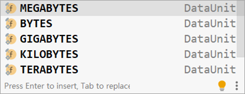
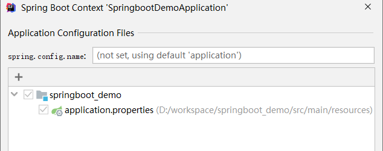
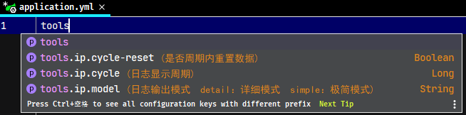

# Spring Boot 基础使用篇

## 1. Spring Boot 简介

Spring 诞生时是 Java 企业版（Java Enterprise Edition，JEE，也称 J2EE）的轻量级代替品。无需开发重量级的 Enterprise JavaBean（EJB），Spring 为企业级Java 开发提供了一种相对简单的方法，通过依赖注入和面向切面编程，用简单的Java 对象（Plain Old Java Object，POJO）实现了 EJB 的功能。

虽然 Spring 的组件代码是轻量级的，但它的配置却是重量级的。

- 第一阶段：xml配置

在Spring 1.x时代，使用Spring开发满眼都是xml配置的Bean，随着项目的扩大，我们需要把xml配置文件放到不同的配置文件里，那时需要频繁的在开发的类和配置文件之间进行切换

- 第二阶段：注解配置

在Spring 2.x 时代，随着JDK1.5带来的注解支持，Spring提供了声明Bean的注解（例如@Controller、@Service），大大减少了配置量。主要使用的方式是应用的基本配置（如数据库配置）用xml，业务配置用注解

- 第三阶段：java配置

Spring 3.0 引入了基于 Java 的配置能力，这是一种类型安全的可重构配置方式，可以代替 XML。我们目前刚好处于这个时代。现在Spring和Springboot都推荐使用java配置。

所有这些配置都代表了开发时的损耗。 因为在思考 Spring 特性配置和解决业务问题之间需要进行思维切换，所以写配置挤占了写应用程序逻辑的时间。除此之外，项目的依赖管理也是件吃力不讨好的事情。决定项目里要用哪些库就已经够让人头痛的了，你还要知道这些库的哪个版本和其他库不会有冲突，这难题实在太棘手。并且，依赖管理也是一种损耗，添加依赖不是写应用程序代码。一旦选错了依赖的版本，随之而来的不兼容问题毫无疑问会是生产力杀手。

Spring Boot 让这一切成为了过去。

Spring Boot其设计目的是用来简化Spring应用的初始搭建以及开发采用约定优于配置，只需要“run”就能创建一个独立的、生产级别的Spring应用。Spring Boot 为 Spring 平台及第三方库提供开箱即用的设置（提供默认设置），这样我们就可以简单的开始。多数 Spring Boot 应用只需要很少的 Spring 配置。

我们可以使用 SpringBoot 创建 java 应用，并使用 `java –jar` 命令启动它，或者采用传统的war部署方式。

### 1.1. 核心功能

- 核心能力：Spring容器、日志、<font color=red>**自动配置AutoCongfiguration、Starters**</font>
- web应用的能力：MVC、嵌入式容器
- 数据访问(持久化)：关系型数据库、非关系型数据库
- 强大的整合其他技术的能力
- 测试：强悍的应用测试

### 1.2. 开发环境要求（2.1.7.RELEASES）

- Spring Boot的2.1.7.RELEASES正式发行版，必须要使用Java8或 Java 11，Spring版本也必须是5.1.8及以上
- 构建工具版本：Maven ，版本要求是3.3及以上
- SpringBoot 支持如下的嵌入式Servlet容器，Spring Boot应用程序最低支持到Servlet 3.1的容器。

### 1.3. 项目构建

强烈推荐选择一个支持依赖管理的构建系统，可以使用它将 artifact 发布到 Maven Central 仓库。所以建议选择 Maven 或者 Gradle。

## 2. Spring Boot 入门

### 2.1. 环境准备

- DataBase：MySQL
- IDE：Eclipse/idea
- SpringBoot：
  - 1.5.6 (官方网站：http://spring.io/) 2017年7月27日
  - 2.0.3版本 2018年6月16日
- SpringBoot参考文档：
  - https://docs.spring.io/spring-boot/docs/2.0.3.RELEASE/reference/htmlsingle/
- Maven：3.3.9 （官方声明Springboot 1.5.6版本需要Maven 3.2+）
- Gradle：4.0.2 (官方网站https://gradle.org/)

- 本地仓库：需要使用资料中的仓库 【仓库(SpringBoot).zip】
- 引用资料中的仓库，重新构建索引：


### 2.2. 创建 Spring Boot 项目（eclipse 版）-已过时，有需要再更新！

#### 2.2.1. 创建Maven工程


#### 2.2.2. 变更JDK版本(非必需)

- 默认情况下工程的JDK版本是1.6，但是通常使用的是1.7的版本


- 修改JDK为1.7，需要在pom.xml中添加以下配置

```xml
<!-- 定义全局属性 -->
<properties>
  <!-- 定义更改JDK版本属性 -->
  <java.version>1.7</java.version>
</properties>
```

- 使用Maven更新工程后，就发现版本已经变成1.7


- 注意：
  - 虽然JDK1.6或者1.7都可以使用SpringBoot，但SpringBoot官方建议使用JDK1.8，要使用JDK1.8，首先必须要配置JDK1.8后，才可以使用上述方法设置。
  - **如果是传统的maven项目，是需要配置jdk插件，但spring boot项目中，只需要配置`<properties>`属性即可**

### 2.3. 创建 Spring Boot 项目（IDEA 版）

#### 2.3.1. 方式1 - 基于 Spring Intialzr（需联网）

IDEA 可以直接通过 Spring Initializr 创建 Spring boot 项目。（注意，此创建方式需要联网）

> *注：以下截图是基于 idea 2021.2.3，之前版本的 idea 中的 Spring Initializr 界面不一样，但流程相差不大*

- 创建新模块/新项目，选择 Spring Initializr，并配置模块相关基础信息。选择 Java 版本和本地计算机上安装的 JDK 版本匹配即可，但是最低要求为 JDK8 或以上版本，推荐使用8或11


- 选择 Spring Boot 的版本与项目所需要的依赖


- 点击 Finish 即可创建新的 Spring Boot 项目。效果如下：


---

**以下是旧版本的 IDEA 的 Spring Initializr 界面**

1. 新建Spring Intialzr项目


2. 填写项目信息，选择Packaging为Jar。


3. 选择项目使用的技术


4. 填写项目名称
5. 将项目设置为Maven项目
6. 项目结构与依赖与手动新建maven项目一致


#### 2.3.2. 方式2 - 官网在线创建

直接访问官网的 Spring Initializr 也可创建 Spring Boot 项目。网址：https://start.spring.io/

- 跟 idea 中的 Spring Initializr 一样。其实本质 idea 也是联网访问此网站。在创建 Spring Boot 程序的界面上，根据需求，在左侧选择对应信息和输入对应的信息即可


- 右侧的【ADD DEPENDENCIES】用于选择使用何种技术，仅仅是界面不同而已，点击后打开网页版的技术选择界面


- 所有信息设置完毕后，点击下面左侧按钮，生成一个文件包并下载，该压缩包即是创建的 SpringBoot 工程文件夹
- 解压缩此文件后，得到工程目录，在 idea 中导入即可使用，和之前创建的东西完全一样。

#### 2.3.3. 方式3 - 选择阿里云创建

阿里在国内提供了一个创建 SpringBoot 项目的

在创建工程时，点击切换选择 Server URL 服务路径，然后输入阿里云提供给服务地址即可。地址：https://start.aliyun.com


使用阿里提供的项目创建服务，会比官方的服务在依赖坐标中添加了一些阿里相关的技术，值得注意，阿里云地址默认创建的 SpringBoot 工程版本是 2.4.1，所以如果需更换其他的版本，创建项目后手工修改即可，别忘了刷新一下，加载新版本信息。


> 注意：阿里云提供的工程创建地址初始化创建的工程，和 SpringBoot 官网创建出来的工程略有区别。主要是在配置文件的形式上有区别。

#### 2.3.4. 方式4 - 基于手动创建 Maven 项目

个人通常习惯通过手动创建 maven 项目的方式，来创建 SpringBoot 项目

- 创建工程时，选择手工创建 Maven 工程


- 填写项目的相关信息


- 点击【Finish】创建项目，这种方式创建的项目十分清爽^o^


- 最后就是手动创建项目结构与参照标准 SpringBoot 工程的 pom 文件，编写项目的 pom 文件即可。SpringBoot 重点就是在 pom.xml 引入 `spring-boot-starter-parent` 的依赖，详情参考下一章节。

### 2.4. 创建 Spring Boot 项目（远程请求方式）

#### 2.4.1. linux 环境

用以下命令即可获取 spring boot 的干净的骨架 pom.xml

```bash
curl -G https://start.spring.io/pom.xml -d dependencies=web,mysql,mybatis -o pom.xml
```

若要获取更多命令、参数及示例等信息，发送以下请求：

```bash
curl https://start.spring.io/
```

#### 2.4.2. windows 环境

可以使用 postman 工具请求，命令与参数参考 linux 环境


### 2.5. 添加依赖

> 注：如果使用 Spring Initializr 创建的 SpringBoot 项目，通常都在 pom.xml 文件已经生成好相关依赖

手动添加 SpringBoot 项目的基础依赖。（以 spring web MVC 项目为示例）

```xml
 <!-- 依赖 SpringBoot 父级工程 -->
<parent>
    <groupId>org.springframework.boot</groupId>
    <artifactId>spring-boot-starter-parent</artifactId>
    <version>2.5.8</version>
    <relativePath/> <!-- lookup parent from repository -->
</parent>

<modelVersion>4.0.0</modelVersion>
<groupId>com.moon</groupId>
<artifactId>spring-boot-demo</artifactId>
<version>1.0-SNAPSHOT</version>

<!-- 配置项目相关的依赖 -->
<dependencies>
    <!--
        配置WEB启动器，包括 SpringMVC、Restful、jackson
        如果是 spring-boot-starter-parent 所包含的 starter，都不需要再指定版本号
     -->
    <dependency>
        <groupId>org.springframework.boot</groupId>
        <artifactId>spring-boot-starter-web</artifactId>
    </dependency>
</dependencies>
```

### 2.6. 启动类

创建 Application 启动类（类名随意命名）：

```java
@SpringBootApplication // 代表为SpringBoot应用的运行主类
public class Application {
  public static void main(String[] args) {
    /** 运行SpringBoot应用 */
    SpringApplication.run(Application.class, args);
  }
}
```

> 注：**`@SpringBootApplication`** 注解代表为 SpringBoot 应用的运行主类

Banner直接启动，控制台会出现Spring启动标识。

```java
@SpringBootApplication // 代表为SpringBoot应用的运行主类
public class Application {
  public static void main(String[] args) {
    /** 创建SpringApplication应用对象 */
    SpringApplication springApplication = new SpringApplication(Application.class);
    /** 设置横幅模式(设置关闭) */
    springApplication.setBannerMode(Banner.Mode.OFF);
    /** 运行 */
    springApplication.run(args);
  }
}
```

参考附录二的banner设置，可以通过修改配置文件制定自己的标识。

### 2.7. 编写入门程序

需求：使用 Spring MVC 实现 Hello World 输出

#### 2.7.1. 原来的 Spring MVC 实现

现在开始使用spring MVC 框架，实现json 数据的输出。如果按照我们原来的做法，需要在web.xml 中添加一个DispatcherServlet 的配置，还需要添加一个spring的配置文件，配置文件如下配置

spring 加入配置

```xml
<!-- controller注解扫描 -->
<context:component-scan base-package="com.moon.springboot.controller" />
<!-- 注解驱动 -->
<mvc:annotation-driven />
```

web.xml加入配置

```xml
<!-- 配置前端控制器 -->
<servlet>
  <servlet-name> springboot01-test</servlet-name>
  <servlet-class>org.springframework.web.servlet.DispatcherServlet</servlet-class>
  <init-param>
    <param-name>contextConfigLocation</param-name>
    <param-value>classpath:spring/*.xml</param-value>
  </init-param>
</servlet>
<servlet-mapping>
  <servlet-name> springboot01-test</servlet-name>
  <url-pattern>/</url-pattern>
</servlet-mapping>
```

还要编写Controller。。。

#### 2.7.2. SpringBoot 的实现

不需要配置文件，直接编写Controller类即可

```java
@RestController
public class HelloController {
  // http://localhost:8080/hello
  @GetMapping("/hello")
  public String hello(){
    return "Hello World";
  }
}
```

> `@RestController` 注解：其实就是 `@Controller` 和 `@ResponseBody` 注解加在一起

- 启动方式一：直接右键启动编写的引导类即可
- 启动方式二：使用Maven命令执行

```bash
spring-boot:run
```

- 在浏览器地址栏输入 http://localhost:8080/hello 即可看到运行结果


## 3. Spring Boot 高级知识

### 3.1. Spring Boot 项目基础组成分析

根据快速入门案例，一个最基础的 SpringBoot 项目包括：

- 起步依赖（简化依赖配置）
- 自动配置（简化常用工程相关配置）
- 辅助功能（内置服务器，……）

#### 3.1.1. spring-boot-starter-parent

通常一个项目需要依赖各种不同的技术，而各个技术的依赖版本之间可能会存在冲突。而 SpringBoot 于是所有的技术版本的常见使用方案都给开发者整理了出来，以后开发者使用时直接用它提供的版本方案，不用担心版本冲突问题了，相当于 SpringBoot 做了无数个技术版本搭配的列表，这个技术搭配列表的名字叫做 `spring-boot-starter-parent`

`spring-boot-starter-parent` 自身具有很多个版本，每个 parent 版本中包含有几百个其他技术的版本号，不同的 parent 间使用的各种技术的版本号有可能会发生变化。当开发者使用某些技术时，直接使用 SpringBoot 提供的 parent 即可，由 parent 来统一的进行各种技术的版本管理

`spring-boot-starter-parent` 仅仅只是进行版本的统一管理，需要开发者导入相应的坐标依赖，


##### 3.1.1.1. Spring Boot 依赖引入实现原理

在项目的 pom.xm 文件中继承父工程 `spring-boot-starter-parent`，查阅 SpringBoot 的配置源码

```xml
<!-- Inherit defaults from Spring Boot -->
<parent>
    <groupId>org.springframework.boot</groupId>
    <artifactId>spring-boot-starter-parent</artifactId>
    <version>2.5.8</version>
</parent>
```

点击 `spring-boot-starter-parent` 查看，里面定义一些插件，又继承了 `spring-boot-dependencies`。

```xml
<parent>
    <groupId>org.springframework.boot</groupId>
    <artifactId>spring-boot-dependencies</artifactId>
    <version>2.5.8</version>
</parent>
```


点击查看 `spring-boot-dependencies`。这个坐标中定义了两组信息，


- 第一组是在 `<properties>` 中定义各种技术的依赖版本号属性。*下面列出依赖版本属性的部分内容*


- 第二组是在 `<dependencyManagement>` 中定义各种技术的依赖坐标信息，依赖坐标定义具体的依赖版本号是引用了第一组信息中定义的依赖版本属性值。值得注意的是，依赖坐标定义是出现在`<dependencyManagement>`标签中的，其实是对引用坐标的依赖管理，并不是实际使用的坐标。因此项目中继承了这组parent信息后，在不使用对应坐标的情况下，前面的这组定义是不会具体导入某个依赖的


**总结：通过 maven 的依赖传递从而实现继承 spring boot 的父依赖后，可以依赖 spring boot 项目相关的 jar**

##### 3.1.1.2. 小结

1. 开发 SpringBoot 程序需要继承 `spring-boot-starter-parent` 父项目
2. `spring-boot-starter-parent` 中定义了各种技术的依赖管理
3. 继承 parent 模块可以避免多个依赖使用相同技术时出现依赖版本冲突
4. 继承 parent 的形式也可以采用 `<scope>` 引入依赖的形式实现效果（*详见《引入 SpringBoot 父工程依赖的方式》章节*）

#### 3.1.2. spring-boot-starter-xxx

##### 3.1.2.1. 概述

SpringBoot 提供了很多 `spring-boot-starter-xxx`，是定义了某种技术各种依赖的固定搭配格式的集合，使用 starter 可以帮助开发者减少依赖配置。*如：spring-boot-starter-web，里面定义了若干个具体依赖的坐标*


使用官方的 starter 引入技术可能会存在一些问题，就是会出现这种过量导入依赖的可能性，不过可以通过maven中的排除依赖剔除掉一部分。对于项目影响不大。


##### 3.1.2.2. 实际开发应用方式

- 实际开发中如果需要用什么技术，先去找有没有这个技术对应的 starter
    - 如果有对应的 starter，直接使用 starter，而且无需指定版本，版本由 parent 提供
    - 如果没有对应的 starter，手写坐标即可
- 实际开发中如果发现坐标出现了冲突现象，确认你要使用的可行的版本号，使用手工书写的方式添加对应依赖，覆盖SpringBoot提供给我们的配置管理
    - 方式一：直接写坐标
    - 方式二：覆盖`<properties>`中定义的版本号

##### 3.1.2.3. starter 与 parent 的区别

- starter 是一个坐标中定义了若干个坐标，引入一个坐标相当于引入多个坐标，是用来减少依赖配置的书写量的。
- parent 是定义了几百个依赖版本号，由 SpringBoot 统一管理控制版本，是用来减少各种技术的依赖冲突

##### 3.1.2.4. starter 命名规范

SpringBoot 官方定义了很多 starter，命名格式：`spring-boot-starter-技术名称`

##### 3.1.2.5. 小结

1. 开发 SpringBoot 程序需要导入某些技术时，通常导入对应的 starter 即可
2. 每个不同的 starter 根据功能不同，通常包含多个依赖坐标
3. 使用 starter 可以实现快速配置的效果，达到简化配置的目的

#### 3.1.3. 引导类

##### 3.1.3.1. 概述

SpringBoot 引导类是指程序运行的入口，即快速开始案例中标识 `@SpringBootApplication` 注解，并带有 main 方法的那个类，运行这个类就可以启动 SpringBoot 工程，并创建了一个 Spring 容器对象。

```java
@SpringBootApplication // 代表为SpringBoot应用的运行主类
public class Application {
  public static void main(String[] args) {
    /** 运行SpringBoot应用 */
    SpringApplication.run(Application.class, args);
  }
}
```

也可以通过 `scanBasePackages` 属性来指定扫描的基础包，<font color=red>**值得注意的是：如果指定扫描基础包后，原来默认扫描当前引导类所在包及其子包的值就会被覆盖**</font>

```java
// SpringBoot 应用启动类
@SpringBootApplication(scanBasePackages={"com.moon.springboot"}) // 指定扫描的基础包
```

<font color="purple">注：如果配置 `@SpringBootApplication` 注解，不指定注解扫描的包，默认约定是扫描当前引导类所在的同级包下的所有包和所有类以及下级包的类（若为 JPA 项目还可以扫描标注 `@Entity` 的实体类），建议入口类放置的位置在 groupId + arctifactID 组合的包名下；如果需要指定扫描包使用注解 `@SpringBootApplication(scanBasePackages = 'xxx.xxx.xx')`</font>

上面的`@SpringBootApplication`相当于下面的3个注解

- `@Configuration`：用于定义一个配置类
- `@EnableAutoConfiguration`：Spring Boot会自动根据你jar包的依赖来自动配置项目
- `@ComponentScan`：告诉Spring 哪个packages 的用注解标识的类会被spring自动扫描并且装入bean 容器。

##### 3.1.3.2. 小结

1. SpringBoot 工程提供引导类用来启动程序
2. SpringBoot 工程启动后创建并初始化 Spring 容器

#### 3.1.4. 内嵌 web 容器（如 tomcat）

##### 3.1.4.1. 内嵌 tomcat 定义与运行原理概述

SpringBoot 内嵌的 web 服务器，需要引入 `spring-boot-starter-web` 的依赖

```xml
<dependency>
    <groupId>org.springframework.boot</groupId>
    <artifactId>spring-boot-starter-web</artifactId>
</dependency>s
```

starter 其中有引入 `spring-boot-starter-tomcat` 的依赖，具体如下：

```xml
<dependencies>
  <dependency>
    <groupId>jakarta.annotation</groupId>
    <artifactId>jakarta.annotation-api</artifactId>
    <version>1.3.5</version>
    <scope>compile</scope>
  </dependency>
  <dependency>
    <groupId>org.apache.tomcat.embed</groupId>
    <artifactId>tomcat-embed-core</artifactId>
    <version>9.0.56</version>
    <scope>compile</scope>
    <exclusions>
      <exclusion>
        <artifactId>tomcat-annotations-api</artifactId>
        <groupId>org.apache.tomcat</groupId>
      </exclusion>
    </exclusions>
  </dependency>
  <dependency>
    <groupId>org.apache.tomcat.embed</groupId>
    <artifactId>tomcat-embed-el</artifactId>
    <version>9.0.56</version>
    <scope>compile</scope>
  </dependency>
  <dependency>
    <groupId>org.apache.tomcat.embed</groupId>
    <artifactId>tomcat-embed-websocket</artifactId>
    <version>9.0.56</version>
    <scope>compile</scope>
    <exclusions>
      <exclusion>
        <artifactId>tomcat-annotations-api</artifactId>
        <groupId>org.apache.tomcat</groupId>
      </exclusion>
    </exclusions>
  </dependency>
</dependencies>
```

其中有一个核心的坐标，`tomcat-embed-core` 叫做tomcat内嵌核心。就是此依赖把tomcat功能引入到了程序中。而 tomcat 服务器运行其实是以对象的形式保存到 Spring 容器，并在 SpringBoot 程序启动时运行起来。

##### 3.1.4.2. 更换内嵌默认内嵌 web 服务器

SpringBoot 提供了3款内置的服务器

- tomcat(默认)：apache出品，粉丝多，应用面广，负载了若干较重的组件
- jetty：更轻量级，负载性能远不及tomcat
- undertow：负载性能勉强跑赢tomcat

更新内嵌服务，只需要加入相应的坐标，把默认的 tomcat 排除掉即可，因为tomcat是默认加载的。

```xml
<dependencies>
    <dependency>
        <groupId>org.springframework.boot</groupId>
        <artifactId>spring-boot-starter-web</artifactId>
        <exclusions>
            <exclusion>
                <groupId>org.springframework.boot</groupId>
                <artifactId>spring-boot-starter-tomcat</artifactId>
            </exclusion>
        </exclusions>
    </dependency>
    <dependency>
        <groupId>org.springframework.boot</groupId>
        <artifactId>spring-boot-starter-jetty</artifactId>
    </dependency>
</dependencies>
```


##### 3.1.4.3. 小结

1. 内嵌 Tomcat 服务器是 SpringBoot 辅助功能之一
2. 内嵌 Tomcat 工作原理是将 Tomcat 服务器作为对象运行，并将该对象交给 Spring 容器管理
3. Spring Boot 提供可以配置替换默认 tomcat 内嵌服务器的功能

### 3.2. 引入 SpringBoot 父工程依赖的方式

#### 3.2.1. 方式1 - 使用 `<parent>` 标签

在pom.xml中添加依赖，效果如下：

```xml
<?xml version="1.0" encoding="UTF-8"?>
<project xmlns="http://maven.apache.org/POM/4.0.0"
         xmlns:xsi="http://www.w3.org/2001/XMLSchema-instance"
         xsi:schemaLocation="http://maven.apache.org/POM/4.0.0 http://maven.apache.org/xsd/maven-4.0.0.xsd">

    <!-- 依赖 SpringBoot 父级工程 -->
    <parent>
        <groupId>org.springframework.boot</groupId>
        <artifactId>spring-boot-starter-parent</artifactId>
        <version>2.5.8</version>
        <relativePath/> <!-- lookup parent from repository -->
    </parent>

    <modelVersion>4.0.0</modelVersion>
    <groupId>com.moon</groupId>
    <artifactId>spring-boot-demo</artifactId>
    <version>1.0-SNAPSHOT</version>
    <name>${project.artifactId}</name>
    <description>SpringBoot 快速开始</description>

    <!-- 配置项目相关的依赖 -->
    <dependencies>
        <!--
            配置WEB启动器，包括 SpringMVC、Restful、jackson
            如果是 spring-boot-starter-parent 所包含的 starter，都不需要再指定版本号
         -->
        <dependency>
            <groupId>org.springframework.boot</groupId>
            <artifactId>spring-boot-starter-web</artifactId>
        </dependency>
    </dependencies>
</project>
```

工程自动添加了好多jar包，而这些jar包正是开发时需要导入的jar包。


这些jar包被刚才加入的 spring-boot-starter-web 所引用了，所以添加 spring-boot-starter-web 后会自动把依赖传递过来。

#### 3.2.2. 方式2 - 定义范围 `<scope>` 为 import

在 SpringBoot 项目的 POM 文件中，可以通过在 POM 文件中继承 Spring-boot-starter-parent 来引用 Srping boot 默认依赖的 jar 包。但使用 parent 这种继承的方式，只能继承一个 spring-boot-start-parent。实际开发中，很可能需要继承自己公司的标准 parent 配置，此时可以使用 `<scope>import</scope>` 来实现多继承。如下例：

```xml
<dependencyManagement>
    <dependencies>
        <!-- Override Spring Data release train provided by Spring Boot -->
        <dependency>
            <groupId>org.springframework.data</groupId>
            <artifactId>spring-data-releasetrain</artifactId>
            <version>Fowler-SR2</version>
            <type>pom</type>
            <scope>import</scope>
        </dependency>
        <dependency>
            <groupId>org.springframework.boot</groupId>
            <artifactId>spring-boot-dependencies</artifactId>
            <version>2.2.4.RELEASE</version>
            <type>pom</type>
            <scope>import</scope>
        </dependency>
    </dependencies>
</dependencyManagement>
```

### 3.3. 使用 Gradle 构建 Spring Boot 项目

要了解如何使用 Spring Boot 和 Gradle，请参阅 Spring Boot 的 Gradle 插件文档：

- [最新API文档](https://docs.spring.io/spring-boot/docs/current/api/)
- 参考文档 ([HTML](https://docs.spring.io/spring-boot/docs/2.5.8/gradle-plugin/reference/htmlsingle/) and [PDF](https://docs.spring.io/spring-boot/docs/2.5.8/gradle-plugin/reference/pdf/spring-boot-gradle-plugin-reference.pdf))
- [API](https://docs.spring.io/spring-boot/docs/2.5.8/gradle-plugin/api/)

## 4. Spring Boot 配置文件

默认情况下，Spring Boot 会加载 resources 目录下的名称为 application.properties 或 application.yml 来获得配置的参数。

### 4.1. Spring Boot 配置信息的查询

SpringBoot 的配置文件，主要的目的就是对配置信息进行修改的，而全部可配置项可以查阅 SpringBoot 的官方文档（当前最新版本）。

文档网址：https://docs.spring.io/spring-boot/docs/current/reference/html/application-properties.html#application-properties

### 4.2. Spring Boot 支持的配置文件类型

#### 4.2.1. properties 与 yml 类型配置

SpringBoot 支持三种类型格式的配置文件，分别如下：

- application.properties（键值对风格配置文件）
- application.yml（层级树键值对风格配置文件）
- application.yaml（与yml完全一样）

后缀为 `.yml` 是一种由 SpringBoot 框架自制的配置文件格式。yml后缀的配置文件的功能和properties后缀的配置文件的功能是一致的。

#### 4.2.2. 不同类型的配置文件优先级

如果 SpringBoot 工程中，3种类型的配置文件同时存在，其加载的优先级顺序如下：

```
application.properties  >  application.yml  >  application.yaml
```

还有，不同配置文件中相同配置按照加载优先级相互覆盖，不同配置文件中不同配置将全部保留。如下例：

- application.properties（properties格式）

```properties
server.port=80
spring.main.banner-mode=off
```

- application.yml（yml格式）

```YML
server:
  port: 81
logging:
  level:
    root: debug
```

- application.yaml（yaml格式）

```yaml
server:
  port: 82
```

不管什么类型的配置文件，SpringBoot 最终会将其渲染成 `.properties` 文件，上面示例最终的配置项为：

```properties
server.port=80
spring.main.banner-mode=off
logging.level.root=debug
```

#### 4.2.3. 番外 - xml 类型配置

Spring Boot 推荐无 xml 配置，但实际项目中，可能有一些特殊要求必须使用 xml 配置，在引导类中通过Spring提供的 `@ImportResource` 来加载 xml 配置

```java
@SpringBootApplication(scanBasePackages = {"com.moon.controller"})
@ImportResource({"classpath:xxx1.xml", "classpath:xxx2.xml"})
public class SpringbootdemoApplication {
  public static void main(String[] args) {
    SpringApplication.run(SpringbootdemoApplication.class, args);
  }
}
```

### 4.3. YAML 文件

#### 4.3.1. yml 配置文件简介

YML 文件格式是YAML (YAML Aint Markup Language)层级树键值对格式文件。YAML是一种直观的能够被电脑识别的的数据序列化格式，并且容易被人类阅读，容易和脚本语言交互的，可以被支持YAML库的不同的编程语言程序导入，比如： C/C++, Ruby, Python, Java, Perl, C#, PHP等。YML文件是以数据为核心的、重数据轻的格式，比传统的xml方式更加简洁。

YML 文件的扩展名可以使用 `.yml` 或者 `.yaml`

#### 4.3.2. YAML 基本语法

- 大小写敏感
- 数据值前边必须有空格，作为分隔符。（属性名与属性值之间使用 `冒号+空格` 作为分隔）
- 使用缩进表示层级关系，同层级左侧对齐。缩进时不允许使用 Tab 键，只允许使用空格（各个系统 Tab 对应的 空格数目可能不同，导致层次混乱）。
- 缩进的空格数目不重要，只要相同层级的元素左侧对齐即可
- `#` 表示注释，从这个字符一直到行尾，都会被解析器忽略。

##### 4.3.2.1. 常见的数据书写格式

```yml
boolean: TRUE  						 # TRUE,true,True,FALSE,false，False均可
float: 3.14    						 # 6.8523015e+5  #支持科学计数法
int: 123       						 # 0b1010_0111_0100_1010_1110    #支持二进制、八进制、十六进制
null: ~        						 # 使用~表示null
string: HelloWorld      			 # 字符串可以直接书写
string2: "Hello World"  			 # 可以使用双引号包裹特殊字符
date: 2018-02-17        			 # 日期必须使用yyyy-MM-dd格式
datetime: 2018-02-17T15:02:31+08:00  # 时间和日期之间使用T连接，最后使用+代表时区
```

##### 4.3.2.2. 数据类型转换

某项目数据库配置如下：

```yml
spring:
  datasource:
    driver-class-name: com.mysql.cj.jdbc.Driver
    url: jdbc:mysql://localhost:3306/ssm_db?serverTimezone=UTC
    username: root
    password: 0127
```

当程序运行时出现问题，一直显示报错信息是密码错误，但使用客户端连接数据库正常操作

```bash
java.sql.SQLException: Access denied for user 'root'@'localhost' (using password: YES)
```

在 yml 配置中是支持二进制，八进制，十六进制。这个问题就出在这里了，因为 0127 在开发者眼中是一个字符串 "0127"，但是在 spring boot 眼中却认作一个数字，而且是一个八进制的数字。当后台使用 String 类型接收数据时，如果配置文件中配置了一个整数值，它是先安装整数进行处理，读取后再转换成字符串。刚好 0127 又是八进制的格式，所以最终以十进制数字 87 的结果存在了。

<font color=red>**总结两个注意点：第一，字符串标准书写加上引号包裹，养成习惯；第二，遇到 0 开头的数据多注意**</font>

#### 4.3.3. YAML 数据语法格式

##### 4.3.3.1. 配置普通数据

语法：`key: value`。注意：value之前有一个空格

```yml
name: haohao
```

还有一种比较特殊的常量，使用单引号与双引号包裹

```yml
msg1: 'hello \n world'  # 单引号忽略转义字符
msg2: "hello \n world"  # 双引号识别转义字符
```

##### 4.3.3.2. 配置对象数据

- 语法：

```yml
# 方式一：
key:
    key1: value1
    key2: value2
# 方式二：
key: {key1: value1,key2: value2}
```

- 示例代码：

```yml
# 方式一：
person:
    name: haohao
    age: 31
    addr: beijing
# 方式二：
person: {name: haohao,age: 31,addr: beijing}
```

- <font color=red>**注意：key1前面的空格个数不限定，在yml语法中，相同缩进代表同一个级别**</font>

##### 4.3.3.3. 配置Map数据

**同上面的对象写法**

##### 4.3.3.4. 配置数组（List、Set）数据

- 语法：

```yml
# 方式一：
key:
    - value1
    - value2
# 方式二：
key: [value1,value2]
```

- 示例代码：

```yml
# 基础类型数组方式一：
city:
    - beijing
    - tianjin
    - shanghai
    - chongqing
# 基础类型数组方式二：
city: [beijing,tianjin,shanghai,chongqing]

# 对象类型数组方式一：
student:
    - name: zhangsan
      age: 18
      score: 100
    - name: lisi
      age: 28
      score: 88
    - name: wangwu
      age: 38
      score: 90
# 对象类型数组方式二：
student:
    -
      name: zhangsan
      age: 18
      score: 100
    -
      name: lisi
      age: 28
      score: 88
    -
      name: wangwu
      age: 38
      score: 90
# 对象类型数组方式三：
student: [{name: zhangsan, age: 18, score: 100}, {name: lisi, age: 28, score: 88}]
```

- **注意：value1与之间的“`-`”之间存在一个空格**

##### 4.3.3.5. 参数引用

通过`${}`可以引用yml内容定义的其他参数的值

```yml
name: MooN
person:
    name: ${name} # 引用上边定义的name值
```

#### 4.3.4. YAML 文件缺点

值得注意的是：YAML 文件中的属性不能通过 `@PropertySource` 注解来导入。所以，如果项目中使用了一些自定义属性文件，建议不要用 YAML，改用 properties 类型文件。

如果需要自定义属性存放在yaml文件中，可以使用 `spring.profiles.active` 属性指定多个后缀名的配置文件的方式来引入


### 4.4. 读取项目配置文件

> 注：以下读取的方法 properties 与 yml 文件通用。

#### 4.4.1. 方式一：Environment 对象

SpringBoot 提供了`org.springframework.core.env.Environment` 类，此类能够将所有配置数据都封装到这一个实例中，通过该对象的 `getProperty()` 方法，可以获取到任意指定的配置项的值。

**读取 properties 类型**

- 在工程的 src/main/resources 下修改核心配置文件 application.properties，添加内容如下

```properties
name=月之哀伤
url=http://www.moon.com
```

- 在Controller中添加测试：

```java
import org.springframework.beans.factory.annotation.Autowired;
import org.springframework.core.env.Environment;
import org.springframework.web.bind.annotation.GetMapping;
import org.springframework.web.bind.annotation.RestController;

@RestController
public class HelloController {
  @Autowired
  private Environment environment;

  @GetMapping("/hello")
  public String hello(){
    System.out.println(environment.getProperty("name"));
    System.out.println(environment.getProperty("url"));
    return "Hello World";
  }
}
```

**读取 yml 类型示例**


#### 4.4.2. 方式二：@Value 注解

还是上面的例子，可以使用 Spring 的 `@value` 注解，标识在指定的 Spring 管控的 bean 的属性名上，即可获取配置文件相应的内容。

```java
import org.springframework.beans.factory.annotation.Autowired;
import org.springframework.beans.factory.annotation.Value;
import org.springframework.core.env.Environment;
import org.springframework.web.bind.annotation.GetMapping;
import org.springframework.web.bind.annotation.RestController;

@RestController
public class HelloController {
    @Autowired
    private Environment environment;
    @Value("${name}")
    private String name;
    @Value("${url}")
    private String url;

    @GetMapping("/hello")
    public String hello(){
        System.out.println(environment.getProperty("name"));
        System.out.println(environment.getProperty("url"));
        System.out.println(name);
        System.out.println(url);
        return "Hello World";
    }
}
```

> *注：使用`@Value`注解，只能映射配置文件的字符串类型的值，不能直接映射对象与数组，只能依次逐个层级点*

**读取 yml 类型示例**


#### 4.4.3. 方式三：@ConfigurationProperties 注解（将配置文件的属性值封装到实体类）

上面使用 `@Value` 注入每个配置在实际项目中麻烦。Spring Boot 提供了一个 `@ConfigurationProperties(prefix="配置文件中的key的前缀")` 注解，可以将配置文件中的某个指定前缀的配置项自动与实体进行映射。Spring Boot 将此方式称为：基于类型安全的配置方式，通过 `@ConfigurationProperties` 将 properties 属性和一个 Bean 及其属性关联，从而实现类型安全的配置

**值得注意的是，要实现配置与实体类映射的前提条件是：该映射的类需要交 Spring 容器管理**。

##### 4.4.3.1. 读取默认配置文件(yml 与 properties 格式均可用)

- 在 pom.xml 文件引入 configuration-processor 的依赖

```xml
<!-- @ConfigurationProperties执行器的配置 -->
<dependency>
    <groupId>org.springframework.boot</groupId>
    <artifactId>spring-boot-configuration-processor</artifactId>
    <optional>true</optional>
</dependency>
```

> 注：此依赖非必须，不依赖也能实现属性映射功能，但 IDEA 会在使用了 `@ConfigurationProperties` 注解的类文件中出现以下提示信息


- 在 yml 中定义一个对象类型的配置

```yml
company:
  name: MooNkirA
  tel: 13800000000
  email: moon@moon.com
  subject:
    - Java
    - python
    - Big data
```

- 在自定义配置映射类中，加上注解 `@ConfigurationProperties`，表明该类为配置映射类，并通过属性 `prefix` 指定默认配置文件（application.properties/application.yml）中某个指定前缀的，从而实现配置自动与实体进行映射。其中有如下**两种方式**让配置映射对象交给 Spring 容器管理：

**方式1**：直接在配置映射类上标识 `@Component` 等注解，让 Spring boot 在启动时通过包扫描将该类作为一个 Bean 注入 IOC 容器。如：

```java
@Component
// prefix 用来选择属性的前缀，也就是在配置文件中的“company”以下的属性
// ignoreUnknownFields 是用来告诉 SpringBoot 在有属性不能匹配到声明的域时抛出异常
@ConfigurationProperties(prefix = "company", ignoreUnknownFields = false)
@Data
// 注：如果使用@Configuration注解，则同时需要加上@EnableConfigurationProperties指定加载的配置类
// @Configuration
// @EnableConfigurationProperties(Company.class)
public class Company {
    private String name;
    private String tel;
    private String email;
    private String[] subject;
}
```

**方式2**：在引导类中（或者本身自定义配置类），加上 `@EnableConfigurationProperties` 注解，并指明需要映射的 JavaBean 类。当使用 `@EnableConfigurationProperties` 注解时，spring 会默认将其标注的类定义为 bean，因此配置映射类就无需再次标识 `@Component` 注解，如：

```java
@ConfigurationProperties("company") // 直接使用 @ConfigurationProperties 进行属性绑定
@Data
public class Company {
    private String name;
    private String tel;
    private String email;
    private String[] subject;
}


@SpringBootApplication
// 在配置类上开启 @EnableConfigurationProperties 注解，并标注要使用 @ConfigurationProperties 注解绑定属性的类
@EnableConfigurationProperties({Company.class})
public class Application {
    ....
}
```

> <font color=red>**建议使用 `@EnableConfigurationProperties` 声明引入的配置类，如此在不使用此类的时候，就不会出现因为配置类标识了 `@Component` 注解，而加入到 Spring 容器的情况，从而减少 spring 管控的资源数量。**</font>

**读取 yml 类型示例映射示意图**


- 在控制类注入安全配置映射类，测试读取配置文件内容

```java
@RestController
@RequestMapping("config")
public class DemoController {
    // 自动注入映射配置类
    @Autowired
    private Company company;

    // 通过 @ConfigurationPropertiesBean 注解方式进行配置与实体映射读取
    @GetMapping("config-properties")
    public Company readByConfigurationProperties() {
        return company;
    }
}
```

**补充说明**：其实 spring-boot-configuration-processor 工具只是给实体类的属性注入时开启提示，即在定义需要注入的实体后，在编写 application.properties 和 application.yml 中给相应实体类注入属性时会出现提示，仅此而已，其实用处不大。还有就是如果依赖此工具后，在打包时最好在 build 的标签中排除对该工具的打包，从而减少打成jar包的大小

```xml
<build>
    <plugins>
        <plugin>
            <groupId>org.springframework.boot</groupId>
            <artifactId>spring-boot-maven-plugin</artifactId>
            <configuration>
                <excludes>
                    <exclude>
                        <groupId>org.springframework.boot</groupId>
                        <artifactId>spring-boot-configuration-processor</artifactId>
                    </exclude>
                </excludes>
            </configuration>
        </plugin>
    </plugins>
</build>
```

##### 4.4.3.2. 读取自定义的配置文件(只能读取properties格式，该注解并不支持加载yml！)

上面方式1是写在默认配置文件 application.properties 中，如果属性太多，实际项目可能会根据模块去拆分一些配置，并配置在不同的自定义配置文件中。

**方式2：读取自定义的配置文件**的具体步骤如下：

- 在 pom.xml 文件中引入 configuration-processor 依赖

```xml
<dependency>
    <groupId>org.springframework.boot</groupId>
    <artifactId>spring-boot-configuration-processor</artifactId>
    <optional>true</optional>
</dependency>
```

- 创建自定义配置文件 config/cat.properties （配置文件存放位置随意）

```properties
cat.name=HelloKitty
cat.age=5
cat.color=pink
```

- 在引导类中（或者本身自定义配置类）中，使用 `@PropertySource` 注解，引入自定义 properties 配置文件。*需要注意，如果在Spring Boot版本为1.4或1.4之前，则需要`@PropertySource`注解上加`location`属性，并指明该配置文件的路径*

```java
@SpringBootApplication
// 通过 @PropertySource 注解手动导入 properties 文件，测试使用 @ConfigurationProperties 注解进行配置和实体映射
@PropertySource("classpath:config/cat.properties")
public class Application {
    ....
}
```

- 在自定义配置映射类中，加上注解`@ConfigurationProperties`，表明该类为配置映射类，并通过属性 `prefix` 指定自定义配置文件（*示例是 cat.properties*）中某个指定前缀的，从而实现配置自动与实体进行映射。与加载默认配置文件操作一样，有如下两种方式让配置映射对象交给 Spring 容器管理：


1. 直接在配置映射类上标识 `@Component` 等注解，让 Spring boot 在启动时通过包扫描将该类作为一个 Bean 注入 IOC 容器。如：

```java
@Component
@ConfigurationProperties(prefix = "cat", ignoreUnknownFields = false)
@Data
// 注：如果使用@Configuration注解，则同时需要加上@EnableConfigurationProperties指定加载的配置类
// @Configuration
// @EnableConfigurationProperties(Cat.class)
public class Cat {
    private String name;
    private int age;
    private String color;
}
```

2. 在引导类中（或者本身自定义配置类），加上`@EnableConfigurationProperties`注解，并指明需要映射的JavaBean类。此时配置映射类就不需要标识 `@Component` 等注解，如：

```java
// prefix用来选择属性的前缀，也就是在cat.properties文件中的“cat”以下的属性
// ignoreUnknownFields 是用来告诉 SpringBoot 在有属性不能匹配到声明的域时抛出异常
@ConfigurationProperties(prefix = "cat", ignoreUnknownFields = false)
@Data
public class Cat {
    private String name;
    private String tel;
    private String email;
    private String[] subject;
}


@SpringBootApplication
@EnableConfigurationProperties({Cat.class})
@PropertySource("classpath:config/cat.properties")
public class Application {
    ....
}
```

- 在控制类注入安全配置映射类，测试读取配置文件内容

```java
@RestController
@RequestMapping("config")
public class DemoController {
    // 自动注入映射配置类
    @Autowired
    private Cat cat;

    // 通过 @ConfigurationPropertiesBean 注解方式进行配置与实体映射读取
    @GetMapping("config-properties")
    public Cat readByConfigurationProperties() {
        return cat;
    }
}
```

> **注：方式1的读取默认配置文件的方式，此方式也可以实现。省略`@PropertySource`注解即可**
>
> `@EnableConfigurationProperties` 与 `@Component` 注解不能同时使用

##### 4.4.3.3. 第三方 jar 包中 bean 加载配置属性值

上面都自定义的 bean 加载配置属性值，`@ConfigurationProperties` 注解是标识在类定义的上，而又不可能到第三方 jar 包中开发的 bean 源代码中去添加 `@ConfigurationProperties` 注解，那如何解决第三方 bean 加载配置属性值的问题？

- 步骤1：在配置类中，使用 `@Bean` 注解创建第三方 bean 实例

```java
@Configuration
public class DruidConfig {
    /* 1. 使用 @Bean 注解创建第三方 bean 实例 */
    @Bean
    public DruidDataSource datasource() {
        return new DruidDataSource();
    }
}
```

- 步骤2：在 application.yml/application.properties 中定义要绑定的属性，<font color=red>**注意：示例配置中 `datasource` 是全小写，非 spring boot 原生 `spring.datasource.driver-class-name` 的配置**</font>

```yml
datasource:
  driverClassName: com.mysql.jdbc.Driver
```

- 步骤3：使用 `@ConfigurationProperties` 注解标识在创建第三方 bean 实例的方法，进行属性绑定，<font color=red>**注意前缀是全小写的datasource**</font>

```java
@Bean
/* 2. 使用 @ConfigurationProperties 注解标识在创建第三方 bean 实例的方法，进行属性绑定，注意前缀是全小写的 datasource */
@ConfigurationProperties(prefix = "datasource")
public DruidDataSource datasource(){
    DruidDataSource ds = new DruidDataSource();
    return ds;
}
```

#### 4.4.4. @ConfigurationProperties 与 @Value 读取配置的区别

- 使用 `@ConfigurationProperties` 方式可以进行配置文件与实体字段的自动映射，但需要字段必须提供 `setter` 方法才可以
- 使用 `@Value` 注解修饰的字段不需要提供 `setter` 方法

### 4.5. @ConfigurationProperties 属性绑定的规则

#### 4.5.1. 宽松绑定/松散绑定

在进行属性绑定时，可能会遇到如下情况，为了进行标准命名，开发者会将属性名严格按照驼峰命名法书写，在 yml 配置文件中将 `datasource` 修改为 `dataSource`，如下：

```yml
dataSource:
  driverClassName: com.mysql.jdbc.Driver
```

此时程序可以正常运行，然后又将代码中 `@ConfigurationProperties` 的前缀 `datasource` 修改为 `dataSource`

```java
@Bean
@ConfigurationProperties(prefix = "dataSource")
public DruidDataSource datasource(){
    DruidDataSource ds = new DruidDataSource();
    return ds;
}
```

此时就会发生编译错误，提示配置属性名 `dataSource` 是无效的，报错信息如下：

```bash
Configuration property name 'dataSource' is not valid:

    Invalid characters: 'S'
    Bean: datasource
    Reason: Canonical names should be kebab-case ('-' separated), lowercase alpha-numeric characters and must start with a letter

Action:
Modify 'dataSource' so that it conforms to the canonical names requirements.
```

spring boot 进行属性绑定时，进行编程时人性化设计，几乎主流的命名格式都支持，称为**属性名称的宽松绑定**，也可以称为**宽松绑定**。即配置文件中的命名格式与变量名的命名格式可以进行格式上的最大化兼容，例如，在 `ServerConfig` 中有的 `ipAddress` 属性名

```java
@Component
@Data
@ConfigurationProperties(prefix = "servers")
public class ServerConfig {
    private String ipAddress;
}
```

其中 `ipAddress` 属性与下面的配置属性名规则全兼容

```yml
servers:
  ipAddress: 192.168.0.2       # 驼峰模式
  ip_address: 192.168.0.2      # 下划线模式
  ip-address: 192.168.0.2      # 烤肉串模式
  IP_ADDRESS: 192.168.0.2      # 常量模式
```

也可以说，以上 4 种配置名称模式，最终都可以匹配到 `ipAddress` 这个属性名。其中原因就是在进行匹配时，配置中的名称要去掉中划线和下划线后，忽略大小写的情况下去与 java 代码中的属性名进行忽略大小写的等值匹配，而以上 4 种命名去掉下划线中划线忽略大小写后都是一个词 `ipaddress`，java 代码中的属性名忽略大小写后也是 `ipaddress`，因此就可以进行等值匹配了，这就是为什么这4种格式都能匹配成功的原因。不过<font color=red>**spring boot 官方推荐配置名称使用烤肉串模式，也就是中划线模式**</font>。

分析上面报错信息，其中 Reason 描述了报错的原因，规范的名称应该是烤肉串(kebab)模式(case)，即使用`-`分隔，使用小写字母数字作为标准字符，且必须以字母开头。所以当配置 `@ConfigurationProperties` 的前缀为 `dataSource` 时，会出现问题。

> <font color=red>**值得注意：以上规则仅针对 springboot 中 `@ConfigurationProperties` 注解进行属性绑定时有效，对 `@Value` 注解进行属性映射无效。**</font>

#### 4.5.2. 常用计量单位绑定

在项目的配置中，经常需要一些数值类型配置值，但就会造成有些人理解的偏差，就这些数值的配置值单位是什么？比如线上服务器完成一次主从备份，配置超时时间240，这个240如果单位是秒就是超时时间4分钟，如果单位是分钟就是超时时间4小时。

为了消除每个人对配置理解的偏差，除了加强约定之外，springboot 充分利用了 JDK8 中提供的全新的用来表示计量单位的新数据类型，从根本上解决这个问题。以下模型类中添加了两个 JDK8 中新增的类，分别是 `Duration` 和 `DataSize`，使用此两个单位就可以有效避免因沟通不同步或文档不健全导致的配置信息不对称问题，从根本上解决了问题，避免产生误读。

```yml
servers:
  ip-address: 192.168.0.2       # 官方推荐配置名称使用烤肉串模式，也就是中划线模式
  serverTimeOut: 3    # 使用常用计量单位绑定
  dataSize: 10        # 使用常用计量单位绑定
```

```java
@Data
@ConfigurationProperties("servers")
public class ServerConfig {
    private String ipAddress;
    // Duration 时间类型，@DurationUnit 指定单位为 hour
    @DurationUnit(ChronoUnit.HOURS)
    private Duration serverTimeOut;
    // DataSize 数据大小类型，@DataSizeUnit 指定单位为 MB
    @DataSizeUnit(DataUnit.MEGABYTES)
    private DataSize dataSize;
}
```

- `org.springframework.boot.convert.DurationUnit`：表示时间间隔，可以通过 `@DurationUnit` 注解描述时间单位，例如上例中描述的单位为小时（`ChronoUnit.HOURS`）
- `org.springframework.util.unit.DataSize`：表示存储空间，可以通过 `@DataSizeUnit` 注解描述存储空间单位，例如上例中描述的单位为 MB（`DataUnit.MEGABYTES`）

`Druation` 常用单位如下：


`DataSize` 常用单位如下：



测试：


### 4.6. 解决 IDEA 对 SpringBoot 配置文件无自动提示的问题

无自动提示的原因是：IDEA 没有识别此文件是 SpringBoot 的配置文件

步骤1：打开设置，【Files】 -> 【Project Structure...】


步骤2：在弹出窗口中左侧选择【Facets】，右侧选中 Spring 路径下对应的模块名称，也就是你自动提示功能消失的那个模块


步骤3：点击【Customize Spring Boot】按钮，此时可以看到当前模块对应的配置文件是哪些了。如果没有你想要称为配置文件的文件格式，就有可能无法弹出提示




步骤4：选择添加配置文件，然后选中要作为配置文件的具体文件就OK了


## 5. Spring Boot 日志配置

### 5.1. 日志格式

Spring Boot 默认日志输出类似于以下示例：


输出以下项：

- 日期和时间：毫秒精度，易于排序。
- 日志级别：`ERROR`、`WARN`、`INFO`、`DEBUG` 或 `TRACE`。
- PID：进程 ID。用于表明当前操作所处的进程，当多服务同时记录日志时，该值可用于协助程序员调试程序
- 一个 `---` 分隔符，用于区分实际日志内容的开始。
- 线程名称：在方括号中（可能会截断控制台输出）。
- 日志记录器名称：这通常是源类名称（通常为缩写）。
- 日志内容。

> 注意：Logback 没有 `FATAL` 级别。该级别映射到 `ERROR`。

### 5.2. 设置日志输出级别

Spring Boot 默认日志配置会在写入时将消息回显到控制台。默认情况下，会记录 ERROR、WARN 和 INFO 级别的日志。

#### 5.2.1. 命令行开启调试模式

通过命令参数 `--debug` 来调整应用程序日志输出级别为调试模式

```bash
java -jar springboot-demo.jar --debug
```

> 注：以上命令行方式相当在 application.properties 文件中指定 `debug=true`。

还可以通过使用 `--trace` 标志（或在 application.properties 中的设置 `trace=true`）启动应用程序来启用跟踪模式。这样做可以为选择的核心日志记录器（内嵌容器、Hibernate 模式生成和整个 Spring 组合）启用日志追踪。

#### 5.2.2. 配置文件设置日志输出级别

通过项目的配置文件来指定日志输出级别

- 开启 debug 模式，输出调试信息，常用于检查系统运行状况

```yml
debug: true # 开启debug模式
```

```properties
debug=true # 开启debug模式
```

- 对 root 根节点设置日志级别，即整体应用日志级别

```yml
logging:
  level:
    root: debug # 设置日志级别，root表示根节点，即整体应用日志级别
```

```properties
logging.level.root=debug # 设置日志级别，root表示根节点，即整体应用日志级别
```

- 对包级别节点设置日志级别，即指定的包内的日志级别

```yml
logging:
  level:
    com.moon.foo: debug # 对指定的包设置日志输出级别
```

```properties
logging.level.com.moon.foo=debug
```

- 设置日志组，分别对组内所有包设置日志输出级别

```yml
logging:
  group: # 设置日志组
    # 自定义组名，设置当前组中所包含的包
    fooGroup: com.moon.foo,com.moon.bar
    barGroup: com.zero.foo,com.zero.bar
  level:
    fooGroup: debug # 设置指定的组的日志级别
    barGroup: warn
```

```properties
# 设置日志组
logging.group.fooGroup=com.moon.foo,com.moon.bar
logging.group.barGroup=com.zero.foo,com.zero.bar
# 设置指定的组的日志级别
logging.level.fooGroup=debug
logging.level.barGroup=warn
```

### 5.3. 自定义日志输出格式

`logging.pattern.console` 可以配置日志输出的格式，示例如下：

```yml
logging:
  pattern:
    console: "%d %clr(%p) --- [%16t] %clr(%-40.40c){cyan} : %m %n"
```

> 上面参数的意思是 `%d`：日期；`%m`：消息；`%n`：换行。。。

### 5.4. 日志文件输出

Spring Boot 对于日志文件的使用存在各种各样的策略，例如每日记录，分类记录，报警后记录等。需要设置 `logging.file` 或 `logging.path` 属性

- `logging.file.name`：用于指定日志保存的文件名称，配置此属性后，即可将程序运行的日志都会追加到此日志文件中
- `logging.file.path`：用于指定日志文件保存的位置。*如果不指定，日志文件默认保存路径在项目同级目录下*
- ~~`logging.file.max-history`：用于限制日志文件的大小，否则会无限期归档到文件中。~~（已过时）

```yml
logging:
  file:
    name: server.log # 写入指定的日志文件。名称可以是绝对位置或相对于当前目录。
    path: /log # 将日志文件写入指定的目录。名称可以是绝对位置或相对于当前目录。
```

- 设置分文件存储日志，并限制每个日志文件的大小。下面以logback日志框架配置为例，常用配置如下：

```yml
logging:
  file:
    name: server.log # 指定日志的文件名称
    path: /log # 指定日志文件的保存地址
  logback: # logback 配置
    rollingpolicy:
      max-file-size: 3kb
      file-name-pattern: server.%d{yyyy-MM-dd}.%i.log
```

## 6. 热部署

在开发中反复修改类、页面等资源，每次修改后都是需要重新启动才生效，这样每次启动都很麻烦，浪费了大量的时间。在修改程序代码后，不需要重启程序就能让修改的内容生效，称为热部署

### 6.1. 热部署底层工作原理 - 重启与重载

一个 springboot 项目在运行时实际上是分两个过程进行的，根据加载的东西不同，划分成 **base 类加载器**与 **restart 类加载器**。

- base 类加载器：用来加载 jar 包中的类，jar 包中的类和配置文件由于不会发生变化，因此不管加载多少次，加载的内容不会发生变化
- restart 类加载器：用来加载开发者自己开发的类、配置文件、页面等信息，这一类文件受开发者影响

当 springboot 项目启动时，base 类加载器执行，加载 jar 包中的信息后，restart 类加载器执行，加载开发者制作的内容。当执行构建项目后，由于 jar 中的信息不会变化，因此 base 类加载器无需再次执行，所以仅仅运行 restart 类加载即可，也就是将开发者自己制作的内容重新加载就行了，这就完成了一次热部署的过程，也可以说热部署的过程实际上是重新加载 restart 类加载器中的信息。

### 6.2. 热部署配置

#### 6.2.1. 引入依赖

1. 可以在 pom.xml 配置文件中添加 `spring-boot-devtools` 工具，就可以实现热部署功能

```xml
<!-- 使用spring-boot-devtools提供的开发者工具，配置devtools开启热部署 -->
<dependency>
    <!--
       devtools可以实现页面热部署（即页面修改后会立即生效，这个可以直接在application.properties文件中配置spring.thymeleaf.cache=false来实现），
       实现类文件热部署（类文件修改后不会立即生效），实现对属性文件的热部署。
       即devtools会监听classpath下的文件变动，并且会立即重启应用（发生在保存时机），注意：因为其采用的虚拟机机制，该项重启是很快的
    -->
    <groupId>org.springframework.boot</groupId>
    <artifactId>spring-boot-devtools</artifactId>
    <!-- 表示依赖不会向下传递 -->
    <optional>true</optional>
</dependency>
```

2. 仅仅加入 devtools 后，idea 还是不起作用，这时候还需要添加的 `spring-boot-maven-plugin` 插件

```xml
<build>
    <plugins>
        <!--
            用于将应用打成可直接运行的jar（该jar就是用于生产环境中的jar） 值得注意的是，如果没有引用spring-boot-starter-parent做parent，
               且采用了上述的第二种方式，这里也要做出相应的改动
         -->
        <plugin>
            <groupId>org.springframework.boot</groupId>
            <artifactId>spring-boot-maven-plugin</artifactId>
            <configuration>
                <!-- fork : 如果没有该项配置，这个devtools不会起作用，即应用不会restart -->
                <fork>true</fork>
            </configuration>
        </plugin>
    </plugins>
</build>
```

> 将依赖关系标记为可选`<optional>true</optional>`是一种最佳做法，可以防止使用项目将devtools传递性地应用于其他模块。

#### 6.2.2. IDEA 配置自动启动热部署

在引入 spring-boot-devtools 依赖，此时修改代码后，项目是不会自动重启，需要手动点击菜单【Build】 -> 【Build Project】（或者使用快捷键 CTRL+F9）


出现这种情况，并不是热部署配置问题，其根本原因是因为 Intellij IEDA 默认情况下不会自动编译，需要对IDEA进行自动编译的设置，如下：


然后使用快捷键 `Shift + Ctrl + Alt + /`，选择【Registry】，勾选【compiler.automake.allow.when.app.running】


这样程序在运行的时候就可以进行自动构建了，实现了热部署的效果。但值得注意的是：IDEA 不会在每次修改都马上进行构建，<font color=red>**只在 IDEA 失去焦点5秒后进行热部署**</font>，即从 idea 切换到其他软件时进行热部署，比如改完程序需要到浏览器上去调试，这个时候 idea 就自动进行热部署操作。

### 6.3. 排除静态资源文件

在 Spring Boot 项目中某些资源在更改时不一定需要触发重启程序。例如 Thymeleaf 模板文件就可以实时编辑等。默认情况下，有些资源是不会触发重启，而是触发live reload（devtools内嵌了一个 LiveReload server，当资源发生改变时，浏览器刷新）。如下：

- /META-INF/maven
- /META-INF/resources
- /resources
- /static
- /public
- /templates

如果自定义排除触发热部署的资源，可以设置 `spring.devtools.restart.exclude` 配置项。示例如下：

```properties
# 仅排除 /static 和 /public 的内容
spring.devtools.restart.exclude=static/**,public/**
# 如果想保留默认配置，同时增加新的配置，则可使用
# spring.devtools.restart.additional-exclude属性
```

```yml
spring:
  devtools:
    restart:
      # 设置不参与热部署的文件或文件夹
      exclude: static/**,public/**,config/application.yml
```

### 6.4. 设置触发热部署的文件

若不想每次修改都触发自动重启，可以在application.xml设置`spring.devtools.restart.trigger-file`指向某个文件，只有更改这个文件时才触发自动重启。示例如下：


```yml
spring:
  devtools: # 配置更改指定文件时才触发自动重启
    restart:
      trigger-file: .trigger  # 文件所在路径是 /resources/META-INF/.trigger
```

### 6.5. 全局设置

可以通过向`$HOME`文件夹添加名为`.spring-boot-devtools.properties`的文件来配置全局devtools设置（请注意，文件名以“`.`”开头）。 添加到此文件的任何属性将适用于计算机上使用devtools的所有 Spring Boot应用程序。 例如，要配置重启始终使用触发器文件 ，可以添加以下内容：

```
〜/ .spring-boot-devtools.properties
```

### 6.6. Devtools 在 Spring Boot 中的可选配置

```properties
# Whether to enable a livereload.com-compatible server.
spring.devtools.livereload.enabled=true

# Server port.
spring.devtools.livereload.port=35729

# Additional patterns that should be excluded from triggering a full restart.
spring.devtools.restart.additional-exclude=

# Additional paths to watch for changes.
spring.devtools.restart.additional-paths=

# Whether to enable automatic restart.
spring.devtools.restart.enabled=true

# Patterns that should be excluded from triggering a full restart.
spring.devtools.restart.exclude=META-INF/maven/**,META-INF/resources/**,resources/**,static/**,public/**,templates/**,**/*Test.class,**/*Tests.class,git.properties,META-INF/build-info.properties

# Whether to log the condition evaluation delta upon restart.
spring.devtools.restart.log-condition-evaluation-delta=true

# Amount of time to wait between polling for classpath changes.
spring.devtools.restart.poll-interval=1s

# Amount of quiet time required without any classpath changes before a restart is triggered.
spring.devtools.restart.quiet-period=400ms

# Name of a specific file that, when changed, triggers the restart check. If not specified, any classpath file change triggers the restart.
spring.devtools.restart.trigger-file=
```

### 6.7. 关闭热部署

线上环境运行时是不可能使用热部署功能的，所以需要强制关闭此功能。可通过 Spring Boot 配置文件来关闭此功能，修改 application.yml 如下配置即可：

```yml
spring:
  devtools:
    restart:
      enabled: false
```

扩展：在项目开发过程中，有可能别的开发人员配置文件层级过高导致相符覆盖最终引起配置失效，此时可以提高配置的层级，在更高层级中配置关闭热部署。例如在启动容器前通过系统属性设置关闭热部署功能：

```java
@SpringBootApplication
public class DemoApplication {
    public static void main(String[] args) {
        System.setProperty("spring.devtools.restart.enabled", "false");
        SpringApplication.run(DemoApplication.class);
    }
}
```

**总结：线上环境的维护是不可能出现修改代码的操作，配置关闭热部署功能，最终的目的是降低线上程序的资源消耗**

### 6.8. 其他热部署工具

由于Spring Boot应用只是普通的Java应用，所以JVM热交换（hot-swapping）也能开箱即用。不过JVM热交换能替换的字节码有限制，想要更**彻底的解决方案可以使用Spring Loaded项目或JRebel**。spring-boot-devtools 模块也支持应用快速重启(restart)。

## 7. SpringBoot 监听机制（整理中）

SpringBoot 在项目启动时，会对几个内置的监听器进行回调，开发者可以实现这些监听器接口，在项目启动时完成一些操作。

### 7.1. ApplicationContextInitializer(补充示例)

如果想让这些监听器自动注册，不管应用程序是如何创建的，可以在项目中添加一个`META-INF/spring.plants`文件，并通过使用 `org.springframework.context.ApplicationListener` 键来指定相应的自定义监听器(`ApplicationContextInitializer`的实现类)，如下例：

```properties
org.springframework.context.ApplicationContextInitializer=com.moon.springboot.listener.MyApplicationContextInitializer
```

### 7.2. SpringApplicationRunListener（补充示例）

```properties
org.springframework.boot.SpringApplicationRunListener=com.moon.springboot.listener.MySpringApplicationRunListener
```

### 7.3. CommandLineRunner 与 ApplicationRunner

#### 7.3.1. 简介

如果需要在 `SpringApplication` 启动后运行一些特定的代码，可以实现 SpringBoot 提供的 `ApplicationRunner` 或 `CommandLineRunner` 接口。这两个接口的工作方式相同，并提供一个单一的运行方法，该方法会在 `SpringApplication.run(...)` 完成之前被调用。

> 注：这两个监听回调接口，适合运用在项目应用启动后做一些数据的预处理等工作。如：将读取一些数据库的数据到Redis缓存中，完成数据的预热。

#### 7.3.2. 基础使用

`CommandLineRunner` 接口的 `run` 方法入参是字符串数组，是应用程序的相关参数

```java
@Component
public class MyCommandLineRunner implements CommandLineRunner {

    @Override
    public void run(String... args) {
        // Do something...
    }

}
```

而 `ApplicationRunner` 接口的`run`方法是入参是 `ApplicationArguments` 接口，此接口提供了对应用原始的 `String[]` 参数以及经过解析的选项和非选项参数的访问。

```java
@Component
public class MyApplicationRunner implements ApplicationRunner {

    @Override
    public void run(ApplicationArguments args) throws Exception {
        // Do something...
    }

}
```

#### 7.3.3. 使用注意事项

- 如果项目中定义多个 `CommandLineRunner` 与 `ApplicationRunner` 接口的实现。那需要注意它们这些实现的调用顺序，以免发现不可预测的问题。另外，可以通过实现 `org.springframework.core.Ordered` 接口或使用 `org.springframework.core.annotation.Order` 注解来指定实现类调用的顺序。
- `CommandLineRunner` 与 `ApplicationRunner` 接口的实现不需要到`META-INF/spring.plants`进行配置相关映射。

## 8. Spring Boot 视图

### 8.1. 静态资源html视图

- SpringBoot默认有四个静态资源文件夹：
  - classpath:/static/
  - classpath:/public/
  - classpath:/resources/
  - classpath:/META-INF/resources/
- 在spring-boot-autoconfigure-1.5.6.RELEASE.jar的web包的

ResourceProperties类中作了默认的配置：

```java
private static final String[] CLASSPATH_RESOUTCE_LOCATIONS = {
    "classpth:/META-INF/resources/", "classpath:/resources/",
    "classpath:/static/", "classpath:/public/" };
```

- 第一步：提供src/main/resources/public/html/user.html

```html
<!DOCTYPE html>
<html>
  <head>
    <title>SpringBoot</title>
    <meta charset="UTF-8"/>
    <meta http-equiv="pragma" content="no-cache"/>
    <link rel="shortcut icon" type="image/x-icon" href="logo.ico"/>
  </head>
  <body>
    user
  </body>
</html>
```

- 第二步：提供HelloController处理器

```java
@Controller
public class HelloController {
    @Autowired
    private Environment environment;
    @Value("${name}")
    private String name;
    @Value("${url}")
    private String url;

    // 响应数据为json格式：http://localhost:8080/hello
    @GetMapping("/hello")
    @ResponseBody
    public String hello(){
        System.out.println(environment.getProperty("name"));
        System.out.println(environment.getProperty("url"));
        System.out.println(name);
        System.out.println(url);
        return "Hello World";
    }

    // 响应数据为静态html页面： http://localhost:8080/user
    @GetMapping("/user")
    public String user(){
        return "/html/user.html";
    }
}
```

### 8.2. Jsp视图(不推荐)
- 第一步：创建Maven项目(war包)
- 第二步：配置依赖

```xml
<project xmlns="http://maven.apache.org/POM/4.0.0"
    xmlns:xsi="http://www.w3.org/2001/XMLSchema-instance"
    xsi:schemaLocation="http://maven.apache.org/POM/4.0.0
                        http://maven.apache.org/xsd/maven-4.0.0.xsd">
  <modelVersion>4.0.0</modelVersion>
  <parent>
    <groupId>org.springframework.boot</groupId>
    <artifactId>spring-boot-starter-parent</artifactId>
    <version>1.5.6.RELEASE</version>
  </parent>
  <groupId>com.moon</groupId>
  <artifactId>springboot02-jsp-test</artifactId>
  <version>0.0.1-SNAPSHOT</version>
  <packaging>war</packaging>

  <!-- 定义全局属性 -->
  <properties>
    <!-- 更改JDK版本 -->
    <java.version>1.7</java.version>
  </properties>

  <!-- 配置依赖关系 -->
  <dependencies>
    <!-- 配置web启动器(spring mvc) -->
    <dependency>
      <groupId>org.springframework.boot</groupId>
      <artifactId>spring-boot-starter-web</artifactId>
    </dependency>
    <!-- 配置devtools实现热部署 -->
    <dependency>
      <groupId>org.springframework.boot</groupId>
      <artifactId>spring-boot-devtools</artifactId>
    </dependency>
    <!-- 配置servlet-api、jsp-api、el-api依赖 -->
    <dependency>
      <groupId>org.apache.tomcat.embed</groupId>
      <artifactId>tomcat-embed-jasper</artifactId>
      <scope>provided</scope>
    </dependency>
    <!-- 配置jstl依赖 -->
    <dependency>
      <groupId>javax.servlet</groupId>
      <artifactId>jstl</artifactId>
    </dependency>
  </dependencies>
</project>
```

- 第三步：提供application.properties属性文件

```properties
# 开启jsp视图
# 设置视图前缀
spring.mvc.view.prefix=/WEB-INF/jsp/
# 设置视图后缀
spring.mvc.view.suffix=.jsp
```

- 第四步：开发处理器ItemController

```java
@Controller
public class ItemController {
  /** 查询得到数据 */
  @GetMapping("/item")
  public String item(Model model){
    /** 添加响应数据 */
    model.addAttribute("itemArr", new String[]{"iphone7手机","华为手机","小米手机"});
    /** 返回视图 */
    return "item";
  }
}
```

- 第五步：提供src/main/webapp/WEB-INF/jsp/item.jsp

```jsp
<%@ page language="java" contentType="text/html; charset=UTF-8" pageEncoding="UTF-8"%>
<%@ taglib prefix="c"  uri="http://java.sun.com/jsp/jstl/core"%>
<!DOCTYPE html PUBLIC "-//W3C//DTD HTML 4.01 Transitional//EN" "http://www.w3.org/TR/html4/loose.dtd">
<html>
  <head>
    <title>SpringBoot</title>
    <meta http-equiv="Content-Type" content="text/html; charset=UTF-8" />
  </head>
  <body>
    <ul>
      <c:forEach items="${itemArr}" var="item">
        <li>${item }</li>
      </c:forEach>
    </ul>
  </body>
</html>
```

- 第六步：开发Application作为SpringBoot引启类

```java
@SpringBootApplication // 代表为SpringBoot应用的运行主类
public class Application {
  public static void main(String[] args) {
    /** 创建SpringApplication应用对象 */
    SpringApplication springApplication = new SpringApplication(Application.class);
    /** 设置横幅模式(设置关闭) */
    springApplication.setBannerMode(Banner.Mode.OFF);
    /** 运行 */
    springApplication.run(args);
  }
}
```

访问地址：http://localhost:8080/item

### 8.3. FreeMarker视图

详见Spring Boot整合FreeMarker部分。

## 9. Spring Boot 异常处理

### 9.1. Spring MVC no handler 异常处理

当请求不存在时，Spring MVC 在处理 404 异常时，会自动返回如下内容：

```json
{
    "timestamp": "2022-02-19T01:01:10.907+0000",
    "status": 404,
    "error": "Not Found",
    "message": "No message available",
    "path": "/account/sms1/13800000000"
}
```

但通常程序都需要由开发者来进行异常处理，所以需要在 Spring Boot 中修改 application.properties 中的配置：

```properties
spring.mvc.throw-exception-if-no-handler-found=true
```

配置 `spring.mvc.throw-exception-if-no-handler-found` 为 true，Spring MVC 在 404 时就会抛出 `DispatcherServlet` 中的 `throwExceptionIfNoHandlerFound`。此时开发者可以在全局异常处理中利用`@ExceptionHandler` 注解捕获 `NoHandlerFoundException` 异常，再做自定义处理即可

## 10. 自定义 starter

> 自定义的 starter 开发规范，可以参考官方定义的 starter 或者一些其他框架整合的 starter

### 10.1. starter 工程结构

参考官方 starter 与其他第三方的 starter 会发现，有些第三方的 starter 不一定按约定的规范来命名；还有官方的 starter 依赖与自动配置类是分开两个包，但有些第三方的 starter 是放到同一个包中。因此自定义 starter 的可以参考选择以下的某种方式进行开发即可


### 10.2. 案例说明

本自定义 starter 案例的功能是统计网站独立 IP 访问次数的功能，并将访问信息在后台持续输出。整体功能是在后台每 10 秒输出一次监控信息（格式：IP+访问次数），当用户访问网站时，对用户的访问行为进行统计。

例如：张三访问网站功能15次，IP地址：192.168.0.135，李四访问网站功能20次，IP地址：61.129.65.248。那么在网站后台就输出如下监控信息，此信息每10秒刷新一次。

```console
         IP访问监控
+-----ip-address-----+--num--+
|     192.168.0.135  |   15  |
|     61.129.65.248  |   20  |
+--------------------+-------+
```

具体功能实现分析

- 统计的数据存储：最终记录的数据结构是一个字符串（IP地址）对应一个数字（访问次数），可以使用 java 提供的 Map 模型，也就是 key-value 的键值对模型，或者具有 key-value 键值对模型的存储技术，例如 redis 技术。本案例使用 Map 作为实现方案
- 统计功能触发的位置：因为每次 web 请求都需要进行统计，因此使用拦截器作为实现方案
- 配置项：为了提升统计数据展示的灵活度，可以通过 Spring Boot 配置项来控制输出频度，输出的数据格式，统计数据的显示模式等
    - 输出频度，默认 10 秒
    - 数据特征：累计数据 / 阶段数据，默认累计数据
    - 输出格式：详细模式 / 极简模式 

### 10.3. starter 功能实现

创建 maven 工程 counter-spring-boot-starter

#### 10.3.1. 添加依赖

```xml
<?xml version="1.0" encoding="UTF-8"?>
<project xmlns="http://maven.apache.org/POM/4.0.0"
         xmlns:xsi="http://www.w3.org/2001/XMLSchema-instance"
         xsi:schemaLocation="http://maven.apache.org/POM/4.0.0 http://maven.apache.org/xsd/maven-4.0.0.xsd">
    <parent>
        <groupId>org.springframework.boot</groupId>
        <artifactId>spring-boot-starter-parent</artifactId>
        <version>2.5.8</version>
        <relativePath/> <!-- lookup parent from repository -->
    </parent>

    <modelVersion>4.0.0</modelVersion>
    <groupId>com.tools</groupId>
    <artifactId>counter-spring-boot-starter</artifactId>
    <version>1.0-SNAPSHOT</version>
    <name>${project.artifactId}</name>
    <description>自定义 starter 示例</description>

    <dependencies>
        <dependency>
            <groupId>org.springframework.boot</groupId>
            <artifactId>spring-boot-starter-web</artifactId>
        </dependency>
    </dependencies>

</project>
```

#### 10.3.2. 定义业务功能接口与实现

创建功能接口，分别定义统计与输出数据的问题

```java
public interface IpCountService {

    /**
     * 统计
     */
    void count();

    /**
     * 输出统计数据
     */
    void print();
}
```

创建实现类，声明一个 Map 对象，用于记录 ip 访问次数，key 是 ip 地址，value 是访问次数。值得注意：这里不需要将其设置为静态属性，也能实现在每次请求时进行数据共享，因为使用 Spring 容器的管理的的对象默认都是单例的，不存在多个对象共享变量的问题。

```java
public class IpCountServiceImpl implements IpCountService {

    private final Map<String, Integer> ipCounter = new HashMap<>();

    @Override
    public void count() {
    }

    @Override
    public void print() {
    }
}
```

#### 10.3.3. 定义自动配置

自定义 starter 需要在导入当前模块的时候就要开启功能，因此需要编写自动配置类，在启动项目时自动加载功能。

- 创建自动配置类，使用 `@Bean` 注解创建ip统计的实现类实例

```java
public class IpCountAutoConfiguration {
    @Bean
    public IpCountService ipCountService() {
        return new IpCountServiceImpl();
    }
}
```

- 创建 resources 目录中创建 `META-INF/spring.factories` 文件，配置自动配置类的全限定名称映射

```properties
# Auto Configure
org.springframework.boot.autoconfigure.EnableAutoConfiguration=com.tool.autoconfigure.IpCountAutoConfiguration
```

#### 10.3.4. 使用配置属性设置功能参数

为了提高 IP 统计报表信息显示的灵活性，可以让调用者通过 yml 配置文件设置一些参数，用于控制报表的显示格式。

- 定义参数格式：设置3个属性，分别用来控制显示周期（cycle），阶段数据是否清空（cycle-reset），数据显示格式（model）

```yml
tools:
  ip:
    cycle: 1
    cycle-reset: false
    model: "detail"
```

> 注：以上配置是由此 starter 导入者配置

- 定义封装参数的配置属性类，读取配置参数。日志输出模式是在若干个类别选项中选择某一项，对于此种分类性数据建议制作枚举定义分类数据

```java
@ConfigurationProperties("tools.ip")
public class IpCountProperties {

    /**
     * 日志显示周期
     */
    private Long cycle = 5L;

    /**
     * 是否周期内重置数据
     */
    private Boolean cycleReset = false;

    /**
     * 日志输出模式  detail：详细模式  simple：极简模式
     */
    private String model = LogModel.DETAIL.value;

    // 日志模式枚举
    public enum LogModel {
        DETAIL("detail"),
        SIMPLE("simple");

        private final String value;

        LogModel(String value) {
            this.value = value;
        }

        public String getValue() {
            return value;
        }
    }
    // ...省略 getter/setter
}
```

> <font color=purple>**注：为防止项目组定义的参数种类过多，产生冲突，通常设置属性前缀会至少使用两级属性作为前缀进行区分。**</font>

- 在自动配置类中，使用 `@EnableConfigurationProperties` 注解加载属性配置类 `IpCountProperties`

```java
@EnableConfigurationProperties(IpCountProperties.class)
public class IpCountAutoConfiguration {
    ...
}
```

#### 10.3.5. 业务功能实现

- 实现统计功能。

实现统计操作对应的方法，每次访问后对应 ip 的记录次数 +1。需要分情况处理，如果当前没有对应 ip 的数据，新增一条数据，否则就修改对应 key 的值 +1 即可。因为当前功能最终会导入到其他 web 项目中，所以可以从容器中直接获取请求对象，因此在此业务类中可以通过自动装配得到 `HttpServletRequest` 请求对象，然后获取对应的访问 IP 地址。

```java
// 当前的 HttpServletRequest 对象的注入工作由使用当前 starter 的工程提供自动装配
@Autowired
private HttpServletRequest httpServletRequest;

@Override
public void count() {
    // 1.获取当前操作的IP地址
    String ip = httpServletRequest.getRemoteAddr();
    // 2.根据IP地址从Map取值，并递增
    Integer count = ipCounter.get(ip);
    ipCounter.put(ip, count == null ? 1 : count + 1);
}
```

- 实现显示统计数据的功能。

本案例使用 Spring Boot 内置 task 实现。在自动配置类上标识 `@EnableScheduling` 注解，开启定时任务功能

```java
@EnableScheduling // 开启 Spring Task 定时任务
@EnableConfigurationProperties(IpCountProperties.class)
public class IpCountAutoConfiguration {
    ...
}
```

在 `print()` 方法中实现显示统计功能的操作，并设置定时任务，当前是硬编码设置每 5 秒运行一次统计数据。在应用配置属性的功能类中，使用自动装配加载对应的配置属性类，然后根据配置信息做分支处理。注意：清除数据的功能一定要在输出后运行，否则每次查阅的数据均为空白数据。

```java
@Scheduled(cron = "0/5 * * * * ?")
@Override
public void print() {
    String model = ipCountProperties.getModel();
    if (IpCountProperties.LogModel.DETAIL.getValue().equals(model)) {
        // 日志输出详细模式
        System.out.println("         IP访问监控");
        System.out.println("+-----ip-address-----+--num--+");
        for (Map.Entry<String, Integer> entry : ipCounter.entrySet()) {
            String key = entry.getKey();
            Integer value = entry.getValue();
            System.out.println(String.format("|%18s  |%5d  |", key, value));
        }
        System.out.println("+--------------------+-------+");
    } else if (IpCountProperties.LogModel.SIMPLE.getValue().equals(model)) {
        // 日志输出极简模式
        System.out.println("     IP访问监控");
        System.out.println("+-----ip-address-----+");
        for (String key : ipCounter.keySet()) {
            System.out.println(String.format("|%18s  |", key));
        }
        System.out.println("+--------------------+");
    }

    // 判断是否周期内重置数据
    if (ipCountProperties.getCycleReset()) {
        ipCounter.clear();
    }
}
```

#### 10.3.6. 功能测试

新建一个或者使用原有的 web 项目，由于当前 starter 的功能需要在对应的调用的工程进行坐标导入，因此必须保证本地仓库中具有当前开发的功能，所以每次原始代码修改后，需要重新编译并安装到仓库中。为防止问题出现，建议每次安装之前先 `clean` 然后 `install`，保障资源进行了更新。

- 在 web 工程中引入自定义 starter 依赖

```xml
<dependency>
    <groupId>com.tools</groupId>
    <artifactId>counter-spring-boot-starter</artifactId>
    <version>1.0-SNAPSHOT</version>
</dependency>
```

- 推荐选择测试工程中调用方便的功能做测试，推荐选择查询操作，当然也可以换其他功能位置进行测试。目前暂时在代码中硬编码调用统计

```java
@Autowired
private IpCountService ipCountService;

@GetMapping("{id}")
public Book get(@PathVariable Integer id) {
    ipCountService.count();
    return bookService.getById(id);
}
```

- 启动工程，发送数次查询请求后，观察控制台日志

```console
         IP访问监控
+-----ip-address-----+--num--+
|   0:0:0:0:0:0:0:1  |   11  |
+--------------------+-------+
```

- 在测试工程中修改配置文件，选择简单模式日志输出

```yml
tools:
  ip:
    cycle: 1
    cycle-reset: false
    model: "simple"
```

- 重新安装自定义 starter 工程到本地仓库，启动测试工程，发送数次查询请求后，观察控制台日志

```
     IP访问监控
+-----ip-address-----+
|   0:0:0:0:0:0:0:1  |
+--------------------+
```

### 10.4. 功能优化 - 使用配置设置定时器参数

按目前的代码，在使用属性配置中的显示周期数据时会出现问题，在 `@Scheduled` 注解如果要使用直接使用配置数据，则可能通过EL表达式 `#{}` 来读取 bean 属性值，但前提是要知道 bean 在 Spring 容器中的名称。如果不设置 bean 的访问名称，Spring 会使用自己的命名生成器生成bean的长名称(如：`xxx.xx.xx.Xxxx`)，在 `#{}` 中会将第一点开始后面都当成属性，因此无法实现属性的读取。所以，优化方案是放弃使用 `@EnableConfigurationProperties` 注解对应的功能，改成最原始的 bean 定义格式。

- 步骤一：使用 `@Component` 来初始化配置属性类并指定 bean 的访问名称

```java
@Component("ipCountProperties")
@ConfigurationProperties("tools.ip")
public class IpCountProperties {
    ...
}
```

- 步骤二：弃用 `@EnableConfigurationProperties` 注解，改为使用 `@Import` 注解导入 bean 的形式加载配置属性类

```java
@EnableScheduling // 开启 Spring Task 定时任务
// @EnableConfigurationProperties(IpCountProperties.class)
@Import({IpCountProperties.class})
public class IpCountAutoConfiguration {
    ...
}
```

- 步骤三：修改 `@Scheduled` 注解中的 cron 表达式，使用 `#{}` 读取bean属性值

```java
@Scheduled(cron = "0/#{ipCountProperties.cycle} * * * * ?")
@Override
public void print() {
    ...
}
```

重装安装 starter 工程到仓库，在 web 端程序中通过 yml 文件中的 `tools.ip.cycle` 属性配置参数对统计信息的显示周期进行控制，观察控制台日志输出的间隔

### 10.5. 功能优化 - 使用拦截器进行统计

- 步骤一：编写拦截器，在前置拦截的方法中，调用功能业务类的统计方法

```java
public class IpCountInterceptor implements HandlerInterceptor {

    @Autowired
    private IpCountService ipCountService;

    @Override
    public boolean preHandle(HttpServletRequest request, HttpServletResponse response, Object handler) throws Exception {
        ipCountService.count();
        return HandlerInterceptor.super.preHandle(request, response, handler);
    }
}
```

- 步骤二：配置拦截器，设置拦截对应的请求路径。此示例拦截所有请求，用户可以根据使用需求来设置要拦截的请求。还可以加载 `IpCountProperties` 中的属性，根据配置来设置拦截器拦截的请求

```java
@Configuration
public class SpringMvcConfig implements WebMvcConfigurer {

    /** 增加拦截器 */
    @Override
    public void addInterceptors(InterceptorRegistry registry) {
        registry.addInterceptor(ipCountInterceptor()).addPathPatterns("/**");
    }

    @Bean
    public IpCountInterceptor ipCountInterceptor() {
        return new IpCountInterceptor();
    }
}
```

- 步骤三：设置包扫描。值得注意的是，目前整个 starter 工程都没有设置包扫描，所以上面配置的 `@Configuration` 注解不会生效。因为自动配置类上标识 `@ComponentScan` 注解进行包扫描

```java
@EnableScheduling // 开启 Spring Task 定时任务
@Import({IpCountProperties.class})
@ComponentScan("com.tool")
public class IpCountAutoConfiguration {
    ...
}
```

> 使用拦截器实现统计后，可以移除上面测试中硬编码调用统计业务功能接口的代码

### 10.6. 功能优化 - 开启 yml/properties 配置文件提示功能

#### 10.6.1. 提示信息功能配置

在 Spring Boot 配置属性时，IDE 都会出现配置相关提示，Spring Boot 提供有专用的工具实现配置提示的功能，仅需要导入下列坐标。

```xml
<dependency>
    <groupId>org.springframework.boot</groupId>
    <artifactId>spring-boot-configuration-processor</artifactId>
    <optional>true</optional>
</dependency>
```

程序重新编译后，在 META-INF 目录中会生成对应的提示文件，然后拷贝生成出的文件到工程源码的 META-INF 目录中，并对其进行编辑。


打开生成的文件，可以看到如下信息。

```json
{
  "groups": [
    {
      "name": "tools.ip",
      "type": "com.tool.autoconfigure.IpCountProperties",
      "sourceType": "com.tool.autoconfigure.IpCountProperties"
    }
  ],
  "properties": [
    {
      "name": "tools.ip.cycle",
      "type": "java.lang.Long",
      "description": "日志显示周期",
      "sourceType": "com.tool.autoconfigure.IpCountProperties"
    },
    {
      "name": "tools.ip.cycle-reset",
      "type": "java.lang.Boolean",
      "description": "是否周期内重置数据",
      "sourceType": "com.tool.autoconfigure.IpCountProperties"
    },
    {
      "name": "tools.ip.model",
      "type": "java.lang.String",
      "description": "日志输出模式  detail：详细模式  simple：极简模式",
      "sourceType": "com.tool.autoconfigure.IpCountProperties"
    }
  ],
  "hints": [
    {
      "name": "tools.ip.model",
      "values": [
        {
          "value": "detail",
          "description": "详细模式."
        },
        {
          "value": "simple",
          "description": "极简模式."
        }
      ]
    }
  ]
}
```

- `groups` 属性定义了当前配置的提示信息总体描述，当前配置属于哪一个属性封装类
- `properties` 属性描述了当前配置中每一个属性的具体设置，包含名称、类型、描述、默认值等信息。<font color=red>**注意：这些提示信息都是来自配置属性类中的文档注释**</font>
- `hints` 属性默认是空白的，用于设置指定属性，取值的提示信息。（可以参考 Spring Boot 源码中的写法，上面是）

配置信息提示：



`model` 属性的取值提示：


#### 10.6.2. 注意问题

上述配置完成后，会出现提示信息重复的问题：


这是因为打包时也生成一个 `spring-configuration-metadata.json` 文件，只需要打包发布是移除 `spring-boot-configuration-processor` 依赖即可。

### 10.7. 最终效果测试

在 web 程序端导入自定义 starter 后功能开启，去掉坐标后功能消失。

自定义 stater 的开发其实就是创建独立模块，导出独立功能，在需要使用的工程中导入对应的 starter 即可。如果是在企业中开发，记得不仅需要将开发完成的 starter 模块 `install` 到本地仓库中，开发完毕后还要 `deploy` 到私服上，否则别人就无法使用了。

# Spring Boot 项目部署运维篇

## 1. Spring Boot 打包与部署运行（Windows 篇）

### 1.1. 配置 SpringBoot 构建插件

SpringBoot 项目打包都需要配置 spring-boot-maven-plugin 插件：

```xml
<!-- 构建部分 -->
<build>
  <plugins>
    <!-- spring-boot-maven-plugin构建插件 -->
    <plugin>
      <groupId>org.springframework.boot</groupId>
      <artifactId>spring-boot-maven-plugin</artifactId>
    </plugin>
  </plugins>
</build>
```

> <font color=red>**特别注意：在打包 SpringBoot 工程前，需要先检查 pom.xml 文件是否有配置 spring-boot-maven-plugin 插件，否则打包后无法正常执行程序。**</font>

### 1.2. 打成 jar 包部署（官方推荐）

#### 1.2.1. 打包步骤

- 修改项目pom.xml文件中的打包类型，默认是 jar。*如果是打成jar包，则跳过此步骤*

```xml
<packaging>jar</packaging>
```

- 执行 maven 打包命令或者使用 IDEA 的 Maven 工具点击 package 按钮，就会对项目进行打包，并在项目根目录的target文件夹中生成jar包

```bash
# 移动至项目根目录，与pom.xml同级
mvn clean package
# 或者执行下面的命令 排除测试代码后进行打包
mvn clean package -Dmaven.test.skip=true
```

> IDEA 中设置跳转测试打包操作
>
> 

- 进入jar包所在目录下，运行启动命令：

```bash
java -jar springboot_demo.jar
# 启动命令的时候也可以配置jvm参数。然后查看一下Java的参数配置结果
java -Xmx80m -Xms20m -jar springboot_demo.jar
```

#### 1.2.2. 内嵌tomcat参数

在 application.properties 设置相关参数即可，如：

```properties
# 设置tomcat端口
server.port=8080
# 设置服务地址
server.address=127.0.0.1
# 设置超时时间
server.connection-timeout=1000
# 设置上下文路径
server.contextPath=/boot
```

### 1.3. 关于配置 spring-boot-maven-plugin 插件打包的说明

#### 1.3.1. 问题概述

如果 Spring Boot 项目在 pom.xml 中不配置 spring-boot-maven-plugin 插件，打包后运行会出现以下问题：


#### 1.3.2. 使用插件打包与无插件打包的区别

下面分别比较一下使用插件和不使用插件打包后的 jar 包有什么区别。观察两种打包后的程序包的差别，共有3处比较明显的特征：

- 打包后文件的大小不同


- 打包后所包含的内容不同


发现内容也完全不一样，仅有一个叫做 META-INF 目录是一样的。打开容量大的程序包中的 BOOT-INF 目录下的 classes 目录，可以发现其中的内容居然和容量小的程序包中的内容完全一样。其中 lib 目录下有很 jar 文件


这些 jar 文件都是此 Spring Boot 工程时导入的坐标对应的文件，甚至还有 tomcat。这种包含有 jar 包的 jar 包，称之为fatJAR(胖jar包)。SpringBoot 程序为了让自己打包生成的 jar 包可以独立运行，不仅将项目中开发的内容进行了打包，还把当前工程运行需要使用的 jar 包全部打包进来了，所以不依赖程序包外部的任何资源，直接通过 `java –jar` 命令即可以独立运行当前程序。

- META-INF 目录下的 MANIFEST.MF 文件内容不一样

打开使用 spring-boot-maven-plugin 插件打包的jar包中，进入目录 org\springframework\boot\loader 中，在里面可以找到一个 JarLauncher.class 的文件，这是一个Spring的相关的目录。然后回到两个程序包的最外层目录，查看名称相同的文件夹 META-INF 下都有一个叫做 MANIFEST.MF 的文件

```
# 小容量 jar 包的 MANIFEST.MF 文件内容：
Manifest-Version: 1.0
Implementation-Title: spring-boot-quickstart
Implementation-Version: 0.0.1-SNAPSHOT
Build-Jdk-Spec: 1.8
Created-By: Maven Jar Plugin 3.2.0

# 大容量 jar 包的 MANIFEST.MF 文件内容：
Manifest-Version: 1.0
Spring-Boot-Classpath-Index: BOOT-INF/classpath.idx
Implementation-Title: spring-boot-quickstart
Implementation-Version: 0.0.1-SNAPSHOT
Spring-Boot-Layers-Index: BOOT-INF/layers.idx
Start-Class: com.moon.SpringBootQuickstartApplication
Spring-Boot-Classes: BOOT-INF/classes/
Spring-Boot-Lib: BOOT-INF/lib/
Build-Jdk-Spec: 1.8
Spring-Boot-Version: 2.5.8
Created-By: Maven Jar Plugin 3.2.0
Main-Class: org.springframework.boot.loader.JarLauncher
```

大 jar 包中明显比小 jar 包中多了几行信息，其中最后一行信息是 `Main-Class: org.springframework.boot.loader.JarLauncher`。如果使用 `java -jar` 执行此程序包，将执行 `Main-Class` 属性配置的类，这个类就是上面所提及的 `JarLauncher.class`。原来 SpringBoot 打包程序中出现 Spring 框架的东西是为这里服务的。而这个 `org.springframework.boot.loader.JarLauncher` 类内部要查找 `Start-Class` 属性中配置的类，并执行对应的类。这个属性在当前配置中也存在，对应的就是 Spring Boot 项目中的引导类类名。

#### 1.3.3. jar 运行流程梳理与问题解析

1. SpringBoot 程序添加 spring-boot-maven-plugin 插件配置后会打出一个特殊的包，包含 Spring 框架部分功能，原始工程内容，原始工程依赖的jar包
2. 首先读取 MANIFEST.MF 文件中的 `Main-Class` 属性，用来标记执行 `java -jar` 命令后运行的类
3. `JarLauncher` 类执行时会找到 `Start-Class` 属性，也就是启动类类名
4. 运行启动类时会运行当前工程的内容
5. 运行当前工程时会使用依赖的 jar 包，从 lib 目录中查找

所以前面如果没有使用 spring-boot-maven-plugin 插件，打包后形成了一个普通的 jar 包，在 MANIFEST.MF 文件中也就没有了 Main-Class 对应的属性了，所以运行时提示找不到主清单属性，这就是报错的原因。

### 1.4. 打 war 包

spring-boot 默认提供内嵌的 tomcat，所以打包直接生成 jar 包，用`java -jar`命令就可以启动。但是可能有时会想让一个 tomcat 来管理多个项目，这种情况下就需要项目是 war 格式的包而不是jar格式的包。

#### 1.4.1. 创建 Spring Boot War 项目

按照以下步骤完成对工程的改造

- 第一步：修改pom.xml

1. 将打包方式改为war
2. 添加的Tomcat依赖配置，覆盖Spring Boot自带的Tomcat依赖
3. 可选：在`<build></build>`标签内配置项目名（该配置类似于`server.context-path=xxx`）

```xml
<!-- 配置打包方式为war包 -->
<packaging>war</packaging>

<!-- 配置tomcat启动器(tomcat我们自己提供) -->
<dependency>
  <groupId>org.springframework.boot</groupId>
  <artifactId>spring-boot-starter-tomcat</artifactId>
  <scope>provided</scope>
</dependency>

<build>
    ...
    <finalName>MoonZero</finalName>
</build>
```

> - 说明：spring-boot-starter-tomcat 是原来被传递过来的依赖，默认会打到包里，所以再次引入此依赖，并指定依赖范围为provided，这样tomcat 相关的jar就不会打包到war 里了。
> - 目的：用自己tomcat，不用它内嵌的tomcat，这样内嵌的tomcat相关jar包就不需要。

- 第二步：创建 `ServletInitializer` 类，继承 `org.springframework.boot.web.servlet.support.SpringBootServletInitializer` 抽象类

```java
package com.moon.jav;

import org.springframework.boot.Banner;
import org.springframework.boot.builder.SpringApplicationBuilder;
import org.springframework.boot.web.servlet.support.SpringBootServletInitializer;

/**
 * 定义此类作为web.xml使用
 */
public class ServletInitializer extends SpringBootServletInitializer {
    @Override
    protected SpringApplicationBuilder configure(SpringApplicationBuilder builder) {
        /* 设置启动类 */
        builder.sources(Application.class);
        /* 设置横幅模式 */
        builder.bannerMode(Banner.Mode.OFF);
        /* 返回SpringBoot应用启动对象 */
        return builder;
    }
}
```

> 说明：由于我们采用web3.0 规范，是没有web.xml 的，而此类的作用与web.xml相同。*注意：Application.class是本项目Spring Boot的启动类*

- 第三步：创建用于测试的 jsp 视图，在 main 目录中新建 webapp 目录和一个 hello.jsp 文件，注意文件名与控制器方法返回的视图逻辑名一致


- 第四步：创建 Spring Boot 项目配置文件，配置视图前后缀，项目部署后访问时，“prefix + 控制器方法返回值 + suffix” 即为视图完整路径

```yml
spring:
  mvc:
    view: # 配置视图的前后缀，访问时，“prefix + 控制器方法返回值 + suffix” 即为视图完整路径
      prefix: /
      suffix: .jsp
```

测试一个跳转视图的控制器方法

```java
@Controller
public class JspDemoController {

    @RequestMapping("/hello")
    public String hello() {
        System.out.println("进入了控制器");
        return "hello"; // 返回 jsp 名称
    }
}
```

- 第五步：运行`mvn clean package`打包命令，在target目录下生成war包。将生成后将war包放入tomcat，启动tomcat，测试完成的功能是否可以使用。


> 注：以上是打包后放到 tomcat 中运行，一般开发的过程都是直接使用 IDE 运行调试。具体操作详见下面章节

#### 1.4.2. 使用外置 tomcat 启动测试

- 使用 idea 添加 tomcat server


访问测试


> 注：在使用外置 tomcat 运行测试时，骨架生成的代码中，多了一个 `ServletInitializer`（如原工程中没有手动创建），它的作用就是配置外置 Tomcat 使用的，在外置 Tomcat 启动后，去调用它创建和运行 SpringApplication

#### 1.4.3. 运行 main 方法启动测试 (暂有问题，待排查)

如果用 maven 插件 `mvn spring-boot:run` 或 main 方法运行测试，是无法访问相应的 jsp，因为此时用的是内嵌 tomcat，而内嵌 tomcat 默认不带 jasper（用于解析 jsp），必须添加如下依赖

```xml
<dependency>
    <groupId>org.apache.tomcat.embed</groupId>
    <artifactId>tomcat-embed-jasper</artifactId>
    <scope>provided</scope>
</dependency>
```

> <font color=purple>**番外：对于 jar 项目，若要支持 jsp，也可以在加入 jasper 依赖的前提下，把 jsp 文件置入 META-INF/resources 目录中**</font>

## 2. Spring Boot 打包与部署运行（Linux 篇）

### 2.1. 上传并运行服务

Spring Boot 程序打包在 windows 系统进行就可以了。只需要将jar上传到 linux 即可

在远程SSH客户端工具中，使用 `rz` 命令上传jar包


进入jar所在目录，跟windows系统一样，使用 `java -jar` 启动即可


通过服务ip，访问服务即可


### 2.2. 后台运行服务

上面是直接启动服务，此时就当前命令行窗口就不做其他的动作。当然也可以新开一个窗口。一般会使用服务在后台运行，输入以下命令：

```bash
nohup java -jar xxx.jar > server.log 2>&1 &
```

> 注：上面命令最后部分是指定保存日志。

如果后台运行时无法直接使用 ctrl+c 结束程序。只能先查询程序的pid

```bash
ps -ef | grep "java -jar"
```

再根据pid杀死进程

```bash
kill -9 pid
```

查询刚刚服务的日志

```bash
cat server.log
```

## 3. 带参数启动 Spring Boot 项目

SpringBoot 提供了灵活的配置方式，如果项目中有个别配置属性需要重新设置，可以使用临时属性的方式快速修改某些配置。具体操作就是在启动程序的时候添加上对应参数即可。

### 3.1. 命令行配置启动参数

在使用 `java -jar` 命令启动 SpringBoot 程序包的命令时，在最后空一格，然后输入两个`-`号，紧接着按`属性名=属性值`的形式添加对应参数就可以了。注意，这里的格式不是yaml中的书写格式，当属性存在多级名称时，中间使用`.`分隔，和 properties 文件中的属性格式完全相同。也可以同时配置多个属性，不同属性之间使用空格分隔。

SpringApplication 会默认将命令行选项参数转换为配置信息。例如：

```bash
java –jar springboot-demo.jar –-server.port=80 --logging.level.root=debug
```

从命令行指定配置项的比较配置文件优先级高，不过可以通过 `setAddCommandLineProperties` 来禁用

```java
SpringApplication.setAddCommandLineProperties(false)
```

### 3.2. 使用 idea 配置启动参数

点击项目下拉按钮后选择【Edit Configurations】，在【Configuration】下的 【VM options】 与 【Program arguments】 均中填入启动需要的属性值


需要注意的是：此这两个选项实现修改的意义不一样，语法格式也不同：

【VM options】填写的格式如下：

```shell
# 示例，前面是配置文件没有配置（如配置了，会被覆盖），直接指定参数值；后面是配置文件使用${}指定参数名
-Dserver.port=8888 -Dspring.redis.port=6378 -D"要配置的参数名"="参数值"
```

【Program arguments】 填写的格式与命令行方式的一样：

```shell
--server.port=8888 --spring.redis.port=6378 --"要配置的参数名"="参数值"
```

VM options 配置的优先级比 Program arguments 小，即如果两者都配置相同的属性，则 Program arguments 会覆盖 VM options 中配置的相同的属性。

> 具体优先级排序详见《属性加载优先级》章节

### 3.3. 使用 junit 测试配置启动参数示例

可以通过 `@SpringBootTest` 注解的 `properties` 属性向 `Environment` 中设置新的属性，也可以通过使用 `EnvironmentTestUtils` 工具类来向 `ConfigurableEnvironment` 中添加新的属性。

```java
@SpringBootTest(properties = {"activeName=dev"})
@RunWith(SpringRunner.class)
public class JavMainTest {
}
```

### 3.4. 启动传递参数的原理

启动程序时配置的参数，是在通过运行 Spring Boot 启动类的 `main` 方法的形参 `args` 的传递的。如：

```bash
java –jar springboot-demo.jar –-user.name=MooNkirA
```

```java
@SpringBootApplication
public class Application {
    public static void main(String[] args) {
        // 输出：--user.name=MooNkirA
        for (String arg : args) {
            System.out.println(arg);
        }
        SpringApplication.run(Application.class, args);
    }
}
```

通过上面示例可知，命令行参数是通过 `main` 方法的形参，再从 `run` 方法的形参中传递到 Spring Boot 程序的。

## 4. 属性加载优先级

配置读取的优先顺序，详情查询[官方文档](https://docs.spring.io/spring-boot/docs/current/reference/html/boot-features-external-config.html)，优先级由低到高：

Spring Boot uses a very particular `PropertySource` order that is designed to allow sensible overriding of values. Properties are considered in the following order (with values from lower items overriding earlier ones):

1. Default properties (specified by setting `SpringApplication.setDefaultProperties`).
    > 应用默认属性，使用 `SpringApplication.setDefaultProperties` 定义的内容
2. `@PropertySource` annotations on your `@Configuration` classes. Please note that such property sources are not added to the `Environment` until the application context is being refreshed. This is too late to configure certain properties such as `logging.*` and `spring.main.*` which are read before refresh begins.
    > 在 `@Configuration` 注解修改的类中，通过 `@PropertySource` 注解定义的属性
3. Config data (such as `application.properties` files).
    > - 位于当前应用 jar 包之外，针对不同`{profile}`环境的配置文件内容，例如`application-{profile}.properties`或是 YAML 定义的配置文件
    > - 位于当前应用 jar 包之内，针对不同`{profile}`环境的配置文件内容，例如`application-{profile}.properties`或是 YAML 定义的配置文件
    > - 位于当前应用 jar 包之外的 application.properties 和 YAML 配置内容
    > - 位于当前应用 jar 包之内的 application.properties 和 YAML 配置内容
4. A `RandomValuePropertySource` that has properties only in `random.*`.
    > 通过`random.*`配置的随机属性
5. OS environment variables.
    > 操作系统的环境变量
6. Java System properties (`System.getProperties()`).
    > Java的系统属性，可以通过`System.getProperties()`获得的内容
7. JNDI attributes from `java:comp/env`.
    > `java:comp/env` 中的JNDI属性
8. `ServletContext` init parameters.
9. `ServletConfig` init parameters.
10. Properties from `SPRING_APPLICATION_JSON` (inline JSON embedded in an environment variable or system property).
    > SPRING_APPLICATION_JSON 中的属性。SPRING_APPLICATION_JSON 是以 JSON 的格式配置在系统环境变量中的内容
11. Command line arguments.
    > 在命令行中传入的参数
12. `properties` attribute on your tests. Available on `@SpringBootTest`  and the test annotations for testing a particular slice of your application.
13. `@TestPropertySource` annotations on your tests.
14. Devtools global settings properties in the `$HOME/.config/spring-boot` directory when devtools is active.

## 5. Spring Boot 加载不同位置的配置文件的顺序

### 5.1. 配置文件分类（按位置不同）

SpringBoot 提供的4种不同位置的配置文件。

- 类路径下配置文件（一直使用的是这个，也就是resources目录中的application.yml文件）
- 类路径下config目录下配置文件
- 程序包所在目录中配置文件
- 程序包所在目录中config目录下配置文件

### 5.2. 配置文件加载优先级顺序

SpringBoot 程序启动时，会按以下位置的从上往下的优先级加载配置文件：

1. `file:./config/application.properties`：当前项目下的/config目录下。*【优先级最高】*
2. `file:./application.properties`：当前项目的根目录
3. `classpath:/config/application.properties`：classpath的/config目录
4. `classpath:/application.properties`：classpath的根目录。*【优先级最低】*

加载顺序为上文的排列顺序，高优先级配置的属性会生效。

### 5.3. 总结

1. 配置文件分为4种
   - 项目类路径配置文件：服务于开发人员本机开发与测试
   - 项目类路径config目录中配置文件：服务于项目经理整体调控
   - 工程路径配置文件：服务于运维人员配置涉密线上环境
   - 工程路径config目录中配置文件：服务于运维经理整体调控
2. 多层级配置文件间的属性采用叠加并覆盖的形式作用于程序。*即不同配置文件不同的配置会叠加一起生效，不同配置文件相同的配置会高级别配置覆盖低级别配置*。

## 6. 自定义配置文件

如果不想使用 application.properties 作为配置文件，可以通过启动程序时使用参数来指定配置文件。自定义配置文件方式有如下几种：

> <font color=purple>温馨提示</font>：这种方式仅适用于Spring Boot单体项目，实际企业开发的项目都基于微服务，部署到多个服务器上，所有的服务器将不再各自设置自己的配置文件，而是通过配置中心获取配置，动态加载配置信息。

### 6.1. 程序启动参数设置配置文件名

通过启动参数 `--spring.config.name` 来指定配置文件的名称。<font color=violet>**注意：仅仅是名称，不要带扩展名**</font>

```bash
java -jar springboot-demo.jar --spring.config.location=classpath:/default.properties,classpath:/override.properties
```

### 6.2. 程序启动参数设置配置文件路径

通过启动参数 `--spring.config.location` 来指定配置文件的所在路径。<font color=violet>**注意：是全路径名**</font>

```bash
java -jar springboot-demo.jar --spring.config.location=classpath:/default.properties,classpath:/override.properties
# 或者
java -jar springboot-demo.jar -Dspring.config.location=D:\config\config.properties
```

也可以设置加载多个自定义配置文件，不同配置文件路径之间使用“`,`”号分隔

```bash
java -jar springboot-demo.jar -Dspring.config.location=D:\config\config.properties,D:\config\confg-dev.properties
```


### 6.3. 在代码中指定自定义配置文件

```java
@SpringBootApplication
@PropertySource(value={"file:config.properties"})
public class SpringbootrestdemoApplication {
    public static void main(String[] args) {
        SpringApplication.run(SpringbootrestdemoApplication.class, args);
    }
}
```

## 7. profile 切换多环境

开发 Spring Boot 应用时，通常同一套程序会被安装到不同环境，比如：开发、测试、生产等。其中数据库地址、服务器端口等等配置都不同，profile 功能就是来进行根据不同环境进行动态配置切换的。

> profile 就是用于指定那些配置文件生效。

### 7.1. 单个配置文件

单个 applicationproperties 配置文件

```properties
# 配置数据源
spring.datasource.driverClassName=com.mysql.jdbc.Driver
spring.datasource.url=jdbc:mysql://localhost:3306/springboot_db
spring.datasource.username=root
spring.datasource.password=root
spring.datasource.type=com.mchange.v2.c3p0.ComboPooledDataSource
```

单个 application.yml 配置文件

```yml
# 配置数据源
spring:
  datasource:
    url: jdbc:mysql://localhost:3306/springboot_db
    driverClassName: com.mysql.jdbc.Driver
    username: root
    password: root
    type: com.mchange.v2.c3p0.ComboPooledDataSource
```

其实 application.yml 配置文件就是将原来 application.properties 使用（`.`）分割的方式，改为树状结构，使用（`:`）分割。

**注意：最后key的字段与值之间的冒号（`:`）后面一定要有一个空格。**

### 7.2. 同一个 yml 文档中配置多环境规则

在同一个yml文档中，可以直接使用 “`---`” 来分隔不同环境的配置。

<font color=red>**特别注意，分隔不同环境配置的分隔符必须的3个`-`，不能多不能少**</font>

```yml
# 指定当前激活那个 profile
spring:
  profiles:
    active: dev
---
spring:
  profiles: dev

server:
  port: 8081
---
spring:
  profiles: test

server:
  port: 8082
---
spring:
  profiles: pro

server:
  port: 8083
---
```

> 值得注意：在比较高版本的Spring Boot中，`spring.profiles` 这个配置项已经过时，最新的配置是 `spring.config.active.on-profile`。过时与最新的配置都是可以使用的。

### 7.3. 多环境配置文件命名与引用规则

创建多个`application-xxx.properties`或者`application-xxx.yml`，文件的后缀“`xxx`”代表不同环境的名称。示例如下：

- application-dev.properties/yml 开发环境
- application-test.properties/yml 测试环境
- application-pro.properties/yml 生产环境

在主配置文件中，指定当前环境的配置文件的后缀名称即可。如：

```yml
# application.yml
spring:
  profiles:
    active: dev
```

```properties
# application.properties
spring.profiles.active=dev
```

### 7.4. 按功能拆分多个配置文件

#### 7.4.1. spring.profiles.include 加载多配置文件

**多个 `*.properties` 配置文件**

- 第一步：在项目的 resources 目录创建 application.properties 及多个文件名为 application-xxx.properties 的配置文件，其中xxx是一个任意的字符串。


- 第二步：在 application.properties 总配置文件（或者其他配置文件，但确保此文件最终会被引用）指定，加载的其它（多个）配置文件。通过 `active` 或者 `include` 均可引入。推荐使用`include`，因为`active` 一般用于指定不同环境的配置文件

```properties
spring.profiles.active=database,jpa,freemarker
# 或者
spring.profiles.include=database,freemarker,jpa
```

**多个 `*.yml` 配置文件**

- 第一步：在项目的 resources 目录创建 application.yml 以及多个名为 application-xxx.yml 的配置文件，其中xxx是一个任意的字符串。


- 第二步：在application.yml总配置文件（或者其他配置文件，但确保此文件最终会被引用）指定，加载的多个配置文件。通过 `active` 或者 `include` 均可引入。推荐使用`include`，因为`active` 一般用于指定不同环境的配置文件

```yml
spring:
  profiles:
    active: database,jpa,freemarker
# 或者
spring:
  profiles:
    include: database,freemarker,jpa
```

> <font color=red>值得注意：使用`include`引入的多个配置文件，如果有相同属性的，是后面的配置文件覆盖前端的</font>

#### 7.4.2. spring.profiles.group 引入多配置文件（2.4版本后）

上面使用 `spring.profiles.include` 引入按功能拆分的配置文件，但实现项目中可能会再细分到按不同环境不同功能拆分，如下：


此时，如果使用 `spring.profiles.include` 引入就出现，如果切换环境后，`incloude`属性的值也需要一起修改。

```yml
spring:
  profiles:
    # 指定当前激活环境的配置文件
    active: dev
    # 使用include引入不同环境中按功能拆分的配置。但有缺点就是每次环境修改都要同时修改include的值
    include: devDatabase,devFreemarker,devJpa
```

```properties
# 指定当前激活的环境配置文件
spring.profiles.active=dev
# 使用include引入不同环境中按功能拆分的配置。但有缺点就是每次环境修改都要同时修改include的值
spring.profiles.include=devdatabase,devfreemarker,dvejpa
```

所以 SpringBoot 从 2.4 版本开始引入新的 `group` 属性替代 `include` 属性，可以将配置设置为不同的分组，定义不同环境对应的不同功能的配置，在切换环境时，只需要修改环境名称即可，从而降低了配置书写量。

```yml
spring:
  profiles:
    # 指定当前激活环境的配置文件
    active: dev
    # spring boot 2.4 版本后新增一个 group 属性，可以将配置文件分组
    group:
      "dev": devDatabase,devFreemarker,devJpa
      "prod": prodDatabase,prodFreemarker,prodJpa
```

```properties
# 指定当前激活的环境配置文件
spring.profiles.active=dev
# spring boot 2.4 版本后新增一个 group 属性，可以将配置文件分组
spring.profiles.group.dev=devDatabase,devFreemarker,devJpa
spring.profiles.group.prod=prodDatabase,prodFreemarker,prodJpa
```

### 7.5. profile 的激活方式

1. 通过在主配置文件中，`spring.profiles.active`来指定当前激活的配置

```properties
spring.profiles.active=profiles的名称
```

```yml
spring:
  profiles:
    active: profiles的名称
```

2. 在IDE里配置虚拟机的参数，通过 VM options 选项，指定当前激活的配置。

```
-Dspring.profiles.active=profiles的名称
```

3. 通过命令行启动时的参数指定当前激活的配置

```bash
java –jar xxx.jar --spring.profiles.active=profiles的名称
```

4. 使用 SpringBoot 插件激活 profile

```bash
spring-boot:run -Drun.profiles=prod
```

## 8. Maven 与 SpringBoot 多环境兼容

### 8.1. 概述

在多环境开发中，Maven 和 SpringBoot 都可以同时设置多环境的配置。maven 是用于项目构建管理，最终由它生成程序包。所以 SpringBoot 应该是根据 Maven 的配置来决定最终的环境。

1. 主要在 maven 中配置具体使用什么的环境
2. 然后在 SpringBoot 项目中读取 maven 设置的环境即可

### 8.2. 实现步骤

- **maven中设置多环境（使用属性方式区分环境）**

```xml
<profiles>
    <profile>
        <id>env_dev</id>
        <properties>
            <profile.active>dev</profile.active>
        </properties>
        <activation>
            <activeByDefault>true</activeByDefault>		<!--默认启动环境-->
        </activation>
    </profile>
    <profile>
        <id>env_pro</id>
        <properties>
            <profile.active>prod</profile.active>
        </properties>
    </profile>
</profiles>
```

- 在 SpringBoot 的配置文件中，需要使用`@@`占位符读取 Maven 对应的配置属性值

```yml
spring:
  profiles:
    active: @profile.active@
```

- 执行 Maven 打包指令，并在生成的 boot 打包文件 .jar 文件中查看对应信息

> 注意：基于 SpringBoot 读取 Maven 配置属性的前提下，如果在 IDEA 下测试工程时 pom.xml 每次更新需要手动 compile 方可生效

## 9. 启动项目时注入配置参数

### 9.1. 使用命令行启动项目

- 准备两套环境的配置文件，application-dev.yml和application-pro.yml
- 设置总的配置文件，application.yml
    - **注：如果使用`${}`占位符，在开发过程中可以根据输入的参数切换，但在打包输入命令是无法替换，需要使用`@@`包裹才能实现。**

```yml
spring:
  profiles:
    active: ${activeName} # 启动时配置相关的参数，在打包时需要替换成@activeName@
```

- 输入启动的命令，带上与配置文件相应对应的参数名，直接使用jar启动输入以下命令

```shell
# 使用dev开发环境配置
java -jar moon-project.jar --spring.profiles.active=dev
# 使用pro生产环境配置
java -jar moon-project.jar --spring.profiles.active=pro
```

### 9.2. 使用 ${} 作为动态参数的解决

从 spring-boot-starter-parent 的 pom.xml 文件中可以查看  `delimiter that doesn't clash with Spring ${}`

```xml
<properties>
    <java.version>1.6</java.version>
    <resource.delimiter>@</resource.delimiter> <!-- delimiter that doesn't clash with Spring ${} placeholders -->
    <project.build.sourceEncoding>UTF-8</project.build.sourceEncoding>
    <project.reporting.outputEncoding>UTF-8</project.reporting.outputEncoding>
    <maven.compiler.source>${java.version}</maven.compiler.source>
    <maven.compiler.target>${java.version}</maven.compiler.target>
</properties>
```

spring boot 默认是使用 `@@` 占位符来读取maven的配置属性值，如需要修改使用 `${}` 作为动态参数读取配置值，可以有以下处理方案。

#### 9.2.1. 方案一

手动配置 maven 的插件来实现使用 `${}` 读取配置值，具体配置如下：

1. 指定配置文件的 `filtering` 属性为 true
2. 配置 maven 的源码插件，配置 `delimiter` 为 `${*}`

```xml
<build>
    <resources>
        <resource>
            <directory>src/main/resources/</directory>
            <!-- 指定以下配置中可填充不同 profile 中变量值 -->
            <filtering>true</filtering>
            <includes>
                <include>**/*.properties</include>
                <include>**/*.lua</include>
            </includes>
        </resource>
    </resources>

    <plugins>
        <plugin>
            <groupId>org.apache.maven.plugins</groupId>
            <artifactId>maven-resources-plugin</artifactId>
            <configuration>
                <useDefaultDelimiters>false</useDefaultDelimiters>
                <!-- 配置替换配置文件的占位符
                    在新的 spring boot 版本中，是使用 @@ 作为占位符，
                    为了兼容旧的写法，所以这些配置使用 ${} 作为占位符
                    -->
                <delimiters>
                    <delimiter>${*}</delimiter>
                </delimiters>
                <encoding>UTF-8</encoding>
            </configuration>
        </plugin>
    </plugins>
</build>
```

#### 9.2.2. 方案二

若项目使用了 spring-boot-starter-parent 做项目版本管理，替换 `resource.delimiter` 属性

```xml
<!-- 使用spring-boot-starter-parent管理jar包版本 -->
<parent>
    <groupId>org.springframework.boot</groupId>
    <artifactId>spring-boot-starter-parent</artifactId>
    <version>1.2.5.RELEASE</version>
</parent>

<!-- 需要在<properties>中添加 -->
<properties>
    <resource.delimiter>${}</resource.delimiter>
</properties>
```

<font color=red>**注意：使用些方式后，使用mvn命令打包时，不使用默认值方式`${参数名:默认值}`**</font>

### 9.3. 个人项目实践示例

#### 9.3.1. 打包项目赋值参数命令

 - 因为配置开发与正式版本的两套配置文件，所以开发时运行需要修改`Environment`的`VM options`的参数为：`-DactiveName=dev`，切换到开发环境的配置，再运行main方法启动
    - **注意：使用 mvn 命令启动的方式只适用于`${}`占位符情况，如果使用`@@`，则不能使用**
- 为了兼容项目打包，配置文件是使用`@@`作为占位符，所以启动需要使用命令`spring-boot:run`

```shell
# 以开发环境配置启动
spring-boot:run -DactiveName=dev -Dmaven.test.skip=true

# 以正式环境配置启动
spring-boot:run -DactiveName=pro -Dmaven.test.skip=true
```

#### 9.3.2. 项目打包命令

- 需要将依赖的公共包安装到本地仓库，到时需要依赖打包到war包中9.3.2. - 项目打包：参考5.1将前端部署后，因为配置了开发环境与正式版本环境的两套配置文件，使用maven命令打包时，需要输入配置文件的参数，进行打包即可，完成后将war包放到tomcat运行部署

```shell
# 项目安装
mvn clean install -DactiveName=pro -Dmaven.test.skip=true

# 项目打包
mvn clean package -DactiveName=pro -Dmaven.test.skip=true
```

## 10. 其他

### 10.1. SpingBoot 项目在 windows 环境中运行时命令行窗口及日志中文乱码

1. 配置日志的xml文件中，`<appender name="CONSOLE">`与`appender name="FILE">`的标签中都要指定`<encoder>`标签内的`<charset>utf8</charset>`
2. 由于指定的编码与windows系统默认编码不符，此时命令行窗口将会出现日志输出乱码，需要将系统默认编码改为utf-8。cmd命令窗口在启动jar包之前增加命令`chcp 65001`

```bash
$ chcp 65001
$ java -Dxxxx=xxxx -jar .\app.jar
```

### 10.2. Windows 系统常用命令

```bash
# 查询端口
netstat -ano
# 查询指定端口
netstat -ano | findstr "端口号"
# 根据进程PID查询进程名称
tasklist | findstr "进程PID号"
# 根据PID杀死任务
taskkill /F /PID "进程PID号"
# 根据进程名称杀死任务
taskkill -f -t -im "进程名称"
```

# Spring Boot 整合

## 1. 创建Spring Boot父项目（整合Spring Cloud）

### 1.1. 创建Maven父工程（pom）

- 采用Maven多Module的形式。创建Maven工程，在主Maven工和的pom文件引入Spring Boot的版本（根据需求定版本），Spring cloud版本（根据需求定版本），并可以指定一些公共的依赖，还有一些项目的公共属性（如项目的编码）
- 其余的Module工程的pom文件继承主Maven工程，拥有父工程的公共的依赖和配置
- 此案例是基于父工程通过Spring Boot整合Spring Cloud，单独使用Spring Boot工程整合Spring Cloud方法一样

父工程的pom.xml

```xml
<?xml version="1.0" encoding="UTF-8"?>
<project xmlns="http://maven.apache.org/POM/4.0.0"
         xmlns:xsi="http://www.w3.org/2001/XMLSchema-instance"
         xsi:schemaLocation="http://maven.apache.org/POM/4.0.0 http://maven.apache.org/xsd/maven-4.0.0.xsd">
    <modelVersion>4.0.0</modelVersion>
    <!-- 父项目的坐标 -->
    <groupId>com.moon</groupId>
    <artifactId>spring-cloud-project</artifactId>
    <version>1.0-SNAPSHOT</version>
    <packaging>pom</packaging>

    <modules>
        <module>spring-boot-demo</module>
        <module>其他模块</module>
        .......
    </modules>

    <!-- 引入Spring Boot的父项目依赖 -->
    <parent>
        <groupId>org.springframework.boot</groupId>
        <artifactId>spring-boot-starter-parent</artifactId>
        <version>2.0.3.RELEASE</version>
        <relativePath/><!-- lookup parent from repository -->
    </parent>

    <!-- 配置相关属性 -->
    <properties>
        <!-- 指定整个项目的编码是UTF-8 -->
        <project.build.sourceEncoding>UTF-8</project.build.sourceEncoding>
        <project.reporting.outputEncoding>UTF-8</project.reporting.outputEncoding>
        <!-- 配置JDK编译环境，因在是Spring Boot，不需要配置JDK插件 -->
        <java.version>1.8</java.version>
        <!-- 指定spring-cloud的版本 -->
        <spring-cloud.version>Dalston.RELEASE</spring-cloud.version>
    </properties>

    <!-- 锁定依赖的版本 -->
    <dependencyManagement>
        <dependencies>
            <dependency>
                <groupId>org.springframework.cloud</groupId>
                <artifactId>spring-cloud-dependencies</artifactId>
                <version>${spring-cloud.version}</version>
            </dependency>
        </dependencies>
    </dependencyManagement>

    <!-- 配置公共的依赖 -->
    <dependencies>
        <!-- Spring Boot应用程序用于测试包括JUnit，Hamcrest和Mockito -->
        <dependency>
            <groupId>org.springframework.boot</groupId>
            <artifactId>spring-boot-starter-test</artifactId>
            <scope>test</scope>
        </dependency>
    </dependencies>
</project>
```

其他的子模块的pom.xml，继承父工程即可(下面是例子)

```xml
<?xml version="1.0" encoding="UTF-8"?>
<project xmlns="http://maven.apache.org/POM/4.0.0" xmlns:xsi="http://www.w3.org/2001/XMLSchema-instance"
         xsi:schemaLocation="http://maven.apache.org/POM/4.0.0 http://maven.apache.org/xsd/maven-4.0.0.xsd">
    <!-- 配置继承父工程 -->
    <parent>
        <groupId>com.moon</groupId>
        <artifactId>spring-cloud-project</artifactId>
        <version>1.0-SNAPSHOT</version>
    </parent>
    <!-- 本模块坐标 -->
    <modelVersion>4.0.0</modelVersion>
    <artifactId>spring-boot-demo</artifactId>
    <packaging>jar</packaging>
    <name>spring-boot-demo</name>
    <description>Demo project for Spring Boot</description>

    <!-- 配置子模块的特有依赖 -->
    <dependencies>
        <dependency>
            <groupId>org.springframework.boot</groupId>
            <artifactId>spring-boot-starter-web</artifactId>
        </dependency>
    </dependencies>

    <build>
        <plugins>
            <plugin>
                <groupId>org.springframework.boot</groupId>
                <artifactId>spring-boot-maven-plugin</artifactId>
            </plugin>
        </plugins>
    </build>
</project>
```

### 1.2. 整合开发
更多配置与开发详见工程`D:\code\IdeaProjects\spring-cloud-project`

#### 1.2.1. RestTemplate 对象

从Spring3.0开始，Spring为创建Rest API提供了良好的支持。借助 RestTemplate，Spring应用能够方便地使用REST资源

RestTemplate定义了36个与REST资源交互的方法，其中的大多数都对应于HTTP的方法。

相关的方法

- **delete()** 在特定的URL上对资源执行HTTP DELETE操作
- **exchange()**
  - 在URL上执行特定的HTTP方法，返回包含对象的ResponseEntity，这个对象是从响应体中映射得到的
- **execute()** 在URL上执行特定的HTTP方法，返回一个从响应体映射得到的对象
- **getForEntity()** 发送一个HTTP GET请求，返回的ResponseEntity包含了响应体所映射成的对象
- **getForObject()** 发送一个HTTP GET请求，返回的请求体将映射为一个对象
- **postForEntity()**
  - POST 数据到一个URL，返回包含一个对象的ResponseEntity，这个对象是从响应体中映射得到的
- **postForObject()** POST 数据到一个URL，返回根据响应体匹配形成的对象
- **headForHeaders()** 发送HTTP HEAD请求，返回包含特定资源URL的HTTP头
- **optionsForAllow()** 发送HTTP OPTIONS请求，返回对特定URL的Allow头信息
- **postForLocation()** POST 数据到一个URL，返回新创建资源的URL
- **put()** PUT 资源到特定的URL

## 2. 整合FreeMarker

### 2.1. 加入依赖

```xml
<!-- FreeMarker启动器 -->
<dependency>
    <groupId>org.springframework.boot</groupId>
    <artifactId>spring-boot-starter-freemarker</artifactId>
</dependency>
```

### 2.2. 编写处理器

```java
@Controller
public class UserController {
    /* 查询 */
    @GetMapping("/user")
    public String user(Model model){
        /* 添加响应数据 */
        model.addAttribute("tip", "用户数据");
        /* 返回视图 */
        return "user";
    }
}
```

### 2.3. 编写模板

在src\main\resources\templates路径下创建user.ftl模板，内容如下。最后运行启动类测试效果

```html
<!DOCTYPE html>
<html>
    <head>
        <title>Spring Boot</title>
        <meta charset="UTF-8"/>
    </head>
    <body>
        ${tip}
    </body>
</html>
```

### 2.4. 属性配置

参考spring-boot-autoconfigure-1.5.6.RELEASE.jar中freemarker包中属性文件类**FreeMarkerProperties**

```properties
# 配置FreeMarker
# 配置模版文件加载的基础路径，多个路径中间用逗号分隔
spring.freemarker.templateLoaderPath=classpath:/templates/,classpath:/template/
# 配置模版文件的后缀名
spring.freemarker.suffix=.ftl
# 配置模版文件的编码
spring.freemarker.charset=utf-8
# 配置模版文件使用缓存
spring.freemarker.cache=true
```

**注意：也可以直接注入FreeMarkerConfigurer操作FreeMarker。**

## 3. 整合Solr

### 3.1. 加入依赖

在pom.xml中加入依赖：

```xml
<!-- 配置solr启动器 -->
<dependency>
    <groupId>org.springframework.boot</groupId>
    <artifactId>spring-boot-starter-data-solr</artifactId>
</dependency>
```

**注意：solr-solrj的版本必须为5.0以上才可以用。**

### 3.2. 配置连接Solr

在application.properties中配置

```properties
# 配置Solr单机版
#spring.data.solr.host=http://192.168.12.128:8080/solr

# 配置Solr集群版
spring.data.solr.zkHost=192.168.12.128:3181,192.168.12.128:3182,192.168.12.128:3183
```

**说明：切换到单机版，注释掉集群版配置信息即可。**

### 3.3. SolrClient操作Solr

只需要直接注入SolrClient即可使用以下方法操Solr


## 4. 整合ActiveMQ
### 4.1. 加入依赖

在pom.xml中加入依赖

```xml
<!-- 配置ActiveMQ启动器 -->
<dependency>
    <groupId>org.springframework.boot</groupId>
    <artifactId>spring-boot-starter-activemq</artifactId>
</dependency>
```

### 4.2. 配置连接ActiveMQ

在application.properties文件中添加

```properties
# ActiveMQ消息服务器连接地址
spring.activemq.brokerUrl=tcp://192.168.12.128:61616
# 开启发布与订阅模式(默认为点对点模式)
spring.jms.pubSubDomain=true
```

### 4.3. 创建队列

在启动类中添加以下方法，创建队列

```java
@SpringBootApplication
public class Application {
    public static void main(String[] args) {
        SpringApplication.run(Application.class, args);
    }
    /* 创建点对点消息队列 */
    @Bean
    public Queue queue() {
        return new ActiveMQQueue("SpringBoot.queue");
    }
}
```

### 4.4. 发送消息

编写Controller，注入JmsTemplate发送消息

```java
@RestController
@RequestMapping("/queue")
public class QueueController {
    /* 注入JmsTemplate消息发送模版对象 */
    @Autowired
    private JmsTemplate jmsTemplate;
    /* 注入目标消息模式 */
    @Autowired
    private Destination destination;

    /* 发送消息的方法 */
    @RequestMapping("/send/{message}")
    public String send(@PathVariable String message) {
        /* 发送消息 */
        this.jmsTemplate.convertAndSend(destination, message);
        return "消息发送成功!消息内容：" + message;
    }
}
```

### 4.5. 接收消息

编写bean，在类上加@Component注解让spring管理这个bean。消费消息方法：加@JmsListener注解

```java
@Component
public class ItemMessageListener {
    /* 消费消息方法 */
    @JmsListener(destination = "SpringBoot.queue")
    public void readMessage(String message) {
        System.out.println("接受到的消息是：" + message);
    }
}
```

## 5. !!整合Swagger2(使用的时再总结，在深入理解spring cloud书中4.7章节)

Swagger2是一个功能强大的在线API文档的框架，目前版本为2.x，Swagger2提供了在线文档的查阅和测试功能。利用Swagger2很容易构建RESTful风格的API

