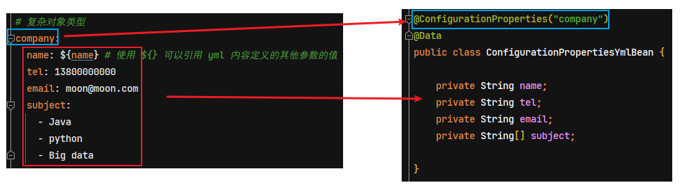
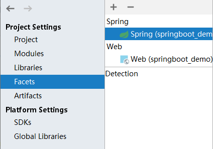
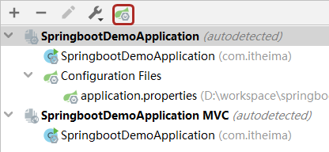
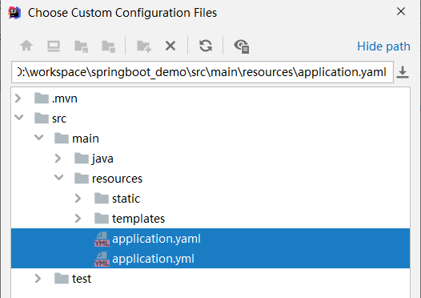

# Spring Boot 基础使用篇

## 1. Spring Boot 简介

Spring 诞生时是 Java 企业版（Java Enterprise Edition，JEE，也称 J2EE）的轻量级代替品。无需开发重量级的 Enterprise JavaBean（EJB），Spring 为企业级Java 开发提供了一种相对简单的方法，通过依赖注入和面向切面编程，用简单的Java 对象（Plain Old Java Object，POJO）实现了 EJB 的功能。

虽然 Spring 的组件代码是轻量级的，但它的配置却是重量级的。

- 第一阶段：xml配置

在Spring 1.x时代，使用Spring开发满眼都是xml配置的Bean，随着项目的扩大，我们需要把xml配置文件放到不同的配置文件里，那时需要频繁的在开发的类和配置文件之间进行切换

- 第二阶段：注解配置

在Spring 2.x 时代，随着JDK1.5带来的注解支持，Spring提供了声明Bean的注解（例如@Controller、@Service），大大减少了配置量。主要使用的方式是应用的基本配置（如数据库配置）用xml，业务配置用注解

- 第三阶段：java配置

Spring 3.0 引入了基于 Java 的配置能力，这是一种类型安全的可重构配置方式，可以代替 XML。我们目前刚好处于这个时代。现在Spring和Springboot都推荐使用java配置。

所有这些配置都代表了开发时的损耗。 因为在思考 Spring 特性配置和解决业务问题之间需要进行思维切换，所以写配置挤占了写应用程序逻辑的时间。除此之外，项目的依赖管理也是件吃力不讨好的事情。决定项目里要用哪些库就已经够让人头痛的了，你还要知道这些库的哪个版本和其他库不会有冲突，这难题实在太棘手。并且，依赖管理也是一种损耗，添加依赖不是写应用程序代码。一旦选错了依赖的版本，随之而来的不兼容问题毫无疑问会是生产力杀手。

Spring Boot 让这一切成为了过去。

Spring Boot其设计目的是用来简化Spring应用的初始搭建以及开发采用约定优于配置，只需要“run”就能创建一个独立的、生产级别的Spring应用。Spring Boot 为 Spring 平台及第三方库提供开箱即用的设置（提供默认设置），这样我们就可以简单的开始。多数 Spring Boot 应用只需要很少的 Spring 配置。

我们可以使用 SpringBoot 创建 java 应用，并使用 `java –jar` 命令启动它，或者采用传统的war部署方式。

### 1.1. 核心功能

- 核心能力：Spring容器、日志、<font color=red>**自动配置AutoCongfiguration、Starters**</font>
- web应用的能力：MVC、嵌入式容器
- 数据访问(持久化)：关系型数据库、非关系型数据库
- 强大的整合其他技术的能力
- 测试：强悍的应用测试

### 1.2. 开发环境要求（2.1.7.RELEASES）

- Spring Boot的2.1.7.RELEASES正式发行版，必须要使用Java8或 Java 11，Spring版本也必须是5.1.8及以上
- 构建工具版本：Maven ，版本要求是3.3及以上
- SpringBoot 支持如下的嵌入式Servlet容器，Spring Boot应用程序最低支持到Servlet 3.1的容器。

## 2. Spring Boot 入门

### 2.1. 环境准备

- DataBase：MySQL
- IDE：Eclipse/idea
- SpringBoot：
  - 1.5.6 (官方网站：http://spring.io/) 2017年7月27日
  - 2.0.3版本 2018年6月16日
- SpringBoot参考文档：
  - https://docs.spring.io/spring-boot/docs/2.0.3.RELEASE/reference/htmlsingle/
- Maven：3.3.9 （官方声明Springboot 1.5.6版本需要Maven 3.2+）
- Gradle：4.0.2 (官方网站https://gradle.org/)

- 本地仓库：需要使用资料中的仓库 【仓库(SpringBoot).zip】
- 引用资料中的仓库，重新构建索引：


### 2.2. 创建 Spring Boot 项目（eclipse 版）-已过时，有需要再更新！

#### 2.2.1. 创建Maven工程


#### 2.2.2. 变更JDK版本(非必需)

- 默认情况下工程的JDK版本是1.6，但是通常使用的是1.7的版本


- 修改JDK为1.7，需要在pom.xml中添加以下配置

```xml
<!-- 定义全局属性 -->
<properties>
  <!-- 定义更改JDK版本属性 -->
  <java.version>1.7</java.version>
</properties>
```

- 使用Maven更新工程后，就发现版本已经变成1.7


- 注意：
  - 虽然JDK1.6或者1.7都可以使用SpringBoot，但SpringBoot官方建议使用JDK1.8，要使用JDK1.8，首先必须要配置JDK1.8后，才可以使用上述方法设置。
  - **如果是传统的maven项目，是需要配置jdk插件，但spring boot项目中，只需要配置`<properties>`属性即可**

### 2.3. 创建 Spring Boot 项目（IDEA 版）

#### 2.3.1. 方式1 - 基于 Spring Intialzr（需联网）

IDEA 可以直接通过 Spring Initializr 创建 Spring boot 项目。（注意，此创建方式需要联网）

> *注：以下截图是基于 idea 2021.2.3，之前版本的 idea 中的 Spring Initializr 界面不一样，但流程相差不大*

- 创建新模块/新项目，选择 Spring Initializr，并配置模块相关基础信息。选择 Java 版本和本地计算机上安装的 JDK 版本匹配即可，但是最低要求为 JDK8 或以上版本，推荐使用8或11


- 选择 Spring Boot 的版本与项目所需要的依赖


- 点击 Finish 即可创建新的 Spring Boot 项目。效果如下：


---

**以下是旧版本的 IDEA 的 Spring Initializr 界面**

1. 新建Spring Intialzr项目


2. 填写项目信息，选择Packaging为Jar。


3. 选择项目使用的技术


4. 填写项目名称
5. 将项目设置为Maven项目
6. 项目结构与依赖与手动新建maven项目一致


#### 2.3.2. 方式2 - 官网在线创建

直接访问官网的 Spring Initializr 也可创建 Spring Boot 项目。网址：https://start.spring.io/

- 跟 idea 中的 Spring Initializr 一样。其实本质 idea 也是联网访问此网站。在创建 Spring Boot 程序的界面上，根据需求，在左侧选择对应信息和输入对应的信息即可


- 右侧的【ADD DEPENDENCIES】用于选择使用何种技术，仅仅是界面不同而已，点击后打开网页版的技术选择界面


- 所有信息设置完毕后，点击下面左侧按钮，生成一个文件包并下载，该压缩包即是创建的 SpringBoot 工程文件夹
- 解压缩此文件后，得到工程目录，在 idea 中导入即可使用，和之前创建的东西完全一样。

#### 2.3.3. 方式3 - 选择阿里云创建

阿里在国内提供了一个创建 SpringBoot 项目的

在创建工程时，点击切换选择 Server URL 服务路径，然后输入阿里云提供给服务地址即可。地址：https://start.aliyun.com


使用阿里提供的项目创建服务，会比官方的服务在依赖坐标中添加了一些阿里相关的技术，值得注意，阿里云地址默认创建的 SpringBoot 工程版本是 2.4.1，所以如果需更换其他的版本，创建项目后手工修改即可，别忘了刷新一下，加载新版本信息。


> 注意：阿里云提供的工程创建地址初始化创建的工程，和 SpringBoot 官网创建出来的工程略有区别。主要是在配置文件的形式上有区别。

#### 2.3.4. 方式4 - 基于手动创建 Maven 项目

个人通常习惯通过手动创建 maven 项目的方式，来创建 SpringBoot 项目

- 创建工程时，选择手工创建 Maven 工程


- 填写项目的相关信息


- 点击【Finish】创建项目，这种方式创建的项目十分清爽^o^


- 最后就是手动创建项目结构与参照标准 SpringBoot 工程的 pom 文件，编写项目的 pom 文件即可。SpringBoot 重点就是在 pom.xml 引入 `spring-boot-starter-parent` 的依赖，详情参考下一章节。

### 2.4. 添加依赖

> 注：如果使用 Spring Initializr 创建的 SpringBoot 项目，通常都在 pom.xml 文件已经生成好相关依赖

手动添加 SpringBoot 项目的基础依赖。（以 spring web MVC 项目为示例）

```xml
 <!-- 依赖 SpringBoot 父级工程 -->
<parent>
    <groupId>org.springframework.boot</groupId>
    <artifactId>spring-boot-starter-parent</artifactId>
    <version>2.5.8</version>
    <relativePath/> <!-- lookup parent from repository -->
</parent>

<modelVersion>4.0.0</modelVersion>
<groupId>com.moon</groupId>
<artifactId>spring-boot-demo</artifactId>
<version>1.0-SNAPSHOT</version>

<!-- 配置项目相关的依赖 -->
<dependencies>
    <!--
        配置WEB启动器，包括 SpringMVC、Restful、jackson
        如果是 spring-boot-starter-parent 所包含的 starter，都不需要再指定版本号
     -->
    <dependency>
        <groupId>org.springframework.boot</groupId>
        <artifactId>spring-boot-starter-web</artifactId>
    </dependency>
</dependencies>
```

### 2.5. 启动类

创建 Application 启动类（类名随意命名）：

```java
@SpringBootApplication // 代表为SpringBoot应用的运行主类
public class Application {
  public static void main(String[] args) {
    /** 运行SpringBoot应用 */
    SpringApplication.run(Application.class, args);
  }
}
```

> 注：**`@SpringBootApplication`** 注解代表为 SpringBoot 应用的运行主类

Banner直接启动，控制台会出现Spring启动标识。

```java
@SpringBootApplication // 代表为SpringBoot应用的运行主类
public class Application {
  public static void main(String[] args) {
    /** 创建SpringApplication应用对象 */
    SpringApplication springApplication = new SpringApplication(Application.class);
    /** 设置横幅模式(设置关闭) */
    springApplication.setBannerMode(Banner.Mode.OFF);
    /** 运行 */
    springApplication.run(args);
  }
}
```

参考附录二的banner设置，可以通过修改配置文件制定自己的标识。

### 2.6. 编写入门程序

需求：使用 Spring MVC 实现 Hello World 输出

#### 2.6.1. 原来的 Spring MVC 实现

现在开始使用spring MVC 框架，实现json 数据的输出。如果按照我们原来的做法，需要在web.xml 中添加一个DispatcherServlet 的配置，还需要添加一个spring的配置文件，配置文件如下配置

spring 加入配置

```xml
<!-- controller注解扫描 -->
<context:component-scan base-package="com.moon.springboot.controller" />
<!-- 注解驱动 -->
<mvc:annotation-driven />
```

web.xml加入配置

```xml
<!-- 配置前端控制器 -->
<servlet>
  <servlet-name> springboot01-test</servlet-name>
  <servlet-class>org.springframework.web.servlet.DispatcherServlet</servlet-class>
  <init-param>
    <param-name>contextConfigLocation</param-name>
    <param-value>classpath:spring/*.xml</param-value>
  </init-param>
</servlet>
<servlet-mapping>
  <servlet-name> springboot01-test</servlet-name>
  <url-pattern>/</url-pattern>
</servlet-mapping>
```

还要编写Controller。。。

#### 2.6.2. SpringBoot 的实现

不需要配置文件，直接编写Controller类即可

```java
@RestController
public class HelloController {
  // http://localhost:8080/hello
  @GetMapping("/hello")
  public String hello(){
    return "Hello World";
  }
}
```

> `@RestController` 注解：其实就是 `@Controller` 和 `@ResponseBody` 注解加在一起

- 启动方式一：直接右键启动编写的引导类即可
- 启动方式二：使用Maven命令执行

```bash
spring-boot:run
```

- 在浏览器地址栏输入 http://localhost:8080/hello 即可看到运行结果


## 3. Spring Boot 高级知识

### 3.1. Spring Boot 项目基础组成分析

根据快速入门案例，一个最基础的 SpringBoot 项目包括：

- 起步依赖（简化依赖配置）
- 自动配置（简化常用工程相关配置）
- 辅助功能（内置服务器，……）

#### 3.1.1. spring-boot-starter-parent

通常一个项目需要依赖各种不同的技术，而各个技术的依赖版本之间可能会存在冲突。而 SpringBoot 于是所有的技术版本的常见使用方案都给开发者整理了出来，以后开发者使用时直接用它提供的版本方案，不用担心版本冲突问题了，相当于 SpringBoot 做了无数个技术版本搭配的列表，这个技术搭配列表的名字叫做 `spring-boot-starter-parent`

`spring-boot-starter-parent` 自身具有很多个版本，每个 parent 版本中包含有几百个其他技术的版本号，不同的 parent 间使用的各种技术的版本号有可能会发生变化。当开发者使用某些技术时，直接使用 SpringBoot 提供的 parent 即可，由 parent 来统一的进行各种技术的版本管理

`spring-boot-starter-parent` 仅仅只是进行版本的统一管理，需要开发者导入相应的坐标依赖，


##### 3.1.1.1. Spring Boot 依赖引入实现原理

在项目的 pom.xm 文件中继承父工程 `spring-boot-starter-parent`，查阅 SpringBoot 的配置源码

```xml
<!-- Inherit defaults from Spring Boot -->
<parent>
    <groupId>org.springframework.boot</groupId>
    <artifactId>spring-boot-starter-parent</artifactId>
    <version>2.5.8</version>
</parent>
```

点击 `spring-boot-starter-parent` 查看，里面定义一些插件，又继承了 `spring-boot-dependencies`。

```xml
<parent>
    <groupId>org.springframework.boot</groupId>
    <artifactId>spring-boot-dependencies</artifactId>
    <version>2.5.8</version>
</parent>
```


点击查看 `spring-boot-dependencies`。这个坐标中定义了两组信息，


- 第一组是在 `<properties>` 中定义各种技术的依赖版本号属性。*下面列出依赖版本属性的部分内容*


- 第二组是在 `<dependencyManagement>` 中定义各种技术的依赖坐标信息，依赖坐标定义具体的依赖版本号是引用了第一组信息中定义的依赖版本属性值。值得注意的是，依赖坐标定义是出现在`<dependencyManagement>`标签中的，其实是对引用坐标的依赖管理，并不是实际使用的坐标。因此项目中继承了这组parent信息后，在不使用对应坐标的情况下，前面的这组定义是不会具体导入某个依赖的


**总结：通过 maven 的依赖传递从而实现继承 spring boot 的父依赖后，可以依赖 spring boot 项目相关的 jar**

##### 3.1.1.2. 小结

1. 开发 SpringBoot 程序需要继承 `spring-boot-starter-parent` 父项目
2. `spring-boot-starter-parent` 中定义了各种技术的依赖管理
3. 继承 parent 模块可以避免多个依赖使用相同技术时出现依赖版本冲突
4. 继承 parent 的形式也可以采用 `<scope>` 引入依赖的形式实现效果（*详见《引入 SpringBoot 父工程依赖的方式》章节*）

#### 3.1.2. spring-boot-starter-xxx

##### 3.1.2.1. 概述

SpringBoot 提供了很多 `spring-boot-starter-xxx`，是定义了某种技术各种依赖的固定搭配格式的集合，使用 starter 可以帮助开发者减少依赖配置。*如：spring-boot-starter-web，里面定义了若干个具体依赖的坐标*


使用官方的 starter 引入技术可能会存在一些问题，就是会出现这种过量导入依赖的可能性，不过可以通过maven中的排除依赖剔除掉一部分。对于项目影响不大。


##### 3.1.2.2. 实际开发应用方式

- 实际开发中如果需要用什么技术，先去找有没有这个技术对应的 starter
    - 如果有对应的 starter，直接使用 starter，而且无需指定版本，版本由 parent 提供
    - 如果没有对应的 starter，手写坐标即可
- 实际开发中如果发现坐标出现了冲突现象，确认你要使用的可行的版本号，使用手工书写的方式添加对应依赖，覆盖SpringBoot提供给我们的配置管理
    - 方式一：直接写坐标
    - 方式二：覆盖`<properties>`中定义的版本号

##### 3.1.2.3. starter 与 parent 的区别

- starter 是一个坐标中定义了若干个坐标，引入一个坐标相当于引入多个坐标，是用来减少依赖配置的书写量的。
- parent 是定义了几百个依赖版本号，由 SpringBoot 统一管理控制版本，是用来减少各种技术的依赖冲突

##### 3.1.2.4. starter 命名规范

SpringBoot 官方定义了很多 starter，命名格式：`spring-boot-starter-技术名称`

##### 3.1.2.5. 小结

1. 开发 SpringBoot 程序需要导入某些技术时，通常导入对应的 starter 即可
2. 每个不同的 starter 根据功能不同，通常包含多个依赖坐标
3. 使用 starter 可以实现快速配置的效果，达到简化配置的目的

#### 3.1.3. 引导类

##### 3.1.3.1. 概述

SpringBoot 引导类是指程序运行的入口，即快速开始案例中标识 `@SpringBootApplication` 注解，并带有 main 方法的那个类，运行这个类就可以启动 SpringBoot 工程，并创建了一个 Spring 容器对象。

```java
@SpringBootApplication // 代表为SpringBoot应用的运行主类
public class Application {
  public static void main(String[] args) {
    /** 运行SpringBoot应用 */
    SpringApplication.run(Application.class, args);
  }
}
```

也可以通过 `scanBasePackages` 属性来指定扫描的基础包

```java
// SpringBoot 应用启动类
@SpringBootApplication(scanBasePackages={"com.moon.springboot"}) // 指定扫描的基础包
```

<font color="purple">注：如果配置 `@SpringBootApplication` 注解，不指定注解扫描的包，默认约定是扫描当前引导类所在的同级包下的所有包和所有类以及下级包的类（若为 JPA 项目还可以扫描标注 `@Entity` 的实体类），建议入口类放置的位置在 groupId + arctifactID 组合的包名下；如果需要指定扫描包使用注解 `@SpringBootApplication(scanBasePackages = 'xxx.xxx.xx')`</font>

上面的`@SpringBootApplication`相当于下面的3个注解

- `@Configuration`：用于定义一个配置类
- `@EnableAutoConfiguration`：Spring Boot会自动根据你jar包的依赖来自动配置项目
- `@ComponentScan`：告诉Spring 哪个packages 的用注解标识的类会被spring自动扫描并且装入bean 容器。

##### 3.1.3.2. 小结

1. SpringBoot 工程提供引导类用来启动程序
2. SpringBoot 工程启动后创建并初始化 Spring 容器

#### 3.1.4. 内嵌 web 容器（如 tomcat）

##### 3.1.4.1. 内嵌 tomcat 定义与运行原理概述

SpringBoot 内嵌的 web 服务器，需要引入 `spring-boot-starter-web` 的依赖

```xml
<dependency>
    <groupId>org.springframework.boot</groupId>
    <artifactId>spring-boot-starter-web</artifactId>
</dependency>s
```

starter 其中有引入 `spring-boot-starter-tomcat` 的依赖，具体如下：

```xml
<dependencies>
  <dependency>
    <groupId>jakarta.annotation</groupId>
    <artifactId>jakarta.annotation-api</artifactId>
    <version>1.3.5</version>
    <scope>compile</scope>
  </dependency>
  <dependency>
    <groupId>org.apache.tomcat.embed</groupId>
    <artifactId>tomcat-embed-core</artifactId>
    <version>9.0.56</version>
    <scope>compile</scope>
    <exclusions>
      <exclusion>
        <artifactId>tomcat-annotations-api</artifactId>
        <groupId>org.apache.tomcat</groupId>
      </exclusion>
    </exclusions>
  </dependency>
  <dependency>
    <groupId>org.apache.tomcat.embed</groupId>
    <artifactId>tomcat-embed-el</artifactId>
    <version>9.0.56</version>
    <scope>compile</scope>
  </dependency>
  <dependency>
    <groupId>org.apache.tomcat.embed</groupId>
    <artifactId>tomcat-embed-websocket</artifactId>
    <version>9.0.56</version>
    <scope>compile</scope>
    <exclusions>
      <exclusion>
        <artifactId>tomcat-annotations-api</artifactId>
        <groupId>org.apache.tomcat</groupId>
      </exclusion>
    </exclusions>
  </dependency>
</dependencies>
```

其中有一个核心的坐标，`tomcat-embed-core` 叫做tomcat内嵌核心。就是此依赖把tomcat功能引入到了程序中。而 tomcat 服务器运行其实是以对象的形式保存到 Spring 容器，并在 SpringBoot 程序启动时运行起来。

##### 3.1.4.2. 更换内嵌默认内嵌 web 服务

SpringBoot 提供了3款内置的服务器

- tomcat(默认)：apache出品，粉丝多，应用面广，负载了若干较重的组件
- jetty：更轻量级，负载性能远不及tomcat
- undertow：负载性能勉强跑赢tomcat

更新内嵌服务，只需要加入相应的坐标，把默认的 tomcat 排除掉即可，因为tomcat是默认加载的。

```xml
<dependencies>
    <dependency>
        <groupId>org.springframework.boot</groupId>
        <artifactId>spring-boot-starter-web</artifactId>
        <exclusions>
            <exclusion>
                <groupId>org.springframework.boot</groupId>
                <artifactId>spring-boot-starter-tomcat</artifactId>
            </exclusion>
        </exclusions>
    </dependency>
    <dependency>
        <groupId>org.springframework.boot</groupId>
        <artifactId>spring-boot-starter-jetty</artifactId>
    </dependency>
</dependencies>
```


##### 3.1.4.3. 小结

1. 内嵌 Tomcat 服务器是 SpringBoot 辅助功能之一
2. 内嵌 Tomcat 工作原理是将 Tomcat 服务器作为对象运行，并将该对象交给 Spring 容器管理
3. Spring Boot 提供可以配置替换默认 tomcat 内嵌服务器的功能

### 3.2. 项目构建

强烈推荐选择一个支持依赖管理的构建系统，可以使用它将 artifact 发布到 Maven Central 仓库。所以建议选择 Maven 或者 Gradle。

#### 3.2.1. 依赖管理


### 3.3. 引入 SpringBoot 父工程依赖的方式

#### 3.3.1. 方式1 - 使用 `<parent>` 标签

在pom.xml中添加依赖，效果如下：

```xml
<?xml version="1.0" encoding="UTF-8"?>
<project xmlns="http://maven.apache.org/POM/4.0.0"
         xmlns:xsi="http://www.w3.org/2001/XMLSchema-instance"
         xsi:schemaLocation="http://maven.apache.org/POM/4.0.0 http://maven.apache.org/xsd/maven-4.0.0.xsd">

    <!-- 依赖 SpringBoot 父级工程 -->
    <parent>
        <groupId>org.springframework.boot</groupId>
        <artifactId>spring-boot-starter-parent</artifactId>
        <version>2.5.8</version>
        <relativePath/> <!-- lookup parent from repository -->
    </parent>

    <modelVersion>4.0.0</modelVersion>
    <groupId>com.moon</groupId>
    <artifactId>spring-boot-demo</artifactId>
    <version>1.0-SNAPSHOT</version>
    <name>${project.artifactId}</name>
    <description>SpringBoot 快速开始</description>

    <!-- 配置项目相关的依赖 -->
    <dependencies>
        <!--
            配置WEB启动器，包括 SpringMVC、Restful、jackson
            如果是 spring-boot-starter-parent 所包含的 starter，都不需要再指定版本号
         -->
        <dependency>
            <groupId>org.springframework.boot</groupId>
            <artifactId>spring-boot-starter-web</artifactId>
        </dependency>
    </dependencies>
</project>
```

工程自动添加了好多jar包，而这些jar包正是开发时需要导入的jar包。


这些jar包被刚才加入的 spring-boot-starter-web 所引用了，所以添加 spring-boot-starter-web 后会自动把依赖传递过来。

#### 3.3.2. 方式2 - 定义范围 `<scope>` 为 import

在 SpringBoot 项目的 POM 文件中，可以通过在 POM 文件中继承 Spring-boot-starter-parent 来引用 Srping boot 默认依赖的 jar 包。但使用 parent 这种继承的方式，只能继承一个 spring-boot-start-parent。实际开发中，很可能需要继承自己公司的标准 parent 配置，此时可以使用 `<scope>import</scope>` 来实现多继承。如下例：

```xml
<dependencyManagement>
    <dependencies>
        <!-- Override Spring Data release train provided by Spring Boot -->
        <dependency>
            <groupId>org.springframework.data</groupId>
            <artifactId>spring-data-releasetrain</artifactId>
            <version>Fowler-SR2</version>
            <type>pom</type>
            <scope>import</scope>
        </dependency>
        <dependency>
            <groupId>org.springframework.boot</groupId>
            <artifactId>spring-boot-dependencies</artifactId>
            <version>2.2.4.RELEASE</version>
            <type>pom</type>
            <scope>import</scope>
        </dependency>
    </dependencies>
</dependencyManagement>
```


## 4. Spring Boot 配置文件

默认情况下，Spring Boot 会加载 resources 目录下的名称为 application.properties 或 application.yml 来获得配置的参数。

### 4.1. Spring Boot 配置信息的查询

SpringBoot 的配置文件，主要的目的就是对配置信息进行修改的，而全部可配置项可以查阅 SpringBoot 的官方文档（当前最新版本）。

文档网址：https://docs.spring.io/spring-boot/docs/current/reference/html/application-properties.html#application-properties

### 4.2. Spring Boot 支持的配置文件类型

#### 4.2.1. properties 与 yml 类型配置

SpringBoot 支持三种类型格式的配置文件，分别如下：

- application.properties（键值对风格配置文件）
- application.yml（层级树键值对风格配置文件）
- application.yaml（与yml完全一样）

后缀为 `.yml` 是一种由 SpringBoot 框架自制的配置文件格式。yml后缀的配置文件的功能和properties后缀的配置文件的功能是一致的。

#### 4.2.2. 不同类型的配置文件优先级

如果 SpringBoot 工程中，3种类型的配置文件同时存在，其加载的优先级顺序如下：

```
application.properties  >  application.yml  >  application.yaml
```

还有，不同配置文件中相同配置按照加载优先级相互覆盖，不同配置文件中不同配置将全部保留。如下例：

- application.properties（properties格式）

```properties
server.port=80
spring.main.banner-mode=off
```

- application.yml（yml格式）

```YML
server:
  port: 81
logging:
  level:
    root: debug
```

- application.yaml（yaml格式）

```yaml
server:
  port: 82
```

不管什么类型的配置文件，SpringBoot 最终会将其渲染成 `.properties` 文件，上面示例最终的配置项为：

```properties
server.port=80
spring.main.banner-mode=off
logging.level.root=debug
```

#### 4.2.3. 番外 - xml 类型配置

Spring Boot 推荐无 xml 配置，但实际项目中，可能有一些特殊要求必须使用 xml 配置，在引导类中通过Spring提供的 `@ImportResource` 来加载 xml 配置

```java
@SpringBootApplication(scanBasePackages = {"com.moon.controller"})
@ImportResource({"classpath:xxx1.xml", "classpath:xxx2.xml"})
public class SpringbootdemoApplication {
  public static void main(String[] args) {
    SpringApplication.run(SpringbootdemoApplication.class, args);
  }
}
```

### 4.3. YAML 文件

#### 4.3.1. yml 配置文件简介

YML 文件格式是YAML (YAML Aint Markup Language)层级树键值对格式文件。YAML是一种直观的能够被电脑识别的的数据序列化格式，并且容易被人类阅读，容易和脚本语言交互的，可以被支持YAML库的不同的编程语言程序导入，比如： C/C++, Ruby, Python, Java, Perl, C#, PHP等。YML文件是以数据为核心的、重数据轻的格式，比传统的xml方式更加简洁。

YML 文件的扩展名可以使用 `.yml` 或者 `.yaml`

#### 4.3.2. YAML 基本语法

- 大小写敏感
- 数据值前边必须有空格，作为分隔符。（属性名与属性值之间使用 `冒号+空格` 作为分隔）
- 使用缩进表示层级关系，同层级左侧对齐。缩进时不允许使用 Tab 键，只允许使用空格（各个系统 Tab 对应的 空格数目可能不同，导致层次混乱）。
- 缩进的空格数目不重要，只要相同层级的元素左侧对齐即可
- `#` 表示注释，从这个字符一直到行尾，都会被解析器忽略。

**常见的数据书写格式**：

```yml
boolean: TRUE  						 # TRUE,true,True,FALSE,false，False均可
float: 3.14    						 # 6.8523015e+5  #支持科学计数法
int: 123       						 # 0b1010_0111_0100_1010_1110    #支持二进制、八进制、十六进制
null: ~        						 # 使用~表示null
string: HelloWorld      			 # 字符串可以直接书写
string2: "Hello World"  			 # 可以使用双引号包裹特殊字符
date: 2018-02-17        			 # 日期必须使用yyyy-MM-dd格式
datetime: 2018-02-17T15:02:31+08:00  # 时间和日期之间使用T连接，最后使用+代表时区
```

#### 4.3.3. YAML 数据语法格式

##### 4.3.3.1. 配置普通数据

语法：`key: value`。注意：value之前有一个空格

```yml
name: haohao
```

还有一种比较特殊的常量，使用单引号与双引号包裹

```yml
msg1: 'hello \n world'  # 单引号忽略转义字符
msg2: "hello \n world"  # 双引号识别转义字符
```

##### 4.3.3.2. 配置对象数据

- 语法：

```yml
# 方式一：
key:
    key1: value1
    key2: value2
# 方式二：
key: {key1: value1,key2: value2}
```

- 示例代码：

```yml
# 方式一：
person:
    name: haohao
    age: 31
    addr: beijing
# 方式二：
person: {name: haohao,age: 31,addr: beijing}
```

- <font color=red>**注意：key1前面的空格个数不限定，在yml语法中，相同缩进代表同一个级别**</font>

##### 4.3.3.3. 配置Map数据

**同上面的对象写法**

##### 4.3.3.4. 配置数组（List、Set）数据

- 语法：

```yml
# 方式一：
key:
    - value1
    - value2
# 方式二：
key: [value1,value2]
```

- 示例代码：

```yml
# 基础类型数组方式一：
city:
    - beijing
    - tianjin
    - shanghai
    - chongqing
# 基础类型数组方式二：
city: [beijing,tianjin,shanghai,chongqing]

# 对象类型数组方式一：
student:
    - name: zhangsan
      age: 18
      score: 100
    - name: lisi
      age: 28
      score: 88
    - name: wangwu
      age: 38
      score: 90
# 对象类型数组方式二：
student:
    -
      name: zhangsan
      age: 18
      score: 100
    -
      name: lisi
      age: 28
      score: 88
    -
      name: wangwu
      age: 38
      score: 90
# 对象类型数组方式三：
student: [{name: zhangsan, age: 18, score: 100}, {name: lisi, age: 28, score: 88}]
```

- **注意：value1与之间的“`-`”之间存在一个空格**

##### 4.3.3.5. 参数引用

通过`${}`可以引用yml内容定义的其他参数的值

```yml
name: MooN
person:
    name: ${name} # 引用上边定义的name值
```

### 4.4. 读取项目配置文件

> 注：以下读取的方法 properties 与 yml 文件通用。

#### 4.4.1. 方式一：Environment 对象

SpringBoot 提供了`org.springframework.core.env.Environment` 类，此类能够将所有配置数据都封装到这一个实例中，通过该对象的 `getProperty()` 方法，可以获取到任意指定的配置项的值。

**读取 properties 类型**

- 在工程的 src/main/resources 下修改核心配置文件 application.properties，添加内容如下

```properties
name=月之哀伤
url=http://www.moon.com
```

- 在Controller中添加测试：

```java
import org.springframework.beans.factory.annotation.Autowired;
import org.springframework.core.env.Environment;
import org.springframework.web.bind.annotation.GetMapping;
import org.springframework.web.bind.annotation.RestController;

@RestController
public class HelloController {
  @Autowired
  private Environment environment;

  @GetMapping("/hello")
  public String hello(){
    System.out.println(environment.getProperty("name"));
    System.out.println(environment.getProperty("url"));
    return "Hello World";
  }
}
```

**读取 yml 类型示例**


#### 4.4.2. 方式二：@Value 注解

还是上面的例子，可以使用 Spring 的 `@value` 注解，标识在指定的 Spring 管控的 bean 的属性名上，即可获取配置文件相应的内容。

```java
import org.springframework.beans.factory.annotation.Autowired;
import org.springframework.beans.factory.annotation.Value;
import org.springframework.core.env.Environment;
import org.springframework.web.bind.annotation.GetMapping;
import org.springframework.web.bind.annotation.RestController;

@RestController
public class HelloController {
    @Autowired
    private Environment environment;
    @Value("${name}")
    private String name;
    @Value("${url}")
    private String url;

    @GetMapping("/hello")
    public String hello(){
        System.out.println(environment.getProperty("name"));
        System.out.println(environment.getProperty("url"));
        System.out.println(name);
        System.out.println(url);
        return "Hello World";
    }
}
```

> *注：使用`@Value`注解，只能映射配置文件的字符串类型的值，不能直接映射对象与数组，只能依次逐个层级点*

**读取 yml 类型示例**


#### 4.4.3. 方式三：@ConfigurationProperties 注解（将配置文件的属性值封装到实体类）

上面使用 `@Value` 注入每个配置在实际项目中麻烦。Spring Boot 提供了一个 `@ConfigurationProperties(prefix="配置文件中的key的前缀")` 注解，可以将配置文件中的某个指定前缀的配置项自动与实体进行映射。Spring Boot 将此方式称为：基于类型安全的配置方式，通过 `@ConfigurationProperties` 将 properties 属性和一个 Bean 及其属性关联，从而实现类型安全的配置

**值得注意的是，要实现配置与实体类映射的前提条件是：该映射的类需要交 Spring 容器管理**。

##### 4.4.3.1. 方式1：读取默认配置文件(yml 与 properties 格式均可用)

- ~~在pom.xml文件引入configuration-processor的依赖~~（可能旧版本的 Spring Boot 需要）

```xml
<!-- @ConfigurationProperties执行器的配置 -->
<dependency>
    <groupId>org.springframework.boot</groupId>
    <artifactId>spring-boot-configuration-processor</artifactId>
    <optional>true</optional>
</dependency>
```

- 在 yml 中定义一个对象类型的配置

```yml
company:
  name: MooNkirA
  tel: 13800000000
  email: moon@moon.com
  subject:
    - Java
    - python
    - Big data
```

- 在自定义配置映射类中，加上注解`@ConfigurationProperties`，表明该类为配置映射类，并通过属性 `prefix` 指定默认配置文件（application.properties/application.yml）中某个指定前缀的，从而实现配置自动与实体进行映射。其中有如下两种方式让配置映射对象交给 Spring 容器管理：

1. 直接在配置映射类上标识 `@Component` 等注解，让 Spring boot 在启动时通过包扫描将该类作为一个 Bean 注入 IOC 容器。如：

```java
@Component
// prefix 用来选择属性的前缀，也就是在配置文件中的“company”以下的属性
// ignoreUnknownFields 是用来告诉 SpringBoot 在有属性不能匹配到声明的域时抛出异常
@ConfigurationProperties(prefix = "company", ignoreUnknownFields = false)
@Data
// 注：如果使用@Configuration注解，则同时需要加上@EnableConfigurationProperties指定加载的配置类
// @Configuration
// @EnableConfigurationProperties(Company.class)
public class Company {
    private String name;
    private String tel;
    private String email;
    private String[] subject;
}
```

2. 在引导类中（或者本身自定义配置类），加上`@EnableConfigurationProperties`注解，并指明需要映射的JavaBean类。此时配置映射类就不需要标识 `@Component` 等注解，如：

```java
@ConfigurationProperties("company")
@Data
public class Company {
    private String name;
    private String tel;
    private String email;
    private String[] subject;
}


@SpringBootApplication
@EnableConfigurationProperties({Company.class})
public class Application {
    ....
}
```

> **注意事项**：使用`@ConfigurationProperties`方式可以进行配置文件与实体字段的自动映射，但需要字段必须提供`set`方法才可以，而使用`@Value`注解修饰的字段不需要提供`set`方法

**读取 yml 类型示例映射示意图**



- 在控制类注入安全配置映射类，测试读取配置文件内容

```java
@RestController
@RequestMapping("config")
public class DemoController {
    // 自动注入映射配置类
    @Autowired
    private Company company;

    // 通过 @ConfigurationPropertiesBean 注解方式进行配置与实体映射读取
    @GetMapping("config-properties")
    public Company readByConfigurationProperties() {
        return company;
    }
}
```

##### 4.4.3.2. 方式2：读取自定义的配置文件(只能读取properties格式，该注解并不支持加载yml！)

上面方式1是写在默认配置文件 application.properties 中，如果属性太多，实际项目可能会根据模块去拆分一些配置，并配置在不同的自定义配置文件中。

**方式2：读取自定义的配置文件**的具体步骤如下：

- ~~在pom.xml文件中引入configuration-processor依赖~~（可能旧版本的 Spring Boot 需要）

```xml
<dependency>
    <groupId>org.springframework.boot</groupId>
    <artifactId>spring-boot-configuration-processor</artifactId>
    <optional>true</optional>
</dependency>
```

- 创建自定义配置文件 config/cat.properties （配置文件存放位置随意）

```properties
cat.name=HelloKitty
cat.age=5
cat.color=pink
```

- 在引导类中（或者本身自定义配置类）中，使用 `@PropertySource` 注解，引入自定义 properties 配置文件。*需要注意，如果在Spring Boot版本为1.4或1.4之前，则需要`@PropertySource`注解上加`location`属性，并指明该配置文件的路径*

```java
@SpringBootApplication
// 通过 @PropertySource 注解手动导入 properties 文件，测试使用 @ConfigurationProperties 注解进行配置和实体映射
@PropertySource("classpath:config/cat.properties")
public class Application {
    ....
}
```

- 在自定义配置映射类中，加上注解`@ConfigurationProperties`，表明该类为配置映射类，并通过属性 `prefix` 指定自定义配置文件（*示例是 cat.properties*）中某个指定前缀的，从而实现配置自动与实体进行映射。与加载默认配置文件操作一样，有如下两种方式让配置映射对象交给 Spring 容器管理：


1. 直接在配置映射类上标识 `@Component` 等注解，让 Spring boot 在启动时通过包扫描将该类作为一个 Bean 注入 IOC 容器。如：

```java
@Component
@ConfigurationProperties(prefix = "cat", ignoreUnknownFields = false)
@Data
// 注：如果使用@Configuration注解，则同时需要加上@EnableConfigurationProperties指定加载的配置类
// @Configuration
// @EnableConfigurationProperties(Cat.class)
public class Cat {
    private String name;
    private int age;
    private String color;
}
```

2. 在引导类中（或者本身自定义配置类），加上`@EnableConfigurationProperties`注解，并指明需要映射的JavaBean类。此时配置映射类就不需要标识 `@Component` 等注解，如：

```java
// prefix用来选择属性的前缀，也就是在cat.properties文件中的“cat”以下的属性
// ignoreUnknownFields 是用来告诉 SpringBoot 在有属性不能匹配到声明的域时抛出异常
@ConfigurationProperties(prefix = "cat", ignoreUnknownFields = false)
@Data
public class Cat {
    private String name;
    private String tel;
    private String email;
    private String[] subject;
}


@SpringBootApplication
@EnableConfigurationProperties({Cat.class})
@PropertySource("classpath:config/cat.properties")
public class Application {
    ....
}
```

- 在控制类注入安全配置映射类，测试读取配置文件内容

```java
@RestController
@RequestMapping("config")
public class DemoController {
    // 自动注入映射配置类
    @Autowired
    private Cat cat;

    // 通过 @ConfigurationPropertiesBean 注解方式进行配置与实体映射读取
    @GetMapping("config-properties")
    public Cat readByConfigurationProperties() {
        return cat;
    }
}
```

> **注：方式1的读取默认配置文件的方式，此方式也可以实现。省略`@PropertySource`注解即可**

### 4.5. 解决 IDEA 对 SpringBoot 配置文件无自动提示的问题

无自动提示的原因是：IDEA 没有识别此文件是 SpringBoot 的配置文件

步骤1：打开设置，【Files】 -> 【Project Structure...】


步骤2：在弹出窗口中左侧选择【Facets】，右侧选中 Spring 路径下对应的模块名称，也就是你自动提示功能消失的那个模块




步骤3：点击【Customize Spring Boot】按钮，此时可以看到当前模块对应的配置文件是哪些了。如果没有你想要称为配置文件的文件格式，就有可能无法弹出提示




步骤4：选择添加配置文件，然后选中要作为配置文件的具体文件就OK了





## 5. 热部署

### 5.1. 热部署配置

在开发中反复修改类、页面等资源，每次修改后都是需要重新启动才生效，这样每次启动都很麻烦，浪费了大量的时间。

1. 可以设置在修改代码后不重启就能生效，在pom.xml 中添加如下配置就可以实现这样的功能，称为热部署

```xml
<!-- 使用spring-boot-devtools提供的开发者工具，配置devtools开启热部署 -->
<dependency>
    <!--
       devtools可以实现页面热部署（即页面修改后会立即生效，这个可以直接在application.properties文件中配置spring.thymeleaf.cache=false来实现），
       实现类文件热部署（类文件修改后不会立即生效），实现对属性文件的热部署。
       即devtools会监听classpath下的文件变动，并且会立即重启应用（发生在保存时机），注意：因为其采用的虚拟机机制，该项重启是很快的
    -->
    <groupId>org.springframework.boot</groupId>
    <artifactId>spring-boot-devtools</artifactId>
    <!-- 表示依赖不会向下传递 -->
    <optional>true</optional>
</dependency>
```

2. 仅仅加入devtools在我们的eclipse中还不起作用，这时候还需要添加的spring-boot-maven-plugin

```xml
<build>
    <plugins>
        <!--
            用于将应用打成可直接运行的jar（该jar就是用于生产环境中的jar） 值得注意的是，如果没有引用spring-boot-starter-parent做parent，
               且采用了上述的第二种方式，这里也要做出相应的改动
         -->
        <plugin>
            <groupId>org.springframework.boot</groupId>
            <artifactId>spring-boot-maven-plugin</artifactId>
            <configuration>
                <!-- fork : 如果没有该项配置，这个devtools不会起作用，即应用不会restart -->
                <fork>true</fork>
            </configuration>
        </plugin>
    </plugins>
</build>
```

> 将依赖关系标记为可选`<optional>true</optional>`是一种最佳做法，可以防止使用项目将devtools传递性地应用于其他模块。

注意：IDEA进行SpringBoot热部署失败原因

出现这种情况，并不是热部署配置问题，其根本原因是因为Intellij IEDA默认情况下不会自动编译，需要对IDEA进行自动编译的设置，如下：


然后`Shift+Ctrl+Alt+/`，选择Registry


### 5.2. 排除静态资源文件

- 静态资源文件在改变之后有时候没必要触发应用程序重启，例如thymeleaf模板文件就可以实时编辑，默认情况下，更改/META-INF/maven, /META-INF/resources ,/resources ,/static ,/public 或/templates下的资源不会触发重启，而是触发live reload（devtools内嵌了一个LiveReload server，当资源发生改变时，浏览器刷新）
- 但是如果想完成静态文件变化后，要应用重启那么可以配置如下

```properties
spring.devtools.restart.exclude=static/**,public/**
# 如果想保留默认配置，同时增加新的配置，则可使用
# spring.devtools.restart.additional-exclude属性
```

### 5.3. 使用一个触发文件

若不想每次修改都触发自动重启，可以在application.xml设置`spring.devtools.restart.trigger-file`指向某个文件，只有更改这个文件时才触发自动重启。示例如下：


```yml
spring:
  devtools: # 配置更改指定文件时才触发自动重启
    restart:
      trigger-file: .trigger  # 文件所在路径是 /resources/META-INF/.trigger
```

### 5.4. 全局设置

可以通过向`$HOME`文件夹添加名为`.spring-boot-devtools.properties`的文件来配置全局devtools设置（请注意，文件名以“`.`”开头）。 添加到此文件的任何属性将适用于计算机上使用devtools的所有 Spring Boot应用程序。 例如，要配置重启始终使用触发器文件 ，可以添加以下内容：

```
〜/ .spring-boot-devtools.properties
```

### 5.5. Devtools 在 Spring Boot 中的可选配置

```properties
# Whether to enable a livereload.com-compatible server.
spring.devtools.livereload.enabled=true

# Server port.
spring.devtools.livereload.port=35729

# Additional patterns that should be excluded from triggering a full restart.
spring.devtools.restart.additional-exclude=

# Additional paths to watch for changes.
spring.devtools.restart.additional-paths=

# Whether to enable automatic restart.
spring.devtools.restart.enabled=true

# Patterns that should be excluded from triggering a full restart.
spring.devtools.restart.exclude=META-INF/maven/**,META-INF/resources/**,resources/**,static/**,public/**,templates/**,**/*Test.class,**/*Tests.class,git.properties,META-INF/build-info.properties

# Whether to log the condition evaluation delta upon restart.
spring.devtools.restart.log-condition-evaluation-delta=true

# Amount of time to wait between polling for classpath changes.
spring.devtools.restart.poll-interval=1s

# Amount of quiet time required without any classpath changes before a restart is triggered.
spring.devtools.restart.quiet-period=400ms

# Name of a specific file that, when changed, triggers the restart check. If not specified, any classpath file change triggers the restart.
spring.devtools.restart.trigger-file=
```

### 5.6. 其他热部署工具

由于Spring Boot应用只是普通的Java应用，所以JVM热交换（hot-swapping）也能开箱即用。不过JVM热交换能替换的字节码有限制，想要更**彻底的解决方案可以使用Spring Loaded项目或JRebel**。spring-boot-devtools 模块也支持应用快速重启(restart)。

## 6. 运行状态监控 Actuator

### 6.1. 简述

Spring Boot 的 Actuator 提供了运行状态监控的功能，可以实现对程序内部运行情况监控，比如监控状况、Bean加载情况、配置属性、日志信息等。Actuator的监控数据可以通过Rest、运程shell和JMX方式获得。

状态监控的数据都是以json格式返回，分析数据不太方便，*推荐使用基于 Actuator 开发的 Spring Boot Admin 状态监控开源项目*

### 6.2. 基础使用步骤

1. 导入依赖

```xml
<dependency>
    <groupId>org.springframework.boot</groupId>
    <artifactId>spring-boot-starter-actuator</artifactId>
</dependency>
```

2. 访问 `http://项目应用的地址:端口号/acruator`，可以查看监控数据

### 6.3. Actuator 监控使用

通过访问以下路径，可以查看到相关的监控信息

|      路径       |                            描述                            |
| --------------- | --------------------------------------------------------- |
| /beans          | 描述应用程序上下文里全部的Bean，以及它们的关系                 |
| /env            | 获取全部环境属性                                            |
| /env/{name}     | 根据名称获取特定的环境属性值                                  |
| /health         | 报告应用程序的健康指标，这些值由HealthIndicator的实现类提供    |
| /info           | 获取应用程序的定制信息，这些信息由info打头的属性提供            |
| /mappings       | 描述全部的URI路径，以及它们和控制器(包含Actuator端点)的映射关系 |
| /metrics        | 报告各种应用程序度量信息，比如内存用量和HTTP请求计数            |
| /metrics/{name} | 报告指定名称的应用程序度量值                                  |
| /trace          | 提供基本的HTTP请求跟踪信息(时间戳、HTTP头等)                  |

## 7. SpringBoot 监听机制（整理中）

SpringBoot 在项目启动时，会对几个内置的监听器进行回调，开发者可以实现这些监听器接口，在项目启动时完成一些操作。

### 7.1. ApplicationContextInitializer(补充示例)

如果想让这些监听器自动注册，不管应用程序是如何创建的，可以在项目中添加一个`META-INF/spring.plants`文件，并通过使用 `org.springframework.context.ApplicationListener` 键来指定相应的自定义监听器(`ApplicationContextInitializer`的实现类)，如下例：

```properties
org.springframework.context.ApplicationContextInitializer=com.moon.springboot.listener.MyApplicationContextInitializer
```

### 7.2. SpringApplicationRunListener（补充示例）

```properties
org.springframework.boot.SpringApplicationRunListener=com.moon.springboot.listener.MySpringApplicationRunListener
```

### 7.3. CommandLineRunner 与 ApplicationRunner

#### 7.3.1. 简介

如果需要在 `SpringApplication` 启动后运行一些特定的代码，可以实现 SpringBoot 提供的 `ApplicationRunner` 或 `CommandLineRunner` 接口。这两个接口的工作方式相同，并提供一个单一的运行方法，该方法会在 `SpringApplication.run(...)` 完成之前被调用。

> 注：这两个监听回调接口，适合运用在项目应用启动后做一些数据的预处理等工作。如：将读取一些数据库的数据到Redis缓存中，完成数据的预热。

#### 7.3.2. 基础使用

`CommandLineRunner` 接口的 `run` 方法入参是字符串数组，是应用程序的相关参数

```java
@Component
public class MyCommandLineRunner implements CommandLineRunner {

    @Override
    public void run(String... args) {
        // Do something...
    }

}
```

而 `ApplicationRunner` 接口的`run`方法是入参是 `ApplicationArguments` 接口，此接口提供了对应用原始的 `String[]` 参数以及经过解析的选项和非选项参数的访问。

```java
@Component
public class MyApplicationRunner implements ApplicationRunner {

    @Override
    public void run(ApplicationArguments args) throws Exception {
        // Do something...
    }

}
```

#### 7.3.3. 使用注意事项

- 如果项目中定义多个 `CommandLineRunner` 与 `ApplicationRunner` 接口的实现。那需要注意它们这些实现的调用顺序，以免发现不可预测的问题。另外，可以通过实现 `org.springframework.core.Ordered` 接口或使用 `org.springframework.core.annotation.Order` 注解来指定实现类调用的顺序。
- `CommandLineRunner` 与 `ApplicationRunner` 接口的实现不需要到`META-INF/spring.plants`进行配置相关映射。

## 8. Spring Boot 自动配置原理分析

Spring Boot框架是一个将整合框架的整合代码都写好了的框架。所以要知道它的工作原理才能够，找到各种整合框架可以配置的属性，以及属性对应的属性名。

### 8.1. spring-boot-starter-parent 父工程依赖管理原理

创建SpringBoot项目，继承了SpringBoot的父工程`spring-boot-starter-parent`后，查看工程的依赖关系，父工程依赖了`spring-boot-dependencies`工程，`spring-boot-denpendencies`的pom管理所有公共Starter依赖的版本，并且通过`<dependencyManagement>`标签实现jar版本管理

因为继承父工程`spring-boot-starter-parent`后，可以根据需要，直接引用相应的starter即可，不需要配置版本号


#### 8.1.1. starters的原理

starters是依赖关系的整理和封装，是一套依赖坐标的整合。只要导入相关的starter即可该功能及其相关必需的依赖

> 举例：JPA or Web开发，只需要导入 `spring-boot-starter-data-jpa` 或 `spring-boot-starter-web` 即可

每个Starter包含了当前功能下的许多必备依赖坐标，这些依赖坐标是项目开发，上线和运行必须的。同时这些依赖也支持依赖传递。例如：`spring-boot-starter-web` 包含了所有web开发必须的依赖坐标


**starter的命名规范**：

- 官方的starter命名：`spring-boot-starter-*`
- 非官方的starter命名：`thirdpartyproject-spring-boot-starter`

官方提供的Starter详见官方文档：https://docs.spring.io/spring-boot/docs/2.3.3.RELEASE/reference/html/using-spring-boot.html#using-boot-starter

### 8.2. 自动配置信息位置说明

每个Starter基本都会有自动配置`AutoConfiguration`，`AutoConfiguration`的jar包定义了约定的默认配置信息。SpringBoot采用约定大于配置设计思想。

- SpringBoot的`spring-boot-autoconfigure-x.x.x.RELEASE.jar`中编写了所有内置支持的框架的相关的默认配置
    - `additional-spring-configuration-metadata.json`：默认配置
    - `spring.factories`：定义了自动配置相关的处理类的映射关系。在项目启动的时候会将相关映射的处理类加载到spring容器中


- 所有支持的框架根据功能类型来划分包，每个包都有一个`XxxAutoConfiguration`配置类，都是一个基于纯注解的配置类，是各种框架整合的代码。如图所示：


- 如果配置的框架有默认的配置参数，都放在一个命名为`XxxProperties`的属性类，如图所示：


- 通过项目的resources下的`application.properties`或`application.yml`文件可以修改每个整合框架的默认属性，从而实现了快速整合的目的。


### 8.3. 配置流程说明

- 第一步：配置一个内置整合框架的参数，先到`spring-boot-autoconfigure-x.x.x.RELEASE.jar`找到对应的模块。
- 第二步：如果该框架有可以配置的参数，那么对应的整合模块中一定有一个XxxProperties类，在里面可以找可以设置的参数。
- 第三步：在resources源目录下的`application.properties`文件里面可以修改XxxProperties类中默认的参数。


### 8.4. 自动配置流程分析

查看启动类注解`@SpringBootApplication`，可以跟踪加载的步骤

1. 需要标识`@EnableAutoConfiguration`注解
2. 该注解会使用`@Import(AutoConfigurationImportSelector.class)`注解引入自动配置处理类
3. 自动配置会读取`spring-boot-autoconfigure-x.x.x.RELEASE.jar`包下的`spring.factories`文件，获取需要加载的处理类
4. 比如内置web容器的处理类`EmbeddedWebServerFactoryCustomizerAutoConfiguration`，类上引入`@EnableConfigurationProperties({ServerProperties.class})`注解，用于加载默认配置类的参数


## 9. Spring Boot 视图

### 9.1. 静态资源html视图

- SpringBoot默认有四个静态资源文件夹：
  - classpath:/static/
  - classpath:/public/
  - classpath:/resources/
  - classpath:/META-INF/resources/
- 在spring-boot-autoconfigure-1.5.6.RELEASE.jar的web包的

ResourceProperties类中作了默认的配置：

```java
private static final String[] CLASSPATH_RESOUTCE_LOCATIONS = {
    "classpth:/META-INF/resources/", "classpath:/resources/",
    "classpath:/static/", "classpath:/public/" };
```

- 第一步：提供src/main/resources/public/html/user.html

```html
<!DOCTYPE html>
<html>
  <head>
    <title>SpringBoot</title>
    <meta charset="UTF-8"/>
    <meta http-equiv="pragma" content="no-cache"/>
    <link rel="shortcut icon" type="image/x-icon" href="logo.ico"/>
  </head>
  <body>
    user
  </body>
</html>
```

- 第二步：提供HelloController处理器

```java
@Controller
public class HelloController {
    @Autowired
    private Environment environment;
    @Value("${name}")
    private String name;
    @Value("${url}")
    private String url;

    // 响应数据为json格式：http://localhost:8080/hello
    @GetMapping("/hello")
    @ResponseBody
    public String hello(){
        System.out.println(environment.getProperty("name"));
        System.out.println(environment.getProperty("url"));
        System.out.println(name);
        System.out.println(url);
        return "Hello World";
    }

    // 响应数据为静态html页面： http://localhost:8080/user
    @GetMapping("/user")
    public String user(){
        return "/html/user.html";
    }
}
```

### 9.2. Jsp视图(不推荐)
- 第一步：创建Maven项目(war包)
- 第二步：配置依赖

```xml
<project xmlns="http://maven.apache.org/POM/4.0.0"
    xmlns:xsi="http://www.w3.org/2001/XMLSchema-instance"
    xsi:schemaLocation="http://maven.apache.org/POM/4.0.0
                        http://maven.apache.org/xsd/maven-4.0.0.xsd">
  <modelVersion>4.0.0</modelVersion>
  <parent>
    <groupId>org.springframework.boot</groupId>
    <artifactId>spring-boot-starter-parent</artifactId>
    <version>1.5.6.RELEASE</version>
  </parent>
  <groupId>com.moon</groupId>
  <artifactId>springboot02-jsp-test</artifactId>
  <version>0.0.1-SNAPSHOT</version>
  <packaging>war</packaging>

  <!-- 定义全局属性 -->
  <properties>
    <!-- 更改JDK版本 -->
    <java.version>1.7</java.version>
  </properties>

  <!-- 配置依赖关系 -->
  <dependencies>
    <!-- 配置web启动器(spring mvc) -->
    <dependency>
      <groupId>org.springframework.boot</groupId>
      <artifactId>spring-boot-starter-web</artifactId>
    </dependency>
    <!-- 配置devtools实现热部署 -->
    <dependency>
      <groupId>org.springframework.boot</groupId>
      <artifactId>spring-boot-devtools</artifactId>
    </dependency>
    <!-- 配置servlet-api、jsp-api、el-api依赖 -->
    <dependency>
      <groupId>org.apache.tomcat.embed</groupId>
      <artifactId>tomcat-embed-jasper</artifactId>
      <scope>provided</scope>
    </dependency>
    <!-- 配置jstl依赖 -->
    <dependency>
      <groupId>javax.servlet</groupId>
      <artifactId>jstl</artifactId>
    </dependency>
  </dependencies>
</project>
```

- 第三步：提供application.properties属性文件

```properties
# 开启jsp视图
# 设置视图前缀
spring.mvc.view.prefix=/WEB-INF/jsp/
# 设置视图后缀
spring.mvc.view.suffix=.jsp
```

- 第四步：开发处理器ItemController

```java
@Controller
public class ItemController {
  /** 查询得到数据 */
  @GetMapping("/item")
  public String item(Model model){
    /** 添加响应数据 */
    model.addAttribute("itemArr", new String[]{"iphone7手机","华为手机","小米手机"});
    /** 返回视图 */
    return "item";
  }
}
```

- 第五步：提供src/main/webapp/WEB-INF/jsp/item.jsp

```jsp
<%@ page language="java" contentType="text/html; charset=UTF-8" pageEncoding="UTF-8"%>
<%@ taglib prefix="c"  uri="http://java.sun.com/jsp/jstl/core"%>
<!DOCTYPE html PUBLIC "-//W3C//DTD HTML 4.01 Transitional//EN" "http://www.w3.org/TR/html4/loose.dtd">
<html>
  <head>
    <title>SpringBoot</title>
    <meta http-equiv="Content-Type" content="text/html; charset=UTF-8" />
  </head>
  <body>
    <ul>
      <c:forEach items="${itemArr}" var="item">
        <li>${item }</li>
      </c:forEach>
    </ul>
  </body>
</html>
```

- 第六步：开发Application作为SpringBoot引启类

```java
@SpringBootApplication // 代表为SpringBoot应用的运行主类
public class Application {
  public static void main(String[] args) {
    /** 创建SpringApplication应用对象 */
    SpringApplication springApplication = new SpringApplication(Application.class);
    /** 设置横幅模式(设置关闭) */
    springApplication.setBannerMode(Banner.Mode.OFF);
    /** 运行 */
    springApplication.run(args);
  }
}
```

访问地址：http://localhost:8080/item

### 9.3. FreeMarker视图

详见Spring Boot整合FreeMarker部分。

# Spring Boot 项目部署运维篇

## 1. Spring Boot 打包与部署运行（Windows 篇）

### 1.1. 配置 SpringBoot 构建插件

SpringBoot 项目打包都需要配置 spring-boot-maven-plugin 插件：

```xml
<!-- 构建部分 -->
<build>
  <plugins>
    <!-- spring-boot-maven-plugin构建插件 -->
    <plugin>
      <groupId>org.springframework.boot</groupId>
      <artifactId>spring-boot-maven-plugin</artifactId>
    </plugin>
  </plugins>
</build>
```

> <font color=red>**特别注意：在打包 SpringBoot 工程前，需要先检查 pom.xml 文件是否有配置 spring-boot-maven-plugin 插件，否则打包后无法正常执行程序。**</font>

### 1.2. 打成 jar 包部署（官方推荐）

#### 1.2.1. 打包步骤

- 修改项目pom.xml文件中的打包类型，默认是 jar。*如果是打成jar包，则跳过此步骤*

```xml
<packaging>jar</packaging>
```

- 执行 maven 打包命令或者使用 IDEA 的 Maven 工具点击 package 按钮，就会对项目进行打包，并在项目根目录的target文件夹中生成jar包

```bash
# 移动至项目根目录，与pom.xml同级
mvn clean package
# 或者执行下面的命令 排除测试代码后进行打包
mvn clean package -Dmaven.test.skip=true
```

> IDEA 中设置跳转测试打包操作
>
> 

- 进入jar包所在目录下，运行启动命令：

```bash
java -jar springboot_demo.jar
# 启动命令的时候也可以配置jvm参数。然后查看一下Java的参数配置结果
java -Xmx80m -Xms20m -jar springboot_demo.jar
```

#### 1.2.2. 内嵌tomcat参数

在 application.properties 设置相关参数即可，如：

```properties
# 设置tomcat端口
server.port=8080
# 设置服务地址
server.address=127.0.0.1
# 设置超时时间
server.connection-timeout=1000
# 设置上下文路径
server.contextPath=/boot
```

### 1.3. 关于配置 spring-boot-maven-plugin 插件打包的说明

#### 1.3.1. 问题概述

如果 Spring Boot 项目在 pom.xml 中不配置 spring-boot-maven-plugin 插件，打包后运行会出现以下问题：


#### 1.3.2. 使用插件打包与无插件打包的区别

下面分别比较一下使用插件和不使用插件打包后的jar包有什么区别。观察两种打包后的程序包的差别，共有3处比较明显的特征：

- 打包后文件的大小不同


- 打包后所包含的内容不同


发现内容也完全不一样，仅有一个叫做META-INF目录是一样的。打开容量大的程序包中的BOOT-INF目录下的classes目录，可以发现其中的内容居然和容量小的程序包中的内容完全一样。其中lib目录下有很jar文件


这些jar文件都是此 Spring Boot 工程时导入的坐标对应的文件，甚至还有 tomcat。这种包含有 jar 包的 jar 包，称之为fatJAR(胖jar包)。SpringBoot 程序为了让自己打包生成的jar包可以独立运行，不仅将项目中开发的内容进行了打包，还把当前工程运行需要使用的jar包全部打包进来了，所以不依赖程序包外部的任何资源，直接通过 `java –jar` 命令即可以独立运行当前程序。

- META-INF 目录下的 MANIFEST.MF 文件内容不一样

打开使用 spring-boot-maven-plugin 插件打包的jar包中，进入目录 org\springframework\boot\loader 中，在里面可以找到一个 JarLauncher.class 的文件，这是一个Spring的相关的目录。然后回到两个程序包的最外层目录，查看名称相同的文件夹 META-INF 下都有一个叫做 MANIFEST.MF 的文件

```
# 小容量 jar 包的 MANIFEST.MF 文件内容：
Manifest-Version: 1.0
Implementation-Title: spring-boot-quickstart
Implementation-Version: 0.0.1-SNAPSHOT
Build-Jdk-Spec: 1.8
Created-By: Maven Jar Plugin 3.2.0

# 大容量 jar 包的 MANIFEST.MF 文件内容：
Manifest-Version: 1.0
Spring-Boot-Classpath-Index: BOOT-INF/classpath.idx
Implementation-Title: spring-boot-quickstart
Implementation-Version: 0.0.1-SNAPSHOT
Spring-Boot-Layers-Index: BOOT-INF/layers.idx
Start-Class: com.moon.SpringBootQuickstartApplication
Spring-Boot-Classes: BOOT-INF/classes/
Spring-Boot-Lib: BOOT-INF/lib/
Build-Jdk-Spec: 1.8
Spring-Boot-Version: 2.5.8
Created-By: Maven Jar Plugin 3.2.0
Main-Class: org.springframework.boot.loader.JarLauncher
```

大jar包中明显比小jar包中多了几行信息，其中最后一行信息是 `Main-Class: org.springframework.boot.loader.JarLauncher`。如果使用 `java -jar` 执行此程序包，将执行 `Main-Class` 属性配置的类，这个类就是上面所提及的 `JarLauncher.class`。原来 SpringBoot 打包程序中出现 Spring 框架的东西是为这里服务的。而这个 `org.springframework.boot.loader.JarLauncher` 类内部要查找 `Start-Class` 属性中配置的类，并执行对应的类。这个属性在当前配置中也存在，对应的就是 Spring Boot 项目中的引导类类名。

#### 1.3.3. jar 运行流程梳理与问题解析

1. SpringBoot 程序添加 spring-boot-maven-plugin 插件配置后会打出一个特殊的包，包含 Spring 框架部分功能，原始工程内容，原始工程依赖的jar包
2. 首先读取 MANIFEST.MF 文件中的 `Main-Class` 属性，用来标记执行 `java -jar` 命令后运行的类
3. `JarLauncher` 类执行时会找到 `Start-Class` 属性，也就是启动类类名
4. 运行启动类时会运行当前工程的内容
5. 运行当前工程时会使用依赖的 jar 包，从 lib 目录中查找

所以前面如果没有使用 spring-boot-maven-plugin 插件，打包后形成了一个普通的 jar 包，在 MANIFEST.MF 文件中也就没有了 Main-Class 对应的属性了，所以运行时提示找不到主清单属性，这就是报错的原因。

### 1.4. 打 war 包

spring-boot 默认提供内嵌的 tomcat，所以打包直接生成 jar 包，用`java -jar`命令就可以启动。但是可能有时会想让一个 tomcat 来管理多个项目，这种情况下就需要项目是 war 格式的包而不是jar格式的包。

按照以下步骤完成对工程的改造

- 第一步：修改pom.xml

1. 将打包方式改为war
2. 添加的Tomcat依赖配置，覆盖Spring Boot自带的Tomcat依赖
3. 可选：在`<build></build>`标签内配置项目名（该配置类似于`server.context-path=xxx`）

```xml
<!-- 配置打包方式为war包 -->
<packaging>war</packaging>

<!-- 配置tomcat启动器(tomcat我们自己提供) -->
<dependency>
  <groupId>org.springframework.boot</groupId>
  <artifactId>spring-boot-starter-tomcat</artifactId>
  <scope>provided</scope>
</dependency>

<build>
    ...
    <finalName>MoonZero</finalName>
</build>
```

> - 说明：spring-boot-starter-tomcat 是原来被传递过来的依赖，默认会打到包里，所以再次引入此依赖，并指定依赖范围为provided，这样tomcat 相关的jar就不会打包到war 里了。
> - 目的：用自己tomcat，不用它内嵌的tomcat，这样内嵌的tomcat相关jar包就不需要。

- 第二步：添加ServletInitializer

```java
package com.moon.jav;

import org.springframework.boot.Banner;
import org.springframework.boot.builder.SpringApplicationBuilder;
import org.springframework.boot.web.servlet.support.SpringBootServletInitializer;

/**
 * 定义此类作为web.xml使用
 */
public class ServletInitializer extends SpringBootServletInitializer {
    @Override
    protected SpringApplicationBuilder configure(SpringApplicationBuilder builder) {
        /* 设置启动类 */
        builder.sources(Application.class);
        /* 设置横幅模式 */
        builder.bannerMode(Banner.Mode.OFF);
        /* 返回SpringBoot应用启动对象 */
        return builder;
    }
}
```

> 说明：由于我们采用web3.0 规范，是没有web.xml 的，而此类的作用与web.xml相同。*注意：Application.class是本项目Spring Boot的启动类*

- 第三步：运行`mvn clean package`打包命令，在target目录下生成war包。将生成后将war包放入tomcat，启动tomcat，测试完成的功能是否可以使用。


## 2. Spring Boot 打包与部署运行（Linux 篇）

### 2.1. 上传并运行服务

Spring Boot 程序打包在 windows 系统进行就可以了。只需要将jar上传到 linux 即可

在远程SSH客户端工具中，使用 `rz` 命令上传jar包


进入jar所在目录，跟windows系统一样，使用 `java -jar` 启动即可


通过服务ip，访问服务即可


### 2.2. 后台运行服务

上面是直接启动服务，此时就当前命令行窗口就不做其他的动作。当然也可以新开一个窗口。一般会使用服务在后台运行，输入以下命令：

```bash
nohup java -jar xxx.jar > server.log 2>&1 &
```

> 注：上面命令最后部分是指定保存日志。

如果后台运行时无法直接使用 ctrl+c 结束程序。只能先查询程序的pid

```bash
ps -ef | grep "java -jar"
```

再根据pid杀死进程

```bash
kill -9 pid
```

查询刚刚服务的日志

```bash
cat server.log
```

## 3. 带参数启动 Spring Boot 项目

SpringBoot 提供了灵活的配置方式，如果项目中有个别配置属性需要重新设置，可以使用临时属性的方式快速修改某些配置。具体操作就是在启动程序的时候添加上对应参数即可。

### 3.1. 命令行配置启动参数

在使用 `java -jar` 命令启动 SpringBoot 程序包的命令时，在最后空一格，然后输入两个`-`号，紧接着按`属性名=属性值`的形式添加对应参数就可以了。注意，这里的格式不是yaml中的书写格式，当属性存在多级名称时，中间使用`.`分隔，和 properties 文件中的属性格式完全相同。

也可以同时配置多个属性，不同属性之间使用空格分隔。

```bash
java –jar springboot-demo.jar –-server.port=80 --logging.level.root=debug
```

### 3.2. 使用 idea 配置启动参数

点击项目下拉按钮后选择【Edit Configurations】，在【Configuration】下的 【VM options】 与 【Program arguments】 均中填入启动需要的属性值


需要注意的是：此这两个选项实现修改的意义不一样，语法格式也不同：

【VM options】填写的格式如下：

```shell
# 示例，前面是配置文件没有配置（如配置了，会被覆盖），直接指定参数值；后面是配置文件使用${}指定参数名
-Dserver.port=8888 -Dspring.redis.port=6378 -D"要配置的参数名"="参数值"
```

【Program arguments】 填写的格式与命令行方式的一样：

```shell
--server.port=8888 --spring.redis.port=6378 --"要配置的参数名"="参数值"
```

VM options 配置的优先级比 Program arguments 小，即如果两者都配置相同的属性，则 Program arguments 会覆盖 VM options 中配置的相同的属性。

> 具体优先级排序详见《属性加载优先级》章节

### 3.3. 使用 junit 测试配置启动参数示例

可以通过 `@SpringBootTest` 注解的 `properties` 属性向 `Environment` 中设置新的属性，也可以通过使用 `EnvironmentTestUtils` 工具类来向 `ConfigurableEnvironment` 中添加新的属性。

```java
@SpringBootTest(properties = {"activeName=dev"})
@RunWith(SpringRunner.class)
public class JavMainTest {
}
```

## 4. profile 切换多环境

开发 Spring Boot 应用时，通常同一套程序会被安装到不同环境，比如：开发、测试、生产等。其中数据库地址、服务器端口等等配置都不同，profile 功能就是来进行根据不同环境进行动态配置切换的。

> profile 就是用于指定那些配置文件生效。

### 4.1. 单个配置文件

单个 applicationproperties 配置文件

```properties
# 配置数据源
spring.datasource.driverClassName=com.mysql.jdbc.Driver
spring.datasource.url=jdbc:mysql://localhost:3306/springboot_db
spring.datasource.username=root
spring.datasource.password=root
spring.datasource.type=com.mchange.v2.c3p0.ComboPooledDataSource
```

单个 application.yml 配置文件

```yml
# 配置数据源
spring:
  datasource:
    url: jdbc:mysql://localhost:3306/springboot_db
    driverClassName: com.mysql.jdbc.Driver
    username: root
    password: root
    type: com.mchange.v2.c3p0.ComboPooledDataSource
```

其实 application.yml 配置文件就是将原来 application.properties 使用（`.`）分割的方式，改为树状结构，使用（`:`）分割。

**注意：最后key的字段与值之间的冒号（`:`）后面一定要有一个空格。**

### 4.2. 多个配置文件

**多个 `*.properties` 配置文件**

- 第一步：在项目的 resources 目录创建 application.properties 及多个文件名为 application-xxx.properties 的配置文件，其中xxx是一个任意的字符串。


- 第二步：在 application.properties 总配置文件指定，加载的其它（多个）配置文件。

```properties
spring.profiles.active=database,jpa,freemarker
```


**多个 `*.yml` 配置文件**

- 第一步：在项目的 resources 目录创建 application.yml 以及多个名为 application-xxx.yml 的配置文件，其中xxx是一个任意的字符串。


- 第二步：在application.yml总配置文件指定，加载的多个配置文件。**需要在application.yml中指定其它配置文件：**

```yml
spring:
  profiles:
    active: database,jpa,freemarker
```


### 4.3. 多环境配置文件命名规则

`application-xxx.properties`或者`application-xxx.yml`，“`xxx`”代表不同环境的名称。示例如下：

- application-dev.properties/yml 开发环境
- application-test.properties/yml 测试环境
- application-pro.properties/yml 生产环境

### 4.4. 同一个 yml 文档中配置多环境规则

在同一个yml文档中，可以直接使用 “`---`” 来分隔不同环境的配置。

<font color=red>**特别注意，分隔不同环境配置的分隔符必须的3个`-`，不能多不能少**</font>

```yml
# 指定当前激活那个 profile
spring:
  profiles:
    active: dev

---
server:
  port: 8081

spring:
  profiles: dev
---

server:
  port: 8082

spring:
  profiles: test
---
server:
  port: 8083

spring:
  profiles: pro
---
```

### 4.5. profile 的激活方式

1. 通过在主配置文件中，`spring.profiles.active`来指定当前激活的配置

```properties
spring.profiles.active=profiles的名称
```

```yml
spring:
  profiles:
    active: profiles的名称
```

2. 在IDE里配置虚拟机的参数，通过 VM options 选项，指定当前激活的配置。

```
-Dspring.profiles.active=profiles的名称
```

3. 通过命令行启动时的参数指定当前激活的配置

```bash
java –jar xxx.jar --spring.profiles.active=profiles的名称
```

## 5. Spring Boot 加载不同位置的配置文件的顺序

SpringBoot 程序启动时，会从以下位置加载配置文件：

1. `file:./config/`：当前项目下的/config目录下
2. `file:./`：当前项目的根目录
3. `classpath:/config/`：classpath的/config目录
4. `classpath:/`：classpath的根目录

加载顺序为上文的排列顺序，高优先级配置的属性会生效。

## 6. 属性加载优先级

详情查询[官方文档](https://docs.spring.io/spring-boot/docs/current/reference/html/boot-features-external-config.html)：

Spring Boot uses a very particular `PropertySource` order that is designed to allow sensible overriding of values. Properties are considered in the following order (with values from lower items overriding earlier ones):

1. Default properties (specified by setting `SpringApplication.setDefaultProperties`).
2. `@PropertySource` annotations on your `@Configuration` classes. Please note that such property sources are not added to the `Environment` until the application context is being refreshed. This is too late to configure certain properties such as `logging.*` and `spring.main.*` which are read before refresh begins.
3. Config data (such as `application.properties` files).
4. A `RandomValuePropertySource` that has properties only in `random.*`.
5. OS environment variables.
6. Java System properties (`System.getProperties()`).
7. JNDI attributes from `java:comp/env`.
8. `ServletContext` init parameters.
9. `ServletConfig` init parameters.
10. Properties from `SPRING_APPLICATION_JSON` (inline JSON embedded in an environment variable or system property).
11. Command line arguments.
12. `properties` attribute on your tests. Available on `@SpringBootTest`  and the test annotations for testing a particular slice of your application.
13. `@TestPropertySource` annotations on your tests.
14. Devtools global settings properties in the `$HOME/.config/spring-boot` directory when devtools is active.

## 7. 启动项目时注入配置参数

### 7.1. SpringBoot 属性加载顺序

1. 在命令行中传入的参数
2. SPRING_APPLICATION_JSON中的属性。SPRING_APPLICATION_JSON是以JSON的格式配置在系统环境变量中的内容
3. `java:comp/env`中的JNDI属性
4. Java的系统属性，可以通过`System.getProperties()`获得的内容
5. 操作系统的环境变量
6. 通过`random.*`配置的随机属性
7. 位于当前应用jar包之外，针对不同`{profile}`环境的配置文件内容，例如`application-{profile}.properties`或是YAML定义的配置文件
8. 位于当前应用jar包之内，针对不同`{profile}`环境的配置文件内容，例如`application-{profile}.properties`或是YAML定义的配置文件
9. 位于当前应用jar包之外的application.properties和YAML配置内容
10. 位于当前应用jar包之内的application.properties和YAML配置内容
11. 在`@Configuration`注解修改的类中，通过`@PropertySource`注解定义的属性
12. 应用默认属性，使用`SpringApplication.setDefaultProperties`定义的内容

### 7.2. 使用命令行启动项目

- 准备两套环境的配置文件，application-dev.yml和application-pro.yml
- 设置总的配置文件，application.yml
    - **注：如果使用`${}`占位符，在开发过程中可以根据输入的参数切换，但在打包输入命令是无法替换，需要使用`@@`包裹才能实现。**

```yml
spring:
  profiles:
    active: ${activeName} # 启动时配置相关的参数，在打包时需要替换成@activeName@
```

- 输入启动的命令，带上与配置文件相应对应的参数名，直接使用jar启动输入以下命令

```shell
# 使用dev开发环境配置
java -jar moon-project.jar --spring.profiles.active=dev
# 使用pro生产环境配置
java -jar moon-project.jar --spring.profiles.active=pro
```


### 7.3. 个人项目实践示例

#### 7.3.1. 打包项目赋值参数命令

- 因为配置开发与正式版本的两套配置文件，所以开发时运行需要修改`Environment`的`VM options`的参数为：`-DactiveName=dev`，切换到开发环境的配置，再运行main方法启动
    - **注意：此方式只适用于`${}`占位符情况，如果使用`@@`，则不能使用**
- 为了兼容项目打包，配置文件是使用`@@`作为占位符，所以启动需要使用命令`spring-boot:run`

```shell
# 以开发环境配置启动
spring-boot:run -DactiveName=dev -Dmaven.test.skip=true

# 以正式环境配置启动
spring-boot:run -DactiveName=pro -Dmaven.test.skip=true
```

**使用`${}`作为动态参数的解决方案**

从spring-boot-starter-parent的pom.xml文件中查看 `delimiter that doesn't clash with Spring ${}`

```xml
<properties>
    <java.version>1.6</java.version>
    <resource.delimiter>@</resource.delimiter> <!-- delimiter that doesn't clash with Spring ${} placeholders -->
    <project.build.sourceEncoding>UTF-8</project.build.sourceEncoding>
    <project.reporting.outputEncoding>UTF-8</project.reporting.outputEncoding>
    <maven.compiler.source>${java.version}</maven.compiler.source>
    <maven.compiler.target>${java.version}</maven.compiler.target>
</properties>
```

若项目使用了 spring-boot-starter-parent 做项目版本管理，替换 `resource.delimiter` 属性

```xml
<!-- 使用spring-boot-starter-parent管理jar包版本 -->
<parent>
    <groupId>org.springframework.boot</groupId>
    <artifactId>spring-boot-starter-parent</artifactId>
    <version>1.2.5.RELEASE</version>
</parent>

<!-- 需要在<properties>中添加 -->
<properties>
    <resource.delimiter>${}</resource.delimiter>
</properties>
```

**注意：使用些方式后，使用mvn命令打包时，不使用默认值方式`${参数名:默认值}`**

#### 7.3.2. 项目打包命令

- 需要将依赖的公共包安装到本地仓库，到时需要依赖打包到war包中
- 项目打包：参考5.1将前端部署后，因为配置了开发环境与正式版本环境的两套配置文件，使用maven命令打包时，需要输入配置文件的参数，进行打包即可，完成后将war包放到tomcat运行部署

```shell
# 项目安装
mvn clean install -DactiveName=pro -Dmaven.test.skip=true

# 项目打包
mvn clean package -DactiveName=pro -Dmaven.test.skip=true
```

## 8. 实现 SpringBoot 配置文件放在 jar 外部的方式

### 8.1. 通过命令行指定

SpringApplication会默认将命令行选项参数转换为配置信息。例如，启动时命令参数指定：

```bash
java -jar myproject.jar --server.port=9000
```

从命令行指定配置项的优先级最高，不过可以通过 `setAddCommandLineProperties` 来禁用

```java
SpringApplication.setAddCommandLineProperties(false)
```

### 8.2. 外置配置文件

参考《Spring Boot 配置文件的加载顺序》章节。可以得知，要外置配置文件，只需要在jar所在目录新建config文件夹，然后放入配置文件，或者直接将配置文件放在jar包同一级目录

### 8.3. 自定义配置文件

如果不想使用application.properties作为配置文件，输入以下命令

```bash
java -jar myproject.jar --spring.config.location=classpath:/default.properties,classpath:/override.properties
```

或者

```bash
java -jar -Dspring.config.location=D:\config\config.properties springbootrestdemo-0.0.1-SNAPSHOT.jar
```

也可以直接在代码里指定

```java
@SpringBootApplication
@PropertySource(value={"file:config.properties"})
public class SpringbootrestdemoApplication {
    public static void main(String[] args) {
        SpringApplication.run(SpringbootrestdemoApplication.class, args);
    }
}
```

## 9. 其他

### 9.1. SpingBoot 项目在 windows 环境中运行时命令行窗口及日志中文乱码

1. 配置日志的xml文件中，`<appender name="CONSOLE">`与`appender name="FILE">`的标签中都要指定`<encoder>`标签内的`<charset>utf8</charset>`
2. 由于指定的编码与windows系统默认编码不符，此时命令行窗口将会出现日志输出乱码，需要将系统默认编码改为utf-8。cmd命令窗口在启动jar包之前增加命令`chcp 65001`

```bash
$ chcp 65001
$ java -Dxxxx=xxxx -jar .\app.jar
```

### 9.2. Windows 系统常用命令

```bash
# 查询端口
netstat -ano
# 查询指定端口
netstat -ano | findstr "端口号"
# 根据进程PID查询进程名称
tasklist | findstr "进程PID号"
# 根据PID杀死任务
taskkill /F /PID "进程PID号"
# 根据进程名称杀死任务
taskkill -f -t -im "进程名称"
```

# Spring Boot 整合

## 1. 创建Spring Boot父项目（整合Spring Cloud）

### 1.1. 创建Maven父工程（pom）

- 采用Maven多Module的形式。创建Maven工程，在主Maven工和的pom文件引入Spring Boot的版本（根据需求定版本），Spring cloud版本（根据需求定版本），并可以指定一些公共的依赖，还有一些项目的公共属性（如项目的编码）
- 其余的Module工程的pom文件继承主Maven工程，拥有父工程的公共的依赖和配置
- 此案例是基于父工程通过Spring Boot整合Spring Cloud，单独使用Spring Boot工程整合Spring Cloud方法一样

父工程的pom.xml

```xml
<?xml version="1.0" encoding="UTF-8"?>
<project xmlns="http://maven.apache.org/POM/4.0.0"
         xmlns:xsi="http://www.w3.org/2001/XMLSchema-instance"
         xsi:schemaLocation="http://maven.apache.org/POM/4.0.0 http://maven.apache.org/xsd/maven-4.0.0.xsd">
    <modelVersion>4.0.0</modelVersion>
    <!-- 父项目的坐标 -->
    <groupId>com.moon</groupId>
    <artifactId>spring-cloud-project</artifactId>
    <version>1.0-SNAPSHOT</version>
    <packaging>pom</packaging>

    <modules>
        <module>spring-boot-demo</module>
        <module>其他模块</module>
        .......
    </modules>

    <!-- 引入Spring Boot的父项目依赖 -->
    <parent>
        <groupId>org.springframework.boot</groupId>
        <artifactId>spring-boot-starter-parent</artifactId>
        <version>2.0.3.RELEASE</version>
        <relativePath/><!-- lookup parent from repository -->
    </parent>

    <!-- 配置相关属性 -->
    <properties>
        <!-- 指定整个项目的编码是UTF-8 -->
        <project.build.sourceEncoding>UTF-8</project.build.sourceEncoding>
        <project.reporting.outputEncoding>UTF-8</project.reporting.outputEncoding>
        <!-- 配置JDK编译环境，因在是Spring Boot，不需要配置JDK插件 -->
        <java.version>1.8</java.version>
        <!-- 指定spring-cloud的版本 -->
        <spring-cloud.version>Dalston.RELEASE</spring-cloud.version>
    </properties>

    <!-- 锁定依赖的版本 -->
    <dependencyManagement>
        <dependencies>
            <dependency>
                <groupId>org.springframework.cloud</groupId>
                <artifactId>spring-cloud-dependencies</artifactId>
                <version>${spring-cloud.version}</version>
            </dependency>
        </dependencies>
    </dependencyManagement>

    <!-- 配置公共的依赖 -->
    <dependencies>
        <!-- Spring Boot应用程序用于测试包括JUnit，Hamcrest和Mockito -->
        <dependency>
            <groupId>org.springframework.boot</groupId>
            <artifactId>spring-boot-starter-test</artifactId>
            <scope>test</scope>
        </dependency>
    </dependencies>
</project>
```

其他的子模块的pom.xml，继承父工程即可(下面是例子)

```xml
<?xml version="1.0" encoding="UTF-8"?>
<project xmlns="http://maven.apache.org/POM/4.0.0" xmlns:xsi="http://www.w3.org/2001/XMLSchema-instance"
         xsi:schemaLocation="http://maven.apache.org/POM/4.0.0 http://maven.apache.org/xsd/maven-4.0.0.xsd">
    <!-- 配置继承父工程 -->
    <parent>
        <groupId>com.moon</groupId>
        <artifactId>spring-cloud-project</artifactId>
        <version>1.0-SNAPSHOT</version>
    </parent>
    <!-- 本模块坐标 -->
    <modelVersion>4.0.0</modelVersion>
    <artifactId>spring-boot-demo</artifactId>
    <packaging>jar</packaging>
    <name>spring-boot-demo</name>
    <description>Demo project for Spring Boot</description>

    <!-- 配置子模块的特有依赖 -->
    <dependencies>
        <dependency>
            <groupId>org.springframework.boot</groupId>
            <artifactId>spring-boot-starter-web</artifactId>
        </dependency>
    </dependencies>

    <build>
        <plugins>
            <plugin>
                <groupId>org.springframework.boot</groupId>
                <artifactId>spring-boot-maven-plugin</artifactId>
            </plugin>
        </plugins>
    </build>
</project>
```

### 1.2. 整合开发
更多配置与开发详见工程`D:\code\IdeaProjects\spring-cloud-project`

#### 1.2.1. RestTemplate 对象

从Spring3.0开始，Spring为创建Rest API提供了良好的支持。借助 RestTemplate，Spring应用能够方便地使用REST资源

RestTemplate定义了36个与REST资源交互的方法，其中的大多数都对应于HTTP的方法。

相关的方法

- **delete()** 在特定的URL上对资源执行HTTP DELETE操作
- **exchange()**
  - 在URL上执行特定的HTTP方法，返回包含对象的ResponseEntity，这个对象是从响应体中映射得到的
- **execute()** 在URL上执行特定的HTTP方法，返回一个从响应体映射得到的对象
- **getForEntity()** 发送一个HTTP GET请求，返回的ResponseEntity包含了响应体所映射成的对象
- **getForObject()** 发送一个HTTP GET请求，返回的请求体将映射为一个对象
- **postForEntity()**
  - POST 数据到一个URL，返回包含一个对象的ResponseEntity，这个对象是从响应体中映射得到的
- **postForObject()** POST 数据到一个URL，返回根据响应体匹配形成的对象
- **headForHeaders()** 发送HTTP HEAD请求，返回包含特定资源URL的HTTP头
- **optionsForAllow()** 发送HTTP OPTIONS请求，返回对特定URL的Allow头信息
- **postForLocation()** POST 数据到一个URL，返回新创建资源的URL
- **put()** PUT 资源到特定的URL

## 2. 整合c3p0

### 2.1. 自定义DataSourceConfiguration

```java
@Configuration // 定义配置信息类
public class DataSourceConfiguration {
    /** 定义创建数据源方法 */
    @Bean(name="dataSource") // 定义Bean
    @Primary // 主要的候选者
    @ConfigurationProperties(prefix="spring.datasource.c3p0") // 配置属性
    public DataSource getDataSource(){
        return DataSourceBuilder.create() // 创建数据源构建对象
               .type(ComboPooledDataSource.class) // 设置数据源类型
               .build(); // 构建数据源对象
    }
}
```

### 2.2. 在application.properties配置c3p0

```properties
# 配置c3p0
spring.datasource.c3p0.driverClass=com.mysql.jdbc.Driver
spring.datasource.c3p0.jdbcUrl=jdbc:mysql://localhost:3306/springboot_db
spring.datasource.c3p0.user=root
spring.datasource.c3p0.password=123456
spring.datasource.c3p0.maxPoolSize=30
spring.datasource.c3p0.minPoolSize=10
spring.datasource.c3p0.initialPoolSize=10
```

## 3. 整合Spring-Data-JPA
### 3.1. 环境准备

- **第一步：导入数据库表**
    - 运行SpringBoot\准备资料\springboot.sql文件创建数据库表及表中数据
- **第二步：加入Spring-Data-JPA的启动器**

```xml
<!-- 配置web启动器(spring mvc) -->
<dependency>
    <groupId>org.springframework.boot</groupId>
    <artifactId>spring-boot-starter-web</artifactId>
</dependency>
<!-- 配置devtools实现热部署 -->
<dependency>
    <groupId>org.springframework.boot</groupId>
    <artifactId>spring-boot-devtools</artifactId>
</dependency>

<!-- 配置Spring-Data-JPA启动器 -->
<dependency>
    <groupId>org.springframework.boot</groupId>
    <artifactId>spring-boot-starter-data-jpa</artifactId>
</dependency>
<!-- 配置mysql驱动 -->
<dependency>
    <groupId>mysql</groupId>
    <artifactId>mysql-connector-java</artifactId>
</dependency>
<!-- 配置c3p0连接池 -->
<dependency>
    <groupId>com.mchange</groupId>
    <artifactId>c3p0</artifactId>
    <version>0.9.5.2</version>
</dependency>
```

- **第三步：application.properties配置文件**
    - 参考spring-boot-autoconfigure-1.5.6.RELEASE.jar中orm.jpa包中属性文件类**JpaProperties**
    - 官方文档

```properties
# 配置自定义的c3p0数据源
spring.datasource.c3p0.driverClass=com.mysql.jdbc.Driver
spring.datasource.c3p0.jdbcUrl=jdbc:mysql://localhost:3306/springboot_db
spring.datasource.c3p0.user=root
spring.datasource.c3p0.password=123456
spring.datasource.c3p0.maxPoolSize=20
spring.datasource.c3p0.minPoolSize=10
spring.datasource.c3p0.initialPoolSize=10

# JPA
spring.jpa.showSql=true
spring.jpa.properties.hibernate.format_sql=true
```

注：

- 其中，数据源（原生的datasource也可以，将c3p0去掉即可）配置包括driverClass(驱动类)、url(数据库地址)、user\password (用户名与密码)、其它数据源的相关参数(如：maxPoolSize等等)
- JPA的配置包括：如showSql(是否显示sql语句)、format_sql(是否格式式sql)、hibernate.ddl-auto(配置为create时，程序启动时会在MySQ数据库中建表；配置为update时，在程序启动时不会在MySQL数据库中建表)等等


**将application.properties文件修改成application.yml文件**

```yml
spring:
    datasource:
        c3p0:
            driverClass: com.mysql.jdbc.Driver
            jdbcUrl: jdbc:mysql://localhost:3306/springboot_db
            user: root
            password: 123456
            maxPoolSize: 20
            minPoolSize: 10
            initialPoolSize: 10
    jpa:
        showSql: false
        properties:
            hibernate:
                format_sql: true
```

### 3.2. 整合开发

案例：使用Spring Boot + Spring MVC + Spring Data JPA 查询所有公告

- **第一步：创建entity**

```java
@Entity
@Table(name="notice")
public class Notice implements Serializable {
    private static final long serialVersionUID = 5679176319867604937L;
    @Id @GeneratedValue(strategy=GenerationType.IDENTITY)
    @Column(name="id")
    private Long id;
    @Column(name="title")
    private String title;
    @Column(name="content")
    private String content;
    /** setter and getter method */
    public Long getId() {
        return id;
    }
    public void setId(Long id) {
        this.id = id;
    }
    public String getTitle() {
        return title;
    }
    public void setTitle(String title) {
        this.title = title;
    }
    public String getContent() {
        return content;
    }
    public void setContent(String content) {
        this.content = content;
    }
}
```

- **第二步：创建数据访问Dao**

```java
@Repository
public interface NoticeDao extends JpaRepository<Notice, Long>{
}
```

- **第三步：创建业务处理**

```java
public interface NoticeService {
    /** 查询所有的公告 */
    public List<Notice> findAll();
}

@Service
@Transactional
public class NoticeServiceImpl implements NoticeService {
    @Autowired
    private NoticeDao noticeDao;
    /** 查询所有的公告 */
    public List<Notice> findAll(){
        return noticeDao.findAll();
    }
}
```

- **第四步：创建处理器**

```java
@RestController
public class NoticeController {
    @Autowired
    private NoticeService noticeService;
    /** 查询全部公告 */
    @GetMapping("/findAll")
    public List<Notice> findAll(Model model){
        return noticeService.findAll();
    }
}
```

- **第五步：第六步：编写启动类**
- **第六步：测试**
    - 浏览器地址栏输入：http://localhost:8080/findAll

## 4. 整合FreeMarker
### 4.1. 加入依赖

```xml
<!-- FreeMarker启动器 -->
<dependency>
    <groupId>org.springframework.boot</groupId>
    <artifactId>spring-boot-starter-freemarker</artifactId>
</dependency>
```

### 4.2. 编写处理器

```java
@Controller
public class UserController {
    /* 查询 */
    @GetMapping("/user")
    public String user(Model model){
        /* 添加响应数据 */
        model.addAttribute("tip", "用户数据");
        /* 返回视图 */
        return "user";
    }
}
```

### 4.3. 编写模板

在src\main\resources\templates路径下创建user.ftl模板，内容如下。最后运行启动类测试效果

```html
<!DOCTYPE html>
<html>
    <head>
        <title>Spring Boot</title>
        <meta charset="UTF-8"/>
    </head>
    <body>
        ${tip}
    </body>
</html>
```

### 4.4. 属性配置

参考spring-boot-autoconfigure-1.5.6.RELEASE.jar中freemarker包中属性文件类**FreeMarkerProperties**

```properties
# 配置FreeMarker
# 配置模版文件加载的基础路径，多个路径中间用逗号分隔
spring.freemarker.templateLoaderPath=classpath:/templates/,classpath:/template/
# 配置模版文件的后缀名
spring.freemarker.suffix=.ftl
# 配置模版文件的编码
spring.freemarker.charset=utf-8
# 配置模版文件使用缓存
spring.freemarker.cache=true
```

**注意：也可以直接注入FreeMarkerConfigurer操作FreeMarker。**

## 5. 整合Redis
### 5.1. 加入依赖

在pom.xml中加入依赖

```xml
<!-- 配置redis启动器 -->
<dependency>
    <groupId>org.springframework.boot</groupId>
    <artifactId>spring-boot-starter-redis</artifactId>
    <version>1.4.7.RELEASE</version>
</dependency>
```

### 5.2. 配置连接Redis

在application.properties文件中添加相关配置。

```properties
# 配置Redis单机版
spring.redis.host=192.168.12.128
spring.redis.port=6379

# 配置Redis集群版
#spring.redis.cluster.nodes=192.168.12.128:7001,192.168.12.128:7002,192.168.12.128:7003,192.168.12.128:7004,192.168.12.128:7005,192.168.12.128:7006
```

**说明：切换到集群版，注释掉单机版配置信息即可。**

### 5.3. 注入RedisTemplate测试redis操作

只需要直接注入RedisTemplate即可使用以下方法操作redis的五种不同的数据类型


```java
@RunWith(SpringRunner.class)
@SpringBootTest(classes = Application.class)
public class RedisTest {
    @Autowired
    private UserRepository userRepository;
    @Autowired
    private RedisTemplate<String, String> redisTemplate;

    @Test
    public void test() throws JsonProcessingException {
        // 从redis缓存中获得指定的数据
        String userListData = redisTemplate.boundValueOps("user.findAll").get();
        // 如果redis中没有数据的话
        if (null == userListData) {
            //查询数据库获得数据
            List<User> all = userRepository.findAll();
            // 转换成json格式字符串
            ObjectMapper om = new ObjectMapper();
            userListData = om.writeValueAsString(all);
            // 将数据存储到redis中，下次在查询直接从redis中获得数据，不用在查询数据库
            redisTemplate.boundValueOps("user.findAll").set(userListData);
            System.out.println("===============从数据库获得数据===============");
        } else {
            System.out.println("===============从redis缓存中获得数据===============");
        }
        System.out.println(userListData);
    }
}
```

## 6. 整合Solr
### 6.1. 加入依赖

在pom.xml中加入依赖：

```xml
<!-- 配置solr启动器 -->
<dependency>
    <groupId>org.springframework.boot</groupId>
    <artifactId>spring-boot-starter-data-solr</artifactId>
</dependency>
```

**注意：solr-solrj的版本必须为5.0以上才可以用。**

### 6.2. 配置连接Solr

在application.properties中配置

```properties
# 配置Solr单机版
#spring.data.solr.host=http://192.168.12.128:8080/solr

# 配置Solr集群版
spring.data.solr.zkHost=192.168.12.128:3181,192.168.12.128:3182,192.168.12.128:3183
```

**说明：切换到单机版，注释掉集群版配置信息即可。**

### 6.3. SolrClient操作Solr

只需要直接注入SolrClient即可使用以下方法操Solr


## 7. 整合ActiveMQ
### 7.1. 加入依赖

在pom.xml中加入依赖

```xml
<!-- 配置ActiveMQ启动器 -->
<dependency>
    <groupId>org.springframework.boot</groupId>
    <artifactId>spring-boot-starter-activemq</artifactId>
</dependency>
```

### 7.2. 配置连接ActiveMQ

在application.properties文件中添加

```properties
# ActiveMQ消息服务器连接地址
spring.activemq.brokerUrl=tcp://192.168.12.128:61616
# 开启发布与订阅模式(默认为点对点模式)
spring.jms.pubSubDomain=true
```

### 7.3. 创建队列

在启动类中添加以下方法，创建队列

```java
@SpringBootApplication
public class Application {
    public static void main(String[] args) {
        SpringApplication.run(Application.class, args);
    }
    /* 创建点对点消息队列 */
    @Bean
    public Queue queue() {
        return new ActiveMQQueue("SpringBoot.queue");
    }
}
```

### 7.4. 发送消息

编写Controller，注入JmsTemplate发送消息

```java
@RestController
@RequestMapping("/queue")
public class QueueController {
    /* 注入JmsTemplate消息发送模版对象 */
    @Autowired
    private JmsTemplate jmsTemplate;
    /* 注入目标消息模式 */
    @Autowired
    private Destination destination;

    /* 发送消息的方法 */
    @RequestMapping("/send/{message}")
    public String send(@PathVariable String message) {
        /* 发送消息 */
        this.jmsTemplate.convertAndSend(destination, message);
        return "消息发送成功!消息内容：" + message;
    }
}
```

### 7.5. 接收消息

编写bean，在类上加@Component注解让spring管理这个bean。消费消息方法：加@JmsListener注解

```java
@Component
public class ItemMessageListener {
    /* 消费消息方法 */
    @JmsListener(destination = "SpringBoot.queue")
    public void readMessage(String message) {
        System.out.println("接受到的消息是：" + message);
    }
}
```

## 8. !!整合Swagger2(使用的时再总结，在深入理解spring cloud书中4.7章节)

Swagger2是一个功能强大的在线API文档的框架，目前版本为2.x，Swagger2提供了在线文档的查阅和测试功能。利用Swagger2很容易构建RESTful风格的API

