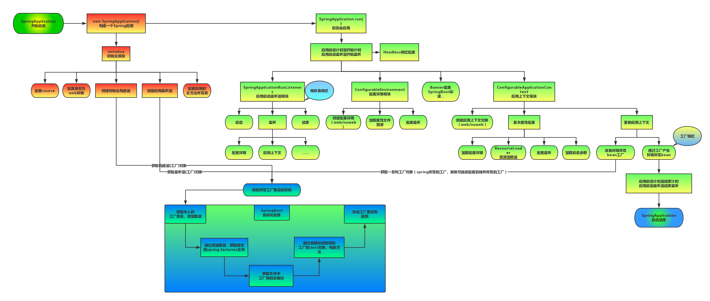
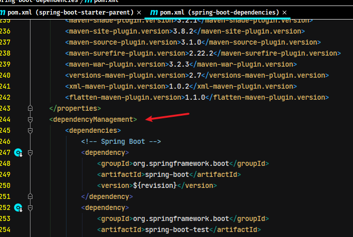
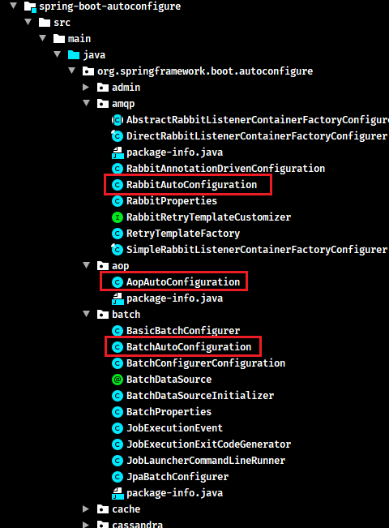
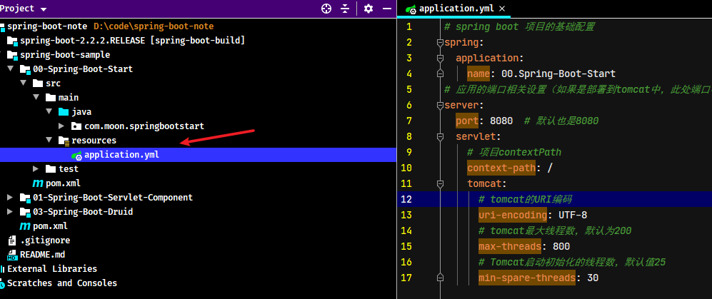

# Spring Boot 源码分析

> 源码分析的笔记基于 spring-boot-2.2.2.RELEASE 版本
>
> 源码下载地址：https://github.com/spring-projects/spring-boot/releases

## 1. SpringBoot源码构建

### 1.1. 方式1：maven命令编译项目

1. 进入到下载的源码目录执行如下命令：

```bush
mvn -Dmaven.test.skip=true clean install
```

> `-Dmaven.test.skip=true` 在打包过程中会忽略testcase，不然编译过程漫长，而且可能会发生一些异常，初次编译的目的削减掉这一步，如果正常编译通过，后面可以对那测试案例做测试。

2. 如果出现报错找不到spring-javaformat插件 执行`mvn spring-javaformat:apply`命令即可。
3. 如果再出现错误，执行`mvn -Dmaven.test.failure.ignore=true -Dmaven.test.skip=true clean install`

### 1.2. 使用 mvnwrapper 编译项目

1. 进入到下载的源码目录执行命令：`mvnw clean install -DskipTests -Pfast`


2. 如果出现报错找不到 spring-javaformat 插件 执行 `mvn spring-javaformat:apply` 命令即可。命令执行成功后，再次执行指令：`mvnw clean install -DskipTests -Pfast`

## 2. SpringBoot 项目启动流程

### 2.1. SpringBoot 应用启动流程图



## 3. Spring Boot 自动配置原理分析

Spring Boot 框架是一个将整合框架的整合代码都写好了的框架。所以要知道它的工作原理才能够找到各种整合框架可以配置的属性，以及属性对应的属性名。

### 3.1. 准备阶段

Spring Boot 是一个可快速整合各种技术的框架，Spring Boot 会大量收录行业内相关技术的技术相关配置、技术初始化等信息，将其收集整理成一个依赖、配置、技术初始化的技术列表集合

### 3.2. spring-boot-dependencies 父工程依赖管理原理

创建 Spring Boot 项目，继承了 Spring Boot 的父工程 spring-boot-starter-parent 后，查看工程的依赖关系，父工程又依赖了 spring-boot-dependencies 模块，而此 spring-boot-denpendencies 模块中的 pom 文件，管理所有公共 Starter 与相关技术的依赖，并且通过 `<dependencyManagement>` 标签实现 jar 版本管理

因为继承父工程 spring-boot-starter-parent 后，可以根据需要，直接引用相应的 starter 即可，不需要配置版本号



### 3.3. spring-boot-starters 工程

#### 3.3.1. starters 的原理

starters 是依赖关系的整理和封装，是一套依赖坐标的整合。只要导入相关的 starter 即可该功能及其相关必需的依赖


> 举例：进行 JPA or Web 开发，只需要导入 spring-boot-starter-data-jpa 或 spring-boot-starter-web 即可

每个 starter 包含了当前功能下的许多必备依赖坐标，这些依赖坐标是项目开发，上线和运行必须的。同时这些依赖也支持依赖传递。例如：spring-boot-starter-web 包含了所有 web 开发必须的依赖坐标


#### 3.3.2. 自定义 starter 的命名规范

- 官方的 starter 命名：`spring-boot-starter-*`
- 非官方的 starter 命名：`thirdpartyproject-spring-boot-starter`

官方提供的 starter 详见官方文档：https://docs.spring.io/spring-boot/docs/2.3.3.RELEASE/reference/html/using-spring-boot.html#using-boot-starter

### 3.4. 自动配置信息位置说明

每个 starter 都有相应自动配置处理在 spring-boot-autoconfigure 模块中，在此模块的 `src/main/resources/META-INF` 中定义了所有内置支持的技术框架及其相关的约定的默认配置：

- `additional-spring-configuration-metadata.json`：默认配置，Spring Boot 采用约定大于配置设计思想。
- `spring.factories`：定义了自动配置相关的处理类的映射关系。在项目启动的时候会将相关映射的处理类加载到 Spring 容器中


- 在 spring-boot-autoconfigure 模块中，所有支持的框架根据功能类型来划分包，每个包都有一个 `XxxAutoConfiguration` 配置类，都是一个基于纯注解的配置类，是各种框架整合的代码。如图所示：



- 如果配置的框架有默认的配置参数，都放在一个命名为`XxxProperties`的属性类，如图所示：


- 通过项目的 resources 下的 `application.properties` 或 `application.yml` 文件可以修改每个整合框架的默认属性，从而实现了快速整合的目的。



### 3.5. 自动配置流程分析

查看启动类注解 `@SpringBootApplication`，可以跟踪自动配置加载的实现步骤

#### 3.5.1. 自定义配置的注解

Spring Boot 启动注解 `@SpringBootApplication` 包含若干个注解，其中 `@SpringBootConfiguration` 与 `@ComponentScan` 均为 Spring 基础的注解，而实现自动配置的关键是 `@EnableAutoConfiguration` 注解

```java
@Target(ElementType.TYPE)
@Retention(RetentionPolicy.RUNTIME)
@Documented
@Inherited
@SpringBootConfiguration
@EnableAutoConfiguration
@ComponentScan(excludeFilters = { @Filter(type = FilterType.CUSTOM, classes = TypeExcludeFilter.class),
		@Filter(type = FilterType.CUSTOM, classes = AutoConfigurationExcludeFilter.class) })
public @interface SpringBootApplication {
    ...
}
```

查看 `@EnableAutoConfiguration` 注解源码，分别包含了 `@AutoConfigurationPackage` 与 `@Import(AutoConfigurationImportSelector.class)`

```java
@Target(ElementType.TYPE)
@Retention(RetentionPolicy.RUNTIME)
@Documented
@Inherited
@AutoConfigurationPackage
@Import(AutoConfigurationImportSelector.class)
public @interface EnableAutoConfiguration {
    ...
}
```

#### 3.5.2. @AutoConfigurationPackage 注解

在 `@AutoConfigurationPackage` 注解中，通过 `@Import` 注解导入 `AutoConfigurationPackages.Registrar` 的内部类

```java
@Target(ElementType.TYPE)
@Retention(RetentionPolicy.RUNTIME)
@Documented
@Inherited
@Import(AutoConfigurationPackages.Registrar.class)
public @interface AutoConfigurationPackage {
    
}
```

`AutoConfigurationPackages.Registrar` 内部类，实现了 `ImportBeanDefinitionRegistrar` 接口，Spring 容器启动时会调用 `registerBeanDefinitions` 方法

```java
@Override
public void registerBeanDefinitions(AnnotationMetadata metadata, BeanDefinitionRegistry registry) {
	register(registry, new PackageImports(metadata).getPackageNames().toArray(new String[0]));
}
```

该方法会分别将当前 `@AutoConfigurationPackages` 所有位置的包及其子包、与其 `basePackages`、`basePackageClasses` 属性配置的都包路径，都注册到 Spring 的 `BeanDefinitionRegistry` 中进行包扫描


#### 3.5.3. AutoConfigurationImportSelector 类

在 `@EnableAutoConfiguration` 注解中，通过 `@Import` 注解引入自动配置处理类 `AutoConfigurationImportSelector`，该类实现了 `DeferredImportSelector` 接口，而 `DeferredImportSelector` 接口又继承了 `ImportSelector` 接口。Spring 容器初始化时会调用 `selectImports` 方法

```java
@Override
public String[] selectImports(AnnotationMetadata annotationMetadata) {
	if (!isEnabled(annotationMetadata)) {
		return NO_IMPORTS;
	}
	AutoConfigurationMetadata autoConfigurationMetadata = AutoConfigurationMetadataLoader
			.loadMetadata(this.beanClassLoader);
	// 此方法是主要处理逻辑，获取需要加载的bean全限定名集合
	AutoConfigurationEntry autoConfigurationEntry = getAutoConfigurationEntry(autoConfigurationMetadata,
			annotationMetadata);
	return StringUtils.toStringArray(autoConfigurationEntry.getConfigurations());
}
```

在 `getAutoConfigurationEntry` 方法中通过 `getCandidateConfigurations` 方法获取所有需要加载的 bean 全限定名集合

```java
protected AutoConfigurationEntry getAutoConfigurationEntry(AutoConfigurationMetadata autoConfigurationMetadata,
		AnnotationMetadata annotationMetadata) {
	if (!isEnabled(annotationMetadata)) {
		return EMPTY_ENTRY;
	}
	AnnotationAttributes attributes = getAttributes(annotationMetadata);
	// 通过 getCandidateConfigurations 方法获取所有需要加载的 bean 全限定名集合
	List<String> configurations = getCandidateConfigurations(annotationMetadata, attributes);
	// 去重处理
	configurations = removeDuplicates(configurations);
	// 获取不需要加载的 bean,这里我们可以通过 spring.autoconfigure.exclude 人为配置
	Set<String> exclusions = getExclusions(annotationMetadata, attributes);
	checkExcludedClasses(configurations, exclusions);
	configurations.removeAll(exclusions);
	configurations = filter(configurations, autoConfigurationMetadata);
	// 发送事件，通知所有的 AutoConfigurationImportListener 进行监听
	fireAutoConfigurationImportEvents(configurations, exclusions);
	return new AutoConfigurationEntry(configurations, exclusions);
}
```

跟踪源码可知，最终会读取资源目录中的 `META-INF/spring.factories` 文件，即前面所说的定义了自动配置相关的处理类的映射关系


读取 `spring.factories` 文件，获取所有自动处理类全限定名，然而 Spring Boot 不会将所有处理类都实例化，每个配置类上都会有 `@ConditionalOn*` 的条件注解来控制 bean 的加载，下面以 `RedisAutoConfiguration` 为例：

```java
@Configuration(proxyBeanMethods = false)
@ConditionalOnClass(RedisOperations.class)
@EnableConfigurationProperties(RedisProperties.class)
@Import({ LettuceConnectionConfiguration.class, JedisConnectionConfiguration.class })
public class RedisAutoConfiguration {
    ...
}
```

当导入了 spring-boot-starter-data-redis 的依赖后，项目存在 `RedisOperations` 字节码文件后，此时才会实例化 `RedisAutoConfiguration` 类


双比如内置 web 容器的处理类 `EmbeddedWebServerFactoryCustomizerAutoConfiguration`，类上引入 `@EnableConfigurationProperties({ServerProperties.class})` 注解，用于加载默认配置类的参数。然后内部类中通过 `@ConditionalOnClass` 注解来控制加载哪种类型的 web 容器


#### 3.5.4. 小结

Spring Boot 启动时先加载 spring.factories 文件中的 `org.springframework.boot.autoconfigure.EnableAutoConfiguration` 配置项，然后根据定义在类上的 `@ConditionalOn*` 条件注解来决定哪些 bean 需要加载。

对于正常加载成 bean 的类，通常会通过 `@EnableConfigurationProperties` 注解初始化对应的配置属性类并加载对应的配置。而配置属性类上通常会通过 `@ConfigurationProperties` 加载指定前缀的配置，并且这些配置通常都有默认值。

### 3.6. 变更自动配置

Spring Boot 支持对自动配置的流程做一些高级定制，比如禁用一些自动配置的加载。具体操作有如下几种方式：

#### 3.6.1. 方式1：配置文件排除

通过修改 Spring Boot 配置文件的 `spring.autoconfigure.exclude` 选项，排除指定的自动配置处理类

```yml
spring:
  autoconfigure:
    exclude:
      - org.springframework.boot.autoconfigure.task.TaskExecutionAutoConfiguration
```

#### 3.6.2. 方式2：注解属性排除

通过 `@EnableAutoConfiguration` 排除指定的自动配置处理类

- `exclude` 属性：指定排除的多个配置处理类字节码（数组）
- `excludeName` 属性：指定排除的多个配置处理类全限定名称（数组）

```java
@EnableAutoConfiguration(
        exclude = {MongoDataAutoConfiguration.class, DataSourceAutoConfiguration.class}, 
        excludeName = {"org.springframework.boot.autoconfigure.amqp.RabbitAutoConfiguration", "org.springframework.boot.autoconfigure.jms.JmsAutoConfiguration"}
)
// 或者
@SpringBootApplication(
        exclude = {MongoDataAutoConfiguration.class, DataSourceAutoConfiguration.class}, 
        excludeName = {"org.springframework.boot.autoconfigure.amqp.RabbitAutoConfiguration", "org.springframework.boot.autoconfigure.jms.JmsAutoConfiguration"}
)
```

#### 3.6.3. 排除坐标（应用面较窄）

此时可以通过检测条件的控制来管理自动配置是否启动。例如 web 程序启动时会自动启动 tomcat 服务器，可以通过排除坐标的方式，让加载 tomcat 服务器的条件失效。

```xml
<dependencies>
    <dependency>
        <groupId>org.springframework.boot</groupId>
        <artifactId>spring-boot-starter-web</artifactId>
        <!-- web起步依赖环境中，排除Tomcat起步依赖，匹配自动配置条件 -->
        <exclusions>
            <exclusion>
                <groupId>org.springframework.boot</groupId>
                <artifactId>spring-boot-starter-tomcat</artifactId>
            </exclusion>
        </exclusions>
    </dependency>
    <!-- 添加Jetty起步依赖，匹配自动配置条件 -->
    <dependency>
        <groupId>org.springframework.boot</groupId>
        <artifactId>spring-boot-starter-jetty</artifactId>
    </dependency>
</dependencies>
```

> 不过需要值得注意的是，如把 tomcat 排除掉，记得要增加一个新的可以运行的服务器依赖。


