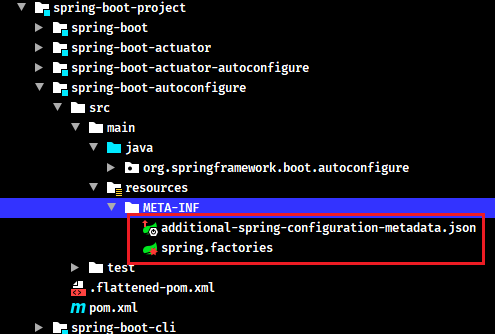

# Spring Boot 源码分析

> 源码分析的笔记基于spring-boot-2.2.2.RELEASE版本
>
> 下载地址：https://github.com/spring-projects/spring-boot/releases

## 1. SpringBoot源码构建

### 1.1. 方式1：maven命令编译项目

1. 进入到下载的源码目录执行如下命令：

```bush
mvn -Dmaven.test.skip=true clean install
```

> `-Dmaven.test.skip=true` 在打包过程中会忽略testcase，不然编译过程漫长，而且可能会发生一些异常，初次编译的目的削减掉这一步，如果正常编译通过，后面可以对那测试案例做测试。

2. 如果出现报错找不到spring-javaformat插件 执行`mvn spring-javaformat:apply`命令即可。
3. 如果再出现错误，执行`mvn -Dmaven.test.failure.ignore=true -Dmaven.test.skip=true clean install`

### 1.2. 使用 mvnwrapper 编译项目

1. 进入到下载的源码目录执行命令：`mvnw clean install -DskipTests -Pfast`


2. 如果出现报错找不到 spring-javaformat 插件 执行 `mvn spring-javaformat:apply` 命令即可。命令执行成功后，再次执行指令：`mvnw clean install -DskipTests -Pfast`

## 2. SpringBoot 项目启动流程

### 2.1. SpringBoot 应用启动流程图


## 3. Spring Boot 自动配置原理分析

Spring Boot 框架是一个将整合框架的整合代码都写好了的框架。所以要知道它的工作原理才能够，找到各种整合框架可以配置的属性，以及属性对应的属性名。

### 3.1. spring-boot-starter-parent 父工程依赖管理原理

创建 SpringBoot 项目，继承了 SpringBoot 的父工程 `spring-boot-starter-parent` 后，查看工程的依赖关系，父工程依赖了 `spring-boot-dependencies` 工程，`spring-boot-denpendencies` 的 pom 管理所有公共 Starter 依赖的版本，并且通过 `<dependencyManagement>` 标签实现 jar 版本管理

因为继承父工程 `spring-boot-starter-parent` 后，可以根据需要，直接引用相应的 starter 即可，不需要配置版本号


#### 3.1.1. starters 的原理

starters 是依赖关系的整理和封装，是一套依赖坐标的整合。只要导入相关的 starter 即可该功能及其相关必需的依赖

> 举例：JPA or Web 开发，只需要导入 `spring-boot-starter-data-jpa` 或 `spring-boot-starter-web` 即可

每个Starter包含了当前功能下的许多必备依赖坐标，这些依赖坐标是项目开发，上线和运行必须的。同时这些依赖也支持依赖传递。例如：`spring-boot-starter-web` 包含了所有web开发必须的依赖坐标


**starter的命名规范**：

- 官方的starter命名：`spring-boot-starter-*`
- 非官方的starter命名：`thirdpartyproject-spring-boot-starter`

官方提供的 Starter 详见官方文档：https://docs.spring.io/spring-boot/docs/2.3.3.RELEASE/reference/html/using-spring-boot.html#using-boot-starter

### 3.2. 自动配置信息位置说明

每个 Starter 基本都会有自动配置 `AutoConfiguration`，`AutoConfiguration` 的 jar 包定义了约定的默认配置信息。SpringBoot 采用约定大于配置设计思想。

- SpringBoot的`spring-boot-autoconfigure-x.x.x.RELEASE.jar`中编写了所有内置支持的框架的相关的默认配置
    - `additional-spring-configuration-metadata.json`：默认配置
    - `spring.factories`：定义了自动配置相关的处理类的映射关系。在项目启动的时候会将相关映射的处理类加载到spring容器中




- 所有支持的框架根据功能类型来划分包，每个包都有一个`XxxAutoConfiguration`配置类，都是一个基于纯注解的配置类，是各种框架整合的代码。如图所示：


- 如果配置的框架有默认的配置参数，都放在一个命名为`XxxProperties`的属性类，如图所示：


- 通过项目的resources下的`application.properties`或`application.yml`文件可以修改每个整合框架的默认属性，从而实现了快速整合的目的。


### 3.3. 配置流程说明

- 第一步：配置一个内置整合框架的参数，先到`spring-boot-autoconfigure-x.x.x.RELEASE.jar`找到对应的模块。
- 第二步：如果该框架有可以配置的参数，那么对应的整合模块中一定有一个XxxProperties类，在里面可以找可以设置的参数。
- 第三步：在resources源目录下的`application.properties`文件里面可以修改XxxProperties类中默认的参数。


### 3.4. 自动配置流程分析

查看启动类注解`@SpringBootApplication`，可以跟踪加载的步骤

1. 需要标识`@EnableAutoConfiguration`注解
2. 该注解会使用`@Import(AutoConfigurationImportSelector.class)`注解引入自动配置处理类
3. 自动配置会读取`spring-boot-autoconfigure-x.x.x.RELEASE.jar`包下的`spring.factories`文件，获取需要加载的处理类
4. 比如内置web容器的处理类`EmbeddedWebServerFactoryCustomizerAutoConfiguration`，类上引入`@EnableConfigurationProperties({ServerProperties.class})`注解，用于加载默认配置类的参数


