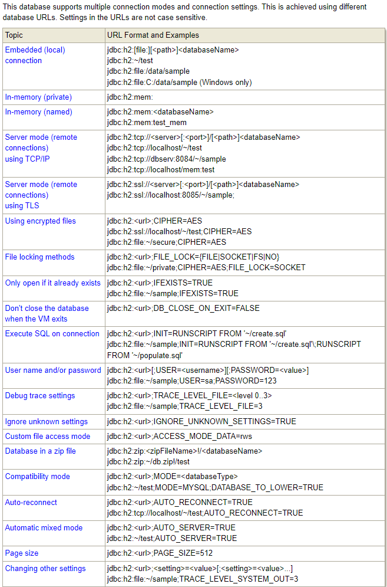
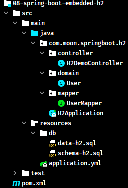
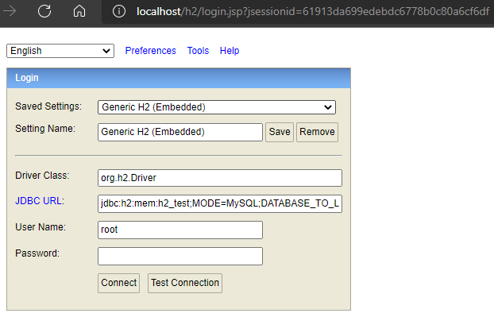
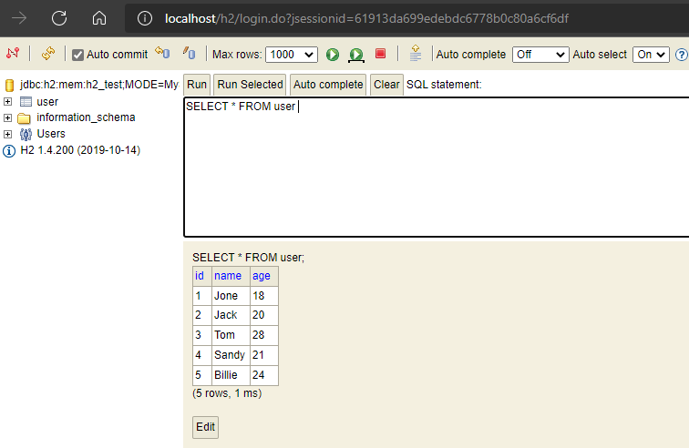

# Spring Boot 对 SQL 关系型数据库技术支持

Spring Boot 对 SQL 关系型数据库提供了技术支持。主要包含三个层面：**数据源技术**、**持久化技术**和**数据库技术**。

此部分内容主要介绍**数据源技术**与**数据库技术**。**持久化技术**详见[《Spring Boot 整合关系型数据库持久技术框架》笔记](/07-分布式架构&微服务架构/01-SpringBoot/07-SpringBoot-SQL-Databases-Technologies)

## 1. 数据源技术

Spring Boot 程序，如果不使用第三方数据源技术，运行程序可以在日志中找到如下初始化信息：

```bash
INFO 31820 --- [           main] com.zaxxer.hikari.HikariDataSource       : HikariPool-1 - Starting...
INFO 31820 --- [           main] com.zaxxer.hikari.HikariDataSource       : HikariPool-1 - Start completed.
```

从以上日志可以看出，Spring Boot 提供了内置的数据源 HikariDataSource

### 1.1. Spring Boot 内嵌数据源

数据层技术是每一个企业级应用程序都会用到的，而其中必定会进行数据库连接的管理。Spring Boot 提供了 3 款内嵌数据源技术，分别如下：

- **HikariCP**：官方推荐的数据源技术，作为默认内置数据源使用。如不配置第三方数据源，则默认使用此数据源
- **Tomcat 提供 DataSource**：如不使用 HikariCP，并且使用 tomcat 作为 web 服务器开发时，则可以使用到此数据源。
    - 在引入 spring-boot-starter-web 依赖后，默认使用内嵌 tomcat，如果此时将 HikartCP 技术的坐标排除掉，则会使用到 tomcat 提供的 DataSource
- **Commons DBCP**：此数据源使用的条件比较苛刻了，当既不使用 HikartCP 也不使用 tomcat 的 DataSource 时，默认才使用此数据源

### 1.2. HikariCP 数据源配置

使用默认的数据源 HikariCP，直接在 application.yml 文件配置数据库相关信息即可：

```yml
spring:
  datasource:
    url: jdbc:mysql://localhost:3306/tempdb?serverTimezone=UTC&useSSL=false&useUnicode=true
    driver-class-name: com.mysql.cj.jdbc.Driver
    username: root
    password: 123456
```

可以对 HikariCP 配置其独立的属性，<font color=red>**但需要注意：`url` 地址需要单独配置，如果配置到 `hikari` 子属性中，程序启动会报错**</font>

```yml
spring:
  datasource:
    url: jdbc:mysql://localhost:3306/tempdb?serverTimezone=UTC&useSSL=false&useUnicode=true
    hikari:
      driver-class-name: com.mysql.cj.jdbc.Driver
      username: root
      password: root
      maximum-pool-size: 50
```

### 1.3. 测试

> 参考 mybatis 或者 mybatis-plus 与 Spring Boot 整合的示例，搭建一个最简单的工程用于测试

执行测试用例，观察控制台输出的日志

```bash
 _ _   |_  _ _|_. ___ _ |    _ 
| | |\/|_)(_| | |_\  |_)||_|_\ 
     /               |         
                        3.4.3 
INFO 10344 --- [           main] c.m.s.hikaricp.test.HikariCPTest         : Started HikariCPTest in 1.984 seconds (JVM running for 3.075)
INFO 10344 --- [           main] com.zaxxer.hikari.HikariDataSource       : HikariPool-1 - Starting...
INFO 10344 --- [           main] com.zaxxer.hikari.HikariDataSource       : HikariPool-1 - Start completed.
```

## 2. 内置数据库技术

Spring Boot 给开发者提供了内置的数据源解决方案和持久化解决方案，还提供了内置的数据库解决方案

### 2.1. Spring Boot 内置数据库

Spring Boot 提供了3款内置的数据库：

- H2
- HSQL
- Derby

以上三款数据库底层都是使用 java 语言开发的。除了可以独立安装之外，还可以像是 tomcat 服务器一样，采用内嵌的形式运行在 spirng boot 容器中。在应用程序运行后，如果进行测试工作，此时测试的数据无需存储在磁盘上，直接运行在内存中，运行或者测试完成后，服务器一旦关闭，所有数据都清除，不用手动去清理因测试留下的历史数据。这也是内嵌数据库的最大优点，方便进行功能测试。

### 2.2. H2 数据库简介

官方网址：http://www.h2database.com/html/main.html

连接方式相关（Database URL Overview），以嵌入式(本地)连接方式连接 H2 数据库。这种连接方式默认情况下只允许有一个客户端连接到H2数据库，有客户端连接到H2数据库之后，此时数据库文件就会被锁定，那么其他客户端就无法再连接了。

连接语法：`jdbc:h2:[file:][<path>]<databaseName>`

[官方连接url示例](http://www.h2database.com/html/features.html#database_url) 如下：



如以下 url 字符串为例：

```
jdbc:h2:mem:h2_test;MODE=MySQL;DATABASE_TO_LOWER=TRUE
```

- `mem`：以内存模式启动数据库
- `h2_test`：数据库名称
- `MODE=MySQL`：配置兼容MySQL
- `DATABASE_TO_LOWER=TRUE`：设置数据库字符全为小写

### 2.3. Spring Boot 内嵌 H2 数据库快速入门

以 H2 数据库为例，介绍使用这些内嵌数据库的方法

#### 2.3.1. 引入依赖

- h2 数据库的依赖

```xml
<dependency>
    <groupId>com.h2database</groupId>
    <artifactId>h2</artifactId>
</dependency>
```

- 引入数据库持久化框架，如 mybatis、mybatis-plus、spring-data-jpa 等。（*示例使用 mybatis-plus*）

```xml
<dependency>
    <groupId>com.baomidou</groupId>
    <artifactId>mybatis-plus-boot-starter</artifactId>
    <version>3.4.3</version>
</dependency>
```

- 引入 spring-boot-starter 或者 spring-boot-starter-web 依赖。

```xml
<dependency>
    <groupId>org.springframework.boot</groupId>
    <artifactId>spring-boot-starter-web</artifactId>
</dependency>
```

> 注：因为 H2 数据库自带一个控制台访问程序，需要使用web访问，如果不需要使用其控制台或者只做测试，则选择 spring-boot-starter 依赖即可

#### 2.3.2. 项目配置

修改 application.yml 配置文件，增加以下配置

```yml
server:
  port: 80
spring:
  h2:
    console:
      # 置开启 H2 数据库控制台访问程序，也可以使用其他的数据库连接软件操作
      enabled: true
      path: /h2
  # H2 数据库控制台通过 web 端访问路径 /h2，访问密码 123456，如果访问失败，先配置下列数据源，启动程序运行后再次访问/h2路径就可以正常访问了
  datasource:
    url: jdbc:h2:mem:h2_test;MODE=MySQL;DATABASE_TO_LOWER=TRUE
    # driver-class-name: org.h2.Driver # 可省略，Spring boot 会根据数据库的类型去选择相应的数据库连接驱动
    username: root
    password: 123456
    # 可以为 H2 配置两个sql文件用于程序启动时的数据表的创建与初始化；
    schema: classpath:db/schema-h2.sql # 创建表结构
    data: classpath:db/data-h2.sql # 初始化数据
```

**部分配置项解析**：

- `spring.h2.console`：用于开启 H2 数据库控制台访问程序。<font color=red>**值得注意的是：H2 数据库线上运行时请务必关闭**</font>
- `spring.datasource.hikari.driver-class-name` 的配置可能省略，因为 spring boot 会根据数据库的类型去选择相应的驱动类，如指定了则使用指定的驱动类。
- `spring.datasource.schema`：配置数据库初始化相关表结构
- `spring.datasource.data`：配置数据库初始化数据

初始化表结构脚本：

```sql
DROP TABLE IF EXISTS `user`;
CREATE TABLE `user`(
  `id`      BIGINT (20),
  `name`    VARCHAR(30),
  `age`     INT (11),
  PRIMARY KEY (`id`)
);
```

初始化数据脚本：

```sql
DELETE FROM `user`;
INSERT INTO `user`(`id`, `name`, `age`) VALUES (1, 'Jone', 18),(2, 'Jack', 20),(3, 'Tom', 28),(4, 'Sandy', 21),(5, 'Billie', 24);
```

> 值得注意的是：此处做示例时有一个小坑，就是H2 数据库初始化表结构的sql语句，在定义字段时，不能使用 `NULL` 与 `NOT NULL` 等关键字
>
> 参考 [stackoverflow 的一个答复](https://stackoverflow.com/questions/38649370/how-to-make-mysql-database-schema-to-be-compatible-with-h2-database)

#### 2.3.3. 使用测试

创建一个简单的 mybatis-plus 工程用来测试



浏览器访问 `http://localhost/h2`，即可访问 H2 自带的连接控制台（*前提是配置开启*）



使用配置中的密码登陆，可以看到配置中初始化的数据库表与相应的数据



当程序运行起来后，就可以正常对数据库进行 CRUD 操作，而当程序停止运行后，所有数据都从内存中移除。

## 3. Spring Boot 整合 C3P0 数据源

### 3.1. 创建数据源实例

创建自定义配置类 `DataSourceConfiguration`，在类使用 `@Bean` 注解创建 `DataSource` 数据源实例

```java
@Configuration // 定义配置信息类
public class DataSourceConfiguration {
    /** 定义创建数据源方法 */
    @Bean(name="dataSource") // 定义Bean
    @Primary // 主要的候选者
    @ConfigurationProperties(prefix="spring.datasource.c3p0") // 配置属性
    public DataSource getDataSource(){
        return DataSourceBuilder.create() // 创建数据源构建对象
               .type(ComboPooledDataSource.class) // 设置数据源类型
               .build(); // 构建数据源对象
    }
}
```

### 3.2. c3p0 配置

在项目的 application.properties 文件中，配置 c3p0 相关属性

```properties
# 配置c3p0
spring.datasource.c3p0.driverClass=com.mysql.jdbc.Driver
spring.datasource.c3p0.jdbcUrl=jdbc:mysql://localhost:3306/springboot_db
spring.datasource.c3p0.user=root
spring.datasource.c3p0.password=123456
spring.datasource.c3p0.maxPoolSize=30
spring.datasource.c3p0.minPoolSize=10
spring.datasource.c3p0.initialPoolSize=10
```

## 4. Spring Boot 整合 Druid 数据源（待整理）

### 4.1. Druid 简介

Druid 是一个非常优秀的连接池，非常好的管理了数据库连接，可以实时监控数据库连接对象和应用程序的数据库操作记录

[Druid常见问题](https://github.com/alibaba/druid/wiki/%E5%B8%B8%E8%A7%81%E9%97%AE%E9%A2%98)

### 4.2. 项目准备

#### 4.2.1. 项目依赖

修改pom.xml文件，引入相关依赖

```xml

```


