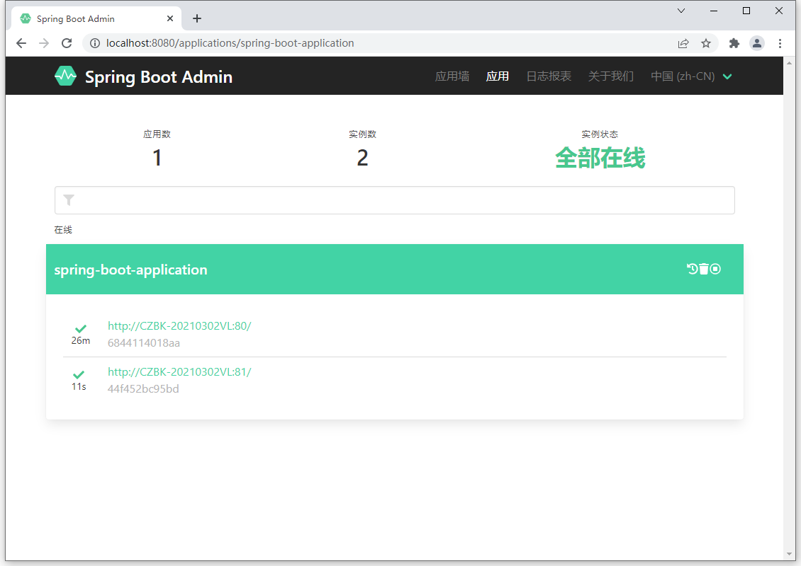
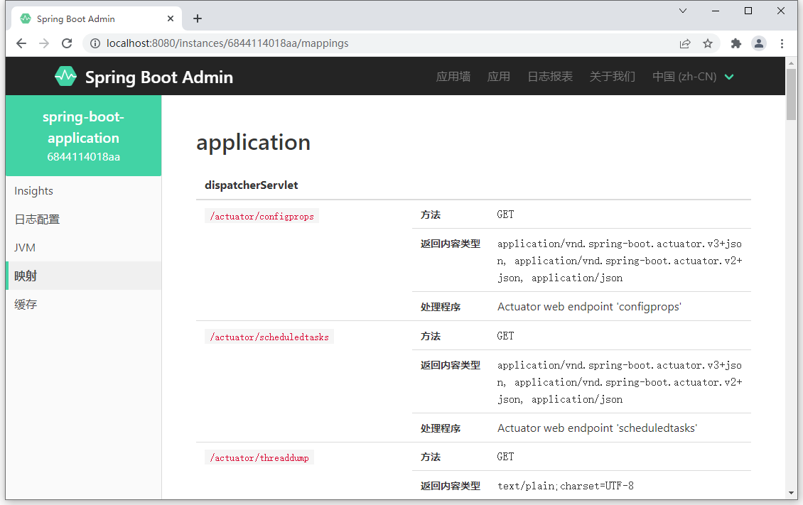
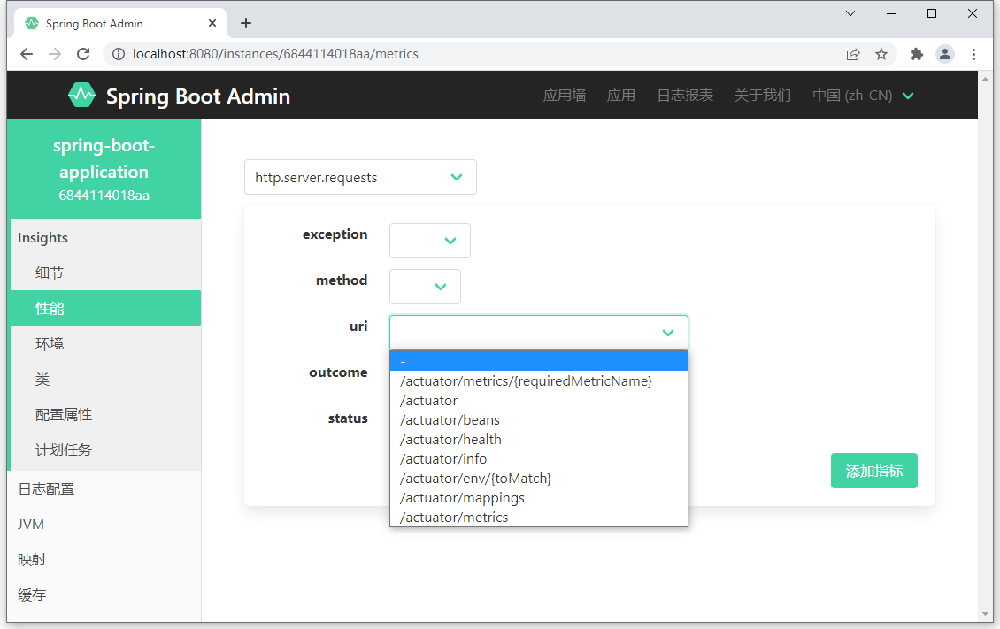

# Spring Boot Actuator 应用运行状态监控

## 1. 监控的介绍

最早的软件完成一些非常简单的功能，代码不多，错误也少。随着软件功能的逐步完善，软件的功能变得越来越复杂，功能不能得到有效的保障，这个阶段出现了针对软件功能的检测，也就是软件测试。

伴随着计算机操作系统的逐步升级，软件的运行状态也变得开始让人捉摸不透，出现了不稳定的状况。伴随着计算机网络的发展，程序也从单机状态切换成基于计算机网络的程序，应用于网络的程序开始出现，由于网络的不稳定性，程序的运行状态让使用者更加堪忧。互联网的出现彻底打破了软件的思维模式，随之而来的互联网软件就更加凸显出应对各种各样复杂的网络情况之下的弱小。计算机软件的运行状况已经成为了软件运行的一个大话题，针对软件的运行状况就出现了全新的思维，建立起了初代的软件运行状态监控。

**监控**就是通过软件的方式展示另一个软件的运行情况，运行的情况则通过各种各样的指标数据反馈给监控人员。例如网络是否顺畅、服务器是否在运行、程序的功能是否能够整百分百运行成功，内存是否够用等等。

### 1.1. 监控的意义


## 2. Spring Boot Actuator 简述

Spring Boot 的 Actuator 提供了运行状态监控的功能，可以实现对程序内部运行情况监控，比如监控状况、Bean 加载情况、配置属性、日志信息等。Actuator 的监控数据可以通过 Rest、运程 shell 和 JMX 方式获得。

状态监控的数据都是以 json 格式返回，分析数据不太方便，*推荐使用基于 Actuator 开发的 Spring Boot Admin 状态监控开源项目*

## 3. 基础使用步骤

1. 导入依赖

```xml
<dependency>
    <groupId>org.springframework.boot</groupId>
    <artifactId>spring-boot-starter-actuator</artifactId>
</dependency>
```

2. 访问 `http://项目应用的地址:端口号/acruator`，可以查看监控数据

### 3.1. Actuator 监控使用

通过访问以下路径，可以查看到相关的监控信息

|      路径       |                             描述                              |
| --------------- | ------------------------------------------------------------- |
| /beans          | 描述应用程序上下文里全部的Bean，以及它们的关系                  |
| /env            | 获取全部环境属性                                               |
| /env/{name}     | 根据名称获取特定的环境属性值                                   |
| /health         | 报告应用程序的健康指标，这些值由HealthIndicator的实现类提供     |
| /info           | 获取应用程序的定制信息，这些信息由info打头的属性提供            |
| /mappings       | 描述全部的URI路径，以及它们和控制器(包含Actuator端点)的映射关系 |
| /metrics        | 报告各种应用程序度量信息，比如内存用量和HTTP请求计数            |
| /metrics/{name} | 报告指定名称的应用程序度量值                                   |
| /trace          | 提供基本的HTTP请求跟踪信息(时间戳、HTTP头等)                    |


# Spring Boot Admin 可视化监控平台

## 1. Spring Boot Admin 简介

- 官网：https://github.com/codecentric/spring-boot-admin
- 官方文档：https://codecentric.github.io/spring-boot-admin/

### 1.1. 为什么要使用 Spring Boot Admin

Spring Boot Actuator 提供了对单个 Spring Boot 应用的监控，信息包含应用状态、内存、线程、堆栈等，比较全面的监控了 Spring Boot 应用的整个生命周期，可以有效的帮我解决众多服务的健康检查、指标监控问题、配置管理、日志聚合问题、异常排查问题等等。

### 1.2. Spring Boot Admin 来源背景

codecentric 的 Spring Boot Admin 是一个社区项目，用于管理和监视您的 Spring Boot® 应用程序。这些应用程序在 Spring Boot Admin Client 中注册（通过HTTP），或者是通过Spring Cloud®（例如Eureka，Consul）发现的。UI 只是 Spring Boot Actuator 端点之上的 Vue.js 应用程序。

### 1.3. Spring Boot Admin 功能介绍

Spring Boot Admin 提供了很多服务治理方面的功能，利用它能节省很多在治理服务方面的时间和精力 Spring Boot Admin 提供了如下功能（包括但不限于）：

- 显示健康状态及详细信息，如 JVM 和内存指标、数据源指标、缓存指标
- 跟踪并下载日志文件
- 查看 JVM 系统-和环境属性
- 查看 Spring 启动配置属性方便 loglevel 管理
- 查看线程转储视图 http-traces
- 查看 http 端点查看计划任务
- 查看和删除活动会话(使用 spring-session)
- 状态更改通知(通过电子邮件、Slack、Hipchat…)
- 状态变化的事件日志(非持久性)
- 下载 heapdump
- 查看 Spring Boot 配置属性
- 支持 Spring Cloud 的环境端点和刷新端点
- 支持 K8s
- 易用的日志级别管理
- 与 JMX-beans 交互
- 查看线程转储
- 查看 http 跟踪
- 查看 auditevents
- 查看 http-endpoints
- 查看计划任务
- 查看和删除活动会话（使用 Spring Session ）
- 查看 Flyway/Liquibase 数据库迁移
- 状态变更通知（通过电子邮件，Slack，Hipchat 等，支持钉钉）
- 状态更改的事件日志（非持久化）

## 2. Spring Boot Admin 基础使用

Spring Boot Admin 有两个角色，客户端(Client)和服务端(Server)。

- 应用程序作为 Spring Boot Admin Client 向为 Spring Boot Admin Server 注册
- Spring Boot Admin Server 的 UI 界面将 Spring Boot Admin Client 的 Actuator Endpoint 上的一些监控信息。

### 2.1. 服务端开发

#### 2.1.1. 引入依赖

创建 maven 工程，在 pom.xml 文件中导入 Spring Boot Admin 服务端对应的 starter，版本与当前使用的 Spring Boot 主版本保持一致即可（如：2.5.x），并将工程其配置成 web 工程

```xml
<!-- Spring Boot Admin 服务端依赖 -->
<dependency>
    <groupId>de.codecentric</groupId>
    <artifactId>spring-boot-admin-starter-server</artifactId>
    <version>2.5.5</version>
</dependency>

<dependency>
    <groupId>org.springframework.boot</groupId>
    <artifactId>spring-boot-starter-web</artifactId>
</dependency>
```

也可以通过 Spring Initializr 创建，选择 Ops/Codecentric's Spring Boot Admin (Server)


#### 2.1.2. 开启监控服务端功能

在引导类上添加 `@EnableAdminServer` 注解，声明当前应用启动后作为 Spring Boot Admin 的服务器使用

```java
@SpringBootApplication
@EnableAdminServer // 标识当前应用作为 Spring Boot Admin 的服务端
public class AdminServerApplication {
    public static void main(String[] args) {
        SpringApplication.run(AdminServerApplication.class, args);
    }
}
```

#### 2.1.3. 登陆服务端管理界面

启动应用服务后，使用浏览器访问 http://127.0.0.1:8080/


看到如上界面，说明 Spring Boot Admin 服务端已经启用成功。

> 注：因为示例没有使用 application.yml 配置文件指定应用的端口，所以默认是8080，可按需修改，由于目前没有启动任何被监控的程序，所以里面暂无任何信息

### 2.2. 客户端开发

#### 2.2.1. 引入依赖

创建 maven 工程，在 pom.xml 文件中导入 Spring Boot Admin 客户端对应的 starter，版本与当前使用的 Spring Boot 主版本保持一致即可（如：2.5.x），并将工程其配置成 web 工程

```xml
<!-- Spring Boot Admin 客户端依赖 -->
<dependency>
    <groupId>de.codecentric</groupId>
    <artifactId>spring-boot-admin-starter-client</artifactId>
    <version>2.5.5</version>
</dependency>

<dependency>
    <groupId>org.springframework.boot</groupId>
    <artifactId>spring-boot-starter-web</artifactId>
</dependency>
```

也可以通过 Spring Initializr 创建，选择 Ops/Codecentric's Spring Boot Admin (Client)


#### 2.2.2. 配置客户端开放的信息

创建 application.yml 文件，配置客户端应用的信息发送给哪个 ip 地址的监控服务

```yml
server:
  port: 9100

spring:
  boot:
    admin:
      client:
        url: http://localhost:8080 # 指定当前客户端将监控信息上传到哪个服务器上
```

### 2.3. 监管后台界面信息展示介绍

客户端配置 `spring.boot.admin.client.url` 后，监控后台可以看到当前监控了1个程序


点击进去查看详细信息。注意：因为目前没有配置开发哪些信息，而 Spring Boot Admin 的客户端默认开放了 13 组信息给服务器，但是这些信息除了一个健康信息之外，其他的信息都不让通过 HTTP 请求查看。


如果需要查看全部健康明细，则通过在 application.yml 文件增加配置项 `management.endpoint.health.show-details` 来开放所有的健康信息明细。

```yml
management:
  endpoint:
    health:
      show-details: always # 开放所有的健康信息明细，默认值是 never，不开放
```

健康明细信息如下：


但目前除了健康信息，其他信息都查阅不了。原因在于其他12种信息是默认不提供给服务器通过 HTTP 请求查阅的，所以需要开启查阅的内容项 `management.endpoints.web.exposure.include`，其中配置值为 `"*"`，则表示查阅全部（<font color=red>**注意：记得带引号**</font>）

```yml
management:
  endpoints:
    web:
      exposure:
        # 设置通过HTTP请求可查阅的信息，默认值只有 health(健康信息)，
        # 如果配置 "*" 则可查询全部，包含了13组信息，有性能指标监控，加载的bean列表，加载的系统属性，日志的显示控制等等
        include: "*"
```

配置后再刷新服务器页面，就可以看到所有的信息了。界面中展示的信息量就非常大了，包含了13组信息，有性能指标监控，加载的bean列表，加载的系统属性，日志的显示控制等等。


### 2.4. 配置多个客户端

与配置配置单个客户端的方式一样，在其他的 Spring Boot 程序中添加客户端坐标与配置开放那些监控信息，这样当前服务器就可以监控多个客户端程序了。每个客户端展示不同的监控信息。



进入监控面板，如果加载的应用具有功能，在监控面板中可以看到3组信息展示的与之前加载的空工程不一样。

- 类加载面板中可以查阅到开发者自定义的类，如下图


- 映射中可以查阅到当前应用配置的所有请求




- 性能指标中可以查阅当前应用独有的请求路径统计数据




### 2.5. 使用步骤总结

admin-server 服务

1. 创建 admin-server 模块
2. 导入依赖坐标 spring-boot-admin-starter-server
3. 在引导类上添加 `@EnableAdminServer` 注解，启用监控功能

admin-client 服务

1. 创建 admin-client 模块
2. 导入依赖坐标 spring-boot-admin-starter-client
3. 配置相关信息：server 地址、开放了被监控的指标等

启动 server 和 client 服务，访问 server 项目地址

> <font color=violet>**注：server 与 client 工程必须均为 web 应用**</font>
