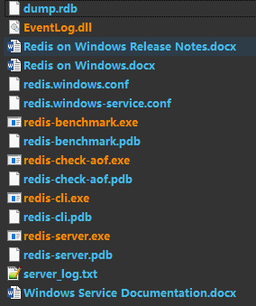
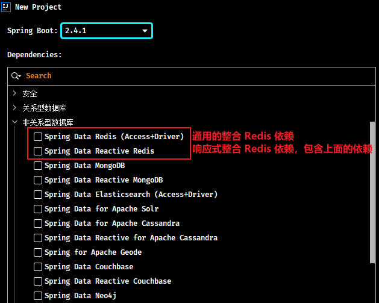

# Spring Boot 整合 Redis

## 1. Redis 概述

> Redis 更多详细内容详见[《Redis 笔记》](/04-数据库/03-Redis/01-Redis笔记)

### 1.1. 简介

Redis是一款采用 key-value 数据存储格式（也就是键值对的存储形式）的内存级 NoSQL 数据库。与 MySQL 数据库不同，MySQL 数据库有表、有字段、有记录，而 Redis 主要以一个键对应一个值的方式，并且数据以存储在内存中使用为主。Redis 支持多种数据存储格式，如：字符串，map 集合，list 集合等等。

Redis 有它的数据持久化方案，分别是 RDB 和 AOF，但是 Redis 自身并不是为了数据持久化，主要是在内存中保存数据，加速数据访问的，所以说是一款内存级数据库。

### 1.2. 安装

> 为了测试方便，使用了 window 版 Redis

windows 版安装包下载地址：https://github.com/tporadowski/redis/releases。下载的安装包有两种形式，一种是一键安装的 msi 文件，还有一种是解压缩即可使用的 zip 文件

个人使用的是免安装版本 Redis-x64-3.2.100，压缩后目录如下：



### 1.3. 启动服务

进入 redis 根目录下，使用以下命令启动服务与客户端

- 启动服务器，端口号默认 6379

```bash
redis-server.exe redis.windows.conf
```

- 启动客户端

```bash
redis-cli.exe
```

> 注意：window 安装版可能会出现一个小问题。如果启动 redis 服务器失败，可以先启动客户端，然后执行 `shutdown` 命令操作后退出，此时再重新启动 redis 服务器即可正常执行了。

### 1.4. 基本操作

此部分内容详见[《Redis 笔记》](/04-数据库/03-Redis/01-Redis笔记)

## 2. 整合 Redis 示例

在进行整合之前先梳理一下整合的思想，Spring Boot 整合任何技术的本质是在 Spring Boot 中使用对应技术的 API。如果两个技术没有交集，就不存在整合的概念了。Spring Boot 整合所有技术是一种通用思想与套路，主要思考的问题如下：

- 第一，需要先导入对应技术的坐标，而整合之后，这些坐标都有了一些变化
- 第二，任何技术通常都会有一些相关的配置信息，整合之后，这些信息如何写，写在哪是一个问题
- 第三，没有整合之前操作如果是模式A的话，整合之后如果没有给开发者带来一些便捷操作，那整合将毫无意义，所以整合后操作肯定要简化一些，那对应的操作方式自然也有所不同

### 2.1. 引入依赖

导入 Spring Boot 整合 redis 的坐标 spring-boot-starter-data-redis

```xml
<dependency>
    <groupId>org.springframework.boot</groupId>
    <artifactId>spring-boot-starter-data-redis</artifactId>
</dependency>
```

也可以直接使用 idea 的 Spring Initializr 创建 Spring Boot 项目，在创建模块的时候勾选相应的依赖，归属 NoSQL 分类中



### 2.2. 基础配置

在 Spring Boot 项目配置文件 application.yml 中，设置 Redis 相关配置

```yml
spring:
  redis:
    host: localhost # redis 服务地址，默认是 localhost
    port: 6379 # redis 服务端口，默认是 6379
```

### 2.3. 基础使用示例


