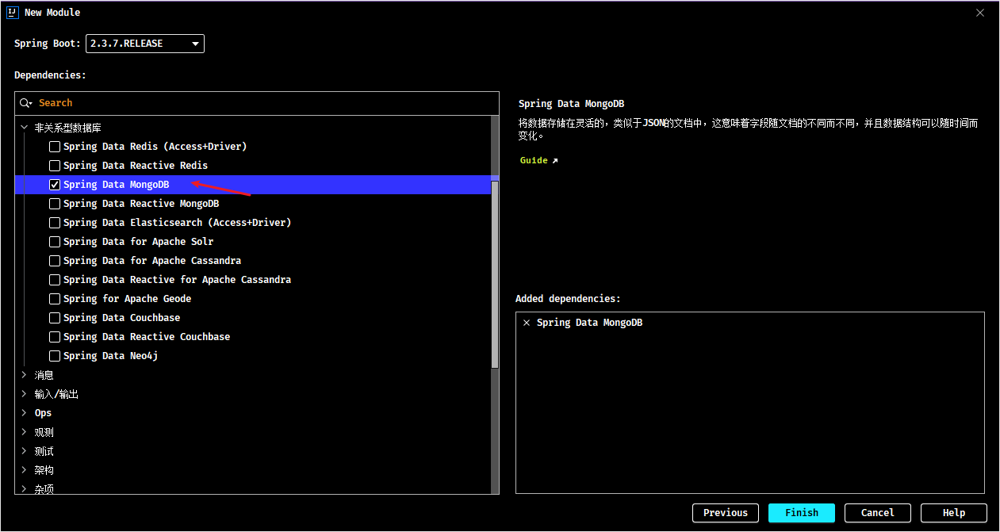

# Spring Boot 整合 MongoDB

## 1. MongoDB 概述

> 本笔记重点为 Spring Boot 如何整合 MongoDB，更多关于 MongoDB 的内容详见[《MongoDB 笔记》](/04-数据库/04-MongoDb/01-MongoDB-笔记)

### 1.1. 简介

MongoDB 是一个开源、高性能、无模式的文档型数据库，它是 NoSQL 数据库产品中的一种，是最像关系型数据库的非关系型数据库。

**无模式**是指：MongoDB 作为一款数据库，但没有固定的数据存储结构。第一条数据可能有A、B、C一共3个字段，第二条数据可能有D、E、F也是3个字段，第三条数据可能是A、C、E3个字段，也就是说数据的结构不固定，灵活，随时变更，不受约束。

### 1.2. 使用场景

以下场景均可考虑使用 MongoDB 作为数据存储（*注：并非必须使用*）

- 淘宝用户数据
  - 存储位置：数据库
  - 特征：永久性存储，修改频度极低
- 游戏装备数据、游戏道具数据
  - 存储位置：数据库、Mongodb
  - 特征：永久性存储与临时存储相结合、修改频度较高
- 直播数据、打赏数据、粉丝数据
  - 存储位置：数据库、Mongodb
  - 特征：永久性存储与临时存储相结合，修改频度极高
- 物联网数据
  - 存储位置：Mongodb
  - 特征：临时存储，修改频度飞速

### 1.3. 安装

MongoDB 详细的安装说明详见[《MongoDB 安装与使用》 的 《studio3t》 章节](/04-数据库/04-MongoDb/02-MongoDB-安装与使用)

## 2. 整合 MongoDB 示例

Spring Boot 整合 MongoDB 操作步骤如下：

- 第一，先导入对应技术的整合 starter 坐标
- 第二，配置必要信息
- 第三，使用提供的 API 操作MongoDB

### 2.1. 引入依赖

导入 Spring Boot 整合 MongoDB 的坐标 spring-boot-starter-data-redis

```xml
<dependency>
    <groupId>org.springframework.boot</groupId>
    <artifactId>spring-boot-starter-data-mongodb</artifactId>
</dependency>
```

也可以直接使用 idea 的 Spring Initializr 创建 Spring Boot 项目，在创建模块的时候勾选相应的依赖，归属 NoSQL 分类中



### 2.2. 基础配置

在 Spring Boot 项目配置文件 application.yml 中，设置 MongoDB 相关配置

```yml
spring:
  data:
    mongodb:
      uri: mongodb://localhost/moon # 指定MongoDB服务的ip与文档库，端口如果是默认的 27017，则可以省略不写
```

> 操作 MongoDB 需要的配置与其他的 NOSQL 服务一样，最基本的信息都是操作哪一台服务器，区别就是连接的服务器IP地址和端口不同，书写格式不同而已。

### 2.3. 基础使用示例

使用 Spring Boot 整合 MongoDB 的专用客户端接口 `MongoTemplate` 执行相应的操作

```java
@SpringBootTest
public class MongoTemplateTest {

    @Autowired
    private MongoTemplate mongoTemplate;

    @Test
    public void testSave() {
        Book book = new Book();
        book.setId(2);
        book.setName("好好学习");
        book.setType("杂谈");
        book.setDescription("这是一本好书");

        mongoTemplate.save(book);
    }

    @Test
    public void testFindAll() {
        List<Book> books = mongoTemplate.findAll(Book.class);
        System.out.println(books);
    }
}
```
