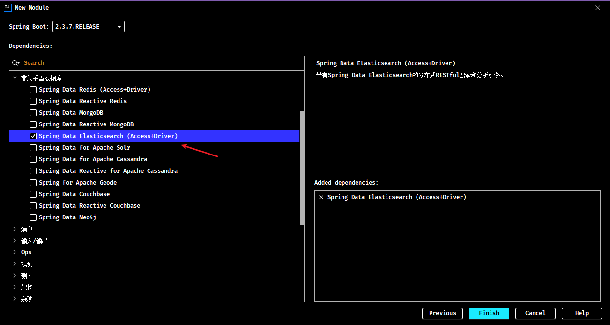

# Spring Boot 整合 Elasticsearch

## 1. Elasticsearch 简介

> Elasticsearch 介绍、安装及其使用的相关内容，详见[《ElasticSearch 分布式全文搜索引擎》笔记](/07-分布式架构&微服务架构/04-ElasticStack/02-ElasticSearch-分布式全文搜索引擎)

### 1.1. 概述

ES（Elasticsearch）是一个**分布式全文搜索引擎**。全文搜索的条件不再是仅用于对某一个字段进行比对，而是在一条数据中使用搜索条件去比对更多的字段，只要能匹配上就列入查询结果，这就是全文搜索的目的。

要实现全文搜索的效果，不可能使用数据库中 like 操作去进行比对，这种方式效率太低了。ES 设计了一种全新的思想，来实现全文搜索。具体操作过程如下：

1. 将被查询的字段的数据全部文本信息进行查分，分成若干个词
   - 例如“中华人民共和国”就会被拆分成三个词，分别是“中华”、“人民”、“共和国”，此过程有专业术语叫做分词。分词的策略不同，分出的效果不一样，不同的分词策略称为分词器。
2. 将分词得到的结果存储起来，对应每条数据的id
   - 例如id为1的数据中名称这一项的值是“中华人民共和国”，那么分词结束后，就会出现“中华”对应id为1，“人民”对应id为1，“共和国”对应id为1
   - 例如id为2的数据中名称这一项的值是“人民代表大会“，那么分词结束后，就会出现“人民”对应id为2，“代表”对应id为2，“大会”对应id为2
   - 此时就会出现如下对应结果，按照上述形式可以对所有文档进行分词。需要注意分词的过程不是仅对一个字段进行，而是对每一个参与查询的字段都执行，最终结果汇总到一个表格中
3. 当进行查询时，如果输入“人民”作为查询条件，可以通过上述表格数据进行比对，得到id值1,2，然后根据id值就可以得到查询的结果数据了。

上述过程中分词结果关键字内容每一个都不相同，作用有点类似于数据库中的索引，是用来加速数据查询的。但是数据库中的索引是对某一个字段进行添加索引，而这里的分词结果关键字不是一个完整的字段值，只是一个字段中的其中的一部分内容。并且索引使用时是根据索引内容查找整条数据，全文搜索中的分词结果关键字查询后得到的并不是整条的数据，而是数据的id，要想获得具体数据还要再次查询，因此这里为这种分词结果关键字起了一个全新的名称，叫做<font color=red>**倒排索引**</font>。

### 1.2. 安装

windows 版安装包下载地址：https://www.elastic.co/cn/downloads/elasticsearch

下载的安装包是解压缩就能使用的 zip 文件，解压缩到没有中文与空格目录即可

### 1.3. 启动服务器

进入 ElasticSearch 安装位置的 bin 目录中，双击 elasticsearch.bat 文件即可启动 ES 服务器，默认服务端口 `9200`。

通过浏览器访问 http://localhost:9200 看到相应的 json 数据，即 ES 服务器正常启动

### 1.4. 基本操作

ES 中保存有需要查询的数据，只不过格式和数据库存储数据格式不同而已。在 ES 中要先创建**倒排索引**，这个索引的功能又点类似于数据库的表，然后将数据添加到倒排索引中，添加的数据称为**文档**。所以要进行 ES 的操作要先创建索引，再添加文档，这样才能进行后续的查询操作。

要操作 ES 可以通过 Restful 风格的请求来进行，也就是说发送一个请求就可以执行一个操作。比如新建索引，删除索引这些操作都可以使用发送请求的形式来进行。

#### 1.4.1. 创建索引

> 注：下面所有其他示例，books 是索引名称，使用 Postman 等请求工具发送

创建索引发送 PUT 类型请求

```bash
PUT http://localhost:9200/books
```

发送请求后，看到如下信息即索引创建成功

```json
{
    "acknowledged": true,
    "shards_acknowledged": true,
    "index": "books"
}
```

重复创建已经存在的索引会出现错误信息，`reason` 属性中描述错误原因

```json
{
    "error": {
        "root_cause": [
            {
                "type": "resource_already_exists_exception",
                "reason": "index [books/VgC_XMVAQmedaiBNSgO2-w] already exists",
                "index_uuid": "VgC_XMVAQmedaiBNSgO2-w",
                "index": "books"
            }
        ],
        "type": "resource_already_exists_exception",
        "reason": "index [books/VgC_XMVAQmedaiBNSgO2-w] already exists",	# books索引已经存在
        "index_uuid": "VgC_XMVAQmedaiBNSgO2-w",
        "index": "book"
    },
    "status": 400
}
```

#### 1.4.2. 查询索引

创建索引发送 GET 类型请求

```bash
GET http://localhost:9200/books
```

查询索引得到索引相关信息，如下

```json
{
    "book": {
        "aliases": {},
        "mappings": {},
        "settings": {
            "index": {
                "routing": {
                    "allocation": {
                        "include": {
                            "_tier_preference": "data_content"
                        }
                    }
                },
                "number_of_shards": "1",
                "provided_name": "books",
                "creation_date": "1645768584849",
                "number_of_replicas": "1",
                "uuid": "VgC_XMVAQmedaiBNSgO2-w",
                "version": {
                    "created": "7160299"
                }
            }
        }
    }
}
```

如果查询了不存在的索引，会返回错误信息，例如查询名称为 book 的索引后信息如下

```json
{
    "error": {
        "root_cause": [
            {
                "type": "index_not_found_exception",
                "reason": "no such index [book]",
                "resource.type": "index_or_alias",
                "resource.id": "book",
                "index_uuid": "_na_",
                "index": "book"
            }
        ],
        "type": "index_not_found_exception",
        "reason": "no such index [book]",		# 没有book索引
        "resource.type": "index_or_alias",
        "resource.id": "book",
        "index_uuid": "_na_",
        "index": "book"
    },
    "status": 404
}
```

#### 1.4.3. 删除索引

删除索引发送 DELETE 类型请求

```bash
DELETE http://localhost:9200/books
```

删除所有后，给出删除结果

```json
{
    "acknowledged": true
}
```

如果重复删除，会给出错误信息，同样在 `reason` 属性中描述具体的错误原因

```json
{
    "error": {
        "root_cause": [
            {
                "type": "index_not_found_exception",
                "reason": "no such index [books]",
                "resource.type": "index_or_alias",
                "resource.id": "book",
                "index_uuid": "_na_",
                "index": "book"
            }
        ],
        "type": "index_not_found_exception",
        "reason": "no such index [books]",		# 没有books索引
        "resource.type": "index_or_alias",
        "resource.id": "book",
        "index_uuid": "_na_",
        "index": "book"
    },
    "status": 404
}
```

#### 1.4.4. 创建索引并指定分词器

前面创建的索引是未指定分词器的，可以在创建索引时添加请求参数，设置分词器。目前国内较为流行的分词器是 IK 分词器，使用前先在下对应的分词器，然后使用。

IK 分词器下载地址：https://github.com/medcl/elasticsearch-analysis-ik/releases

分词器下载后解压到 ES 安装目录的 plugins 目录中即可，安装分词器后需要重新启动 ES 服务器。使用 IK 分词器创建索引格式：

```bash
PUT http://localhost:9200/books
```

请求参数如下（注意是json格式的参数）

```json
{
    "mappings": {                           # 定义mappings属性，替换创建索引时对应的mappings属性		
        "properties": {                     # 定义索引中包含的属性设置
            "id": {                         # 设置索引中包含id属性
                "type": "keyword"           # 当前属性可以被直接搜索
            },
            "name": {                       # 设置索引中包含name属性
                "type": "text",             # 当前属性是文本信息，参与分词
                "analyzer": "ik_max_word",  # 使用IK分词器进行分词
                "copy_to": "all"            # 分词结果拷贝到all属性中
            },
            "type": {
                "type": "keyword"
            },
            "description": {
                "type": "text",
                "analyzer": "ik_max_word",
                "copy_to": "all"
            },
            "all": {                        # 定义属性，用来描述多个字段的分词结果集合，当前属性可以参与查询
                "type": "text",
                "analyzer": "ik_max_word"
            }
        }
    }
}
```

​创建完毕后返回结果和不使用分词器创建索引的结果是一样的，此时可以通过查看索引信息观察到添加的请求参数 mappings 已经进入到了索引属性中

```json
{
    "books": {
        "aliases": {},
        "mappings": {
            "properties": {
                "all": {
                    "type": "text",
                    "analyzer": "ik_max_word"
                },
                "description": {
                    "type": "text",
                    "copy_to": [
                        "all"
                    ],
                    "analyzer": "ik_max_word"
                },
                "id": {
                    "type": "keyword"
                },
                "name": {
                    "type": "text",
                    "copy_to": [
                        "all"
                    ],
                    "analyzer": "ik_max_word"
                },
                "type": {
                    "type": "keyword"
                }
            }
        },
        "settings": {
            "index": {
                "routing": {
                    "allocation": {
                        "include": {
                            "_tier_preference": "data_content"
                        }
                    }
                },
                "number_of_shards": "1",
                "provided_name": "books",
                "creation_date": "1645769809521",
                "number_of_replicas": "1",
                "uuid": "DohYKvr_SZO4KRGmbZYmTQ",
                "version": {
                    "created": "7160299"
                }
            }
        }
    }
}
```

#### 1.4.5. 添加文档

目前我们已经有了索引了，但是索引中还没有数据，所以要先添加数据，ES中称数据为文档，下面进行文档操作。

- 添加文档，有三种方式

```json
POST请求	http://localhost:9200/books/_doc		#使用系统生成id
POST请求	http://localhost:9200/books/_create/1	#使用指定id
POST请求	http://localhost:9200/books/_doc/1		#使用指定id，不存在创建，存在更新（版本递增）

文档通过请求参数传递，数据格式json
{
      "name":"springboot",
      "type":"springboot",
      "description":"springboot"
}  
```

- 查询文档

```json
GET请求	http://localhost:9200/books/_doc/1		 #查询单个文档 		
GET请求	http://localhost:9200/books/_search		 #查询全部文档
```

- 条件查询

```json
GET请求	http://localhost:9200/books/_search?q=name:springboot	# q=查询属性名:查询属性值
```

- 删除文档

```json
DELETE请求	http://localhost:9200/books/_doc/1
```

- 修改文档（全量更新）

```json
PUT请求	http://localhost:9200/books/_doc/1

文档通过请求参数传递，数据格式json
{
      "name":"springboot",
      "type":"springboot",
      "description":"springboot"
}
```

- 修改文档（部分更新）

```json
POST请求	http://localhost:9200/books/_update/1

文档通过请求参数传递，数据格式json
{			
    "doc":{						#部分更新并不是对原始文档进行更新，而是对原始文档对象中的doc属性中的指定属性更新
      "name":"springboot"		#仅更新提供的属性值，未提供的属性值不参与更新操作
    }
}
```


## 2. 整合 Elasticsearch 示例

Spring Boot 整合 Elasticsearch 操作步骤如下：


### 2.1. 引入依赖

导入 Spring Boot 整合 Elasticsearch 的坐标

```xml

```

也可以直接使用 idea 的 Spring Initializr 创建 Spring Boot 项目，在创建模块的时候勾选相应的依赖，归属 NoSQL 分类中




