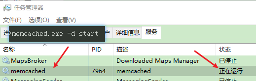

# Spring Boot 缓存

> 本笔记主要介绍 Spring Boot 使用缓存的各种解决方案。
>
> 代码示例：https://github.com/MooNkirA/spring-boot-note/tree/spring-boot-2.5.x-sample/spring-boot-2.5.x-sample/14-spring-boot-caching

## 1. 概述

### 1.1. 缓存简介

企业级应用主要作用是信息处理，当需要读取数据时，由于受限于数据库的访问效率，导致整体系统性能偏低。应用程序直接与数据库打交道，访问效率低。


为了改善上述现象，开发者通常会在应用程序与数据库之间建立一种临时的数据存储机制，该区域中的数据在内存中保存，读写速度较快，可以有效解决数据库访问效率低下的问题。这一块临时存储数据的区域就是**缓存**。使用缓存后，应用程序与缓存打交道，缓存与数据库打交道，数据访问效率提高


综上所述，缓存是一种介于数据永久存储介质与应用程序之间的数据临时存储介质，使用缓存可以有效的减少低速数据读取过程的次数（例如磁盘IO），提高系统性能。此外缓存不仅可以用于提高永久性存储介质的数据读取效率，还可以提供临时的数据存储空间。而 Spring Boot 提供了对市面上几乎所有的缓存技术提供了整合的方案

### 1.2. Spring Boot 所支持的缓存方案

> 支持的缓存技术参考官网文档：https://docs.spring.io/spring-boot/docs/2.5.13/reference/html/features.html#features.caching.provider

Spring Boot 将缓存抽象成 `org.springframework.cache.Cache` 和 `org.springframework.cache.CacheManager` 接口，Spring Boot 会**按下面所示顺序**去尝试检测是否有相应的缓存实现

1. Generic
2. JCache (JSR-107) (EhCache 3, Hazelcast, Infinispan, and others)
3. EhCache 2.x
4. Hazelcast
5. Infinispan
6. Couchbase
7. Redis
8. Caffeine
9. Simple（默认值）

## 2. Spring Boot 内置缓存

Spring Boot 技术提供有内置的缓存解决方案，可以帮助开发者快速开启缓存技术，并使用缓存技术进行数据的快速操作，例如读取缓存数据和写入数据到缓存。

### 2.1. 基础示例工程准备

#### 2.1.1. 项目依赖

在项目的 pom.xml 文件引入相关依赖，为了方便，使用 h2 数据库的内存模式

```xml
<dependencies>
    <dependency>
        <groupId>org.springframework.boot</groupId>
        <artifactId>spring-boot-starter-web</artifactId>
    </dependency>

    <dependency>
        <groupId>org.springframework.boot</groupId>
        <artifactId>spring-boot-starter-test</artifactId>
        <scope>test</scope>
    </dependency>

    <dependency>
        <groupId>com.baomidou</groupId>
        <artifactId>mybatis-plus-boot-starter</artifactId>
        <version>3.4.3</version>
    </dependency>

    <dependency>
        <groupId>com.h2database</groupId>
        <artifactId>h2</artifactId>
    </dependency>

    <dependency>
        <groupId>org.projectlombok</groupId>
        <artifactId>lombok</artifactId>
    </dependency>
</dependencies>
```

#### 2.1.2. 项目配置与数据库脚本

- 创建项目项目文件 application.yml

```yml
server:
  port: 80
spring:
  h2:
    console:
      enabled: true # 开启 H2 数据库控制台访问程序
      path: /h2
  datasource:
    url: jdbc:h2:mem:h2_test;MODE=MySQL;DATABASE_TO_LOWER=TRUE
    driver-class-name: org.h2.Driver
    username: root
    password: 123456
    schema: classpath:db/schema-h2.sql # H2 初始化表结构
    data: classpath:db/data-h2.sql # H2 初始化数据
mybatis-plus: # mybatis-plus 配置
  global-config:
    db-config:
      id-type: auto
  configuration:
    log-impl: org.apache.ibatis.logging.stdout.StdOutImpl
```

- 创建数据库初始化表结构与数据脚本

```sql
-- schema-h2.sql
DROP TABLE IF EXISTS `book`;

CREATE TABLE `book`(
    `id`          BIGINT (20),
    `name`        VARCHAR(30),
    `type`        VARCHAR(10),
    `description` VARCHAR(200),
    PRIMARY KEY (`id`)
);

-- data-h2.sql
DELETE FROM `book`;

INSERT INTO `book`(`id`, `name`, `type`, `description`)
VALUES (1, 'SpringBoot入门', '计算机科学', '这是一本好书'),
       (2, 'Spring基础', '计算机科学', '人人都在看'),
       (3, '金田一少年之事件薄', '漫画', '最好的推理漫画');
```

#### 2.1.3. 基础业务代码

- 表映射实体类

```java
@Data
public class Book {
    private Integer id;
    private String type;
    private String name;
    private String description;
}
```

- 持久层接口

```java
@Mapper
public interface BookMapper extends BaseMapper<Book> {
}
```

- 业务层

```java
public interface BookService {
    Book getById(Integer id);
}

// 实现类
@Service
public class BookServiceImpl implements BookService {

    @Autowired
    private BookMapper bookMapper;

    @Override
    public Book getById(Integer id) {
        return bookMapper.selectById(id);
    }
}
```

- 请求控制层

```java
@RestController
@RequestMapping("/books")
public class BookController {

    @Autowired
    private BookService bookService;

    @GetMapping("{id}")
    public Book get(@PathVariable Integer id) {
        return bookService.getById(id);
    }
}
```

- 启动类

### 2.2. 实现缓存数据库数据

#### 2.2.1. 引入缓存技术依赖

在 pom.xml 文件中引入 Spring Boot 提供的缓存技术相应的依赖 spring-boot-starter-cache

```xml
<dependency>
    <groupId>org.springframework.boot</groupId>
    <artifactId>spring-boot-starter-cache</artifactId>
</dependency>
```

#### 2.2.2. 启用缓存

在引导类（或者配置类）上标注注解 `@EnableCaching`，配置 Spring Boot 程序启用缓存

```java
@SpringBootApplication
@EnableCaching // 开启缓存功能
public class EmbeddedCachingApplication {
    public static void main(String[] args) {
        SpringApplication.run((EmbeddedCachingApplication.class), args);
    }
}
```

#### 2.2.3. 业务方法使用缓存

在需要使用缓存的业务方法上，标识 `@Cacheable` 注解，声明当前方法的返回值放入缓存中，其中 `value` 属性指定缓存的存储位置；`key` 属性指定当前方法返回值保存在缓存中对应的名称（键名）。

```java
/*
 * @Cacheable 用于标识当前方法，将返回保存到缓存中
 *  value 属性：缓存存储的位置（存储空间名称）
 *  key 属性：方法返回结果保存的缓存名称。
 */
@Cacheable(value = "dbDataCache", key = "#id")
@Override
public Book getById(Integer id) {
    return bookMapper.selectById(id);
}
```

注：上例中 `value` 属性描述缓存的存储位置，可以理解为是一个存储空间名，`key` 属性描述了缓存中保存数据的名称，字符串 `#id` 代表读取形参中的 `id` 值作为缓存名称。

#### 2.2.4. 功能测试

运行测试。方法使用 `@Cacheable` 注解后，在被执行时，会有以下两种情况：

- 如果发现对应名称在缓存中没有数据，就正常读取数据，然后自动放入缓存
- 如果对应名称在缓存中有数据，就终止当前业务方法执行，直接返回缓存中的数据。

### 2.3. 实现缓存临时数据

缓存技术除将保存数据库的数据，还可以将一些临时数据缓存，以下示例是模拟使用缓存保存手机验证码的过程。

#### 2.3.1. 案例需求

- 输入手机号获取验证码，以短信形式发送给用户（后台模拟）
- 输入手机号和验证码验证结果

> 示例没有前端页面，使用 postman 等工具模拟请求

#### 2.3.2. 基础项目工程准备

复用上个章节的示例工程代码，使用 Spring Boot 提供的内置缓存技术实现案例需求

#### 2.3.3. 业务实现

要实现以上案例需求，创建两个表现层接口，一个用于模拟发送短信的过程，其实就是根据用户提供的手机号生成一个验证码，然后放入缓存；另一个用于模拟验证码校验的过程，其实就是使用传入的手机号和验证码进行匹配，并返回最终匹配结果。

- 创建定义短信验证码实体类，封装手机号与验证码两个属性

```java
@Data
public class SMSCode {
    private String tel;
    private String code;
}
```

- 创建业务层接口与实现，分别定义获取验证码与校验验证码方法

```java
public interface SMSCodeService {
    /**
     * 获取短信验证码
     */
    String sendSMSCode(String tel);

    /**
     * 校验短信验证码
     */
    boolean checkCode(SMSCode smsCode);
}
```

获取验证码后，当验证码失效时必须重新获取验证码，因此在获取验证码的功能上不能使用 `@Cacheable` 注解，因为 `@Cacheable` 注解是缓存中没有值则放入值，缓存中有值则取值。但获取验证码功能仅仅是生成验证码并放入缓存，再次调用时就不能从缓存中取值后返回，因此不能使用 `@Cacheable` 注解

根据上述分析，生成验证码文件需要使用 `@CachePut` 注解，该注解标识的方法仅具有向缓存中保存数据的功能，返回时并不会从缓存取值。`@CachePut` 注解的属性值作用与 `@Cacheable` 注解属性一样

```java
@Service
public class SMSCodeServiceImpl implements SMSCodeService {

    @Autowired
    private CodeUtil codeUtil;

    // @CachePut 注解标识的方法仅具有向缓存中保存数据的功能，返回时并不会从缓存取值
    @CachePut(value = "smsCodeCache", key = "#tel")
    @Override
    public String sendSMSCode(String tel) {
        // 生成验证码并返回，注：只会保存到缓存中，再次调用时并不会从缓存中读取
        return codeUtil.generateGode(tel);
    }

    @Override
    public boolean checkCode(SMSCode smsCode) {
        // 取出缓存中的验证码与接收的验证码比对，如果相同，返回true
        String code = smsCode.getCode();
        String codeCache = codeUtil.getCodeCache(smsCode.getTel());
        return code.equals(codeCache);
    }
}
```

- 生成验证码的方法只能往缓存中保存数据，所以需要再定义一个方法，用于读取缓存中的数据。因此创建一个工具类，定义读取缓存中验证码方法，该方法上标识 `@Cacheable` 注解，指定缓存空间名称与缓存数据的名称，方法返回 `null` 即可

```java
@Component
public class CodeUtil {

    private final String[] patch = {"000000", "00000", "0000", "000", "00", "0", ""};

    /** 简单的实现生成验证码 */
    public String generateGode(String tel) {
        int hash = tel.hashCode();
        int encryption = 20206666;
        long result = hash ^ encryption;
        long nowTime = System.currentTimeMillis();
        result = result ^ nowTime;
        long code = result % 1000000;
        code = code < 0 ? -code : code;
        String codeStr = code + "";
        int len = codeStr.length();
        return patch[len] + codeStr;
    }

    // 此方法只需要从缓存取值，所以在方法上标识 @Cacheable 注解，方法的返回值为 null 即可
    @Cacheable(value = "smsCodeCache", key = "#tel")
    public String getCodeCache(String tel) {
        return null;
    }
}
```

> <font color=red>**值得注意：为什么不将获取缓存的方法也定义在业务接口（`SMSCodeService`）中？因为 Spring Boot 对方法实现缓存功能是通过代理对象去调用方法来实现，如果在本类中定义读取缓存的方法，调用是通过 `this` 本身实例去调用方法，而不是通过代理去调用，只会调用原生的方法。所以需要将读取缓存的方法定义到其他类中，并且将其加入到 Spring 容器进行管理**</font>

- 创建请求 web 层接口，定义两个方法，一个方法用于提供手机号获取验证码，另一个方法用于提供手机号和验证码进行校验

```java
@RestController
@RequestMapping("/sms")
public class SMSCodeController {

    @Autowired
    private SMSCodeService smsCodeService;

    /* 获取验证码 */
    @GetMapping
    public String getCode(String tel){
        return smsCodeService.sendSMSCode(tel);
    }

    /* 校验验证码 */
    @PostMapping
    public boolean checkCode(@RequestBody SMSCode smsCode){
        return smsCodeService.checkCode(smsCode);
    }
}
```

#### 2.3.4. 功能测试

- 获取短信验证码。发送 GET 请求 http://localhost/sms?tel=13865845254
- 根据上一步返回值，发送 POST 请求校验接口，上送手机号与验证码

```json
POST http://localhost/sms

{
    "tel": "13865845254",
    "code": "199786"
}
```

## 3. Spring Boot 整合 Ehcache 缓存

Ehcache 是一种缓存技术，使用 Spring Boot 整合 Ehcache 本质就是变更一下缓存技术的实现方式

### 3.1. 基础示例工程准备

> 直接使用上面内置缓存的示例工程代码（只保留手机验证码功能，移除相关依赖）

### 3.2. 实现缓存功能

#### 3.2.1. 引入 Ehcache 依赖

在项目的 pom.xml 文件中引入 Ehcache 的依赖坐标，不需要指定版本，Spring Boot 父工程已经有依赖管理

```xml
<dependency>
    <groupId>net.sf.ehcache</groupId>
    <artifactId>ehcache</artifactId>
</dependency>
```

> 这里引入的依赖不是以 starter-xxx 的格式，而是直接引入相应的技术坐标。原因是 Spring Boot 整合缓存技术做的是通用格式，不管是整合哪种第三方的缓存技术，只是改变了其具体的实现，原来的使用方式不变。这体现了 Spring Boot 统一同类技术整合方式的优点

#### 3.2.2. Ehcache 配置

在项目的 application.yml 文件中，通过 `spring.cache.type` 配置缓存技术实现类型为 `ehcache`。值得注意的是，当前 Spring Boot 可以整合的缓存技术中包含有 `ehcach`，所以才能这样配置。此 `type` 属性不可以随便写一个名称就可以整合相关缓存技术，需要当前 Spring Boot 支持。

```yml
spring:
  cache:
    type: ehcache # 指定缓存实现的类型
    ehcache:
      config: ehcache.xml # 配置 Ehcache 缓存技术专用的配置文件
```

由于 ehcache 的使用时，有其独立的配置文件格式，因此需要通过 `spring.cache.ehcache.config` 属性指定 ehcache 的配置文件，以便于读取相应配置。ehcache.xml 文件内容如下：

```xml
<?xml version="1.0" encoding="UTF-8"?>
<ehcache xmlns:xsi="http://www.w3.org/2001/XMLSchema-instance"
         xsi:noNamespaceSchemaLocation="http://ehcache.org/ehcache.xsd"
         updateCheck="false">
    <diskStore path="E:\logs\ehcache"/>

    <!--
       默认缓存策略
         external：是否永久存在，设置为true则不会被清除，此时与timeout冲突，通常设置为false
         diskPersistent：是否启用磁盘持久化
         maxElementsInMemory：最大缓存数量
         overflowToDisk：超过最大缓存数量是否持久化到磁盘
         timeToIdleSeconds：最大不活动间隔，设置过长缓存容易溢出，设置过短无效果，可用于记录时效性数据，例如验证码
         timeToLiveSeconds：最大存活时间
         memoryStoreEvictionPolicy：缓存清除策略
     -->
    <defaultCache eternal="false"
                  diskPersistent="false"
                  maxElementsInMemory="1000"
                  overflowToDisk="false"
                  timeToIdleSeconds="60"
                  timeToLiveSeconds="60"
                  memoryStoreEvictionPolicy="LRU"/>

    <!-- 注意：cache 标签配置缓存 name 属性与代码是加入缓存空间名称要保持一致 -->
    <cache name="smsCodeCache"
           eternal="false"
           diskPersistent="false"
           maxElementsInMemory="1000"
           overflowToDisk="false"
           timeToIdleSeconds="10"
           timeToLiveSeconds="10"
           memoryStoreEvictionPolicy="LRU"/>

</ehcache>
```

值得注意 `<cache>` 标签的 `name` 属性要与案例中数据保存的位置名称（`smsCodeCache`）一致。这个设定需要保障 ehcache 中有一个缓存空间名称叫做 `smsCodeCache` 的配置，并且前后要统一。在企业开发过程中，通过设置不同名称的 `<cache>` 标识来设定不同的缓存策略，应用于不同的缓存数据。

#### 3.2.3. 功能测试

经过以上步骤，Spring Boot 整合 Ehcache 已完成。原始代码并没有任何修改，仅仅是加了一组配置就可以变更缓存供应商了，这也是 Spring Boot 提供了统一的缓存操作接口的优势，变更缓存实现并不影响原始编写的代码

参考内置缓存案例的步骤进行测试即可

## 4. Spring Boot 整合 Redis 缓存

Spring Boot 整合 Redis 实现缓存步骤与上面整合 Ehcache 缓存技术一样，引入相关依赖后，修改缓存类型为 redis，在项目配置文件中设置 redis 相关信息

### 4.1. 基础示例工程准备

> 直接使用上面内置缓存的示例工程代码（只保留手机验证码功能，移除相关依赖）

### 4.2. 实现缓存功能

#### 4.2.1. 引入 redis 依赖

在项目的 pom.xml 文件中引入 spring-boot-starter-data-redis 的依赖坐标，不需要指定版本，Spring Boot 父工程已经有依赖管理

```xml
<dependency>
    <groupId>org.springframework.boot</groupId>
    <artifactId>spring-boot-starter-data-redis</artifactId>
</dependency>
```

#### 4.2.2. redis 配置

在项目的 application.yml 文件中，通过 `spring.cache.type` 配置缓存技术实现类型为 `redis`，另外还需要配置 redis 服务的连接信息。

```yml
spring:
  cache:
    type: redis # 指定缓存实现的类型
    redis:
      use-key-prefix: true # 配置是否给保存缓存的键增加前缀
      key-prefix: sms_ # 配置键前缀
      cache-null-values: true # 配置缓存值是否可以为 null
      time-to-live: 300s # 缓存键过期的时间
  redis: # redis 服务连接信息
    host: localhost
    port: 6379
```

> 注意：如果需要对 redis 作为缓存进行配置，注意不是对原始的 redis 节点进行配置，而是在 `spring.cache.redis` 节点下设置缓存相关配置，注意不要写错位置

#### 4.2.3. 功能测试

经过以上步骤，Spring Boot 整合 Redis 作为缓存已完成，变更缓存实现并不影响原始编写的代码。参考内置缓存案例的步骤进行测试即可

## 5. Spring Boot 整合 Memcached 缓存技术

### 5.1. Memcached 缓存服务概述

Memcached 是一个自由开源的，高性能，分布式内存对象缓存系统。基于内存的 key-value 存储，用来存储小块的任意数据（字符串、对象）。这些数据可以是数据库调用、API 调用或者是页面渲染的结果。

Memcached 简洁而强大。它的简洁设计便于快速开发，减轻开发难度，解决了大数据量缓存的很多问题。它的 API 兼容大部分流行的开发语言。

本质上，它是一个简洁的key-value存储系统。一般的使用其目的是，通过缓存数据库查询结果，减少数据库访问次数，以提高动态 Web 应用的速度、提高可扩展性。

Memcached 官网：https://www.memcached.org/

### 5.2. Memcached 缓存服务安装（windows 版）

官网上并未提供 Memcached 的 Windows 平台安装包。windows 版安装包下载地址：https://www.runoob.com/memcached/window-install-memcached.html

> 注：在 1.4.5 版本以前 memcached 可以作为一个服务安装，而在 1.4.5 及之后的版本删除了该功能。

- 下载的安装包是解压缩就能使用的zip文件，解压到指定目录即可。解压后的目录中可执行文件只有一个 memcached.exe。使用该文件可以将 memcached 作为系统服务启动
- 在 1.4.5 版本以前 memcached 可以作为一个服务安装，使用<font color=red>管理员权限运行 CMD 命令行窗口</font>，执行以下命令：

```bash
memcached目录路径\memcached.exe -d install
```

> 注：使用实际的路径替代 `memcached目录路径\`

- 服务安装完毕后，可以使用以下命令启动和停止 memcached 服务

```bash
memcached目录路径\memcached.exe -d start # 启动服务
memcached目录路径\memcached.exe -d stop  # 停止服务
```



或者在运行中输入 `services.msc` 命令打开【服务】窗口，直接手动启动或者停止服务

- 如果要修改 memcached 的配置项，可以运行中执行 `regedit` 命令，打开注册表并找到 "HKEY_LOCAL_MACHINE\SYSTEM\CurrentControlSet\Services\memcached" 来进行修改。如：要提供 memcached 使用的缓存配置可以修改 `ImagePath` 为：

```bash
"memcached目录路径\memcached.exe" -d runservice -m 512
```

> 注：-m 512 意思是设置 memcached 最大的缓存配置为512M。还可以通过使用 `memcached目录路径\memcached.exe -h` 命令查看更多的参数配置。

- 如需要卸载 memcached ，可以打开管理员权限的命令行，执行以下命令：

```bash
memcached目录路径\memcached.exe -d uninstall
```

### 整合 Memcached 缓存技术


