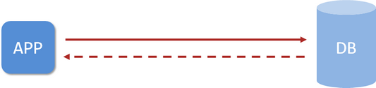
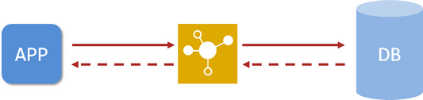

# Spring Boot 缓存

> 本笔记主要介绍 Spring Boot 使用缓存的各种解决方案。
>
> 代码示例：https://github.com/MooNkirA/spring-boot-note/tree/spring-boot-2.5.x-sample/spring-boot-2.5.x-sample/14-spring-boot-caching

## 1. 概述

### 1.1. 缓存简介

企业级应用主要作用是信息处理，当需要读取数据时，由于受限于数据库的访问效率，导致整体系统性能偏低。应用程序直接与数据库打交道，访问效率低。



为了改善上述现象，开发者通常会在应用程序与数据库之间建立一种临时的数据存储机制，该区域中的数据在内存中保存，读写速度较快，可以有效解决数据库访问效率低下的问题。这一块临时存储数据的区域就是**缓存**。使用缓存后，应用程序与缓存打交道，缓存与数据库打交道，数据访问效率提高



综上所述，缓存是一种介于数据永久存储介质与应用程序之间的数据临时存储介质，使用缓存可以有效的减少低速数据读取过程的次数（例如磁盘IO），提高系统性能。此外缓存不仅可以用于提高永久性存储介质的数据读取效率，还可以提供临时的数据存储空间。而 Spring Boot 提供了对市面上几乎所有的缓存技术提供了整合的方案

### 1.2. Spring Boot 所支持的缓存方案

> 支持的缓存技术参考官网文档：https://docs.spring.io/spring-boot/docs/2.5.13/reference/html/features.html#features.caching.provider

Spring Boot 将缓存抽象成 `org.springframework.cache.Cache` 和 `org.springframework.cache.CacheManager` 接口，Spring Boot 会**按下面所示顺序**去尝试检测是否有相应的缓存实现

1. Generic
2. JCache (JSR-107) (EhCache 3, Hazelcast, Infinispan, and others)
3. EhCache 2.x
4. Hazelcast
5. Infinispan
6. Couchbase
7. Redis
8. Caffeine
9. Simple（默认值）


## 2. Spring Boot 内置缓存

Spring Boot 技术提供有内置的缓存解决方案，可以帮助开发者快速开启缓存技术，并使用缓存技术进行数据的快速操作，例如读取缓存数据和写入数据到缓存。

### 2.1. 基础示例工程准备

#### 2.1.1. 项目依赖

在项目的 pom.xml 文件引入相关依赖，为了方便，使用 h2 数据库的内存模式

```xml
<dependencies>
    <dependency>
        <groupId>org.springframework.boot</groupId>
        <artifactId>spring-boot-starter-web</artifactId>
    </dependency>

    <dependency>
        <groupId>org.springframework.boot</groupId>
        <artifactId>spring-boot-starter-test</artifactId>
        <scope>test</scope>
    </dependency>

    <dependency>
        <groupId>com.baomidou</groupId>
        <artifactId>mybatis-plus-boot-starter</artifactId>
        <version>3.4.3</version>
    </dependency>

    <dependency>
        <groupId>com.h2database</groupId>
        <artifactId>h2</artifactId>
    </dependency>

    <dependency>
        <groupId>org.projectlombok</groupId>
        <artifactId>lombok</artifactId>
    </dependency>
</dependencies>
```

#### 2.1.2. 项目配置与数据库脚本

- 创建项目项目文件 application.yml

```yml
server:
  port: 80
spring:
  h2:
    console:
      enabled: true # 开启 H2 数据库控制台访问程序
      path: /h2
  datasource:
    url: jdbc:h2:mem:h2_test;MODE=MySQL;DATABASE_TO_LOWER=TRUE
    driver-class-name: org.h2.Driver
    username: root
    password: 123456
    schema: classpath:db/schema-h2.sql # H2 初始化表结构
    data: classpath:db/data-h2.sql # H2 初始化数据
mybatis-plus: # mybatis-plus 配置
  global-config:
    db-config:
      id-type: auto
  configuration:
    log-impl: org.apache.ibatis.logging.stdout.StdOutImpl
```

- 创建数据库初始化表结构与数据脚本

```sql
-- schema-h2.sql
DROP TABLE IF EXISTS `book`;

CREATE TABLE `book`(
    `id`          BIGINT (20),
    `name`        VARCHAR(30),
    `type`        VARCHAR(10),
    `description` VARCHAR(200),
    PRIMARY KEY (`id`)
);

-- data-h2.sql
DELETE FROM `book`;

INSERT INTO `book`(`id`, `name`, `type`, `description`)
VALUES (1, 'SpringBoot入门', '计算机科学', '这是一本好书'),
       (2, 'Spring基础', '计算机科学', '人人都在看'),
       (3, '金田一少年之事件薄', '漫画', '最好的推理漫画');
```

#### 2.1.3. 基础业务代码

- 表映射实体类

```java
@Data
public class Book {
    private Integer id;
    private String type;
    private String name;
    private String description;
}
```

- 持久层接口

```java
@Mapper
public interface BookMapper extends BaseMapper<Book> {
}
```

- 业务层

```java
public interface BookService {
    Book getById(Integer id);
}

// 实现类
@Service
public class BookServiceImpl implements BookService {

    @Autowired
    private BookMapper bookMapper;

    @Override
    public Book getById(Integer id) {
        return bookMapper.selectById(id);
    }
}
```

- 请求控制层

```java
@RestController
@RequestMapping("/books")
public class BookController {

    @Autowired
    private BookService bookService;

    @GetMapping("{id}")
    public Book get(@PathVariable Integer id) {
        return bookService.getById(id);
    }
}
```

- 启动类

### 2.2. 数据库数据缓存实现

#### 2.2.1. 引入缓存技术依赖

在 pom.xml 文件中引入 Spring Boot 提供的缓存技术相应的依赖 spring-boot-starter-cache

```xml
<dependency>
    <groupId>org.springframework.boot</groupId>
    <artifactId>spring-boot-starter-cache</artifactId>
</dependency>
```

#### 2.2.2. 启用缓存

在引导类（或者配置类）上标注注解 `@EnableCaching`，配置 Spring Boot 程序启用缓存

```java
@SpringBootApplication
@EnableCaching // 开启缓存功能
public class EmbeddedCachingApplication {
    public static void main(String[] args) {
        SpringApplication.run((EmbeddedCachingApplication.class), args);
    }
}
```

#### 2.2.3. 业务方法使用缓存

在需要使用缓存的业务方法上，标识 `@Cacheable` 注解，声明当前方法的返回值放入缓存中，其中 `value` 属性指定缓存的存储位置；`key` 属性指定当前方法返回值保存在缓存中对应的名称（键名）。

```java
/*
 * @Cacheable 用于标识当前方法，将返回保存到缓存中
 *  value 属性：缓存存储的位置（存储空间名称）
 *  key 属性：方法返回结果保存的缓存名称。
 */
@Cacheable(value = "dbDataCache", key = "#id")
@Override
public Book getById(Integer id) {
    return bookMapper.selectById(id);
}
```

注：上例中 `value` 属性描述缓存的存储位置，可以理解为是一个存储空间名，`key` 属性描述了缓存中保存数据的名称，字符串 `#id` 代表读取形参中的 `id` 值作为缓存名称。

#### 2.2.4. 测试

运行测试。方法使用 `@Cacheable` 注解后，在被执行时，会有以下两种情况：

- 如果发现对应名称在缓存中没有数据，就正常读取数据，然后自动放入缓存
- 如果对应名称在缓存中有数据，就终止当前业务方法执行，直接返回缓存中的数据。


