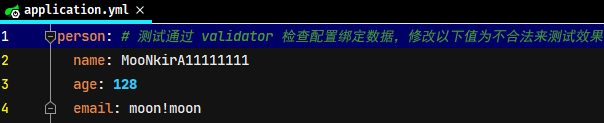
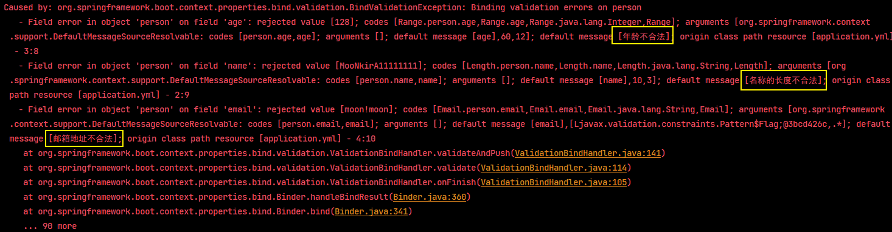

# Spring Boot 整合 javax.validation

## 1. javax.validation 校验框架简介

JSR303 是一套 JavaBean 参数校验的标准，它定义了很多常用的校验注解，可以直接将这些注解加在 JavaBean 的属性上面(面向注解编程的时代)，就可以在需要校验的时候进行校验了。但是这只是一个接口，没有具体实现。

Hibernate Validator 是一个 hibernate 独立的包，可以直接引用，它实现了 validation bean 同时有做了扩展，比较强大。在 Spring Boot 中已经包含在其依赖管理中，在其他项目中可以引用依赖不需要指定版本号，但也可以自行调整版本

```xml
<!--jsr 303-->
<dependency>
    <groupId>javax.validation</groupId>
    <artifactId>validation-api</artifactId>
    <version>xx.xx.xx</version>
</dependency>
<!-- hibernate validator-->
<dependency>
    <groupId>org.hibernate</groupId>
    <artifactId>hibernate-validator</artifactId>
    <version>xx.xx.xx</version>
</dependency>
```

> 注：以上两个依赖已经包含在 Spring Boot 的依赖管理中，

## 2. javax.validation相关注解

### 2.1. 空检查

|     注解     |                                                        作用描述                                                        |
| ----------- | ---------------------------------------------------------------------------------------------------------------------- |
| `@Null`     | 验证对象是否为null                                                                                                     |
| `@NotNull`  | 验证对象是否不为null，可以为empty，即无法查检长度为0的字符串（如：`""`,`" "`,`" "`）                                      |
| `@NotBlank` | 检查约束字符串是不是Null，并且调用trim()方法后的长度是否大于0，且会去掉前后空格，即：必须有实际字符（*只能作用在String上*） |
| `@NotEmpty` | 检查约束元素是否为NULL或者是EMPTY长度必须大于0 (如：`" "`)                                                               |

### 2.2. Booelan检查

|      注解       |           作用描述            |
| -------------- | ----------------------------- |
| `@AssertTrue`  | 验证 Boolean 对象是否为 true  |
| `@AssertFalse` | 验证 Boolean 对象是否为 false |

### 2.3. 长度检查

|          注解          |                                   作用描述                                    |
| --------------------- | ---------------------------------------------------------------------------- |
| `@Size(min=, max=)`   | 验证对象（Array,Collection,Map,String）长度是否在给定的范围之内                |
| `@Length(min=, max=)` | 验证字符串的长度是否在给定的范围之内，包含两端（*Hibernate validator扩展注解*） |

### 2.4. 日期检查

|    注解     |                  作用描述                   |
| ---------- | ------------------------------------------- |
| `@Past`    | 验证 Date 和 Calendar 对象是否在当前时间之前 |
| `@Future`  | 验证 Date 和 Calendar 对象是否在当前时间之后 |
| `@Pattern` | 验证 String 对象是否符合正则表达式的规则      |

### 2.5. 数值检查

**建议使用在Stirng,Integer类型，不建议使用在int类型上，因为表单值为`""`时无法转换为int，但可以转换为Stirng为`""`，Integer为null**

|              注解              |                                                    作用描述                                                     |
| ----------------------------- | --------------------------------------------------------------------------------------------------------------- |
| `@Min`                        | 验证 `Number` 和 `String` 对象是否大等于指定的值                                                                 |
| `@Max`                        | 验证 `Number` 和 `String` 对象是否小等于指定的值                                                                 |
| `@DecimalMax`                 | 被标注的值必须不大于约束中指定的最大值。这个约束的参数是一个通过 `BigDecimal` 定义的最大值的字符串表示，小数存在精度 |
| `@DecimalMin`                 | 被标注的值必须不小于约束中指定的最小值。这个约束的参数是一个通过 `BigDecimal` 定义的最小值的字符串表示，小数存在精度 |
| `@Digits`                     | 验证 `Number` 和 `String` 的构成是否合法                                                                         |
| `@Digits(integer=,fraction=)` | 验证字符串是否是符合指定格式的数字，interger指定整数精度，fraction指定小数精度                                     |
| `@Range(min=, max=)`          | 检查注释值是否位于（含）指定的最小值和最大值之间（*Hibernate validator扩展注解*）                                  |

```java
@Range(min=10000, max=50000, message="range.bean.wage")
private BigDecimal wage;
```

### 2.6. 其他类型检查

|                      注解                       |                                                                  作用描述                                                                  |
| ---------------------------------------------- | ----------------------------------------------------------------------------------------------------------------------------------------- |
| `@Valid`                                       | 递归的对关联对象进行校验，如果关联对象是个集合或者数组，那么对其中的元素进行递归校验，如果是一个map，则对其中的值部分进行校验。(是否进行递归验证) |
| `@CreditCardNumber`                            | 信用卡验证                                                                                                                                 |
| `@Email`                                       | 验证是否是邮件地址，如果为null，不进行验证，算通过验证。（*Hibernate validator扩展注解*）                                                     |
| `@ScriptAssert(lang= ,script=, alias=)`        |                                                                                                                                           |
| `@URL(protocol=,host=, port=,regexp=, flags=)` |                                                                                                                                           |

## 3. javax.validation 基础使用

示例使用 SpringBoot 的快速框架实现

### 3.1. `@Validated` 校验请求实体类相关属性参数

1. 在控制层类相关的方法中，使用 `@Validated` 声明要检查的方法入参（参数为自定义VO，DTO类）

```java
/**
 * 走参数校验注解
 *
 * @param userDTO
 * @return
 */
@PostMapping("/save/valid")
public RspDTO save(@RequestBody @Validated UserDTO userDTO) {
    userService.save(userDTO);
    return RspDTO.success();
}
```

2. 对参数的字段进行注解标注

```java
import lombok.Data;
import org.hibernate.validator.constraints.Length;

import javax.validation.constraints.*;
import java.io.Serializable;
import java.util.Date;

/**
 * @author LiJing
 * @ClassName: UserDTO
 * @Description: 用户传输对象
 * @date 2019/7/30 13:55
 */
@Data
public class UserDTO implements Serializable {

    private static final long serialVersionUID = 1L;

    /**
     * 用户ID
     */
    @NotNull(message = "用户id不能为空")
    private Long userId;

    /**
     * 用户名
     */
    @NotBlank(message = "用户名不能为空")
    @Length(max = 20, message = "用户名不能超过20个字符")
    @Pattern(regexp = "^[\\u4E00-\\u9FA5A-Za-z0-9\\*]*$", message = "用户昵称限制：最多20字符，包含文字、字母和数字")
    private String username;

    /**
     * 手机号
     */
    @NotBlank(message = "手机号不能为空")
    @Pattern(regexp = "^[1][3,4,5,6,7,8,9][0-9]{9}$", message = "手机号格式有误")
    private String mobile;

    /**
     * 性别
     */
    private String sex;

    /**
     * 邮箱
     */
    @NotBlank(message = "联系邮箱不能为空")
    @Email(message = "邮箱格式不对")
    private String email;

    /**
     * 密码
     */
    private String password;

    /**
     * 创建时间
     */
    @Future(message = "时间必须是将来时间")
    private Date createTime;

}
```

3. 在全局校验中增加校验异常

```java
import com.moon.system.common.model.response.CommonCode;
import com.moon.system.common.model.response.ResultCode;
import com.moon.system.common.model.response.ResultResponse;
import org.slf4j.Logger;
import org.slf4j.LoggerFactory;
import org.springframework.web.bind.MethodArgumentNotValidException;
import org.springframework.web.bind.annotation.ExceptionHandler;
import org.springframework.web.bind.annotation.RestControllerAdvice;

import javax.validation.ValidationException;

/**
 * 统一异常处理捕获类
 */
@RestControllerAdvice
public class GlobalExceptionHandler {

    /* 日志对象 */
    private static final Logger LOGGER = LoggerFactory.getLogger(GlobalExceptionHandler.class);

    /**
     * 捕获CustomException此类异常，进行统一处理
     *
     * @param customException 自定义CustomException异常对象
     * @return ResultResponse
     */
    @ExceptionHandler(CustomException.class)
    public ResultResponse handleCustomException(CustomException customException) {
        // 记录错误日志
        LOGGER.error("catch CustomException:[{}]", customException.getMessage());
        // 获取捕获的自定义异常信息，创建返回对象
        ResultCode resultCode = customException.getResultCode();
        return new ResultResponse(resultCode);
    }

    /**
     * 方法参数校验
     *
     * @param e MethodArgumentNotValidException对象
     * @return ResultResponse
     */
    @ExceptionHandler(MethodArgumentNotValidException.class)
    public ResultResponse handleMethodArgumentNotValidException(MethodArgumentNotValidException e) {
        // 记录错误日志
        LOGGER.error("catch MethodArgumentNotValidException:[{}]", e.getMessage());
        return new ResultResponse(e.getBindingResult().getFieldError().getDefaultMessage());
    }

    /**
     * Validation校验
     *
     * @param e ValidationException对象
     * @return ResultResponse
     */
    @ExceptionHandler(ValidationException.class)
    public ResultResponse handleValidationException(ValidationException e) {
        // 记录错误日志
        LOGGER.error("catch ValidationException:[{}]", e.getMessage());
        return new ResultResponse(e.getCause().getMessage());
    }

    /**
     * 捕获系统异常（未知异常），进行统一处理
     *
     * @param exception Exception对象
     * @return ResultResponse
     */
    @ExceptionHandler(Exception.class)
    public ResultResponse handleException(Exception exception) {
        // 记录错误日志
        LOGGER.error("catch exception:[{}]", exception.getMessage());
        // 暂时统一处理返回“系统繁忙”的错误信息
        return new ResultResponse(CommonCode.SERVER_ERROR);
    }
}
```

> 注：在 ValidationMessages.properties 就是校验的message，有着已经写好的默认的message，且是支持i18n的，以阅读源码分析

### 3.2. 自定义参数校验注解

1. 示例：自定义身份证校验注解。这个注解是作用在 Field 字段上，运行时生效，触发的是 `IdentityCardNumber` 这个验证类。
    - message 定制化的提示信息，主要是从ValidationMessages.properties里提取，也可以依据实际情况进行定制
    - groups 这里主要进行将validator进行分类，不同的类group中会执行不同的validator操作
    - payload 主要是针对bean的，使用不多

```java
import javax.validation.Constraint;
import javax.validation.Payload;
import java.lang.annotation.Documented;
import java.lang.annotation.ElementType;
import java.lang.annotation.Retention;
import java.lang.annotation.RetentionPolicy;
import java.lang.annotation.Target;

@Documented
@Target({ElementType.PARAMETER, ElementType.FIELD})
@Retention(RetentionPolicy.RUNTIME)
@Constraint(validatedBy = IdentityCardNumberValidator.class)
public @interface IdentityCardNumber {

    String message() default "身份证号码不合法";

    Class<?>[] groups() default {};

    Class<? extends Payload>[] payload() default {};
}
```

2. 自定义 `Validator` 类，此类是真正进行验证的逻辑代码

```java
import javax.validation.ConstraintValidatorContext;

public class IdentityCardNumberValidator implements ConstraintValidator<IdentityCardNumber, Object> {
    @Override
    public void initialize(IdentityCardNumber identityCardNumber) {
    }

    @Override
    public boolean isValid(Object o, ConstraintValidatorContext constraintValidatorContext) {
        return IdCardValidatorUtils.isValidate18Idcard(o.toString());
    }
}
```

3. 在校验的属性中使用自定义的校验注解

```java
@NotBlank(message = "身份证号不能为空")
@IdentityCardNumber(message = "身份证信息有误,请核对后提交")
private String clientCardNo;
```

### 3.3. 使用 groups 进行分组的校验

VO（DTO）同一个对象一般都会复用，比如UserDTO在更新时候要校验userId，在保存的时候不需要校验userId，在两种情况下都要校验username，那就用上groups属性

1. 先定义groups的分组接口Create和Update

```java
import javax.validation.groups.Default;

public interface Create extends Default {
}


import javax.validation.groups.Default;

public interface Update extends Default {
}
```

2. 在需要校验的地方 `@Validated` 声明校验组

```java
/**
 * 走参数校验注解的 groups 组合校验
 *
 * @param userDTO
 * @return
 */
@PostMapping("/update/groups")
public RspDTO update(@RequestBody @Validated(Update.class) UserDTO userDTO) {
    userService.updateById(userDTO);
    return RspDTO.success();
}
```

3. 在DTO中的字段上定义好`groups = {}`的分组类型

```java
@Data
public class UserDTO implements Serializable {

    private static final long serialVersionUID = 1L;

    /**
     * 用户ID
     */
    @NotNull(message = "用户id不能为空", groups = Update.class)
    private Long userId;

    /**
     * 用户名
     */
    @NotBlank(message = "用户名不能为空")
    @Length(max = 20, message = "用户名不能超过20个字符", groups = {Create.class, Update.class})
    @Pattern(regexp = "^[\\u4E00-\\u9FA5A-Za-z0-9\\*]*$", message = "用户昵称限制：最多20字符，包含文字、字母和数字")
    private String username;

    /**
     * 手机号
     */
    @NotBlank(message = "手机号不能为空")
    @Pattern(regexp = "^[1][3,4,5,6,7,8,9][0-9]{9}$", message = "手机号格式有误", groups = {Create.class, Update.class})
    private String mobile;

    /**
     * 性别
     */
    private String sex;

    /**
     * 邮箱
     */
    @NotBlank(message = "联系邮箱不能为空")
    @Email(message = "邮箱格式不对")
    private String email;

    /**
     * 密码
     */
    private String password;

    /**
     * 创建时间
     */
    @Future(message = "时间必须是将来时间", groups = {Create.class})
    private Date createTime;

}
```

> 注意:在声明分组的时候尽量加上 `extend javax.validation.groups.Default`。否则，在声明`@Validated(Update.class)`的时候，就会出现在默认没添加`groups = {}`的时候的校验组`@Email(message = "邮箱格式不对")`，不会去校验，因为默认的校验组是`groups = {Default.class}`

### 3.4. restful风格校验用法

在多个参数校验，或者`@RequestParam`形式时候，需要在controller上加注`@Validated`

```java
@RestController
@RequestMapping("/user")
@Validated
public class UserController extends AbstractController {
    @GetMapping("/get")
    public RspDTO getUser(@RequestParam("userId") @NotNull(message = "用户id不能为空") Long userId) {
        User user = userService.selectById(userId);
        if (user == null) {
            return new RspDTO<User>().nonAbsent("用户不存在");
        }
        return new RspDTO<User>().success(user);
    }
    ......
}
```

### 3.5. 校验配置文件中设置项

在 Spring Boot 中进行属性绑定时可以通过松散绑定规则，书写一些配置项名称不统一与不规范。由于无法感知模型类中的数据类型，就会出现类型不匹配的问题，比如代码中需要 `int` 类型，配置中给了非法的数值，例如写一个"a"，这种数据肯定无法有效的绑定，还会引发错误。

SpringBoot 给出了强大的数据校验功能，可以有效的避免此类问题的发生。在 JAVAEE 的 JSR303 规范中给出了具体的数据校验标准，开发者可以根据自己的需要选择对应的校验框架，此处使用 Hibernate 提供的校验框架来作为实现进行数据校验

1. 开启校验框架(*参考前面章节，引入相关依赖*)
2. 编写 application.yml，添加测试使用的配置项，以下配置均为合法，测试时将值相应修改为不合法即可

```yml
person: # 测试通过 validator 检查配置绑定数据，修改以下值为不合法来测试效果
  name: MooNkirA
  age: 128
  email: moon@moon.com
```

3. 在需要开启校验功能的类上使用注解 `@Validated`，开启校验功能。并在具体的字段属性上设置校验规则（相关注解）

```java
@Data
@Configuration
@ConfigurationProperties("person")
@Validated // 开启对当前 bean的 属性注入校验
public class Person {

    // 设置具体的检验规则
    @NotBlank(message = "名称不能为空")
    @Length(min = 3, max = 10, message = "名称的长度不合法")
    private String name;
    @Range(min = 12, max = 60, message = "年龄不合法")
    private Integer age;
    @Email(message = "邮箱地址不合法")
    private String email;
}
```

4. 启动项目，进行测试。




