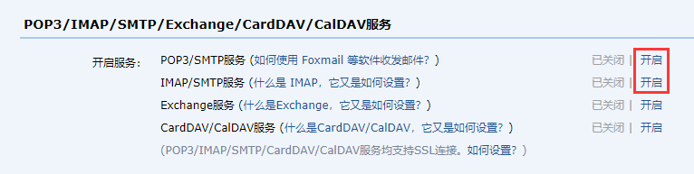

# Spring Boot 整合 JavaMail

本笔记基于 Spring Boot 2.5.8 版本进行开发

## 1. 简述

发送邮件应该是网站的必备功能之一，什么注册验证，忘记密码或者是给用户发送营销信息。最早期的时候会使用 JavaMail 相关 api 来写发送邮件的相关代码，后来 Spring 推出了 JavaMailSender 更加简化了邮件发送的过程，在之后 Spring Boot 对此进行了封装就有了现在的 spring-boot-starter-mail

邮件发送的3个概念，这些概念规范了邮件操作过程中的标准。

- SMTP（Simple Mail Transfer Protocol）：简单邮件传输协议，用于**发送**电子邮件的传输协议
- POP3（Post Office Protocol - Version 3）：用于**接收**电子邮件的标准协议
- IMAP（Internet Mail Access Protocol）：互联网消息协议，是 POP3 的替代协议

简单说就是 SMPT 是发邮件的标准，POP3 是收邮件的标准，IMAP 是对 POP3 的升级。在开发程序中操作邮件，通常是发邮件，所以 SMTP 是使用的重点，收邮件大部分都是通过邮件客户端完成，所以开发收邮件的代码极少。除非要读取邮件内容，然后解析，做邮件功能的统一处理。例如 HR 的邮箱收到求职者的简历，可以读取后统一处理。但是还不如直接开发独立的投递简历的系统，因为要想收邮件就要规范发邮件的人的书写格式，有点强人所难，并且极易收到外部攻击，不可能使用白名单来收邮件。如果能使用白名单来收邮件然后解析邮件，还不如开发个系统给白名单中的人专用呢，更安全。

## 2. 基础整合使用

### 2.1. 引入依赖

在 Spring Boot 中发送邮件，在 pom.xml 文件里面引入整合 javamail 的依赖 spring-boot-starter-mail

```xml
<dependency>
    <groupId>org.springframework.boot</groupId>
    <artifactId>spring-boot-starter-mail</artifactId>
</dependency>
```

### 2.2. 邮件参数配置

- 在 application.yml 中添加邮箱配置参数。*`username`与`password`通过系统参数传递*

```yml
spring:
  mail: # 配置邮件功能
    host: smtp.126.com # 邮箱服务器地址
    username: ${uname} # 邮箱账号
    password: ${pwd} # 密码
    default-encoding: UTF-8 # 默认编码，默认值是 UTF-8
```

- application.properties 配置

```properties
spring.mail.host=smtp.126.com
spring.mail.username=${uname}
spring.mail.password=${pwd}
spring.mail.default-encoding=UTF-8
```

java 程序仅用于发送邮件，邮件的功能还是邮件供应商提供的，因为要配置对应信息才能用邮件服务。

host 配置的是提供邮件服务的主机协议，当前程序仅用于发送邮件，因此配置的是smtp的协议。

password 并不是邮箱账号的登录密码，是邮件供应商提供的一个加密后的密码，也是为了保障系统安全性。不然外部人员通过地址访问下载了配置文件，直接获取到了邮件密码就会有极大的安全隐患。有关该密码的获取每个邮件供应商提供的方式都不一样，此处略过。可以到邮件供应商的设置页面找 POP3 或 IMAP 这些关键词找到对应的获取位置。下面以 QQ 邮箱为例仅供参考：



### 2.3. 编写接口与测试

1. 编写 mailService 接口与实现类

```java
public interface MailService {
    /**
     * 发送简单邮件
     *
     * @param to      目标邮箱
     * @param subject 邮件主题
     * @param content 邮件内容
     */
    void sendSimpleMail(String to, String subject, String content);
}

@Service
public class MailServiceImpl implements MailService {

    private static final Logger LOGGER = LoggerFactory.getLogger(MailService.class);

    /* 注入邮件发送类 */
    @Autowired
    private JavaMailSender javaMailSender;

    /* 读取配置文件邮件发送地址 */
    @Value("${spring.mail.username}")
    private String from;

    /**
     * 发送简单邮件
     *
     * @param to      目标邮箱
     * @param subject 邮件主题
     * @param content 邮件内容
     */
    @Override
    public void sendSimpleMail(String to, String subject, String content) {
        // 创建邮件对象
        SimpleMailMessage simpleMailMessage = new SimpleMailMessage();

        // 设置邮件相关参数
        simpleMailMessage.setFrom(from);
        simpleMailMessage.setTo(to);
        simpleMailMessage.setSubject(subject);
        simpleMailMessage.setText(content);

        // 发送邮件
        javaMailSender.send(simpleMailMessage);
        LOGGER.info("发送简单邮件成功");
    }
}
```

2. 编写 test 类测试

```java
@SpringBootTest(properties = {"activeName=dev"})
public class MailSendTest {

    /* 注入邮件服务接口 */
    @Autowired
    private MailService mailService;

    @Test
    public void testSendSimpleMail() {
        mailService.sendSimpleMail("moon@126.com", "测试发送邮件", "hello JavaMail for Spring boot");
    }

}
```

## 3. 发送 html 格式邮件

1. 其他配置不需要改

```java
/**
 * 发送 html 格式邮件
 *
 * @param to      目标邮箱
 * @param subject 邮件主题
 * @param content 邮件内容
 */
@Override
public void sendHtmlMail(String to, String subject, String content) {
    // 创建MimeMessage邮件对象
    MimeMessage mimeMessage = javaMailSender.createMimeMessage();

    try {
        // 参数true表示需要创建一个multipart message
        MimeMessageHelper mimeMessageHelper = new MimeMessageHelper(mimeMessage, true);

        mimeMessageHelper.setFrom(from);
        mimeMessageHelper.setTo(to);
        mimeMessageHelper.setSubject(subject);
        // 第二参数表示内容是否为html文本
        mimeMessageHelper.setText(content, true);

        // 发送邮件
        javaMailSender.send(mimeMessage);
        LOGGER.info("发送简单邮件成功");
    } catch (MessagingException e) {
        e.printStackTrace();
        LOGGER.debug("发送 html 格式邮件失败，{}", e.getMessage());
    }
}
```

2. 测试

```java
@Test
public void testHtmlMail() {
    String content = "<html>\n" +
            "<body>\n" +
            "    <h3>hello world ! 这是一封Html邮件!</h3>\n" +
            "</body>\n" +
            "</html>";
    mailService.sendHtmlMail("moon@126.com", "测试发送Html邮件", content);
}
```

## 4. 发送带附件的邮件

1. 本示例是指定一个上传的文件夹，将文件夹中所有文件作为附件上传，一个文件一封邮件
2. 配置application.yml文件，设置上传文件夹

```yml
# 发送邮件相关参数
mail:
  uploadPath: E:\\autoUpload\\
```

3. 编写上传附件的邮件接口与实现类

```java
/**
 * 发送带附件的邮件
 *
 * @param to       目标邮箱
 * @param subject  邮件主题
 * @param content  邮件内容
 * @param fileList 邮件附件对象数组
 */
@Override
public void sendAttachmentsMail(String to, String subject, String content, File[] fileList) {
    // 设置系统参数，取消发送邮件附件名称长度限制
    System.setProperty("mail.mime.splitlongparameters", "false");

    if (fileList != null && fileList.length > 0) {
        try {
            for (File filePath : fileList) {
                // 创建MimeMessage邮件对象
                MimeMessage mimeMessage = javaMailSender.createMimeMessage();
                // 参数true表示需要创建一个multipart message
                MimeMessageHelper mimeMessageHelper = new MimeMessageHelper(mimeMessage, true, "UTF-8");
                mimeMessageHelper.setFrom(from);
                mimeMessageHelper.setTo(to);
                mimeMessageHelper.setText(content, true);

                // 读取文件
                FileSystemResource fileSystemResource = new FileSystemResource(filePath);
                // 获取文件名称
                String fileName = fileSystemResource.getFilename();

                // 设置附件，添加多个附件可以使用多条 helper.addAttachment(fileName, file)
                mimeMessageHelper.addAttachment(MimeUtility.encodeWord(fileName, "UTF-8", "B"), fileSystemResource);

                // 判断是否有主题名称，如果主题为空，则以文件名称做为邮件主题名称
                if (StringUtils.isBlank(subject)) {
                    mimeMessage.setSubject(fileName);
                } else {
                    mimeMessageHelper.setSubject(subject);
                }

                // 发送邮件
                javaMailSender.send(mimeMessage);
                LOGGER.info("{}邮件发送成功", fileName);
            }
        } catch (Exception e) {
            e.printStackTrace();
            LOGGER.debug("发送附件邮件失败，{}", e.getMessage());
        }
    }
}

@Override
public void sendAttachmentsMail(String to, File[] fileList) {
    this.sendAttachmentsMail(to, "", "", fileList);
}
```

4. 测试方法

```java
/* 附件上传文件存储路径 */
@Value("${mail.uploadPath}")
private String uploadPath;

@Test
public void sendAttachmentsMail() {
    // 读取配置文件，获取上传文件夹对象
    File file = new File(uploadPath);

    // 判断是否为文件夹
    if (file.isDirectory()) {
        // 获取文件夹所有文件名称
        File[] fileList = file.listFiles();
        mailService.sendAttachmentsMail("moon@126.com", fileList);
    }
}
```

## 5. 发送带静态资源的邮件

发送带静态资源的邮件其实就是在发送HTML邮件的基础上嵌入静态资源（比如图片），嵌入静态资源的过程和传入附件类似，唯一的区别在于需要标识资源的cid

```java
package com.springboot.demo.controller;

import java.io.File;

import javax.mail.internet.MimeMessage;

import org.springframework.beans.factory.annotation.Autowired;
import org.springframework.beans.factory.annotation.Value;
import org.springframework.core.io.FileSystemResource;
import org.springframework.mail.SimpleMailMessage;
import org.springframework.mail.javamail.JavaMailSender;
import org.springframework.mail.javamail.MimeMessageHelper;
import org.springframework.web.bind.annotation.RequestMapping;
import org.springframework.web.bind.annotation.RestController;

@RestController
@RequestMapping("/email")
public class EmailController {

    @Autowired
    private JavaMailSender jms;

    @Value("${spring.mail.username}")
    private String from;

    @RequestMapping("sendInlineMail")
    public String sendInlineMail() {
        MimeMessage message = null;
        try {
            message = jms.createMimeMessage();
            MimeMessageHelper helper = new MimeMessageHelper(message, true);
            helper.setFrom(from);
            helper.setTo("888888@qq.com"); // 接收地址
            helper.setSubject("一封带静态资源的邮件"); // 标题
            helper.setText("<html><body>博客图：</body></html>", true); // 内容
            // 传入附件
            FileSystemResource file = new FileSystemResource(new File("src/main/resources/static/img/sunshine.png"));
            helper.addInline("img", file);
            jms.send(message);
            return "发送成功";
        } catch (Exception e) {
            e.printStackTrace();
            return e.getMessage();
        }
    }
}
```

> `helper.addInline("img", file);`方法中的img和图片标签里cid后的名称相对应。启动项目访问http://localhost/email/sendInlineMail，提示发送成功

## 6. 使用模板发送邮件

1. 在发送验证码等情况下可以创建一个邮件的模板，唯一的变量为验证码。这个例子中使用的模板解析引擎为Thymeleaf，所以首先引入Thymeleaf依赖:

```xml
<dependency>
    <groupId>org.springframework.boot</groupId>
    <artifactId>spring-boot-starter-thymeleaf</artifactId>
</dependency>
```

2. 在template目录下创建一个emailTemplate.html模板

```html
<!DOCTYPE html>
<html lang="zh" xmlns:th="http://www.thymeleaf.org">
<head>
    <meta charset="UTF-8" />
    <title>模板</title>
</head>

<body>
    您好，您的验证码为{code}，请在两分钟内使用完成操作。
</body>
</html>
```

3. 发送模板邮件，本质上还是发送HTML邮件，只不过多了绑定变量的过程

```java
package com.springboot.demo.controller;

import java.io.File;

import javax.mail.internet.MimeMessage;

import org.springframework.beans.factory.annotation.Autowired;
import org.springframework.beans.factory.annotation.Value;
import org.springframework.core.io.FileSystemResource;
import org.springframework.mail.SimpleMailMessage;
import org.springframework.mail.javamail.JavaMailSender;
import org.springframework.mail.javamail.MimeMessageHelper;
import org.springframework.web.bind.annotation.RequestMapping;
import org.springframework.web.bind.annotation.RestController;
import org.thymeleaf.TemplateEngine;
import org.thymeleaf.context.Context;

@RestController
@RequestMapping("/email")
public class EmailController {

    @Autowired
    private JavaMailSender jms;
    
    @Value("${spring.mail.username}")
    private String from;
    
    @Autowired
    private TemplateEngine templateEngine;
	
    @RequestMapping("sendTemplateEmail")
    public String sendTemplateEmail(String code) {
        MimeMessage message = null;
        try {
            message = jms.createMimeMessage();
            MimeMessageHelper helper = new MimeMessageHelper(message, true);
            helper.setFrom(from); 
            helper.setTo("888888@qq.com"); // 接收地址
            helper.setSubject("邮件摸板测试"); // 标题
            // 处理邮件模板
            Context context = new Context();
            context.setVariable("code", code);
            String template = templateEngine.process("emailTemplate", context);
            helper.setText(template, true);
            jms.send(message);
            return "发送成功";
        } catch (Exception e) {
            e.printStackTrace();
            return e.getMessage();
        }
    }
}
```

> 其中code对应模板里的`${code}`变量。启动项目，访问http://localhost/email/sendTemplateEmail?code=EOS9，页面提示发送成功

## 7. （!待整理）邮件系统


## 8. 其他

[Spring Boot (十)：邮件服务](https://mp.weixin.qq.com/s?__biz=MzU3NzczMTAzMg==&mid=2247483733&idx=1&sn=287b97b8c50e202e57cad5aab75e7869&chksm=fd0161e2ca76e8f42f840c3f75168c59137dc63c35f2a2f8ee292e9afa952f96f479a63b2a38&mpshare=1&scene=1&srcid=07039b9TGI2GPvv7IfHHRVm0#rd)

[SpringBoot 发送邮件和附件（实用版）](https://www.jianshu.com/p/5eb000544dd7)

https://mrbird.cc/Spring-Boot-Email.html
