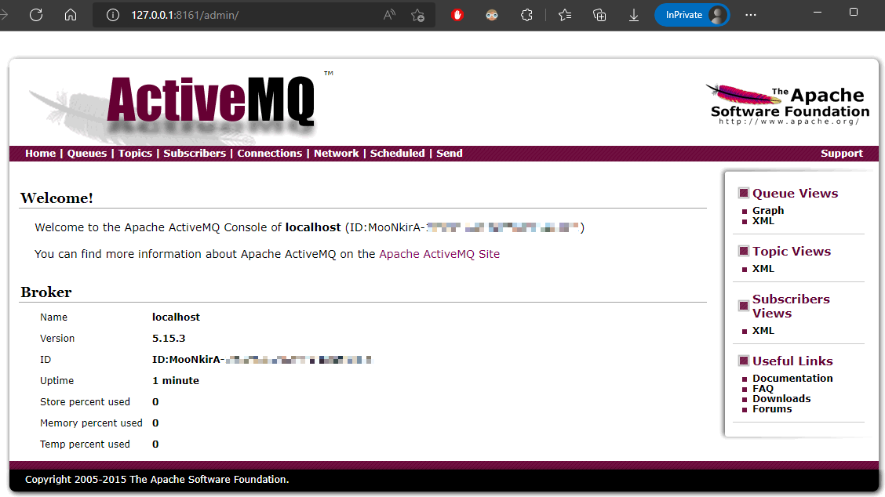
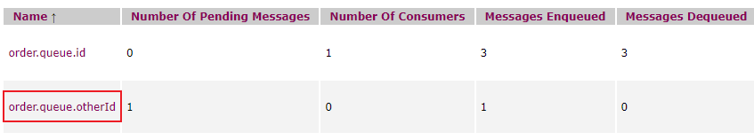
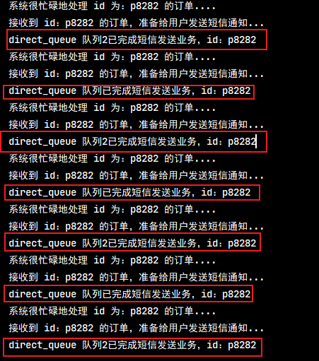

# Spring Boot 消息系统

Spring Boot 为集成消息系统提供了广泛的支持，从使用 JmsTemplate 简化 JMS API 的使用到异步接收消息的完整基础设施。Spring AMQP 为高级消息队列协议提供了一个类似的功能集。Spring Boot 还为 RabbitTemplate 和 RabbitMQ 提供了自动配置选项。Spring WebSocket 原生包括对 STOMP 消息传递的支持，Spring Boot 通过启动器和少量的自动配置对其进行支持。Spring Boot 还支持 Apache Kafka

## 1. Java处理消息的标准规范概述

> 此部分内容详见[《消息中间件》笔记](/07-分布式架构&微服务架构/07-分布式消息中件间/01-消息中件间)

## 2. Spring Boot 整合 ActiveMQ

> 本章节主要是 Spring Boot 整合 ActiveMQ，关于 ActiveMQ 更多介绍与使用详见[《ActiveMQ》笔记](/07-分布式架构&微服务架构/07-分布式消息中件间/02-ActiveMQ)

ActiveMQ 是 MQ 产品中的元老级产品，早期标准 MQ 产品之一，在 AMQP 协议没有出现之前，占据了消息中间件市场的绝大部分份额，后期因为 AMQP 系列产品的出现，迅速走弱，目前仅在一些线上运行的产品中出现，新产品开发较少采用。

### 2.1. 环境准备

#### 2.1.1. 下载与安装

windows 版安装包下载地址：https://activemq.apache.org/components/classic/download/

下载的安装包是解压缩就能使用的 zip 文件，解压缩完毕后会得到如下文件

#### 2.1.2. 启动服务器

进入 ActiveMQ 的安装目录中，运行 bin/win32 或 bin/win64 目录（根据自己的操作系统选择）中的 `activemq.bat` 命令脚本即可启动服务，默认对外服务端口 61616

#### 2.1.3. web 后台管理服务

ActiveMQ 启动后会有一个 Web 控制台服务，可以通过该服务管理 ActiveMQ。web 管理服务默认端口 8161

访问地址：http://127.0.0.1:8161/

访问需要输入用户名和密码，初始化用户名和密码均为：admin，成功登录后进入管理后台界面，如下：



#### 2.1.4. 启动失败

在 ActiveMQ 启动时要占用多个端口，以下为正常启动信息：


其中占用的端口有：61616、5672、61613、1883、61614，如果启动失败，请先管理对应端口即可。如有某个端口占用，查看报错信息，可以从抛出异常的位置看出，启动 5672 端口时端口被占用，显示java.net.BindException: Address already in use: JVM_Bind。Windows 系统中终止端口运行的操作自行查询资料

### 2.2. 基础整合示例

#### 2.2.1. 基础示例工程准备

示例的模拟用户下单请求，上送订单id，然后进行很复杂的数据库查询、更新等业务处理后，通过消息中件间实现给用户发送短信（模拟）通知

- 引入 web 工程依赖

```java
<dependencies>
    <dependency>
        <groupId>org.springframework.boot</groupId>
        <artifactId>spring-boot-starter-web</artifactId>
    </dependency>
</dependencies>
```

- 创建 application.yml 项目配置文件

```yml
server:
  port: 80
```

- 创建发送消息业务接口与实现(无发送消息部分)

```java
public interface MessageService {
    // 发送消息
    void sendMessage(String id);
}

@Service
public class MessageServiceImpl implements MessageService {
    @Override
    public void sendMessage(String id) {
        System.out.println("接收到 id：" + id + " 的订单，准备给用户发送短信通知...");
        // 后面是发送消息的逻辑
    }
}
```

- 创建请求层接口

```java
@RestController
@RequestMapping("order")
public class OrderController {

    @Autowired
    private MessageService messageService;

    @GetMapping("{id}")
    public String updateOrder(@PathVariable String id) throws InterruptedException {
        // 模拟调用了N个服务接口，处理很复杂的业务逻辑
        System.out.println("系统很忙碌地处理 id 为：" + id + " 的订单....");
        messageService.sendMessage(id); // 发送消息
        Thread.sleep(2000); // 模拟业务处理时间
        return "success";
    }
}
```

- 启动类

```java
@SpringBootApplication
public class ActiveMQApplication {
    public static void main(String[] args) {
        SpringApplication.run(ActiveMQApplication.class, args);
    }
}
```

#### 2.2.2. 引入 ActiveMQ 依赖

在项目的 pom.xml 文件中引入 Spring Boot 整合 ActiveMQ 的 starter 依赖。Spring Boot 父工程已进行版本管理，无需指定版本。

```xml
<dependency>
    <groupId>org.springframework.boot</groupId>
    <artifactId>spring-boot-starter-activemq</artifactId>
</dependency>
```

#### 2.2.3. 配置 ActiveMQ

修改 application.yml 文件，配置 ActiveMQ 的服务器地址

```yml
spring:
  activemq:
    broker-url: tcp://localhost:61616 # ActiveMQ 服务地址
```

#### 2.2.4. 消息生产者

在发送的消息的业务接口 `MessageServiceImpl` 中，使用 `JmsMessagingTemplate` 操作对象向 ActiveMQ 发送消息。

通过 `convertAndSend(String destinationName, Object payload)` 方法向 ActiveMQ 发送消息，会先将消息的类型转换成字符串，然后再发送，需要指定消息发送的位置（消息队列的名称）和具体的消息内容，示例简单地使用 id 作为消息内容。

```java
@Autowired
private JmsMessagingTemplate messagingTemplate;

@Override
public void sendMessage(String id) {
    System.out.println("接收到 id：" + id + " 的订单，准备给用户发送短信通知...");
    /*
     * 调用 JmsMessagingTemplate.convertAndSend(String destinationName, Object payload) 方法，向 ActiveMQ 服务发送消息
     * 该方法直接将内容进行转换后，再发送
     *      destinationName 参数：消息发往的队列名称
     *      payload 参数：发送的消息体内容
     */
    messagingTemplate.convertAndSend("order.queue.id", id);
}
```

> 扩展：使用 `receiveAndConvert` 方法用于接收消息，会将消息接收后再转换成指定的数据类型，该接收消息方法除了提供读取的位置，还需要指定转换后数据的具体类型。一般很少使这种手动调用接收消息的方式，通过都是做成监听器形式，当有消息发出，就马上触发相应的消费方法

#### 2.2.5. 消息消费者

创建消息监听器 `MessageListener` 类，类中定义消费消息的方法，在该方法上标识 `@JmsListener` 注解，通过 `destination` 属性设置当前方法监听 ActiveMQ 服务中指定名称的消息队列。在服务器启动后，监听指定名称的消息队列，当有消息出现后，立即调用此消费方法。

```java
@Component
public class MessageListener {
    /*
     * @JmsListener 注解用于标识方法，通过 destination 属性指定监听的列队名称
     * 当该队列出现消息后，此方法就会被调用，方法形参为接收消息的内容
     */
    @JmsListener(destination = "order.queue.id")
    public void receive(String id) {
        System.out.println("已完成短信发送业务，id：" + id);
    }
}
```

> 值得注意：`@JmsListener` 修饰的消费方法不能用返回值。

#### 2.2.6. 功能测试

启动工程与 ActiveMQ 服务，在浏览器访问 http://localhost/order/S1838323

观察项目控制台日志输出

### 2.3. 进阶使用示例

#### 2.3.1. 消息转发

上例只定义一个消息方法，如果当前消息队列处理完还需要继续向下传递当前消息到另一个队列中，可以使用 `@SendTo` 注解，并指定消息转发下一个队列的名称，如此即可构造连续执行的顺序消息队列。

```java
@JmsListener(destination = "order.queue.id")
/*
 * @SendTo 注解用于当前方法消费后，将消息转发到下一个消息队列中，注解属性指定下一个队列的名称。
 * 注意：方法必须有返回值，返回的内容就是转发到下一个队列的消息内容
 */
@SendTo("order.queue.otherId")
public String receive(String id) {
    System.out.println("已完成短信发送业务，id：" + id);
    // 返回新的消息内容
    return "new ID: " + id;
}
```

<font color=red>**注意：使用 `@SendTo` 注解标识转发消息的方法，必须有返回值，该返回值是转发给下一个队列的消息内容**</font>

测试结果



#### 2.3.2. 切换消息模型

如需要切换消息模型由**点对点模型**到**发布订阅模型**，在 application.yml 项目配置文件修改 `spring.jms.pub-sub-domain` 配置项即可。该配置项默认值为 `false`，即点对点模型，修改为 `true`，即发布订阅模型。

```yml
spring:
  activemq:
    broker-url: tcp://localhost:61616 # ActiveMQ 服务地址
  jms:
    pub-sub-domain: true # 设置消息模型，默认值为 false，即点对点模型，修改为 true 即发布订阅模型。
```

## 3. Spring Boot 整合 RabbitMQ

> 本章节主要是 Spring Boot 整合 RabbitMQ，关于 RabbitMQ 更多介绍与使用详见[《RabbitMQ》笔记](/07-分布式架构&微服务架构/07-分布式消息中件间/03-RabbitMQ)

### 3.1. 环境准备

RabbitMQ 的下载、安装、启动服务等参考《RabbitMQ》笔记。此示例本人觉得 windows 版安装与后期删除都比较麻烦（有洁癖-_-），所以在虚拟机的 linux 系统下的使用 Docker 安装部署的 RabbitMQ

### 3.2. direct 消息模型整合示例

#### 3.2.1. 基础示例工程准备

> 直接使用前面示例工程代码（移除相关发送消息与监听消息的代码、与相关依赖）

#### 3.2.2. 引入 RabbitMQ 依赖

在项目的 pom.xml 文件中引入 Spring Boot 整合 RabbitMQ 的 starter 依赖，AMQP 协议默认实现为 RabbitMQ 方案。Spring Boot 父工程已进行版本管理，无需指定版本。

```xml
<!-- Spring Boot 整合 RabbitMQ 依赖，注意：不是叫 starter-rabbitmq-->
<dependency>
    <groupId>org.springframework.boot</groupId>
    <artifactId>spring-boot-starter-amqp</artifactId>
</dependency>
```

#### 3.2.3. 配置 RabbitMQ

修改 application.yml 文件，配置 RabbitMQ 的服务器地址

```yml
spring:
  rabbitmq: # RabbitMQ 相关配置
    host: 192.168.12.132
    port: 5672
```

#### 3.2.4. 初始化直连模式系统设置

由于 RabbitMQ 不同模型要使用不同的交换机，因此创建配置类，先初始化 RabbitMQ 相关的对象，例如队列，交换机等。队列 `Queue` 与直连交换机 `DirectExchange` 实例创建后，还需要创建 `Binding` 对象并绑定队列与交换机之间的关系，这样才可以通过交换机操作对应队列。

```java
@Configuration
public class RabbitDirectConfig {

    /* 创建队列 */
    @Bean
    public Queue directQueue() {
        // 指定队列名称
        return new Queue("direct_queue");
    }

    /* 创建交换机 */
    @Bean
    public DirectExchange directExchange() {
        // 指定交换机名称
        return new DirectExchange("directExchange");
    }

    /* 创建 Binding 对象，绑定交换机与队列 */
    @Bean
    public Binding bindingDirect() {
        return BindingBuilder.bind(directQueue()).to(directExchange()).with("direct");
    }

    /* 以下表示可以创建多个队列，然后同一个交换机可以绑定多个队列 */
    @Bean
    public Queue directQueue2() {
        return new Queue("direct_queue2");
    }

    @Bean
    public Binding bindingDirect2() {
        return BindingBuilder.bind(directQueue2()).to(directExchange()).with("direct2");
    }
}
```

#### 3.2.5. 消息生产者

在发送的消息的业务接口 `MessageServiceImpl` 中，使用 `AmqpTemplate` 操作对象向 RabbitMQ 发送消息。AMQP 协议中的操作 API 接口名称看上去和 jms 规范的操作 API 接口很相似，但是传递参数差异很大。

```java
@Service
public class MessageServiceImpl implements MessageService {

    @Autowired
    private AmqpTemplate amqpTemplate;

    @Override
    public void sendMessage(String id) {
        System.out.println("接收到 id：" + id + " 的订单，准备给用户发送短信通知...");
        /*
         * 调用 AmqpTemplate.convertAndSend(String exchange, String routingKey, final Object object) 方法，
         * 向 RabbitMQ 服务发送消息，该方法直接将内容进行转换后，再发送
         *      exchange 参数：指定消息发送到哪个交换机的名称
         *      routingKey 参数：指定消息发送到交换机与队列绑定的路由名称
         *      object 参数：发送的消息体内容
         */
        amqpTemplate.convertAndSend("directExchange","direct", id);
    }
}
```

#### 3.2.6. 消息消费者

创建消息监听器 `MessageListener` 类，类中定义消费消息的方法，在该方法上标识 `@RabbitListener` 注解，通过 `queues` 属性设置当前方法监听 RabbitMQ 服务中指定名称的消息队列。在服务器启动后，监听指定名称的消息队列，当有消息出现后，立即调用此消费方法。

```java
@Component
public class MessageListener {
    /*
     * @RabbitListener 注解用于标识方法，通过 queues 属性指定监听的列队名称
     * 当该队列出现消息后，此方法就会被调用，方法形参为接收消息的内容
     */
    @RabbitListener(queues = "direct_queue")
    public void receive(String id) {
        System.out.println("direct_queue 队列已完成短信发送业务，id：" + id);
    }
    
    // 如果定义多个监听同一个队列，那么 RabbitMQ 会以轮询的方式让每个消费者平均消费消息
    @RabbitListener(queues = "direct_queue")
    public void receive2(String id) {
        System.out.println("direct_queue 队列2已完成短信发送业务，id：" + id);
    }
}
```

> 注：可以配置多个监听方法，同时监听同一个队列，RabbitMQ 会以轮询的方式调用各个消费方法

#### 3.2.7. 功能测试

启动工程与 ActiveMQ 服务，在浏览器访问 http://localhost/order/S1838323

观察项目控制台日志输出，多次请求，则以轮询方式调用多个消费者



### 3.3. topic 消息模型整合示例

#### 3.3.1. 引入依赖与配置


## 4. Spring Boot 整合 RocketMQ

> 本章节主要是 Spring Boot 整合 RocketMQ，关于 RocketMQ 更多介绍与使用详见[《RocketMQ》笔记](/07-分布式架构&微服务架构/07-分布式消息中件间/04-RocketMQ)


## 5. Spring Boot 整合 Kafka

> 本章节主要是 Spring Boot 整合 Kafka，关于 Kafka 更多介绍与使用详见[《Kafka》笔记](/07-分布式架构&微服务架构/07-分布式消息中件间/05-Kafka)


