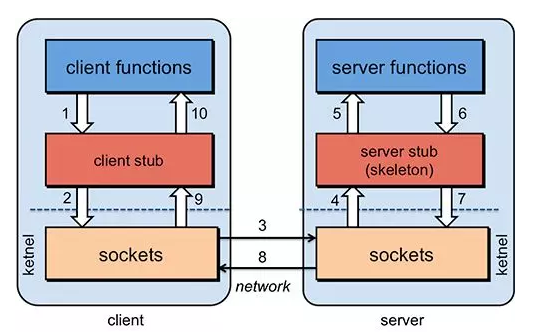
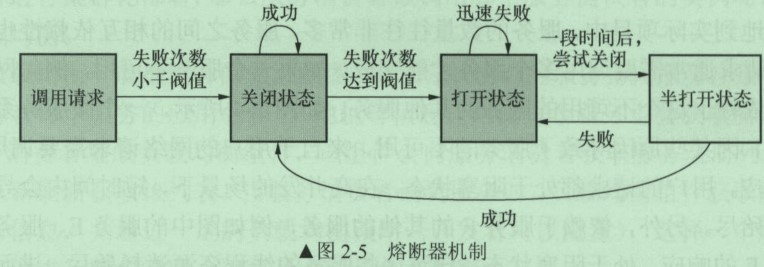

# 微服务基础知识

## 1. 系统架构的演变

随着互联网的发展，网站应用的规模不断扩大，常规的应用架构已无法应对，分布式服务架构以及微服务架构势在必行，亟需一个治理系统确保架构有条不紊的演进。

### 1.1. 单体应用架构

Web应用程序发展的早期，大部分web工程(包含前端页面，web层代码，service层代码，dao层代码)是将所有的功能模块，打包到一起并放在一个web容器中运行。比如搭建一个电商系统：客户下订单，商品展示，用户管理。这种将所有功能都部署在一个web容器中运行的系统就叫做单体架构。

面对业务发展与用户量增加带来的高并发访问，可以将单体应用进行集群部署，并增加负载均衡服务器（如Nginx等）。另外，还需要增加集群部署的缓存服务器和文件服务器，并将数据库读写分离

用负载均衡服务器分发高并发的网络请求，用户的访问被分派到不同的应用服务器，用户量增加时，添加应用服务器即可。通过添加缓存服务器来缓解数据库的数据以及数据库读取数据的压力。大多数的读取操作是由缓存完成，但仍然有少数读操作是从数据库读取的，例如缓存失效、实时数据等。

当有大量读写操作时，可以将数据库进行读写分离，例如MySQL的主从热备份，通过相关配置可以将主数据库服务器的数据同步到从数据库服务器，实现数据库的读写分离，改善数据库的负载能力。


优点：

- 所有的功能集成在一个项目工程中
- 项目架构简单，前期开发成本低，周期短，小型项目的首选

缺点：

- 全部功能集成在一个工程中，对于大型项目不易开发、扩展及维护
- 系统性能扩展只能通过扩展集群结点，成本高、有瓶颈
- 技术栈受限

### 1.2. 垂直应用架构

当访问量逐渐增大，单一应用增加机器带来的加速度越来越小，将应用拆成互不相干的几个应用，以提升效率


优点：

- 项目架构简单，前期开发成本低，周期短，小型项目的首选
- 通过垂直拆分，原来的单体项目不至于无限扩大
- 不同的项目可采用不同的技术

缺点：

- 全部功能集成在一个工程中，对于大型项目不易开发、扩展及维护
- 系统性能扩展只能通过扩展集群结点，成本高、有瓶颈

### 1.3. 分布式SOA架构

#### 1.3.1. SOA 概述

SOA 全称为 Service-Oriented Architecture，即面向服务的架构。它可以根据需求通过网络对松散耦合的粗粒度应用组件(服务)进行分布式部署、组合和使用。一个服务通常以独立的形式存在于操作系统进程中

站在功能的角度，把业务逻辑抽象成可复用、可组装的服务，通过服务的编排实现业务的快速再生，其主要目的是把原先固有的业务功能转变为通用的业务服务，实现业务逻辑的快速复用。

**SOA 架构特点：分布式、可重用、扩展灵活、松耦合**

#### 1.3.2. SOA 架构

当垂直应用越来越多，应用之间交互不可避免，将核心业务抽取出来，作为独立的服务，逐渐形成稳定的服务中心，使前端应用能更快速的响应多变的市场需求


优点：

- 抽取公共的功能为服务，提高开发效率
- 对不同的服务进行集群化部署解决系统压力
- 基于ESB/DUBBO减少系统耦合

缺点：

- 抽取服务的粒度较大
- 服务提供方与调用方接口耦合度较高

### 1.4. 微服务架构


优点：

- 通过服务的原子化拆分，以及微服务的独立打包、部署和升级，小团队的交付周期将缩短，运维成本也将大幅度下降
- 微服务遵循单一原则。微服务之间采用Restful等轻量协议传输

缺点：

- 微服务过多，服务治理成本高，不利于系统维护
- 分布式系统开发的技术成本高（容错、分布式事务等）

### 1.5. SOA与微服务的关系

- **SOA（ Service Oriented Architecture ）“面向服务的架构”**：是一种设计方法，其中包含多个服务，服务之间通过相互依赖最终提供一系列的功能。一个服务通常以独立的形式存在与操作系统进程中。各个服务之间通过网络调用。
- **微服务架构**：其实和 SOA 架构类似，微服务是在 SOA 上做的升华，微服务架构强调的一个重点是“业务需要彻底的组件化和服务化”，原有的单个业务系统会拆分为多个可以独立开发、设计、运行的小应用。这些小应用之间通过服务完成交互和集成。


## 2. 分布式核心知识

### 2.1. 分布式中的远程调用

在微服务架构中，通常存在多个服务之间的远程调用的需求。<font color=red>**远程调用通常包含两个部分：序列化和通信协议**</font>。常见的序列化协议包括json、xml、hession、protobuf、thrift、text、bytes等，**目前主流的远程调用技术有基于HTTP的RESTful接口以及基于TCP的RPC协议**。

#### 2.1.1. HTTP的RESTfull接口

REST，即Representational State Transfer的缩写，如果一个架构符合REST原则，就称它为RESTful架构

- **资源（Resources）**：就是网络上的一个实体，或者说是网络上的一个具体信息。可以用一个URI（统一资源定位符）指向它，每种资源对应一个特定的URI。要获取这个资源，访问它的URI就可以
- **表现层（Representation）**：把"资源"具体呈现出来的形式。
- **状态转化（State Transfer）**：访问一个网站，就代表了客户端和服务器的一个互动过程。在这个过程中，势必涉及到数据和状态的变化。如果客户端想要操作服务器，必须通过某种手段，让服务器端发生"状态转化"（State Transfer）。客户端用到的手段就是HTTP协议里面，四个表示操作方式的动词：GET、POST、PUT、DELETE。它们分别对应四种基本操作：GET用来获取资源，POST用来新建资源（也可以用于更新资源），PUT用来更新资源，DELETE用来删除资源。

RESTful架构总结：

- 每一个URI代表一种资源
- 客户端和服务器之间，传递这种资源的某种表现层
- 客户端通过四个HTTP动词，对服务器端资源进行操作，实现"表现层状态转化"

#### 2.1.2. RPC协议

RPC（Remote Procedure Call ）一种进程间通信方式。允许像调用本地服务一样调用远程服务。RPC框架负责屏蔽底层的传输方式（TCP或者UDP）、序列化方式（XML/JSON/二进制）和通信细节。使用时只需关心调用哪个远程服务接口即可



#### 2.1.3. RESTful与RPC的区别


- HTTP相对更规范，更标准，更通用，无论哪种语言都支持http协议。如果对外开放API，例如开放平台，外部的编程语言多种多样，需要对每种语言的支持，现在开源中间件，基本最先支持的几个协议都包含RESTful
- RPC 框架作为架构微服务化的基础组件，它能大大降低架构微服务化的成本，提高调用方与服务提供方的研发效率，屏蔽跨进程调用函数（服务）的各类复杂细节。让调用方感觉就像调用本地函数一样调用远端函数、让服务提供方感觉就像实现一个本地函数一样来实现服务

### 2.2. 分布式中的CAP原理

对于多数大型互联网应用都是分页式系统（distributed system），分布式系统的最大难点，就是各个节点的状态如何同步。CAP 定理是这方面的基本定理，也是理解分布式系统的起点。

分布式系统的CAP理论，把分布式系统归纳成以下三个特性：

- **Consistency（一致性）**：数据一致更新，所有数据的变化都是同步的
- **Availability（可用性）**：在集群中一部分节点故障后，集群整体是否还能响应客户端的读写请求
- **Partition tolerance（分区容忍性）**：某个节点的故障，并不影响整个系统的运行

> 注：通过学习CAP理论，得知任何分布式系统只可同时满足二点，没法三者兼顾，既然一个分布式系统无法同时满足一致性、可用性、分区容错性三个特点，所以就需要抛弃其中一点


| 选择 |                                                     说明                                                      |
| --- | ------------------------------------------------------------------------------------------------------------ |
| CA   | 放弃分区容错性，加强一致性和可用性，其实就是传统的关系型数据库的选择                                                 |
| AP   | 放弃一致性（这里说的一致性是强一致性），追求分区容错性和可用性，这是很多分布式系统设计时的选择，例如很多NoSQL系统就是如此 |
| CP   | 放弃可用性，追求一致性和分区容错性，基本不会选择，网络问题会直接让整个系统不可用                                      |

需要明确一点的是，**在一个分布式系统当中，分区容忍性和可用性是最基本的需求，所以在分布是系统中最当关注的就是A（可用性）P（容忍性），通过补偿的机制寻求数据的一致性**

## 3. 常见微服务框架

### 3.1. SpringCloud

Spring Cloud是一系列框架的有序集合。它利用Spring Boot的开发便利性巧妙地简化了分布式系统基础设施的开发，如**服务发现注册、配置中心、消息总线、负载均衡、断路器、数据监控**等，都可以用Spring Boot的开发风格做到一键启动和部署。Spring Cloud并没有重复制造轮子，它只是将目前各家公司开发的比较成熟、经得起实际考验的服务框架组合起来，通过Spring Boot风格进行再封装屏蔽掉了复杂的配置和实现原理，最终给开发者留出了一套简单易懂、易部署和易维护的分布式系统开发工具包

官网：https://spring.io/projects/spring-cloud

### 3.2. ServiceComb

Apache ServiceComb 是业界第一个Apache微服务顶级项目， 是一个开源微服务解决方案,致力于帮助企业、用户和开发者将企业应用轻松微服务化上云，并实现对微服务应用的高效运维管理。其提供一站式开源微服务解决方案，融合SDK框架级、零侵入ServiceMesh场景并支持多语言

官网：http://servicecomb.apache.org/cn/

### 3.3. ZeroC ICE

ZeroC IceGrid 是ZeroC公司的杰作，继承了CORBA的血统，是新一代的面向对象的分布式系统中间件。作为一种微服务架构，它基于RPC框架发展而来，具有良好的性能与分布式能力

官网：https://zeroc.com/products/ice

## 4. 微服务特点

- 按业务划分成一个独立运行的程序，即服务单元
- 服务之间通过HTTP协议相互通信
- 自动化部署
- 可以用不同的编程语言
- 可以用不同的存储技术
- 服务集中化管理
- 微服务是一个分布式系统，具有极强的横向扩展能力，微服务可以集群化部署

### 4.1. 微服务通过HTTP相互通信

- 微服务单元之间的通信一般使用HTTP的通信机制，更多的时候使用RESTFUL api的，可以跨平台与语言
- 服务与服务之间也可以通过轻量级的消息总线来通信，如RabbitMQ，Kafaka等
- 服务与服务之间的通信格式一般为json、xml。这两种数据格式与平台、语言、通信协议无关

### 4.2. 微服务的数据库独立

微服务都有自己独立的数据库，数据库之间没有任何联系。数据库的存储方式可以是关系型数据库，也可以是非关系数据库（如：MongoDB、Redis）

### 4.3. 微服务的自动化部署

微服务架构有多少服务就需要部署多少次，所以微服务部署的核心是Docker容器技术，是微服务最佳部署的容器，需要使用Docker容器技术以及自动化部署工具（如：开源组件Jenkins）。DevOps是一种部署手段或理念。

## 5. 微服务的不足

### 5.1. 微服务的复杂度

服务与服务之间相互依赖，如果修改某个服务，会对另一个服务产生影响。比如修改一个比较基础的服务，可能需要重启所有的服务才能完成测试

### 5.2. 分布式事务


分布式事务提交需要两个阶段

第1个阶段：Service-account发起一个分布式事务，交给事务协调器TC处理，事务协调器TC向所有参与的事务的节点发送处理事务操作的准备操作，将Undo和Redo信息写进日志，并向事务管理器返回准备操作是否成功

第2个阶段：事务管理器收集的呢节点的准备操作是否成功，如果都成功，则通知所有的节点执行提交操作；如果有一个失败，则执行回滚操作。但如果第1阶段都成功，而执行第2阶段的某一个节点失败，仍然导致数据的不准确。如果分布式事务涉及的节点很多，某个节点的网络出现异常会导致整个事务处于阻塞状态，大大降低数据库的性能。所以一般情况下，尽量少用分布式事务

## 6. 微服务的注册中心

注册中心相当于微服务架构中的“通讯录”，它记录了服务和服务地址的映射关系。在分布式架构中，服务会注册到这里，当服务需要调用其它服务时，就这里找到服务的地址，进行调用。


### 6.1. 注册中心的主要作用

服务注册中心（下称注册中心）是微服务架构非常重要的一个组件，在微服务架构里主要起到了协调者的一个作用。注册中心一般包含如下几个功能：

1. 服务发现：
    - 服务注册/反注册：保存服务提供者和服务调用者的信息
    - 服务订阅/取消订阅：服务调用者订阅服务提供者的信息，最好有实时推送的功能
    - 服务路由（可选）：具有筛选整合服务提供者的能力。
2. 服务配置：
    - 配置订阅：服务提供者和服务调用者订阅微服务相关的配置
    - 配置下发：主动将配置推送给服务提供者和服务调用者
3. 服务健康检测
    - 检测服务提供者的健康情况

### 6.2. 常见的注册中心

- **Zookeeper**：它是一个分布式服务框架，是Apache Hadoop 的一个子项目，它主要是用来解决分布式应用中经常遇到的一些数据管理问题，如：统一命名服务、状态同步服务、集群管理、分布式应用配置项的管理等。简单来说<font color=red>**zookeeper=文件系统+监听通知机制**</font>。
- **Eureka**：是使用Java语言开发的，基于Restful Api开发的服务注册与发现组件，Springcloud Netflix中的重要组
- **Consul**：是由HashiCorp基于Go语言开发的支持多数据中心分布式高可用的服务发布和注册服务软件，采用Raft算法保证服务的一致性，且支持健康检查。
- **Nacos**：是一个更易于构建云原生应用的动态服务发现、配置管理和服务管理平台。简单来说<font color=red>**Nacos 就是注册中心 + 配置中心的组合**</font>，提供简单易用的特性集，解决微服务开发必会涉及到的服务注册与发现，服务配置，服务管理等问题。Nacos 还是 Spring Cloud Alibaba 组件之一

选择什么类型的服务注册与发现组件可以根据自身项目要求决定。常见的注册中心总结如下：

|   组件名   | 语言 | CAP | 一致性算法 | 服务健康检查 | 对外暴露接口 |
| --------- | ---- | --- | --------- | ----------- | ----------- |
| Eureka    | Java | AP  | 无        | 可配支持     | HTTP        |
| Consul    | go   | CP  | Raft      | 支持        | HTTP/DNS    |
| Zookeeper | Java | CP  | Paxos     | 支持        | 客户端      |
| Nacos     | Java | AP  | Raft      | 支持        | HTTP        |

### 6.3. 服务的注册与发现概念

**服务注册**：服务实例将自身服务信息注册到注册中心。这部分服务信息包括服务所在主机IP和提供服务的Port，以及暴露服务自身状态以及访问协议等信息。

**服务发现**：服务实例请求注册中心获取所依赖服务信息。服务实例通过注册中心，获取到注册到其中的服务实例的信息（如服务名、IP地址等），通过这些信息去请求它们提供的服务

一个服务既是服务提供者，也是服务消费者。服务消费者一般使用HTTP协议或者消费。


Spring cloud 采用Eureka来注册服务和发现服务。也可以使用Zookeeper、Consul等服务集中化管理框架

### 6.4. 微服务的注册与发现流程图


由上图可以看出：

1. 服务提供者将服务注册到注册中心
2. 服务消费者通过注册中心查找服务
3. 查找到服务后进行调用（这里就是无需硬编码url的解决方案）
4. 服务的消费者与服务注册中心保持心跳连接，一旦服务提供者的地址发生变更时，注册中心会通知服务消费者

## 7. 负载均衡

负载均衡是高可用网络基础架构的关键组件，通常用于将工作负载分布到多个服务器来提高网站、应用、数据库或其他服务的性能和可靠性

为了保证服务的高可用，服务单元往往是集群化部署。由于服务注册中心既要接收每个服务的定时心跳，而且每个服务会定期获取服务注册列表的信息，所以**一般做法将服务注册中心集群化，每个服务注册中心的数据实时同步**

服务提供者可以进行集群化部署，服务消费者集成负载均衡组件，该组件会向服务消费者获取服务注册列表信息，并每隔一段时间重新刷新获取列表。当消费服务时，负载均衡组件获取服务提供者所有注册信息，并通过负载均衡策略，选择一个服务提供者进行消费


### 7.1. 雪崩效应

在微服务架构中，一个请求需要调用多个服务是非常常见的。如客户端访问A服务，而A服务需要调用B服务，B服务需要调用C服务，由于网络原因或者自身的原因，如果B服务或者C服务不能及时响应，A服务将处于阻塞状态，直到B服务C服务响应。此时若有大量的请求涌入，容器的线程资源会被消耗完毕，导致服务瘫痪。服务与服务之间的依赖性，故障会传播，造成连锁反应，会对整个微服务系统造成灾难性的严重后果，这就是服务故障的**“雪崩效应”**。


雪崩是系统中的蝴蝶效应导致其发生的原因多种多样，有不合理的容量设计，或者是高并发下某一个法响应变慢，亦或是某台机器的资源耗尽。从源头上无法完全杜绝雪崩源头的发生，但是雪崩的根本原因来源于服务之间的强依赖，所以可以做好<font color=red>**熔断，隔离，限流**</font>，来防止雪崩效应

### 7.2. 防止雪崩效应的处理方案

#### 7.2.1. 服务隔离

**服务隔离**是指将系统按照一定的原则划分为若干个服务模块，各个模块之间相对独立，无强依赖。当有故障发生时，能将问题和影响隔离在某个模块内部，而不扩散风险，不波及其它模块，不影响整体的系统服务。

#### 7.2.2. 熔断与降级

为了防止“雪崩效应”，分布式系统采用了**熔断机制**。当下游服务因访问压力过大而响应变慢或失败，上游服务为了保护系统整体的可用性，可以暂时切断对下游服务的调用，从而保全整体的措施就叫做熔断。在Spring Cloud构建的微服务系统中，采用了**熔断器**（即Hystrix组件的Ciruit Breaker）去做熔断。

**降级**，就是当某个服务熔断之后，服务器将不再被调用，此时客户端可以自己准备一个本地的fallback回调，返回一个缺省值。也可以理解为兜底


例：当服务b出现故障，请求失败次数超过设定的阀值之后，服务b就会开启熔断器，之后服务b不进行任何的业务逻辑操作，执行快速失败并直接返回请求失败的信息。其他依赖b的服务就不会因为得不到响应而线程阻塞。此时除了服务b和依赖于服务b的部分功能不可用外，其他功能正常

熔断器还具有一个**自我修复的机制**。即当服务b熔断后，半打开的熔断器会检查一部分请求，其他请求执行快速失败响应，检查的部分如何成功，则会判定服务b正常，就会关闭服务b的熔断器；如果不正常，则继续打开熔断器。

熔断组件往往会提供一系列的监控，例如：服务是否可用，熔断器是否被打开、目前的吞吐量、网络延迟状态的监控等。



熔断器机制的作用：

- 将资源进行隔离，只会隔离故障的API接口，不会影响其他的API接口
- 服务降级的功能。当大量请求剏并发时，熔断器会被打开，将服务降级，以免服务器因负载过高而出现故障
- 自我修复能力。

#### 7.2.3. 服务限流

**限流**可以认为服务降级的一种，限流就是限制系统的输入和输出流量已达到保护系统的目的。一般来说系统的吞吐量是可以被测算的，为了保证系统的稳固运行，一旦达到的需要限制的阈值，就需要限制流量并采取少量措施以完成限制流量的目的。比方：推迟解决，拒绝解决，或者部分拒绝解决等等。

## 8. 链路追踪

微服务按照不同的维度进行拆分，一次请求往往需要涉及到多个服务。互联网应用构建在不同的软件模块集上，这些软件模块，有可能是由不同的团队开发、可能使用不同的编程语言来实现、有可能布在了几千台服务器，横跨多个不同的数据中心。因此，就需要对一次请求涉及的多个服务链路进行日志记录，性能监控即**链路追踪**


## 9. 微服务网关（API Gateway）

随着微服务的不断增多，不同的微服务一般会有不同的网络地址，而外部客户端可能需要调用多个服务的接口才能完成一个业务需求，如果让客户端直接与各个微服务通信可能出现以下问题：

- 客户端会请求多个不同的服务，需要维护不同的请求地址，增加开发难度
- 在某些场景下存在跨域请求的问题
- 加大身份认证的难度，每个微服务需要独立认证

此时需要一个微服务网关，介于客户端与服务器之间的中间层，所有的外部请求都会先经过微服务网关。客户端只需要与网关交互，只知道一个网关地址即可。增加服务网关的有以下优点：

1. 易于监控
2. 易于认证
3. 减少了客户端与各个微服务之间的交互次数


### 9.1. 服务网关的概念

微服务系统中，API接口资源通常是由服务网关（也称API网关）统一暴露，由网关层统一接入和输出。API Gateway 是一个服务器，也可以说是进入系统的唯一节点。

API网关封装了系统内部架构，为每个客户端提供一个定制的API。API网关方式的核心要点是，所有的客户端和消费端都通过统一的网关接入微服务，在网关层处理所有的非业务功能。通常，网关也是提供REST/HTTP的访问API。服务端通过API-GW注册和管理服务。

### 9.2. 作用和应用场景

API Gateway 封装内部系统的架构，并且提供 API 给各个客户端。一个网关的基本功能有：统一接入、安全防护、协议适配、流量管控、长短链接支持、容错能力。有了网关之后，各个API服务提供团队可以专注于自己的的业务逻辑处理，而API网关更专注于安全、流量、路由等问题。它还可以有其他功能，如授权、监控、负载均衡、缓存、请求分片和管理、静态响应处理等。网关层作用如下：

1. 将所有服务的API接口资源统一暴露
2. 实现用户身份认证、权限认证、防止非法请求操作API接口
3. 实现监控功能，实时日志输出，对请求进行记录
4. 做流量监控
5. API接口从内部分离出来


**API Gateway 负责请求转发、合成和协议转换**。所有来自客户端的请求都要先经过 API Gateway，然后路由这些请求到对应的微服务。API Gateway 将经常通过调用多个微服务来处理一个请求以及聚合多个服务的结果。它可以在 web 协议与内部使用的非 Web 友好型协议间进行转换，如 HTTP 协议、WebSocket 协议。

### 9.3. 常见的API网关实现方式

- **Kong**
    - 基于Nginx+Lua开发，性能高，稳定，有多个可用的插件(限流、鉴权等等)可以开箱即用。
    - 问题：只支持Http协议；二次开发，自由扩展困难；提供管理API，缺乏更易用的管控、配置方式
- **Zuul**
    - Netflix开源，功能丰富，使用JAVA开发，易于二次开发；需要运行在web容器中，如Tomcat。
    - 问题：缺乏管控，无法动态配置；依赖组件较多；处理Http请求依赖的是Web容器，性能不如Nginx
- **Traefik**
    - Go语言开发；轻量易用；提供大多数的功能：服务路由，负载均衡等等；提供WebUI
    - 问题：二进制文件部署，二次开发难度大；UI更多的是监控，缺乏配置、管理能力；
- **Spring Cloud Gateway**
    - SpringCloud提供的网关服务
- **Nginx+lua实现**
    - 使用Nginx的反向代理和负载均衡可实现对api服务器的负载均衡及高可用
    - 问题：自注册的问题和网关本身的扩展性

### 9.4. 基于Nginx的网关实现（扩展）

> 注：这里只是简介使用介绍，详细使用看Nginx的笔记

#### 9.4.1. Nginx介绍


#### 9.4.2. 正向/反向代理

**正向代理**

正向代理，"它代理的是客户端，代客户端发出请求"，是一个位于客户端和原始服务器(origin server)之间的服务器，为了从原始服务器取得内容，客户端向代理发送一个请求并指定目标(原始服务器)，然后代理向原始服务器转交请求并将获得的内容返回给客户端。客户端必须要进行一些特别的设置才能使用正向代理。

**反向代理**

多个客户端给服务器发送的请求，Nginx服务器接收到之后，按照一定的规则分发给了后端的业务处理服务器进行处理了。此时~请求的来源也就是客户端是明确的，但是请求具体由哪台服务器处理的并不明确了，Nginx扮演的就是一个反向代理角色。客户端是无感知代理的存在的，反向代理对外都是透明的，访问者并不知道自己访问的是一个代理。因为客户端不需要任何配置就可以访问。反向代理，"它代理的是服务端，代服务端接收请求"，主要用于服务器集群分布式部署的情况下，反向代理隐藏了服务器的信息

如果只是单纯的需要一个最基础的具备转发功能的网关，那么使用Ngnix是一个不错的选择。

#### 9.4.3. 简单的使用示例

- 启动订单微服务，单独请求地址：http://127.0.0.1:9001/
- 启动商品微服务，单独请求地址：http://127.0.0.1:9002/

安装ngnix，找到根目录ngnix.exe双击运行即可。修改conf目录下的nginx.conf文件

```
server {
    listen       80;
    server_name  127.0.0.1;
	ssi on;
	ssi_silent_errors on;

	# 订单服务
	location /api-order {
		proxy_pass http://127.0.0.1:9001/;
	}

	# 端口服务
	location /api-product {
		proxy_pass http://127.0.0.1:9002/;
	}
}
```

# Spring Cloud

微服务架构的系统是一个分布式系统，按业务领域划分为独立的服务单元，有自动化运维容错、快速演进的特点，它能够解决传统单体架构系统的痛点，同时也能满足复杂的业务需求。

Spring Cloud是java语言的微服务框架，依赖于Spring boot。

## 1. SpringCloud 的核心组件

Spring Cloud 的本质是在 Spring Boot 的基础上，增加了一堆微服务相关的规范，并对应用上下文（Application Context）进行了功能增强。目前 Spring Cloud 规范已有 Spring 官方，Spring Cloud Netflix，Spring Cloud Alibaba等实现。通过组件化的方式，Spring Cloud 将这些实现整合到一起构成全家桶式的微服务技术栈。

**Spring Cloud Netflix组件**

| 组件名称 |              作用               |
| ------- | ------------------------------ |
| Eureka  | 服务注册中心，服务的注册和发现组件 |
| Ribbon  | 客户端负载均衡组件               |
| Feign   | 声明式服务调用                   |
| Hystrix | 客户端容错保护，熔断组件          |
| Zuul    | API服务网关                     |

**Spring Cloud Alibaba组件**

| 组件名称 |     作用      |
| -------- | ------------ |
| Nacos    | 服务注册中心   |
| Sentinel | 客户端容错保护 |

**Spring Cloud原生及其他组件**

|    组件名称    |             作用              |
| ------------- | ---------------------------- |
| Consul        | 服务注册中心                   |
| Config        | 分布式配置中心，配置文件统一管理 |
| Gateway       | API服务网关                   |
| Sleuth/Zipkin | 分布式链路追踪组件             |
| Security      | 服务单元用户验证和权限认证      |
| Stream        | Spring Cloud数据流操作包       |

## 2. SpringCloud的体系结构图


Spring Cloud各个组件相互配合，合作支持了一套完整的微服务架构。

- **注册中心**负责服务的注册与发现，很好将各服务连接起来
- **断路器**负责监控服务之间的调用情况，连续多次失败进行熔断保护。
- **API网关**负责转发所有对外的请求和服务
- **配置中心**提供了统一的配置信息管理服务，可以实时的通知各个服务获取最新的配置信息
- **链路追踪**技术可以将所有的请求数据记录下来，方便进行后续分析
- 各个组件又提供了功能完善的**dashboard监控平台**,可以方便的监控各组件的运行状况

## 3. Spring Cloud 版本说明

### 3.1. 版本命名说明

- 多数Spring项目都是以【`主版本号.次版本号.增量版本号.里程碑版本号`】的形式命名版本号的。如：Spring Framework稳定版本4.3.5.RELEASE、里程碑版本5.0.0.M4等
- 其中，主版本号表示项目的重大重构；次版本号表示新特性的添加和变化；增量版本号一般表示bug修复；里程碑版本号表示某版本号的里程碑
- 而Spring Cloud采用了伦敦地铁站的名字，根据字母表的顺序来对应版本时间顺序。以此方式的命名，为了**避免与子项目版本号的重名误解**

### 3.2. 选择Spring Cloud版本与Spring Boot版本例子

- 在选择了Spring Cloud版本后，需要在官网上选择对应的子项目的版本。pom.xml的依赖配置案例如下：
  - Spring Cloud版本Finchley.RELEASE对应Spring boot版本为2.0.1.RELEASE
  - Spring Cloud版本Dalston.SR5对应Spring boot版本为1.5.1.RELEASE


### 3.3. Spring Cloud 对应的子项目版本

官网截图（2018.6.24）：https://projects.spring.io/spring-cloud/#quick-start


对应子项目的说明，红色部门是重点掌握

|         Component         | 备注                                                                                            |
| :-----------------------: | :---------------------------------------------------------------------------------------------- |
|     spring-cloud-aws      | 用于简化整合Amazon Web Service的组件                                                              |
|     spring-cloud-bus      | 事件、消息总线，用于传播集群中的状态变化或事件。                                                     |
|     spring-cloud-cli      | 用于在Groovy平台创建Spring Cloud应用。                                                            |
|   spring-cloud-commons    | 服务发现、负载均衡、熔断机制这种模式为Spring Cloud客户端提供了一个通用的抽象层。                        |
|   spring-cloud-contract   |                                                                                                 |
|  **spring-cloud-config**  | **配置管理工具，支持使用git、svn等存储配置文件。并在支持客户端配置信息的刷新，加密解密配置内容等。** |
| **spring-cloud-netflix**  | **核心组件，对多个Netflix OSS开源套件进行整合。**                                                 |
|   spring-cloud-security   | 安全工具包。                                                                                     |
| spring-cloud-cloudfoundry | 整合Pivotal Cloudfoundry（Vmware推出的业界第一个开源PaaS云平台）支持。                              |
|    spring-cloud-consul    | 服务发现与配置管理工具                                                                            |
|  **spring-cloud-sleuth**  | **Spring Cloud应用的分布式跟踪实现。**                                                           |
|  **spring-cloud-stream**  | **通过Redis、RabbitMQ、Kafka实现的消息微服务。**                                                 |
|  spring-cloud-zookeeper   | 基于ZooKeeper的服务发现与配置管理组件。                                                            |
|      **spring-boot**      |                                                                                                 |
|     spring-cloud-task     | 用于快速构建数据处理的应用。                                                                       |
|    spring-cloud-vault     |                                                                                                 |
|   spring-cloud-gateway    | Spring Cloud网关相关的整合实现。                                                                  |

## 4. Spring Cloud 框架的特点

- 约定优于配置
- 适用于各种环境。开发、部署在PC Server或各种云环境（如阿里云、AWS等）
- 隐藏了组件的复杂性，并提供声明式、无xml的配置方式
- 开箱即用，快速启动
- 轻量级的组件。Spring Cloud整合的组件大多比较轻量。如：Eureka、Zuul等等，都是各自领域轻量级的实现
- 组件丰富，功能齐全。Spring Cloud为微服务架构提供了非常完整的支持，如：配置管理、服务发现、熔断器、微服务网关等
- 选型中立、丰富。支持使用Eureka、Zookeeper或Consul实现服务发现
- 灵活。Spring Cloud的组成部分是解耦的

## 5. Spring Cloud 和 Spring Boot 的关系

- Spring boot 是 Spring 的一套快速配置脚手架，可以基于spring boot 快速开发单个微服务，Spring Cloud是一个基于Spring Boot实现的云应用开发工具；
- Spring boot专注于快速、方便集成的单个个体，Spring Cloud是关注全局的服务治理框架；
- Spring boot使用了默认大于配置的理念，很多集成方案已经帮你选择好了，能不配置就不配置，Spring Cloud很大的一部分是基于Spring boot来实现，可以不基于Spring boot吗？不可以。
- Spring boot可以离开Spring Cloud独立使用开发项目，但是Spring Cloud离不开Spring boot，属于依赖的关系。
- spring -> spring booot -> spring cloud 这样的关系。

## 6. 微服务案例（不使用SpringCloud）

> **此案例代码地址：`spring-cloud-note\spring-cloud-greenwich-sample\01-microservice-no-springcloud\`**

微服务架构的分布式系统，微服务之间通过网络通信。通过服务提供者与服务消费者来描述微服务间的调用关系

> - 服务提供者：服务的被调用方，提供调用接口的一方
> - 服务消费者：服务的调用方，依赖于其他服务的一方

以电商系统中常见的用户下单为例，用户向订单微服务发起一个购买的请求。在进行保存订单之前需要调用商品微服务查询当前商品库存，单价等信息。在这种场景下，订单微服务就是一个服务消费者，商品微服务就是一个服务提供者


### 6.1. 准备数据库表

创建`springcloud_sample_db`数据库，案例中所涉及的表完整建表语句在项目资料`spring-cloud-note\spring-cloud-greenwich-sample\document\sql`中

用户表：

```sql
CREATE TABLE `tb_user` (
	`id` INT ( 11 ) NOT NULL AUTO_INCREMENT,
	`username` VARCHAR ( 40 ) DEFAULT NULL COMMENT '用户名',
	`password` VARCHAR ( 40 ) DEFAULT NULL COMMENT '密码',
	`age` INT ( 3 ) DEFAULT NULL COMMENT '年龄',
	`balance` DECIMAL ( 10, 2 ) DEFAULT NULL COMMENT '余额',
	`address` VARCHAR ( 80 ) DEFAULT NULL COMMENT '地址',
	PRIMARY KEY ( `id` )
) ENGINE = INNODB DEFAULT CHARSET = utf8;
```

商品表：

```sql
CREATE TABLE `tb_product` (
	`id` INT ( 11 ) NOT NULL AUTO_INCREMENT,
	`product_name` VARCHAR ( 40 ) DEFAULT NULL COMMENT '名称',
	`status` INT ( 2 ) DEFAULT NULL COMMENT '状态',
	`price` DECIMAL ( 10, 2 ) DEFAULT NULL COMMENT '单价',
	`product_desc` VARCHAR ( 255 ) DEFAULT NULL COMMENT '描述',
	`caption` VARCHAR ( 255 ) DEFAULT NULL COMMENT '标题',
	`inventory` INT ( 11 ) DEFAULT NULL COMMENT '库存',
	PRIMARY KEY ( `id` )
) ENGINE = INNODB AUTO_INCREMENT = 2 DEFAULT CHARSET = utf8;
```

订单表：

```sql
CREATE TABLE `tb_order` (
	`id` INT ( 11 ) NOT NULL AUTO_INCREMENT,
	`user_id` INT ( 11 ) DEFAULT NULL COMMENT '用户id',
	`product_id` INT ( 11 ) DEFAULT NULL COMMENT '商品id',
	`number` INT ( 11 ) DEFAULT NULL COMMENT '数量',
	`price` DECIMAL ( 10, 2 ) DEFAULT NULL COMMENT '单价',
	`amount` DECIMAL ( 10, 2 ) DEFAULT NULL COMMENT '总额',
	`product_name` VARCHAR ( 40 ) DEFAULT NULL COMMENT '商品名',
	`username` VARCHAR ( 40 ) DEFAULT NULL COMMENT '用户名',
PRIMARY KEY ( `id` )
) ENGINE = INNODB DEFAULT CHARSET = utf8;
```

### 6.2. 搭建环境 - 聚合父工程

创建聚合父工程`01-microservice-no-springcloud`，修改pom.xml文件引入相关依赖

```xml
<modelVersion>4.0.0</modelVersion>
<groupId>com.moon</groupId>
<artifactId>01-microservice-no-springcloud</artifactId>
<version>1.0-SNAPSHOT</version>
<name>${project.artifactId}</name>
<packaging>pom</packaging>
<description>不使用Spring Cloud的情况下实现微服务架构，分析此方法存在的问题</description>

<!-- 引入 spring boot 父工程 -->
<parent>
    <groupId>org.springframework.boot</groupId>
    <artifactId>spring-boot-starter-parent</artifactId>
    <version>2.1.6.RELEASE</version>
</parent>

<!-- 子模块 -->
<modules>
    <module>shop-service-common</module>
    <module>shop-service-product</module>
    <module>shop-service-order</module>
</modules>

<properties>
    <project.build.sourceEncoding>UTF-8</project.build.sourceEncoding>
    <project.reporting.outputEncoding>UTF-8</project.reporting.outputEncoding>
    <java.version>1.8</java.version>
    <mysql-connector-java.version>5.1.32</mysql-connector-java.version>
    <lombok.version>1.18.4</lombok.version>
</properties>

<!-- 版本控制 -->
<dependencyManagement>
    <dependencies>
        <dependency>
            <groupId>mysql</groupId>
            <artifactId>mysql-connector-java</artifactId>
            <version>${mysql-connector-java.version}</version>
        </dependency>
        <dependency>
            <groupId>org.projectlombok</groupId>
            <artifactId>lombok</artifactId>
            <version>${lombok.version}</version>
        </dependency>

        <!-- 子模块版本号控制 -->
        <dependency>
            <groupId>com.moon</groupId>
            <artifactId>shop-service-common</artifactId>
            <version>${project.version}</version>
        </dependency>
    </dependencies>
</dependencyManagement>

<!-- 公共依赖 -->
<dependencies>
    <dependency>
        <groupId>org.springframework.boot</groupId>
        <artifactId>spring-boot-starter-logging</artifactId>
    </dependency>
    <dependency>
        <groupId>org.springframework.boot</groupId>
        <artifactId>spring-boot-starter-test</artifactId>
        <scope>test</scope>
    </dependency>
</dependencies>

<!-- 项目构建部分 -->
<build>
    <plugins>
        <plugin>
            <groupId>org.springframework.boot</groupId>
            <artifactId>spring-boot-maven-plugin</artifactId>
        </plugin>
    </plugins>
</build>
```

### 6.3. 搭建公共模块

#### 6.3.1. 引入依赖

创建`shop-service-common`工程模块，用于存放公共的实体类和工具类。*注：后面的order、product、user模块都会依赖common模块*

```xml
<dependencies>
    <!-- lombok 实体工具类库依赖 -->
    <dependency>
        <groupId>org.projectlombok</groupId>
        <artifactId>lombok</artifactId>
        <scope>provided</scope>
    </dependency>
    <!-- springboot jpa 持久层依赖 -->
    <dependency>
        <groupId>org.springframework.boot</groupId>
        <artifactId>spring-boot-starter-data-jpa</artifactId>
    </dependency>
</dependencies>
```

#### 6.3.2. 创建实体类

在`shop-service-common`工程中创建 `Product` 实体类

```java
@Data
@Entity // 标识为jpa实体类
@Table(name = "tb_product") // 建立实体类和表的映射关系
public class Product {
    @Id // 声明当前私有属性为数据库表的主键
    @GeneratedValue(strategy = GenerationType.IDENTITY) // 配置主键的生成策略
    private Long id;
    private String productName;
    private Integer status;
    private BigDecimal price;
    private String productDesc;
    private String caption;
    private Integer inventory;
}
```

### 6.4. 搭建商品微服务模块

#### 6.4.1. 引入依赖

创建商品微服务模块`shop-service-product`，配置相关依赖

```xml
<dependencies>
    <!-- 公共模块依赖 -->
    <dependency>
        <groupId>com.moon</groupId>
        <artifactId>shop-service-common</artifactId>
    </dependency>

    <!-- springboot web 项目依赖 -->
    <dependency>
        <groupId>org.springframework.boot</groupId>
        <artifactId>spring-boot-starter-web</artifactId>
    </dependency>

    <!-- 数据库连接 -->
    <dependency>
        <groupId>mysql</groupId>
        <artifactId>mysql-connector-java</artifactId>
    </dependency>
</dependencies>
```

#### 6.4.2. 编写dao接口

在`shop-service-product`中创建 `ProductDao` 接口

```java
// 继承JPA相关接口，其中JpaSpecificationExecutor是用于复杂动态查询
public interface ProductDao extends JpaRepository<Product, Long>, JpaSpecificationExecutor<Product> { }
```

#### 6.4.3. 编写service层

在`shop-service-product`中创建 `ProductService` 业务接口与其实现

```java
public interface ProductService {
    /**
     * 根据id查询
     */
    Product findById(Long id);

    /**
     * 查询全部
     */
    List<Product> findAll();

    /**
     * 保存
     */
    void save(Product product);

    /**
     * 更新
     */
    void update(Product product);

    /**
     * 删除
     */
    void delete(Long id);
}
```

```java
@Service
public class ProductServiceImpl implements ProductService {
    @Autowired
    private ProductDao productDao;

    @Override
    public Product findById(Long id) {
        return productDao.findById(id).get();
    }

    @Override
    public List<Product> findAll() {
        return productDao.findAll();
    }

    @Override
    public void save(Product product) {
        productDao.save(product);
    }

    @Override
    public void update(Product product) {
        productDao.save(product);
    }

    @Override
    public void delete(Long id) {
        productDao.deleteById(id);
    }
}
```

#### 6.4.4. 编写controller层

在`shop-service-product`中创建 `ProductController` 控制类

```java
@RestController
@RequestMapping("product")
public class ProductController {
    @Autowired
    private ProductService productService;

    @GetMapping("/{id}")
    public Product findById(@PathVariable Long id) {
        return productService.findById(id);
    }

    @GetMapping
    public List<Product> findAll() {
        return productService.findAll();
    }

    @PostMapping
    public String save(@RequestBody Product product) {
        productService.save(product);
        return "保存成功";
    }

    @PutMapping
    public String update(@RequestBody Product product) {
        productService.update(product);
        return "修改成功";
    }

    @DeleteMapping("/{id}")
    public String delete(@PathVariable Long id) {
        productService.delete(id);
        return "删除成功";
    }
}
```

#### 6.4.5. 编写项目配置文件

在`resources`包下创建SpringBoot项目的核心配置文件`application.yml`

```yml
server:
  port: 9001 # 项目端口
spring:
  application:
    name: shop-service-product # 服务名称
  datasource: # 数据库配置
    driver-class-name: com.mysql.jdbc.Driver
    url: jdbc:mysql://localhost:3306/springcloud_sample_db?useUnicode=true&characterEncoding=utf8
    username: root
    password: 123456
  jpa: # jpa配置
    database: MySQL
    show-sql: true
    open-in-view: true
```

#### 6.4.6. 创建项目启动类

在`shop-service-product`中创建 `ProductApplication` 控制类

```java
@SpringBootApplication(scanBasePackages = "com.moon.product")
@EntityScan("com.moon.entity") // 指定扫描实体类的包路径
public class ProductApplication {
    public static void main(String[] args) {
        SpringApplication.run(ProductApplication.class, args);
    }
}
```

### 6.5. 搭建其他微服务

创建订单微服务模块 `shop-service-order` 与用户微服务模块 `shop-service-user`，搭建的步骤与商品微服务模块一致

### 6.6. 服务的调用

多个基础的微服务中，在用户下单时需要调用商品微服务获取商品数据，此时需要调用商品微服务提供的HTTP接口。所以需要使用http请求的相关工具类完成，如常见的`HttpClient`、`OkHttp`、Spring提供的`RestTemplate`

#### 6.6.1. RestTemplate 简介

Spring框架提供的`RestTemplate`类可用于在应用中调用rest服务，它简化了与http服务的通信方式，统一了RESTful的标准，封装了http链接，只需要传入url及返回值类型即可

RestTemplate类的设计原则与许多其他Spring 模板类(例如`JdbcTemplate`、`JmsTemplate`)相同，简化复杂的操作。`RestTemplate`默认依赖JDK提供http连接的能力（`HttpURLConnection`），如果有需要的话也可以通过`setRequestFactory`方法替换为例如 Apache HttpComponents、Netty或OkHttp等其它HTTP library。

RestTemplate类是为调用REST服务而设计的，因此它的主要方法与REST的基础紧密相连。后者是HTTP协议的方法：HEAD、GET、POST、PUT、DELETE和OPTIONS。例如，`RestTemplate`类具有`headForHeaders()`、`getForObject()`、`postForObject()`、`put()`和`delete()`等方法。

#### 6.6.2. RestTemplate 方法介绍


#### 6.6.3. 通过RestTemplate调用微服务

在`shop-service-order`工程，创建`HttpConfig`配置类，创建`RestTemplate`实例并注册到spring容器中

```java
@Configuration
public class HttpConfig {
    @Bean("restTemplate")
    public RestTemplate createRestTemplate() {
        return new RestTemplate();
    }
}
```

在`shop-service-order`工程`OrderController`控制类中，增加创建订单的方法

```java
@RestController
@RequestMapping("order")
public class OrderController {
    /* 日志对象 */
    private static final Logger LOGGER = LoggerFactory.getLogger(OrderController.class);

    // 注入HTTP请求工具类RestTemplate
    @Autowired
    private RestTemplate restTemplate;

    /**
     * 根据商品id创建订单
     */
    @PostMapping("/{id}")
    public String createOrder(@PathVariable Long id) {
        // 通过http请求，获取商品数据
        Product product = restTemplate.getForObject("http://127.0.0.1:9001/product/" + id, Product.class);
        LOGGER.info("当前下单的商品是: ${}", product);
        return "创建订单成功";
    }
}
```

启动商品与订单微服务，测试调用接口

#### 6.6.4. 硬编码存在的问题

上面示例已经可以通过`RestTemplate`调用商品微服务的RESTFul API接口，但把提供者的网络地址（ip，端口）等硬编码到了代码中，这种做法存在许多问题：

- 应用场景有局限
- 无法动态调整

**解决方法：通过注册中心动态的对服务注册和服务发现**

## 7. SpringCloud不同组件的注册中心与服务调用对比总结

> **注：详细用法详见本系列中不同的章节笔记**

### 7.1. 注册中心对比

#### 7.1.1. Eureka

**搭建注册中心**

- 引入 `spring-cloud-starter-netflix-eureka-server` 依赖
- 配置 Eureka Server
- 通过 `@EnableEurekaServer` 激活Eureka Server端配置

**服务注册**

- 服务提供者引入 `spring-cloud-starter-netflix-eureka-client` 依赖
- 通过 `eureka.client.serviceUrl.defaultZone` 配置注册中心地址

#### 7.1.2. Consul

**搭建注册中心**

- 下载安装consul
- 启动consul `consul agent -dev`

**服务注册**

- 服务提供者引入 `spring-cloud-starter-consul-discovery` 依赖
- 通过 `spring.cloud.consul.host` 和 `spring.cloud.consul.port` 指定Consul Server的请求地址

### 7.2. 服务调用对比

#### 7.2.1. Ribbon

- 通过Ribbon结合RestTemplate方式进行服务调用只需要在声明RestTemplate的方法上添加注解@LoadBalanced即可
- 可以通过 `服务名称.ribbon.NFLoadBalancerRuleClassName` 配置负载均衡策略

#### 7.2.2. Feign

- 服务消费者引入 `spring-cloud-starter-openfeign` 依赖
- 通过 `@FeignClient` 声明一个调用远程微服务接口
- 启动类上通过 `@EnableFeignClients` 激活Feign

