# Spring Cloud Alibaba

## 1. 简介

Spring Cloud Alibaba 致力于提供微服务开发的一站式解决方案。此项目包含开发分布式应用微服务的必需组件，方便开发者通过 Spring Cloud 编程模型轻松使用这些组件来开发分布式应用服务。

依托 Spring Cloud Alibaba，只需要添加一些注解和少量配置，就可以将 Spring Cloud 应用接入阿里微服务解决方案，通过阿里中间件来迅速搭建分布式应用系统。

官方文档：https://github.com/alibaba/spring-cloud-alibaba/wiki

## 2. 主要功能

- **服务限流降级**：默认支持 WebServlet、WebFlux， OpenFeign、RestTemplate、Spring Cloud Gateway， Zuul， Dubbo 和 RocketMQ 限流降级功能的接入，可以在运行时通过控制台实时修改限流降级规则，还支持查看限流降级 Metrics 监控。
- **服务注册与发现**：适配 Spring Cloud 服务注册与发现标准，默认集成了 Ribbon 的支持。
- **分布式配置管理**：支持分布式系统中的外部化配置，配置更改时自动刷新。
- **消息驱动能力**：基于 Spring Cloud Stream 为微服务应用构建消息驱动能力。
- **分布式事务**：使用 `@GlobalTransactional` 注解， 高效并且对业务零侵入地解决分布式事务问题。
- **阿里云对象存储**：阿里云提供的海量、安全、低成本、高可靠的云存储服务。支持在任何应用、任何时间、任何地点存储和访问任意类型的数据。
- **分布式任务调度**：提供秒级、精准、高可靠、高可用的定时（基于 Cron 表达式）任务调度服务。同时提供分布式的任务执行模型，如网格任务。网格任务支持海量子任务均匀分配到所有 Worker（schedulerx-client）上执行。
- **阿里云短信服务**：覆盖全球的短信服务，友好、高效、智能的互联化通讯能力，帮助企业迅速搭建客户触达通道。

## 3. 相关组件

- **[Sentinel](https://github.com/alibaba/Sentinel)**：把流量作为切入点，从流量控制、熔断降级、系统负载保护等多个维度保护服务的稳定性。
- **[Nacos](https://github.com/alibaba/Nacos)**：一个更易于构建云原生应用的动态服务发现、配置管理和服务管理平台。
- **[RocketMQ](https://rocketmq.apache.org/)**：一款开源的分布式消息系统，基于高可用分布式集群技术，提供低延时的、高可靠的消息发布与订阅服务。
- **[Dubbo](https://github.com/apache/dubbo)**：Apache Dubbo™ 是一款高性能 Java RPC 框架。
- **[Seata](https://github.com/seata/seata)**：阿里巴巴开源产品，一个易于使用的高性能微服务分布式事务解决方案。
- **[Alibaba Cloud OSS](https://www.aliyun.com/product/oss)**: 阿里云对象存储服务（Object Storage Service，简称 OSS），是阿里云提供的海量、安全、低成本、高可靠的云存储服务。您可以在任何应用、任何时间、任何地点存储和访问任意类型的数据。
- **[Alibaba Cloud SchedulerX](https://help.aliyun.com/document_detail/43136.html)**: 阿里中间件团队开发的一款分布式任务调度产品，提供秒级、精准、高可靠、高可用的定时（基于 Cron 表达式）任务调度服务。
- **[Alibaba Cloud SMS](https://www.aliyun.com/product/sms)**: 覆盖全球的短信服务，友好、高效、智能的互联化通讯能力，帮助企业迅速搭建客户触达通道。
- **Alibaba Cloud ACM**：一款在分布式架构环境中对应用配置进行集中管理和推送的应用配置中心产品。

## 4. 基础使用

### 4.1. 引入依赖

如果需要使用已发布的版本，在 `dependencyManagement` 中添加如下配置。

```xml
<dependencyManagement>
    <dependencies>
        <dependency>
            <groupId>com.alibaba.cloud</groupId>
            <artifactId>spring-cloud-alibaba-dependencies</artifactId>
            <version>2.2.7.RELEASE</version>
            <type>pom</type>
            <scope>import</scope>
        </dependency>
    </dependencies>
</dependencyManagement>
```

然后在 `dependencies` 中添加所需使用的依赖即可使用。

### 4.2. 官方演示 Demo

为了演示如何使用，Spring Cloud Alibaba 项目包含了一个子模块`spring-cloud-alibaba-examples`。此模块中提供了演示用的 example ，可以阅读对应的 example 工程下的 readme 文档，根据里面的步骤来体验。

Example 列表：

- [Sentinel Example](https://github.com/alibaba/spring-cloud-alibaba/tree/master/spring-cloud-alibaba-examples/sentinel-example/sentinel-core-example/readme-zh.md)
- [Nacos Config Example](https://github.com/alibaba/spring-cloud-alibaba/blob/master/spring-cloud-alibaba-examples/nacos-example/nacos-config-example/readme-zh.md)
- [Nacos Discovery Example](https://github.com/alibaba/spring-cloud-alibaba/blob/master/spring-cloud-alibaba-examples/nacos-example/nacos-discovery-example/readme-zh.md)
- [RocketMQ Example](https://github.com/alibaba/spring-cloud-alibaba/blob/master/spring-cloud-alibaba-examples/rocketmq-example/readme-zh.md)
- [Seata Example](https://github.com/alibaba/spring-cloud-alibaba/blob/master/spring-cloud-alibaba-examples/seata-example/readme-zh.md)
- [Alibaba Cloud OSS Example](https://github.com/alibaba/aliyun-spring-boot/tree/master/aliyun-spring-boot-samples/aliyun-oss-spring-boot-sample)
- [Alibaba Cloud SMS Example](https://github.com/alibaba/aliyun-spring-boot/tree/master/aliyun-spring-boot-samples/aliyun-sms-spring-boot-sample)
- [Alibaba Cloud SchedulerX Example](https://github.com/alibaba/aliyun-spring-boot)

# Spring Cloud Alibaba Sentinel

## 1. Sentinel 概述

### 1.1. 简介

随着微服务的流行，服务和服务之间的稳定性变得越来越重要。Sentinel 以流量为切入点，从流量控制、熔断降级、系统负载保护等多个维度保护服务的稳定性。

**Sentinel 的主要特性**：

- **丰富的应用场景**：Sentinel 承接了阿里巴巴近 10 年的双十一大促流量的核心场景，例如秒杀（即突发流量控制在系统容量可以承受的范围）、消息削峰填谷、集群流量控制、实时熔断下游不可用应用等。
- **完备的实时监控**：Sentinel 同时提供实时的监控功能。您可以在控制台中看到接入应用的单台机器秒级数据，甚至 500 台以下规模的集群的汇总运行情况。
- **广泛的开源生态**：Sentinel 提供开箱即用的与其它开源框架/库的整合模块，例如与 Spring Cloud、Dubbo、gRPC 的整合。您只需要引入相应的依赖并进行简单的配置即可快速地接入Sentinel。
- **完善的 SPI 扩展点**：Sentinel 提供简单易用、完善的 SPI 扩展接口。您可以通过实现扩展接口来快速地定制逻辑。例如定制规则管理、适配动态数据源等。

**Sentinel 的构架图**：

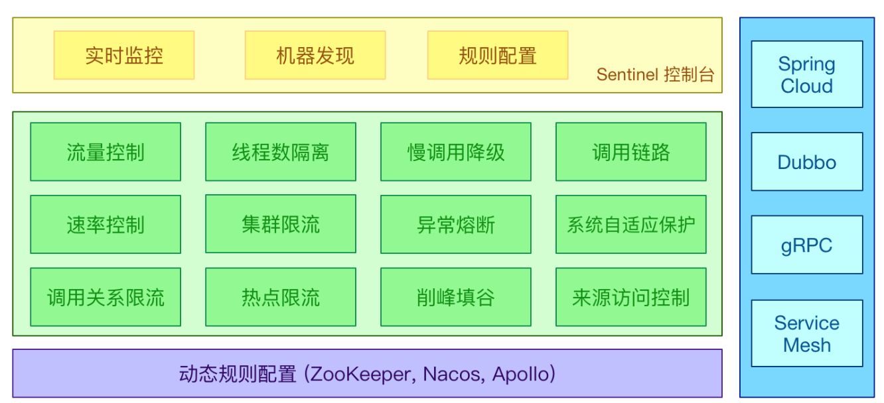

### 1.2. Sentinel 与 Hystrix 的区别

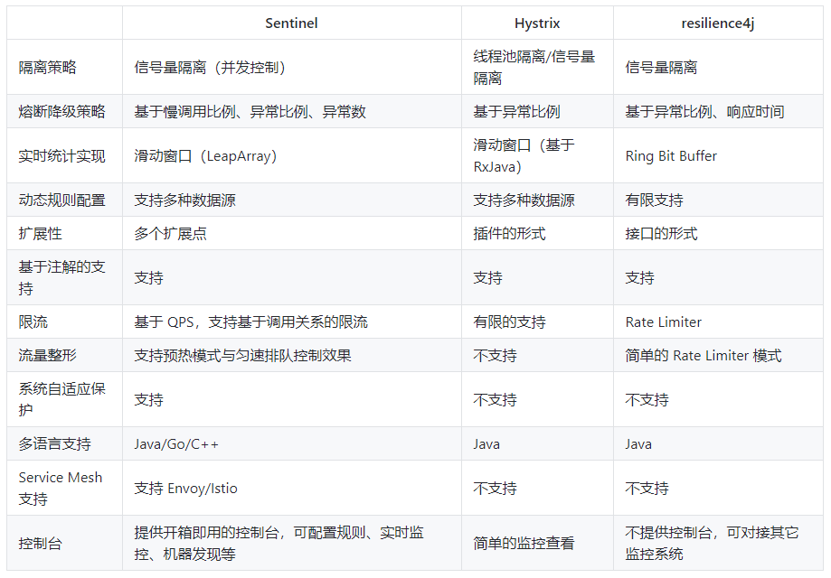

### 1.3. 迁移方案

Sentinel 官方提供了由 Hystrix 迁移到 Sentinel 的详细方法

> 迁移方案地址：https://github.com/alibaba/Sentinel/wiki/Guideline:-%E4%BB%8E-Hystrix-%E8%BF%81%E7%A7%BB%E5%88%B0-Sentinel

|    Hystrix 功能     |                                                                                              迁移方案                                                                                              |
| ------------------- | ------------------------------------------------------------------------------------------------------------------------------------------------------------------------------------------------- |
| 线程池隔离/信号量隔离 | Sentinel 不支持线程池隔离；信号量隔离对应 Sentinel 中的线程数限流，详见[此处](https://github.com/alibaba/Sentinel/wiki/Guideline:-从-Hystrix-迁移到-Sentinel#信号量隔离)                                  |
| 熔断器              | Sentinel 支持按平均响应时间、异常比率、异常数来进行熔断降级。从 Hystrix 的异常比率熔断迁移的步骤详见[此处](https://github.com/alibaba/Sentinel/wiki/Guideline:-从-Hystrix-迁移到-Sentinel#熔断降级)           |
| Command 创建        | 直接使用 Sentinel `SphU` API 定义资源即可，资源定义与规则配置分离，详见[此处](https://github.com/alibaba/Sentinel/wiki/Guideline:-从-Hystrix-迁移到-Sentinel#command-迁移)                                |
| 规则配置             | 在 Sentinel 中可通过 API 硬编码配置规则，也支持多种动态规则源                                                                                                                                          |
| 注解支持             | Sentinel 也提供注解支持，可以很方便地迁移，详见[此处](https://github.com/alibaba/Sentinel/wiki/Guideline:-从-Hystrix-迁移到-Sentinel#注解支持)                                                           |
| 开源框架支持          | Sentinel 提供 Servlet、Dubbo、Spring Cloud、gRPC 的适配模块，开箱即用；若之前使用 Spring Cloud Netflix，可迁移至 [Spring Cloud Alibaba](https://github.com/spring-cloud-incubator/spring-cloud-alibaba) |

### 1.4. Sentinel 相关专业名词解释

Sentinel 可以简单的分为 Sentinel 核心库和 Dashboard。核心库不依赖 Dashboard，但是结合 Dashboard 可以取得最好的效果。

使用 Sentinel 来进行熔断保护，主要分为几个步骤:

1. 定义资源
2. 定义规则
3. 检验规则是否生效

- **资源**：可以是任何东西，一个服务，服务里的方法，甚至是一段代码。
- **规则**：Sentinel 支持以下几种规则：流量控制规则、熔断降级规则、系统保护规则、来源访问控制规则和热点参数规则。Sentinel 的所有规则都可以在内存态中动态地查询及修改，修改之后立即生效

先把可能需要保护的资源定义好，之后再配置规则。也可以理解为，只要有了资源，我们就可以在任何时候灵活地定义各种流量控制规则。在编码的时候，只需要考虑这个代码是否需要保护，如果需要保护，就将之定义为一个资源。

## 2. Sentinel中的管理控制台

### 2.1. 获取 Sentinel 控制台

可以从官方网站中下载最新版本的控制台 jar 包，本次示例使用v1.8.0版本

> 官网下载地址：https://github.com/alibaba/Sentinel/releases/

### 2.2. 启动 Sentinel

进入jar包所在的目录（自用目录：\07-编程工具资料\Spring Cloud Alibaba\Spring Cloud Alibaba Sentinel\），使用如下命令启动控制台：

```bash
$ java -Dserver.port=8080 -Dcsp.sentinel.dashboard.server=localhost:8080 -Dproject.name=sentinel-dashboard -jar sentinel-dashboard.jar
```

参数说明：

- `-Dserver.port=8080`：用于指定Sentinel控制台端口为8080
- `-Dsentinel.dashboard.auth.username=sentinel`：用于指定控制台的登录用户名为`sentinel`；
- `-Dsentinel.dashboard.auth.password=123456`：用于指定控制台的登录密码为`123456`；如果省略这两个参数，默认用户和密码均为`sentinel`；
- `-Dserver.servlet.session.timeout=7200`：用于指定 Spring Boot 服务端 session 的过期时间，如 7200 表示 7200 秒；60m 表示 60 分钟，默认为 30 分钟；

> 注：从 Sentinel 1.6.0 起，Sentinel 控制台引入基本的登录功能，默认用户名和密码都是`sentinel`。可以参考鉴权模块文档配置用户名和密码。启动Sentinel控制台需要JDK版本为1.8及以上版本。
>
> 官方鉴权模块文档：https://github.com/alibaba/Sentinel/wiki/%E6%8E%A7%E5%88%B6%E5%8F%B0#%E9%89%B4%E6%9D%83

## 3. 基于 Sentinel 的服务保护

### 3.1. 示例项目的搭建准备

参考`08-springcloud-hystrix-resttemplate`与`09-springcloud-hystrix-feign`工程，创建`10-springcloud-alibaba-sentinel`，删除hystrix组件部分内容，创建两个order服务，一个使用`RestTemplate`一个使用`Feign`

具体项目代码参考`spring-cloud-note\spring-cloud-greenwich-sample\10-springcloud-alibaba-sentinel`

### 3.2. 客户端接入Sentinel控制台

#### 3.2.1. 引入依赖

##### 3.2.1.1. 方式1：依赖Transport模块

客户端需要引入 Transport 模块来与 Sentinel 控制台进行通信。可以通过 pom.xml 引入相关依赖

```xml
<dependency>
    <groupId>com.alibaba.csp</groupId>
    <artifactId>sentinel-transport-simple-http</artifactId>
</dependency>
```

##### 3.2.1.2. 方式2（推荐）：整合Spring Cloud Alibaba

使用Spring Cloud 整合了Spring Cloud Alibaba的方式来接入Sentinel。

> *注：需要注意Spring Cloud Alibaba与Spring Cloud的版本关系*。官方文档地址：https://github.com/alibaba/spring-cloud-alibaba/wiki/%E7%89%88%E6%9C%AC%E8%AF%B4%E6%98%8E

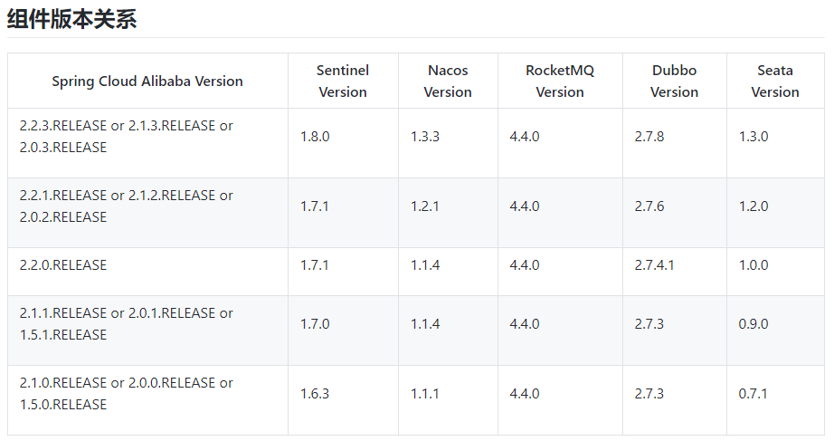

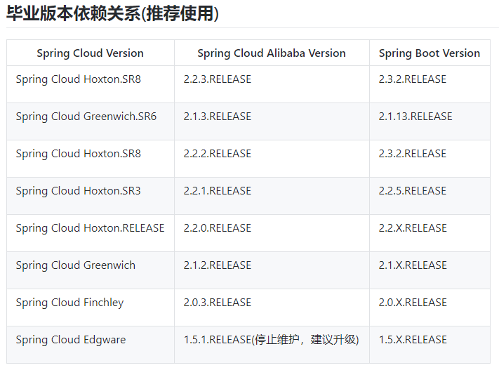

如果需要使用 Spring Cloud Greenwich 版本，在父工程`pom.xml`文件的`<dependencyManagement>`中添加如下内容：

```xml
<dependency>
    <groupId>com.alibaba.cloud</groupId>
    <artifactId>spring-cloud-alibaba-dependencies</artifactId>
    <version>2.1.2.RELEASE</version>
    <type>pom</type>
    <scope>import</scope>
</dependency>
```

在相应子工程中引入sentinel的依赖

```xml
<!-- Spring Cloud Alibaba Sentinel 依赖 -->
<dependency>
    <groupId>com.alibaba.cloud</groupId>
    <artifactId>spring-cloud-starter-alibaba-sentinel</artifactId>
</dependency>
```

#### 3.2.2. 配置启动参数

在相应工程的`application.yml`中添加开启`Sentinel`控制台配置信息，通过`spring.cloud.sentinel.transport.dashboard`属性配置控制台的请求路径。

```yml
spring:
  cloud:
    # Sentinel 相关配置
    sentinel:
      transport:
        dashboard: localhost:8080 # 配置sentinel控制台的请求地址
      eager: true # 取消Sentinel控制台懒加载，当服务启动时立即加载到控制台中
```

#### 3.2.3. 通过Sentinel控制台查看机器列表以及健康情况

默认情况下 Sentinel 会在客户端首次调用的时候才进行初始化，开始向控制台发送心跳包。也可以配置 `sentinel.eager=true`，取消Sentinel控制台懒加载。

*通过调用相关服务接口后，打开浏览器即可展示Sentinel的管理控制台，并且可以看到相应服务的列表以及相关信息*


### 3.3. Sentinel 对通用资源保护

#### 3.3.1. 基础说明

通用资源保护是指，无论是使用哪种远程调用的技术，只在需要被保护的方法上使用`@SentinelResource`注解进行熔断配置即可。与Hystrix不同的是，Sentinel对抛出异常和熔断降级做了更加细致的区分，通过`blockHandler`属性指定熔断降级方法；通过`fallback`属性指定触发异常执行的降级方法。

<font color=red>**特别注意：若`blockHandler`和`fallback`都进行了配置，则被限流降级而抛出`BlockException`时只会进入`blockHandler`处理逻辑。若未配置`blockHandler`、`fallback`和`defaultFallback`，则被限流降级时会将`BlockException`直接抛出。**</font>

#### 3.3.2. 使用示例

修改`shop-service-order-resttemplate`工程的`OrderController`，在方法上使用`@SentinelResource`注解增加熔断保护配置，并编写熔断、异常的降级方法

```java
@RestController
@RequestMapping("order")
public class OrderController {
    /* 日志对象 */
    private static final Logger LOGGER = LoggerFactory.getLogger(OrderController.class);

    // 注入HTTP请求工具类RestTemplate
    @Autowired
    private RestTemplate restTemplate;

    /*
     * @SentinelResource注解是用于指定需要熔断保护的方法上
     *  blockHandler属性：声明熔断时调用的降级方法
     *  fallback属性：声明抛出异常时执行的降级方法
     *  value属性：设置自定义的资源名称，如不设置，默认值是“当前全类名.方法名”
     */
    @SentinelResource(value = "createOrderById", blockHandler = "createOrderBlockHandler", fallback = "createOrderFallback")
    @PostMapping("/{id}")
    public String createOrder(@PathVariable Long id) {
        // 调用服务
        Product product = restTemplate.getForObject("http://shop-service-product/product/" + id, Product.class);
        LOGGER.info("当前下单的商品是: ${}", product);
        return "创建订单成功";
    }

    /*
     * 定义@SentinelResource注解相应的熔断降级方法，函数的要求：
     *  1.必须是public修饰
     *  2.返回类型与原方法一致
     *  3.参数类型需要和原方法相匹配，并在最后加BlockException类型的参数
     *  4.默认需和原方法在同一个类中。若希望使用其他类的函数，可配置blockHandlerClass属性，并指定blockHandlerClass里面的方法
     */
    public String createOrderBlockHandler(Long id, BlockException e) {
        LOGGER.info("当前下单的商品id是: ${}", id);
        e.printStackTrace();
        return "触发熔断的降级方法";
    }

    /*
     * 定义@SentinelResource注解相应的抛出异常的降级方法，函数的要求：
     *  1.返回类型与原方法一致
     *  2.参数类型需要和原方法相匹配，Sentinel 1.6开始，也可在方法最后加Throwable类型的参数
     *  3.默认需和原方法在同一个类中。若希望使用其他类的函数，可配置fallbackClass，并指定fallbackClass里面的方法
     */
    public String createOrderFallback(Long id, Throwable throwable) {
        LOGGER.info("当前下单的商品id是: ${}", id);
        throwable.printStackTrace();
        return "抛出异常执行的降级方法";
    }
}
```

#### 3.3.3. @SentinelResource注解的相关属性

|        属性名         |                                                                                                                                                                                            作用                                                                                                                                                                                             |              取值              |
| :------------------: | ------------------------------------------------------------------------------------------------------------------------------------------------------------------------------------------------------------------------------------------------------------------------------------------------------------------------------------------------------------------------------------------ | ------------------------------ |
|       `value`        | 资源名称                                                                                                                                                                                                                                                                                                                                                                                    |                                |
|     `entryType`      | entry类型，标记流量的方向，默认值是`EntryType.OUT`                                                                                                                                                                                                                                                                                                                                             | `EntryType.IN`/`EntryType.OUT` |
|    `resourceType`    | 1.7版本属性                                                                                                                                                                                                                                                                                                                                                                                 |                                |
|    `blockHandler`    | 处理BlockException的函数名称。函数要求：<br/>1.必须是`public`修饰<br/>2.返回类型与原方法一致<br/>3.参数类型需要和原方法相匹配，并在最后加`BlockException`类型的参数<br/>4.默认需和原方法在同一个类中。若希望使用其他类的函数，可配置`blockHandlerClass`属性，并指定`blockHandlerClass`里面的方法                                                                                                                |                                |
| `blockHandlerClass`  | 存放`blockHandler`的类。对应的处理函数必须`static`修饰，否则无法解析，其他要求同见`blockHandler`                                                                                                                                                                                                                                                                                                  | `Class<?>[]`                   |
|      `fallback`      | 用于在抛出异常的时候提供fallback处理逻辑。`fallback`函数可以针对所有类型的异常（除了`exceptionsToIgnore`里面排除掉的异常类型）进行处理。函数要求：<br/>1.返回类型与原方法一致<br/>2.参数类型需要和原方法相匹配，Sentinel 1.6开始，也可在方法最后加`Throwable`类型的参数<br/>3.默认需和原方法在同一个类中。若希望使用其他类的函数，可配置`fallbackClass`，并指定`fallbackClass`里面的方法                                 |                                |
|  `defaultFallback`   | 1.6版本属性。用于通用的`fallback`逻辑。默认`fallback`函数可以针对所有类型的异常（除了`exceptionsToIgnore`里面排除掉的异常类型）进行处理。若同时配置了`fallback`和`defaultFallback`，以`fallback`为准。函数要求：<br/>1.返回类型与原方法一致<br/>2.方法参数列表为空，或者有一个`Throwable`类型的参数<br/>3.默认需要和原方法在同一个类中。若希望使用其他类的函数，可配置`fallbackClass`，并指定`fallbackClass`里面的方法。 |                                |
|   `fallbackClass`    | 1.6版本属性。存放`fallback`的类。对应的处理函数必须`static`修饰，否则无法解析，其他要求同见`fallback`                                                                                                                                                                                                                                                                                              | `Class<?>[]`                   |
| `exceptionsToTrace`  | 需要trace的异常                                                                                                                                                                                                                                                                                                                                                                              | `Class<? extends Throwable>[]` |
| `exceptionsToIgnore` | 1.6版本属性。指定排除掉哪些异常。排除的异常不会计入异常统计，也不会进入fallback逻辑，而是原样抛出                                                                                                                                                                                                                                                                                                    | `Class<? extends Throwable>[]` |

> 注：1.6.0之前的版本`fallback`函数只针对降级异常（`DegradeException`）进行处理，<font color=red>**不能针对业务异常进行处理**</font>。

#### 3.3.4. 测试

直接通过控制台方式添加/修改降级规则如下：

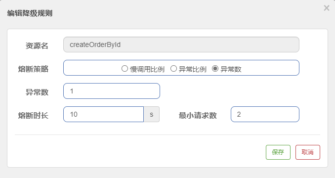

测试结果：使用post请求`http://127.0.0.1:9002/order/1`成功，然后请求`http://127.0.0.1:9002/order/2`两次后都执行了异常处理的方法，此时再次请求`http://127.0.0.1:9002/order/1`，会执行熔断方法，等待10s后，再次请求就会恢复成功响应

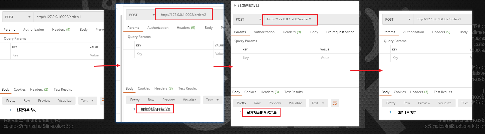

#### 3.3.5. Sentinel 加载本地配置

**一条限流规则主要由下面几个因素组成**：

- `resource`：资源名，即限流规则的作用对象
- `count`：限流阈值
- `grade`：限流阈值类型（QPS 或并发线程数）
- `limitApp`：流控针对的调用来源，若为`default`则不区分调用来源
- `strategy`：调用关系限流策略
- `controlBehavior`：流量控制效果（直接拒绝、Warm Up、匀速排队）

Sentinel可以通过控制台的方式修改相应服务的降级规则等相关参数。

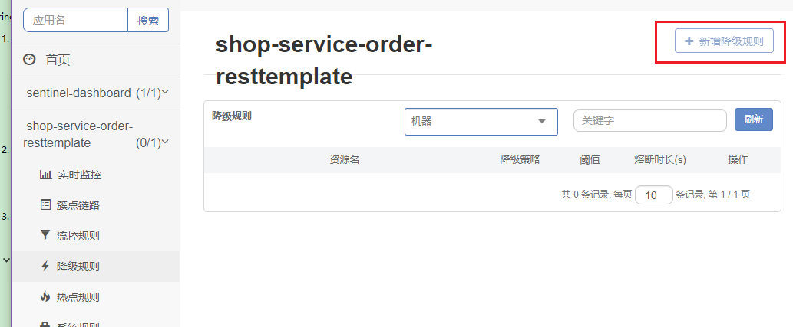

但会存在一定问题，因为通过控制台新增/修改的规则配置，都保存在相应服务的内存中，如果此服务重启后，内存中这些配置都没有了。所以一般都会将相应的Sentinel规则保存在本地文件，然后设置Sentinel加载本地配置。实现本地配置的步骤如下：

1. 修改服务工程的`application.yml`配置文件，增加以下配置

```properties
# 配置Sentinel读取本地文件配置限流规则
spring.cloud.sentinel.datasource.ds1.file.file=classpath: flowrule.json
spring.cloud.sentinel.datasource.ds1.file.data-type=json
spring.cloud.sentinel.datasource.ds1.file.rule-type=flow
```

```yml
spring:
  cloud:
    # Sentinel 相关配置
    sentinel:
      # 配置Sentinel读取本地文件配置限流规则
      datasource:
        ds1:
          file:
            file: classpath:flowrule.json
            data-type: json
            rule-type: flow
```

2. 在工程的`resources`目录下，创建`flowrule.json`文件，具体配置内容如下：

```json
[
  {
    "resource": "orderFindById",
    "controlBehavior": 0,
    "count": 1,
    "grade": 1,
    "limitApp": "default",
    "strategy": 0
  }
]
```

> *注意：其中`resource`字段是相应需要保存的资源（接口）的名称，即`@SentinelResource`注解中配置的`value`属性值*
>
> 相应的可设置项参考`sentinel-core`包下的`com.alibaba.csp.sentinel.slots.block.RuleConstant`类

3. 启动服务，在Sentinel控制台可以看到相应的配置

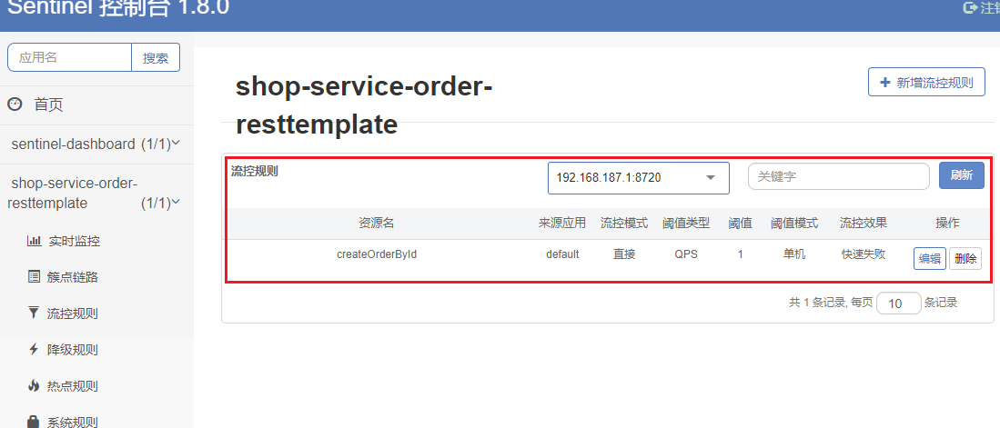

### 3.4. RestTemplate 基于 Sentinel 实现熔断

#### 3.4.1. 基础说明

Spring Cloud Alibaba Sentinel 支持对 `RestTemplate` 的服务调用使用 Sentinel 进行保护，在构造`RestTemplate`对象的时候需要加上 `@SentinelRestTemplate` 注解即可

```java
@Bean
@SentinelRestTemplate(blockHandler = "handleException", blockHandlerClass = ExceptionUtil.class)
public RestTemplate restTemplate() {
    return new RestTemplate();
}
```

`@SentinelRestTemplate`注解的属性支持限流(`blockHandler`，`blockHandlerClass`)和降级(`fallback`，`fallbackClass`)的处理。其中`blockHandler`或`fallback`属性对应的方法必须是对应`blockHandlerClass`或`fallbackClass`属性中的静态方法。

该方法的参数跟返回值跟`org.springframework.http.client.ClientHttpRequestInterceptor#interceptor`方法一致，其中参数多出了一个`BlockException`参数用于获取Sentinel捕获的异常。

比如上述 `@SentinelRestTemplate` 注解中 `ExceptionUtil` 的 `handleException` 属性对应的方法声明如下：

```java
public class ExceptionUtil {
    public static ClientHttpResponse handleException(HttpRequest request, byte[] body, ClientHttpRequestExecution execution, BlockException exception) {
        ...
    }
}
```

#### 3.4.2. 使用示例

1. 修改`shop-service-order-resttemplate`工程的配置类`HttpConfig`，在创建`RestTemplate`对象方法上增加``@SentinelRestTemplate`注解

```java
@LoadBalanced
@Bean("restTemplate")
/*
 * @SentinelRestTemplate注解表示使用Sentinel对象RestTemplate的支持
 *  blockHandler属性：指定熔断时降级方法
 *  blockHandlerClass属性：指定熔断降级配置类
 *  fallback属性：指定异常时降级方法
 *  fallbackClass属性：指定异常限级配置类
 */
@SentinelRestTemplate(blockHandler = "handleBlock", blockHandlerClass = ExceptionUtil.class,
        fallback = "handleFallback", fallbackClass = ExceptionUtil.class)
public RestTemplate createRestTemplate() {
    return new RestTemplate();
}
```

2. 创建处理熔断降级的处理类`ExceptionUtil`，在此类中定义相应的熔断、异常降级方法

```java
package com.moon.order.exception;

import com.alibaba.cloud.sentinel.rest.SentinelClientHttpResponse;
import com.alibaba.csp.sentinel.slots.block.BlockException;
import org.slf4j.Logger;
import org.slf4j.LoggerFactory;
import org.springframework.http.HttpRequest;
import org.springframework.http.client.ClientHttpRequestExecution;

/**
 * Sentinel 对 RestTemplate 支持的熔断降级处理类
 * 其中 blockHandler 或 fallback 属性对应的方法必须是对应 blockHandlerClass 或 fallbackClass 属性中的静态方法。
 * 1. 熔断与异常的处理方法都必须为static修饰的静态方法
 * 2. 方法的返回值必须为SentinelClientHttpResponse对象
 * 3. 方法的形参为 HttpRequest request, byte[] body, ClientHttpRequestExecution execution, BlockException ex
 * <p>
 * 即该方法的参数跟返回值跟 org.springframework.http.client.ClientHttpRequestInterceptor#interceptor 方法一致，
 * 其中参数多出了一个 BlockException 参数用于获取 Sentinel 捕获的异常。
 */
public class ExceptionUtil {
    /* 日志对象 */
    private static final Logger LOGGER = LoggerFactory.getLogger(ExceptionUtil.class);

    // 熔断降级业务逻辑
    public static SentinelClientHttpResponse handleBlock(HttpRequest request, byte[] body,
                                                         ClientHttpRequestExecution execution, BlockException ex) {
        LOGGER.error("熔断降级业务逻辑：${}", ex.getClass().getCanonicalName());
        return new SentinelClientHttpResponse("handleBlock");
    }

    // 异常降级业务逻辑
    public static SentinelClientHttpResponse handleFallback(HttpRequest request, byte[] body,
                                                            ClientHttpRequestExecution execution, BlockException ex) {
        LOGGER.error("异常降级业务逻辑：${}", ex.getClass().getCanonicalName());
        return new SentinelClientHttpResponse("handleFallback");
    }
}
```

3. 在Sentinel控制台中配置相应的接口限流规则。Sentinel RestTemplate 限流的资源规则提供两种粒度：
    - `httpmethod:schema://host:port/path`：协议、主机、端口和路径
    - `httpmethod:schema://host:port`：协议、主机和端口

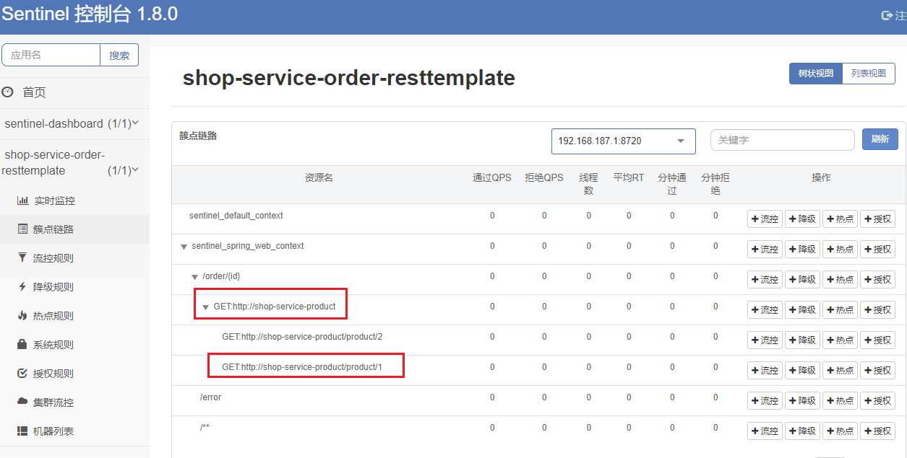

设置相应的“流控”模块，发送测试测试，观察后台日志是否实现熔断降级

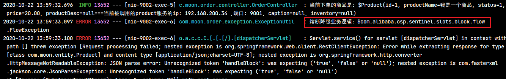

#### 3.4.3. @SentinelRestTemplate 相关属性

|        属性名        |       作用       |    取值    |
| :-----------------: | ---------------- | ---------- |
|   `blockHandler`    | 指定熔断时降级方法 |            |
| `blockHandlerClass` | 指定熔断降级配置类 | `Class<?>` |
|     `fallback`      | 指定异常时降级方法 |            |
|   `fallbackClass`   | 指定异常限级配置类 | `Class<?>` |
|    `urlCleaner`     |                  |            |
|  `urlCleanerClass`  |                  | `Class<?>` |

### 3.5. Feign 基于 Sentinel 实现熔断

#### 3.5.1. 基础说明

Sentinel适配了`OpenFeign`组件。如果想使用，除了引入 `sentinel-starter` 的依赖外还需要2个步骤：

- 配置文件打开sentinel对feign的支持：`feign.sentinel.enabled=true`
- 加入 `openfeign starter` 依赖使 `sentinel starter` 中的自动化配置类生效：

> 注：Feign 对应的接口中的资源名策略定义：`httpmethod:protocol://requesturl`。`@FeignClient` 注解中的所有属性，Sentinel 都做了兼容。
>
> 下面示例的`ProductFeginClient`接口中方法 `findById` 对应的资源名为 `GET:http://shop-service-product/product/{str}`

#### 3.5.2. 使用示例

1. 引入依赖`openfeign`与`sentinel`的依赖

```xml
<!-- SpringCloud整合的openFeign -->
<dependency>
    <groupId>org.springframework.cloud</groupId>
    <artifactId>spring-cloud-starter-openfeign</artifactId>
</dependency>
<!-- Spring Cloud Alibaba Sentinel 依赖 -->
<dependency>
    <groupId>com.alibaba.cloud</groupId>
    <artifactId>spring-cloud-starter-alibaba-sentinel</artifactId>
</dependency>
```

2. 在工程的`application.yml`中开启 sentinel 对 feign 的支持

```yml
# feign 配置
feign:
  sentinel:
    enabled: true # 激活sentinel的支持
```

3. 和使用Hystrix的方式基本一致，配置FeignClientr接口，在接口标识`@FeignClient`注解，通过`name`属性指定服务名称以及通过`fallback`属性指定处理熔断降级实现类

```java
@FeignClient(name = "shop-service-product", fallback = ProductFeignClientCallBack.class)
public interface ProductFeignClient {
    ....
}
```

4. 和使用Hystrix一样，编写熔断处理类

```java
@Component
public class ProductFeignClientCallBack implements ProductFeignClient {
    /* 日志对象 */
    private static final Logger LOGGER = LoggerFactory.getLogger(ProductFeignClientCallBack.class);

    /**
     * 此方法为ProductFeignClient接口中相应方法的降级实现
     *
     * @param id
     * @return
     */
    @Override
    public Product findById(Long id) {
        LOGGER.info("当前下单商品的id是: " + id + "，触发ProductFeignClientCallBack类中熔断的findById降级方法");
        Product product = new Product();
        product.setProductName("feign调用触发熔断降级方法");
        return product;
    }
}
```

5. 测试，修改资源相应的降级规则，测试的结果与Hystrix一样

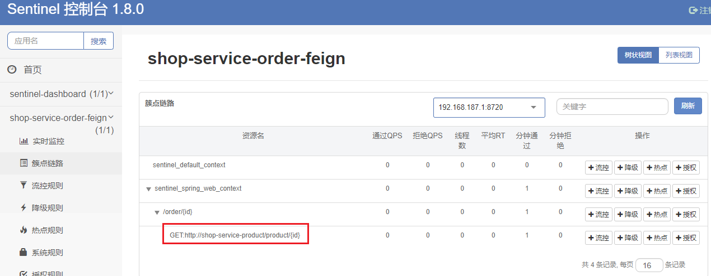
