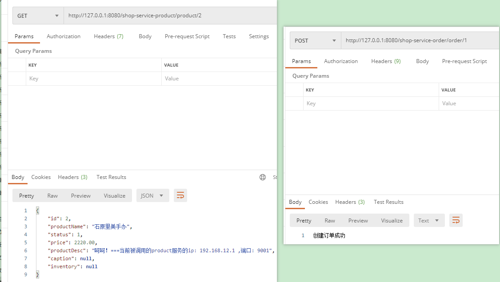

# Spring Cloud Gateway 微服务网关

Spring Cloud Netflix Zuul 1.x 是一个基于阻塞 IO 的 API Gateway 以及 Servlet；直到2018年5月，Zuul 2.x（基于Netty，也是非阻塞的，支持长连接）才发布，但 Spring Cloud 暂时还没有整合计划。Spring Cloud Gateway 比 Zuul 1.x 系列的性能和功能整体要好。

## 1. Spring Cloud Gateway 是什么

### 1.1. 简述

Spring Cloud Gateway 是 Spring 官方基于 Spring 5.0，Spring Boot 2.0 和 Project Reactor 等技术开发的网关，旨在为微服务架构提供一种简单而有效的统一的 API 路由管理方式，统一访问接口。Spring Cloud Gateway 作为 Spring Cloud 生态系中的网关，目标是替代 Netflix ZUUL，其不仅提供统一的路由方式，并且基于 Filter 链的方式提供了网关基本的功能，例如：安全，监控/埋点，限流等。它是基于Nttey的响应式开发模式。

> Spring Cloud Gateway官方文档：https://spring.io/projects/spring-cloud-gateway#overview

|         组件         | RPS(request per second) |
| :------------------: | ----------------------- |
| Spring Cloud Gateway | Requests/sec: 32213.38  |
|       Zuul 1.x       | Requests/sec: 20800.13  |

上表为Spring Cloud Gateway与Zuul的性能对比，从结果可知，Spring Cloud Gateway的RPS是Zuul的1.6倍

### 1.2. 优缺点

优点：

- 性能强劲：是第一代网关Zuul的1.6倍
- 功能强大：内置了很多实用的功能，例如转发、监控、限流等
- 设计优雅，容易扩展

缺点：

- 其实现依赖Netty与WebFlux，不是传统的Servlet编程模型，学习成本高
- 不能将其部署在Tomcat、Jetty等Servlet容器里，只能打成jar包执行
- 需要Spring Boot 2.0及以上的版本，才支持

### 1.3. 核心概念

**路由（route）**：路由是网关最基础的部分，表示一个具体的路由信息载体。路由信息由一个ID、一个目的地URI、排序order、一组断言工厂和一组Filter组成。如果断言为真，则说明请求URL和配置的路由匹配。


- id，路由标识符，区别于其他 Route。
- uri，路由指向的目的地 uri，即客户端请求最终被转发到的微服务。
- order，用于多个 Route 之间的排序，数值越小排序越靠前，匹配优先级越高。
- **predicates（断言）**：Java8中的断言函数，断言的作用是进行条件判断，只有断言都返回真，才会真正的执行路由。Spring Cloud Gateway中的断言函数输入类型是Spring5.0框架中的`ServerWebExchange`。Spring Cloud Gateway中的断言函数允许开发者去定义匹配来自Http Request中的任何信息，比如请求头和参数等。
- **filter（过滤器）**：一个标准的Spring WebFilter，Spring Cloud Gateway中的Filter分为两种类型，分别是`Gateway Filter`和`Global Filter`。过滤器`Filter`可以对请求和响应进行处理。

## 2. Spring Cloud Gateway 基础入门案例

> 复用`11-springcloud-zuul`工程的代码，删除zuul网关工程，创建`12-springcloud-gateway`

### 2.1. 创建工程导入依赖

在`12-springcloud-gateway`项目中添加新的模块`shop-server-gateway`，并导入依赖

```xml
<!--
    Spring Cloud Gateway 服务网关的核心依赖
    注意：SpringCloud Gateway 内部使用的web框架为 netty + webflux
        webflux 与 spring-boot-starter-web 依赖存在冲突
 -->
<dependency>
    <groupId>org.springframework.cloud</groupId>
    <artifactId>spring-cloud-starter-gateway</artifactId>
</dependency>
```

<font color=red>**注意：SpringCloud Gateway 内部使用的web框架为netty + webflux，和SpringMVC不兼容。引入的限流组件是hystrix。redis底层不再使用jedis，而是lettuce**</font>

### 2.2. 配置启动类

```java
@SpringBootApplication
public class GatewayServerApplication {
    public static void main(String[] args) {
        SpringApplication.run(GatewayServerApplication.class, args);
    }
}
```

> *注：Spring Cloud Gateway 组件不需要配置任何注解即可开启*

### 2.3. 配置路由

创建 `application.yml` 配置文件，配置gateway的路由

```yml
server:
  port: 8080 # 项目端口
spring:
  application:
    name: shop-server-gateway # 服务名称
  cloud:
    # Spring Cloud Gateway 配置
    gateway:
      # 配置路由（包含的元素：路由id、路由到微服务的uri，断言【判断条件】）
      routes:
        # 路由配置都是多个，所以此处是一个数组
        - id: shop-service-product # 路由id
          uri: http://127.0.0.1:9001 # 路由到微服务的uri
          predicates:
            # 注意此path属性与zuul的path属性不一样，zuul只会将/**部分拼接到uri后面，而gateway会将全部拼接到uri后面
            - Path=/product/** # 断言，此处访问 http://127.0.0.1:8080/product/1 就会路由到 http://127.0.0.1:9001/product/1
```

配置属性说明：

- `id`：路由id，保证唯一即可
- `uri`：目标服务地址
- `predicates`：路由条件。Predicate 接受一个输入参数，返回一个布尔值结果。该接口包含多种默认方法来将 Predicate 组合成其他复杂的逻辑（比如：与，或，非）

上面示例的配置解释：配置了一个`id`为`shop-service-product`的路由规则，当访问网关请求地址以`product`开头时，会自动转发到地址：`http://127.0.0.1:9001/product/xxx`。配置完成启动项目即可在浏览器访问进行测试

## 3. 路由配置规则

### 3.1. 路由断言功能

Spring Cloud Gateway 的功能很强大，其内置了很多 `Predicates` 功能。在 Spring Cloud Gateway 中 Spring 利用 Predicate 的特性实现了各种路由匹配规则，可以通过`Header`、请求参数等不同的条件来进行作为条件匹配到对应的路由。


#### 3.1.1. 路由断言 - After

`After`的路由判断规则，用于匹配在指定日期时间之后发生的请求

```yml
spring:
  cloud:
    gateway:
      routes:
      - id: after_route
        uri: https://example.org
        predicates:
        # 路由断言匹配在指定日期时间之后发生的请求
        - After=2017-01-20T17:42:47.789-07:00[America/Denver]
```

#### 3.1.2. 路由断言 - Before

`Before`的路由判断规则，用于匹配在指定日期时间之前发生的请求

```yml
spring:
  cloud:
    gateway:
      routes:
      - id: before_route
        uri: https://example.org
        predicates:
        # 路由断言匹配在指定日期时间之前发生的请求
        - Before=2017-01-20T17:42:47.789-07:00[America/Denver]
```


#### 3.1.3. 路由断言 - Between

`Between`的路由判断规则，用于两个指定日期时间之间发生的请求

```yml
spring:
  cloud:
    gateway:
      routes:
      - id: between_route
        uri: https://example.org
        predicates:
        # 路由断言匹配在指定两个日期时间之间发生的请求
        - Between=2017-01-20T17:42:47.789-07:00[America/Denver], 2017-01-21T17:42:47.789-07:00[America/Denver]
```

#### 3.1.4. 路由断言 - Cookie

`Cookie`的路由判断规则，用于Cookie匹配，此predicate匹配给定名称(`chocolate`)和正则表达式(`ch.p`)

```yml
spring:
  cloud:
    gateway:
      routes:
      - id: cookie_route
        uri: https://example.org
        predicates:
        - Cookie=chocolate, ch.p
```

#### 3.1.5. 路由断言 - Header

`Header`的路由判断规则，用于Header匹配，header名称匹配`X-Request-Id`，且正则表达式匹配`\d+`

```yml
spring:
  cloud:
    gateway:
      routes:
      - id: header_route
        uri: https://example.org
        predicates:
        - Header=X-Request-Id, \d+
```

#### 3.1.6. 路由断言 - Host

`Host`的路由判断规则，用于Host匹配，匹配指定的Host主机列表，`**`代表可变参数

```yml
spring:
  cloud:
    gateway:
      routes:
      - id: host_route
        uri: https://example.org
        predicates:
        - Host=**.somehost.org,**.anotherhost.org
```

#### 3.1.7. 路由断言 - Method

`Method`的路由判断规则，用于请求Method匹配，匹配的是请求的HTTP方法

```yml
spring:
  cloud:
    gateway:
      routes:
      - id: method_route
        uri: https://example.org
        predicates:
         # 如果请求方法是GET或POST，则匹配路由
        - Method=GET,POST
```

#### 3.1.8. 路由断言 - Path

`Path`的路由判断规则，用于请求url匹配，`{segment}`为可变参数

```yml
spring:
  cloud:
    gateway:
      routes:
      - id: path_route
        uri: https://example.org
        predicates:
        - Path=/red/{segment},/blue/{segment}
```

#### 3.1.9. 路由断言 - Query

`Query`的路由判断规则，用于匹配请求参数，将请求的参数`param(green)`进行匹配，也可以进行regexp正则表达式匹配 (参数包含`red`，并且`red`的值匹配`green`或者`greet`都可以 )

```yml
spring:
  cloud:
    gateway:
      routes:
      - id: query_route
        uri: https://example.org
        predicates:
        # 请求包含绿色查询参数，则匹配路由
        - Query=green
        # 请求包含red的请求参数，并且值为gree时，匹配路由；如进行regexp正则表达式匹配，则green或者greet均匹配
        #- Query=red, gree.
```

#### 3.1.10. 路由断言 - RemoteAddr

`RemoteAddr`的路由判断规则，用于远程IP地址匹配，将匹配`192.168.1.1`~`192.168.1.254`之间的ip地址，其中`24`为子网掩码位数即`255.255.255.0`

```yml
spring:
  cloud:
    gateway:
      routes:
      - id: remoteaddr_route
        uri: https://example.org
        predicates:
        # 匹配192.168.1.1~192.168.1.254之间的ip地址
        - RemoteAddr=192.168.1.1/24
```

#### 3.1.11. 路由断言 - Weight

`Weight`的路由判断规则，用于请求权重匹配。其中有两个参数`group`和`weight`，均为int数值类型，用于计算权重

```yml
spring:
  cloud:
    gateway:
      routes:
      - id: weight_high
        uri: https://weighthigh.org
        predicates:
        - Weight=group1, 8
      - id: weight_low
        uri: https://weightlow.org
        predicates:
        - Weight=group1, 2
```

以上示例配置表示：会将大约80％的流量转发到weighthigh.org，将大约20％的流量转发到weightlow.org。

### 3.2. 动态路由

和 zuul 网关类似，在 Spring Cloud GateWay 组件也支持动态路由：即自动的从注册中心中获取服务列表并访问

#### 3.2.1. 基于 Eureka 注册中心动态获取路由

##### 3.2.1.1. 添加注册中心依赖（Eureka）

在`12-springcloud-gateway`工程的pom文件中添加注册中心的客户端依赖（此示例以Eureka做为注册中心）

```xml
<dependency>
    <groupId>org.springframework.cloud</groupId>
    <artifactId>spring-cloud-starter-netflix-eureka-client</artifactId>
</dependency>
```

##### 3.2.1.2. 配置动态路由

修改 `application.yml` 配置文件，添加eureka注册中心的相关配置，并修改访问映射的URL为服务名称

```yml
spring:
  cloud:
    # Spring Cloud Gateway 配置
    gateway:
      # 配置路由（包含的元素：路由id、路由到微服务的uri，断言【判断条件】）
      routes:
        # 路由配置都是多个，所以此处是一个数组
        - id: shop-service-product # 路由id
          uri: lb://shop-service-product # 方式二：根据微服务名称从注册中心拉取服务的地址与端口，格式： lb://服务名称（服务在注册中心上注册的名称）
          predicates:
            # 注意此path属性与zuul的path属性不一样，zuul只会将/**部分拼接到uri后面，而gateway会将全部拼接到uri后面
            - Path=/product/** # 断言，此处访问 http://127.0.0.1:8080/product/1 就会路由到 http://127.0.0.1:9001/product/1

# Eureka 配置
eureka:
  instance:
    prefer-ip-address: true # 将当前服务的ip地址注册到Eureka服务中
    instance-id: ${spring.application.name}:${server.port}  # 指定实例id
  client:
    service-url:
      defaultZone: http://localhost:8001/eureka/ # Eureka server 地址，多个eureka server之间用,隔开
```

<font color=red>**配置动态路由要点：配置uri属性以`lb://`开头（lb代表从注册中心获取服务），后面接的就是需要转发到的服务名称**</font>

测试访问网关请求地址以`product`开头时，会通过注册中心获取转发的地址，自动转发到地址：`http://127.0.0.1:9001/product/xxx`。配置完成启动项目即可在浏览器访问进行测试

#### 3.2.2. 基于 Nacos 注册中心动态获取路由

##### 3.2.2.1. 添加注册中心依赖（Nacos）

在`spring-cloud-alibaba-2.1.x-sample\api-gateway`工程的 pom 文件中添加注册中心的客户端依赖（此示例以 Nacos 做为注册中心）

```xml
<!-- nacos 客户端 -->
<dependency>
    <groupId>com.alibaba.cloud</groupId>
    <artifactId>spring-cloud-starter-alibaba-nacos-discovery</artifactId>
</dependency>
```

##### 3.2.2.2. 开启 nacos 客户端

在项目启动类或者配置上添加注解 `@EnableDiscoveryClient`，开启 nacos 客户端

```java
@SpringBootApplication
@EnableDiscoveryClient
public class ApiGatewayApplication {
    public static void main(String[] args) {
        SpringApplication.run(ApiGatewayApplication.class, args);
    }
}
```

##### 3.2.2.3. 配置动态路由

修改项目的 `application.yml` 配置文件，具体修改内容如下：

1. 添加 nacos 注册中心的相关配置，将网关服务注册到 nacos 中，
2. 修改访问映射的uri，改为注册中心上相应的服务名称

```yml
server:
  port: 7000 # 项目端口
spring:
  application:
    name: api-gateway # 服务名称
  cloud:
    # Spring Cloud Gateway 配置
    gateway:
      discovery:
        locator:
          enabled: true # 配置开启让 gateway 从 nacos 注册中心中获取服务信息列表
      # 配置路由数组（包含的元素：路由id、路由到微服务的uri，断言【判断条件】）
      routes:
        # 路由配置都是多个，所以此处是一个数组
        - id: service-product # 路由id
          # 方式二：根据微服务名称从注册中心拉取服务的地址与端口，格式： lb://服务名称（服务在注册中心上注册的名称）。
          # lb 是 Load Balance 的缩写，gateway 遵循实现了负载均衡策略
          uri: lb://service-product
          order: 1 # 路由的优先级,数字越小级别越高
          predicates: # 断言(就是路由转发要满足的条件)
            # 注意此path属性与zuul的path属性不一样，zuul只会将/**部分拼接到uri后面，而gateway会将全部拼接到uri后面
            # 断言，此处访问 http://127.0.0.1:7000/api-product/product/1 就会路由到 http://127.0.0.1:8081/api-product/product/1(在未配置RewritePath属性前、StripPrefix 过滤器之前)
            - Path=/api-product/**
          filters: # 过滤器，请求在传递过程中可以通过过滤器对其进行一定的修改
            - StripPrefix=1 # 此过滤器配置的作用是，在请求转发之前去掉第1层路径，即以上请求转化路径会变成 http://127.0.0.1:8081/product/1
    nacos:
      discovery:
        server-addr: 127.0.0.1:8848 # 配置 Nacos server 的地址，将网关服务注册到 nacos 中
```

### 3.3. 重写转发路径

在Spring Cloud Gateway中，路由转发是直接将匹配的路由（path）直接拼接到映射路径（uri）之后，那么在微服务开发中一般会通过RewritePath机制来进行路径重写。

#### 3.3.1. 官方文档示例

`RewritePath GatewayFilter factory`采用了路径的正则表达式参数和替换参数。通过正则表达式来提供了一种灵活的方式来重写请求路径。以下`RewritePath GatewayFilter`配置示例：

```yml
spring:
  cloud:
    gateway:
      routes:
      - id: rewritepath_route
        uri: https://example.org
        predicates:
        - Path=/red/**
        filters:
        - RewritePath=/red(?<segment>/?.*), $\{segment}
```

以上示例是：将请求路径`/red/blue`，在请求相应下游服务前，将请求路径重写成`/blue`。<font color=red>**请注意，由于YAML规范，应将`$`替换为`$\`**</font>

#### 3.3.2. 案例改造

修改`12-springcloud-gateway`工程`application.yml`配置文件，将匹配路径`Path`改为 `/shop-service-product/**`。重新启动网关服务，在浏览器访问`http://127.0.0.1:8080/shop-service-product/product/1`时会抛出404。这是由于路由转发规则默认转发到商品微服务（`http://127.0.0.1:9001/shop-service-product/product/1`）路径上，而商品微服务又没有`shop-service-product`对应的映射配置。

在配置文件中添加`RewritePath`属性重写转发路径规则，通过RewritePath配置重写转发的url，将`/shop-service-product/(?.*)`，重写为`{segment}`，然后转发到订单微服务。比如在网页上请求`http://localhost:8080/shop-service-product/product`，此时会将请求转发到`http://127.0.0.1:9001/product/1`（**需要注意的是在yml格式中`$`要写成`$\`**）

```yml
spring:
  application:
    name: shop-server-gateway # 服务名称
  cloud:
    # Spring Cloud Gateway 配置
    gateway:
      # 配置路由（包含的元素：路由id、路由到微服务的uri，断言【判断条件】）
      routes:
        # 路由配置都是多个，所以此处是一个数组
        - id: shop-service-product # 路由id
          uri: lb://shop-service-product # 方式二：根据微服务名称从注册中心拉取服务的地址与端口，格式： lb://服务名称（服务在注册中心上注册的名称）
          predicates:
            - Path=/shop-service-product/**
          filters: # 配置路由过滤器
            # 配置路径重写的过滤器，通过正则表达式将 http://127.0.0.1:8080/shop-service-product/product/2 重写为 http://127.0.0.1:9001/product/2（注：在yml格式中，$ 需要写写成 $\）
            - RewritePath=/shop-service-product/(?<segment>.*), /$\{segment}
```

> <font color=red>*注：属性名称对大小写敏感，在做示例的就将`Path`属性写成`path`，结果后台一直报错说无法映射路径*</font>


### 3.4. 简化路径配置，根据微服务名称转发请求

Spring Cloud Gateway提供了可以直接从注册中心，根据相应的服务名称来进行请求路径转发的简化配置

#### 3.4.1. 传统手动配置路由转发

在未配置开启从注册中心自动根据服务名称映射请求转发路径前，通过网关访问订单服务，会转发失败。因为没有配置相应服务的路由匹配规则


#### 3.4.2. 配置根据服务名称自动转发

```yml
spring:
  application:
    name: shop-server-gateway # 服务名称
  cloud:
    # Spring Cloud Gateway 配置
    gateway:
      # 配置自动根据注册中心的微服务名称进行路由转发
      discovery:
        locator:
          enabled: true # 开启根据服务名称自动转发，默认值是false
          lower-case-service-id: true # 配置微服务名称以小写的形式匹配，默认值是false，全大写
```

配置自动根据服务名称进行请求转发，**默认的匹配规则是：请求路径以服务名称开头，会自动匹配到相应服务的ip+端口，并且将服务名称以后的部分拼接到服务的url的后面**。此时访问相应微服务名称的路径时，请求会转发到相应的服务




## 4. 过滤器

Spring Cloud Gateway除了具备请求路由功能之外，也支持对请求的过滤。通过Zuul网关类似，也是通过过滤器的形式来实现的

### 4.1. 过滤器基础概述

#### 4.1.1. 过滤器的生命周期

Spring Cloud Gateway 的 `Filter` 的生命周期不像 Zuul 的那么丰富，它只有两个：“pre” 和 “post”

- `PRE`：这种过滤器在请求被路由之前调用。可利用这种过滤器实现身份验证、在集群中选择请求的微服务、记录调试信息等。
- `POST`：这种过滤器在路由到微服务以后执行。可用来为响应添加标准的 HTTP Header、收集统计信息和指标、将响应从微服务发送给客户端等。


#### 4.1.2. 过滤器类型

Spring Cloud Gateway 的 Filter 从作用范围可分为另外两种`GatewayFilter` 与 `GlobalFilter`。

- `GatewayFilter`（局部过滤器）：应用到单个路由或者一个分组的路由上。*如上面基础入门配置重写转发路径的示例，就是使用了`GatewayFilter`，只作用指定的路由配置上*
- `GlobalFilter`（全局过滤器）：应用到所有的路由上

### 4.2. 局部过滤器

#### 4.2.1. 简介

局部过滤器（`GatewayFilter`），是针对单个路由的过滤器。可以对访问的URL过滤，进行切面处理。在Spring Cloud Gateway中通过`GatewayFilter`的形式内置了很多不同类型的局部过滤器。

*注：一般在配置局部过滤器针对单个路由设置一些过滤规则时，都会使用Spring Cloud Gateway内置的过滤器*

#### 4.2.2. Spring Cloud Gateway 内置局部过滤器

|          过滤器工厂          |                                           作用                                           |                                参数                                |
| :-------------------------: | ---------------------------------------------------------------------------------------- | ----------------------------------------------------------------- |
|      AddRequestHeader       | 为原始请求添加Header                                                                      | Header的名称及值                                                   |
|     AddRequestParameter     | 为原始请求添加请求参数                                                                     | 参数名称及值                                                       |
|      AddResponseHeader      | 为原始响应添加Header                                                                      | Header的名称及值                                                   |
|    DedupeResponseHeader     | 剔除响应头中重复的值                                                                       | 需要去重的Header名称及去重策略                                       |
|           Hystrix           | 为路由引入Hystrix的断路器保护                                                              | `HystrixCommand`的名称                                             |
|       FallbackHeaders       | 为fallbackUri的请求头中添加具体的异常信息                                                   | Header的名称                                                       |
|         PrefixPath          | 为原始请求路径添加前缀                                                                     | 前缀路径                                                           |
|     PreserveHostHeader      | 为请求添加一个`preserveHostHeader=true`的属性，路由过滤器会检查该属性以决定是否要发送原始的Host | 无                                                                |
|     RequestRateLimiter      | 用于对请求限流，限流算法为令版桶                                                            | keyResolver、rateLimiter、statusCode、denyEmptyKey、emptyKeyStatus |
|         RedirectTo          | 将原始请求重定向到指定的UR                                                                 | http状态码及重定向的url                                             |
| RemoveHopByHopHeadersFilter | 为原始请求删除IETF组织规定的一系列Header                                                    | 默认就会启用，可以通过配置指定仅删除哪些Header                         |
|     RemoveRequestHeader     | 为原始请求删除某个Header                                                                   | Header名称                                                         |
|    RemoveResponseHeader     | 为原始响应删除某个Header                                                                   | Header名称                                                         |
|         RewritePath         | 重写原始的请求路径                                                                         | 原始路径正则表达式以及重写后路径的正则表达式                           |
|    RewriteResponseHeader    | 重写原始响应中的某个Header                                                                 | Header名称，值的正则表达式，重写后的值                                |
|         SaveSession         | 在转发请求之前，强制执行`WebSession::save`操作                                              | 无                                                                |
|        secureHeaders        | 为原始响应添加一系列起安全作用的响应头                                                       | 无，支持修改这些安全响应头的值                                       |
|           SetPath           | 修改原始的请求路径                                                                         | 修改后的路径                                                       |
|      SetResponseHeader      | 修改原始响应中某个Header的值                                                               | Header名称，修改后的值                                              |
|          SetStatus          | 修改原始响应的状态码                                                                       | HTTP 状态码，可以是数字，也可以是字符串                               |
|         StripPrefix         | 用于截断原始请求的路径                                                                     | 使用数字表示要截断的路径的数量                                       |
|            Retry            | 针对不同的响应进行重试                                                                     | retries、statuses、methods、series                                 |
|         RequestSize         | 设置允许接收最大请求包的大小。如果请求包大小超过设置的值，则返回`413 Payload Too Large`         | 请求包大小，单位为字节，默认值为5M                                    |
|      ModifyRequestBody      | 在转发请求之前修改原始请求体内容                                                            | 修改后的请求体内容                                                  |
|     ModifyResponseBody      | 修改原始响应体的内容                                                                       | 修改后的响应体内容                                                  |

以上每个过滤器工厂都对应一个实现类，并且这些类的名称必须以`GatewayFilterFactory`结尾，这是Spring Cloud Gateway的一个约定，例如`AddRequestHeader`对应的实现类为`AddRequestHeaderGatewayFilterFactory`。对于这些过滤器的使用方式可以参考官方文档

> 官方内置过滤器参考(2.2.5.RELEASE版本)：https://docs.spring.io/spring-cloud-gateway/docs/2.2.5.RELEASE/reference/html/#gatewayfilter-factories

### 4.3. 全局过滤器

#### 4.3.1. 简介

全局过滤器（`GlobalFilter`）作用于所有路由，Spring Cloud Gateway 定义了`GlobalFilter`接口，可以自定义实现自己的`GlobalFilter`。通过全局过滤器可以实现对权限的统一校验，安全性验证等功能，并且全局过滤器也是使用比较多的过滤器。

#### 4.3.2. Spring Cloud Gateway 内置全局过滤器

Spring Cloud Gateway内部也是通过一系列的内置全局过滤器对整个路由转发进行处理如下：


#### 4.3.3. 自定义全局过滤器案例 - 统一鉴权

Spring Cloud Gateway内置的过滤器已经可以完成大部分的功能，但是对于企业开发的一些业务功能处理，还是需要自己编写过滤器来实现的，下面示例通过自定义一个全局过滤器，完成统一的权限校验。

##### 4.3.3.1. 鉴权逻辑

实现项目开发中的鉴权逻辑一般如下：

- 当客户端第一次请求服务时，服务端对用户进行信息认证（登录）
- 认证通过，将用户信息进行加密形成token，返回给客户端，作为登录凭证
- 以后每次请求，客户端都携带认证的token
- 服务端对token进行解密，判断是否有效。


如上图所示，对于验证用户是否已经登录鉴权的过程可以在网关层统一检验。检验的标准就是请求中是否携带token凭证以及token的正确性。

##### 4.3.3.2. 案例实现

在`12-springcloud-gateway`工程，定义全局过滤器`AuthorizeFilter`，实现`GlobalFilter`与`Ordered`接口。主要逻辑是去校验所有请求的请求参数中是否包含“token”，如果不包含请求参数“token”则不转发路由，否则执行正常的逻辑。

```java
package com.moon.gateway.filter;

import org.slf4j.Logger;
import org.slf4j.LoggerFactory;
import org.springframework.cloud.gateway.filter.GatewayFilterChain;
import org.springframework.cloud.gateway.filter.GlobalFilter;
import org.springframework.core.Ordered;
import org.springframework.http.HttpStatus;
import org.springframework.http.server.reactive.ServerHttpRequest;
import org.springframework.http.server.reactive.ServerHttpResponse;
import org.springframework.stereotype.Component;
import org.springframework.util.StringUtils;
import org.springframework.web.server.ServerWebExchange;
import reactor.core.publisher.Mono;

/**
 * Spring Cloud Gateway 自定义一个全局过滤器，需要实现 GlobalFilter, Ordered接口
 */
@Component // 要自定义全局过滤器生效，需要将全局过滤器注册到spring容器中
public class AuthorizeFilter implements GlobalFilter, Ordered {

    /* 日志对象 */
    private static final Logger LOGGER = LoggerFactory.getLogger(AuthorizeFilter.class);

    /**
     * 此方法是过滤器执行的主要逻辑
     *
     * @param exchange ServerWebExchange是当前请求和响应的上下文对象，存放着重要的请求-响应属性、请求实例和响应实例等等。(相当于zuul中的RequestContext)
     * @param chain
     * @return
     */
    @Override
    public Mono<Void> filter(ServerWebExchange exchange, GatewayFilterChain chain) {
        LOGGER.info("自定义全局过滤器AuthorizeFilter开始执行了....");
        // 通过ServerWebExchange对象可以获取请求与响应实例
        ServerHttpRequest request = exchange.getRequest();
        ServerHttpResponse response = exchange.getResponse();

        // 获取请求头中access-token字段
        String token = request.getHeaders().getFirst("access-token");

        // 简单的模拟校验
        if (StringUtils.isEmpty(token)) {
            // 如果请求头不包含Authorization，则认证失败。记录一下日志
            LOGGER.error("请求{}, 登陆认证失败", request.getURI());
            // 设置响应状态码
            response.setStatusCode(HttpStatus.UNAUTHORIZED);
            // 设置请求结束
            return response.setComplete();
        }

        // 如果认证通过，需要调用 chain.filter() 方法才继续向下游执行
        return chain.filter(exchange);
    }

    /**
     * 指定过滤器的执行顺序。返回值越小，执行优先级越高
     *
     * @return
     */
    @Override
    public int getOrder() {
        return 0;
    }
}
```

示例相关说明：

- 自定义全局过滤器需要实现`GlobalFilter`和`Ordered`接口
- `filter(ServerWebExchange exchange, GatewayFilterChain chain)`方法中完成过滤器的业务逻辑处理
- `getOrder()`方法用于指定此过滤器的优先级，返回值越大级别越低
- `ServerWebExchange` 就相当于当前请求和响应的上下文，存放着重要的请求-响应属性、请求实例和响应实例等等。一个请求中的`request`，`response`都可以通过 `ServerWebExchange` 获取
- 在过滤器的`filter()`方法中，如果要继续向下游执行，需调用`chain.filter()`方法进行放行

##### 4.3.3.3. 测试

测试在请求头中没有设置`access-token`，请求被拦截


在请求头中设置`access-token`，请求成功


## 5. 网关限流

### 5.1. 常见的限流算法

#### 5.1.1. 计数器限流算法

计数器限流算法是最简单的一种限流实现方式。其本质是通过维护一个单位时间内的计数器，每次请求计数器加1，当单位时间内计数器累加到大于设定的阈值，则之后的请求都被拒绝，直到单位时间已经过去，再将计数器重置为零


#### 5.1.2. 漏桶算法

漏桶算法可以很好地限制容量池的大小，从而防止流量暴增。漏桶可以看作是一个带有常量服务时间的单服务器队列，如果漏桶（包缓存）溢出，那么数据包会被丢弃。在网络中，漏桶算法可以控制端口的流量输出速率，平滑网络上的突发流量，实现流量整形，从而为网络提供一个稳定的流量


为了更好的控制流量，<font color=red>**漏桶算法需要通过两个变量进行控制：一个是桶的大小，支持流量突发增多时可以存多少的水（burst），另一个是水桶漏洞的大小（rate）**</font>

#### 5.1.3. 令牌桶算法

令牌桶算法是对漏桶算法的一种改进，桶算法能够限制请求调用的速率，而令牌桶算法能够在限制调用的平均速率的同时还允许一定程度的突发调用。

在令牌桶算法中，存在一个桶，用来存放固定数量的令牌。算法中存在一种机制，以一定的速率往桶中放令牌。每次请求调用需要先获取令牌，只有拿到令牌，才有机会继续执行，否则选择选择等待可用的令牌、或者直接拒绝。

放令牌这个动作是持续不断的进行，如果桶中令牌数达到上限，就丢弃令牌，所以就存在这种情况，桶中一直有大量的可用令牌，这时进来的请求就可以直接拿到令牌执行，比如设置qps为100，那么限流器初始化完成一秒后，桶中就已经有100个令牌了，这时服务还没完全启动好，等启动完成对外提供服务时，该限流器可以抵挡瞬时的100个请求。所以，只有桶中没有令牌时，请求才会进行等待，最后相当于以一定的速率执行


### 5.2. 基于Filter的限流

Spring Cloud Gateway 官方就提供了基于令牌桶的限流支持。基于其内置的过滤器工厂 `RequestRateLimiterGatewayFilterFactory` 实现。在过滤器工厂中是通过Redis和lua脚本结合的方式进行流量控制。

```java
@ConfigurationProperties("spring.cloud.gateway.filter.request-rate-limiter")
public class RequestRateLimiterGatewayFilterFactory extends AbstractGatewayFilterFactory<RequestRateLimiterGatewayFilterFactory.Config> {
    ....
}
```

#### 5.2.1. 环境准备

因为Spring Cloud Gateway的令牌桶限流是基于Redis和lua脚本实现的，所以需要准备redis服务端。*本示例项目使用windows版本的redis*


打开redis-cli客户端，输入`monitor`命令，开启redis的监控功能


#### 5.2.2. 添加redis的reactive依赖

在`shop-server-gateway`工程的pom文件中引入SpringBoot监控平台的起步依赖和redis的reactive依赖，代码如下：

```xml
<!-- 监控依赖 -->
<dependency>
    <groupId>org.springframework.boot</groupId>
    <artifactId>spring-boot-starter-actuator</artifactId>
</dependency>
<!-- redis的依赖 -->
<dependency>
    <groupId>org.springframework.boot</groupId>
    <artifactId>spring-boot-starter-data-redis-reactive</artifactId>
</dependency>
```

#### 5.2.3. 修改 application.yml 配置文件

在`shop-server-gateway`工程的application.yml配置文件中加入限流的配置

```yml
spring:
  application:
    name: shop-server-gateway # 服务名称
  cloud:
    # Spring Cloud Gateway 配置
    gateway:
      # 配置路由（包含的元素：路由id、路由到微服务的uri，断言【判断条件】）
      routes:
        # 路由配置都是多个，所以此处是一个数组
        - id: shop-service-product # 路由id
          uri: lb://shop-service-product # 方式二：根据微服务名称从注册中心拉取服务的地址与端口，格式： lb://服务名称（服务在注册中心上注册的名称）
          predicates:
            # 注意此path属性与zuul的path属性不一样，zuul只会将/**部分拼接到uri后面，而gateway会将全部拼接到uri后面
            - Path=/shop-service-product/**
          filters: # 配置路由过滤器
            - name: RequestRateLimiter # 配置使用限流过滤器，是Spring Cloud Gateway提供的内置过滤器
              args:
                # 使用SpEL表达式，从spring容器中获取bean名称为keyResolver的对象，此对象就是KeyResolver接口的实例
                key-resolver: '#{@keyResolver}'
                # 令牌桶每秒填充平均速率，示例配置表示：每秒往令牌桶填充1个令牌
                redis-rate-limiter.replenishRate: 1
                # 令牌桶的上限（总容量），示例配置表示：令牌桶的总容量为3上令牌
                redis-rate-limiter.burstCapacity: 3
            # 配置路径重写的过滤器，通过正则表达式将 http://127.0.0.1:8080/shop-service-product/product/2 重写为 http://127.0.0.1:9001/product/2
            - RewritePath=/shop-service-product/(?<segment>.*), /$\{segment}
```

在 application.yml 中添加了redis的信息，并配置了`RequestRateLimiter`的限流过滤器，以下是配置参数的说明：

- `key-resolver`：用于配置提供用于限流的存储在redis的键的解析器的 Bean 对象的名字。它使用 SpEL 表达式根据`#{@beanName}`从 Spring 容器中获取 Bean 对象
- `redis-rate-limiter.replenishRate`：令牌桶每秒填充平均速率
- `redis-rate-limiter.burstCapacity`：令牌桶总容量

#### 5.2.4. 创建 KeyResolver 键解析器对象

为了达到不同的限流效果和规则，可以通过实现 `KeyResolver` 接口，定义不同请求类型的限流键

```java
package com.moon.gateway.config;

import org.springframework.cloud.gateway.filter.ratelimit.KeyResolver;
import org.springframework.context.annotation.Bean;
import org.springframework.context.annotation.Configuration;
import org.springframework.web.server.ServerWebExchange;
import reactor.core.publisher.Mono;

/**
 * KeyResolver配置类，创建 KeyResolver 接口实例，定义不同请求类型的限流键与规则
 */
@Configuration
public class KeyResolverConfiguration {
    /**
     * 基于请求路径的限流
     *
     * @return
     */
    @Bean("keyResolver")
    public KeyResolver pathKeyResolver() {
        // 示例：根据请求路径做限流依据（路径的值会作为redis的key）
        return new KeyResolver() {
            @Override
            public Mono<String> resolve(ServerWebExchange exchange) {
                return Mono.just(exchange.getRequest().getPath().toString());
            }
        };
    }

    /**
     * 基于请求参数的限流
     *
     * @return
     */
    // @Bean("keyResolver")
    public KeyResolver userKeyResolver() {
        // 示例：根据请求参数中的userId做限流依据（userId的值会作为redis的key）
        return exchange -> Mono.just(exchange.getRequest().getQueryParams().getFirst("userId"));
    }

    /**
     * 基于请求ip地址的限流
     *
     * @return
     */
    // @Bean("keyResolver")
    public KeyResolver ipKeyResolver() {
        // 示例：根据请求ip做限流依据（ip的值会作为redis的key）
        return exchange -> Mono.just(exchange.getRequest().getHeaders().getFirst("X-Forwarded-For"));
    }
}
```

#### 5.2.5. 测试

使用Jmetter模拟5组线程访问


因为之前加了自定义过滤器进行权限校验，所以这里要加上请求头信息（*也可以将工程中的过滤注释掉*）


结果如下，当达到令牌桶的总容量3时，其他的请求会返回429错误。


通过reids的MONITOR可以监听redis的执行过程。这时候Redis中会有对应的数据：


大括号中就是限流Key，这边是IP，本地的就是localhost

- `timestamp`：存储的是当前时间的秒数，也就是`System.currentTimeMillis()/1000`或者`Instant.now().getEpochSecond()`
- `tokens`：存储的是当前这秒钟的对应的可用的令牌数量

#### 5.2.6. 总结

Spring Cloud Gateway目前提供的限流还是相对比较简单的，在实际项目中限流策略会有很多种情况，比如：

- 对不同接口的限流
- 被限流后的友好提示

这些可以通过自定义RedisRateLimiter来实现自己的限流策略

### 5.3. 基于 Sentinel 的限流

Sentinel 支持对 Spring Cloud Gateway、Zuul 等主流的 API Gateway 进行限流。


从 1.6.0 版本开始，Sentinel 提供了 Spring Cloud Gateway 的适配模块，可以提供两种资源维度的限流：

- **route 维度**：即在 Spring 配置文件中配置的路由条目，资源名为对应的 routeId
- **自定义 API 维度**：用户可以利用 Sentinel 提供的 API 来自定义一些 API 分组

#### 5.3.1. 环境搭建

复用`12-springcloud-gateway`工程的代码创建`13-springcloud-gateway-sentinel`项目，移除不需要的依赖，导入 Sentinel 的相关依赖

1. 在父聚合项目中引入Spring Cloud Alibaba的依赖版本管理

```xml
<!-- Spring Cloud Alibaba 相应 Spring Cloud Greenwich 版本的依赖 -->
<dependency>
    <groupId>com.alibaba.cloud</groupId>
    <artifactId>spring-cloud-alibaba-dependencies</artifactId>
    <version>2.1.2.RELEASE</version>
    <type>pom</type>
    <scope>import</scope>
</dependency>
```

2. 在`shop-server-gateway`工程中引入sentinel的限流依赖

```xml
<!-- sentinel限流 -->
<dependency>
    <groupId>com.alibaba.csp</groupId>
    <artifactId>sentinel-spring-cloud-gateway-adapter</artifactId>
</dependency>
```

> 注：也可以不引入`spring-cloud-alibaba-dependencies`的依赖，直接在gateway工程中依赖`sentinel-spring-cloud-gateway-adapter`，指定版本号即可（待测试！）

```java
<dependency>
    <groupId>com.alibaba.csp</groupId>
    <artifactId>sentinel-spring-cloud-gateway-adapter</artifactId>
    <version>1.7.1</version>
</dependency>
```

#### 5.3.2. 编写Sentinel的配置类

```java
package com.moon.gateway.config;

import com.alibaba.csp.sentinel.adapter.gateway.common.rule.GatewayFlowRule;
import com.alibaba.csp.sentinel.adapter.gateway.common.rule.GatewayRuleManager;
import com.alibaba.csp.sentinel.adapter.gateway.sc.SentinelGatewayFilter;
import com.alibaba.csp.sentinel.adapter.gateway.sc.exception.SentinelGatewayBlockExceptionHandler;
import org.springframework.beans.factory.ObjectProvider;
import org.springframework.cloud.gateway.filter.GlobalFilter;
import org.springframework.context.annotation.Bean;
import org.springframework.context.annotation.Configuration;
import org.springframework.core.Ordered;
import org.springframework.core.annotation.Order;
import org.springframework.http.codec.ServerCodecConfigurer;
import org.springframework.web.reactive.result.view.ViewResolver;

import javax.annotation.PostConstruct;
import java.util.Collections;
import java.util.HashSet;
import java.util.List;
import java.util.Set;

/**
 * Sentinel限流的配置类
 */
@Configuration
public class SentinelConfiguration {

    private final List<ViewResolver> viewResolvers;

    private final ServerCodecConfigurer serverCodecConfigurer;

    /**
     * 构造方法，用于初始化 List<ViewResolver> 与 ServerCodecConfigurer
     *
     * @param viewResolversProvider
     * @param serverCodecConfigurer
     */
    public SentinelConfiguration(ObjectProvider<List<ViewResolver>> viewResolversProvider,
                                 ServerCodecConfigurer serverCodecConfigurer) {
        this.viewResolvers = viewResolversProvider.getIfAvailable(Collections::emptyList);
        this.serverCodecConfigurer = serverCodecConfigurer;
    }

    /**
     * 配置限流的异常处理器: SentinelGatewayBlockExceptionHandler
     */
    @Bean
    @Order(Ordered.HIGHEST_PRECEDENCE)
    public SentinelGatewayBlockExceptionHandler sentinelGatewayBlockExceptionHandler() {
        return new SentinelGatewayBlockExceptionHandler(viewResolvers, serverCodecConfigurer);
    }

    /**
     * 配置限流过滤器：GlobalFilter
     */
    @Bean
    @Order(Ordered.HIGHEST_PRECEDENCE)
    public GlobalFilter sentinelGatewayFilter() {
        return new SentinelGatewayFilter();
    }

    /**
     * 配置初始化的限流参数，用于指定资源的限流规则，需要的配置项如下：
     * 1. 资源名称 (路由id)
     * 2. 配置统计时间
     * 3. 配置限流阈值
     */
    @PostConstruct
    public void initGatewayRules() {
        // 创建限流规则 GatewayFlowRule 实例的set集合（因为可以指定多个规则）
        Set<GatewayFlowRule> rules = new HashSet<>();
        rules.add(new GatewayFlowRule("shop-service-product") // 指定限流的资源名称
                .setCount(1) // 设置限流的阈值
                .setIntervalSec(1)  // 设置统计时间，单位是秒，默认是 1 秒
        );
        // 添加限流规则到 GatewayRuleManager 管理器
        GatewayRuleManager.loadRules(rules);
    }
}
```

配置说明：

- 基于 Sentinel 的 Gateway 限流是通过Sentinel内置提供的`Filter`来完成的，使用时只需配置注入对应的 `SentinelGatewayFilter` 实例以及 `SentinelGatewayBlockExceptionHandler` 实例即可
- `@PostConstruct`注解定义初始化的加载方法，用于指定资源的限流规则。上面的示例的资源的名称为`shop-service-product`，统计时间是1秒内，限流阈值是1。表示每秒只能访问一个请求。

#### 5.3.3. 网关限流配置

修改`shop-server-gateway`的`application.yml`配置文件，删除基于Spring Cloud Gateway的Filter的限流配置，只保留路由断言与路由重写的配置即可

```yml
server:
  port: 8080 # 项目端口
spring:
  application:
    name: shop-server-gateway # 服务名称
  cloud:
    # Spring Cloud Gateway 配置
    gateway:
      routes:
        - id: shop-service-product # 路由id
          uri: lb://shop-service-product # 方式二：根据微服务名称从注册中心拉取服务的地址与端口，格式： lb://服务名称（服务在注册中心上注册的名称）
          predicates:
            - Path=/shop-service-product/**
          filters: # 配置路由过滤器
            - RewritePath=/shop-service-product/(?<segment>.*), /$\{segment}
```

#### 5.3.4. 测试

在一秒钟内多次访问`http://127.0.0.1:8080/shop-service-product/product/2`，就可以看到限流生效了。


#### 5.3.5. 自定义异常提示

当触发限流后页面显示的是`Blocked by Sentinel: FlowException`。为了展示更加友好的限流提示，Sentinel支持自定义异常处理。只需要在`GatewayCallbackManager`的静态方法`setBlockHandler`注册回调中进行定制即可：

```java
public final class GatewayCallbackManager {
    // .....
    public static void setBlockHandler(BlockRequestHandler blockHandler){
        AssertUtil.notNull(blockHandler, "blockHandler cannot be null");
        GatewayCallbackManager.blockHandler = blockHandler;
    }
    // .....
}
```

静态方法`setBlockHandler`：是注册函数用于实现自定义的逻辑处理被限流的请求，对应接口为`BlockRequestHandler`。默认实现为 `DefaultBlockRequestHandler` ，当被限流时会返回类似于下面的错误信息：`Blocked by Sentinel: FlowException`。

在`shop-server-gateway`工程的`SentinelConfiguration`配置类中，增加初始化后执行的方法，注册自定义异常处理逻辑

```java
/**
 * 自定义限流处理器，用于定制异常处理的逻辑
 */
@PostConstruct
public void initBlockHandlers() {
    GatewayCallbackManager.setBlockHandler((serverWebExchange, throwable) -> {
        Map<String, Object> map = new HashMap<>();
        map.put("code", -1);
        map.put("message", "不好意思,限流啦");
        // 通过 serverWebExchange 上下文对象，设置相应的响应内容
        return ServerResponse.status(HttpStatus.OK)
                .contentType(MediaType.APPLICATION_JSON_UTF8)
                .body(BodyInserters.fromObject(map));
    });
}
```

测试结果


#### 5.3.6. 参数限流

以上的配置都是针对整个路由来限流的，也可以通过使用参数限流方式，针对某个路由的某个参数做限流。具体的实现是：在配置限流参数`GatewayFlowRule`时，增加对特定的参数限制规则`setParamItem`即可

```java
@PostConstruct
public void initGatewayRules() {
    // 创建限流规则 GatewayFlowRule 实例的set集合（因为可以指定多个规则）
    Set<GatewayFlowRule> rules = new HashSet<>();
    rules.add(new GatewayFlowRule("shop-service-product") // 指定限流的资源名称
            .setCount(1) // 设置限流的阈值
            .setIntervalSec(1)  // 设置统计时间，单位是秒，默认是 1 秒
            .setParamItem(new GatewayParamFlowItem()
                    .setParseStrategy(SentinelGatewayConstants.PARAM_PARSE_STRATEGY_URL_PARAM)
                    .setFieldName("id")) // 指定参数限流，示例是通过指定PARAM_PARSE_STRATEGY_URL_PARAM表示从url中获取参数，setFieldName指定参数名称
    );
    // 添加限流规则到 GatewayRuleManager 管理器
    GatewayRuleManager.loadRules(rules);
}
```

#### 5.3.7. 自定义API分组

自定义API分组的限流规则，就是用户定义针对不同的请求实现限流的规则。*示例实现的限流效果与上面一样*

```java
@PostConstruct
public void initGatewayRules() {
    // 创建限流规则 GatewayFlowRule 实例的set集合（因为可以指定多个规则）
    Set<GatewayFlowRule> rules = new HashSet<>();
    // 创建以下自定义的API限流分组规则，并注册到限流规则管理器中
    rules.add(new GatewayFlowRule("product_api").setCount(1).setIntervalSec(1));
    // 添加限流规则到 GatewayRuleManager 管理器
    GatewayRuleManager.loadRules(rules);
}

/*
 * 自定义API限流分组，
 *      1.定义分组
 *      2.对小组配置限流规则
 */
@PostConstruct
private void initCustomizedApis() {
    Set<ApiDefinition> definitions = new HashSet<>();
    ApiDefinition api1 = new ApiDefinition("product_api")
            .setPredicateItems(new HashSet<ApiPredicateItem>() {{
                add(new ApiPathPredicateItem().setPattern("/shop-service-product/product/**"). // 以 /shop-service-product/product/ 开头都的所有url
                        setMatchStrategy(SentinelGatewayConstants.URL_MATCH_STRATEGY_PREFIX));
            }});
    ApiDefinition api2 = new ApiDefinition("order_api")
            .setPredicateItems(new HashSet<ApiPredicateItem>() {{
                add(new ApiPathPredicateItem().setPattern("/shop-service-order/order")); // 完全匹配 /shop-service-order/order 的url
            }});
    definitions.add(api1);
    definitions.add(api2);
    // 添加到 GatewayApiDefinitionManager 接口定义管理器
    GatewayApiDefinitionManager.loadApiDefinitions(definitions);
}
```

## 6. 网关高可用

**高可用HA**（High Availability）是分布式系统架构设计中必须考虑的因素之一，它通常是指，通过设计减少系统不能提供服务的时间。单点服务设计往往是系统高可用最大的风险点，应该尽量在系统设计的过程中避免单点服务设计。方法论上，高可用保证的原则是“集群化”，或者叫“冗余”：只有一个单点，挂掉后整个服务会受影响；如果有冗余备份，挂了还有其他备用节点能够顶上。


实际使用 Spring Cloud Gateway 的方式如上图，同时启动多个 Gateway 实例进行负载，不同的客户端使用不同的负载将请求分发到后端的 Gateway 服务，Gateway 再通过HTTP调用后端服务，最后对外输出。因此为了保证 Gateway 的高可用性，可以请求到达 Gateway 前的使用 Nginx 或者 F5 进行负载转发以达到高可用性。

### 6.1. 配置多个Gateway工程

修改`13-springcloud-gateway-sentinel`工程`shop-server-gateway`的application.yml配置文件，配置通过参数指定项目的端口号：

```java
server:
  port: ${PORT:8080} # 项目端口
```

通过配置不同的`PORT`参数，启动多个网关服务，请求端口分别为8080和8081。浏览器验证发现效果是一致的

### 6.2. 配置nginx

修改nginx配置文件，`nginx-1.18.0\conf\nginx.conf`，添加以下配置

```
# 配置多台服务器（这里只在一台服务器上的不同端口）
upstream gateway {
    server 127.0.0.1:8081;
    server 127.0.0.1:8080;
}
# 请求转向gateway 定义的服务器列表
location / {
    proxy_pass http://gateway;
}
```

在浏览器上通过访问`http://127.0.0.1/shop-service-product/product/2`请求的效果和之前是一样的。关闭一台网关服务器，还是可以支持部分请求的访问。

## 7. Spring Cloud Gateway 执行流程分析


Spring Cloud Gateway 核心处理流程如上图所示

1. Gateway 的客户端向 Spring Cloud Gateway 发送请求，请求首先被 `HttpWebHandlerAdapter` 进行提取组装成网关上下文，然后网关的上下文会传递到`DispatcherHandler`。
2. `DispatcherHandler` 是所有请求的分发处理器，`DispatcherHandler`主要负责分发请求对应的处理器。比如请求分发到对应的 `RoutePredicateHandlerMapping` （路由断言处理映射器）。
3. `RoutePredicateHandlerMapping` 路由断言处理映射器主要作用用于路由查找，根据路由断言判断路由是否可用，以及找到路由后返回对应的`FilterWebHandler`。
4. `FilterWebHandler` 主要负责组装 Filter 链，先调用执行一系列的 PreFilter 处理，然后再把请求转到后端对应的代理服务处理，处理完毕之后再执行一系列的 Post Filter，最后将`Response`返回到 Gateway 客户端。
