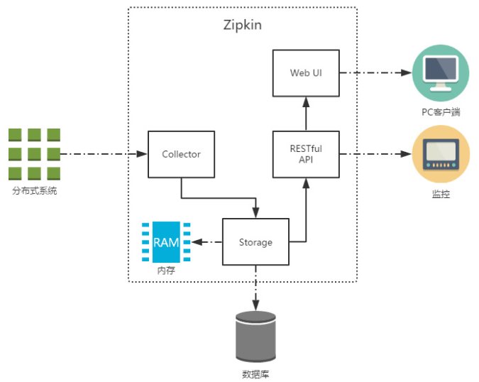

# Spring Cloud Sleuth

用于 Spring Cloud 应用程序的分布式跟踪，与Zipkin，HTrace和基于日志的（例如ELK）跟踪兼容。

> sleuth （英）/sluːθ/ （美）/sluːθ/ n. 侦探；警犬；vi. 做侦探；侦查

## 1. Sleuth 概述

### 1.1. 简介

Spring Cloud Sleuth 主要功能就是在分布式系统中提供追踪解决方案，它大量借用了Google Dapper的设计，并且兼容支持了zipkin，只需要在pom文件中引入相应的依赖即可

### 1.2. 相关概念

Spring Cloud Sleuth 为Spring Cloud提供了分布式根据的解决方案。它大量借用了Google Dapper的设计。以下是Sleuth中的术语和相关概念：

- **Trace**：由一组Trace Id相同的Span串联形成一个树状结构。为了实现请求跟踪，当请求到达分布式系统的入口端点时，只需要服务跟踪框架为该请求创建一个唯一的标识（即TraceId），同时在分布式系统内部流转的时候，框架始终保持传递该唯一值，直到整个请求的返回。那么我们就可以使用该唯一标识将所有的请求串联起来，形成一条完整的请求链路。例如，如果正在跑一个分布式大数据工程，可能需要创建一个trace。
- **Span**：代表一组基本工作单元，为了统计各处理单元的延迟，当请求到达各个服务组件的时候，也通过一个唯一标识（SpanId）来标记它的开始、具体过程和结束。通过SpanId的开始和结束时间戳，就能统计该span的调用时间，除此之外，还可以获取如事件的名称、请求信息等元数据。
    - 例如，在一个新建的span中发送一个RPC等同于发送一个回应请求给RPC，span通过一个64位ID唯一标识，trace以另一个64位ID表示，span还有其他数据信息，比如摘要、时间戳事件、关键值注释(tags)、span的ID、以及进度ID(通常是IP地址)span在不断的启动和停止，同时记录了时间信息，当创建了一个span，必须在未来的某个时刻停止它。
- **Annotation**：用来及时记录一个事件的存在，一些核心annotations用来定义一个请求的开始和结束，内部使用的重要注释：
    - cs - Client Sent：客户端发起一个请求，这个annotion描述了这个span的开始
    - sr - Server Received：服务端获得请求并准备开始处理它，如果将其sr减去cs时间戳便可得到网络延迟
    - ss - Server Sent：注解表明请求处理的完成(当请求返回客户端)，如果ss减去sr时间戳便可得到服务端需要的处理请求时间
    - cr - Client Received：表明span的结束，客户端成功接收到服务端的回复，如果cr减去cs时间戳便可得到客户端从服务端获取回复的所有所需时间


## 2. 链路追踪 Sleuth 基础入门示例

### 2.1. 项目搭建

创建`14-springcloud-sleuth`工程，复用之前Spring Cloud Gateway示例项目`12-springcloud-gateway`的代码，移除相关限流的代码；增加order服务的路由部分的配置

```yml
server:
  port: 8080 # 项目端口
spring:
  application:
    name: shop-server-gateway # 服务名称
  cloud:
    gateway:
      routes:
        - id: shop-service-product # 路由id
          uri: lb://shop-service-product # 根据微服务名称从注册中心拉取服务的地址与端口，格式： lb://服务名称（服务在注册中心上注册的名称）
          predicates:
            - Path=/shop-service-product/**
          filters: # 配置路由过滤器
            - RewritePath=/shop-service-product/(?<segment>.*), /$\{segment}
        - id: shop-service-order
          uri: lb://shop-service-order
          predicates:
            - Path=/shop-service-order/**
          filters:
            - RewritePath=/shop-service-order/(?<segment>.*), /$\{segment}
```

### 2.2. 引入依赖

修改网关、订单、商品微服务工程，引入Sleuth依赖。

```xml
<!-- sleuth链路追踪依赖 -->
<dependency>
    <groupId>org.springframework.cloud</groupId>
    <artifactId>spring-cloud-starter-sleuth</artifactId>
</dependency>
```

> 注：在需要进行链路追踪的所有微服务上都要加上Sleuth的依赖

### 2.3. 添加日志配置

修改网关、订单、商品微服务工程的application.yml配置文件，添加日志级别

```yml
logging:
  level:
    root: info
    org.springframework.web.servlet.DispatcherServlet: DEBUG
    org.springframework.cloud.sleuth: DEBUG
```

> 注：在需要进行链路追踪的所有微服务上都要加上日志级别的配置

### 2.4. 测试结果

启动微服务，调用之后，我们可以在控制台观察到sleuth的日志输出。


其中 `eb73eff57266ff20` 是TraceId，后面跟着的是SpanId，依次调用有一个全局的TraceId，将调用链路串起来。仔细分析每个微服务的日志，不难看出请求的具体过程。

查看日志文件并不是一个很好的方法，当微服务越来越多日志文件也会越来越多，通过Zipkin可以将日志聚合，并进行可视化展示和全文检索。

## 3. Zipkin 的概述

### 3.1. 简介

Zipkin 是 Twitter 的一个开源项目，它基于 Google Dapper 实现，它致力于收集服务的定时数据，以解决微服务架构中的延迟问题，包括**数据的收集、存储、查找和展现**。

Zipkin 可以用来收集各个服务器上请求链路的跟踪数据，并通过它提供的 REST API 接口来辅助查询跟踪数据以实现对分布式系统的监控程序，从而及时地发现系统中出现的延迟升高问题并找出系统性能瓶颈的根源。

除了面向开发的 API 接口之外，它也提供了方便的 UI 组件来直观的搜索跟踪信息和分析请求链路明细，比如：可以查询某段时间内各用户请求的处理时间等。Zipkin 提供了可插拔数据存储方式：In-Memory、MySql、Cassandra 以及 Elasticsearch。

官方网址：https://zipkin.io/

### 3.2. Zipkin 核心组件



上图展示了 Zipkin 的基础架构，它主要由 4 个核心组件构成：

- **Collector**：收集器组件，它主要用于处理从外部系统发送过来的跟踪信息，将这些信息转换为 Zipkin 内部处理的 Span 格式，以支持后续的存储、分析、展示等功能。
- **Storage**：存储组件，它主要对处理收集器接收到的跟踪信息，默认会将这些信息存储在内存中，我们也可以修改此存储策略，通过使用其他存储组件将跟踪信息存储到数据库中。
- **RESTful API**：API 组件，它主要用来提供外部访问接口。比如给客户端展示跟踪信息，或是外接系统访问以实现监控等。
- **Web UI**：UI 组件，基于 API 组件实现的上层应用。通过 UI 组件用户可以方便而有直观地查询和分析跟踪信息。

Zipkin 分为两端，一个是 Zipkin 服务端，一个是 Zipkin 客户端，客户端也就是微服务的应用。客户端会配置服务端的 URL 地址，一旦发生服务间的调用的时候，会被配置在微服务里面的 Sleuth 的监听器监听，并生成相应的 Trace 和 Span 信息发送给服务端。

发送的方式主要有两种，一种是 HTTP 报文的方式，还有一种是消息总线的方式如 RabbitMQ。不论哪种方式，使用zipkin实现链路追踪的日志收集都需要：

- 一个服务注册中心，*示例项目使用之前的 eureka 项目来当注册中心*。
- 一个 Zipkin 服务端。
- 多个微服务，这些微服务中配置Zipkin客户端。

## 4. Zipkin Server （服务端）的部署和配置

### 4.1. Zipkin Server 下载

从spring boot 2.0开始，官方就不再支持使用自建Zipkin Server的方式进行服务链路追踪，而是直接提供了编译好的 jar 包来使用。可以从官方网站下载先下载Zipkin的web UI，

> - Zipkin 源码下载地址：https://github.com/openzipkin/zipkin/releases
> - Zipkin Server 编译后jar下载地址：https://search.maven.org/artifact/io.zipkin/zipkin-server
> - 此次示例下载的是zipkin-server-2.20.0-exec.jar

### 4.2. 启动

进行jar所在目录，使用命令行直接启动 Zipkin Server

```bash
java -jar zipkin-server-2.22.0-exec.jar
```

### 4.3. 相关部署与配置信息

- 默认 Zipkin Server 的请求端口为 9411
- Zipkin Server 的启动参数可以通过官方提供的yml配置文件查找
    - 配置文件地址：https://github.com/openzipkin/zipkin/blob/master/zipkin-server/src/main/resources/zipkin-server-shared.yml
- 在浏览器输入 `http://127.0.0.1:9411` 即可进入到 Zipkin Server 的管理后台

## 5. 客户端 Zipkin + Sleuth 整合（基于http方式收集数据）

结合 zipkin 可以很直观地显示微服务之间的调用关系。ZipKin 客户端和 Sleuth 的集成非常简单，只需要在微服务中添加其依赖和配置即可。

### 5.1. 客户端添加依赖

客户端指的是需要被追踪的微服务。*所以示例项目的网关、订单、商品服务都需要添加客户端的依赖*

```xml
<!-- zipkin 依赖 -->
<dependency>
    <groupId>org.springframework.cloud</groupId>
    <artifactId>spring-cloud-starter-zipkin</artifactId>
</dependency>
```

### 5.2. 修改客户端配置文件

修改需要被追踪的微服务的 application.ym l配置文件。*所有示例项目的网关、订单、商品服务都需要修改配置文件*

```yml
spring:
  ....
  # 配置 zipkin
  zipkin:
    base-url: http://127.0.0.1:9411/ # 设置 zipkin server的请求地址
    discoveryClientEnabled: false # 让nacos把它当成一个URL，而不要当做服务名
    sender:
      type: web # 设置数据的传输方式 , 以 http 的形式向 server 端发送数据
  sleuth:
    sampler:
      probability: 1 # 配置采样的百分比，默认是 0.1（即10%）
```

配置说明：

- `spring.zipkin.base-url`：指定了zipkin server的地址
- `spring.zipkin.sender.type`：用于设置采样的数据传输方式，上面示例是使用http形式向server端发送数据
- `spring.sleuth.sampler.probability`：制定需采样的百分比，默认为0.1，即10%，此示例配置1，是记录全部的sleuth信息，是为了收集到更多的数据（仅供测试用）。在分布式系统中，过于频繁的采样会影响系统性能，所以这里配置需要采用一个合适的值。

### 5.3. 测试

启动Zipkin Service，并启动每个微服务。通过浏览器发送一次微服务请求。打开 Zipkin Service 控制台，我们可以根据条件追踪每次请求调用过程


点击“SHOW”可以看到请求更多的细节


### 5.4. 默认Zipkin数据采集方式存在的问题

在默认情况下，zipkin数据采集有如下特点：

1. zipkin 采集到的数据是保存在内存中
2. Zipkin 客户端和 Server 之间是使用 HTTP 请求的方式进行通信（即同步的请求方式，会拖慢核心业务的处理时间）

存在的问题：

1. 当服务出现异常或者宕机的情况，存储在内存的数据就会出现丢失
2. 在出现网络波动时，Server端异常等情况下可能存在信息收集不及时的问题。

## 6. 跟踪数据的存储

Zipkin Server 默认时间追踪数据信息保存到内存，这种方式不适合生产环境。因为一旦 Service 关闭重启或者服务崩溃，就会导致历史数据消失。Zipkin 支持将追踪数据持久化到 mysql 数据库或者存储到 elasticsearch 中。*这里示例以mysql为例*

### 6.1. 追踪数据存储到 MySQL 数据库

#### 6.1.1. 准备存储跟踪数据的数据库

创建zipkin持久化相应数据库表sql脚本位置：`spring-cloud-note\spring-cloud-greenwich-sample\document\sql\zipkin_db.sql`

> 可以从官网找到Zipkin Server持久mysql的数据库脚本。脚本地址：https://github.com/openzipkin/zipkin/blob/master/zipkin-storage/mysql-v1/src/main/resources/mysql.sql

```sql
--
-- Copyright 2015-2019 The OpenZipkin Authors
--
-- Licensed under the Apache License, Version 2.0 (the "License"); you may not use this file except
-- in compliance with the License. You may obtain a copy of the License at
--
-- http://www.apache.org/licenses/LICENSE-2.0
--
-- Unless required by applicable law or agreed to in writing, software distributed under the License
-- is distributed on an "AS IS" BASIS, WITHOUT WARRANTIES OR CONDITIONS OF ANY KIND, either express
-- or implied. See the License for the specific language governing permissions and limitations under
-- the License.
--

CREATE TABLE IF NOT EXISTS zipkin_spans (
  `trace_id_high` BIGINT NOT NULL DEFAULT 0 COMMENT 'If non zero, this means the trace uses 128 bit traceIds instead of 64 bit',
  `trace_id` BIGINT NOT NULL,
  `id` BIGINT NOT NULL,
  `name` VARCHAR(255) NOT NULL,
  `remote_service_name` VARCHAR(255),
  `parent_id` BIGINT,
  `debug` BIT(1),
  `start_ts` BIGINT COMMENT 'Span.timestamp(): epoch micros used for endTs query and to implement TTL',
  `duration` BIGINT COMMENT 'Span.duration(): micros used for minDuration and maxDuration query',
  PRIMARY KEY (`trace_id_high`, `trace_id`, `id`)
) ENGINE=InnoDB ROW_FORMAT=COMPRESSED CHARACTER SET=utf8 COLLATE utf8_general_ci;

ALTER TABLE zipkin_spans ADD INDEX(`trace_id_high`, `trace_id`) COMMENT 'for getTracesByIds';
ALTER TABLE zipkin_spans ADD INDEX(`name`) COMMENT 'for getTraces and getSpanNames';
ALTER TABLE zipkin_spans ADD INDEX(`remote_service_name`) COMMENT 'for getTraces and getRemoteServiceNames';
ALTER TABLE zipkin_spans ADD INDEX(`start_ts`) COMMENT 'for getTraces ordering and range';

CREATE TABLE IF NOT EXISTS zipkin_annotations (
  `trace_id_high` BIGINT NOT NULL DEFAULT 0 COMMENT 'If non zero, this means the trace uses 128 bit traceIds instead of 64 bit',
  `trace_id` BIGINT NOT NULL COMMENT 'coincides with zipkin_spans.trace_id',
  `span_id` BIGINT NOT NULL COMMENT 'coincides with zipkin_spans.id',
  `a_key` VARCHAR(255) NOT NULL COMMENT 'BinaryAnnotation.key or Annotation.value if type == -1',
  `a_value` BLOB COMMENT 'BinaryAnnotation.value(), which must be smaller than 64KB',
  `a_type` INT NOT NULL COMMENT 'BinaryAnnotation.type() or -1 if Annotation',
  `a_timestamp` BIGINT COMMENT 'Used to implement TTL; Annotation.timestamp or zipkin_spans.timestamp',
  `endpoint_ipv4` INT COMMENT 'Null when Binary/Annotation.endpoint is null',
  `endpoint_ipv6` BINARY(16) COMMENT 'Null when Binary/Annotation.endpoint is null, or no IPv6 address',
  `endpoint_port` SMALLINT COMMENT 'Null when Binary/Annotation.endpoint is null',
  `endpoint_service_name` VARCHAR(255) COMMENT 'Null when Binary/Annotation.endpoint is null'
) ENGINE=InnoDB ROW_FORMAT=COMPRESSED CHARACTER SET=utf8 COLLATE utf8_general_ci;

ALTER TABLE zipkin_annotations ADD UNIQUE KEY(`trace_id_high`, `trace_id`, `span_id`, `a_key`, `a_timestamp`) COMMENT 'Ignore insert on duplicate';
ALTER TABLE zipkin_annotations ADD INDEX(`trace_id_high`, `trace_id`, `span_id`) COMMENT 'for joining with zipkin_spans';
ALTER TABLE zipkin_annotations ADD INDEX(`trace_id_high`, `trace_id`) COMMENT 'for getTraces/ByIds';
ALTER TABLE zipkin_annotations ADD INDEX(`endpoint_service_name`) COMMENT 'for getTraces and getServiceNames';
ALTER TABLE zipkin_annotations ADD INDEX(`a_type`) COMMENT 'for getTraces and autocomplete values';
ALTER TABLE zipkin_annotations ADD INDEX(`a_key`) COMMENT 'for getTraces and autocomplete values';
ALTER TABLE zipkin_annotations ADD INDEX(`trace_id`, `span_id`, `a_key`) COMMENT 'for dependencies job';

CREATE TABLE IF NOT EXISTS zipkin_dependencies (
  `day` DATE NOT NULL,
  `parent` VARCHAR(255) NOT NULL,
  `child` VARCHAR(255) NOT NULL,
  `call_count` BIGINT,
  `error_count` BIGINT,
  PRIMARY KEY (`day`, `parent`, `child`)
) ENGINE=InnoDB ROW_FORMAT=COMPRESSED CHARACTER SET=utf8 COLLATE utf8_general_ci;
```

#### 6.1.2. 配置启动服务端

在启动zipkin服务端时增加相关数据库参数即可，启动脚本如下：

```bash
java -jar zipkin-server-2.22.0-exec.jar --STORAGE_TYPE=mysql --MYSQL_HOST=127.0.0.1 --MYSQL_TCP_PORT=3306 --MYSQL_DB=tempdb --MYSQL_USER=root --MYSQL_PASS=123456
```

启动参数说明：

- `STORAGE_TYPE`：存储类型
- `MYSQL_HOST`：mysql主机地址
- `MYSQL_TCP_PORT`：mysql端口
- `MYSQL_DB`：mysql数据库名称
- `MYSQL_USER`：mysql用户名
- `MYSQL_PASS`：mysql密码

> 相关的参数可以参考官方提供的`zipkin-server-shared.yml`
>
> 配置文件地址：https://github.com/openzipkin/zipkin/blob/master/zipkin-server/src/main/resources/zipkin-server-shared.yml

配置好服务端之后，可以在浏览器请求几次。在数据库查看会发现数据已经持久化到mysql中

### 6.2. 追踪数据存储到 ElasticSearch

- 下载 elasticsearch。[下载地址](https://www.elastic.co/cn/downloads/past-releases/elasticsearch-6-8-4)
- 启动 elasticsearch


- 在启动 ZipKin Server 的时候，指定数据保存的elasticsearch的信息

```bash
java -jar zipkin-server-2.22.0-exec.jar --STORAGE_TYPE=elasticsearch --ES-HOST=localhost:9200
```

## 7. 基于消息中间件收集数据

Zipkin支持与rabbitMQ整合完成异步消息传输。加了MQ之后，通信过程如下图所示：


### 7.1. RabbitMQ 的安装与启动

要使用消息中间件实现收集数据传输，需要准备MQ的服务。*此示例使用RabbitMQ*

> 更多RabbitMQ的内容详见：[/07-分布式架构&微服务架构/03-分布式消息中件间/03-RabbitMQ.md](/07-分布式架构&微服务架构/03-分布式消息中件间/03-RabbitMQ)

### 7.2. 服务端启动

在启动zipkin服务端时增加相关RabbitMQ的参数即可，启动脚本如下：

```bash
java -jar zipkin-server-2.22.0-exec.jar --RABBIT_ADDRESSES=192.168.12.132:5672
```

启动参数说明：

- `RABBIT_ADDRESSES`：指定RabbitMQ地址
- `RABBIT_USER`：用户名（默认guest，如使用默认值，则启动时不需要指定）
- `RABBIT_PASSWORD` ：密码（默认guest，如使用默认值，则启动时不需要指定）

> 相关的参数可以参考官方提供的`zipkin-server-shared.yml`

启动Zipkin Server之后，通过RabbitMQ的控制台可以看到多了一个Queue，其中 `zipkin` 就是zipkin服务自动创建的Queue队列


### 7.3. 客户端配置

#### 7.3.1. 配置依赖

修改需要被追踪的微服务添加zipkin整合sleuth、rabbitmq的依赖。*所以示例项目的网关、订单、商品服务都需要添加依赖*

```xml
<!-- sleuth链路追踪依赖 -->
<dependency>
    <groupId>org.springframework.cloud</groupId>
    <artifactId>spring-cloud-starter-sleuth</artifactId>
</dependency>
<!-- zipkin 依赖 -->
<dependency>
    <groupId>org.springframework.cloud</groupId>
    <artifactId>spring-cloud-starter-zipkin</artifactId>
</dependency>

<!-- zipkin整合sleuth依赖 -->
<dependency>
    <groupId>org.springframework.cloud</groupId>
    <artifactId>spring-cloud-sleuth-zipkin</artifactId>
</dependency>
<!-- RabbitMQ 依赖 -->
<dependency>
    <groupId>org.springframework.amqp</groupId>
    <artifactId>spring-rabbit</artifactId>
</dependency>
```

导入 `spring-rabbit` 依赖，是Spring提供的对RabbitMQ的封装，客户端会根据配置自动的生产消息并发送到目标队列中

> 注：如果前面两个依赖已经存在，则不需要重复添加依赖

#### 7.3.2. 配置消息中间件地址等信息

修改需要被追踪的微服务的application.yml配置文件（*所以示例项目的网关、订单、商品服务都需要修改配置文件*）。修改要求如下：

- 修改采集的数据发送方式为`rabbit`
- 增加RabbitMQ的相关信息配置

```yml
spring:
  # 配置 zipkin
  zipkin:
    sender:
      type: rabbit # 设置数据的传输方式 , 以向 RabbitMQ 发送消息的方式采集数据
  sleuth:
    sampler:
      probability: 1 # 配置采样的百分比，默认是 0.1（即10%）
  # 配置 RabbitMQ
  rabbitmq:
    host: 192.168.12.132
    port: 5672
    username: guest
    password: guest
    listener: # 配置重试策略
      direct:
        retry:
          enabled: true
      simple:
        retry:
          enabled: true
```

### 7.4. 测试

启动所有微服务，关闭Zipkin Server，并发起几个请求连接。打开rabbitmq管理后台可以看到，消息已经推送到rabbitmq。


当Zipkin Server启动时，会自动的从rabbitmq获取消息并消费，展示追踪数据


可以看到如下效果：

- 请求的耗时时间不会出现突然耗时特长的情况
- 当Zipkin Server不可用时（比如关闭、网络不通等），追踪信息不会丢失，因为这些信息会保存在Rabbitmq服务器上，直到Zipkin服务器可用时，再从Rabbitmq中取出这段时间的信息
