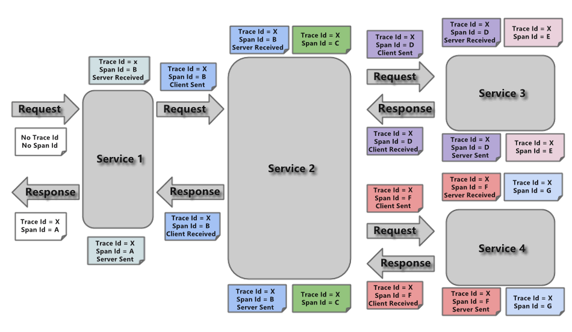
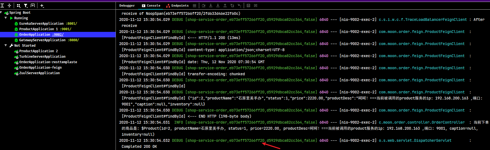

# Spring Cloud Sleuth

用于 Spring Cloud 应用程序的分布式跟踪，与Zipkin，HTrace和基于日志的（例如ELK）跟踪兼容。

> sleuth （英）/sluːθ/ （美）/sluːθ/ n. 侦探；警犬；vi. 做侦探；侦查

## 1. Sleuth 概述

### 1.1. 简介

Spring Cloud Sleuth 主要功能就是在分布式系统中提供追踪解决方案，并且兼容支持了zipkin，只需要在pom文件中引入相应的依赖即可

### 1.2. 相关概念

Spring Cloud Sleuth 为Spring Cloud提供了分布式根据的解决方案。它大量借用了Google Dapper的设计。以下是Sleuth中的术语和相关概念：

- **Span**：基本工作单元，例如，在一个新建的span中发送一个RPC等同于发送一个回应请求给RPC，span通过一个64位ID唯一标识，trace以另一个64位ID表示，span还有其他数据信息，比如摘要、时间戳事件、关键值注释(tags)、span的ID、以及进度ID(通常是IP地址)span在不断的启动和停止，同时记录了时间信息，当创建了一个span，必须在未来的某个时刻停止它。
- **Trace**：一系列spans组成的一个树状结构，例如，如果正在跑一个分布式大数据工程，可能需要创建一个trace。
- **Annotation**：用来及时记录一个事件的存在，一些核心annotations用来定义一个请求的开始和结束
    - cs - Client Sent：客户端发起一个请求，这个annotion描述了这个span的开始
    - sr - Server Received：服务端获得请求并准备开始处理它，如果将其sr减去cs时间戳便可得到网络延迟
    - ss - Server Sent：注解表明请求处理的完成(当请求返回客户端)，如果ss减去sr时间戳便可得到服务端需要的处理请求时间
    - cr - Client Received：表明span的结束，客户端成功接收到服务端的回复，如果cr减去cs时间戳便可得到客户端从服务端获取回复的所有所需时间



## 2. 链路追踪 Sleuth 基础入门示例

### 2.1. 项目搭建

创建`14-springcloud-sleuth`工程，复用之前Spring Cloud Gateway示例项目`12-springcloud-gateway`的代码，移除相关限流的代码；增加order服务的路由部分的配置

```yml
server:
  port: 8080 # 项目端口
spring:
  application:
    name: shop-server-gateway # 服务名称
  cloud:
    gateway:
      routes:
        - id: shop-service-product # 路由id
          uri: lb://shop-service-product # 根据微服务名称从注册中心拉取服务的地址与端口，格式： lb://服务名称（服务在注册中心上注册的名称）
          predicates:
            - Path=/shop-service-product/**
          filters: # 配置路由过滤器
            - RewritePath=/shop-service-product/(?<segment>.*), /$\{segment}
        - id: shop-service-order
          uri: lb://shop-service-order
          predicates:
            - Path=/shop-service-order/**
          filters:
            - RewritePath=/shop-service-order/(?<segment>.*), /$\{segment}
```

### 2.2. 引入依赖

修改网关、订单、商品微服务工程，引入Sleuth依赖。

```xml
<!-- sleuth链路追踪依赖 -->
<dependency>
    <groupId>org.springframework.cloud</groupId>
    <artifactId>spring-cloud-starter-sleuth</artifactId>
</dependency>
```

> 注：在需要进行链路追踪的所有微服务上都要加上Sleuth的依赖

### 2.3. 添加日志配置

修改网关、订单、商品微服务工程的application.yml配置文件，添加日志级别

```yml
logging:
  level:
    root: info
    org.springframework.web.servlet.DispatcherServlet: DEBUG
    org.springframework.cloud.sleuth: DEBUG
```

> 注：在需要进行链路追踪的所有微服务上都要加上日志级别的配置

### 2.4. 测试结果

启动微服务，调用之后，我们可以在控制台观察到sleuth的日志输出。





其中 `eb73eff57266ff20` 是TraceId，后面跟着的是SpanId，依次调用有一个全局的TraceId，将调用链路串起来。仔细分析每个微服务的日志，不难看出请求的具体过程。

查看日志文件并不是一个很好的方法，当微服务越来越多日志文件也会越来越多，通过Zipkin可以将日志聚合，并进行可视化展示和全文检索。

## 3. Zipkin 的概述

### 3.1. 简介

Zipkin 是 Twitter 的一个开源项目，它基于 Google Dapper 实现，它致力于收集服务的定时数据，以解决微服务架构中的延迟问题，包括数据的收集、存储、查找和展现。

Zipkin 可以用来收集各个服务器上请求链路的跟踪数据，并通过它提供的 REST API 接口来辅助查询跟踪数据以实现对分布式系统的监控程序，从而及时地发现系统中出现的延迟升高问题并找出系统性能瓶颈的根源。

除了面向开发的 API 接口之外，它也提供了方便的 UI 组件来直观的搜索跟踪信息和分析请求链路明细，比如：可以查询某段时间内各用户请求的处理时间等。Zipkin 提供了可插拔数据存储方式：In-Memory、MySql、Cassandra 以及 Elasticsearch。

官方网址：https://zipkin.io/

### 3.2. Zipkin 核心组件


上图展示了 Zipkin 的基础架构，它主要由 4 个核心组件构成：

- **Collector**：收集器组件，它主要用于处理从外部系统发送过来的跟踪信息，将这些信息转换为 Zipkin 内部处理的 Span 格式，以支持后续的存储、分析、展示等功能。
- **Storage**：存储组件，它主要对处理收集器接收到的跟踪信息，默认会将这些信息存储在内存中，我们也可以修改此存储策略，通过使用其他存储组件将跟踪信息存储到数据库中。
- **RESTful API**：API 组件，它主要用来提供外部访问接口。比如给客户端展示跟踪信息，或是外接系统访问以实现监控等。
- **Web UI**：UI 组件，基于 API 组件实现的上层应用。通过 UI 组件用户可以方便而有直观地查询和分析跟踪信息。

Zipkin 分为两端，一个是 Zipkin 服务端，一个是 Zipkin 客户端，客户端也就是微服务的应用。

客户端会配置服务端的 URL 地址，一旦发生服务间的调用的时候，会被配置在微服务里面的 Sleuth 的监听器监听，并生成相应的 Trace 和 Span 信息发送给服务端。

发送的方式主要有两种，一种是 HTTP 报文的方式，还有一种是消息总线的方式如 RabbitMQ。

不论哪种方式，使用zipkin实现链路追踪的日志收集都需要：

- 一个服务注册中心，*示例项目使用之前的 eureka 项目来当注册中心*。
- 一个 Zipkin 服务端。
- 多个微服务，这些微服务中配置Zipkin客户端。

## 4. Zipkin Server （服务端）的部署和配置

### 4.1. Zipkin Server 下载

从spring boot 2.0开始，官方就不再支持使用自建Zipkin Server的方式进行服务链路追踪，而是直接提供了编译好的 jar 包来使用。可以从官方网站下载先下载Zipkin的web UI，

> - Zipkin 源码下载地址：https://github.com/openzipkin/zipkin/releases
> - Zipkin Server 编译后jar下载地址：https://search.maven.org/artifact/io.zipkin/zipkin-server
> - 此次示例下载的是zipkin-server-2.20.0-exec.jar

### 4.2. 启动

使用命令行直接启动Zipkin Server

```bash
java -jar zipkin-server-2.22.0-exec.jar
```

### 4.3. 相关部署与配置信息

- 默认 Zipkin Server 的请求端口为 9411
- Zipkin Server 的启动参数可以通过官方提供的yml配置文件查找
    - 配置文件地址：https://github.com/openzipkin/zipkin/blob/master/zipkin-server/src/main/resources/zipkin-server-shared.yml
- 在浏览器输入 `http://127.0.0.1:9411` 即可进入到Zipkin Server的管理后台

## 5. 客户端 Zipkin + Sleuth 整合

结合zipkin可以很直观地显示微服务之间的调用关系。

### 5.1. 客户端添加依赖

客户端指的是需要被追踪的微服务。*所以示例项目的网关、订单、商品服务都需要添加客户端的依赖*

```xml
<!-- zipkin 依赖 -->
<dependency>
    <groupId>org.springframework.cloud</groupId>
    <artifactId>spring-cloud-starter-zipkin</artifactId>
</dependency>
```

### 5.2. 修改客户端配置文件

修改需要被追踪的微服务的application.yml配置文件。*所以示例项目的网关、订单、商品服务都需要修改配置文件*

```yml
spring:
  ....
  # 配置 zipkin
  zipkin:
    base-url: http://127.0.0.1:9411/ # 设置 zipkin server的请求地址
    sender:
      type: web # 设置数据的传输方式 , 以 http 的形式向server端发送数据
  sleuth:
    sampler:
      probability: 1 # 配置，默认是 0.01 秒
```


