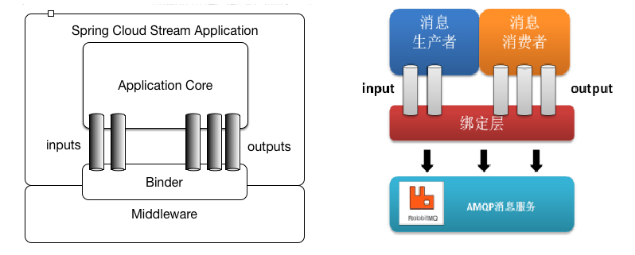
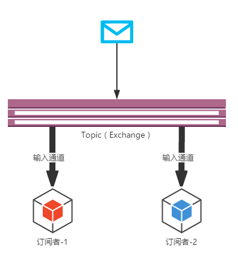

# Spring Cloud Stream

> Spring Cloud Stream 官网地址：https://spring.io/projects/spring-cloud-stream

在实际的企业开发中，消息中间件是至关重要的组件之一。消息中间件主要解决应用解耦，异步消息，流量削锋等问题，实现高性能，高可用，可伸缩和最终一致性架构。

但不同的中间件其实现方式，内部结构是不一样的。如常见的RabbitMQ和Kafka，由于这两个消息中间件的架构上的不同，像RabbitMQ有exchange，kafka有Topic，partitions分区，这些中间件的差异性导致在实际项目开发给开发人员造成了一定的困扰，如果用了两个消息队列的其中一种，后面的业务需求，想往另外一种消息队列进行迁移，这时候无疑就是一个灾难性的，一大堆东西都要重新推倒重新做，因为它跟项目系统耦合了

此时 Spring Cloud Stream 提供了一套用于消息中间件与系统应用解耦合的解决方案。

## 1. Spring Cloud Stream 概述

### 1.1. 简介

Spring Cloud Stream 由一个中间件中立的核组成。应用通过Spring Cloud Stream插入的input(相当于消费者consumer，它是从队列中接收消息的)和output(相当于生产者producer，它是从队列中发送消息的)通道与外界交流。通道通过指定中间件的Binder实现与外部代理连接。

业务开发者不再关注具体消息中间件，只需关注Binder对应用程序提供的抽象概念来使用消息中间件实现业务即可。

> 说明：最底层是消息服务，中间层是绑定层，绑定层和底层的消息服务进行绑定，顶层是消息生产者和消息消费者，顶层可以向绑定层生产消息和和获取消息消费

### 1.2. 核心概念

#### 1.2.1. 绑定器

`Binder` 绑定器是Spring Cloud Stream中一个非常重要的概念。在没有绑定器这个概念的情况下，Spring Boot应用要直接与消息中间件进行信息交互的时候，由于各消息中间件构建的初衷不同，它们的实现细节上会有较大的差异性，这使得实现的消息交互逻辑就会非常笨重，因为对具体的中间件实现细节有太重的依赖，当中间件有较大的变动升级、或是更换中间件的时候，就需要付出非常大的代价来实施。

通过定义绑定器作为中间层，实现了应用程序与消息中间件(Middleware)细节之间的隔离。通过向应用程序暴露统一的Channel通过，使得应用程序不需要再考虑各种不同的消息中间件的实现。当需要升级消息中间件，或者是更换其他消息中间件产品时，需要做的就是更换对应的Binder绑定器而不需要修改任何应用逻辑，甚至可以任意的改变中间件的类型而不需要修改一行代码。

Spring Cloud Stream支持各种binder实现，*下面包含GitHub项目的链接*。

- [RabbitMQ](https://github.com/spring-cloud/spring-cloud-stream-binder-rabbit)
- [Apache Kafka](https://github.com/spring-cloud/spring-cloud-stream-binder-kafka)
- [Kafka Streams](https://github.com/spring-cloud/spring-cloud-stream-binder-kafka/tree/master/spring-cloud-stream-binder-kafka-streams)
- [Amazon Kinesis](https://github.com/spring-cloud/spring-cloud-stream-binder-aws-kinesis)
- [Google PubSub (partner maintained)](https://github.com/spring-cloud/spring-cloud-gcp/tree/master/spring-cloud-gcp-pubsub-stream-binder)
- [Solace PubSub+ (partner maintained)](https://github.com/SolaceProducts/spring-cloud-stream-binder-solace)
- [Azure Event Hubs (partner maintained)](https://github.com/microsoft/spring-cloud-azure/tree/master/spring-cloud-azure-stream-binder/spring-cloud-azure-eventhubs-stream-binder)
- [Apache RocketMQ (partner maintained)](https://github.com/alibaba/spring-cloud-alibaba/wiki/RocketMQ)

通过配置把应用和 Spring Cloud Stream 的 binder 绑定在一起，之后只需要修改 binder 的配置来达到动态修改topic、exchange、type等一系列信息而不需要修改一行代码。

#### 1.2.2. 发布/订阅模型

在 Spring Cloud Stream 中的消息通信方式遵循了**发布-订阅模式**，当一条消息被投递到消息中间件之后，它会通过共享的 `Topic` 主题进行广播，消息消费者在订阅的主题中收到它并触发自身的业务逻辑处理。

这里所提到的 `Topic` 主题是 Spring Cloud Stream 中的一个抽象概念，用来代表发布共享消息给消费者的地方。在不同的消息中间件中，`Topic` 可能对应着不同的概念，比如：在RabbitMQ中的它对应了`Exchange`、而在Kakfa中则对应了Kafka中的`Topic`。

### 1.3. 版本关系（更新于2020.11.13）

| Spring Cloud Stream | Spring Boot | Spring Cloud |
| ------------------- | ----------- | ------------ |
| Horsham [3.0.x]     | 2.2.x       | Hoxton       |
| Germantown [2.2.x]  | 2.1.x       | Greenwich    |
| Fishtown [2.1.x]    | 2.1.x       | Greenwich    |
| Elmhurst [2.0.x]    | 2.0.x       | Finchley     |

## 2. 快速入门案例

### 2.1. 案例准备

本次Spring Cloud Stream案例是通过RabbitMQ作为消息中间件，需要先准备RabbitMQ的环境

> 更多RabbitMQ的内容详见：[\07-分布式架构&微服务架构\03-分布式消息中件间\03-RabbitMQ.md](/07-分布式架构&微服务架构/03-分布式消息中件间/03-RabbitMQ)

