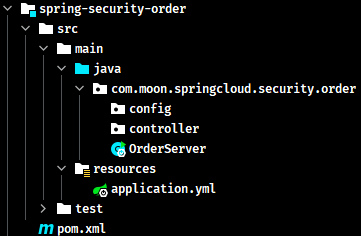
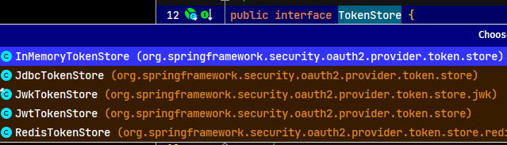
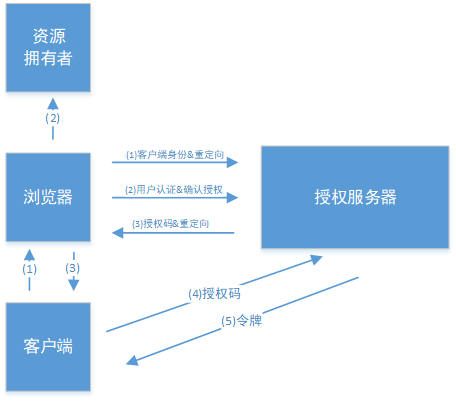

# Spring Cloud Security

- [官方文档](https://spring.io/projects/spring-cloud-security)

## 1. 概述

Spring Cloud Security 为构建安全的应用程序和分布式服务提供了一套解决方案。在 Spring Boot 和 Spring Security OAuth2 的基础上，可以快速创建系统，实现单点登录、令牌中继和令牌交换等常见模式。

## 2. Spring Cloud Security 环境介绍与搭建

Spring Security OAuth 是对 OAuth2.0 协议的一种实现，并且跟 Spring Security 相辅相成，与 Spring Cloud 体系的集成也非常便利，因为使用 Spring Cloud Security 实现分布式认证授权解决方案

### 2.1. OAuth2.0 服务

OAuth2.0 的服务提供方涵盖两个服务，即**授权服务 (Authorization Server，也叫认证服务) **和**资源服务 (Resource Server)**，使用 Spring Security OAuth2 的时候可以选择把它们在同一个应用程序中实现，也可以选择建立使用同一个授权服务的多个资源服务。

**授权服务 (Authorization Server）**应包含对接入端以及登入用户的合法性进行验证并颁发 token 等功能，对令牌的请求端点由 Spring MVC 控制器进行实现，下面是配置一个认证服务必须要实现的 endpoints：

- `AuthorizationEndpoint` 服务于认证请求。默认 URL：`/oauth/authorize`
- `TokenEndpoint` 服务于访问令牌的请求。默认 URL：`/oauth/token`

**资源服务 (Resource Server)**，应包含对资源的保护功能，对非法请求进行拦截，对请求中token进行解析鉴权等，下面的过滤器用于实现 OAuth 2.0 资源服务：

- `OAuth2AuthenticationProcessingFilter` 用来对请求给出的身份令牌解析鉴权。

### 2.2. 示例概述

以下示例分别创建 uaa 授权服务（也可叫认证服务）和order订单资源服务


认证流程如下：

1. 客户端请求 UAA 授权服务进行认证。
2. 认证通过后由 UAA 颁发令牌。
3. 客户端携带令牌 Token 请求资源服务。
4. 资源服务校验令牌的合法性，合法即返回资源信息。

### 2.3. 环境搭建

#### 2.3.1. 创建父工程

创建 maven 聚合工程 spring-cloud-security-greenwich，添加依赖如下：

```xml
<?xml version="1.0" encoding="UTF-8"?>
<project xmlns="http://maven.apache.org/POM/4.0.0"
         xmlns:xsi="http://www.w3.org/2001/XMLSchema-instance"
         xsi:schemaLocation="http://maven.apache.org/POM/4.0.0 http://maven.apache.org/xsd/maven-4.0.0.xsd">

    <parent>
        <artifactId>spring-security-sample</artifactId>
        <groupId>com.moon</groupId>
        <version>1.0-SNAPSHOT</version>
    </parent>

    <modelVersion>4.0.0</modelVersion>
    <artifactId>spring-cloud-security-greenwich</artifactId>
    <packaging>pom</packaging>
    <description>
        Spring Cloud Security 示例工程聚合项目
    </description>

    <properties>
        <project.build.sourceEncoding>UTF-8</project.build.sourceEncoding>
        <maven.compiler.source>8</maven.compiler.source>
        <maven.compiler.target>8</maven.compiler.target>
    </properties>

    <dependencyManagement>
        <dependencies>
            <!-- spring cloud 依赖 -->
            <dependency>
                <groupId>org.springframework.cloud</groupId>
                <artifactId>spring-cloud-dependencies</artifactId>
                <version>Greenwich.RELEASE</version>
                <type>pom</type>
                <scope>import</scope>
            </dependency>

            <!-- spring boot 依赖 -->
            <dependency>
                <groupId>org.springframework.boot</groupId>
                <artifactId>spring-boot-dependencies</artifactId>
                <version>2.1.3.RELEASE</version>
                <type>pom</type>
                <scope>import</scope>
            </dependency>

            <dependency>
                <groupId>javax.servlet</groupId>
                <artifactId>javax.servlet-api</artifactId>
                <version>3.1.0</version>
                <scope>provided</scope>
            </dependency>

            <dependency>
                <groupId>javax.interceptor</groupId>
                <artifactId>javax.interceptor-api</artifactId>
                <version>1.2</version>
            </dependency>

            <dependency>
                <groupId>com.alibaba</groupId>
                <artifactId>fastjson</artifactId>
                <version>1.2.47</version>
            </dependency>

            <dependency>
                <groupId>org.projectlombok</groupId>
                <artifactId>lombok</artifactId>
                <version>1.18.22</version>
            </dependency>

            <dependency>
                <groupId>mysql</groupId>
                <artifactId>mysql-connector-java</artifactId>
                <version>5.1.48</version>
            </dependency>

            <!-- jwt 依赖 -->
            <dependency>
                <groupId>org.springframework.security</groupId>
                <artifactId>spring-security-jwt</artifactId>
                <version>1.0.10.RELEASE</version>
            </dependency>

            <!-- oauth2 相关依赖 -->
            <dependency>
                <groupId>org.springframework.security.oauth.boot</groupId>
                <artifactId>spring-security-oauth2-autoconfigure</artifactId>
                <version>2.1.3.RELEASE</version>
            </dependency>
        </dependencies>
    </dependencyManagement>

    <build>
        <finalName>${project.name}</finalName>
        <resources>
            <resource>
                <directory>src/main/resources</directory>
                <filtering>true</filtering>
                <includes>
                    <include>**/*</include>
                </includes>
            </resource>
            <resource>
                <directory>src/main/java</directory>
                <includes>
                    <include>**/*.xml</include>
                </includes>
            </resource>
        </resources>
        <plugins>
            <!--<plugin>
                <groupId>org.springframework.boot</groupId>
                <artifactId>spring-boot-maven-plugin</artifactId>
            </plugin>-->

            <plugin>
                <groupId>org.apache.maven.plugins</groupId>
                <artifactId>maven-compiler-plugin</artifactId>
                <configuration>
                    <source>1.8</source>
                    <target>1.8</target>
                </configuration>
            </plugin>

            <plugin>
                <artifactId>maven-resources-plugin</artifactId>
                <configuration>
                    <encoding>utf-8</encoding>
                    <useDefaultDelimiters>true</useDefaultDelimiters>
                </configuration>
            </plugin>
        </plugins>
    </build>
</project>
```

#### 2.3.2. 创建 UAA 授权服务工程

- 创建授权服务工程 spring-security-uaa，添加如下依赖：

```xml
<?xml version="1.0" encoding="UTF-8"?>
<project xmlns="http://maven.apache.org/POM/4.0.0"
         xmlns:xsi="http://www.w3.org/2001/XMLSchema-instance"
         xsi:schemaLocation="http://maven.apache.org/POM/4.0.0 http://maven.apache.org/xsd/maven-4.0.0.xsd">
    <parent>
        <artifactId>spring-cloud-security-greenwich</artifactId>
        <groupId>com.moon</groupId>
        <version>1.0-SNAPSHOT</version>
    </parent>

    <modelVersion>4.0.0</modelVersion>
    <artifactId>spring-security-uaa</artifactId>
    <description>spring cloud security 授权认证服务</description>

    <dependencies>
        <!--<dependency>
            <groupId>org.springframework.cloud</groupId>
            <artifactId>spring-cloud-starter-netflix-eureka-client</artifactId>
        </dependency>-->

        <dependency>
            <groupId>org.springframework.cloud</groupId>
            <artifactId>spring-cloud-starter-netflix-hystrix</artifactId>
        </dependency>

        <dependency>
            <groupId>org.springframework.cloud</groupId>
            <artifactId>spring-cloud-starter-netflix-ribbon</artifactId>
        </dependency>

        <dependency>
            <groupId>org.springframework.cloud</groupId>
            <artifactId>spring-cloud-starter-openfeign</artifactId>
        </dependency>

        <dependency>
            <groupId>com.netflix.hystrix</groupId>
            <artifactId>hystrix-javanica</artifactId>
        </dependency>

        <dependency>
            <groupId>org.springframework.retry</groupId>
            <artifactId>spring-retry</artifactId>
        </dependency>

        <dependency>
            <groupId>org.springframework.boot</groupId>
            <artifactId>spring-boot-starter-actuator</artifactId>
        </dependency>

        <dependency>
            <groupId>org.springframework.boot</groupId>
            <artifactId>spring-boot-starter-web</artifactId>
        </dependency>

        <dependency>
            <groupId>org.springframework.boot</groupId>
            <artifactId>spring-boot-starter-freemarker</artifactId>
        </dependency>

        <dependency>
            <groupId>org.springframework.data</groupId>
            <artifactId>spring-data-commons</artifactId>
        </dependency>

        <!-- Spring Security 依赖 -->
        <dependency>
            <groupId>org.springframework.cloud</groupId>
            <artifactId>spring-cloud-starter-security</artifactId>
        </dependency>
        <!-- Spring Security OAuth 依赖 -->
        <dependency>
            <groupId>org.springframework.cloud</groupId>
            <artifactId>spring-cloud-starter-oauth2</artifactId>
        </dependency>
        <!-- Spring Security JWT 依赖 -->
        <dependency>
            <groupId>org.springframework.security</groupId>
            <artifactId>spring-security-jwt</artifactId>
        </dependency>

        <dependency>
            <groupId>javax.interceptor</groupId>
            <artifactId>javax.interceptor-api</artifactId>
        </dependency>

        <dependency>
            <groupId>mysql</groupId>
            <artifactId>mysql-connector-java</artifactId>
        </dependency>
        <dependency>
            <groupId>org.springframework.boot</groupId>
            <artifactId>spring-boot-starter-jdbc</artifactId>
        </dependency>

        <dependency>
            <groupId>com.alibaba</groupId>
            <artifactId>fastjson</artifactId>
        </dependency>

        <dependency>
            <groupId>org.projectlombok</groupId>
            <artifactId>lombok</artifactId>
        </dependency>
    </dependencies>

</project>
```

- 创建工程启动类，使用注解开启 eureka、hystrix、feign

```java
@SpringBootApplication
// @EnableDiscoveryClient
@EnableHystrix
@EnableFeignClients(basePackages = {"com.moon.springcloud.security.uaa"})
public class UAAServer {
    public static void main(String[] args) {
        SpringApplication.run(UAAServer.class, args);
    }
}
```

- 在 resource 目录创建项目配置文件 application.yml

```yml
server:
  port: 53020
  servlet:
    context-path: /uaa
  tomcat:
    protocol_header: x-forwarded-proto
    remote_ip_header: x-forwarded-for
  use-forward-headers: true

spring:
  application:
    name: uaa-service
  datasource:
    driver-class-name: com.mysql.jdbc.Driver
    url: jdbc:mysql://localhost:3306/user_db?useUnicode=true
    username: root
    password: 123456
  freemarker:
    charset: UTF-8
    content-type: text/html
    enabled: true
    request-context-attribute: rc
    suffix: .html
  http:
    encoding:
      charset: UTF-8
      enabled: true
      force: true
  main:
    allow-bean-definition-overriding: true
  mvc:
    throw-exception-if-no-handler-found: true
  resources:
    add-mappings: false

#eureka:
#  client:
#    serviceUrl:
#      defaultZone: http://localhost:53000/eureka/
#  instance:
#    instance-id: ${spring.application.name}:${spring.cloud.client.ip-address}:${spring.application.instance_id:${server.port}}
#    preferIpAddress: true

feign:
  compression:
    request:
      enabled: true
      mime-types:
        - text/xml
        - application/xml
        - application/json
      min-request-size: 2048
    response:
      enabled: true
  hystrix:
    enabled: true

logging:
  level:
    org:
      springframework:
        web: info
    root: debug

management:
  endpoints:
    web:
      exposure:
        include: refresh,health,info,env
```

创建相关包，最终工程结构如下：


#### 2.3.3. 创建Order资源服务工程

本工程为 Order 订单服务工程，访问本工程的资源需要认证通过。此工程的目的主要是测试认证授权的功能，所以不涉及订单管理相关业务。

- 创建 Order 资源服务工程 spring-security-order，添加如下依赖：

```xml
<?xml version="1.0" encoding="UTF-8"?>
<project xmlns="http://maven.apache.org/POM/4.0.0"
         xmlns:xsi="http://www.w3.org/2001/XMLSchema-instance"
         xsi:schemaLocation="http://maven.apache.org/POM/4.0.0 http://maven.apache.org/xsd/maven-4.0.0.xsd">
    <parent>
        <artifactId>spring-cloud-security-greenwich</artifactId>
        <groupId>com.moon</groupId>
        <version>1.0-SNAPSHOT</version>
    </parent>

    <modelVersion>4.0.0</modelVersion>
    <artifactId>spring-security-order</artifactId>
    <description>
        Spring Security 资源服务示例工程。
        此工程的目的主要是测试认证授权的功能，所以不涉及订单管理相关业务。
    </description>

    <dependencies>
        <!--<dependency>
            <groupId>org.springframework.cloud</groupId>
            <artifactId>spring-cloud-starter-netflix-eureka-client</artifactId>
        </dependency>-->

        <dependency>
            <groupId>org.springframework.boot</groupId>
            <artifactId>spring-boot-starter-actuator</artifactId>
        </dependency>

        <dependency>
            <groupId>org.springframework.boot</groupId>
            <artifactId>spring-boot-starter-web</artifactId>
        </dependency>

        <!-- Spring Security 依赖 -->
        <dependency>
            <groupId>org.springframework.cloud</groupId>
            <artifactId>spring-cloud-starter-security</artifactId>
        </dependency>
        <!-- Spring Security OAuth 依赖 -->
        <dependency>
            <groupId>org.springframework.cloud</groupId>
            <artifactId>spring-cloud-starter-oauth2</artifactId>
        </dependency>
        <dependency>
            <groupId>javax.interceptor</groupId>
            <artifactId>javax.interceptor-api</artifactId>
        </dependency>

        <dependency>
            <groupId>com.alibaba</groupId>
            <artifactId>fastjson</artifactId>
        </dependency>

        <dependency>
            <groupId>org.projectlombok</groupId>
            <artifactId>lombok</artifactId>
        </dependency>
    </dependencies>

</project>
```

- 在 resource 目录创建项目配置文件 application.yml

```xml
server:
  port: 53021
  servlet:
    context-path: /order
  tomcat:
    protocol_header: x-forwarded-proto
    remote_ip_header: x-forwarded-for
  use-forward-headers: true

spring:
  application:
    name: order-service
  freemarker:
    charset: UTF-8
    content-type: text/html
    enabled: true
    request-context-attribute: rc
    suffix: .html
  http:
    encoding:
      charset: UTF-8
      enabled: true
      force: true
  main:
    allow-bean-definition-overriding: true
  mvc:
    throw-exception-if-no-handler-found: true
  resources:
    add-mappings: false

#eureka:
#  client:
#    serviceUrl:
#      defaultZone: http://localhost:53000/eureka/
#  instance:
#    instance-id: ${spring.application.name}:${spring.cloud.client.ip-address}:${spring.application.instance_id:${server.port}}
#    preferIpAddress: true

feign:
  compression:
    request:
      enabled: true
      mime-types:
        - text/xml
        - application/xml
        - application/json
      min-request-size: 2048
    response:
      enabled: true
  hystrix:
    enabled: true

logging:
  level:
    org:
      springframework:
        web: info
    root: debug

management:
  endpoints:
    web:
      exposure:
        include: refresh,health,info,env
```


- 创建工程启动类，使用注解开启 eureka、hystrix、feign

```java
@SpringBootApplication
// @EnableDiscoveryClient
public class OrderServer {
    public static void main(String[] args) {
        SpringApplication.run(OrderServer.class, args);
    }
}
```

创建相关包，最终工程结构如下：



## 3. 授权服务器配置

### 3.1. @EnableAuthorizationServer

在授权服务工程中，使用 `@EnableAuthorizationServer` 注解并继承 `AuthorizationServerConfigurerAdapter` 来配置 OAuth2.0 授权服务器。

在 uaa 工程中的 config 包下，创建 `AuthorizationServerConfig` 类。

```java
@Configuration
@EnableAuthorizationServer
public class AuthorizationServerConfig extends AuthorizationServerConfigurerAdapter {
}
```

### 3.2. AuthorizationServerConfigurerAdapter

查看 `AuthorizationServerConfigurerAdapter` 源码，发现里面重写的方法都是没有任何逻辑，这就需要使用者按要求配置以下方法形参的几个类，这几个类是由 Spring 创建的独立的配置对象，它们会被 Spring 传入 `AuthorizationServerConfigurer` 中进行配置。

```java
public class AuthorizationServerConfigurerAdapter implements AuthorizationServerConfigurer {

	@Override
	public void configure(AuthorizationServerSecurityConfigurer security) throws Exception {
	}

	@Override
	public void configure(ClientDetailsServiceConfigurer clients) throws Exception {
	}

	@Override
	public void configure(AuthorizationServerEndpointsConfigurer endpoints) throws Exception {
	}

}
```

`AuthorizationServerConfigurerAdapter` 类中配置对象详解如下：

- `ClientDetailsServiceConfigurer`：用来配置客户端详情服务（ClientDetailsService），客户端详情信息在此方法中进行初始化，能够把客户端详情信息使用硬编码或者是通过数据库来存储调取详情信息
- `AuthorizationServerEndpointsConfigurer`：用来配置令牌（token）的访问端点和令牌服务(token services)
- `AuthorizationServerSecurityConfigurer`：用来配置令牌端点的安全约束

### 3.3. 配置客户端详细信息（ClientDetailsServiceConfigurer）

`ClientDetailsServiceConfigurer` 类能够使用内存或者 JDBC 来实现客户端详情服务（ClientDetailsService），`ClientDetailsService` 负责查找 `ClientDetails`，而 `ClientDetails` 有几个重要的属性如下列表：

|         属性名          |                                 描述                                 |
| :--------------------: | -------------------------------------------------------------------- |
|       `clientId`       | （必须的）用来标识客户的Id                                              |
|        `secret`        | （需要值得信任的客户端）客户端安全码，如果有的话                          |
|        `scope`         | 用来限制客户端的访问范围，如果为空（默认）的话，那么客户端拥有全部的访问范围 |
| `authorizedGrantTypes` | 此客户端可以使用的授权类型，默认为空                                     |
|     `authorities`      | 此客户端可以使用的权限（基于Spring Security authorities）               |

客户端详情（Client Details）能够在应用程序运行的时候进行更新，可以通过访问底层的存储服务（例如将客户端详情存储在一个关系数据库的表中，就可以使用 `JdbcClientDetailsService`）或者通过自定义实现 `ClientRegistrationService` 接口（同时也可以实现 `ClientDetailsService` 接口）来进行管理。

暂时使用内存方式存储客户端详情信息（实际项目会将客户端信息存入在数据库中进行管理），配置如下:

```java
@Configuration
@EnableAuthorizationServer
public class AuthorizationServerConfig extends AuthorizationServerConfigurerAdapter {
    /**
     * 用来配置客户端详情服务 ClientDetailsService，客户端详情信息在此方法中进行初始化，
     * 这里能够把客户端详情信息使用硬编码或者是通过数据库来存储调取详情信息
     * <p>
     * 此示例目前暂时使用内存的方式存储客户端详情信息
     */
    @Override
    public void configure(ClientDetailsServiceConfigurer clients) throws Exception {
        clients.inMemory() // 使用in‐memory存储
                .withClient("c1") // client_id
                .secret(new BCryptPasswordEncoder().encode("secret")) // 客户端密钥
                .resourceIds("res1") // 资源列表
                .authorizedGrantTypes("authorization_code", "password", "client_credentials", "implicit", "refresh_token") // 该client允许的授权类型
                .scopes("all") // 允许的授权范围
                .autoApprove(false) // 发放令牌时，是否跳转授权页面，true-代表不跳转，false-代表跳转
                .redirectUris("http://www.baidu.com"); // 验证回调地址
    }
}
```

### 3.4. 管理令牌（AuthorizationServerTokenServices）

`AuthorizationServerTokenServices` 接口定义了一些操作方法，可以对令牌进行一些必要的管理，令牌可以被用来加载身份信息，里面包含了这个令牌的相关权限。

```java
public interface AuthorizationServerTokenServices {
	/**
	 * Create an access token associated with the specified credentials.
	 * @param authentication The credentials associated with the access token.
	 * @return The access token.
	 * @throws AuthenticationException If the credentials are inadequate.
	 */
	OAuth2AccessToken createAccessToken(OAuth2Authentication authentication) throws AuthenticationException;

	/**
	 * Refresh an access token. The authorization request should be used for 2 things (at least): to validate that the
	 * client id of the original access token is the same as the one requesting the refresh, and to narrow the scopes
	 * (if provided).
	 * 
	 * @param refreshToken The details about the refresh token.
	 * @param tokenRequest The incoming token request.
	 * @return The (new) access token.
	 * @throws AuthenticationException If the refresh token is invalid or expired.
	 */
	OAuth2AccessToken refreshAccessToken(String refreshToken, TokenRequest tokenRequest)
			throws AuthenticationException;

	/**
	 * Retrieve an access token stored against the provided authentication key, if it exists.
	 * 
	 * @param authentication the authentication key for the access token
	 * 
	 * @return the access token or null if there was none
	 */
	OAuth2AccessToken getAccessToken(OAuth2Authentication authentication);

}
```

#### 3.4.1. DefaultTokenServices 抽象实现类

可以自定义创建 `AuthorizationServerTokenServices` 接口的实现，通常都需要继承 `DefaultTokenServices` 抽象类。此类中包含了一些有用方法实现，可以使用它来修改令牌的格式和令牌的存储。默认的，当它尝试创建一个令牌的时候，是使用随机值来进行填充的，除了持久化令牌是委托一个 `TokenStore` 接口来实现以外，这个类几乎完成了所有的事情。

```java
public class DefaultTokenServices implements AuthorizationServerTokenServices, ResourceServerTokenServices,
		ConsumerTokenServices, InitializingBean {
}
```

#### 3.4.2. TokenStore 接口

`TokenStore` 接口主要是用于持久化令牌，该接口有一个默认的实现是 `InMemoryTokenStore`，此实现的所有令牌是被保存在了内存中。除了使用这个实现类以外，还可以使用一些其他的框架提供的实现类，以下是默认提供的 `TokenStore` 接口实现：



- `InMemoryTokenStore`：这个版本的实现是被默认采用的，它可以完美的工作在单服务器上（即访问并发量压力不大的情况下，并且它在失败的时候不会进行备份），大多数的项目都可以使用这个版本的实现来进行尝试，可以在开发的时候使用它来进行管理，因为不会被保存到磁盘中，所以更易于调试
- `JdbcTokenStore`：这是一个基于JDBC的实现版本，令牌会被保存进关系型数据库。使用这个版本的实现时，可以在不同的服务器之间共享令牌信息，使用这个版本的时候请注意把"spring-jdbc"依赖加入到项目中
- `JwtTokenStore`：这个版本的全称是 JSON Web Token（JWT），它可以把令牌相关的数据进行编码（因此对于后端服务来说，它不需要进行存储，这将是一个重大优势），但是它有一个缺点，那就是撤销一个已经授权令牌将会非常困难，所以它通常用来处理一个生命周期较短的令牌以及撤销刷新令牌（refresh_token）。另外一个缺点就是这个令牌占用的空间会比较大，如果加入了比较多用户凭证信息。`JwtTokenStore` 不会保存任何数据，但是它在转换令牌值以及授权信息方面与 `DefaultTokenServices` 所扮演的角色是一样的

#### 3.4.3. 令牌管理配置类

在 uaa 授权服务工程的 config 包下创建令牌专用的配置类 `TokenConfig`，目前暂时先使用 `InMemoryTokenStore`，生成一个普通的令牌。

```java
@Configuration
public class TokenConfig {
    /**
     * 创建令牌的存储策略实例
     */
    @Bean
    public TokenStore tokenStore() {
        // 使用内存存储令牌（普通令牌）
        return new InMemoryTokenStore();
    }
}
```

修改授权服务配置类 `AuthorizationServerConfig`，注入 `TokenStore` 和 `ClientDetailsService` 实例，创建创建 `AuthorizationServerTokenServices` 令牌管理服务实例

```java
@Configuration
@EnableAuthorizationServer
public class AuthorizationServerConfig extends AuthorizationServerConfigurerAdapter {

    @Autowired
    private TokenStore tokenStore;

    @Autowired
    private ClientDetailsService clientDetailsService;

    /**
     * 创建令牌管理服务对象
     *
     * @return
     */
    @Bean
    public AuthorizationServerTokenServices tokenService() {
        DefaultTokenServices service = new DefaultTokenServices();
        service.setClientDetailsService(clientDetailsService); // 客户端详情服务
        service.setSupportRefreshToken(true); // 支持刷新令牌
        service.setTokenStore(tokenStore); // 令牌存储策略
        service.setAccessTokenValiditySeconds(7200); // 令牌默认有效期2小时
        service.setRefreshTokenValiditySeconds(259200); // 刷新令牌默认有效期3天
        return service;
    }
    ....
}
```

### 3.5. 令牌访问端点配置（AuthorizationServerEndpointsConfigurer）

`AuthorizationServerEndpointsConfigurer` 这个对象的实例可以完成令牌服务以及令牌 endpoint (端点)配置。

#### 3.5.1. 配置授权类型（Grant Types）

`AuthorizationServerEndpointsConfigurer` 通过设定以下属性决定支持的授权类型（Grant Types）：

- `authenticationManager`：认证管理器，当选择了资源所有者密码（password）授权类型的时候，请设置这个属性注入一个 `AuthenticationManager` 对象。
- `userDetailsService`：如果设置了这个属性的话，那说明有一个自定义的 `UserDetailsService` 接口的实现，或者可以把这个东西设置到全局域上面去（例如 `GlobalAuthenticationManagerConfigurer` 这个配置对象），当设置了这个之后，那么 "`refresh_token`" 即刷新令牌授权类型模式的流程中就会包含一个检查，用来确保这个账号是否仍然有效，假如说禁用了这个账户的话。
- `authorizationCodeServices`：这个属性是用来设置授权码服务的（即 `AuthorizationCodeServices` 的实例对象），主要用于 "`authorization_code`" 授权码类型模式。
- `implicitGrantService`：这个属性用于设置隐式授权模式，用来管理隐式授权模式的状态。
- `tokenGranter`：当设置了这个东西（即 TokenGranter 接口实现），那么授权将会交由使用者来完全掌控，并且会忽略掉上面的这几个属性，这个属性一般是用作拓展用途的，即标准的四种授权模式已经满足不了需求的时候，才会考虑使用这个。

#### 3.5.2. 配置授权端点的URL（Endpoint URLs）


`AuthorizationServerEndpointsConfigurer` 这个配置类中，`pathMapping()` 方法用来配置端点URL链接，它有两个参数：

```java
public AuthorizationServerEndpointsConfigurer pathMapping(String defaultPath, String customPath) {
	this.patternMap.put(defaultPath, customPath);
	return this;
}
```

- `String defaultPath`：这个端点URL的默认链接
- `String customPath`：要进行替代的URL链接

以上的参数值均以 "`/`" 字符为开始的字符串，框架的默认 URL 链接如下列表，可以作为这个 `pathMapping()` 方法的第一个参数：

- `/oauth/authorize`：授权端点
- `/oauth/token`：令牌端点
- `/oauth/confirm_access`：用户确认授权提交端点
- `/oauth/error`：授权服务错误信息端点
- `/oauth/check_token`：用于资源服务访问的令牌解析端点
- `/oauth/token_key`：提供公有密匙的端点，如果使用 JWT 令牌的话

<font color=red>**需要注意的是，授权端点这个 URL 应该被 Spring Security 保护起来只供授权用户访问**</font>

#### 3.5.3. 配置令牌访问端点

修改授权服务配置类 `AuthorizationServerConfig`，配置令牌访问端点

```java
@Autowired
private AuthorizationCodeServices authorizationCodeServices;

@Autowired
private AuthenticationManager authenticationManager;

/**
 * 配置令牌访问端点
 */
@Override
public void configure(AuthorizationServerEndpointsConfigurer endpoints) {
    endpoints
            .authenticationManager(authenticationManager) // 认证管理器
            .authorizationCodeServices(authorizationCodeServices) // 授权码服务
            .tokenServices(tokenService()) // 令牌管理服务
            .allowedTokenEndpointRequestMethods(HttpMethod.POST);
}

/**
 * 设置授权码模式的授权码如何存取
 */
@Bean
public AuthorizationCodeServices authorizationCodeServices() {
    return new InMemoryAuthorizationCodeServices(); // 暂时采用内存方式
}
```

### 3.6. 令牌端点的安全约束

`AuthorizationServerSecurityConfigurer` 用来配置令牌端点(Token Endpoint)的安全约束

修改授权服务配置类 `AuthorizationServerConfig`，增加如下配置：

```java
/**
 * 配置令牌端点(Token Endpoint)的安全约束
 */
@Override
public void configure(AuthorizationServerSecurityConfigurer security) throws Exception {
    security.tokenKeyAccess("permitAll()") // oauth/token_key是公开
            .checkTokenAccess("permitAll()") // oauth/check_token公开
            .allowFormAuthenticationForClients(); // 表单认证（申请令牌）
}
```

- `tokenKeyAccess("permitAll()")`：表示 `oauth/token_key` 这个endpoint当使用JwtToken且使用非对称加密时，资源服务用于获取公钥而开放的，这里指这个endpoint完全公开。
- `checkTokenAccess("permitAll()")`：表示 `oauth/check_token` 这个endpoint完全公开
- `allowFormAuthenticationForClients()`：允许表单认证

### 3.7. Spring Security 安全配置

在 uaa 工程中，创建 Spring Security 安全配置类 `WebSecurityConfig`，继承 `WebSecurityConfigurerAdapter` 类。配置创建认证管理器、密码编码器、安全拦截机制

```java
@Configuration
public class WebSecurityConfig extends WebSecurityConfigurerAdapter {
    /**
     * 创建认证管理器实例
     */
    @Bean
    public AuthenticationManager authenticationManagerBean() throws Exception {
        return super.authenticationManagerBean();
    }

    /**
     * 密码编码器，即设置登陆时密码的校验
     */
    @Bean
    public PasswordEncoder passwordEncoder() {
        return new BCryptPasswordEncoder();
    }

    /**
     * 安全拦截机制（最重要）
     */
    @Override
    protected void configure(HttpSecurity http) throws Exception {
        http.csrf().disable() // 屏蔽 CSRF（Cross-site request forgery跨站请求伪造）控制
                .authorizeRequests()
                .antMatchers("/check/p1").hasAuthority("p1") // 设置拥有p1权限访问的url
                .antMatchers("/check/p2").hasAuthority("p2") // 设置拥有p2权限访问的url
                .antMatchers("/login*").permitAll() // 设置所有 /login 开头的请求均可以访问
                .anyRequest().authenticated()  // 设置除了上面配置的url，其它的请求可以访问
                .and()
                .formLogin(); // 允许表单登录
    }
}
```

> 上面配置令牌访问端点的 `AuthenticationManager` 认证管理器，是在此安全配置类中初始化。因为为了使用 `WebSecurityConfigurerAdapter` 父类的 `authenticationManagerBean` 方法，所以配置在此类中。

### 3.8. 授权服务配置总结

授权服务配置分成三大块，可以关联记忆。

- 要完成认证，它首先得知道客户端信息从哪儿读取，因此要进行客户端详情配置。
- 要颁发 token，那必须得定义 token 的相关 endpoint，以及 token 如何存取，以及客户端支持哪些类型的 token。
- 暴露除了一些 endpoint，那对这些 endpoint 可以定义一些安全上的约束等。

## 4. 授权码模式

### 4.1. 授权码模式介绍

授权码模式交互图：




