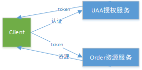
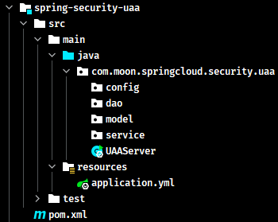

# Spring Cloud Security

- [官方文档](https://spring.io/projects/spring-cloud-security)

## 1. 概述

Spring Cloud Security 为构建安全的应用程序和分布式服务提供了一套解决方案。在 Spring Boot 和 Spring Security OAuth2 的基础上，可以快速创建系统，实现单点登录、令牌中继和令牌交换等常见模式。

## 2. Spring Cloud Security 环境介绍与搭建

Spring Security OAuth 是对 OAuth2.0 协议的一种实现，并且跟 Spring Security 相辅相成，与 Spring Cloud 体系的集成也非常便利，因为使用 Spring Cloud Security 实现分布式认证授权解决方案

### 2.1. OAuth2.0 服务

OAuth2.0 的服务提供方涵盖两个服务，即**授权服务 (Authorization Server，也叫认证服务) **和**资源服务 (Resource Server)**，使用 Spring Security OAuth2 的时候可以选择把它们在同一个应用程序中实现，也可以选择建立使用同一个授权服务的多个资源服务。

**授权服务 (Authorization Server）**应包含对接入端以及登入用户的合法性进行验证并颁发 token 等功能，对令牌的请求端点由 Spring MVC 控制器进行实现，下面是配置一个认证服务必须要实现的 endpoints：

- `AuthorizationEndpoint` 服务于认证请求。默认 URL：`/oauth/authorize`
- `TokenEndpoint` 服务于访问令牌的请求。默认 URL：`/oauth/token`

**资源服务 (Resource Server)**，应包含对资源的保护功能，对非法请求进行拦截，对请求中token进行解析鉴权等，下面的过滤器用于实现 OAuth 2.0 资源服务：

- `OAuth2AuthenticationProcessingFilter` 用来对请求给出的身份令牌解析鉴权。

### 2.2. 示例概述

以下示例分别创建 uaa 授权服务（也可叫认证服务）和order订单资源服务



认证流程如下：

1. 客户端请求 UAA 授权服务进行认证。
2. 认证通过后由 UAA 颁发令牌。
3. 客户端携带令牌 Token 请求资源服务。
4. 资源服务校验令牌的合法性，合法即返回资源信息。

### 2.3. 环境搭建

#### 2.3.1. 创建父工程

创建 maven 聚合工程 spring-cloud-security-greenwich，添加依赖如下：

```xml
<?xml version="1.0" encoding="UTF-8"?>
<project xmlns="http://maven.apache.org/POM/4.0.0"
         xmlns:xsi="http://www.w3.org/2001/XMLSchema-instance"
         xsi:schemaLocation="http://maven.apache.org/POM/4.0.0 http://maven.apache.org/xsd/maven-4.0.0.xsd">

    <parent>
        <artifactId>spring-security-sample</artifactId>
        <groupId>com.moon</groupId>
        <version>1.0-SNAPSHOT</version>
    </parent>

    <modelVersion>4.0.0</modelVersion>
    <artifactId>spring-cloud-security-greenwich</artifactId>
    <packaging>pom</packaging>
    <description>
        Spring Cloud Security 示例工程聚合项目
    </description>

    <properties>
        <project.build.sourceEncoding>UTF-8</project.build.sourceEncoding>
        <maven.compiler.source>8</maven.compiler.source>
        <maven.compiler.target>8</maven.compiler.target>
    </properties>

    <dependencyManagement>
        <dependencies>
            <!-- spring cloud 依赖 -->
            <dependency>
                <groupId>org.springframework.cloud</groupId>
                <artifactId>spring-cloud-dependencies</artifactId>
                <version>Greenwich.RELEASE</version>
                <type>pom</type>
                <scope>import</scope>
            </dependency>

            <!-- spring boot 依赖 -->
            <dependency>
                <groupId>org.springframework.boot</groupId>
                <artifactId>spring-boot-dependencies</artifactId>
                <version>2.1.3.RELEASE</version>
                <type>pom</type>
                <scope>import</scope>
            </dependency>

            <dependency>
                <groupId>javax.servlet</groupId>
                <artifactId>javax.servlet-api</artifactId>
                <version>3.1.0</version>
                <scope>provided</scope>
            </dependency>

            <dependency>
                <groupId>javax.interceptor</groupId>
                <artifactId>javax.interceptor-api</artifactId>
                <version>1.2</version>
            </dependency>

            <dependency>
                <groupId>com.alibaba</groupId>
                <artifactId>fastjson</artifactId>
                <version>1.2.47</version>
            </dependency>

            <dependency>
                <groupId>org.projectlombok</groupId>
                <artifactId>lombok</artifactId>
                <version>1.18.22</version>
            </dependency>

            <dependency>
                <groupId>mysql</groupId>
                <artifactId>mysql-connector-java</artifactId>
                <version>5.1.48</version>
            </dependency>

            <!-- jwt 依赖 -->
            <dependency>
                <groupId>org.springframework.security</groupId>
                <artifactId>spring-security-jwt</artifactId>
                <version>1.0.10.RELEASE</version>
            </dependency>

            <!-- oauth2 相关依赖 -->
            <dependency>
                <groupId>org.springframework.security.oauth.boot</groupId>
                <artifactId>spring-security-oauth2-autoconfigure</artifactId>
                <version>2.1.3.RELEASE</version>
            </dependency>
        </dependencies>
    </dependencyManagement>

    <build>
        <finalName>${project.name}</finalName>
        <resources>
            <resource>
                <directory>src/main/resources</directory>
                <filtering>true</filtering>
                <includes>
                    <include>**/*</include>
                </includes>
            </resource>
            <resource>
                <directory>src/main/java</directory>
                <includes>
                    <include>**/*.xml</include>
                </includes>
            </resource>
        </resources>
        <plugins>
            <!--<plugin>
                <groupId>org.springframework.boot</groupId>
                <artifactId>spring-boot-maven-plugin</artifactId>
            </plugin>-->

            <plugin>
                <groupId>org.apache.maven.plugins</groupId>
                <artifactId>maven-compiler-plugin</artifactId>
                <configuration>
                    <source>1.8</source>
                    <target>1.8</target>
                </configuration>
            </plugin>

            <plugin>
                <artifactId>maven-resources-plugin</artifactId>
                <configuration>
                    <encoding>utf-8</encoding>
                    <useDefaultDelimiters>true</useDefaultDelimiters>
                </configuration>
            </plugin>
        </plugins>
    </build>
</project>
```

#### 2.3.2. 创建 UAA 授权服务工程

- 创建授权服务工程 spring-security-uaa，添加如下依赖：

```xml
<?xml version="1.0" encoding="UTF-8"?>
<project xmlns="http://maven.apache.org/POM/4.0.0"
         xmlns:xsi="http://www.w3.org/2001/XMLSchema-instance"
         xsi:schemaLocation="http://maven.apache.org/POM/4.0.0 http://maven.apache.org/xsd/maven-4.0.0.xsd">
    <parent>
        <artifactId>spring-cloud-security-greenwich</artifactId>
        <groupId>com.moon</groupId>
        <version>1.0-SNAPSHOT</version>
    </parent>

    <modelVersion>4.0.0</modelVersion>
    <artifactId>spring-security-uaa</artifactId>
    <description>spring cloud security 授权认证服务</description>

    <dependencies>
        <!--<dependency>
            <groupId>org.springframework.cloud</groupId>
            <artifactId>spring-cloud-starter-netflix-eureka-client</artifactId>
        </dependency>-->

        <dependency>
            <groupId>org.springframework.cloud</groupId>
            <artifactId>spring-cloud-starter-netflix-hystrix</artifactId>
        </dependency>

        <dependency>
            <groupId>org.springframework.cloud</groupId>
            <artifactId>spring-cloud-starter-netflix-ribbon</artifactId>
        </dependency>

        <dependency>
            <groupId>org.springframework.cloud</groupId>
            <artifactId>spring-cloud-starter-openfeign</artifactId>
        </dependency>

        <dependency>
            <groupId>com.netflix.hystrix</groupId>
            <artifactId>hystrix-javanica</artifactId>
        </dependency>

        <dependency>
            <groupId>org.springframework.retry</groupId>
            <artifactId>spring-retry</artifactId>
        </dependency>

        <dependency>
            <groupId>org.springframework.boot</groupId>
            <artifactId>spring-boot-starter-actuator</artifactId>
        </dependency>

        <dependency>
            <groupId>org.springframework.boot</groupId>
            <artifactId>spring-boot-starter-web</artifactId>
        </dependency>

        <dependency>
            <groupId>org.springframework.boot</groupId>
            <artifactId>spring-boot-starter-freemarker</artifactId>
        </dependency>

        <dependency>
            <groupId>org.springframework.data</groupId>
            <artifactId>spring-data-commons</artifactId>
        </dependency>

        <!-- Spring Security 依赖 -->
        <dependency>
            <groupId>org.springframework.cloud</groupId>
            <artifactId>spring-cloud-starter-security</artifactId>
        </dependency>
        <!-- Spring Security OAuth 依赖 -->
        <dependency>
            <groupId>org.springframework.cloud</groupId>
            <artifactId>spring-cloud-starter-oauth2</artifactId>
        </dependency>
        <!-- Spring Security JWT 依赖 -->
        <dependency>
            <groupId>org.springframework.security</groupId>
            <artifactId>spring-security-jwt</artifactId>
        </dependency>

        <dependency>
            <groupId>javax.interceptor</groupId>
            <artifactId>javax.interceptor-api</artifactId>
        </dependency>

        <dependency>
            <groupId>mysql</groupId>
            <artifactId>mysql-connector-java</artifactId>
        </dependency>
        <dependency>
            <groupId>org.springframework.boot</groupId>
            <artifactId>spring-boot-starter-jdbc</artifactId>
        </dependency>

        <dependency>
            <groupId>com.alibaba</groupId>
            <artifactId>fastjson</artifactId>
        </dependency>

        <dependency>
            <groupId>org.projectlombok</groupId>
            <artifactId>lombok</artifactId>
        </dependency>
    </dependencies>

</project>
```

- 创建工程启动类，使用注解开启 eureka、hystrix、feign

```java
@SpringBootApplication
@EnableDiscoveryClient
@EnableHystrix
@EnableFeignClients(basePackages = {"com.moon.springcloud.security.uaa"})
public class UAAServer {
    public static void main(String[] args) {
        SpringApplication.run(UAAServer.class, args);
    }
}
```

- 在 resource 目录创建项目配置文件 application.yml

```yml
server:
  port: 53020
  servlet:
    context-path: /uaa
  tomcat:
    protocol_header: x-forwarded-proto
    remote_ip_header: x-forwarded-for
  use-forward-headers: true

spring:
  application:
    name: uaa-service
  datasource:
    driver-class-name: com.mysql.jdbc.Driver
    url: jdbc:mysql://localhost:3306/user_db?useUnicode=true
    username: root
    password: 123456
  freemarker:
    charset: UTF-8
    content-type: text/html
    enabled: true
    request-context-attribute: rc
    suffix: .html
  http:
    encoding:
      charset: UTF-8
      enabled: true
      force: true
  main:
    allow-bean-definition-overriding: true
  mvc:
    throw-exception-if-no-handler-found: true
  resources:
    add-mappings: false

#eureka:
#  client:
#    serviceUrl:
#      defaultZone: http://localhost:53000/eureka/
#  instance:
#    instance-id: ${spring.application.name}:${spring.cloud.client.ip-address}:${spring.application.instance_id:${server.port}}
#    preferIpAddress: true

feign:
  compression:
    request:
      enabled: true
      mime-types:
        - text/xml
        - application/xml
        - application/json
      min-request-size: 2048
    response:
      enabled: true
  hystrix:
    enabled: true

logging:
  level:
    org:
      springframework:
        web: info
    root: debug

management:
  endpoints:
    web:
      exposure:
        include: refresh,health,info,env
```

创建相关包，最终工程结构如下：



#### 2.3.3. 创建Order资源服务工程

本工程为 Order 订单服务工程，访问本工程的资源需要认证通过。


