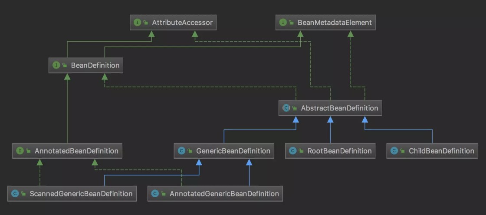
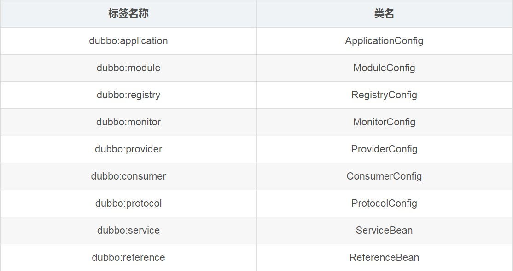
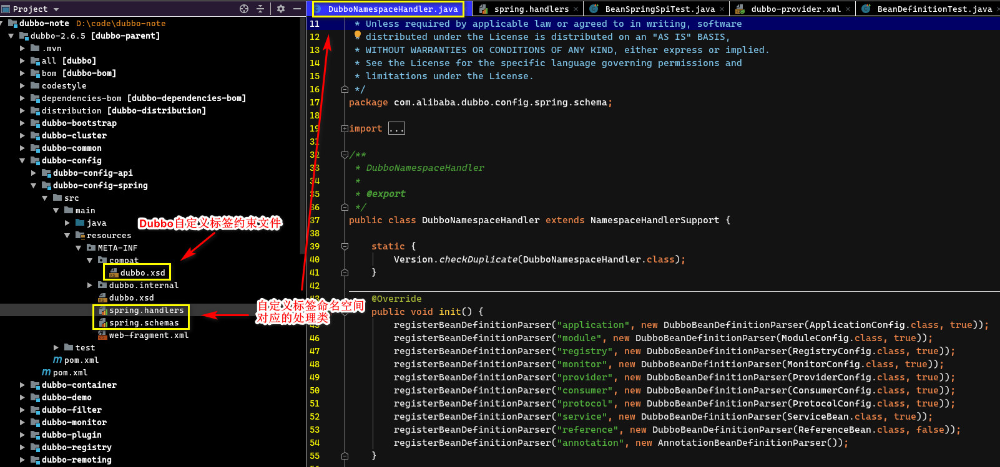
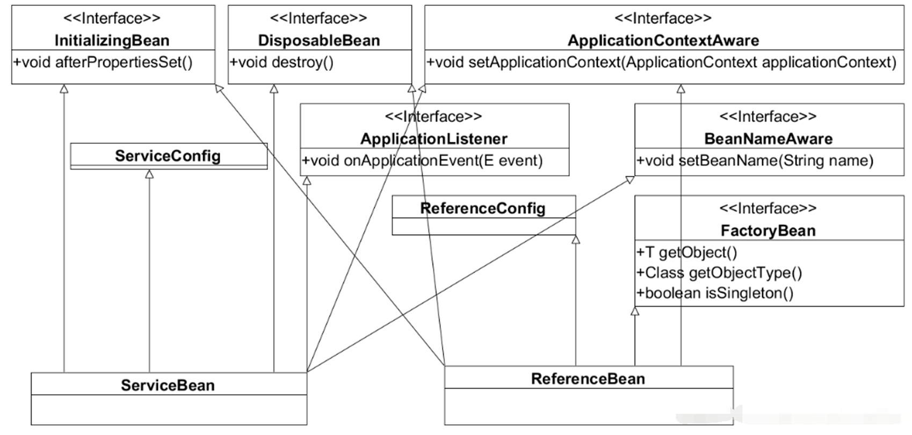

# Dubbo源码分析

## 1. 源码构建

dubbo源码仓库：https://github.com/apache/dubbo/

Dubbo 使用 maven 作为构建工具。下载源码后，使用以下命令进行构建：

```bash
mvn clean install -Dmaven.test.skip
```

通过以下命令以构建 Dubbo 的源代码 jar 包

```bash
mvn clean source:jar install -Dmaven.test.skip
```

并且修改样例项目中的 dubbo 依赖为本地仓库的 SANPSHOT 版本，然后使用远程 debug 来调试 dubbo。

## 2. Dubbo 启动过程源码分析

### 2.1. Spring 框架知识回顾 - BeanDefinition

- 在Java中，一切皆对象。在JDK中使用java.lang.Class来描述类这个对象。
- 而在Spring中，bean对象是操作核心。那么Spring也需要一个东西来描述bean这个对象，它就是BeanDefinition



```java
// 1. 定义Bean信息
RootBeanDefinition beanDef = new RootBeanDefinition();

// 2. 设置BeanDefinition相关属性
beanDef.setBeanClass(DemoServiceImpl.class);
beanDef.setBeanClassName(DemoServiceImpl.class.getName());
beanDef.setScope(BeanDefinition.SCOPE_SINGLETON); // 单例

// 3. 设置bean的属性
MutablePropertyValues propertyValues = beanDef.getPropertyValues();
propertyValues.addPropertyValue("type", "自定义");

// 4. 注册bean到spring容器
applicationContext.registerBeanDefinition("demoService", beanDef);

// 5. 测试获取刚注册的bean功能
DemoService demoService = (DemoService) applicationContext.getBean("demoService");
demoService.sayHello("自定义bean注册");
```

从示例可以看出，最后的spring动作`applicationContext.registerBeanDefinition`会在IOC容器内创建描述的bean对象。后续Dubbo的所有对象创建，皆以此形式委托给Spring来创建

### 2.2. Dubbo的配置解析过程

dubbo的配置解析，不论是xml方式的配置，还是注解方式的配置，目标都是把配置的属性值提取出来，变成dubbo的组件bean（先由BeanDefinition描述，然后委托spring生成组件bean）

下表以xml的标签为例，每个标签配置所对应要解析成为的目标组件bean



#### 2.2.1. xml配置的解析过程

1. dubbo自定义了spring标签描述约束文件dubbo.xsd。在dubbo-config-spring模块下的 `src/main/resouce/META-INF`目录下
2. 在spring.handlers、spring.schemas中指定标签解析类，将标签引入spring中管理
3. `DubboBeanDefinitionParser`继承了spring的BeanDefinitionParser接口，spring会调用parse方法来读取每个标签配置，将属性值装入对应的BeanDefinition定义中，后续spring会根据此BeanDefinition定义生成dubbo的组件bean



#### 2.2.2. 注解的解析过程

Dubbo注解解析的目标，与xml一致，都是将配置信息变为BeanDefinition定义，交由spring生成组件bean

spring项目启动的时候，最开始的切入点是`@EnableDubbo`注解，此注解用于启用dubbo配置。而此注解又引入`@EnableDubboConfig`和`@DubboComponentScan`两个注解

```java
@Target({ElementType.TYPE})
@Retention(RetentionPolicy.RUNTIME)
@Inherited
@Documented
@EnableDubboConfig
@DubboComponentScan
public @interface EnableDubbo {
    @AliasFor(annotation = DubboComponentScan.class, attribute = "basePackages")
    String[] scanBasePackages() default {};

    @AliasFor(annotation = DubboComponentScan.class, attribute = "basePackageClasses")
    Class<?>[] scanBasePackageClasses() default {};

    @AliasFor(annotation = EnableDubboConfig.class, attribute = "multiple")
    boolean multipleConfig() default false;
}
```

- `@EnableDubboConfig`：主要用于处理dubbo中全局性的组件配置，一般在`.properties`文件中的配置项，如Application/Registry/Protocol/Provider/Consumer
- `@DubboComponentScan`：负责扫描项目源代码，处理业务类上的`@Reference`、`@Service`注解

##### 2.2.2.1. @EnableDubboConfig 注解解析过程

`@EnableDubboConfig`注解主要用来解析属性文件中的配置，一般在springboot项目中比较常用，解析过程如下：

1. 通过`DubboConfigConfigurationSelector`类，连接到`DubboConfigConfiguration`类，此处配置了它支持解析的所有注解组件

```java
public class DubboConfigConfiguration {
    /**
     * Single Dubbo {@link AbstractConfig Config} Bean Binding
     */
    @EnableDubboConfigBindings({
            // 这里定义了properties文件对应的属性前缀的值，设置到相应的类中
            @EnableDubboConfigBinding(prefix = "dubbo.application", type = ApplicationConfig.class),
            @EnableDubboConfigBinding(prefix = "dubbo.module", type = ModuleConfig.class),
            @EnableDubboConfigBinding(prefix = "dubbo.registry", type = RegistryConfig.class),
            @EnableDubboConfigBinding(prefix = "dubbo.protocol", type = ProtocolConfig.class),
            @EnableDubboConfigBinding(prefix = "dubbo.monitor", type = MonitorConfig.class),
            @EnableDubboConfigBinding(prefix = "dubbo.provider", type = ProviderConfig.class),
            @EnableDubboConfigBinding(prefix = "dubbo.consumer", type = ConsumerConfig.class)
    })
    public static class Single { }
    ......
}
```

2. 此处为每个dubbo组件绑定了属性文件的前缀值。具体的处理过程在`@EnableDubboConfigBinding`注解中，最终引入到`DubboConfigBindingRegistrar`类来完成组件bean注册

##### 2.2.2.2. @DubboComponentScan 注解解析过程

`@DubboComponentScan`注解是用于解析标注在业务Service实现上的注解，主要是暴露业务服务的`@Service`和引入服务的`@Reference`。总入口在`DubboComponentScanRegistrar`类上。可以看到，两个注解是分开处理的

###### 2.2.2.2.1. @Service注解

- `@Service`注解的处理，最终由`ServiceAnnotationBeanPostProcessor`来处理。dubbo会先调用spring扫描包处理

```java
// ServiceAnnotationBeanPostProcessor类
private void registerServiceBeans(Set<String> packagesToScan, BeanDefinitionRegistry registry) {
    ......
    // 标注@Service的类也在Spring容器中实例化
    scanner.addIncludeFilter(new AnnotationTypeFilter(Service.class));

    for (String packageToScan : packagesToScan) {

        // Registers @Service Bean first
        scanner.scan(packageToScan);
    ......
}
```

```java
// ServiceAnnotationBeanPostProcessor类
 private AbstractBeanDefinition buildServiceBeanDefinition(Service service, Class<?> interfaceClass,
                                                           String annotatedServiceBeanName) {

    BeanDefinitionBuilder builder = rootBeanDefinition(ServiceBean.class);

    // 创建封装serviceBean的信息的BeanDefinition对象
    AbstractBeanDefinition beanDefinition = builder.getBeanDefinition();

    MutablePropertyValues propertyValues = beanDefinition.getPropertyValues();

    // 父类组件信息，已在前一步组装完成。这里将以下属性忽略
    String[] ignoreAttributeNames = of("provider", "monitor", "application", "module", "registry", "protocol", "interface");

    propertyValues.addPropertyValues(new AnnotationPropertyValuesAdapter(service, environment, ignoreAttributeNames));

    // References "ref" property to annotated-@Service Bean
    // 将References标签对应的ref值与Service的BeanName关系绑定起来
    addPropertyReference(builder, "ref", annotatedServiceBeanName);
    // Set interface
    builder.addPropertyValue("interface", interfaceClass.getName());
    ......
}
```

- servicebean有很多父级组件信息引入，这些组件已经在属性文件处理部分完成。
- servicebean中将ref指向业务bean

###### 2.2.2.2.2. @Reference注解

- `@Reference`注解的处理，最终由`ReferenceAnnotationBeanPostProcessor`来处理。
- `ReferenceAnnotationBeanPostProcessor`类继承于`AnnotationInjectedBeanPostProcessor`类，实现了`MergedBeanDefinitionPostProcessor`接口，方法`postProcessMergedBeanDefinition()`在创建bean实例前会被调用（用来找出bean中含有`@Reference`注解的Field和Method）

然后在`metadata.inject(bean, beanName, pvs)`方法中，对字段和方案进行反射绑定。

当Spring完成bean的创建后会调用`AbstractAutowireCapableBeanFactory#populateBean`方法完成属性的填充

### 2.3. ServiceBean与ReferenceBean关系图



### 2.4. Dubbo的服务暴露过程

> 源码导读参考官网：http://dubbo.apache.org/zh-cn/docs/source_code_guide/export-service.html

在dubbo的组件中，`ServiceBean`和`ReferenceBean`是比较特殊的。这两个组件，将完成dubbo服务的远程RPC过程

`ServiceBean`作为服务端，会在bean创建成功后，发起服务暴露流程。其过程如下：

- 实现的InitializingBean接口中，spring调用afterPropertiesSet方法，发起服务的暴露动作。

```java
@Override
@SuppressWarnings({"unchecked", "deprecation"})
public void afterPropertiesSet() throws Exception {
    ......
    if (!isDelay()) {
        // 将dubbo服务暴露到rpc网络
        export();
    }
}

@Override
public void export() {
    super.export();
    // Publish ServiceBeanExportedEvent
    publishExportEvent();
}
```

- 父类`ServiceConfig<T>`最终执行此暴露的动作

```java
private void doExportUrlsFor1Protocol(ProtocolConfig protocolConfig, List<URL> registryURLs) {
    ......
    // 包装成服务实例。此ref是ServiceBean的属性，是@Service注解对应的类，目标业务类
    Invoker<?> invoker = proxyFactory.getInvoker(ref, (Class) interfaceClass, registryURL.addParameterAndEncoded(Constants.EXPORT_KEY, url.toFullString()));
    DelegateProviderMetaDataInvoker wrapperInvoker = new DelegateProviderMetaDataInvoker(invoker, this);

    // 暴露服务
    Exporter<?> exporter = protocol.export(wrapperInvoker);
    exporters.add(exporter);
    ......
}
```

先将本地服务ref包装成Invoker，然后由protocol网络协议将invoker连通到网络上。其核心，即是一旦有protocol网络传输过来的请求，则拉起invoker动作，并将动作传递到ref服务上进行响应。在这个整个过程中，dubbo不希望每一个具体的协议ptotocol去关心目标服务是谁（耦合性太强），于是中间插入了一个invoker概念实体来解耦双方的绑定关系（重点）

#### 2.4.1. Dubbo 框架的 Invoker 机理

- 先明确Dubbo引入Invoker的目标，Invoker的本义是，invoke方法会转嫁到对象到目标ref上，接口定义如下

```java
public interface Invoker<T> extends Node {

    /**
     * get service interface.
     *
     * @return service interface.
     */
    Class<T> getInterface();

    /**
     * invoke.
     *
     * @param invocation
     * @return result
     * @throws RpcException
     */
    /* 实现此接口方法，最终会将这个执行逻辑传递到目标对象ref上 */
    Result invoke(Invocation invocation) throws RpcException;
}
```

- 协议使用方，希望如此调用Invoker：希望dubbo中的所有协议都按此模式，将网络请求转给invoker对象即可，剩下的protocol协议不要去关心

```java
/* 自定义协议示例 */
public class RmiProtocol implements Protocol {

    private static final int DEFAULT_PORT = 1099;

    @Override
    public int getDefaultPort() {
        return DEFAULT_PORT;
    }

    /* 以rmi协议为示例，暴露服务 */
    @Override
    public <T> Exporter<T> export(Invoker<T> invoker) throws RpcException {
        // 创建spring rmi服务
        final RmiServiceExporter rmiServiceExporter = new RmiServiceExporter();

        // 设置
        rmiServiceExporter.setRegistryPort(invoker.getUrl().getPort());
        rmiServiceExporter.setServiceName(invoker.getUrl().getPath());
        rmiServiceExporter.setServiceInterface(invoker.getInterface());

        /*
         * 此时目标服务没有，需要通过invoker调通，使用动态代理
         *   这里希望通过invoker对象，制作一个target服务代理来使用
         */
        T service = (T) Proxy.newProxyInstance(Thread.currentThread().getContextClassLoader(),
                new Class[]{invoker.getInterface()},
                new InvokerInvocationHandler(invoker));

        /*
         * 如果能获取目标Service接口，直接设置即可
         *   protocol协议的目标，都是要将调用转到目标target服务上，但是当前环境并没有这个目标target
         */
        rmiServiceExporter.setService(service);
        try {
            rmiServiceExporter.afterPropertiesSet();
        } catch (RemoteException e) {
            throw new RpcException(e.getMessage(), e);
        }
        return null;
    }
    ......
}
```


- Invoker如何转请求到target目标服务呢？就是交给Invoker的实现类去具体实现，如下例，invoker中本身持有目标target服务

```java
URL url = URL.valueOf("rmi://127.0.0.1:9001/" + DemoService.class.getName());

/**
 * Protocol连接服务端invoker
 * 将目标服务调用信息，包装成为invoker实体，暴露到网络上
 * <p>
 * 当网络信息到达，将触发invoker的invoke方法，最终将调用转到目标service上
 */
@Test
public void invoker2protocol() throws IOException {
    DemoService service = new DemoServiceImpl();

    // 这里将目标对象（即DemoService实例）引入到Invoker中
    Invoker<DemoService> invoker = new SimpleInvoker(service, DemoService.class, url);
    Protocol protocol = new RmiProtocol();
    // 暴露对象。协议对象只需要调用即可
    protocol.export(invoker);
    System.out.println("Dubbo server 启动");
    // 保证服务一直开着
    System.in.read();
}
```

- 后续的调用是通过java反射将方法转给target服务

```java
public class SimpleInvoker<T> implements Invoker<T> {
    private T target;
    private Class<T> type;
    private URL url;

    public SimpleInvoker(T service, Class<T> type, URL url) {
        this.target = service;
        this.type = type;
        this.url = url;
    }

    @Override
    public Class<T> getInterface() {
        return type;
    }

    @Override
    public Result invoke(Invocation invocation) throws RpcException {
        Method method = null;
        try {
            method = DemoService.class.getMethod(invocation.getMethodName(), invocation.getParameterTypes());
            // 通过反射调用目标target
            return new RpcResult(method.invoke(target, invocation.getArguments()));
        } catch (NoSuchMethodException e) {
            e.printStackTrace();
        } catch (InvocationTargetException e) {
            e.printStackTrace();
        } catch (IllegalAccessException e) {
            e.printStackTrace();
        }
        return null;
    }
    ......
}
```

#### 2.4.2. 总结服务暴露调用过程

1. protocol组件收到网络请求到来时，它需要将请求发向target目标服务（如果当前环境中有此服务就好了）。
2. 因为当前环境中没有target对象，于是它创建了一个target的代理对象proxy，将请求转给了此代理proxy对象，而此proxy对象只会干一件事，将调用转给了invoker对象的invoke方法
3. invoker对象发现自己内部有target对象，于是它使用java反射，将请求发向了target服务

> **注：如果让protocol中持有target服务，直接转向请求到target要简单得多，但这样一来，每一个ptotocol服务要对接千千万万的业务service接口，耦合性太强。于是，dubbo专门设计了invoker实体来解开两者间的直接耦合（工作中可否借鉴？）**

### 2.5. Dubbo的服务引入过程

> 源码导读参考官网：http://dubbo.apache.org/zh-cn/docs/source_code_guide/refer-service.html

- Dubbo服务的引入过程，是在Referencebean的实例化过程中实现的。当dubbo启动过程中，遇到`@Reference`，即会创建一个Referencebean的实例
- 此实例一样实现了`InitializingBean`接口，在其调用的afterPropertiesSet方法中，会为服务调用方创建一个远程代理对象
- ref是通过interface和url信息生成的代理

```java
/* ReferenceConfig<T> 类 */
/* 用于获取服务提供的代理对象 */
public synchronized T get() {
    if (destroyed) {
        throw new IllegalStateException("Already destroyed!");
    }
    if (ref == null) {
        init();
    }
    return ref;
}
```

- protocol协议制作了一个invoker对象，你可以通过invoker对象，向protocol协议发送信息（网络传输）。

```java
/* ReferenceConfig<T>#get() --> init() --> T createProxy(Map<String, String> map) */
// 通过网络协议获取一个Invoker对象
invoker = refprotocol.refer(interfaceClass, urls.get(0));
```

- 使用springrmi协议示例来说明一个这个过程

```java
private <T> T doRefer(Class<T> type, URL url) throws RpcException {
    final RmiProxyFactoryBean rmiProxyFactoryBean = new RmiProxyFactoryBean();
    if (url.getParameter(Constants.DUBBO_VERSION_KEY, Version.getProtocolVersion()).equals(Version.getProtocolVersion())) {
        rmiProxyFactoryBean.setRemoteInvocationFactory(new RemoteInvocationFactory() {
            @Override
            public RemoteInvocation createRemoteInvocation(MethodInvocation methodInvocation) {
                return new RmiRemoteInvocation(methodInvocation);
            }
        });
    }
    rmiProxyFactoryBean.setServiceUrl(url.toIdentityString());
    rmiProxyFactoryBean.setServiceInterface(type);
    rmiProxyFactoryBean.setCacheStub(true);
    rmiProxyFactoryBean.setLookupStubOnStartup(true);
    rmiProxyFactoryBean.setRefreshStubOnConnectFailure(true);
    rmiProxyFactoryBean.afterPropertiesSet();
    return (T) rmiProxyFactoryBean.getObject();
}
```

- 一个protocol协议建立后，会得到一个object输出对象，输出到网络信息的动作，都由此对象进行。本来，此对象类型已经是业务接口类型，可以直接使用此对象进行通信了。但是，考虑到protocol本身不应该跟具体的业务接口耦合，于是，dubbo再次插入了invoker实体来解耦双方
    1. 将protocol生成的输出对象object，包装成invoker对象
    2. 在业务操作端，为了方便操作，再做一个代理对象，来转请求到invoker上

```java
/**
 * Protocol连接消费端invoker
 * 将要调用的信息，包装成invoker实体，向网络发送
 * <p>
 * 本地调用接口代理时，最终方法被转到invoker的invoke方法上，向网络发送
 */
@Test
public void protocol2Invoker() {
    // 创建协议
    Protocol protocol = new RmiProtocol();

    // 创建消费端invoker，负责发送协议调用信息
    Invoker<DemoService> invoker = protocol.refer(DemoService.class, url);

    // 做一个动态代理，将调用目标指向invoker即可
    DemoService service = (DemoService) Proxy
            .newProxyInstance(Thread.currentThread().getContextClassLoader(),
                    new Class[]{invoker.getInterface()},
                    new InvokerInvocationHandler(invoker)); // 反射逻辑

    String result = service.sayHello("moon");
    System.out.println(result);
}
```

> **注：Dubbo中的invoker概念，作用不仅仅于此，它统一了dubbo中各组件间相互交流的规范，统一都用invoker进行粘合（书同文、车同轴）**

