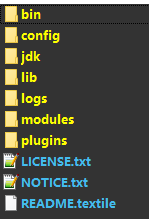
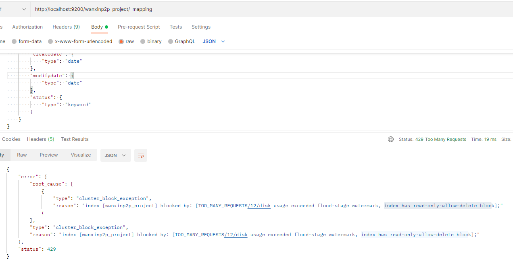
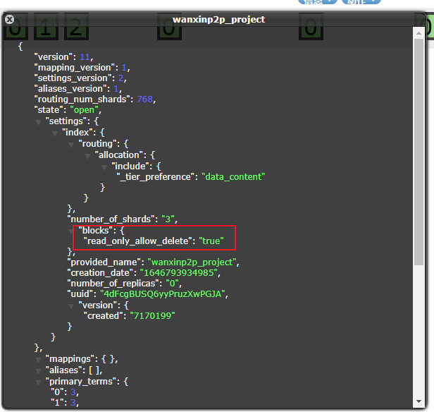
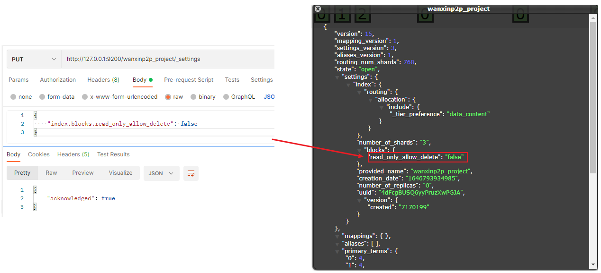
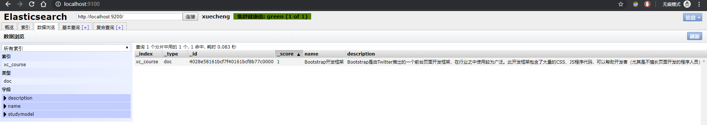
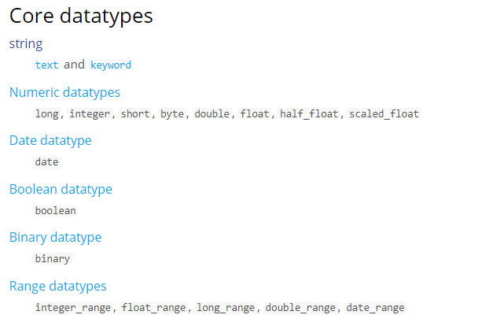

# ElasticSearch-分布式全文搜索引擎

## 1. ElasticSearch 介绍

### 1.1. 概述

ElasticSearch是一个基于Lucene的搜索服务器。它提供了一个分布式多用户能力的全文搜索引擎，基于RESTful web接口。Elasticsearch是用Java语言开发的，并作为Apache许可条款下的开放源码发布，是一种流行的企业级搜索引擎。ElasticSearch用于云计算中，能够达到实时搜索，稳定，可靠，快速，安装使用方便。官方客户端在Java、.NET（C#）、PHP、Python、Apache Groovy、Ruby和许多其他语言中都是可用的。根据DB-Engines的排名显示，Elasticsearch是最受欢迎的企业搜索引擎，其次是Apache Solr，也是基于Lucene

- 官方网址：https://www.elastic.co/cn/products/elasticsearch
- Github ：https://github.com/elastic/elasticsearch

- 总结：
    1. elasticsearch是一个基于Lucene的高扩展的分布式搜索服务器，支持开箱即用。
    2. elasticsearch隐藏了Lucene的复杂性，对外提供Restful 接口来操作索引、搜索。
- 优势：
    1. 扩展性好，可部署上百台服务器集群，处理PB级数据
    2. 近实时的去索引数据、搜索数据

> es和solr选择哪个？
>
> 1. 如果你公司现在用的solr可以满足需求就不要换了。
> 2. 如果你公司准备进行全文检索项目的开发，建议优先考虑elasticsearch，因为像Github这样大规模的搜索都在用它

### 1.2. 原理与应用

#### 1.2.1. 索引结构

下图是ElasticSearch的索引结构，下边黑色部分是物理结构，上边黄色部分是逻辑结构，逻辑结构也是为了更好的去描述ElasticSearch的工作原理及去使用物理结构中的索引文件


逻辑结构部分是一个倒排索引表：

1. 将要搜索的文档内容分词，所有不重复的词组成分词列表。
2. 将搜索的文档最终以Document方式存储起来。
3. 每个词和docment都有关联。

示例


现在，如果想搜索 `quick brown`，只需要查找包含每个词条的文档


两个文档都匹配，但是第一个文档比第二个匹配度更高。如果使用仅计算匹配词条数量的简单相似性算法，那么可以说，对于查询的相关性来讲，第一个文档比第二个文档更佳

#### 1.2.2. RESTful应用方法

Elasticsearch 提供 RESTful Api 接口进行索引、搜索，并且支持多种客户端


1. 用户在前端搜索关键字
2. 项目前端通过 http 方式请求项目服务端
3. 项目服务端通过 Http RESTful 方式请求 ES 集群进行搜索
4. ES集群从索引库检索数据

## 2. ElasticaSearch 安装

### 2.1. 下载地址

下载 ES: Elasticsearch 6.2.1

- ES 更多版本：https://www.elastic.co/cn/downloads/past-releases
- ES 最新版本：https://www.elastic.co/cn/downloads/elasticsearch

> JDK8 只支持到 7.15.x 版本

### 2.2. 安装说明

#### 2.2.1. 安装配置

1. 新版本要求至少 jdk1.8 以上。
2. 支持 tar、zip、rpm 等多种安装方式。在 windows 下开发建议使用 ZIP 安装方式。
3. 支持 docker 方式安装。更多详情参见：https://www.elastic.co/guide/en/elasticsearch/reference/current/install-elasticsearch.html

#### 2.2.2. 目录结构

解压 elasticsearch-6.2.1.zip，目录结构如下：

- bin：脚本目录，包括：启动、停止等可执行脚本
- config：配置文件目录，包括 ES 服务器所有使用的配置文件
- jdk：此目录中包含了一个完整的 JDK 工具包，版本17，当 ES 升级时，使用最新版本的 JDK 
- lib：包含 ES 运行的依赖 jar 文件
- data：索引目录，存放索引文件的地方
- logs：日志目录，包含 ES 运行后产生的所有日志文件
- modules：模块目录，包括了 ES 的所有功能模块。里面的内容也是 jar 包。和 jar 目录不同，jar 目录是 ES 运行期间依赖的 jar 包，modules 是 ES 软件自己的功能 jar 包
- plugins：插件目录，ES 支持插件机制，默认为空



> Elasticsearch 版本和支持 JVM 版本关系详见：https://www.elastic.co/cn/support/matrix#matrix_jvm

### 2.3. 配置文件

#### 2.3.1. 三个配置文件

ES的配置文件的地址根据安装形式的不同而不同：

- 使用 zip、tar 安装，配置文件的地址在安装目录的 config 下
- 使用 RPM 安装，配置文件在 `/etc/elasticsearch` 下
- 使用 MSI 安装，配置文件的地址在安装目录的 config 下，并且会自动将 config 目录地址写入环境变量 `ES_PATH_CONF`

> 本 ES 研究使用的 zip 包安装，配置文件在 ES 安装目录的 config 下

相关配置文件如下：

- **elasticsearch.yml**：用于配置 Elasticsearch 运行参数
- **jvm.options**：用于配置 Elasticsearch JVM 设置
- **log4j2.properties**：用于配置 Elasticsearch 日志

#### 2.3.2. elasticsearch.yml

##### 2.3.2.1. 配置格式说明

配置格式是YAML，可以采用如下两种方式

- 方式1：层次方式。如：`path: data: /var/lib/elasticsearch logs: /var/log/elasticsearch`
- 方式2：属性方式。如：`path.data: /var/lib/elasticsearch path.logs: /var/log/elasticsearch`

本次实践项目使用方式2，配置如下

```yml
cluster.name: xuecheng
node.name: xc_node_1
network.host: 0.0.0.0
http.port: 9200
transport.tcp.port: 9300
node.master: true
node.data: true
discovery.zen.ping.unicast.hosts: ["0.0.0.0:9300", "0.0.0.0:9301"]
discovery.zen.minimum_master_nodes: 1
node.ingest: true
bootstrap.memory_lock: false
node.max_local_storage_nodes: 2

path.data: E:\deployment-environment\elasticsearch-6.2.1\data
path.logs: E:\deployment-environment\elasticsearch-6.2.1\logs

http.cors.enabled: true
http.cors.allow-origin: /.*/
```

> 注意`path.data`和`path.logs`路径配置正确

##### 2.3.2.2. 常用的配置项说明

- `cluster.name`：配置elasticsearch的集群名称，默认是elasticsearch。建议修改成一个有意义的名称
- `node.name`：节点名，通常一台物理服务器就是一个节点，es会默认随机指定一个名字，建议指定一个有意义的名称，方便管理。一个或多个节点组成一个cluster集群，集群是一个逻辑的概念，节点是物理概念
- `path.conf`：设置配置文件的存储路径，tar或zip包安装默认在es根目录下的config文件夹，rpm安装默认在/etc/elasticsearch
- `path.data`：设置索引数据的存储路径，默认是es根目录下的data文件夹，可以设置多个存储路径，用逗号隔开
- `path.logs`：设置日志文件的存储路径，默认是es根目录下的logs文件夹
- `path.plugin`：设置插件的存放路径，默认是es根目录下的plugins文件夹
- `bootstrap.memory_lock`：设置为true可以锁住ES使用的内存，避免内存与swap分区交换数据
- `network.host`：设置绑定主机的ip地址，设置为0.0.0.0表示绑定任何ip，允许外网访问，生产环境建议设置为具体的ip
- `http.port: 9200`：设置对外服务的http端口，默认为9200
- `transport.tcp.port: 9300`：集群结点之间通信端口
- `node.master`：指定该节点是否有资格被选举成为master结点，默认是true，如果原来的master宕机会重新选举新的master
- `node.data`：指定该节点是否存储索引数据，默认为true
- `discovery.zen.ping.unicast.hosts: ["host1:port", "host2:port", "..."] `：设置集群中master节点的初始列表
- `discovery.zen.ping.timeout: 3s`：设置ES自动发现节点连接超时的时间，默认为3秒，如果网络延迟高可设置大些
- `discovery.zen.minimum_master_nodes`：主结点数量的最少值，此值的公式为：`(master_eligible_nodes / 2) + 1`，比如：有3个符合要求的主结点，那么这里要设置为2
- `node.max_local_storage_nodes`：单机允许的最大存储结点数，通常单机启动一个结点建议设置为1，开发环境如果单机启动多个节点可设置大于1
- `http.cors.enabled`：开启 cors 跨域访问支持，默认为false
- `http.cors.allow-origin`：跨域访问允许的域名地址，可以使用正则，如，允许所有域名 `/.*/`

#### 2.3.3. jvm.options

- 设置最小及最大的JVM堆内存大小，修改jvm.options，设置`-Xms`和`-Xmx`：
1. 两个值设置为相等
2. 将 `Xmx` 设置为不超过物理内存的一半

#### 2.3.4. log4j2.properties

日志文件设置，ES使用log4j，注意日志级别的配置

#### 2.3.5. 系统配置(Linux系统)

在linux上根据系统资源情况，可将每个进程最多允许打开的文件数设置大些

```bash
su limit -n
```

- 查询当前文件数

使用命令设置 limit:

方式1：先切换到root，设置完成再切回elasticsearch用户

```bash
sudo su
ulimit ‐n 65536
su elasticsearch
```

方法2：也可通过下边的方式修改文件进行持久设置。打开`/etc/security/limits.conf`文件，将下边的设置加入到此文件中

```conf
elasticsearch ‐ nofile 65536
```

### 2.4. 启动 ES

进入 ElasticSearch 根目录，进入 bin 目录，在 cmd 命令行中运行

```bash
elasticsearch.bat
```

浏览器输入：http://localhost:9200

显示结果如下（配置不同内容则不同）说明 ES启动成功

```json
{
  "name" : "xc_node_1",
  "cluster_name" : "xuecheng",
  "cluster_uuid" : "_na_",
  "version" : {
    "number" : "7.4.0",
    "build_flavor" : "default",
    "build_type" : "zip",
    "build_hash" : "22e1767283e61a198cb4db791ea66e3f11ab9910",
    "build_date" : "2019-09-27T08:36:48.569419Z",
    "build_snapshot" : false,
    "lucene_version" : "8.2.0",
    "minimum_wire_compatibility_version" : "6.8.0",
    "minimum_index_compatibility_version" : "6.0.0-beta1"
  },
  "tagline" : "You Know, for Search"
}
```

### 2.5. head 插件安装

head 插件是 ES 的一个可视化管理插件，用来监视 ES 的状态，并通过 head 客户端和 ES 服务进行交互，比如创建映射、创建索引等，head 的项目地址在`https://github.com/mobz/elasticsearch-head`

从ES6.0开始，head插件支持使得node.js运行

1. 安装node.js
2. 下载head并运行

方式一：可以使用命令行直接进行下载并运行（推荐）

```bash
# 下载
git clone git://github.com/mobz/elasticsearch-head.git

cd elasticsearch-head
# 安装依赖
npm install
# 启动
npm run start open HTTP://localhost:9100/
```

方式二：到github中下载[elasticsearch-head](https://github.com/mobz/elasticsearch-head/releases)源码。不过好像只打到5.0.0版本


解压压缩包后，进入项目的根目录，使用npm命令安装依赖并运行项目

```bash
cd E:\deployment-environment\elasticsearch-head-5.0.0\
npm install
npm run start
```

3. 运行（http://localhost:9100/）

打开浏览器调试工具发现报错：`Origin null is not allowed by Access-Control-Allow-Origin.`。

原因是：head插件作为客户端要连接ES服务（localhost:9200），此时存在跨域问题，elasticsearch默认不允许跨域访问

解决方案：设置elasticsearch允许跨域访问

在 config/elasticsearch.yml 后面增加以下参数：

```yml
# 开启cors跨域访问支持，默认为false
http.cors.enabled: true
# 跨域访问允许的域名地址，(允许所有域名)使用正则
http.cors.allow-origin: /.*/
```

> 注意：将config/elasticsearch.yml另存为utf-8编码格式


## 3. ES 快速入门

ES作为一个索引及搜索服务，对外提供丰富的REST接口，此部分的示例使用head插件来测试，目的是对ES的使用方法及流程有个初步的认识

### 3.1. 创建索引库

#### 3.1.1. 索引库概念

ES 的索引库是一个逻辑概念，它包括了分词列表及文档列表，同一个索引库中存储了相同类型的文档。它就相当于 MySQL 中的表，或相当于 Mongodb 中的集合

关于索引这个词语解释：

- 索引（名词）：ES 是基于 Lucene 构建的一个搜索服务，它要从索引库搜索符合条件索引数据。
- 索引（动词）：索引库刚创建起来是空的，将数据添加到索引库的过程称为索引。

上边讲的创建索引库相当于关系数据库中的数据库还是表？

1. 如果相当于数据库就表示一个索引库可以创建很多不同类型的文档，这在 ES 中也是允许的。
2. 如果相当于表就表示一个索引库只能存储相同类型的文档，ES 官方建议在一个索引库中只存储相同类型的文档。

#### 3.1.2. 创建方式

1. 方式一：使用 postman 或 curl 这样的工具创建

使用 postman 发送 put 请求，`http://localhost:9200/索引库名称`。请求参数如下

```json
{
    "settings": {
        "index": {
            "number_of_shards": 1,
            "number_of_replicas": 0
        }
    }
}
```

- number_of_shards：设置分片的数量，在集群中通常设置多个分片，表示一个索引库将拆分成多片分别存储不同的结点，提高了ES的处理能力和高可用性，入门程序使用单机环境，这里设置为1。
- number_of_replicas：设置副本的数量，设置副本是为了提高ES的高可靠性，单机环境设置为0

以下创建示例，创建xc_course索引库，共1个分片，0个副本


2. 方式二：使用head插件创建


### 3.2. 创建映射

#### 3.2.1. 概念说明

在索引中每个文档都包括了一个或多个field，创建映射就是向索引库中创建field的过程，下边是document和field与关系数据库的概念的类比

- 文档（Document）----------------Row 记录
- 字段（Field）-------------------Columns 列

> 注意：6.0之前的版本有type（类型）概念，type相当于关系数据库的表，ES官方将在ES9.0版本中彻底删除type

#### 3.2.2. 创建映射

创建映射方法：发送POST请求，`http://localhost:9200/索引库名称/类型名称/_mapping`

示例：把课程信息存储到ES中，这里创建课程信息的映射。创建类型为xc_course的映射，共包括三个字段：name、description、studymondel

> 由于ES6.0版本还没有将type彻底删除，所以暂时把type起一个没有特殊意义的名字

- post 请求：http://localhost:9200/xc_course/doc/_mapping
    - 以请求表示在xc_course索引库下的doc类型下创建映射。doc是类型名，可以自定义，在ES6.0中要弱化类型的概念，给它起一个没有具体业务意义的名称。
- 请求参数

```json
{
    "properties": {
        "name": {
            "type": "text"
        },
        "description": {
            "type": "text"
        },
        "studymodel": {
            "type": "keyword"
        }
    }
}
```


映射创建成功，查看head界面：


#### 3.2.3. 解决索引库只读不能创建映射的问题

如果创建索引映射报以下错误：



这是因为索引库为只读状态。



**解决方法**：

修改 elasticsearch.yml 配置文件，在最后加上以下配置

```yml
cluster.routing.allocation.disk.threshold_enabled: false
```

重启 es 服务后，通过使用 post 修改当前索引库配置即可

```json
PUT http://127.0.0.1:9200/wanxinp2p_project/_settings

{
    "index.blocks.read_only_allow_delete": false
}
```



### 3.3. 创建文档

ES中的文档相当于MySQL数据库表中的记录

发送put或Post请求：`http://localhost:9200/xc_course/doc/id值`。*如果不指定id值ES会自动生成ID*

示例：使用postman测试，发送请求 http://localhost:9200/xc_course/doc/4028e58161bcf7f40161bcf8b77c0000，上送参数

```json
{
    "name": "Bootstrap开发框架",
    "description": "Bootstrap是由Twitter推出的一个前台页面开发框架，在行业之中使用较为广泛。此开发框架包含了大量的CSS、JS程序代码，可以帮助开发者（尤其是不擅长页面开发的程序人员）轻松的实现一个不受浏览器限制的精美界面效果。",
    "studymodel": "201001"
}
```


通过head查询数据



### 3.4. 搜索文档

#### 3.4.1. 根据课程id查询文档

发送get请求：http://localhost:9200/xc_course/doc/4028e58161bcf7f40161bcf8b77c0000


#### 3.4.2. 查询所有记录

发送get请求：http://localhost:9200/xc_course/doc/_search


#### 3.4.3. 指定关键字查询相应的记录

1. 查询名称中包括spring关键字的记录

发送GET请求：http://localhost:9200/xc_course/doc/_search?q=name:bootstrap


2. 查询学习模式为201001的记录

发送GET请求：http://localhost:9200/xc_course/doc/_search?q=studymodel:201001


#### 3.4.4. 查询结果分析

分析上面查询的结果

```json
{
    "took": 4,
    "timed_out": false,
    "_shards": {
        "total": 1,
        "successful": 1,
        "skipped": 0,
        "failed": 0
    },
    "hits": {
        "total": 1,
        "max_score": 0.2876821,
        "hits": [
            {
                "_index": "xc_course",
                "_type": "doc",
                "_id": "4028e58161bcf7f40161bcf8b77c0000",
                "_score": 0.2876821,
                "_source": {
                    "name": "Bootstrap开发框架",
                    "description": "Bootstrap是由Twitter推出的一个前台页面开发框架，在行业之中使用较为广泛。此开发框架包含了大量的CSS、JS程序代码，可以帮助开发者（尤其是不擅长页面开发的程序人员）轻松的实现一个不受浏览器限制的精美界面效果。",
                    "studymodel": "201001"
                }
            }
        ]
    }
}
```

- took：本次操作花费的时间，单位为毫秒。
- timed_out：请求是否超时
- _shards：说明本次操作共搜索了哪些分片
- hits：搜索命中的记录
- hits.total：符合条件的文档总数 hits.hits ：匹配度较高的前N个文档
- hits.max_score：文档匹配得分，这里为最高分
- _score：每个文档都有一个匹配度得分，按照降序排列。
- _source：显示了文档的原始内容

## 4. IK 分词器

### 4.1. 测试分词器

在添加文档时会进行分词，索引中存放的就是一个一个的词（term），当你去搜索时就是拿关键字去匹配词，最终找到词关联的文档

测试当前索引库使用的分词器，请求POST请求：`http://localhost:9200/_analyze`，测试的请求参数如下：

```json
{
    "text": "测试分词器，后边是测试内容：spring cloud实战"
}
```

查看测试结果，会发现分词的效果将 “测试” 这个词拆分成两个单字“测”和“试”，这是因为当前索引库使用的分词器对中文就是单字分词


### 4.2. 安装IK分词器

使用IK分词器可以实现对中文分词的效果。

下载IK分词器：（Github地址：https://github.com/medcl/elasticsearch-analysis-ik），在releases标签页下载zip包（最好选择对应版本号的），解压，并将解压的文件拷贝到ES安装目录的plugins下的ik目录下，重启Elasticsearch服务


测试分词效果，发送POST请求：`http://localhost:9200/_analyze`，上送的参数增加"analyzer"属性

```json
{
    "text": "测试分词器，后边是测试内容：spring cloud实战",
    "analyzer": "ik_max_word"
}
```


### 4.3. 两种分词模式

ik分词器有两种分词模式：`ik_max_word`和`ik_smart`模式。

1. ik_max_word：会将文本做最细粒度的拆分，比如会将“中华人民共和国人民大会堂”拆分为“中华人民共和国、中华人民、中华、华人、人民共和国、人民、共和国、大会堂、大会、会堂等词语
2. ik_smart：会做最粗粒度的拆分，比如会将“中华人民共和国人民大会堂”拆分为中华人民共和国、人民大会堂

测试两种分词，发送POST请求：http://localhost:9200/_analyze

```json
{
    "text": "中华人民共和国人民大会堂",
    "analyzer": "ik_smart"
}
```

### 4.4. 自定义词库

如果要让分词器支持一些专有词语，可以自定义词库

iK分词器插件的config目录下有一个`main.dic`的文件，此文件为词库文件

在config目录中新建一个my.dic文件（注意文件格式为utf-8（不要选择utf-8 BOM）），在my.dic中自定义词语（定义方式可参考main.dic文件）

修改`config/IKAnalyzer.cfg.xml`配置文件，配置my.dic为扩展词库

```xml
<?xml version="1.0" encoding="UTF-8"?>
<!DOCTYPE properties SYSTEM "http://java.sun.com/dtd/properties.dtd">
<properties>
	<comment>IK Analyzer 扩展配置</comment>
	<!--用户可以在这里配置自己的扩展字典 -->
	<entry key="ext_dict">my.dic</entry>
	 <!--用户可以在这里配置自己的扩展停止词字典-->
	<entry key="ext_stopwords"></entry>
	<!--用户可以在这里配置远程扩展字典 -->
	<!-- <entry key="remote_ext_dict">words_location</entry> -->
	<!--用户可以在这里配置远程扩展停止词字典-->
	<!-- <entry key="remote_ext_stopwords">words_location</entry> -->
</properties>
```

重启ES，测试分词效果，发送post请求：http://localhost:9200/_analyze，请求参数如下：

```json
{
    "text": "伤月",
    "analyzer": "ik_max_word"
}
```

- 自定义分词前效果：


- 自定义分词后效果：


## 5. 映射

如果在索引和搜索时去使用ik分词器呢？如何指定其它类型的field，比如日期类型、数值类型等

### 5.1. 映射维护方法

#### 5.1.1. 查询所有索引的映射

发送GET请求：http://localhost:9200/xc_course/_mapping

#### 5.1.2. 创建映射

发送POST请求：http://localhost:9200/xc_course/doc/_mapping，以下是一个示例的请求参数

```json
{
    "properties": {
        "name": {
            "type": "text"
        },
        "description": {
            "type": "text"
        },
        "studymodel": {
            "type": "keyword"
        }
    }
}
```

#### 5.1.3. 更新映射

与创建映射发送一样的POST请求。但需要注意的是，**只可以添加新字段，已有字段不允许更新。如果要更新已有字段，只能删除整个索引库，重新创建映射**

#### 5.1.4. 删除映射

通过删除索引来删除映射。使用head图形化插件进去操作


### 5.2. 常用映射类型

下图是ES6.2核心的字段类型如下



字符串包括 `text` 和 `keyword` 两种类型

#### 5.2.1. text 文本字段
##### 5.2.1.1. analyzer 属性，通过analyzer属性指定分词器

示例：指定name的字段类型为text，使用ik分词器的ik_max_word分词模式

```json
"name": {
    "type": "text",
    "analyzer": "ik_max_word"
}
```

上边示例指定了analyzer是指在索引和搜索都使用ik_max_word，如果单独想定义搜索时使用的分词器则可以通过search_analyzer属性。对于**ik分词器建议是索引时使用ik_max_word将搜索内容进行细粒度分词，搜索时使用ik_smart提高搜索精确性**

```json
"name": {
    "type": "text",
    "analyzer": "ik_max_word",
    "search_analyzer": "ik_smart"
}
```

##### 5.2.1.2. index 属性，通过index属性指定是否索引

- 默认为`index=true`，即要进行索引，只有进行索引才可以从索引库搜索到。
- 但是也有一些内容不需要索引，比如：商品图片地址只被用来展示图片，不进行搜索图片，此时可以将index设置为false

```json
"pic": {
    "type": "text",
    "index": false
}
```

测试：删除索引，重新创建映射，将pic的index设置为false，尝试根据pic去搜索，结果搜索不到数据


##### 5.2.1.3. store 属性

是否在source之外存储，每个文档索引后会在ES中保存一份原始文档，存放在"`_source`"中，一般情况下不需要设置store为true，因为在`_source`中已经有一份原始文档了

##### 5.2.1.4. 测试

- 删除xc_course/doc下的映射
- 创建新映射：Post http://localhost:9200/xc_course/doc/_mapping

```json
{
    "properties": {
        "name": {
            "type": "text",
            "analyzer": "ik_max_word",
            "search_analyzer": "ik_smart"
        },
        "description": {
            "type": "text",
            "analyzer": "ik_max_word",
            "search_analyzer": "ik_smart"
        },
        "studymodel": {
            "type": "text"
        },
        "pic": {
            "type": "text",
            "index": false
        }
    }
}
```

- 插入文档：POST http://localhost:9200/xc_course/doc/4028e58161bcf7f40161bcf8b77c0000

```json
{
    "name": "Bootstrap开发框架",
    "description": "Bootstrap是由Twitter推出的一个前台页面开发框架，在行业之中使用较为广泛。此开发框架包含了大量的CSS、JS程序代码，可以帮助开发者（尤其是不擅长页面开发的程序人员）轻松的实现一个不受浏览器限制的精美界面效果。",
    "pic": "group1/M00/00/01/wKhlQFqO4MmAOP53AAAcwDwm6SU490.jpg",
    "studymodel": "201002"
}
```

- 查询测试：
    - Get http://localhost:9200/xc_course/_search?q=name:开发
    - Get http://localhost:9200/xc_course/_search?q=description:开发
    - Get http://localhost:9200/xc_course/_search?q=pic:group1/M00/00/01/wKhlQFqO4MmAOP53AAAcwDwm6SU490.jpg
    - Get http://localhost:9200/xc_course/_search?q=studymodel:201002

通过测试发现：name和description都支持全文检索，pic不可作为查询条件

#### 5.2.2. keyword 关键字字段

keyword字段为关键字字段，通常搜索keyword是按照整体搜索，所以**创建keyword字段的索引时是不进行分词**的，比如：邮政编码、手机号码、身份证等。keyword字段通常用于过滤、排序、聚合等

##### 5.2.2.1. 测试

1. 创建新的索引库：PUT http://localhost:9200/text_keyword
2. 创建创建映射：POST http://localhost:9200/text_keyword/doc/_mapping

```json
{
    "properties": {
        "name": {
            "type": "keyword"
        },
        "studymodel": {
            "type": "keyword"
        }
    }
}
```

3. 插入文档：POST http://localhost:9200/text_keyword/doc/123456789

```json
{
    "name": "java编程基础",
    "description": "java语言是世界第一编程语言，在软件开发领域使用人数最多。",
    "pic": "group1/M00/00/01/wKhlQFqO4MmAOP53AAAcwDwm6SU490.jpg",
    "studymodel": "201001"
}
```

4. 根据studymodel查询文档：GET http://localhost:9200/text_keyword/_search?q=studymodel:201001

name是keyword类型，所以查询方式是精确查询。所以搜索“name:java”，搜索不到记录

#### 5.2.3. date 日期类型

- 日期类型不用设置分词器
- 通常日期类型的字段用于排序
- `format`属性：通过format设置日期格式

示例：设置允许date字段存储年月日时分秒、年月日及毫秒三种格式。更新映射：POST http://localhost:9200/xc_course/doc/_mapping，增加timestamp属性映射

```json
"timestamp": {
    "type": "date",
    "format": "yyyy‐MM‐dd HH:mm:ss||yyyy‐MM‐dd"
}
```

插入文档：POST http://localhost:9200/xc_course/doc/3

```json
{
    "name": "spring开发基础",
    "description": "spring 在java领域非常流行，java程序员都在用。",
    "studymodel": "201001",
    "pic": "group1/M00/00/01/wKhlQFqO4MmAOP53AAAcwDwm6SU490.jpg",
    "timestamp": "2018‐07‐04 18:28:58"
}
```

#### 5.2.4. 数值类型

ES支持的数值类型如下图


1. 尽量选择范围小的类型，提高搜索效率
2. 对于浮点数尽量用比例因子，比如一个价格字段，单位为元，我们将比例因子设置为100这在ES中会按“分”存储，映射如下

```json
"price": {
    "type": "scaled_float",
    "scaling_factor": 100
}
```

> 由于比例因子为100，如果我们输入的价格是23.45则ES中会将23.45乘以100存储在ES中。
>
> 如果输入的价格是23.456，ES会将23.456乘以100再取一个接近原始值的数，得出2346。
>
> 使用比例因子的好处是整型比浮点型更易压缩，节省磁盘空间

如果比例因子不适合，则从下表选择范围小的去用


更新已有映射，并插入文档：POST http://localhost:9200/xc_course/doc/3

```json
{
    "name": "spring开发基础",
    "description": "spring 在java领域非常流行，java程序员都在用。",
    "studymodel": "201001",
    "pic": "group1/M00/00/01/wKhlQFqO4MmAOP53AAAcwDwm6SU490.jpg",
    "timestamp": "2018‐07‐04 18:28:58",
    "price": 38.6
}
```

#### 5.2.5. 综合例子

- 创建映射：POST http://localhost:9200/xc_course/doc/_mapping

```json
{
    "properties": {
        "description": {
            "type": "text",
            "analyzer": "ik_max_word",
            "search_analyzer": "ik_smart"
        },
        "name": {
            "type": "text",
            "analyzer": "ik_max_word",
            "search_analyzer": "ik_smart"
        },
        "pic": {
            "type": "text",
            "index": false
        },
        "price": {
            "type": "float"
        },
        "studymodel": {
            "type": "keyword"
        },
        "timestamp": {
            "type": "date",
            "format": "yyyy-MM-dd HH:mm:ss||yyyy-MM-dd||epoch_millis"
        }
    }
}
```

- 插入文档：Post http://localhost:9200/xc_course/doc/1

```json
{
    "name": "Bootstrap 开发",
    "description": "Bootstrap是由Twitter推出的一个前台页面开发框架，是一个非常流行的开发框架，此框架集成了多种页面效果。此开发框架包含了大量的CSS、JS程序代码，可以帮助开发者（尤其是不擅长页面开发的程序人员）轻松的实现一个不受浏览器限制的精美界面效果。",
    "studymodel": "201002",
    "price": 38.6,
    "timestamp": "2018-04-25 19:11:35",
    "pic": "group1/M00/00/00/wKhlQFs6RCeAY0pHAAJx5ZjNDEM428.jpg"
}
```

# JAVA 实现ES客户端操作

## 1. 搭建工程

### 1.1. ES客户端

ES提供多种不同的客户端：

1. TransportClient。ES提供的传统客户端，官方计划8.0版本删除此客户端
2. RestClient
    - RestClient是官方推荐使用的，它包括两种：Java Low Level REST Client和 Java High Level REST Client
    - ES在6.0之后提供 Java High Level REST Client，两种客户端官方更推荐使用 Java High Level REST Client，不过当前它还处于完善中，有些功能还没有
    - 此测试工程使用Java High Level REST Client，如果它有不支持的功能，则使用Java Low Level REST Client

使用ES客户端，需要添加依赖

```xml
<dependency>
    <groupId>org.elasticsearch.client</groupId>
    <artifactId>elasticsearch-rest-high-level-client</artifactId>
    <version>6.2.1</version>
</dependency>
<dependency>
    <groupId>org.elasticsearch</groupId>
    <artifactId>elasticsearch</artifactId>
    <version>6.2.1</version>
</dependency>
```

### 1.2. 创建搜索工程

1. 创建搜索工程（maven工程）：xc-service-search，pom.xml文件中添加RestHighLevelClient依赖及junit依赖

```xml
<?xml version="1.0" encoding="UTF-8"?>
<project xmlns="http://maven.apache.org/POM/4.0.0"
         xmlns:xsi="http://www.w3.org/2001/XMLSchema-instance"
         xsi:schemaLocation="http://maven.apache.org/POM/4.0.0
         http://maven.apache.org/xsd/maven-4.0.0.xsd">

    <parent>
        <artifactId>xc-framework-parent</artifactId>
        <groupId>com.xuecheng</groupId>
        <version>1.0-SNAPSHOT</version>
        <relativePath>../xc-framework-parent/pom.xml</relativePath>
    </parent>
    <modelVersion>4.0.0</modelVersion>
    <artifactId>xc-service-search</artifactId>
    <name>xc-service-search</name>
    <description>搜索服务</description>

    <dependencies>
        <dependency>
            <groupId>com.xuecheng</groupId>
            <artifactId>xc-framework-model</artifactId>
            <version>1.0-SNAPSHOT</version>
        </dependency>
        <dependency>
            <groupId>com.xuecheng</groupId>
            <artifactId>xc-framework-common</artifactId>
            <version>1.0-SNAPSHOT</version>
        </dependency>
        <dependency>
            <groupId>com.xuecheng</groupId>
            <artifactId>xc-service-api</artifactId>
            <version>1.0-SNAPSHOT</version>
        </dependency>
        <dependency>
            <groupId>org.springframework.boot</groupId>
            <artifactId>spring-boot-starter-web</artifactId>
        </dependency>
        <!-- ElasticSearch 客户端依赖 -->
        <dependency>
            <groupId>org.elasticsearch.client</groupId>
            <artifactId>elasticsearch-rest-high-level-client</artifactId>
            <version>6.2.1</version>
        </dependency>
        <!-- ElasticSearch 依赖 -->
        <dependency>
            <groupId>org.elasticsearch</groupId>
            <artifactId>elasticsearch</artifactId>
            <version>6.2.1</version>
        </dependency>
        <dependency>
            <groupId>org.springframework.boot</groupId>
            <artifactId>spring-boot-starter-test</artifactId>
            <scope>test</scope>
        </dependency>
        <dependency>
            <groupId>com.alibaba</groupId>
            <artifactId>fastjson</artifactId>
        </dependency>
        <dependency>
            <groupId>org.apache.commons</groupId>
            <artifactId>commons-io</artifactId>
        </dependency>
        <dependency>
            <groupId>org.apache.commons</groupId>
            <artifactId>commons-lang3</artifactId>
        </dependency>
    </dependencies>

</project>
```

2. 创建application.yml配置文件

```yml
server:
  port: ${port:40100}
spring:
  application:
    name: xc-search-service
xuecheng:
  elasticsearch:
    hostlist: ${eshostlist:127.0.0.1:9200} # 多个结点中间用逗号分隔
```

3. 创建配置类

在`com.xuecheng.search.config`包下创建配置类`ElasticsearchConfig`，配置初始化`RestHighLevelClient`和`RestClient`

```java
package com.xuecheng.search.config;

import org.apache.http.HttpHost;
import org.elasticsearch.client.RestClient;
import org.elasticsearch.client.RestHighLevelClient;
import org.springframework.beans.factory.annotation.Value;
import org.springframework.context.annotation.Bean;
import org.springframework.context.annotation.Configuration;

/**
 * Elasticsearch 配置类
 */
@Configuration
public class ElasticsearchConfig {
    /* 引入配置文件中Elasticsearch主机列表 */
    @Value("${xuecheng.elasticsearch.hostlist}")
    private String hostList;

    /**
     * 初始化RestHighLevelClient客户端
     *
     * @return RestHighLevelClient
     */
    @Bean
    public RestHighLevelClient restHighLevelClient() {
        // 解析hostlist配置信息
        String[] hosts = hostList.split(",");

        // 创建HttpHost数组，其中存放es主机和端口的配置信息
        int length = hosts.length;
        HttpHost[] httpHostArray = new HttpHost[length];
        // 循环创建HttpHost对象
        for (int i = 0; i < length; i++) {
            String[] hostSplit = hosts[i].split(":");
            String ip = hostSplit[0];
            int port = Integer.parseInt(hostSplit[1]);
            httpHostArray[i] = new HttpHost(ip, port, "http");
        }

        // 创建RestHighLevelClient客户端
        return new RestHighLevelClient(RestClient.builder(httpHostArray));
    }

    /**
     * 项目主要使用RestHighLevelClient，对于低级的客户端暂时不用
     *
     * @return RestClient
     */
    @Bean
    public RestClient restClient() {
        // 解析hostlist配置信息
        String[] hosts = hostList.split(",");

        // 创建HttpHost数组，其中存放es主机和端口的配置信息
        int length = hosts.length;
        HttpHost[] httpHostArray = new HttpHost[length];
        // 循环创建HttpHost对象
        for (int i = 0; i < length; i++) {
            String[] hostSplit = hosts[i].split(":");
            String ip = hostSplit[0];
            int port = Integer.parseInt(hostSplit[1]);
            httpHostArray[i] = new HttpHost(ip, port, "http");
        }

        return RestClient.builder(httpHostArray).build();
    }
}
```

4. 创建项目启动类

```java
/**
 * 搜索服务启动类
 */
@SpringBootApplication
@EntityScan("com.xuecheng.framework.domain.search") // 扫描实体类所在包
@ComponentScan(basePackages = {"com.xuecheng.api", "com.xuecheng.framework", "com.xuecheng.search"}) // 扫描接口，common工程所在包
public class SearchApplication {
    public static void main(String[] args) {
        SpringApplication.run(SearchApplication.class, args);
    }
}
```


## 2. 索引管理

### 2.1. 创建/删除索引库

#### 2.1.1. API

- 创建索引：PUT `http://localhost:9200/索引名称`

```json
{
    "settings": {
        "index": {
            "number_of_shards": 1,
            "number_of_replicas": 0
        }
    }
}
```

> - number_of_shards：分片的数量
> - number_of_replicas：副本数量

- 创建映射：PUT `http://localhost:9200/索引库名称/类型名称/_mapping`

> 示例：创建类型为xc_course的映射，共包括三个字段：name、description、studymodel。发送PUT请求`http://localhost:9200/xc_course/doc/_mapping`

```json
{
    "properties": {
        "name": {
            "type": "text",
            "analyzer": "ik_max_word",
            "search_analyzer": "ik_smart"
        },
        "description": {
            "type": "text",
            "analyzer": "ik_max_word",
            "search_analyzer": "ik_smart"
        },
        "studymodel": {
            "type": "keyword"
        },
        "price": {
            "type": "float"
        },
        "timestamp": {
            "type": "date",
            "format": "yyyy-MM-dd HH:mm:ss||yyyy-MM-dd||epoch_millis"
        }
    }
}
```

#### 2.1.2. Java Client

```java
package com.xuecheng.search;

import org.elasticsearch.action.admin.indices.create.CreateIndexRequest;
import org.elasticsearch.action.admin.indices.create.CreateIndexResponse;
import org.elasticsearch.action.admin.indices.delete.DeleteIndexRequest;
import org.elasticsearch.action.admin.indices.delete.DeleteIndexResponse;
import org.elasticsearch.client.IndicesClient;
import org.elasticsearch.client.RestClient;
import org.elasticsearch.client.RestHighLevelClient;
import org.elasticsearch.common.settings.Settings;
import org.elasticsearch.common.xcontent.XContentType;
import org.junit.Test;
import org.junit.runner.RunWith;
import org.springframework.beans.factory.annotation.Autowired;
import org.springframework.boot.test.context.SpringBootTest;
import org.springframework.test.context.junit4.SpringRunner;

import java.io.IOException;

/**
 * elasticsearch测试
 */
@SpringBootTest
@RunWith(SpringRunner.class)
public class TestIndex {

    /* 注入高等级客户端 */
    @Autowired
    private RestHighLevelClient client;
    /* 注入低等级客户端 */
    @Autowired
    private RestClient restClient;

    private static final String INDEX_NAME = "xc_course";

    /**
     * 创建索引库
     */
    @Test
    public void testCreateIndex() throws IOException {
        // 创建索引请求对象，并设置索引名称
        CreateIndexRequest createIndexRequest = new CreateIndexRequest(INDEX_NAME);
        // 设置索引参数
        createIndexRequest.settings(Settings
                .builder()
                .put("number_of_shards", "1")
                .put("number_of_replicas", "0"));
        // 设置映射
        createIndexRequest.mapping("doc","{\n" +
                "    \"properties\": {\n" +
                "        \"studymodel\": {\n" +
                "            \"type\": \"keyword\"\n" +
                "        },\n" +
                "        \"name\": {\n" +
                "            \"type\": \"keyword\"\n" +
                "        },\n" +
                "        \"description\": {\n" +
                "            \"type\": \"text\",\n" +
                "            \"analyzer\": \"ik_max_word\",\n" +
                "            \"search_analyzer\": \"ik_smart\"\n" +
                "        },\n" +
                "        \"pic\": {\n" +
                "            \"type\": \"text\",\n" +
                "            \"index\": false\n" +
                "        }\n" +
                "    }\n" +
                "}", XContentType.JSON);

        // 创建索引操作客户端
        IndicesClient indices = client.indices();
        // 执行创建索引库
        CreateIndexResponse response = indices.create(createIndexRequest);
        // 创建索引响应结果
        boolean acknowledged = response.isAcknowledged();
        System.out.println(acknowledged);
    }

    /**
     * 删除索引库
     */
    @Test
    public void testDeleteIndex() throws IOException {
        // 删除索引请求对象
        DeleteIndexRequest deleteIndexRequest = new DeleteIndexRequest(INDEX_NAME);
        // 获取操作索引的客户端
        IndicesClient indices = client.indices();
        // 执行删除索引
        DeleteIndexResponse response = indices.delete(deleteIndexRequest);
        // 删除索引响应结果
        boolean acknowledged = response.isAcknowledged();
        System.out.println(acknowledged);
    }
}
```

### 2.2. 添加文档
#### 2.2.1. API

格式如下： `PUT请求 /{index}/{type}/{id}，请求参数：{ "field": "value", ... }`

如果不指定id，ES会自动生成

> 示例 put http://localhost:9200/xc_course/doc/3

```json
{
    "name": "spring cloud实战",
    "description": "本课程主要从四个章节进行讲解：1.微服务架构入门 2.spring cloud 基础入门 3.实战SpringBoot 4.注册中心eureka。",
    "studymodel": "201001",
    "price": 5.6
}
```

#### 2.2.2. Java Client

```java
/**
 * 添加文档
 */
@Test
public void testAddDoc() throws IOException {
    // 准备文档内容的JSON数据
    Map<String, Object> jsonMap = new HashMap<>();
    jsonMap.put("name", "spring cloud实战");
    jsonMap.put("description", "本课程主要从四个章节进行讲解： 1.微服务架构入门 2.spring cloud 基础入门 3.实战Spring Boot 4.注册中心eureka。");
    jsonMap.put("studymodel", "201001");
    SimpleDateFormat dateFormat = new SimpleDateFormat("yyyy-MM-dd HH:mm:ss");
    jsonMap.put("timestamp", dateFormat.format(new Date()));
    jsonMap.put("price", 5.6f);
    // 创建新增文档请求对象
    IndexRequest indexRequest = new IndexRequest(INDEX_NAME, "doc");
    // 指定索引文档内容
    indexRequest.source(jsonMap);
    // 通过client进行http的请求，获取索引响应对象
    IndexResponse response = client.index(indexRequest);
    // 获取响应结果
    DocWriteResponse.Result result = response.getResult();
    System.out.println(result);
}
```

### 2.3. 查询文档
#### 2.3.1. API

格式如下： `GET请求 /{index}/{type}/{id}`

#### 2.3.2. Java Client

```java
/**
 * 查询文档
 */
@Test
public void testGetDoc() throws IOException {
    // 创建查询文档请求对象，根据文档id查询
    GetRequest request = new GetRequest(INDEX_NAME, "doc", "9igtC24ByDhBg8HppxYW");
    // 执行查询
    GetResponse response = client.get(request);
    // 判断是否有查询结果
    boolean exists = response.isExists();
    if(exists){
        // 得到文档的内容
        Map<String, Object> sourceAsMap = response.getSourceAsMap();
        System.out.println(sourceAsMap);
    }
}
```

### 2.4. 更新文档

#### 2.4.1. API

ES更新文档的顺序是：先检索到文档、将原来的文档标记为删除、创建新文档、删除旧文档，创建新文档就会重建索引

通过请求Url有两种方法：

1. 完全替换。发送POST请求 http://localhost:9200/xc_test/doc/3

```json
{
    "name": "spring cloud实战",
    "description": "本课程主要从四个章节进行讲解：1.微服务架构入门 2.spring cloud 基础入门 3.实战SpringBoot 4.注册中心eureka。",
    "studymodel": "201001",
    "price": 5.6
}
```

2. 局部更新。发送POST请求 http://localhost:9200/xc_test/doc/3/_update

```json
{
    "doc": {
        "price": 66.6
    }
}
```

#### 2.4.2. Java Client

使用 Client Api更新文档的方法同上边第二种局部更新方法。可以指定文档的部分字段也可以指定完整的文档内容

```java
/**
 * 查询文档
 */
@Test
public void updateDoc() throws IOException {
    // 创建更新文档请求对象，根据文档id更新
    UpdateRequest request = new UpdateRequest(INDEX_NAME, "doc", "9igtC24ByDhBg8HppxYW");
    // 准备更新的内容
    Map<String, Object> jsonMap = new HashMap<>();
    jsonMap.put("name", "DOTA2实战");
    request.doc(jsonMap);
    // 执行更新
    UpdateResponse response = client.update(request);
    // 获取更新的状态
    RestStatus status = response.status();
    System.out.println(status); // OK
}
```

### 2.5. 删除文档
#### 2.5.1. API

- 根据id删除，格式：`发送DELETE请求 /{index}/{type}/{id}`
- 搜索匹配删除，将搜索出来的记录删除，格式：`发送POST请求 /{index}/{type}/_delete_by_query`

匹配删除示例请求参数，此示例搜索匹配删除会将studymodel为201001的记录全部删除

```json
{
    "query": {
        "term": {
            "studymodel": "201001"
        }
    }
}
```

#### 2.5.2. Java Client

搜索匹配删除还没有具体的api，可以采用先搜索出文档id，根据文档id删除

```java
/**
 * 根据id删除文档
 */
@Test
public void testDelDoc() throws IOException {
    // 删除文档的id
    String id = "9igtC24ByDhBg8HppxYW";
    // 创建删除文档请求对象
    DeleteRequest request = new DeleteRequest(INDEX_NAME, "doc", id);
    // 执行删除，返回响应对象
    DeleteResponse response = client.delete(request);
    // 获取响应对象
    DocWriteResponse.Result result = response.getResult();
    System.out.println(result); // DELETED
}
```

## 3. 搜索管理

### 3.1. 准备环境

#### 3.1.1. 创建映射

创建xc_course索引库，创建如下映射：`POST http://localhost:9200/xc_course/doc/_mapping`

```json
{
    "properties": {
        "description": {
            "type": "text",
            "analyzer": "ik_max_word",
            "search_analyzer": "ik_smart"
        },
        "name": {
            "type": "text",
            "analyzer": "ik_max_word",
            "search_analyzer": "ik_smart"
        },
        "pic": {
            "type": "text",
            "index": false
        },
        "price": {
            "type": "float"
        },
        "studymodel": {
            "type": "keyword"
        },
        "timestamp": {
            "type": "date",
            "format": "yyyy-MM-dd HH:mm:ss||yyyy-MM-dd||epoch_millis"
        }
    }
}
```

> 参考 \day11 搜索服务\资料\搜索测试-初始化数据.txt

#### 3.1.2. 插入原始数据

向xc_course/doc中插入以下数据，发送

```json
# post请求：http://localhost:9200/xc_course/doc/1
{
    "name": "Bootstrap开发",
    "description": "Bootstrap是由Twitter推出的一个前台页面开发框架，是一个非常流行的开发框架，此框架集成了多种页面效果。此开发框架包含了大量的CSS、JS程序代码，可以帮助开发者（尤其是不擅长页面开发的程序人员）轻松的实现一个不受浏览器限制的精美界面效果。",
    "studymodel": "201002",
    "price": 38.6,
    "timestamp": "2018-04-25 19:11:35",
    "pic": "group1/M00/00/00/wKhlQFs6RCeAY0pHAAJx5ZjNDEM428.jpg"
}
# post请求：http://localhost:9200/xc_course/doc/2
{
    "name": "java编程基础",
    "description": "java语言是世界第一编程语言，在软件开发领域使用人数最多。",
    "studymodel": "201001",
    "price": 68.6,
    "timestamp": "2018-03-25 19:11:35",
    "pic": "group1/M00/00/00/wKhlQFs6RCeAY0pHAAJx5ZjNDEM428.jpg"
}
# post请求：http://localhost:9200/xc_course/doc/3
{
    "name": "spring开发基础",
    "description": "spring 在java领域非常流行，java程序员都在用。",
    "studymodel": "201001",
    "price": 88.6,
    "timestamp": "2018-02-24 19:11:35",
    "pic": "group1/M00/00/00/wKhlQFs6RCeAY0pHAAJx5ZjNDEM428.jpg"
}
```

> 参考 \day11 搜索服务\资料\搜索测试-初始化数据.txt

#### 3.1.3. 简单搜索

- 简单搜索就是通过url进行查询，以get方式请求ES。
- 语法格式：`发送GET请求 ../_search?q=.....`
    - q：搜索字符串

> 例子：http://localhost:9200/xc_course/doc/_search?q=name:spring，搜索name中包括spring的文档

### 3.2. DSL 搜索

- DSL(Domain Specific Language)是ES提出的基于json的搜索方式，在搜索时传入特定的json格式的数据来完成不同的搜索需求
- DSL比URI搜索方式功能强大，在项目中建议使用DSL方式来完成搜索

#### 3.2.1. 查询所有文档

##### 3.2.1.1. HTTP 请求实现

- 查询所有索引库的文档
    - 发送：`post http://localhost:9200/_search`


- 查询指定索引库指定类型下的文档。（通过使用此方法）
    - 发送：`post http://localhost:9200/xc_course/doc/_search`

```json
{
    "query": {
        "match_all": {}
    },
    "_source": [
        "name",
        "studymodel"
    ]
}
```

> `_source`：source源过滤设置，指定结果中所包括的字段有哪些


- 结果说明：
    - `took`：本次操作花费的时间，单位为毫秒。
    - `timed_out`：请求是否超时
    - `_shards`：说明本次操作共搜索了哪些分片
    - `hits`：搜索命中的记录
    - `hits.total`： 符合条件的文档总数
    - `hits.hits`：匹配度较高的前N个文档
    - `hits.max_score`：文档匹配得分，这里为最高分
    - `_score`：每个文档都有一个匹配度得分，按照降序排列
    - `_source`：显示了文档的原始内容。

##### 3.2.1.2. JavaClient 实现

```java
package com.xuecheng.search;

import org.elasticsearch.action.search.SearchRequest;
import org.elasticsearch.action.search.SearchResponse;
import org.elasticsearch.client.RestClient;
import org.elasticsearch.client.RestHighLevelClient;
import org.elasticsearch.index.query.QueryBuilders;
import org.elasticsearch.search.SearchHit;
import org.elasticsearch.search.SearchHits;
import org.elasticsearch.search.builder.SearchSourceBuilder;
import org.junit.Test;
import org.junit.runner.RunWith;
import org.springframework.beans.factory.annotation.Autowired;
import org.springframework.boot.test.context.SpringBootTest;
import org.springframework.test.context.junit4.SpringRunner;

import java.io.IOException;
import java.time.LocalDateTime;
import java.time.format.DateTimeFormatter;
import java.util.Map;

/**
 * elasticsearch - 搜索测试
 */
@SpringBootTest
@RunWith(SpringRunner.class)
public class TestSearch {

    @Autowired
    private RestHighLevelClient client;
    @Autowired
    private RestClient restClient;

    private static final String INDEX_NAME = "xc_course";
    private static final String TYPE_NAME = "doc";

    //日期格式化对象
    private static final DateTimeFormatter DATE_FORMAT = DateTimeFormatter.ofPattern("yyyy-MM-dd HH:mm:ss");

    /**
     * 搜索所有记录
     */
    @Test
    public void testSearchAll() throws IOException {
        // 创建搜索请求对象(SearchRequest)
        SearchRequest searchRequest = new SearchRequest(INDEX_NAME);
        // 指定类型
        searchRequest.types(TYPE_NAME);
        // 搜索源构建对象(SearchSourceBuilder)
        SearchSourceBuilder searchSourceBuilder = new SearchSourceBuilder();
        // 设置搜索方式：matchAllQuery搜索全部
        searchSourceBuilder.query(QueryBuilders.matchAllQuery());
        /*
         * 设置源字段
         *   public SearchSourceBuilder fetchSource(@Nullable String[] includes, @Nullable String[] excludes)
         *   参数includes：搜索的结果集包括哪些字段
         *   参数excludes：搜索的结果集不包括哪些字段
         */
        searchSourceBuilder.fetchSource(new String[]{"name", "studymodel", "price", "timestamp"}, new String[]{});
        // 向搜索请求对象(SearchRequest)中设置搜索源(SearchSourceBuilder)
        searchRequest.source(searchSourceBuilder);

        // 执行搜索，向ES发起http请求
        SearchResponse response = client.search(searchRequest);

        // 搜索结果
        SearchHits hits = response.getHits();
        // 匹配到的总记录数
        long totalHits = hits.getTotalHits();
        System.out.println("搜索匹配到的总记录数：" + totalHits);

        // 得到匹配度高的文档
        SearchHit[] searchHits = hits.getHits();
        // 循环搜索结果
        for (SearchHit hit : searchHits) {
            // 获取文档的主键
            String id = hit.getId();
            // 获取源文档内容Map
            Map<String, Object> sourceMap = hit.getSourceAsMap();
            // 获取文档的name字段内容
            String name = (String) sourceMap.get("name");
            // 由于前边设置了源文档字段过滤，这时description是取不到的
            String description = (String) sourceMap.get("description");
            // 获取文档的学习模式(studymodel字段)
            String studymodel = (String) sourceMap.get("studymodel");
            // 获取文档的价格(price)
            Double price = (Double) sourceMap.get("price");
            // 获取文档的日期(timestamp字段)
            LocalDateTime timestamp = LocalDateTime.parse((String) sourceMap.get("timestamp"), DATE_FORMAT);

            System.out.println("主键id====" + id);
            System.out.println("name字段====" + name);
            System.out.println("description字段====" + description);
            System.out.println("studymodel字段====" + studymodel);
            System.out.println("price字段====" + price);
            System.out.println("timestamp字段====" + timestamp);
        }
    }
}
```

测试结果

```console
搜索匹配到的总记录数：3
主键id====1
name字段====Bootstrap开发
description字段====null
studymodel字段====201002
price字段====38.6
timestamp字段====2018-04-25T19:11:35
主键id====2
name字段====java编程基础
description字段====null
studymodel字段====201001
price字段====68.6
timestamp字段====2018-03-25T19:11:35
主键id====3
name字段====spring开发基础
description字段====null
studymodel字段====201001
price字段====88.6
timestamp字段====2018-02-24T19:11:35
```

#### 3.2.2. 分页查询
##### 3.2.2.1. HTTP 请求实现

- ES支持分页查询，传入两个参数：`from`和`size`
    - `form`：表示起始文档的下标，从0开始
    - `size`：查询的文档数量
- 发送：`post http://localhost:9200/xc_course/doc/_search`

```json
{
    "from": 0,
    "size": 1,
    "query": {
        "match_all": {}
    },
    "_source": [
        "name",
        "studymodel"
    ]
}
```

##### 3.2.2.2. JavaClient 实现

```java
/**
 * 分页搜索记录
 */
@Test
public void testSearchPage() throws IOException {
    // 创建搜索请求对象(SearchRequest)
    SearchRequest searchRequest = new SearchRequest(INDEX_NAME);
    // 指定类型
    searchRequest.types(TYPE_NAME);
    // 搜索源构建对象(SearchSourceBuilder)
    SearchSourceBuilder searchSourceBuilder = new SearchSourceBuilder();

    int page = 1; // 当前页码
    int size = 1; // 每页记录数
    int from = (page - 1) * size; // 计算出记录起始下标
    // 设置分页参数
    searchSourceBuilder.from(from); // 起始记录下标，从0开始
    searchSourceBuilder.size(size); // 每页显示的记录数

    // 设置搜索方式：matchAllQuery搜索全部
    searchSourceBuilder.query(QueryBuilders.matchAllQuery());
    // 设置源字段
    searchSourceBuilder.fetchSource(new String[]{"name", "studymodel", "price", "timestamp"}, new String[]{});
    // 向搜索请求对象(SearchRequest)中设置搜索源(SearchSourceBuilder)
    searchRequest.source(searchSourceBuilder);

    // 执行搜索，向ES发起http请求
    SearchResponse response = client.search(searchRequest);

    // 搜索结果
    SearchHits hits = response.getHits();
    // 匹配到的总记录数
    long totalHits = hits.getTotalHits();
    System.out.println("搜索匹配到的总记录数：" + totalHits);

    // 得到匹配度高的文档
    SearchHit[] searchHits = hits.getHits();
    // 循环搜索结果
    for (SearchHit hit : searchHits) {
        // 获取源文档内容Map
        Map<String, Object> sourceMap = hit.getSourceAsMap();
        System.out.println("主键id====" + hit.getId()); // 获取文档的主键
        System.out.println("name字段====" + sourceMap.get("name"));
        System.out.println("description字段====" + sourceMap.get("description"));
        System.out.println("studymodel字段====" + sourceMap.get("studymodel"));
        System.out.println("price字段====" + sourceMap.get("price"));
        System.out.println("timestamp字段====" + LocalDateTime.parse((String) sourceMap.get("timestamp"), DATE_FORMAT));
    }
}
```

搜索结果

```console
搜索匹配到的总记录数：3
主键id====1
name字段====Bootstrap开发
description字段====null
studymodel字段====201002
price字段====38.6
timestamp字段====2018-04-25T19:11:35
```

#### 3.2.3. Term Query 精确查询

##### 3.2.3.1. HTTP 请求实现

- Term Query为精确查询，在搜索时会整体匹配关键字，不再将关键字分词，*即不会对搜索的内容分词*
- 发送：`post http://localhost:9200/xc_course/doc/_search`

```json
{
    "query": {
        "term": {
            "name": "spring"
        }
    },
    "_source": [
        "name",
        "studymodel"
    ]
}
```

> 上边的搜索会查询name包括“spring”这个词的文档


##### 3.2.3.2. JavaClient 实现

```java
/**
 * TermQuery 精确查询
 */
@Test
public void testTermQuery() throws IOException {
    // 创建搜索请求对象(SearchRequest)
    SearchRequest searchRequest = new SearchRequest(INDEX_NAME);
    // 指定类型
    searchRequest.types(TYPE_NAME);
    // 搜索源构建对象(SearchSourceBuilder)
    SearchSourceBuilder searchSourceBuilder = new SearchSourceBuilder();

    // 设置搜索方式：termQuery精确查询
    searchSourceBuilder.query(QueryBuilders.termQuery("name", "spring"));
    // 设置源字段
    searchSourceBuilder.fetchSource(new String[]{"name", "studymodel", "price", "timestamp"}, new String[]{});
    // 向搜索请求对象(SearchRequest)中设置搜索源(SearchSourceBuilder)
    searchRequest.source(searchSourceBuilder);

    // 执行搜索，向ES发起http请求
    SearchResponse response = client.search(searchRequest);

    // 搜索结果
    SearchHits hits = response.getHits();
    // 匹配到的总记录数
    long totalHits = hits.getTotalHits();
    System.out.println("搜索匹配到的总记录数：" + totalHits);

    // 得到匹配度高的文档
    SearchHit[] searchHits = hits.getHits();
    // 循环搜索结果
    for (SearchHit hit : searchHits) {
        // 获取源文档内容Map
        Map<String, Object> sourceMap = hit.getSourceAsMap();
        System.out.println("主键id====" + hit.getId()); // 获取文档的主键
        System.out.println("name字段====" + sourceMap.get("name"));
        System.out.println("description字段====" + sourceMap.get("description"));
        System.out.println("studymodel字段====" + sourceMap.get("studymodel"));
        System.out.println("price字段====" + sourceMap.get("price"));
        System.out.println("timestamp字段====" + LocalDateTime.parse((String) sourceMap.get("timestamp"), DATE_FORMAT));
    }
}
```

搜索结果

```console
搜索匹配到的总记录数：1
主键id====3
name字段====spring开发基础
description字段====null
studymodel字段====201001
price字段====88.6
timestamp字段====2018-02-24T19:11:35
```

#### 3.2.4. 根据id精确匹配

##### 3.2.4.1. HTTP 请求实现

- ES提供根据多个id值匹配的方法
- 发送：`post http://127.0.0.1:9200/xc_course/doc/_search`

```json
{
    "query": {
        "ids": {
            "type": "doc",
            "values": ["3","4","100"]
        }
    }
}
```


##### 3.2.4.2. JavaClient 实现

```java
/**
 * 根据id查询
 */
@Test
public void testTermQueryByIds() throws IOException {
    // 创建搜索请求对象(SearchRequest)
    SearchRequest searchRequest = new SearchRequest(INDEX_NAME);
    // 指定类型
    searchRequest.types(TYPE_NAME);
    // 搜索源构建对象(SearchSourceBuilder)
    SearchSourceBuilder searchSourceBuilder = new SearchSourceBuilder();

    // 设置搜索方式：根据id查询，定义需要查询的id数组
    String[] ids = new String[]{"1", "2"};
    // 此处注意：根据id查询设置是termsQuery，而不是termQuery
    searchSourceBuilder.query(QueryBuilders.termsQuery("_id", ids));
    // 设置源字段
    searchSourceBuilder.fetchSource(new String[]{"name", "studymodel", "price", "timestamp"}, new String[]{});
    // 向搜索请求对象(SearchRequest)中设置搜索源(SearchSourceBuilder)
    searchRequest.source(searchSourceBuilder);

    // 执行搜索，向ES发起http请求
    SearchResponse response = client.search(searchRequest);

    // 搜索结果
    SearchHits hits = response.getHits();
    // 匹配到的总记录数
    long totalHits = hits.getTotalHits();
    System.out.println("搜索匹配到的总记录数：" + totalHits);

    // 得到匹配度高的文档
    SearchHit[] searchHits = hits.getHits();
    // 循环搜索结果
    for (SearchHit hit : searchHits) {
        // 获取源文档内容Map
        Map<String, Object> sourceMap = hit.getSourceAsMap();
        System.out.println("主键id====" + hit.getId()); // 获取文档的主键
        System.out.println("name字段====" + sourceMap.get("name"));
        System.out.println("description字段====" + sourceMap.get("description"));
        System.out.println("studymodel字段====" + sourceMap.get("studymodel"));
        System.out.println("price字段====" + sourceMap.get("price"));
        System.out.println("timestamp字段====" + LocalDateTime.parse((String) sourceMap.get("timestamp"), DATE_FORMAT));
    }
}
```

搜索结果

```console
搜索匹配到的总记录数：2
主键id====1
name字段====Bootstrap开发
description字段====null
studymodel字段====201002
price字段====38.6
timestamp字段====2018-04-25T19:11:35
主键id====2
name字段====java编程基础
description字段====null
studymodel字段====201001
price字段====68.6
timestamp字段====2018-03-25T19:11:35
```

#### 3.2.5. matchQuery

##### 3.2.5.1. 基本操作 - HTTP 请求实现

- match Query即全文检索，它的搜索方式是先将搜索字符串分词，再使用各各词条从索引中搜索
- `match query` 与 `Term query` 区别是`match query`在搜索前先将搜索关键字分词，再拿各各词语去索引中搜索
- 发送：`post http://localhost:9200/xc_course/doc/_search`

```json
{
    "query": {
        "match": {
            "description": {
                "query": "spring java",
                "operator": "or"
            }
        }
    }
}
```

- `query`：搜索的关键字，对于英文关键字如果有多个单词则中间要用半角逗号分隔，而对于中文关键字中间可以用逗号分隔也可以不用。
- `operator`：`or` 表示只要有一个词在文档中出现则就符合条件，`and` 表示每个词都在文档中出现则才符合条件

> - 上边的搜索的执行过程是
>     1. 将“spring java”分词，分为spring、java两个词
>     2. 再使用spring和java两个词去匹配索引中搜索
>     3. 由于设置了operator为or，只要有一个词匹配成功则就返回该文档

##### 3.2.5.2. 基本操作 - JavaClient 实现

```java
/**
 * MatchQuery 查询
 */
@Test
public void testMatchQuery() throws IOException {
    // 创建搜索请求对象(SearchRequest)
    SearchRequest searchRequest = new SearchRequest(INDEX_NAME);
    // 指定类型
    searchRequest.types(TYPE_NAME);
    // 搜索源构建对象(SearchSourceBuilder)
    SearchSourceBuilder searchSourceBuilder = new SearchSourceBuilder();

    // 设置搜索方式：MatchQuery
    searchSourceBuilder.query(QueryBuilders.matchQuery("description", "spring java")
            .operator(Operator.OR));
    // 设置源字段
    searchSourceBuilder.fetchSource(new String[]{"name", "studymodel", "price", "timestamp"}, new String[]{});
    // 向搜索请求对象(SearchRequest)中设置搜索源(SearchSourceBuilder)
    searchRequest.source(searchSourceBuilder);

    // 执行搜索，向ES发起http请求
    SearchResponse response = client.search(searchRequest);

    // 搜索结果
    SearchHits hits = response.getHits();
    // 匹配到的总记录数
    long totalHits = hits.getTotalHits();
    System.out.println("搜索匹配到的总记录数：" + totalHits);

    // 得到匹配度高的文档
    SearchHit[] searchHits = hits.getHits();
    // 循环搜索结果
    for (SearchHit hit : searchHits) {
        // 获取源文档内容Map
        Map<String, Object> sourceMap = hit.getSourceAsMap();
        System.out.println("主键id====" + hit.getId()); // 获取文档的主键
        System.out.println("name字段====" + sourceMap.get("name"));
        System.out.println("description字段====" + sourceMap.get("description"));
        System.out.println("studymodel字段====" + sourceMap.get("studymodel"));
        System.out.println("price字段====" + sourceMap.get("price"));
        System.out.println("timestamp字段====" + LocalDateTime.parse((String) sourceMap.get("timestamp"), DATE_FORMAT));
    }
}
```

搜索结果

```console
搜索匹配到的总记录数：2
主键id====3
name字段====spring开发基础
description字段====null
studymodel字段====201001
price字段====88.6
timestamp字段====2018-02-24T19:11:35
主键id====2
name字段====java编程基础
description字段====null
studymodel字段====201001
price字段====68.6
timestamp字段====2018-03-25T19:11:35
```

##### 3.2.5.3. minimum_should_match - HTTP 请求实现

- 上边基本使用的`operator = or`表示只要有一个词匹配上就得分，如果实现三个词至少有两个词匹配如何实现？
- 使用minimum_should_match可以指定文档匹配词的占比，发送以下请求参数

```json
{
    "query": {
        "match": {
            "description": {
                "query": "spring开发框架",
                "minimum_should_match": "80%"
            }
        }
    }
}
```

> “spring开发框架”会被分为三个词：spring、开发、框架
>
> 设置"minimum_should_match": "80%"表示，三个词在文档的匹配占比为80%，即3*0.8=2.4，向上取整得2，表示至少有两个词在文档中要匹配成功

##### 3.2.5.4. minimum_should_match - JavaClient 实现

```java
// 设置搜索方式：MatchQuery，使用minimum_should_match匹配
searchSourceBuilder.query(QueryBuilders.matchQuery("description", "spring开发框架")
        .minimumShouldMatch("80%")); // 设置匹配占比
```

搜索结果

```console
搜索匹配到的总记录数：1
主键id====1
name字段====Bootstrap开发
description字段====null
studymodel字段====201002
price字段====38.6
timestamp字段====2018-04-25T19:11:35
```

#### 3.2.6. multiQuery

`termQuery` 和 `matchQuery` 一次只能匹配一个Field，`multiQuery` 一次可以匹配多个字段

##### 3.2.6.1. 基本使用 - HTTP 请求实现

单项匹配是在一个field中去匹配，**多项匹配是拿关键字去多个Field中匹配**

示例：发送 `post http://localhost:9200/xc_course/doc/_search`，拿关键字 “spring css”去分别匹配 name 和 description 字段

```json
{
    "query": {
        "multi_match": {
            "query":"spring css",
            "minimum_should_match":"50%",
            "fields": ["name","description"]
        }
    }
}
```

##### 3.2.6.2. 提升boost - HTTP 请求实现

匹配多个字段时可以提升字段的 boost（权重）来提高得分

示例：提升boost之前，执行下边的查询，通过查询结果会发现Bootstrap排在前边

```json
{
    "query": {
        "multi_match": {
            "query":"spring框架",
            "minimum_should_match":"50%",
            "fields": ["name","description"]
        }
    }
}
```

提升boost，通常关键字匹配上name的权重要比匹配上description的权重高，这里可以对name的权重提升。

```json
{
    "query": {
        "multi_match": {
            "query":"spring框架",
            "minimum_should_match":"50%",
            "fields": ["name^10","description"]
        }
    }
}
```

> “name^10” 表示权重提升10倍，执行上边的查询，发现name中包括spring关键字的文档排在前边

##### 3.2.6.3. JavaClient 实现

```java
/**
 * MultiMatchQuery 查询（匹配多字段查询）
 */
@Test
public void testMultiMatchQuery() throws IOException {
    // 创建搜索请求对象(SearchRequest)
    SearchRequest searchRequest = new SearchRequest(INDEX_NAME);
    // 指定类型
    searchRequest.types(TYPE_NAME);
    // 搜索源构建对象(SearchSourceBuilder)
    SearchSourceBuilder searchSourceBuilder = new SearchSourceBuilder();

    // 设置搜索方式：MultiMatchQuery，多字段匹配
    searchSourceBuilder.query(QueryBuilders.multiMatchQuery("spring框架", "name", "description")
            .minimumShouldMatch("50%") // 设置匹配占比
            .field("name", 10)); // 提升boost（权重）
    // 设置源字段
    searchSourceBuilder.fetchSource(new String[]{"name", "studymodel", "price", "timestamp"}, new String[]{});
    // 向搜索请求对象(SearchRequest)中设置搜索源(SearchSourceBuilder)
    searchRequest.source(searchSourceBuilder);

    // 执行搜索，向ES发起http请求
    SearchResponse response = client.search(searchRequest);

    // 搜索结果
    SearchHits hits = response.getHits();
    // 匹配到的总记录数
    long totalHits = hits.getTotalHits();
    System.out.println("搜索匹配到的总记录数：" + totalHits);

    // 得到匹配度高的文档
    SearchHit[] searchHits = hits.getHits();
    // 循环搜索结果
    for (SearchHit hit : searchHits) {
        // 获取源文档内容Map
        Map<String, Object> sourceMap = hit.getSourceAsMap();
        System.out.println("主键id====" + hit.getId()); // 获取文档的主键
        System.out.println("name字段====" + sourceMap.get("name"));
        System.out.println("description字段====" + sourceMap.get("description"));
        System.out.println("studymodel字段====" + sourceMap.get("studymodel"));
        System.out.println("price字段====" + sourceMap.get("price"));
        System.out.println("timestamp字段====" + LocalDateTime.parse((String) sourceMap.get("timestamp"), DATE_FORMAT));
    }
}
```

搜索结果

```console
搜索匹配到的总记录数：2
主键id====3
name字段====spring开发基础
description字段====null
studymodel字段====201001
price字段====88.6
timestamp字段====2018-02-24T19:11:35
主键id====1
name字段====Bootstrap开发
description字段====null
studymodel字段====201002
price字段====38.6
timestamp字段====2018-04-25T19:11:35
```

#### 3.2.7. 布尔查询

##### 3.2.7.1. HTTP 请求实现

布尔查询对应于Lucene的BooleanQuery查询，实现将多个查询组合起来，主要包含以下三个参数

- `must`：表示必须，多个查询条件必须都满足。（通常使用must）。文档必须匹配must所包括的查询条件，相当于 “AND”
- `should`：表示或者，多个查询条件只要有一个满足即可。文档应该匹配should所包括的查询条件其中的一个或多个，相当于 "OR"
- `must_not`：表示非。文档不能匹配must_not所包括的该查询条件，相当于“NOT”

示例：发送：`POST http://localhost:9200/xc_course/doc/_search`

```json
{
    "_source": ["name","studymodel","description"],
    "from": 0,
    "size": 1,
    "query": {
        "bool": {
            "must": [
                {
                    "multi_match": {
                        "query": "spring框架",
                        "minimum_should_match": "50%",
                        "fields": [
                            "name^10",
                            "description"
                        ]
                    }
                },
                {
                    "term": {
                        "studymodel": "201001"
                    }
                }
            ]
        }
    }
}
```

搜索结果

```json
{
    "took": 143,
    "timed_out": false,
    "_shards": {
        "total": 1,
        "successful": 1,
        "skipped": 0,
        "failed": 0
    },
    "hits": {
        "total": 1,
        "max_score": 9.801136,
        "hits": [
            {
                "_index": "xc_course",
                "_type": "doc",
                "_id": "3",
                "_score": 9.801136,
                "_source": {
                    "studymodel": "201001",
                    "name": "spring开发基础",
                    "description": "spring 在java领域非常流行，java程序员都在用。"
                }
            }
        ]
    }
}
```

##### 3.2.7.2. JavaClient 实现

```java
/**
 * BoolQuery 查询（布尔查询，多个查询组合，将搜索关键字分词，拿分词去索引库搜索）
 */
@Test
public void testBoolQuery() throws IOException {
    // 创建搜索请求对象(SearchRequest)
    SearchRequest searchRequest = new SearchRequest(INDEX_NAME);
    // 指定类型
    searchRequest.types(TYPE_NAME);
    // 搜索源构建对象(SearchSourceBuilder)
    SearchSourceBuilder searchSourceBuilder = new SearchSourceBuilder();

    // 先定义一个MultiMatchQuery，多字段匹配
    MultiMatchQueryBuilder multiMatchQueryBuilder = QueryBuilders
            .multiMatchQuery("spring框架", "name", "description")
            .minimumShouldMatch("50%") // 设置匹配占比
            .field("name", 10); // 提升boost（权重）
    // 再定义一个termQuery
    TermQueryBuilder termQueryBuilder = QueryBuilders.termQuery("studymodel", "201001");

    // 定义一个boolQuery
    BoolQueryBuilder boolQueryBuilder = QueryBuilders.boolQuery();
    // 添加MultiMatchQuery与TermQuery两个查询条件
    boolQueryBuilder.must(multiMatchQueryBuilder);
    boolQueryBuilder.must(termQueryBuilder);

    // 设置搜索方式：boolQuery查询
    searchSourceBuilder.query(boolQueryBuilder);

    // 设置源字段
    searchSourceBuilder.fetchSource(new String[]{"name", "studymodel", "price", "timestamp"}, new String[]{});
    // 向搜索请求对象(SearchRequest)中设置搜索源(SearchSourceBuilder)
    searchRequest.source(searchSourceBuilder);

    // 执行搜索，向ES发起http请求
    SearchResponse response = client.search(searchRequest);

    // 搜索结果
    SearchHits hits = response.getHits();
    // 匹配到的总记录数
    long totalHits = hits.getTotalHits();
    System.out.println("搜索匹配到的总记录数：" + totalHits);

    // 得到匹配度高的文档
    SearchHit[] searchHits = hits.getHits();
    // 循环搜索结果
    for (SearchHit hit : searchHits) {
        // 获取源文档内容Map
        Map<String, Object> sourceMap = hit.getSourceAsMap();
        System.out.println("主键id====" + hit.getId()); // 获取文档的主键
        System.out.println("name字段====" + sourceMap.get("name"));
        System.out.println("description字段====" + sourceMap.get("description"));
        System.out.println("studymodel字段====" + sourceMap.get("studymodel"));
        System.out.println("price字段====" + sourceMap.get("price"));
        System.out.println("timestamp字段====" + LocalDateTime.parse((String) sourceMap.get("timestamp"), DATE_FORMAT));
    }
}
```

搜索结果

```console
搜索匹配到的总记录数：1
主键id====3
name字段====spring开发基础
description字段====null
studymodel字段====201001
price字段====88.6
timestamp字段====2018-02-24T19:11:35
```

#### 3.2.8. 过滤器

##### 3.2.8.1. HTTP 请求实现

过滤是针对搜索的结果进行过滤，过滤器主要判断的是文档是否匹配，不去计算和判断文档的匹配度得分，所以过滤器性能比查询要高，且方便缓存，推荐尽量使用过滤器去实现查询或者过滤器和查询共同使用。

过滤器在布尔查询中使用，下边是在搜索结果的基础上进行过滤

```json
{
    "_source": [
        "name",
        "studymodel",
        "description"
    ],
    "from": 0,
    "size": 1,
    "query": {
        "bool": {
            "must": [
                {
                    "multi_match": {
                        "query": "spring框架",
                        "minimum_should_match": "50%",
                        "fields": [
                            "name^10",
                            "description"
                        ]
                    }
                }
            ],
            "filter": [
                {
                    "term": {
                        "studymodel": "201001"
                    }
                },
                {
                    "range": {
                        "price": {
                            "gte": 60,
                            "lte": 100
                        }
                    }
                }
            ]
        }
    }
}
```

> - range：范围过滤，保留大于等于60 并且小于等于100的记录
> - term：项匹配过滤，保留studymodel等于"201001"的记录
> - 注意：range和term一次只能对一个Field设置范围过滤


##### 3.2.8.2. JavaClient 实现

```java
/**
 * 在布尔查询中使用过滤器(filter)
 */
@Test
public void testFilter() throws IOException {
    // 创建搜索请求对象(SearchRequest)
    SearchRequest searchRequest = new SearchRequest(INDEX_NAME);
    // 指定类型
    searchRequest.types(TYPE_NAME);
    // 搜索源构建对象(SearchSourceBuilder)
    SearchSourceBuilder searchSourceBuilder = new SearchSourceBuilder();

    // 先定义一个MultiMatchQuery，多字段匹配
    MultiMatchQueryBuilder multiMatchQueryBuilder = QueryBuilders
            .multiMatchQuery("spring框架", "name", "description")
            .minimumShouldMatch("50%") // 设置匹配占比
            .field("name", 10); // 提升boost（权重）

    // 定义一个boolQuery
    BoolQueryBuilder boolQueryBuilder = QueryBuilders.boolQuery();
    // 添加MultiMatchQuery查询条件
    boolQueryBuilder.must(multiMatchQueryBuilder);

    // 定义过滤器
    boolQueryBuilder.filter(QueryBuilders.termQuery("studymodel", "201001"));
    boolQueryBuilder.filter(QueryBuilders.rangeQuery("price").gte(60).lte(100)); // 测试使用gte(90)，则查询不到数据

    // 设置搜索方式：boolQuery查询
    searchSourceBuilder.query(boolQueryBuilder);

    // 设置源字段
    searchSourceBuilder.fetchSource(new String[]{"name", "studymodel", "price", "timestamp"}, new String[]{});
    // 向搜索请求对象(SearchRequest)中设置搜索源(SearchSourceBuilder)
    searchRequest.source(searchSourceBuilder);

    // 执行搜索，向ES发起http请求
    SearchResponse response = client.search(searchRequest);

    // 搜索结果
    SearchHits hits = response.getHits();
    // 匹配到的总记录数
    long totalHits = hits.getTotalHits();
    System.out.println("搜索匹配到的总记录数：" + totalHits);

    // 得到匹配度高的文档
    SearchHit[] searchHits = hits.getHits();
    // 循环搜索结果
    for (SearchHit hit : searchHits) {
        // 获取源文档内容Map
        Map<String, Object> sourceMap = hit.getSourceAsMap();
        System.out.println("主键id====" + hit.getId()); // 获取文档的主键
        System.out.println("name字段====" + sourceMap.get("name"));
        System.out.println("description字段====" + sourceMap.get("description"));
        System.out.println("studymodel字段====" + sourceMap.get("studymodel"));
        System.out.println("price字段====" + sourceMap.get("price"));
        System.out.println("timestamp字段====" + LocalDateTime.parse((String) sourceMap.get("timestamp"), DATE_FORMAT));
    }
}
```

搜索结果

```console
搜索匹配到的总记录数：1
主键id====3
name字段====spring开发基础
description字段====null
studymodel字段====201001
price字段====88.6
timestamp字段====2018-02-24T19:11:35
```

#### 3.2.9. 排序

##### 3.2.9.1. HTTP 请求实现

可以在字段上添加一个或多个排序，支持在keyword、date、float等类型上添加，text类型的字段上不允许添加排序

示例：发送 `POST http://localhost:9200/xc_course/doc/_search`，过滤0-10元价格范围的文档，并且对结果进行排序，先按studymodel降序，再按价格升序

```json
{
    "_source": [
        "name",
        "studymodel",
        "description"
    ],
    "query": {
        "bool": {
            "filter": [
                {
                    "range": {
                        "price": {
                            "gte": 0,
                            "lte": 100
                        }
                    }
                }
            ]
        }
    },
    "sort": [
        {
            "studymodel": "desc"
        },
        {
            "price": "asc"
        }
    ]
}
```


##### 3.2.9.2. JavaClient 实现

```java
/**
 * 排序查询(Sort)
 */
@Test
public void testSort() throws IOException {
    // 创建搜索请求对象(SearchRequest)
    SearchRequest searchRequest = new SearchRequest(INDEX_NAME);
    // 指定类型
    searchRequest.types(TYPE_NAME);
    // 搜索源构建对象(SearchSourceBuilder)
    SearchSourceBuilder searchSourceBuilder = new SearchSourceBuilder();

    // 定义一个boolQuery
    BoolQueryBuilder boolQueryBuilder = QueryBuilders.boolQuery();
    // 定义过滤器
    boolQueryBuilder.filter(QueryBuilders.rangeQuery("price").gte(0).lte(100));
    // 设置搜索方式：boolQuery查询
    searchSourceBuilder.query(boolQueryBuilder);

    // 添加排序
    searchSourceBuilder.sort("studymodel", SortOrder.DESC);
    searchSourceBuilder.sort("price", SortOrder.ASC);

    // 设置源字段
    searchSourceBuilder.fetchSource(new String[]{"name", "studymodel", "price", "timestamp"}, new String[]{});
    // 向搜索请求对象(SearchRequest)中设置搜索源(SearchSourceBuilder)
    searchRequest.source(searchSourceBuilder);

    // 执行搜索，向ES发起http请求
    SearchResponse response = client.search(searchRequest);

    // 搜索结果
    SearchHits hits = response.getHits();
    // 匹配到的总记录数
    long totalHits = hits.getTotalHits();
    System.out.println("搜索匹配到的总记录数：" + totalHits);

    // 得到匹配度高的文档
    SearchHit[] searchHits = hits.getHits();
    // 循环搜索结果
    for (SearchHit hit : searchHits) {
        // 获取源文档内容Map
        Map<String, Object> sourceMap = hit.getSourceAsMap();
        System.out.println("主键id====" + hit.getId()); // 获取文档的主键
        System.out.println("name字段====" + sourceMap.get("name"));
        System.out.println("description字段====" + sourceMap.get("description"));
        System.out.println("studymodel字段====" + sourceMap.get("studymodel"));
        System.out.println("price字段====" + sourceMap.get("price"));
        System.out.println("timestamp字段====" + LocalDateTime.parse((String) sourceMap.get("timestamp"), DATE_FORMAT));
    }
}
```

搜索结果

```console
搜索匹配到的总记录数：3
主键id====1
name字段====Bootstrap开发
description字段====null
studymodel字段====201002
price字段====38.6
timestamp字段====2018-04-25T19:11:35
主键id====2
name字段====java编程基础
description字段====null
studymodel字段====201001
price字段====68.6
timestamp字段====2018-03-25T19:11:35
主键id====3
name字段====spring开发基础
description字段====null
studymodel字段====201001
price字段====88.6
timestamp字段====2018-02-24T19:11:35
```

#### 3.2.10. 高亮显示

##### 3.2.10.1. HTTP 请求实现

高亮显示可以将搜索结果一个或多个字突出显示，以便向用户展示匹配关键字的位置。在搜索语句中添加highlight即可实现

示例：发送 `Post http://127.0.0.1:9200/xc_course/doc/_search`

```json
{
    "_source": [
        "name",
        "studymodel",
        "description",
        "price"
    ],
    "query": {
        "bool": {
            "must": [
                {
                    "multi_match": {
                        "query": "开发框架",
                        "minimum_should_match": "50%",
                        "fields": [
                            "name^10",
                            "description"
                        ],
                        "type": "best_fields"
                    }
                }
            ],
            "filter": [
                {
                    "range": {
                        "price": {
                            "gte": 0,
                            "lte": 100
                        }
                    }
                }
            ]
        }
    },
    "sort": [
        {
            "price": "asc"
        }
    ],
    "highlight": {
        "pre_tags": [
            "<tag>"
        ],
        "post_tags": [
            "</tag>"
        ],
        "fields": {
            "name": {},
            "description": {}
        }
    }
}
```

##### 3.2.10.2. JavaClient 实现

```java
/**
 * 高亮查询(Highlight)
 */
@Test
public void testHighlight() throws IOException {
    // 创建搜索请求对象(SearchRequest)
    SearchRequest searchRequest = new SearchRequest(INDEX_NAME);
    // 指定类型
    searchRequest.types(TYPE_NAME);
    // 搜索源构建对象(SearchSourceBuilder)
    SearchSourceBuilder searchSourceBuilder = new SearchSourceBuilder();

    // 先定义一个MultiMatchQuery，多字段匹配
    MultiMatchQueryBuilder multiMatchQueryBuilder = QueryBuilders
            .multiMatchQuery("开发框架", "name", "description")
            .minimumShouldMatch("50%") // 设置匹配占比
            .field("name", 10); // 提升boost（权重）

    // 定义一个boolQuery
    BoolQueryBuilder boolQueryBuilder = QueryBuilders.boolQuery();
    // 添加MultiMatchQuery查询条件
    boolQueryBuilder.must(multiMatchQueryBuilder);

    // 定义过滤器
    boolQueryBuilder.filter(QueryBuilders.rangeQuery("price").gte(0).lte(100));
    // 设置搜索方式：boolQuery查询
    searchSourceBuilder.query(boolQueryBuilder);

    // 添加排序
    searchSourceBuilder.sort("studymodel", SortOrder.DESC);
    searchSourceBuilder.sort("price", SortOrder.ASC);

    // 设置源字段
    searchSourceBuilder.fetchSource(new String[]{"name", "studymodel", "price", "timestamp", "description"}, new String[]{});

    // 在执行搜索前，进行高亮设置
    HighlightBuilder highlightBuilder = new HighlightBuilder();
    highlightBuilder.preTags("<tag>"); // 设置前缀
    highlightBuilder.postTags("</tag>"); // 设置后缀
    // 设置高亮字段
    highlightBuilder.fields().add(new HighlightBuilder.Field("name"));
    highlightBuilder.fields().add(new HighlightBuilder.Field("description"));
    // 在搜索对象中设置高亮
    searchSourceBuilder.highlighter(highlightBuilder);

    // 向搜索请求对象(SearchRequest)中设置搜索源(SearchSourceBuilder)
    searchRequest.source(searchSourceBuilder);
    // 执行搜索，向ES发起http请求
    SearchResponse response = client.search(searchRequest);

    // 搜索结果
    SearchHits hits = response.getHits();
    // 匹配到的总记录数
    long totalHits = hits.getTotalHits();
    System.out.println("搜索匹配到的总记录数：" + totalHits);

    // 得到匹配度高的文档
    SearchHit[] searchHits = hits.getHits();
    // 循环搜索结果
    for (SearchHit hit : searchHits) {
        // 获取源文档内容Map
        Map<String, Object> sourceMap = hit.getSourceAsMap();

        /* 获取name字段 */
        String name = (String) sourceMap.get("name");
        /* 获取高亮字段内容 */
        Map<String, HighlightField> highlightFields = hit.getHighlightFields();
        if (highlightFields != null) {
            // 取出name高亮字段
            HighlightField nameHighlightField = highlightFields.get("name");
            if (nameHighlightField != null) {
                Text[] fragments = nameHighlightField.getFragments();
                StringBuilder stringBuilder = new StringBuilder();
                for (Text text : fragments) {
                    stringBuilder.append(text.toString());
                }
                name = stringBuilder.toString();
            }
        }

        System.out.println("主键id====" + hit.getId()); // 获取文档的主键
        System.out.println("name字段====" + name);
        System.out.println("description字段====" + sourceMap.get("description"));
        System.out.println("studymodel字段====" + sourceMap.get("studymodel"));
        System.out.println("price字段====" + sourceMap.get("price"));
        System.out.println("timestamp字段====" + LocalDateTime.parse((String) sourceMap.get("timestamp"), DATE_FORMAT));
    }
}
```

搜索结果

```console
搜索匹配到的总记录数：3
主键id====1
name字段====Bootstrap<tag>开发</tag>
description字段====Bootstrap是由Twitter推出的一个前台页面开发框架，是一个非常流行的开发框架，此框架集成了多种页面效果。此开发框架包含了大量的CSS、JS程序代码，可以帮助开发者（尤其是不擅长页面开发的程序人员）轻松的实现一个不受浏览器限制的精美界面效果。
studymodel字段====201002
price字段====38.6
timestamp字段====2018-04-25T19:11:35
主键id====2
name字段====java编程基础
description字段====java语言是世界第一编程语言，在软件开发领域使用人数最多。
studymodel字段====201001
price字段====68.6
timestamp字段====2018-03-25T19:11:35
主键id====3
name字段====spring<tag>开发</tag>基础
description字段====spring 在java领域非常流行，java程序员都在用。
studymodel字段====201001
price字段====88.6
timestamp字段====2018-02-24T19:11:35
```

## 4. 集群管理

### 4.1. 集群结构

ES通常以集群方式工作，这样做不仅能够提高ES的搜索能力还可以处理大数据搜索的能力，同时也增加了系统的容错能力及高可用，ES可以实现PB级数据的搜索。

下图是ES集群结构的示意图


ES集群图涉及以下概念

1. 结点
    - ES集群由多个服务器组成，每个服务器即为一个Node结点(该服务只部署了一个ES进程)。
2. 分片
    - 当文档量很大时，由于内存和硬盘的限制，同时也为了提高ES的处理能力、容错能力及高可用能力，将索引分成若干分片，每个分片可以放在不同的服务器，这样就实现了多个服务器共同对外提供索引及搜索服务。
    - 一个搜索请求过来，会分别从各各分片去查询，最后将查询到的数据合并返回给用户。
3. 副本
    - 为了提高ES的高可用同时也为了提高搜索的吞吐量，将分片复制一份或多份存储在其它的服务器，这样即使当前的服务器挂掉了，拥有副本的服务器照常可以提供服务。
4. 主结点
    - 一个集群中会有一个或多个主结点，主结点的作用是集群管理，比如增加节点，移除节点等，主结点挂掉后ES会重新选一个主结点。
5. 结点转发
    - 每个结点都知道其它结点的信息，可以对任意一个结点发起请求，接收请求的结点会转发给其它结点查询数据

### 4.2. 搭建集群

下边的例子实现创建一个2结点的集群，并且索引的分片我们设置2片，每片一个副本

#### 4.2.1. 结点的三个角色

- 主结点：master 节点主要用于集群的管理及索。比如新增结点、分片分配、索引的新增和删除等。
- 数据结点：data 节点上保存了数据分片，它负责索引和搜索操作。
- 客户端结点：client 节点仅作为请求客户端存在，client的作用也作为负载均衡器，client 节点不存数据，只是将请求均衡转发到其它结点

- 通过下边两项参数来配置结点的功能：
    - `node.master`：是否允许为主结点
    - `node.data`：允许存储数据作为数据结点
    - `node.ingest`：是否允许成为协调节点
- 四种组合方式：
    - `master=true，data=true`：即是主结点又是数据结点
    - `master=false，data=true`：仅是数据结点
    - `master=true，data=false`：仅是主结点，不存储数据
    - `master=false，data=false`：即不是主结点也不是数据结点，此时可设置ingest为true表示它是一个客户端

#### 4.2.2. 创建结点1

解压 elasticsearch-6.2.1.zip 到 E:\deployment-environment\elasticsearch-6.2.1\

- 结点1对外服务的http端口是：9200
- 集群管理端口是9300
- 配置elasticsearch.yml，设置结点名：xc_node_1

结点1 elasticsearch.yml配置如下

```yml
# 配置elasticsearch的集群名称
cluster.name: xuecheng
# 节点名
node.name: xc_node_1
# 设置绑定主机的ip地址，设置为0.0.0.0表示绑定任何ip，允许外网访问，生产环境建议设置为具体的ip
network.host: 0.0.0.0
# 设置对外服务的http端口，默认为9200
http.port: 9200
# 集群结点之间通信端口
transport.tcp.port: 9300
# 该节点是否有资格被选举成为master结点
node.master: true
# 指定该节点是否存储索引数据
node.data: true
# 设置集群中master节点的初始列表
discovery.zen.ping.unicast.hosts: ["0.0.0.0:9300", "0.0.0.0:9301"]
discovery.zen.minimum_master_nodes: 1
node.ingest: true
bootstrap.memory_lock: false
node.max_local_storage_nodes: 2

# 设置索引数据的存储路径
path.data: E:\deployment-environment\elasticsearch-6.2.1\data
# 设置日志文件的存储路径
path.logs: E:\deployment-environment\elasticsearch-6.2.1\logs

# 开启cors跨域访问支持，默认为false
http.cors.enabled: true
# 跨域访问允许的域名地址，(允许所有域名)使用正则
http.cors.allow-origin: /.*/
```

#### 4.2.3. 创建结点2

解压 elasticsearch-6.2.1.zip 到 E:\deployment-environment\elasticsearch-6.2.1-2\

- 结点2对外服务的http端口是：9201
- 集群管理端口是9301
- 配置elasticsearch.yml，设置结点名：xc_node_2

结点2 elasticsearch.yml配置如下

```yml
# 配置elasticsearch的集群名称
cluster.name: xuecheng
# 节点名
node.name: xc_node_2
# 设置绑定主机的ip地址，设置为0.0.0.0表示绑定任何ip，允许外网访问，生产环境建议设置为具体的ip
network.host: 0.0.0.0
# 设置对外服务的http端口，默认为9200
http.port: 9201
# 集群结点之间通信端口
transport.tcp.port: 9301
# 该节点是否有资格被选举成为master结点
node.master: true
# 指定该节点是否存储索引数据
node.data: true
# 设置集群中master节点的初始列表
discovery.zen.ping.unicast.hosts: ["0.0.0.0:9300", "0.0.0.0:9301"]
discovery.zen.minimum_master_nodes: 1
node.ingest: true
bootstrap.memory_lock: false
node.max_local_storage_nodes: 2

# 设置索引数据的存储路径
path.data: E:\deployment-environment\elasticsearch-6.2.1-2\data
# 设置日志文件的存储路径
path.logs: E:\deployment-environment\elasticsearch-6.2.1-2\logs

# 开启cors跨域访问支持，默认为false
http.cors.enabled: true
# 跨域访问允许的域名地址，(允许所有域名)使用正则
http.cors.allow-origin: /.*/
```

> 注：每个结点需要安装IK分词器

#### 4.2.4. 创建索引库

1. 使用head连上其中一个结点


2. 创建索引库，共2个分片，每个分片一个副本


创建成功


#### 4.2.5. 集群的健康

通过访问 `GET /_cluster/health` 来查看Elasticsearch 的集群健康情况

- 有三种颜色来展示健康状态：`green`、`yellow` 或者 `red`
    - `green`：所有的主分片和副本分片都正常运行
    - `yellow`：所有的主分片都正常运行，但有些副本分片运行不正常
    - `red`：存在主分片运行不正常

Get请求：http://localhost:9200/_cluster/health，响应结果如下：

```json
{
    "cluster_name": "xuecheng",
    "status": "green",
    "timed_out": false,
    "number_of_nodes": 2,
    "number_of_data_nodes": 2,
    "active_primary_shards": 2,
    "active_shards": 4,
    "relocating_shards": 0,
    "initializing_shards": 0,
    "unassigned_shards": 0,
    "delayed_unassigned_shards": 0,
    "number_of_pending_tasks": 0,
    "number_of_in_flight_fetch": 0,
    "task_max_waiting_in_queue_millis": 0,
    "active_shards_percent_as_number": 100.0
}
```

#### 4.2.6. 集群相关测试

1. 创建映射并写入文档，连接其中任意一台结点，创建映射写入文档。发送：`Post http://localhost:9200/xc_course/doc/3`

```json
{
    "name": "spring开发基础",
    "description": "spring 在java领域非常流行，java程序员都在用。",
    "studymodel": "201001",
    "price": 66.6
}
```

响应结果

```json
{
    "_index": "xc_course",
    "_type": "doc",
    "_id": "3",
    "_version": 1,
    "result": "created",
    "_shards": {
        "total": 2,
        "successful": 2,
        "failed": 0
    },
    "_seq_no": 0,
    "_primary_term": 1
}
```

从结果的提示可看出，两个分片都保存成功

2. 搜索，向其它一个结点发起搜索请求，查询全部数据
3. 关闭一个结点。ES会重新选中一个主结点（前提在配置结点时允许它可以为主结点）。此时向活的结点发起搜索请求，仍然正常


4. 添加一个结点
    - 结点3对外服务的http端口是：9202
    - 集群管理端口是9302
    - 配置elasticsearch.yml，设置结点名：xc_node_3
    - 此结点的配置：node.master: false node.data: true

启动结点3，刷新head，下图显示ES将分片分在了3个结点


向结点3发起搜索请求：`Get http://127.0.0.1:9202/xc_course/doc/_search` 全部数据可被正常搜索到
