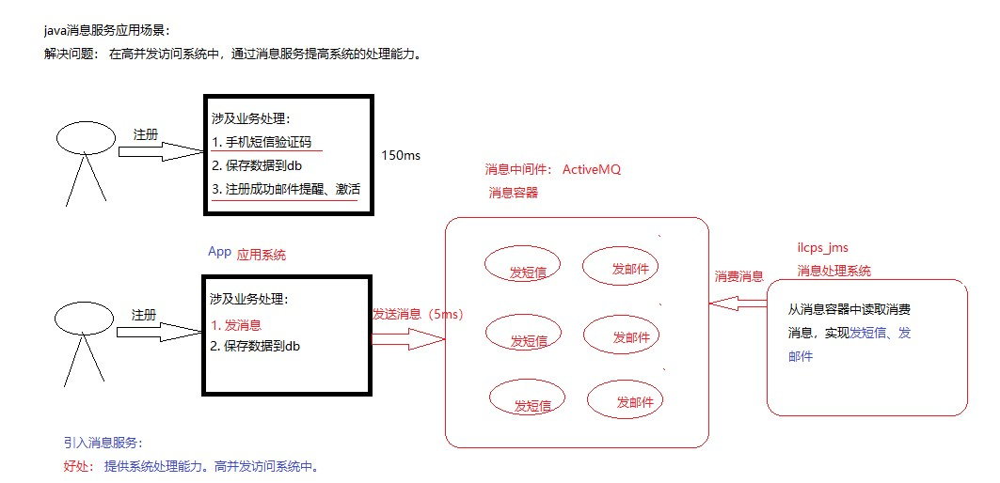
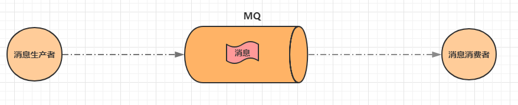

# JMS 消息中间件

## 1. 消息中间件介绍

- JMS 也叫作消息中间件。
- 中间件：独立于系统之外的一个服务器
- 几种常用中间件介绍：
    - Tomcat 也叫web中间件，提供web服务。
    - Redis 也叫中间件。提供缓存服务。
    - JMS 中间件，提供的就是消息服务

JMS 即Java消息服务（Java Message Service）应用程序接口，是一个Java平台中关于面向消息中间件（MOM）的API，用于在两个应用程序之间，或分布式系统中发送消息，进行异步通信。

JMS 使您能够通过消息收发服务（有时称为消息中介程序或路由器）从一个 JMS 客户机向另一个 JMS 客户机发送消息。

消息是JMS中的一种类型对象，由两部分组成：报头和消息主体。报头由路由信息以及有关该消息的元数据组成。消息主体则携带着应用程序的数据或有效负载。根据有效负载的类型来划分，可以将消息分为几种类型，它们分别携带：简单文本(TextMessage)、可序列化的对象(ObjectMessage)、属性集合(MapMessage)、字节流(BytesMessage)、原始值流(StreamMessage)，还有无有效负载的消息(Message)。

消息队列中间件是分布式系统中重要的组件，主要解决应用耦合，异步消息，流量削锋等实现高性能，高可用，可伸缩和最终一致架构。

使用较多的消息队列有ActiveMQ，RabbitMQ（常用），ZeroMQ，Kafka（最新），MetaMQ，RocketMQ（常用）

使用java消息服务解决的问题？

**通过消息中间件，减轻在大量并发访问时候服务器压力。主要是在分页式系统中，通过消息服务系统解决高并发访问的情况处理，提高系统处理效率**

## 2. MQ 简介

### 2.1. 什么是MQ

MQ（Message Queue）是一种跨进程的通信机制，用于传递消息。简单说，就是一个先进先出的数据结构。

### 2.2. MQ（消息队列）应用场景

消息队列在实际应用中常用的四个使用场景

A. 异步处理
B. 应用解耦
C. 流量削锋
D. 消息通讯

#### 2.2.1. 异步解耦

最常见的一个场景是用户注册后，需要发送注册邮件和短信通知，以告知用户注册成功。实际当数据写入注册系统后，注册系统就可以把其他的操作放入对应的消息队列 MQ 中然后马上返回用户结果，由消息队列 MQ 异步地进行这些操作。架构图如下：

异步解耦是消息队列 MQ 的主要特点，主要目的是减少请求响应时间和解耦。主要的使用场景就是将**比较耗时而且不需要即时（同步）返回结果**的操作作为消息放入消息队列。同时，由于使用了消息队列MQ，只要保证消息格式不变，消息的发送方和接收方并不需要彼此联系，也不需要受对方的影响，即解耦合。

#### 2.2.2. 流量削峰

流量削峰也是消息队列 MQ 的常用场景，一般在秒杀或团队抢购(高并发)活动中使用广泛。

在秒杀或团队抢购活动中，由于用户请求量较大，导致流量暴增，秒杀的应用在处理如此大量的访问流量后，下游的通知系统无法承载海量的调用量，甚至会导致系统崩溃等问题而发生漏通知的情况。为解决这些问题，可在应用和下游通知系统之间加入消息队列 MQ。

秒杀处理流程如下所述：

1. 用户发起海量秒杀请求到秒杀业务处理系统。
2. 秒杀处理系统按照秒杀处理逻辑将满足秒杀条件的请求发送至消息队列 MQ。
3. 下游的通知系统订阅消息队列 MQ 的秒杀相关消息，再将秒杀成功的消息发送到相应用户。
4. 用户收到秒杀成功的通知。

### 2.3. 常见的MQ产品

目前业界有很多MQ产品，比较出名的有：

- ZeroMQ

号称最快的消息队列系统，尤其针对大吞吐量的需求场景。扩展性好，开发比较灵活，采用C语言实现，实际上只是一个socket库的重新封装，如果做为消息队列使用，需要开发大量的代码。ZeroMQ仅提供非持久性的队列，也就是说如果down机，数据将会丢失。

- RabbitMQ

使用erlang语言开发，性能较好，适合于企业级的开发。但是不利于做二次开发和维护。

- ActiveMQ

历史悠久的Apache开源项目。已经在很多产品中得到应用，实现了JMS1.1规范，可以和spring-jms轻松融合，实现了多种协议，支持持久化到数据库，对队列数较多的情况支持不好。

- RocketMQ

阿里巴巴的MQ中间件，由java语言开发，性能非常好，能够撑住双十一的大流量，而且使用起来很简单。

- Kafka

Kafka是Apache下的一个子项目，是一个高性能跨语言分布式Publish/Subscribe消息队列系统，相对于ActiveMQ是一个非常轻量级的消息系统，除了性能非常好之外，还是一个工作良好的分布式系统。
