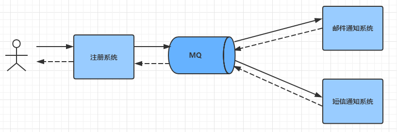

# JMS 消息中间件

## 1. 消息中间件介绍

- JMS 也叫作消息中间件。
- 中间件：独立于系统之外的一个服务器
- 几种常用中间件介绍：
    - Tomcat 也叫web中间件，提供web服务。
    - Redis 也叫中间件。提供缓存服务。
    - JMS 中间件，提供的就是消息服务

JMS 即Java消息服务（Java Message Service）应用程序接口，是一个Java平台中关于面向消息中间件（MOM）的API，<font color=red>用于在两个应用程序之间，或分布式系统中发送消息，进行异步通信。</font>

JMS 使您能够通过消息收发服务（有时称为消息中介程序或路由器）从一个 JMS 客户机向另一个 JMS 客户机发送消息。

消息是JMS中的一种类型对象，由两部分组成：报头和消息主体。报头由路由信息以及有关该消息的元数据组成。消息主体则携带着应用程序的数据或有效负载。根据有效负载的类型来划分，可以将消息分为几种类型，它们分别携带：简单文本(TextMessage)、可序列化的对象(ObjectMessage)、属性集合(MapMessage)、字节流(BytesMessage)、原始值流(StreamMessage)，还有无有效负载的消息(Message)。

消息队列中间件是分布式系统中重要的组件，主要解决应用耦合，异步消息，流量削锋等实现高性能，高可用，可伸缩和最终一致架构。

使用较多的消息队列有ActiveMQ，RabbitMQ（常用），ZeroMQ，Kafka（最新），MetaMQ，RocketMQ（常用）

使用java消息服务解决的问题？

<font color=red>**通过消息中间件，减轻在大量并发访问时候服务器压力。主要是在分页式系统中，通过消息服务系统解决高并发访问的情况处理，提高系统处理效率**</font>


## 2. MQ 简介

### 2.1. 什么是MQ

MQ（Message Queue）是一种跨进程的通信机制，用于传递消息。简单说，就是一个先进先出的数据结构。


### 2.2. MQ（消息队列）应用场景

消息队列在实际应用中常用的四个使用场景

A. 异步处理
B. 应用解耦
C. 流量削锋
D. 消息通讯

#### 2.2.1. 异步解耦

最常见的一个场景是用户注册后，需要发送注册邮件和短信通知，以告知用户注册成功。实际当数据写入注册系统后，注册系统就可以把其他的操作放入对应的消息队列 MQ 中然后马上返回用户结果，由消息队列 MQ 异步地进行这些操作。架构图如下：



异步解耦是消息队列 MQ 的主要特点，主要目的是减少请求响应时间和解耦。主要的使用场景就是将**比较耗时而且不需要即时（同步）返回结果**的操作作为消息放入消息队列。同时，由于使用了消息队列MQ，只要保证消息格式不变，消息的发送方和接收方并不需要彼此联系，也不需要受对方的影响，即解耦合。

#### 2.2.2. 流量削峰

流量削峰也是消息队列 MQ 的常用场景，一般在秒杀或团队抢购(高并发)活动中使用广泛。

在秒杀或团队抢购活动中，由于用户请求量较大，导致流量暴增，秒杀的应用在处理如此大量的访问流量后，下游的通知系统无法承载海量的调用量，甚至会导致系统崩溃等问题而发生漏通知的情况。为解决这些问题，可在应用和下游通知系统之间加入消息队列 MQ。


模型图说明

- 可以控制活动的人数
- 可以缓解短时间内高流量压垮应用
- 用户的请求，服务器接收后，首先写入消息队列。假如消息队列长度超过最大数量，则直接抛弃用户请求或跳转到错误页面
- 秒杀业务根据消息队列中的请求信息，再做后续处理

秒杀处理流程如下所述：

1. 用户发起海量秒杀请求到秒杀业务处理系统。
2. 秒杀处理系统按照秒杀处理逻辑将满足秒杀条件的请求发送至消息队列 MQ。
3. 下游的通知系统订阅消息队列 MQ 的秒杀相关消息，再将秒杀成功的消息发送到相应用户。
4. 用户收到秒杀成功的通知。

#### 2.2.3. 日志处理

目志处理是指将消息队列用在目志处理中，比如Kafka的应用，解决大量日志传输的问题。架构简化如下：


- 日志采集客户端，负责目志数据采集，定时写受写入 Kafka 队列
- Kafka 消息队列，负责目志数据的接收，存储和转发
- 日志处理应用：订阅并消费 kafka 队列中的目志数据


1. Kafka：接收用户目志的消息队列
2. Logstash：做目志解析，统一成JSON输出给Elasticsearch
3. Elasticsearch：实时日志分析服务的核心技术，一个schemaless，实时的数据存储服务，通过index组织数据，兼具强大的搜索和统计功能
4. Kibana：基于Elasticsearch的数据可视化组件，超强的数据可视化能力是众多公司选择ELK stack的重要原因

ELK平台：

- E：Elasticsearch 搜索服务
- L：Logstash 日志解析
- Kibana：可视化视图组件

ELK平台部署参考：《开源实时日志分析ELK平台部署.docx》

#### 2.2.4. 消息通讯

消息通讯是指，消息队列一般都内置了高效的通信机制，因此也可以用在纯的消息通讯。比如实现点对点消息队列，或者聊天室等。

点对点通讯：客户端 A 和客户端 B 使用同一队列，进行消息通讯


聊天室通讯：客户端A，客户端B，客户端N订阅同一主题，进行消息发布和接收。实现类似聊天室效果。


以上实际是消息队列的两种消息模式，点对点或发布订阅模式


### 2.3. 常见的MQ产品

目前业界有很多MQ产品，比较出名的有：

- ZeroMQ

号称最快的消息队列系统，尤其针对大吞吐量的需求场景。扩展性好，开发比较灵活，采用C语言实现，实际上只是一个socket库的重新封装，如果做为消息队列使用，需要开发大量的代码。ZeroMQ仅提供非持久性的队列，也就是说如果down机，数据将会丢失。

- RabbitMQ

使用erlang语言开发，性能较好，适合于企业级的开发。但是不利于做二次开发和维护。

- ActiveMQ

历史悠久的Apache开源项目。已经在很多产品中得到应用，实现了JMS1.1规范，可以和spring-jms轻松融合，实现了多种协议，支持持久化到数据库，对队列数较多的情况支持不好。

- RocketMQ

阿里巴巴的MQ中间件，由java语言开发，性能非常好，能够撑住双十一的大流量，而且使用起来很简单。

- Kafka

Kafka是Apache下的一个子项目，是一个高性能跨语言分布式Publish/Subscribe消息队列系统，相对于ActiveMQ是一个非常轻量级的消息系统，除了性能非常好之外，还是一个工作良好的分布式系统。

## 3. JMS 消息服务相关概念

消息队列的JAVAEE规范JMS。JMS(Java Message Service,java消息服务）API是一个消息服务的标准/规范，允许应用程序组件基于JavaEE平台创建、发送、接收和读取消息。它使分布式通信耦合度更低，消息服务更加可靠以及异步性。

在EJB架构中，有消息bean可以无缝的与JM消息服务集成。在J2EE架构模式中，有消息服务者模式，用于实现消息与应用直接的解耦。

### 3.1. 消息模型

在JMS标准中，有两种消息模型：

1. P2P (Point to Point) 点对点模型（Queue队列模型）
2. Publish/Subscribe(Pub/Sub) 发布/订阅模型(Topic主题模型)

### 3.2. P2P模型

#### 3.2.1. P2P 模型图


#### 3.2.2. P2P 涉及概念

1. 消息队列(Queue)
2. 发送者(Sender)
3. 接收者(Receiver)，消费者

<font color=red>每个消息都被发送到一个特定的队列，接收者从队列中获取消息。队列保留着消息，直到他们被消费或超时。</font>

#### 3.2.3. P2P 的特点

1. 每个消息只有一个消费者(Consumer)（即一旦被消费，消息就不再在消息队列中）
2. 发送者和接收者之间在时间上没有依赖性，也就是说当发送者发送了消息之后，不管接收者有没有正在运行，它不会影响到消息被发送到队列
3. 接收者在成功接收消息之后需向队列应答成功(自动应答机制)
4. 如果希望发送的每个消息都会被成功处理的话，那么需要 P2P 模式。

### 3.3. Pub/Sub 模式

#### 3.3.1. Pub/Sub 模式图


#### 3.3.2. 涉及概念

1. 主题(Topic)
2. 发布者(Publisher)
3. 订阅者(Subscriber)

<font color=red>多个发布者将消息发送到Topic，系统将这些消息传递给多个订阅者。</font>

#### 3.3.3. Pub/Sub 的特点

1. 每个消息可以有多个消费者
2. **发布者和订阅者之间有时间上的依赖性**。针对某个主题(Topic)的订阅者，它必须创建一个订阅者之后，才能消费发布者的消息
3. 为了消费消息，订阅者必须保持运行的状态
4. 为了缓和这样严格的时间相关性，JMS允许订阅者创建一个可持久化的订阅。这样，即使订阅者没有被激活（运行），它也能接收到发布者的消息。
5. 如果希望<font color=red>**发送的消息可以不被做任何处理、以及只被一个消息者处或者被多个消费者处理的话，那么可以采用Pub/Sub模型**</font>。(群发)

### 3.4. 消息消费

在JMS中，消息的产生和消费都是异步的。对于消费来说，JMS的消息者可以通过两种方式来消费消息。

1. 同步
    - 订阅者或接收者通过receive方法来接收消息，receive方法在接收到消息之前（或超时之前）将一直阻塞；
    - 消费者等待消费：如果队列/主题中没有消息，那就一直等待。知道有消息消费就结束。
2. 异步
    - 订阅者或接收者可以注册为一个消息监听器。当消息到达之后，系统自动调用监听器的onMessage方法。
    - 消费者监听消息。

JNDI：java命名和目录接口是一种标准的Java命名系统接口。可以在网络上查找和访问服务。通过指定一个资源名称，该名称对应于数据库或命名服务中的一个记录，同时返回资源连接建立所必须的信息。

JNDI在JMS中起到查找和访回发送目标或消息来源的作用。

## 4. JMS 编程模型 API

### 4.1. ConnectionFactory

创建 connection 对象的工厂，针对两种不同的jms消息模型，分别有`QueueConnectionFactory`和`TopicConnectionFactory`两种。可以通过JNDI来查找`ConnectionFactory`对象。

### 4.2. Destination

`Destination` 的意思是消息生产者的消息发送目标或者说消息消费者的消息来源。对于消息生产者来说，它的 `Destination` 是某个队列(Queue)或某个主题(Topic)，对于消息消费者来说，它的`Destination` 也是某个队列或主题（即消息来源）。

所以，`Destination` 实际上就是两种类型的对象Queue、Topic可以通过JNDI来查找 `Destination`。

### 4.3. Connection

`Connection` 表示在客户端和JMS系统之间建立的链接（对TCP/IP socket的包装）。

`Connection` 可以产生一个或多个Session，跟 `ConnectionFactory` 一样，Connection 也有两种类型：`Queueconnection` 和 `TopicConnection`

JMS的Connection参数说明

```java
createSession(paramA, paramB);
```

- paramA是设置事务的，paramA 取值有 : true or false 表示是否支持事务
    - paramA设置为false时：paramB的值可为Session.AUTO_ACKNOWLEDGE，Session.CLIENT_ACKNOWLEDGE，DUPS_OK_ACKNOWLEDGE其中一个。
    - paramA设置为true时：paramB的值忽略， acknowledgment mode被jms服务器设置为SESSION_TRANSACTED 。
- paramB设置acknowledgment mode	paramB 取值有:Session.AUTO_ACKNOWLEDGE，Session.CLIENT_ACKNOWLEDGE，DUPS_OK_ACKNOWLEDGE，SESSION_TRANSACTED
    - Session.AUTO_ACKNOWLEDGE为自动确认，客户端发送和接收消息不需要做额外的工作。
    - Session.CLIENT_ACKNOWLEDGE为客户端确认。客户端接收到消息后，必须调用javax.jms.Message的acknowledge方法。jms服务器才会删除消息。
    - DUPS_OK_ACKNOWLEDGE允许副本的确认模式。一旦接收方应用程序的方法调用从处理消息处返回，会话对象就会确认消息的接收；而且允许重复确认。在需要考虑资源使用时，这种模式非常有效。

### 4.4. session

session是操作消息的接口。可以通过session创建生产者、消费者、消息等。session提供了事务的功能。当需要使用session发送/接收多个消息时，可以将这些发送/接收动作放到一个事务中。同样，也分 `QueueSession` 和 TopicSession``

### 4.5. 消息的生产者

消息生产者由session创建，并用于将消息发送到 `Destination`。同样，消息生产者分两种类型：`QueueSender` 和 `TopicPublisher` 可以调用消息生产者的方法(send或publish方法）发送消息。

### 4.6. 消息消费者

消息消费者由session创建，用于接收被发送到`Destination`的消息。两种类型：`QueueReceiver`和`TopicSubscriber`可分别通过session的`createReceiver(Queue)`或`createSubscriber(Topic)`来创建。当然也可以session的`creatDurableSubscriber`方法来创建持久化的订阅者。

### 4.7. MessageListener

消息监听器。如果注册了消息监听器，一旦消息到达，将自动调用监听器的 `onMessage` 方法。EJB中的MDB(Message-Driven Bean)就是一种 `MessageListener`。


