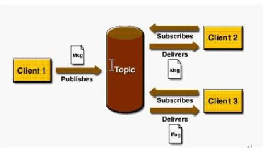
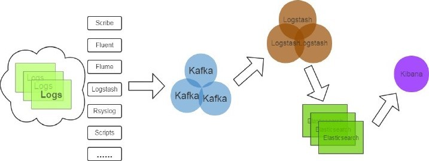

# 消息中间件

## 1. 名词解释

### 1.1. 消息的概念

从广义角度来说，消息其实就是信息，但是和信息又有所不同。信息通常被定义为一组数据，而消息除了具有数据的特征之外，还有消息的来源与接收的概念。通常发送消息的一方称为**消息的生产者**，接收消息的一方称为**消息的消费者**。

为什么要设置生产者和消费者呢？这就是要说到消息的意义了。信息通常就是一组数据，但是消息由于有了生产者和消费者，就出现了消息中所包含的信息可以被二次解读，生产者发送消息，可以理解为生产者发送了一个信息，也可以理解为生产者发送了一个命令；消费者接收消息，可以理解为消费者得到了一个信息，也可以理解为消费者得到了一个命令。对比一下就会发现信息是一个基本数据，而命令则可以关联下一个行为动作，这样就可以理解为基于接收的消息相当于得到了一个行为动作，使用这些行为动作就可以组织成一个业务逻辑，进行进一步的操作。总的来说，消息其实也是一组信息，只是为其赋予了全新的含义，因为有了消息的流动，并且是有方向性的流动，带来了基于流动的行为产生的全新解读。开发者就可以基于消息的这种特殊解，将其换成代码中的指令。

对于消息的理解，初学者总认为消息内部的数据非常复杂，这是一个误区。比如发送了一个消息，要求接受者翻译发送过去的内容。初学者会认为消息中会包含被翻译的文字，已经本次操作要执行翻译操作而不是打印操作。其实这种现象有点过度解读了，发送的消息中仅仅包含被翻译的文字，但是可以通过控制不同的人接收此消息来确认要做的事情。例如发送被翻译的文字仅到A程序，而A程序只能进行翻译操作，这样就可以发送简单的信息完成复杂的业务了，是通过接收消息的主体不同，进而执行不同的操作，而不会在消息内部定义数据的操作行为，当然如果开发者希望消息中包含操作种类信息也是可以的，只是提出消息的内容可以更简单，更单一。

对于消息的生产者与消费者的工作模式，还可以将消息划分成两种模式，**同步消费**与**异步消息**

- 同步消息就是生产者发送完消息，等待消费者处理，消费者处理完将结果告知生产者，然后生产者继续向下执行业务。这种模式过于卡生产者的业务执行连续性，在现在的企业级开发中，上述这种业务场景通常不会采用消息的形式进行处理。
- 异步消息就是生产者发送完消息，无需等待消费者处理完毕，生产者继续向下执行其他动作。比如生产者发送了一个日志信息给日志系统，发送过去以后生产者就向下做其他事情了，无需关注日志系统的执行结果。日志系统根据接收到的日志信息继续进行业务执行，是单纯的记录日志，还是记录日志并报警，这些和生产者无关，这样生产者的业务执行效率就会大幅度提升。并且可以通过添加多个消费者来处理同一个生产者发送的消息来提高系统的高并发性，改善系统工作效率，提高用户体验。一旦某一个消费者由于各种问题宕机了，也不会对业务产生影响，提高了系统的高可用性。

### 1.2. 中间件的概念

中间件：独立于系统之外的一个服务器。以上是几种常用中间件介绍：

- Tomcat 也叫web中间件，提供web服务。
- Redis 也叫中间件。提供缓存服务。
- JMS 中间件，提供的就是消息服务


## 2. Java 处理消息的标准规范

目前企业级开发中广泛使用的消息处理技术共三大类，具体如下：

- JMS
- AMQP
- MQTT

以上均为规范，开发针对规范开发，运行时实现。这三类规范都是针对异步消息进行处理的，也符合消息的设计本质，处理异步的业务。

### 2.1. JMS

#### 2.1.1. 概述

JMS 即 Java 消息服务（Java Message Service）应用程序接口，是一个 Java 平台中关于面向消息中间件（MOM）的API，<font color=red>用于在两个应用程序之间，或分布式系统中发送消息，进行异步通信。</font>

JMS 能够通过消息收发服务（有时称为消息中介程序或路由器）从一个 JMS 客户机向另一个 JMS 客户机发送消息。


消息队列中间件是分布式系统中重要的组件，主要解决应用耦合，异步消息，流量削锋等实现高性能，高可用，可伸缩和最终一致架构。

使用较多的消息队列有 ActiveMQ，RabbitMQ（常用），ZeroMQ，Kafka（最新），MetaMQ，RocketMQ（常用）

使用 java 消息服务解决的问题？

<font color=red>**通过消息中间件，减轻在大量并发访问时候服务器压力。主要是在分页式系统中，通过消息服务系统解决高并发访问的情况处理，提高系统处理效率**</font>


消息队列的 JAVAEE 规范 JMS。JMS(Java Message Service，java消息服务）API是一个消息服务的标准/规范，允许应用程序组件基于 JavaEE 平台创建、发送、接收和读取消息。它使分布式通信耦合度更低，消息服务更加可靠以及异步性。

在EJB架构中，有消息bean可以无缝的与JM消息服务集成。在J2EE架构模式中，有消息服务者模式，用于实现消息与应用直接的解耦。

#### 2.1.2. JMS消息种类

消息是 JMS 中的一种类型对象，由两部分组成：报头和消息主体。报头由路由信息以及有关该消息的元数据组成。消息主体则携带着应用程序的数据或有效负载。根据有效负载的类型来划分，根据消息中包含的数据种类划分，可以将消息划分成 6 种消息。

- TextMessage（简单文本）
- MapMessage（属性集合）
- BytesMessage（字节流）
- StreamMessage（原始值流）
- ObjectMessage（可序列化的对象）
- Message（无有效负载的消息，只有消息头和属性）

JMS 主张不同种类的消息，消费方式不同，可以根据使用需要选择不同种类的消息。整体上来说，JMS 严格按照 J2EE 的规范，定义若干个标准，每个标准下又提供一些 API。目前对 JMS 规范实现的消息中间件技术还是比较多，例如 ActiveMQ、Redis、HornetMQ。但是也有一些不太规范的实现，参考 JMS 的标准设计，但是又不完全满足其规范，例如：RabbitMQ、RocketMQ。

#### 2.1.3. JMS 消息模型

在 JMS 标准中，有两种消息模型：

1. P2P (Point to Point) 点对点模型（Queue队列模型）
2. Publish/Subscribe(Pub/Sub) 发布/订阅模型(Topic主题模型)

#### 2.1.4. P2P模型（点对点模型）

**点对点模型**：peer-2-peer，生产者会将消息发送到一个保存消息的容器中，通常使用队列模型，使用队列保存消息。一个队列的消息只能被一个消费者消费，或未被及时消费导致超时。这种模型下，生产者和消费者是一对一绑定的。

##### 2.1.4.1. P2P 模型图


##### 2.1.4.2. P2P 涉及概念

1. 消息队列(Queue)
2. 发送者(Sender)
3. 接收者(Receiver)，消费者

<font color=red>每个消息都被发送到一个特定的队列，接收者从队列中获取消息。队列保留着消息，直到他们被消费或超时。</font>

##### 2.1.4.3. P2P 的特点

1. 每个消息只有一个消费者(Consumer)（即一旦被消费，消息就不再在消息队列中）
2. 发送者和接收者之间在时间上没有依赖性，也就是说当发送者发送了消息之后，不管接收者有没有正在运行，它不会影响到消息被发送到队列
3. 接收者在成功接收消息之后需向队列应答成功(自动应答机制)
4. 如果希望发送的每个消息都会被成功处理的话，那么需要 P2P 模式。

#### 2.1.5. Pub/Sub 模式

**发布订阅模型**：publish-subscribe，生产者将消息发送到一个保存消息的容器中，也是使用队列模型来保存。但是消息可以被多个消费者消费，生产者和消费者完全独立，相互不需要感知对方的存在。

##### 2.1.5.1. Pub/Sub 模式图



##### 2.1.5.2. 涉及概念

1. 主题(Topic)
2. 发布者(Publisher)
3. 订阅者(Subscriber)

<font color=red>多个发布者将消息发送到Topic，系统将这些消息传递给多个订阅者。</font>

##### 2.1.5.3. Pub/Sub 的特点

1. 每个消息可以有多个消费者
2. **发布者和订阅者之间有时间上的依赖性**。针对某个主题(Topic)的订阅者，它必须创建一个订阅者之后，才能消费发布者的消息
3. 为了消费消息，订阅者必须保持运行的状态
4. 为了缓和这样严格的时间相关性，JMS允许订阅者创建一个可持久化的订阅。这样，即使订阅者没有被激活（运行），它也能接收到发布者的消息。
5. 如果希望<font color=red>**发送的消息可以不被做任何处理、以及只被一个消息者处或者被多个消费者处理的话，那么可以采用Pub/Sub模型**</font>。(群发)

#### 2.1.6. 消息消费

在 JMS 中，消息的产生和消费都是异步的。对于消费来说，JMS 的消息者可以通过两种方式来消费消息。

1. 同步
    - 订阅者或接收者通过 `receive` 方法来接收消息，`receive` 方法在接收到消息之前（或超时之前）将一直阻塞；
    - 消费者等待消费：如果队列/主题中没有消息，那就一直等待。知道有消息消费就结束。
2. 异步
    - 订阅者或接收者可以注册为一个消息监听器。当消息到达之后，系统自动调用监听器的 `onMessage` 方法。
    - 消费者监听消息。

JNDI：java命名和目录接口是一种标准的Java命名系统接口。可以在网络上查找和访问服务。通过指定一个资源名称，该名称对应于数据库或命名服务中的一个记录，同时返回资源连接建立所必须的信息。

JNDI 在 JMS 中起到查找和访回发送目标或消息来源的作用。

### 2.2. AMQP

#### 2.2.1. JMS 存在问题分析

JMS 为消息中间件提供了很强大的规范性支撑，但是使用的过程中就开始发现一些不足，比如 JMS 设置的极其复杂的多种类消息处理机制，由于 JMS 的设计是 J2EE 规范，是站在 Java 开发的角度思考问题。但是现实项目往往复杂度很高的。比如有一个 .NET 开发的系统 A，有一个 Java 开发的系统 B，现在要从 A 系统给 B 系统发业务消息，结果两边数据格式不统一而导致没法操作。JMS 虽然提供了 6 种数据种类，但一个都不能用。因为 A 系统的底层语言不是 Java 语言开发的，根本不支持那些对象。这就意味着如果想使用现有的业务系统 A 继续开发已经不可能了，必须推翻重新做使用 Java 语言开发的 A 系统。

因此为了支持消息数据类型跨平台的问题，于是 AMQP 孕育而生。

#### 2.2.2. AMQP 概念

AMQP（advanced message queuing protocol）：一种协议（高级消息队列协议，也是消息代理规范），规范了网络交换的数据格式，兼容JMS操作。

AMQP 的出现解决的是消息传递时使用的消息种类的问题，化繁为简，但是其并没有完全推翻 JMS 的操作 API，所以说 AMQP 仅仅是一种协议，规范了数据传输的格式而已。

AMQP 的优点：具有跨平台性，服务器供应商，生产者，消费者可以使用不同的语言来实现

#### 2.2.3. AMQP 消息种类

AMQP消息种类只有一种：`byte[]`

#### 2.2.4. AMQP 消息模型

AMQP 在 JMS 的消息模型基础上又进行了进一步的扩展，除了点对点和发布订阅的模型，开发了几种全新的消息模型，适应各种各样的消息发送。

- direct exchange
- fanout exchange
- topic exchange
- headers exchange
- system exchange

目前实现了 AMQP 协议的消息中间件技术也很多，而且都是较为流行的技术，例如：RabbitMQ、StormMQ、RocketMQ 等

### 2.3. MQTT

MQTT（Message Queueing Telemetry Transport）消息队列遥测传输，专为小设备设计，是物联网（IOT）生态系统中主要成分之一。

> 由于 JavaEE 企业级开发很少涉及，此处暂不研究

## 3. MQ 简介

### 3.1. 什么是MQ

MQ（Message Queue）是一种跨进程的通信机制，用于传递消息。简单说，就是一个先进先出的数据结构。


### 3.2. MQ（消息队列）应用场景

消息队列在实际应用中常用的四个使用场景

A. 异步处理
B. 应用解耦
C. 流量削锋
D. 消息通讯

#### 3.2.1. 异步解耦

最常见的一个场景是用户注册后，需要发送注册邮件和短信通知，以告知用户注册成功。实际当数据写入注册系统后，注册系统就可以把其他的操作放入对应的消息队列 MQ 中然后马上返回用户结果，由消息队列 MQ 异步地进行这些操作。架构图如下：


异步解耦是消息队列 MQ 的主要特点，主要目的是减少请求响应时间和解耦。主要的使用场景就是将**比较耗时而且不需要即时（同步）返回结果**的操作作为消息放入消息队列。同时，由于使用了消息队列MQ，只要保证消息格式不变，消息的发送方和接收方并不需要彼此联系，也不需要受对方的影响，即解耦合。

#### 3.2.2. 流量削峰

流量削峰也是消息队列 MQ 的常用场景，一般在秒杀或团队抢购(高并发)活动中使用广泛。

在秒杀或团队抢购活动中，由于用户请求量较大，导致流量暴增，秒杀的应用在处理如此大量的访问流量后，下游的通知系统无法承载海量的调用量，甚至会导致系统崩溃等问题而发生漏通知的情况。为解决这些问题，可在应用和下游通知系统之间加入消息队列 MQ。


模型图说明

- 可以控制活动的人数
- 可以缓解短时间内高流量压垮应用
- 用户的请求，服务器接收后，首先写入消息队列。假如消息队列长度超过最大数量，则直接抛弃用户请求或跳转到错误页面
- 秒杀业务根据消息队列中的请求信息，再做后续处理

秒杀处理流程如下所述：

1. 用户发起海量秒杀请求到秒杀业务处理系统。
2. 秒杀处理系统按照秒杀处理逻辑将满足秒杀条件的请求发送至消息队列 MQ。
3. 下游的通知系统订阅消息队列 MQ 的秒杀相关消息，再将秒杀成功的消息发送到相应用户。
4. 用户收到秒杀成功的通知。

#### 3.2.3. 日志处理

目志处理是指将消息队列用在目志处理中，比如Kafka的应用，解决大量日志传输的问题。架构简化如下：


- 日志采集客户端，负责目志数据采集，定时写受写入 Kafka 队列
- Kafka 消息队列，负责目志数据的接收，存储和转发
- 日志处理应用：订阅并消费 kafka 队列中的目志数据



1. Kafka：接收用户目志的消息队列
2. Logstash：做目志解析，统一成JSON输出给Elasticsearch
3. Elasticsearch：实时日志分析服务的核心技术，一个schemaless，实时的数据存储服务，通过index组织数据，兼具强大的搜索和统计功能
4. Kibana：基于Elasticsearch的数据可视化组件，超强的数据可视化能力是众多公司选择ELK stack的重要原因

ELK平台：

- E：Elasticsearch 搜索服务
- L：Logstash 日志解析
- Kibana：可视化视图组件

ELK平台部署参考：《开源实时日志分析ELK平台部署.docx》

#### 3.2.4. 消息通讯

消息通讯是指，消息队列一般都内置了高效的通信机制，因此也可以用在纯的消息通讯。比如实现点对点消息队列，或者聊天室等。

点对点通讯：客户端 A 和客户端 B 使用同一队列，进行消息通讯


聊天室通讯：客户端A，客户端B，客户端N订阅同一主题，进行消息发布和接收。实现类似聊天室效果。


以上实际是消息队列的两种消息模式，点对点或发布订阅模式


### 3.3. 常见的MQ产品

目前业界有很多MQ产品，比较出名的有：

- ZeroMQ

号称最快的消息队列系统，尤其针对大吞吐量的需求场景。扩展性好，开发比较灵活，采用C语言实现，实际上只是一个socket库的重新封装，如果做为消息队列使用，需要开发大量的代码。ZeroMQ仅提供非持久性的队列，也就是说如果down机，数据将会丢失。

- RabbitMQ

使用erlang语言开发，性能较好，适合于企业级的开发。但是不利于做二次开发和维护。

- ActiveMQ

历史悠久的Apache开源项目。已经在很多产品中得到应用，实现了JMS1.1规范，可以和spring-jms轻松融合，实现了多种协议，支持持久化到数据库，对队列数较多的情况支持不好。

- RocketMQ

阿里巴巴的MQ中间件，由java语言开发，性能非常好，能够撑住双十一的大流量，而且使用起来很简单。

- Kafka

Kafka是Apache下的一个子项目，是一个高性能跨语言分布式Publish/Subscribe消息队列系统，相对于ActiveMQ是一个非常轻量级的消息系统，除了性能非常好之外，还是一个工作良好的分布式系统。

## 4. JMS 编程模型 API

### 4.1. ConnectionFactory

创建 connection 对象的工厂，针对两种不同的jms消息模型，分别有`QueueConnectionFactory`和`TopicConnectionFactory`两种。可以通过JNDI来查找`ConnectionFactory`对象。

### 4.2. Destination

`Destination` 的意思是消息生产者的消息发送目标或者说消息消费者的消息来源。对于消息生产者来说，它的 `Destination` 是某个队列(Queue)或某个主题(Topic)，对于消息消费者来说，它的`Destination` 也是某个队列或主题（即消息来源）。

所以，`Destination` 实际上就是两种类型的对象Queue、Topic可以通过JNDI来查找 `Destination`。

### 4.3. Connection

`Connection` 表示在客户端和JMS系统之间建立的链接（对TCP/IP socket的包装）。

`Connection` 可以产生一个或多个Session，跟 `ConnectionFactory` 一样，Connection 也有两种类型：`Queueconnection` 和 `TopicConnection`

JMS的Connection参数说明

```java
createSession(paramA, paramB);
```

- paramA是设置事务的，paramA 取值有 : true or false 表示是否支持事务
    - paramA设置为false时：paramB的值可为Session.AUTO_ACKNOWLEDGE，Session.CLIENT_ACKNOWLEDGE，DUPS_OK_ACKNOWLEDGE其中一个。
    - paramA设置为true时：paramB的值忽略， acknowledgment mode被jms服务器设置为SESSION_TRANSACTED 。
- paramB设置acknowledgment mode	paramB 取值有:Session.AUTO_ACKNOWLEDGE，Session.CLIENT_ACKNOWLEDGE，DUPS_OK_ACKNOWLEDGE，SESSION_TRANSACTED
    - Session.AUTO_ACKNOWLEDGE为自动确认，客户端发送和接收消息不需要做额外的工作。
    - Session.CLIENT_ACKNOWLEDGE为客户端确认。客户端接收到消息后，必须调用javax.jms.Message的acknowledge方法。jms服务器才会删除消息。
    - DUPS_OK_ACKNOWLEDGE允许副本的确认模式。一旦接收方应用程序的方法调用从处理消息处返回，会话对象就会确认消息的接收；而且允许重复确认。在需要考虑资源使用时，这种模式非常有效。

### 4.4. session

session是操作消息的接口。可以通过session创建生产者、消费者、消息等。session提供了事务的功能。当需要使用session发送/接收多个消息时，可以将这些发送/接收动作放到一个事务中。同样，也分 `QueueSession` 和 TopicSession``

### 4.5. 消息的生产者

消息生产者由session创建，并用于将消息发送到 `Destination`。同样，消息生产者分两种类型：`QueueSender` 和 `TopicPublisher` 可以调用消息生产者的方法(send或publish方法）发送消息。

### 4.6. 消息消费者

消息消费者由session创建，用于接收被发送到`Destination`的消息。两种类型：`QueueReceiver`和`TopicSubscriber`可分别通过session的`createReceiver(Queue)`或`createSubscriber(Topic)`来创建。当然也可以session的`creatDurableSubscriber`方法来创建持久化的订阅者。

### 4.7. MessageListener

消息监听器。如果注册了消息监听器，一旦消息到达，将自动调用监听器的 `onMessage` 方法。EJB中的MDB(Message-Driven Bean)就是一种 `MessageListener`。


