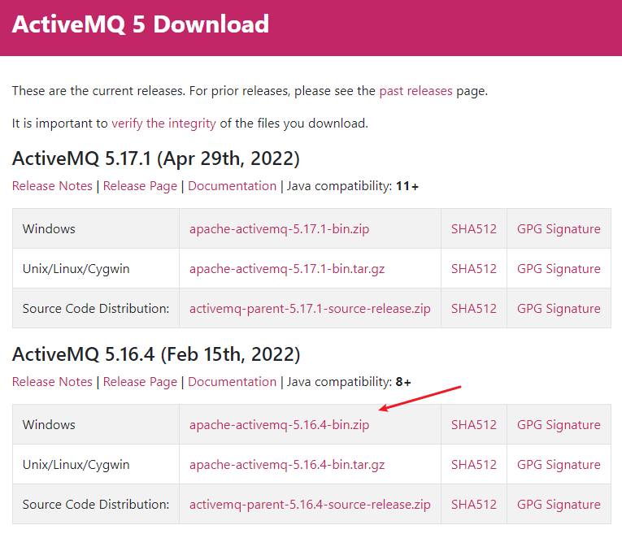
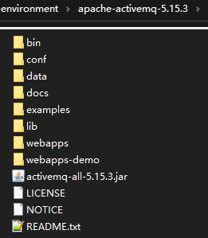
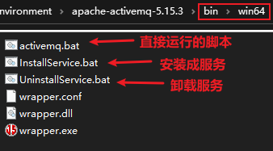
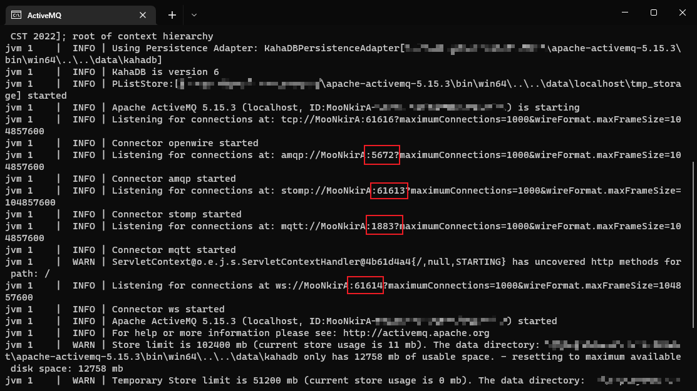

# ActiveMQ

官网：https://activemq.apache.org/

## 1. ActiveMQ 简介

ActiveMQ 是 Apache的开源消息总线，是一个完全支持 JMS1.1 和 j2EE14 规范的 JMS Provider 实现

ActiveMQ 特性如下：

1. 多种语言和协议编写客户端。语言: Java,C,C++,C#,Ruby,Perl,Python,PHP。应用协议： OpenWire,Stomp REST,WS Notification,XMPP,AMQP
2. 完全支持JMS1.1和J2EE 1.4规范 （持久化，XA消息，事务)
3. 对Spring的支持，ActiveMQ可以很容易内嵌到使用Spring的系统里面去，而且也支持Spring2.0的特性
4. 通过了常见J2EE服务器（如 Geronimo,JBoss 4,GlassFish,WebLogic)的测试，其中通过JCA 1.5 resource adaptors的配置，可以让ActiveMQ可以自动的部署到任何兼容J2EE 1.4 商业服务器上
5. 支持多种传送协议：in-VM,TCP,SSL,NIO,UDP,JGroups,JXTA
6. 支持通过JDBC和journal提供高速的消息持久化
7. 从设计上保证了高性能的集群，客户端-服务器，点对点
8. 支持Ajax
9. 支持与Axis的整合
10. 可以很容易的调用内嵌 JMS provider，进行测试

## 2. ActiveMQ 环境搭建

### 2.1. 下载与安装

ActiveMQ 安装包下载地址：https://activemq.apache.org/components/classic/download/

本笔记的示例是使用 windows 版本。下载的安装包是 zip 压缩文件，解压缩到目录（*无中文与空格*）完毕后即可使用，目录结构如下：

### 2.2. 启动服务器

进入 ActiveMQ 的安装目录中，运行 bin/win32 或 bin/win64 目录（根据自己的操作系统选择）中的 `activemq.bat` 命令脚本即可启动服务，默认对外服务端口 61616

也可以运行 InstallService.bat 安装成系统服务，运行 UninstallService.bat 卸载 ActiveMQ 服务

#### 2.2.1. 启动失败问题解决

在 ActiveMQ 启动时要占用多个端口，以下为正常启动信息：

其中占用的端口有：61616、5672、61613、1883、61614，如果启动失败，请先管理对应端口即可。如有某个端口占用，查看报错信息，可以从抛出异常的位置看出，启动 5672 端口时端口被占用，显示java.net.BindException: Address already in use: JVM_Bind。Windows 系统中终止端口运行的操作自行查询资料

### 2.3. ActiveMQ 后台管理服务

ActiveMQ 启动后会有一个 Web 控制台服务，可以通过该服务管理 ActiveMQ。后台管理服务访问地址是：http://127.0.0.1:8161/

访问需要输入用户名和密码，初始化用户名和密码均为：admin，成功登录后进入管理后台界面，如下：

常用的 Queues | Topics 此两个页面，其中页面中表单项解释如下：

- Number Of Pending Messages：等待消费的消息。这个是当前未出队列的数量。可以理解为总接收数-总出队列数
- Number Of Consumers：消费者人数
- Messages Enqueued：进入队列的消息。进入队列的总数量,包括出队列的。这个数量只增不减
- Messages Dequeued：出了队列的消息。可以理解为是消费这消费掉的数量

