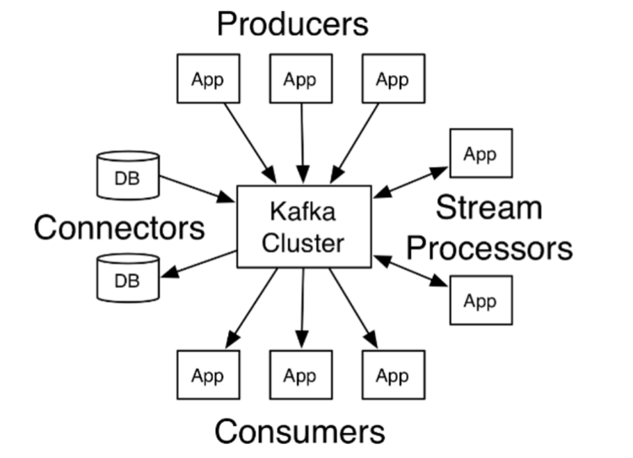
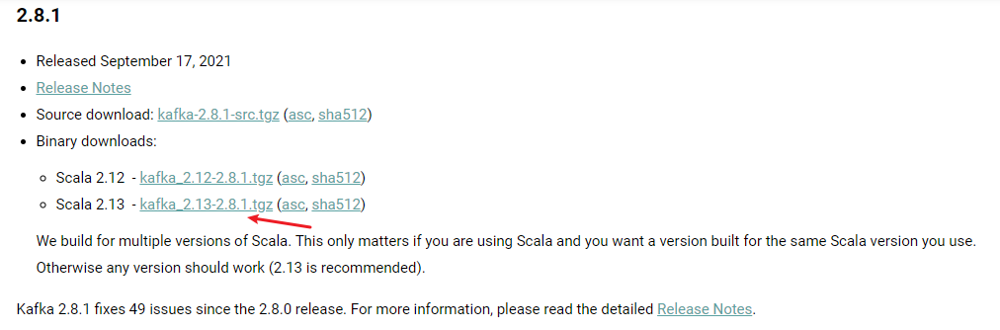
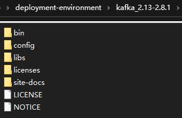

# Kafka

> Kafka 官网：https://kafka.apache.org/

## 1. 初识 Kafka

### 1.1. 概述

Kafka 最初是由 LinkedIn 公司采用 Scala 语言开发的一个多分区、多副本并且基于 ZooKeeper 协调的分布式消息系统，现在已经捐献给了 Apache 基金会。目前 Kafka 已经定位为一个分布式流式处理平台，它以高吞吐、可持久化、可水平扩展、支持流处理等多种特性而被广泛应用。

Apache Kafka 是一个分布式的发布-订阅消息系统，能够支撑海量数据的数据传递。在离线和实时的消息处理业务系统中，Kafka 都有广泛的应用。Kafka 将消息持久化到磁盘中，并对消息创建了备份保证了数据的安全。Kafka 在保证了较高的处理速度的同时，又能保证数据处理的低延迟和数据的零丢失。



### 1.2. 特性

1. 高吞吐量、低延迟：kafka 每秒可以处理几十万条消息，它的延迟最低只有几毫秒，每个主题可以分多个分区，消费组对分区进行消费操作
2. 可扩展性：kafka 集群支持热扩展
3. 持久性、可靠性：消息被持久化到本地磁盘，并且支持数据备份防止数据丢失
4. 容错性：允许集群中节点失败（若副本数量为 n，则允许 n-1 个节点失败）
5. 高并发：支持数千个客户端同时读写

### 1.3. 应用场景

1. 日志收集：一个公司可以用 Kafka 可以收集各种服务的 log，通过 kafka 以统一接口服务的方式开放给各种 consumer，例如 Hadoop、Hbase、Solr 等
2. 消息系统：解耦和生产者和消费者、缓存消息等
3. 用户活动跟踪：Kafka 经常被用来记录 web 用户或者 app 用户的各种活动，如浏览网页、搜索、点击等活动，这些活动信息被各个服务器发布到 kafka 的 topic 中，然后订阅者通过订阅这些 topic来做实时的监控分析，或者装载到 Hadoop、数据仓库中做离线分析和挖掘
4. 运营指标：Kafka 也经常用来记录运营监控数据。包括收集各种分布式应用的数据，生产各种操作的集中反馈，比如报警和报告
5. 流式处理：比如 spark streaming 和 storm

### 1.4. 技术优势

- **可伸缩性**：Kafka 主要表示在以下两个重要特性
    - Kafka 集群在运行期间可以轻松地扩展或收缩（可以添加或删除代理），而不会宕机
    - 可以扩展一个 Kafka 主题来包含更多的分区。由于一个分区无法扩展到多个代理，所以它的容量受到代理磁盘空间的限制。能够增加分区和代理的数量意味着单个主题可以存储的数据量是没有限制的
- **容错性和可靠性**：Kafka 的设计方式使某个代理的故障能够被集群中的其他代理检测到。由于每个主题都可以在多个代理上复制，所以集群可以在不中断服务的情况下从此类故障中恢复并继续运行。
- **吞吐量**：代理能够以超快的速度有效地存储和检索数据。

## 2. 核心概念详解（待整理）


## 3. 安装与配置

> 安装包下载地址：https://kafka.apache.org/downloads



### 3.1. windows 版本

> 注：windows 系统下的 3.x 版本目前可能会存在 bug，建议使用 2.x 版本。（目前本人使用的是 2.8.1 版本）

#### 3.1.1. 安装

下载完成后，安装包是 `.tgz` 压缩文件，使用解压缩软件解压缩到无中文与空格的目录即可使用，解压后得到如下文件



#### 3.1.2. 启动服务器

kafka 服务器的功能相当于 RocketMQ 中的 broker，kafka 运行还需要一个类似于命名服务器的服务。在 kafka 安装目录中自带一个类似于命名服务器的工具，叫做 zookeeper，它的作用是注册中心

##### 3.1.2.1. zookeeper 配置与启动

- 进入 kafka 的安装目录下的 config 目录，修改 zookeeper.properties 配置文件，文件内容如下：

```properties  
# zk服务器的心跳时间
tickTime=2000
# 投票选举新Leader的初始化时间
initLimit=10
syncLimit=5

# the directory where the snapshot is stored.
# 数据目录
dataDir=../temp/zookeeper
# 日志目录
dataLogDir=../temp/zookeeper/log
# the port at which the clients will connect
# Zookeeper对外服务端口，保持默认
clientPort=2181
# disable the per-ip limit on the number of connections since this is a non-production config
maxClientCnxns=0
# Disable the adminserver by default to avoid port conflicts.
# Set the port to something non-conflicting if choosing to enable this
admin.enableServer=false
# admin.serverPort=8080
```

- 运行 `\bin\windows` 目录下的 `zookeeper-server-start.bat` 命令脚本即可启动注册中心，默认对外服务端口 2181

```shell
# 启动zookeeper
zookeeper-server-start.bat ..\..\config\zookeeper.properties
```

##### 3.1.2.2. kafka 服务配置与启动

- 进入 kafka 的安装目录下的 config 目录，修改 server.properties 的配置文件，配置中需要关注以下几个参数：

```properties
# broker 的编号，如果集群中有多个 broker，则每个 broker 的纺吅需要设置为唯一
broker.id=0
# broker 对外提供的服务入口地址，注：原配置文件中是注释的
listeners=PLAINTEXT://:9092
# 设置存放消息日志文件的地址
log.dirs=../temp/kafka-logs
# kafka 所需 zookeeper 集群地址
zookeeper.connect=localhost:2181
```

- 运行 `\bin\windows` 目录下的 `kafka-server-start.bat` 命令脚本即可启动 kafka 服务器，默认对外服务端口 9092

```shell
# 启动kafka
kafka-server-start.bat ..\..\config\server.properties
```

#### 3.1.3. Kafka 测试消息生产与消费 

##### 3.1.3.1. 创建主题

和之前操作其他 MQ 产品相似，kakfa 也是基于主题操作，操作之前需要先初始化 topic。

```shell
# 创建topic
kafka-topics.bat --create --zookeeper localhost:2181 --replication-factor 1 --partitions 1 --topic moon
# 查询topic
kafka-topics.bat --zookeeper 127.0.0.1:2181 --list					
# 删除topic
kafka-topics.bat --delete --zookeeper localhost:2181 --topic moon
```

##### 3.1.3.2. 测试服务器启动状态

Kafka 提供有一套测试服务器功能的测试程序，运行 `bin\windows` 目录下的命令即可使用

```shell
kafka-console-producer.bat --broker-list localhost:9092 --topic moon						# 测试生产消息
kafka-console-consumer.bat --bootstrap-server localhost:9092 --topic moon --from-beginning	# 测试消息消费
```

### 3.2. linux 版本


