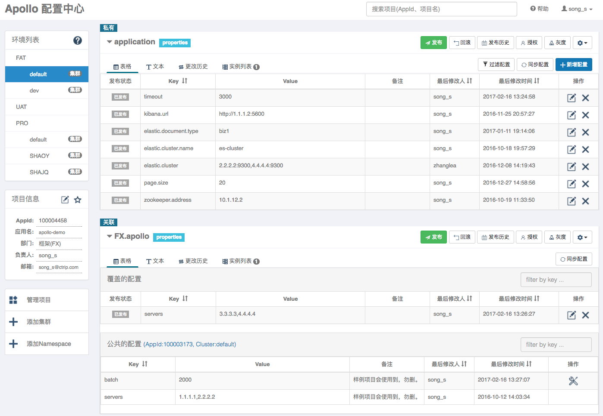
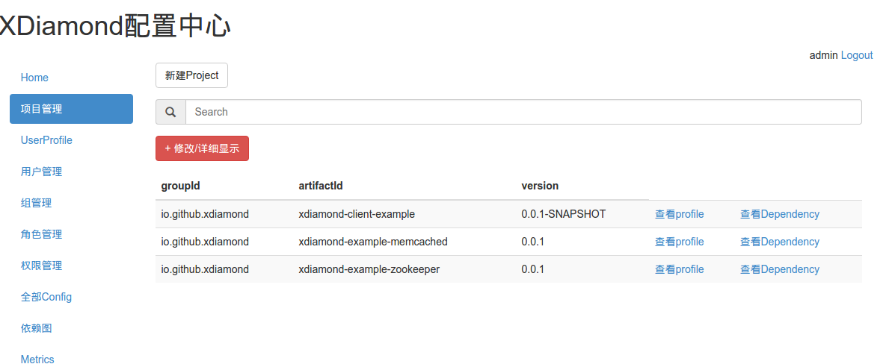
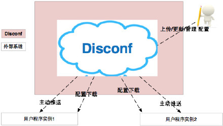
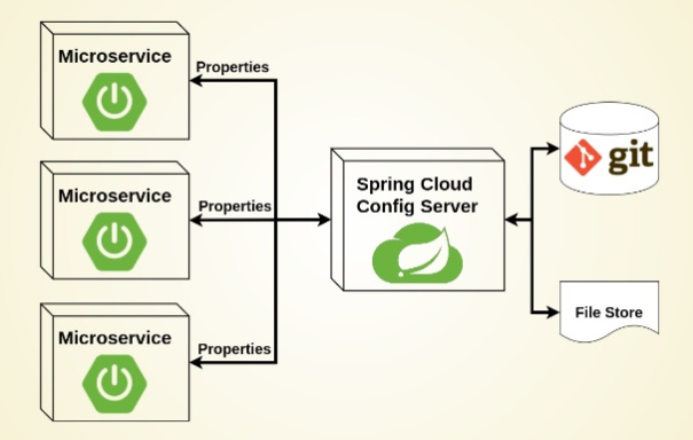
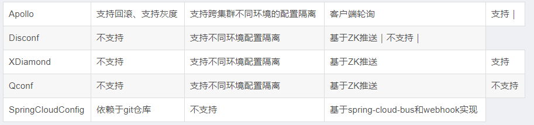

# Distributed Configuration Center Overview（分布式配置中心综述）

分布式配置中心，网上的一些开源的解决方案

## 1. 配置中心开源方案

### 1.1. Apollo

Apollo（阿波罗）是携程框架部门研发的分布式配置中心，能够集中化管理应用不同环境、不同集群的配置，配置修改后能够实时推送到应用端，并且具备规范的权限、流程治理等特性，适用于微服务配置管理场景。

> 项目地址：https://github.com/ctripcorp/apollo

### 1.2. XDiamond

全局配置中心，存储应用的配置项，解决配置混乱分散的问题。名字来源于淘宝的开源项目Diamond，前面加上一个字母X以示区别。

> 项目地址：https://github.com/hengyunabc/xdiamond

### 1.3. Qconf

QConf 是一个分布式配置管理工具。 用来替代传统的配置文件，使得配置信息和程序代码分离，同时配置变化能够实时同步到客户端，而且保证用户高效读取配置，这使的工程师从琐碎的配置修改、代码提交、配置上线流程中解放出来，极大地简化了配置管理工作。

> 项目地址：https://github.com/Qihoo360/QConf

### 1.4. Disconf

专注于各种「分布式系统配置管理」的「通用组件」和「通用平台」, 提供统一的「配置管理服务」包括 百度、滴滴出行、银联、网易、拉勾网、苏宁易购、顺丰科技 等知名互联网公司正在使用!「disconf」在「2015 年度新增开源软件排名 TOP 100(OSC开源中国提供)」中排名第16强。Disconf的功能特点描述图：

> 项目地址：https://github.com/knightliao/disconf

### 1.5. Spring Cloud Config

Spring Cloud Config 为分布式系统中的外部配置提供服务器和客户端支持。

> 项目地址：https://github.com/spring-cloud/spring-cloud-config

### 1.6. 各个方案的区别

