# Apollo 分布式配置中心(服务中间件)

- Apollo 官方仓库：https://github.com/ctripcorp/apollo
- Apollo 官方文档：https://www.apolloconfig.com/#/
- 官方参考文档：https://github.com/ctripcorp/apollo/wiki

## 1. 概念简介

### 1.1. 什么是配置

应用程序在启动和运行的时候往往需要读取一些配置信息，配置基本上伴随着应用程序的整个生命周期，比如：数据库连接参数、启动参数等。配置主要有以下几个特点：

- **配置是独立于程序的只读变量**
    - 首先，配置是独立于程序的，同一份程序在不同的配置下会有不同的行为
    - 其次，配置对于程序是只读的，程序通过读取配置来改变自己的行为，但是程序不应该去改变配置
- **配置伴随应用的整个生命周期**
    - 配置贯穿于应用的整个生命周期，应用在启动时通过读取配置来初始化，在运行时根据配置调整行为。比如：启动时需要读取服务的端口号、系统在运行过程中需要读取定时策略执行定时任务等。
- **配置可以有多种加载方式**
    - 常见的有程序内部硬编码，配置文件，环境变量，启动参数，基于数据库等
- **配置需要治理**
    - 权限控制：由于配置能改变程序的行为，不正确的配置甚至能引起灾难，所以对配置的修改必须有比较完善的权限控制
    - 不同环境、集群配置管理：同一份程序在不同的环境（开发，测试，生产）、不同的集群（如不同的数据中心）经常需要有不同的配置，所以需要有完善的环境、集群配置管理

### 1.2. 什么是配置中心

#### 1.2.1. 传统配置形式存在的问题

传统单体应用存在一些潜在缺陷，如随着规模的扩大，部署效率降低，团队协作效率差，系统可靠性变差，维护困难，新功能上线周期长等，所以迫切需要一种新的架构去解决这些问题，而微服务（ microservices ）架构正是当下一种流行的解法。

不过，解决一个问题的同时，往往会诞生出很多新的问题，所以微服务化的过程中伴随着很多的挑战，其中一个挑战就是有关服务（应用）配置的。传统配置存在的问题如下：

1. 缺少权限控制：由于配置能改变程序的行为，不正确的配置甚至能引起灾难，所以对配置的修改必须有比较完善的权限控制
2. 缺少版本控制：在整个开发过程中，配置会经常发生修改，版本控制非常必要
3. 缺少实时控制：配置发生变化后，需要重启才能生效，费时费力，迫切需要实时生效(热发布)


当系统从一个单体应用，被拆分成分布式系统上一个个服务节点后，配置文件也必须跟着迁移（分割），这样配置就变得分散了，造成使用和管理难度变大。不仅如此，各个节点服务的配置中难免会包含很多冗余代码。

同一个应用程序在不同的环境（开发，测试，生产）和不同的集群经常需要有不同的配置，需要能方便得进行动态切换。

#### 1.2.2. 配置中心的作用

配置中心将配置从应用中剥离出来，对所有的配置进行单独的统一管理，优雅的解决了配置的动态变更、持久化、运维成本等问题。应用自身既不需要去添加管理配置接口，也不需要自己去实现配置的持久化，更不需要引入“定时任务”以便降低运维成本。总得来说，<font color=red>**配置中心就是一种统一管理各种应用配置的基础服务组件**</font>。

在系统架构中，配置中心是整个微服务基础架构体系中的一个组件，它的功能就是**配置的管理和存取**，但它也是整个微服务架构中不可或缺的一环。如下图，

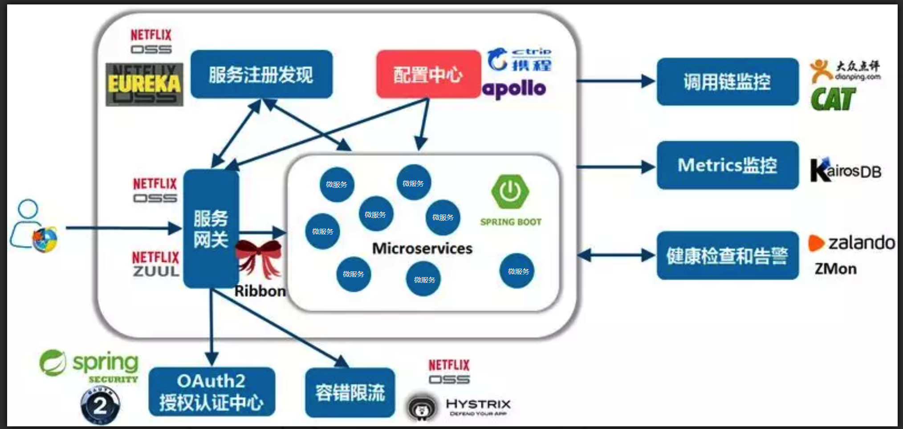

集中管理配置，那么就要将应用的配置作为一个单独的服务抽离出来了，所以也需要解决一些新的问题，比如：版本管理（为了支持回滚），权限管理等。

#### 1.2.3. 小结

在传统巨型单体应用纷纷转向细粒度微服务架构的历史进程中，配置中心是微服务化不可缺少的一个系统组件，在这种背景下中心化的配置服务即配置中心应运而生，一个合格的配置中心需要具备以下几点：

- 配置项容易读取和修改
- 添加新配置简单直接
- 支持对配置的修改的检视以把控风险
- 可以查看配置修改的历史记录
- 不同部署环境支持隔离

## 2. Apollo 简介

### 2.1. Apollo 介绍

Apollo - A reliable configuration management system。Apollo（阿波罗）是携程框架部门研发的分布式配置中心，能够集中化管理应用的不同环境、不同集群的配置，配置修改后能够实时推送到应用端，并且具备规范的权限、流程治理等特性，适用于微服务配置管理场景。

Apollo包括服务端和客户端两部分：

- 服务端基于Spring Boot和Spring Cloud开发，打包后可以直接运行，不需要额外安装Tomcat等应用容器。
- 客户端（Java）不依赖任何框架，能够运行于所有Java运行时环境，同时对Spring/Spring Boot环境也有较好的支持。

### 2.2. Apollo 特性

基于配置的特殊性，所以Apollo设计成为一个有治理能力的配置发布平台，目前提供了以下的特性：

- **统一管理不同环境、不同集群的配置**
    - Apollo提供了一个统一界面集中式管理不同环境（environment）、不同集群（cluster）、不同命名空间（namespace）的配置。
    - 同一份代码部署在不同的集群，可以有不同的配置，比如zookeeper的地址等
    - 通过命名空间（namespace）可以很方便地支持多个不同应用共享同一份配置，同时还允许应用对共享的配置进行覆盖
- **配置修改实时生效（热发布）**
    - 用户在Apollo修改完配置并发布后，客户端能实时（1秒）接收到最新的配置，并通知到应用程序
- **版本发布管理**
    - 所有的配置发布都有版本概念，从而可以方便地支持配置的回滚
- **灰度发布**
    - 支持配置的灰度发布，比如点了发布后，只对部分应用实例生效，等观察一段时间没问题后再推给所有应用实例
- **权限管理、发布审核、操作审计**
    - 应用和配置的管理都有完善的权限管理机制，对配置的管理还分为了编辑和发布两个环节，从而减少人为的错误。
    - 所有的操作都有审计日志，可以方便地追踪问题
- **客户端配置信息监控**
    - 可以在界面上方便地看到配置在被哪些实例使用
- **提供Java和.Net原生客户端**
    - 提供了Java和.Net的原生客户端，方便应用集成
    - 支持Spring Placeholder, Annotation和Spring Boot的ConfigurationProperties，方便应用使用（需要Spring 3.1.1+）
    - 同时提供了Http接口，非Java和.Net应用也可以方便地使用
- **提供开放平台API**
    - Apollo自身提供了比较完善的统一配置管理界面，支持多环境、多数据中心配置管理、权限、流程治理等特性。不过Apollo出于通用性考虑，不会对配置的修改做过多限制，只要符合基本的格式就能保存，不会针对不同的配置值进行针对性的校验，如数据库用户名、密码，Redis服务地址等
    - 对于这类应用配置，Apollo支持应用方通过开放平台API在Apollo进行配置的修改和发布，并且具备完善的授权和权限控制
- **部署简单**
    - 配置中心作为基础服务，可用性要求非常高，这就要求Apollo对外部依赖尽可能地少
    - 目前唯一的外部依赖是MySQL，所以部署非常简单，只要安装好Java和MySQL就可以运行Apollo应用
    - Apollo还提供了打包脚本，一键就可以生成所有需要的安装包，并且支持自定义运行时参数

### 2.3. 几款主流配置中心方案对比总结

由于Disconf不再维护，下面主要对比一下Spring Cloud Config、Apollo和Nacos。

|    功能点    |  Spring Cloud Config   |         Apollo          |          Nacos          |
| ----------- | ---------------------- | ----------------------- | ----------------------- |
| 配置实时推送  | 支持(Spring Cloud Bus) | 支持(HTTP长轮询1s内)     | 支持(HTTP长轮询1s内)     |
| 版本管理     | 支持(Git)              | 支持                    | 支持                    |
| 配置回滚     | 支持(Git)              | 支持                    | 支持                    |
| 灰度发布     | 支持                   | 支持                    | 不支持                  |
| 权限管理     | 支持(依赖Git)          | 支持                    | 不支持                  |
| 多集群       | 支持                   | 支持                    | 支持                    |
| 多环境       | 支持                   | 支持                    | 支持                    |
| 监听查询     | 支持                   | 支持                    | 支持                    |
| 多语言       | 只支持Java              | 主流语言，提供了Open API | 主流语言，提供了Open API |
| 配置格式校验  | 不支持                 | 支持                    | 支持                    |
| 单机读(QPS)  | 7(限流所致)             | 9000                    | 15000                   |
| 单机读(QPS)  | 5(限流所致)             | 1100                    | 1800                    |
| 3节点读(QPS) | 21(限流所致)            | 27000                   | 45000                   |
| 3节点写(QPS) | 5(限流所致)             | 3300                    | 5600                    |

总的来看，Apollo 和 Nacos 相对于 Spring Cloud Config 的生态支持更广，在配置管理流程上做的更好。Apollo 相对于 Nacos 在配置管理做的更加全面，Nacos 则使用起来相对比较简洁，在对性能要求比较高的大规模场景更适合。但对于一个开源项目的选型，项目上的人力投入（迭代进度、文档的完整性）、社区的活跃度（issue的数量和解决速度、Contributor 数量、社群的交流频次等），这些因素也比较关键，考虑到 Nacos 开源时间不长和社区活跃度，所以从目前来看 Apollo 应该是最合适的配置中心选型。

## 3. Apollo 快速入门

此快速入门示例的版本是 v1.6.1

> 快速入门官方文档：https://www.apolloconfig.com/#/zh/deployment/quick-start

### 3.1. Apollo 执行流程

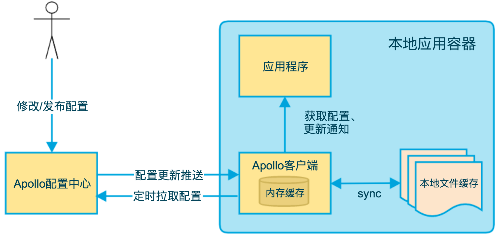

Apollo客户端的实现原理如下：

1. 用户通过Apollo管理平台，对Apollo配置中心修改配置
2. 应用程序通过Apollo客户端从配置中心拉取配置信息。客户端和服务端保持了一个长连接，从而能第一时间获得配置更新的推送。
3. 客户端还会定时从Apollo配置中心服务端拉取应用的最新配置
    - 这是一个fallback机制，为了防止推送机制失效导致配置不更新
    - 客户端定时拉取会上报本地版本，所以一般情况下，对于定时拉取的操作，服务端都会返回`304 - Not Modified`
    - 定时频率默认为每5分钟拉取一次，客户端也可以通过在运行时指定`System Property:apollo.refreshInterval`来覆盖，单位为分钟。
4. 客户端从Apollo配置中心服务端获取到应用的最新配置后，会保存在内存中
5. 客户端会把从服务端获取到的配置在本地文件系统缓存一份
    - 在遇到服务不可用，或网络不通的时候，依然能从本地恢复配置
6. 应用程序从Apollo客户端获取最新的配置、订阅配置更新通知

用户通过Apollo配置中心修改或发布配置后，会有两种机制来保证应用程序来获取最新配置：

- 一种是Apollo配置中心会向客户端推送最新的配置；
- 另外一种是Apollo客户端会定时从Apollo配置中心拉取最新的配置，通过以上两种机制共同来保证应用程序能及时获取到配置。

### 3.2. Apollo 安装（v1.6.1）

> 官方参考文档：https://github.com/ctripcorp/apollo/wiki/Quick-Start

#### 3.2.1. 运行时环境

- Apollo服务端：Java 1.8+
- Apollo客户端：Java 1.7+

> 由于需要同时运行服务端和客户端，所以建议安装Java 1.8+，<font color=red>**需要配置 `JAVA_HOME` 环境变量**</font>。

- MySQL版本要求：5.6.5+

> Apollo 配置中心需要依赖数据库实现，而 Apollo 的表结构对 timestamp 使用了多个default声明，所以需要5.6.5以上版本。

#### 3.2.2. 下载安装包

1. 访问Apollo的官方主页获取安装包（本次使用v1.6.1 Release版本）：

下载地址：https://github.com/ctripcorp/apollo/releases

2. 打开相应的版本发布链接，下载必须的安装包：

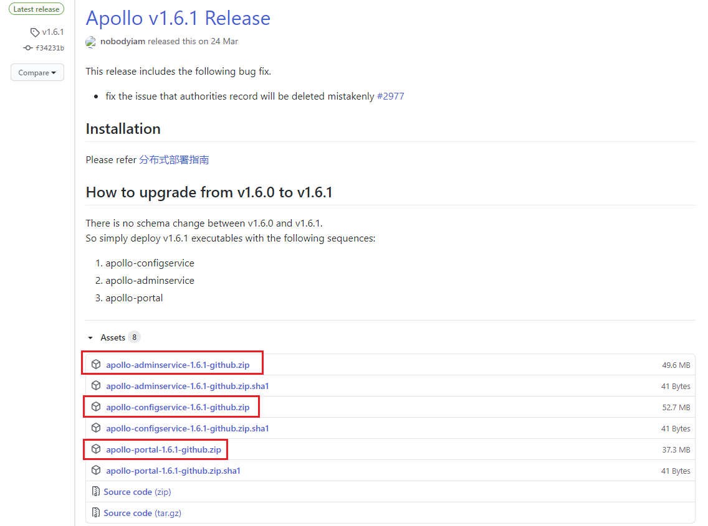

3. 解压安装包后将 apollo-configservice-1.x.x.jar, apollo-adminservice-1.x.x.jar, apollo-portal-1.x.x.jar 放置于自定的 apollo 部署目录下

#### 3.2.3. 创建 apollo 涉及的数据库

Apollo服务端共需要两个数据库：`ApolloPortalDB` 和 `ApolloConfigDB`

<font color=red>**`ApolloPortalDB`只需要在生产环境部署一个即可，而`ApolloConfigDB`需要在每个环境部署一套。**</font>

> 本地脚本备份位置：`E:\07-编程工具资料\14-配置中心\apollo\sql scripts\`

##### 3.2.3.1. ApolloPortalDB

1. 创建ApolloPortalDB

通过各种 MySQL 客户端导入 apolloportaldb.sql 即可。sql 脚本下载地址：https://github.com/ctripcorp/apollo/blob/v1.6.1/scripts/sql/apolloportaldb.sql

以MySQL原生客户端为例：

```bash
source /your_local_path/scripts/sql/apolloportaldb.sql
```

2. 验证ApolloPortalDB

导入成功后，可以通过执行以下sql语句来验证：

```sql
select `Id`, `Key`, `Value`, `Comment` from `ApolloPortalDB`.`ServerConfig` limit 1;
```

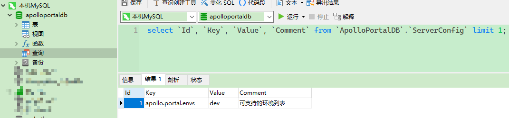

> 注：ApolloPortalDB只需要在生产环境部署一个即可

##### 3.2.3.2. ApolloConfigDB

1. 创建ApolloConfigDB

通过各种MySQL客户端导入apolloconfigdb.sql即可。sql脚本下载地址：https://github.com/ctripcorp/apollo/blob/v1.6.1/scripts/sql/apolloconfigdb.sql

以MySQL原生客户端为例：

```bash
source /your_local_path/scripts/sql/apolloconfigdb.sql
```

2. 验证ApolloConfigDB

导入成功后，可以通过执行以下sql语句来验证：

```sql
select `Id`, `Key`, `Value`, `Comment` from `ApolloConfigDB`.`ServerConfig` limit 1;
```

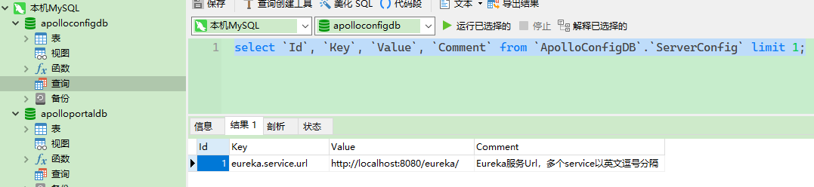

> 相关sql脚本汇总位置：https://github.com/MooNkirA/java-technology-stack/tree/master/java-stack-apollo/scripts/sql

##### 3.2.3.3. 如何获取相应版本的 sql 脚本

根据下载的 apollo 版本，切换到相应版本的分支，在 `apollo/scripts/sql/` 目录下可以找到相应的脚本

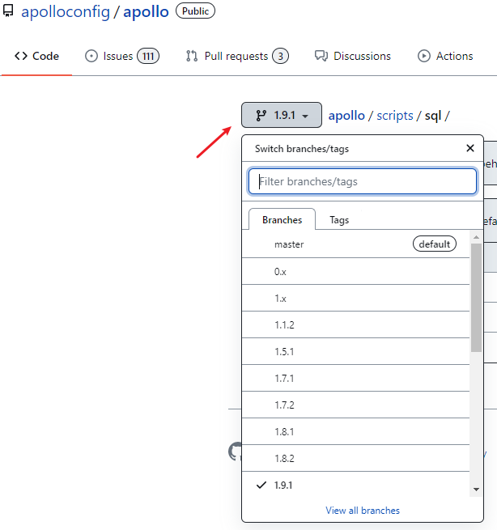

如 v1.9.1 版本，相应的数据库表 sql 脚本地址是：https://github.com/apolloconfig/apollo/tree/1.9.1/scripts/sql

### 3.3. Apollo 启动

1. Apollo默认会启动3个服务，分别使用8070（`apollo-portal`）, 8080（`apollo-configservice`）, 8090（`apollo-adminservice`）端口，确保这3个端口当前未被占用
2. 启动apollo-configservice，在apollo目录下执行如下命令(根据实际情况修改)。可通过`-Dserver.port=xxxx`修改默认端口

```bash
java ‐Xms256m ‐Xmx256m ‐Dspring.datasource.url=jdbc:mysql://localhost:3306/ApolloConfigDB?characterEncoding=utf8 ‐Dspring.datasource.username=root ‐Dspring.datasource.password=123456 ‐jar apollo-configservice-1.6.1.jar
```

3. 启动apollo-adminservice

```bash
java ‐Xms256m ‐Xmx256m ‐Dspring.datasource.url=jdbc:mysql://localhost:3306/ApolloConfigDB?characterEncoding=utf8 ‐Dspring.datasource.username=root ‐Dspring.datasource.password=123456 ‐jar apollo-adminservice-1.6.1.jar
```

4. 启动apollo-portal

```bash
java ‐Xms256m ‐Xmx256m ‐Ddev_meta=http://localhost:8080/ ‐Dserver.port=8070 ‐Dspring.datasource.url=jdbc:mysql://localhost:3306/ApolloPortalDB?characterEncoding=utf8 ‐Dspring.datasource.username=root ‐Dspring.datasource.password=123456 ‐jar apollo-portal-1.6.1.jar
```

也可运行`runApollo.bat`快速启动三个服务（按需修改数据库连接地址，数据库以及密码，日志保存位置等）

- windows脚本

```bash
echo

set url="localhost:3306"
set username="root"
set password="123456"

start "configService" java -Xms256m -Xmx256m -Dapollo_profile=github -Dspring.datasource.url=jdbc:mysql://%url%/ApolloConfigDB?characterEncoding=utf8 -Dspring.datasource.username=%username% -Dspring.datasource.password=%password% -Dlogging.file=.\logs\apollo-configservice.log -jar .\apollo-configservice-1.6.1.jar
start "adminService" java -Xms256m -Xmx256m -Dapollo_profile=github -Dspring.datasource.url=jdbc:mysql://%url%/ApolloConfigDB?characterEncoding=utf8 -Dspring.datasource.username=%username% -Dspring.datasource.password=%password% -Dlogging.file=.\logs\apollo-adminservice.log -jar .\apollo-adminservice-1.6.1.jar
start "ApolloPortal" java -Xms256m -Xmx256m -Dapollo_profile=github,auth -Ddev_meta=http://localhost:8080/ -Dserver.port=8070 -Dspring.datasource.url=jdbc:mysql://%url%/ApolloPortalDB?characterEncoding=utf8 -Dspring.datasource.username=%username% -Dspring.datasource.password=%password% -Dlogging.file=.\logs\apollo-portal.log -jar .\apollo-portal-1.6.1.jar
```

- linux脚本

```bash
#!/bin/sh

url="localhost:3306"
username="root"
password="123456"

java -Xms256m -Xmx256m -Dapollo_profile=github -Dspring.datasource.url=jdbc:mysql://${url}/ApolloConfigDB?characterEncoding=utf8 -Dspring.datasource.username=${username} -Dspring.datasource.password=${password} -Dlogging.file=./logs/apollo-configservice.log -Dserver.port=8080 -jar apollo-configservice-1.6.1.jar &
java -Xms256m -Xmx256m -Dapollo_profile=github -Dspring.datasource.url=jdbc:mysql://${url}/ApolloConfigDB?characterEncoding=utf8 -Dspring.datasource.username=${username} -Dspring.datasource.password=${password} -Dlogging.file=./logs/apollo-adminservice.log -Dserver.port=8090 -jar apollo-adminservice-1.6.1.jar & 
java -Xms256m -Xmx256m -Dapollo_profile=github,auth -Ddev_meta=http://localhost:8080/ -Dserver.port=8070 -Dspring.datasource.url=jdbc:mysql://%url%/ApolloPortalDB?characterEncoding=utf8 -Dspring.datasource.username=%username% -Dspring.datasource.password=%password% -jar apollo-portal-1.6.1.jar &
```

> 相关运行脚本汇总位置：https://github.com/MooNkirA/java-technology-stack/tree/master/java-stack-apollo/scripts/run

运行 runApollo.bat 即可启动 Apollo 相关服务

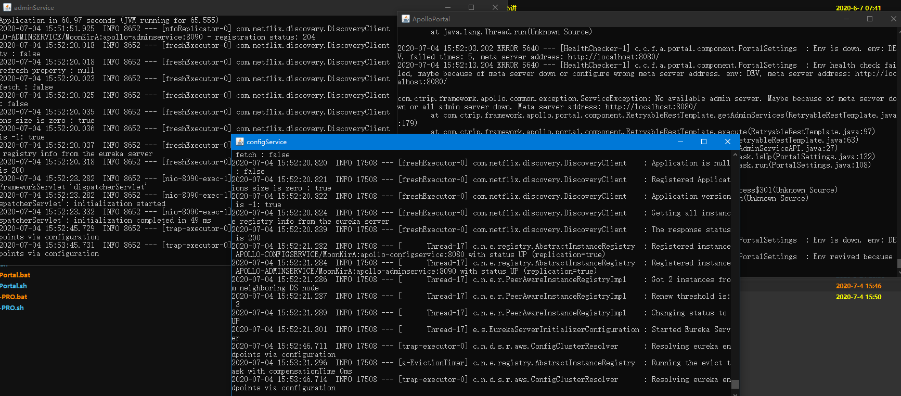

5. 待启动成功后，访问管理页面
    - 本地访问url：http://localhost:8070/
    - 账号/密码：apollo/admin

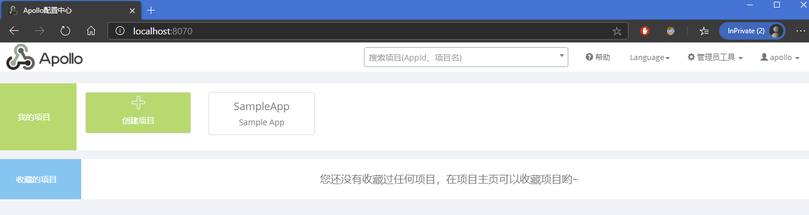

- 输入 `http://localhost:8080/` 可以访问 apollo 内部启动的 eureka 服务

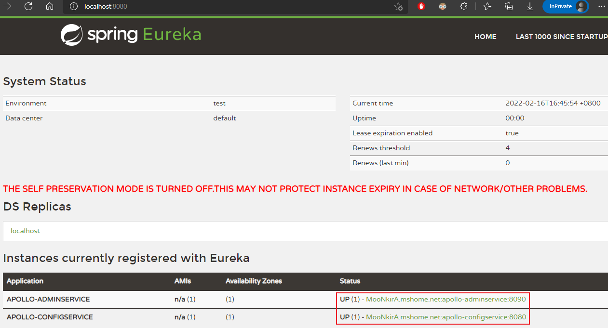

### 3.4. Apollo 基础使用项目示例

#### 3.4.1. 发布配置

1. 打开apollo服务，创建项目apollo-quickstart

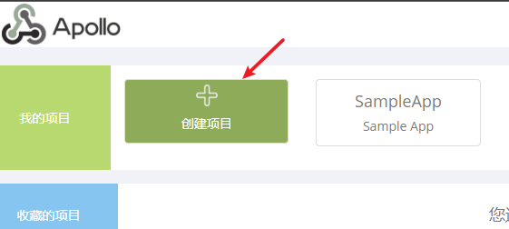

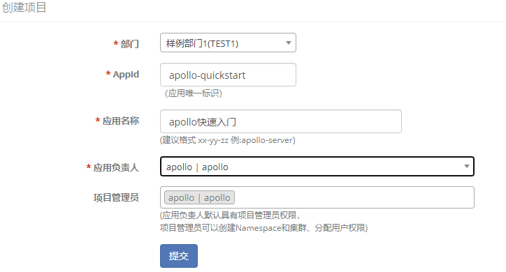

2. 新建配置项，例如：`sms.enable`。确认提交配置项

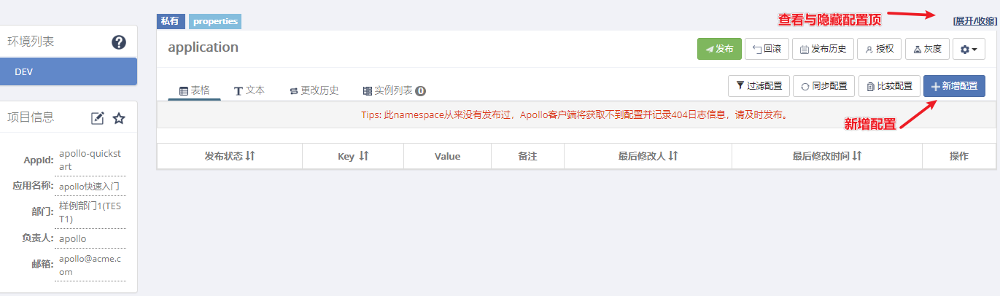


3. 发布配置项。**注意，创建或者修改后，需要点击发布后，配置才生效**


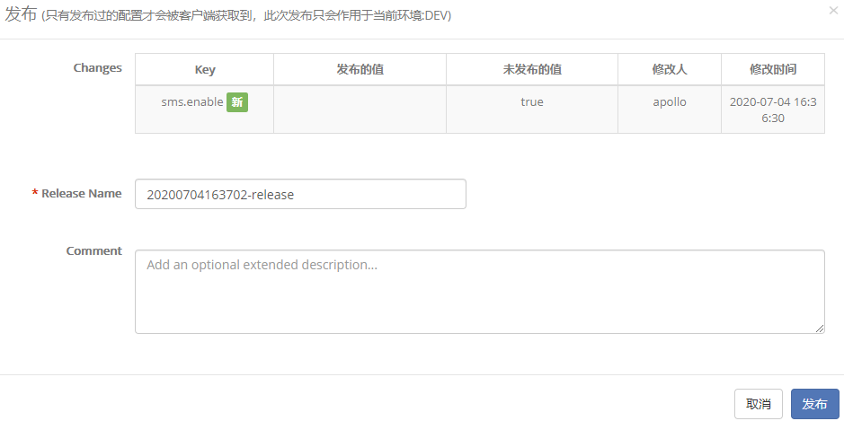

#### 3.4.2. 应用读取配置

1. 新建apollo-quickstart项目，配置pom.xml文件添加apollo依赖，配置JDK为1.8

```xml
<?xml version="1.0" encoding="UTF-8"?>

<project xmlns="http://maven.apache.org/POM/4.0.0" xmlns:xsi="http://www.w3.org/2001/XMLSchema-instance"
         xsi:schemaLocation="http://maven.apache.org/POM/4.0.0 http://maven.apache.org/xsd/maven-4.0.0.xsd">
    <parent>
        <artifactId>java-technology-stack</artifactId>
        <groupId>com.moon</groupId>
        <version>1.0-SNAPSHOT</version>
    </parent>

    <modelVersion>4.0.0</modelVersion>
    <artifactId>apollo-quickstart</artifactId>
    <name>${project.artifactId}</name>
    <packaging>jar</packaging>
    <description>apollo快速入门示例项目</description>

    <properties>
        <java.version>1.8</java.version>
        <apollo-client.version>1.1.0</apollo-client.version>
        <slf4j.version>1.7.28</slf4j.version>
    </properties>

    <dependencies>
        <dependency>
            <groupId>com.ctrip.framework.apollo</groupId>
            <artifactId>apollo-client</artifactId>
            <version>${apollo-client.version}</version>
        </dependency>
        <dependency>
            <groupId>org.slf4j</groupId>
            <artifactId>slf4j-simple</artifactId>
            <version>${slf4j.version}</version>
        </dependency>
        <dependency>
            <groupId>junit</groupId>
            <artifactId>junit</artifactId>
            <scope>test</scope>
        </dependency>
    </dependencies>

    <build>
        <plugins>
            <plugin>
                <groupId>org.apache.maven.plugins</groupId>
                <artifactId>maven-compiler-plugin</artifactId>
                <configuration>
                    <source>${java.version}</source>
                    <target>${java.version}</target>
                </configuration>
            </plugin>
        </plugins>
    </build>
</project>
```

2. 编写测试类GetConfigTest。编写代码读取`sms.enable`的值

```java
package com.moon.apollo.test.quickstart;

import com.ctrip.framework.apollo.Config;
import com.ctrip.framework.apollo.ConfigService;
import org.junit.Test;

/**
 * apollo 快速入门测试 - 读取发布的配置项
 */
public class GetConfigTest {
    /*
     * 启动时设置VM options:
     *  -Dapp.id=apollo-quickstart -Denv=DEV -Ddev_meta=http://localhost:8080
     *      app.id是对应apollo服务创建的项目AppId
     *      env是对应apollo服务的项目环境
     *      dev_meta是对应apollo-portal服务的url
     */
    @Test
    public void getAppConfigTest() {
        // 获取apollo配置对象，此方法是读取默认namespace: application下的配置信息
        Config config = ConfigService.getAppConfig();
        // 需要获取的配置对应的key
        String key = "sms.enable";
        /*
         * 通过apollo配置对象的getProperty(String key, String defaultValue)方法，获取key的值
         *  参数key：配置项的key
         *  参数defaultValue：配置项的默认值
         */
        String value = config.getProperty(key, null);
        System.out.println("sms.enable: " + value);
    }
}
```

3. 测试

配置VM options，设置系统属性：

```
-Dapp.id=apollo-quickstart -Denv=DEV -Ddev_meta=http://localhost:8080
```

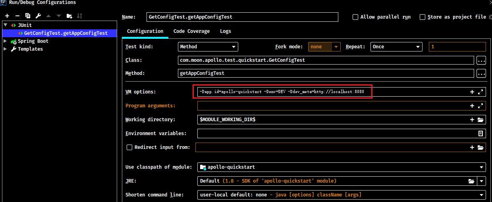

运行`getAppConfigTest()`，观察控制台输出结果

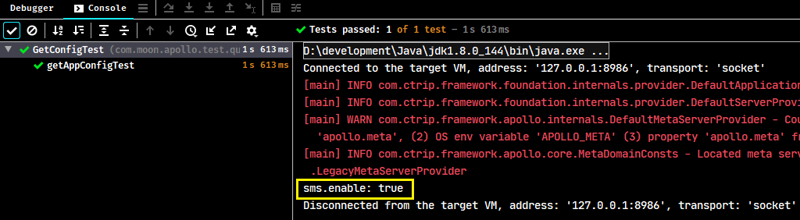

通过apollo管理界面修改配置值`sms.enable`的值为false，再运行查看输出结果已为false

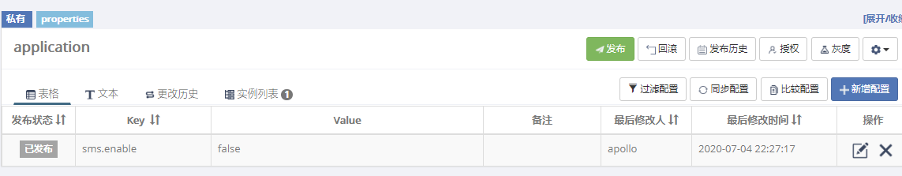

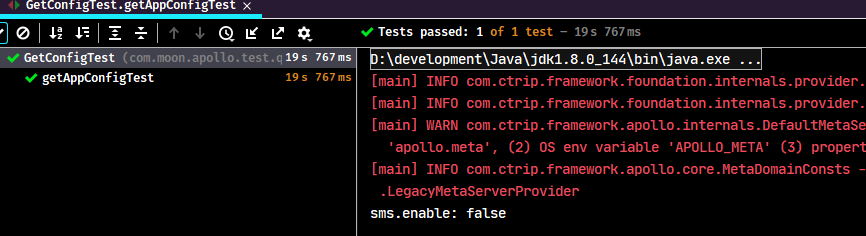

#### 3.4.3. 热发布

所谓的热发布即是在客户端一直运行的过程中，通过apollo管理界面修改配置，客户端可以获取配置的变化信息，配置修改实时生效

1. 修改代码为每3秒获取一次

```java
/* 配置实时更新测试 */
@Test
public void hotPublishTest() throws InterruptedException {
    // 获取apollo配置对象
    Config config = ConfigService.getAppConfig();
    // 需要获取的配置对应的key
    String key = "sms.enable";
    while (true) {
        // 获取key的值
        String value = config.getProperty(key, null);
        System.out.printf("now: %s, sms.enable: %s%n", LocalDateTime.now().toString(), value);
        Thread.sleep(3000L);
    }
}
```

2. 运行GetConfigTest观察输出结果

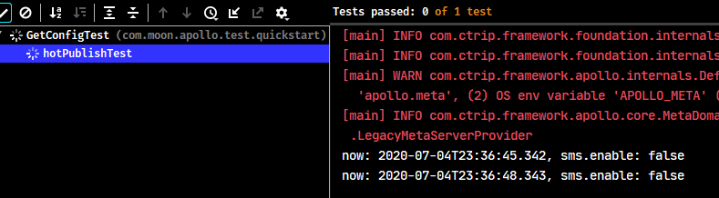

3. 在Apollo管理界面修改配置项


4. 发布配置

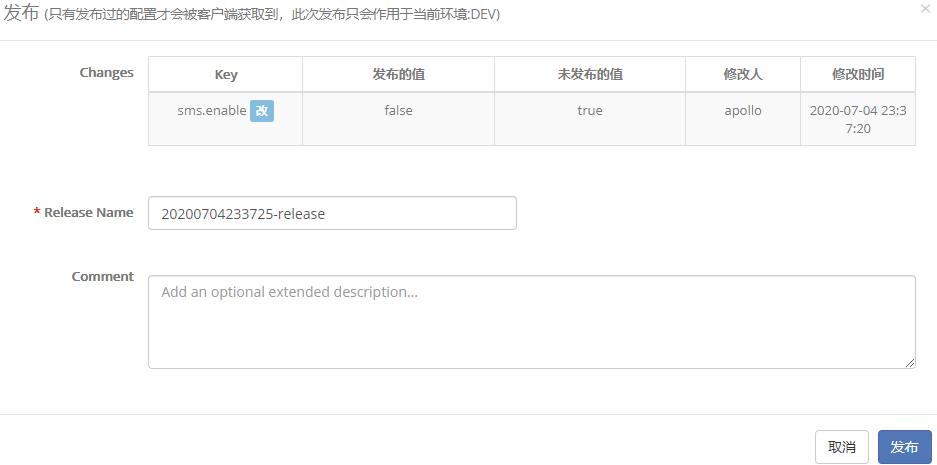

5. 在控制台查看详细情况：可以看到程序获取的`sms.enable`的值已由false变成了修改后的true

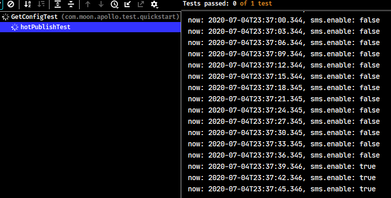

## 4. Apollo 应用

### 4.1. Apollo 工作原理

Apollo架构模块的概览图

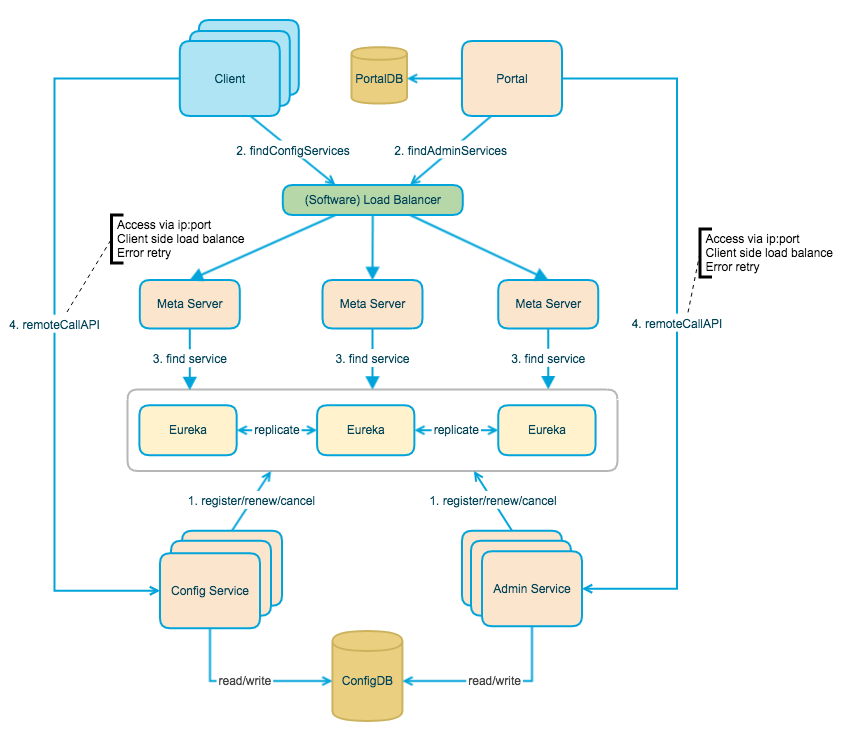

#### 4.1.1. 各模块职责

Apollo的总体设计各模块职责如下：

- Config Service提供配置的读取、推送等功能，服务对象是Apollo客户端
- Admin Service提供配置的修改、发布等功能，服务对象是Apollo Portal管理界面
- Eureka提供服务注册和发现，为了简单起见，目前Eureka在部署时和Config Service是在一个JVM进程中的
- Config Service和Admin Service都是多实例、无状态部署，所以需要将自己注册到Eureka中并保持心跳
- 在Eureka之上架了一层Meta Server用于封装Eureka的服务发现接口
- Client通过域名访问Meta Server获取Config Service服务列表（IP+Port），而后直接通过IP+Port访问服务，同时在Client侧会做load balance、错误重试
- Portal通过域名访问Meta Server获取Admin Service服务列表（IP+Port），而后直接通过IP+Port访问服务，同时在Portal侧会做load balance、错误重试
- 为了简化部署，实际上会把Config Service、Eureka和Meta Server三个逻辑角色部署在同一个JVM进程中

#### 4.1.2. 分步执行流程

1. Apollo启动后，Config/Admin Service会自动注册到Eureka服务注册中心，并定期发送保活心跳。
2. Apollo Client和Portal管理端通过配置的Meta Server的域名地址经由Software Load Balancer(软件负载均衡器)进行负载均衡后分配到某一个Meta Server
3. Meta Server从Eureka获取Config Service和Admin Service的服务信息，相当于是一个Eureka Client
4. Meta Server获取Config Service和Admin Service（IP+Port）失败后会进行重试
5. 获取到正确的Config Service和Admin Service的服务信息后，Apollo Client通过Config Service为应用提供配置获取、实时更新等功能；Apollo Portal管理端通过Admin Service提供配置新增、修改、发布等功能

### 4.2. 核心概念

- **application (应用)**
    - 就是实际使用 Apollo 配置的应用，该应用一般指的就是自己的微服务工程，Apollo 客户端在运行时需要知道当前是哪个应用，从而可以去获取对应的配置
    - **关键字：`appId`**

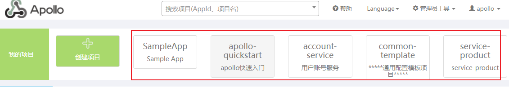

- **environment (环境)**
    - 配置对应的环境，Apollo 客户端在运行时需要知道当前应用处于哪个环境，从而可以去获取应用的配置
    - **关键字：`env`**

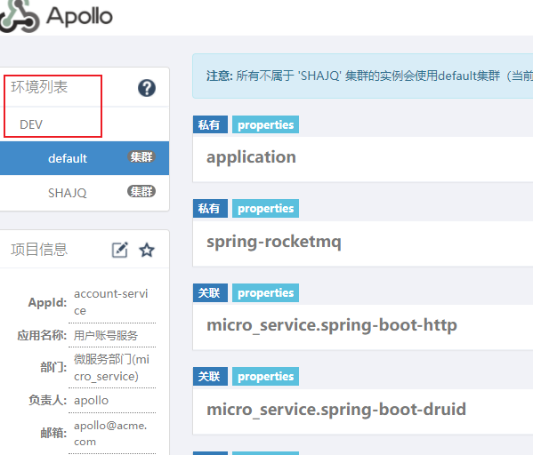

- **cluster (集群)**
    - 一个应用下不同实例的分组，典型的应用就是不同应用实例按照数据中心进行划分，比如把上海机房的应用实例分为一个集群，把北京机房的应用实例分为另一个集群。
    - **关键字：`cluster`**

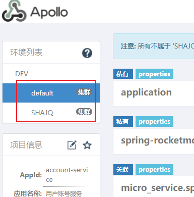

- **namespace (命名空间)**
    - 一个应用下不同配置的分组，可以简单地把namespace类比为文件，不同类型的配置存放在不同的文件中，如数据库配置文件，RPC 配置文  件，应用自身的配置文件等
    - **关键字：`namespaces`**

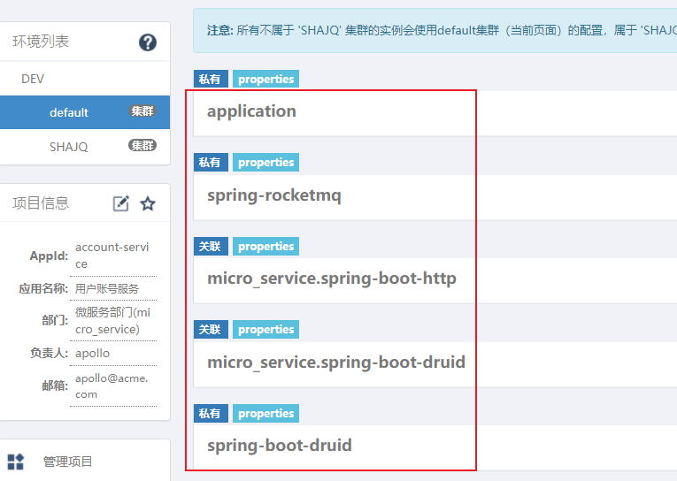

**相应的关系图**：

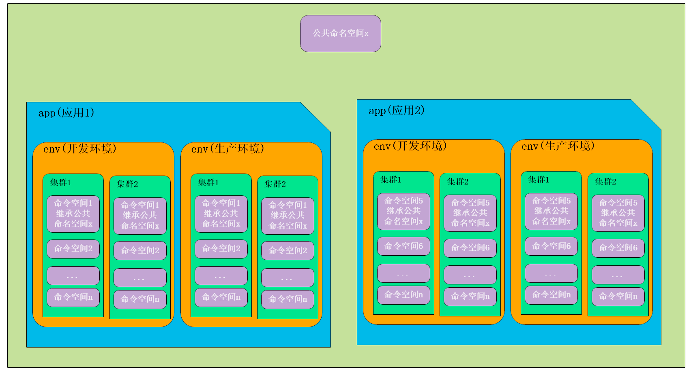

### 4.3. 基础设置

在右上角的【管理员工具】中可以进行一些基础的设置

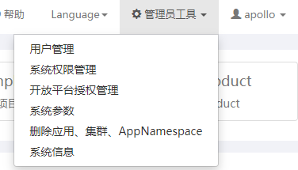

#### 4.3.1. 部门管理

apollo 默认部门有两个。要增加自己的部门，可在系统参数中修改

1. 点击【管理员工具】-->【系统参数】
2. 在key输入框中输入`organizations`（*注：固定值*），查询已存在的部门设置

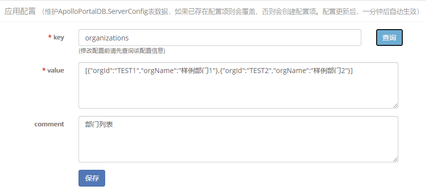

3. 通过修改value值可以添加新部门，如下面添加一个微服务部门：

```json
[{"orgId":"TEST1","orgName":"样例部门1"},{"orgId":"TEST2","orgName":"样例部门2"},{"orgId":"micro_service","orgName":"微服务部门"}]
```

添加成功

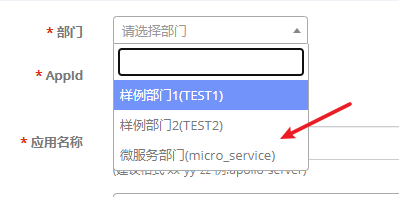

#### 4.3.2. 用户管理

apollo默认提供一个超级管理员：`apollo`，点击【管理员工具】-->【用户管理】，可以添加用户

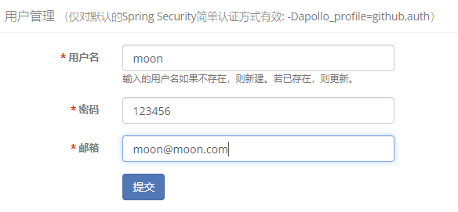

### 4.4. 项目管理（Apollo Portal管理界面）

#### 4.4.1. 创建项目

1. 打开apollo-portal主页：http://localhost:8070/
2. 点击【创建项目】，创建名为account-service的项目
3. 输入项目信息
    - 部门：选择应用所在的部门
    - 应用AppId：用来标识应用身份的唯一id，格式为string，需要和项目配置文件applications.properties中配置的app.id对应
    - 应用名称：应用名，仅用于界面展示
    - 应用负责人：选择的人默认会成为该项目的管理员，具备项目权限管理、集群创建、Namespace创建等权限

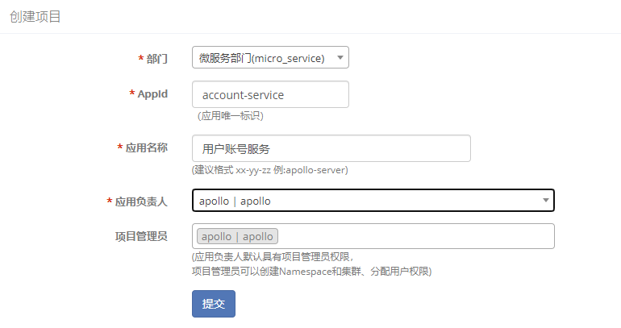

4. 点击提交后，创建成功则会自动跳转到项目首页
5. 在项目管理页面，使用管理员 apollo 将指定项目授权给之前添加的用户“moon”，管理 account-service 服务的权限

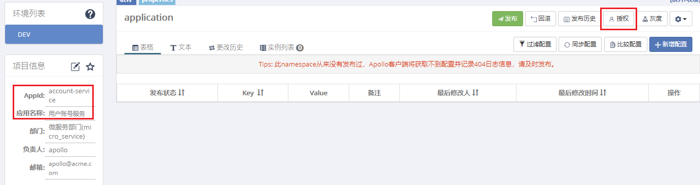

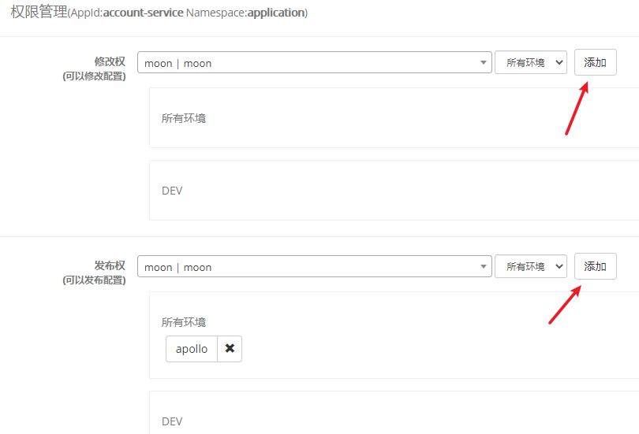

6. 使用“moon”登录，查看项目配置

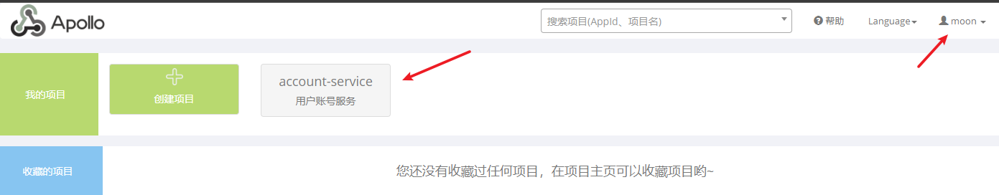

#### 4.4.2. 删除项目

如删除整个项目，点击【管理员工具】-->【删除应用、集群、AppNamespace】。先查询出要删除的项目，再点击【删除应用】


### 4.5. 配置管理（Apollo Portal管理界面）

以下示例操作在account-service项目中进行配置

#### 4.5.1. 添加发布配置项

方式一：通过表格模式添加配置，在项目信息页面，点击【表格】标签（*默认的*）-->【新增配置】


方式二：通过文本模式编辑，Apollo除了支持表格模式，逐个添加、修改配置外，还提供文本模式批量添加、修改。对于从已有的`properties`文件迁移十分方便。在项目信息页面，选择【文本】标签，修改配置后点击右上角【修改配置】图标

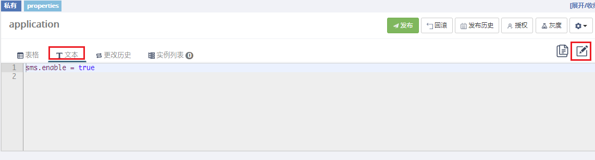

#### 4.5.2. 修改配置

1. 找到对应的配置项，点击修改
2. 修改为需要的值，点击提交
3. 发布配置

#### 4.5.3. 删除配置

1. 找到需要删除的配置项，点击删除按钮

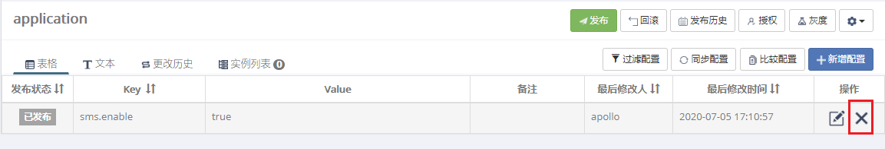

2. 确认删除后，点击发布

### 4.6. 命名空间（Namespace）

#### 4.6.1. 添加 Namespace

Namespace 作为配置的分类，可当成一个配置文件。下面以添加rocketmq配置为例，添加名叫“spring-rocketmq”的`Namespace`配置rocketmq相关信息

1. 添加项目私有Namespace：`spring-rocketmq`。进入项目首页，点击左下角的【添加Namespace】，共包括两项：【关联公共Namespace】和【创建Namespace】，这里选择【创建Namespace】

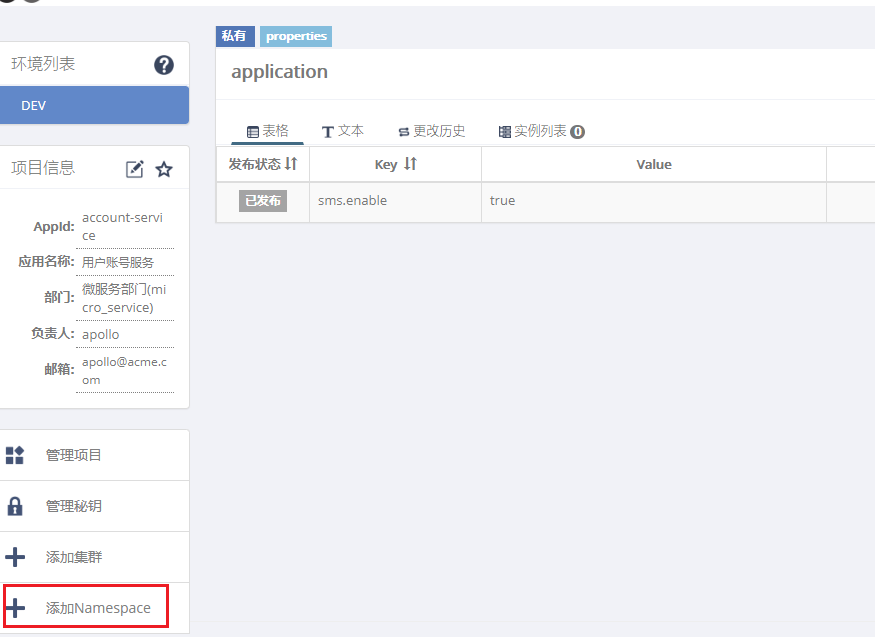

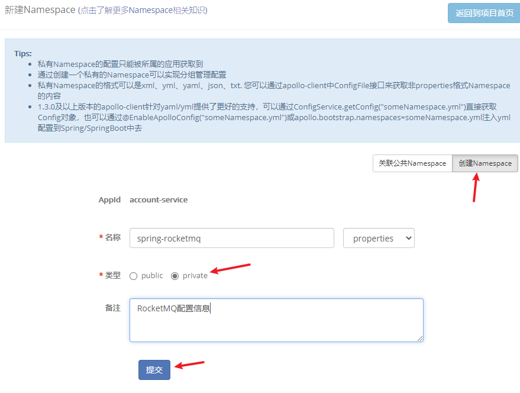

2. 添加配置项

```properties
rocketmq.name-server = 127.0.0.1:9876
rocketmq.producer.group = PID_ACCOUNT
```

3. 发布配置

#### 4.6.2. 客户端获取Namespace的配置

修改VM options：`-Dapp.id=account-service -Denv=DEV -Ddev_meta=http://localhost:8080`，运行以下测试程序

```java
/* 测试获取指定namespace下的配置信息 */
@Test
public void getNamespaceConfigTest() throws InterruptedException {
    // 创建带namespace参数的配置对象
    Config config = ConfigService.getConfig("spring-rocketmq");
    // 需要获取的配置对应的key
    String key = "rocketmq.name-server";
    while (true) {
        // 获取key的值
        String value = config.getProperty(key, null);
        System.out.printf("now: %s, rocketmq.name-server: %s%n", LocalDateTime.now().toString(), value);
        Thread.sleep(3000L);
    }
}
```

#### 4.6.3. 公共配置

##### 4.6.3.1. 添加公共Namespace

在项目开发中，有一些配置可能是通用的，可以通过把这些通用的配置放到公共的Namespace中，这样其他项目要使用时可以直接添加需要的公共 Namespace

1. 新建 common-template 项目，用于存放公共配置项

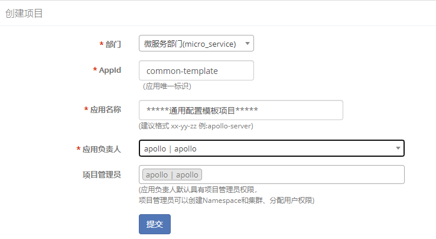

2. 添加公共Namespace：`spring-boot-http`。进入common-template项目管理页面：http://localhost:8070/config.html?#/appid=common-template。点击左下角【添加Namespace】

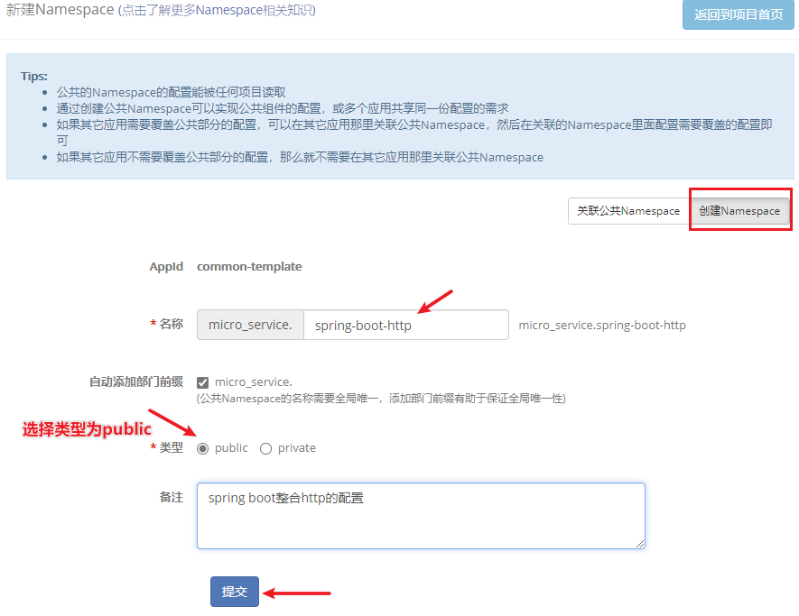

3. 添加配置项并发布

```properties
spring.http.encoding.enabled = true
spring.http.encoding.charset = UTF-8
spring.http.encoding.force = true
server.tomcat.remote_ip_header = x-forwarded-for
server.tomcat.protocol_header = x-forwarded-proto
server.use-forward-headers = true
server.servlet.context‐path = /
```

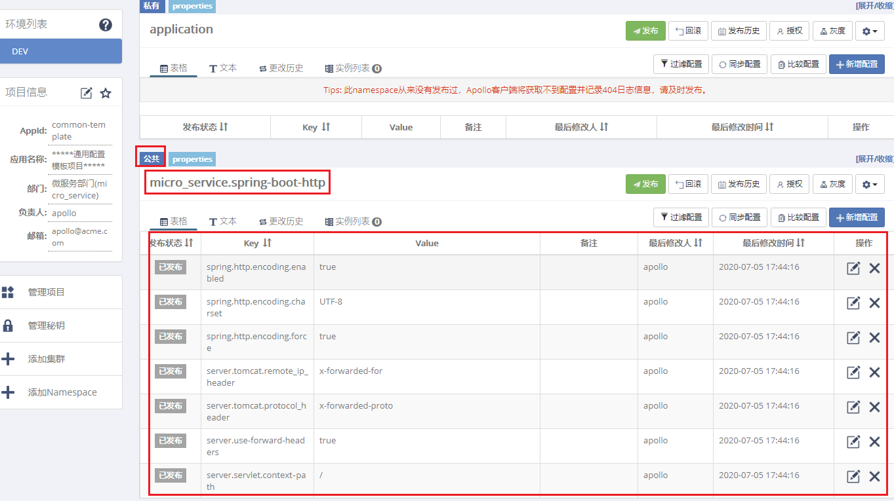

##### 4.6.3.2. 关联公共Namespace

1. 打开已有的 account-service 项目
2. 点击左侧的添加 Namespace
3. 选择关联公共 Namespace，选择公共的 namespace

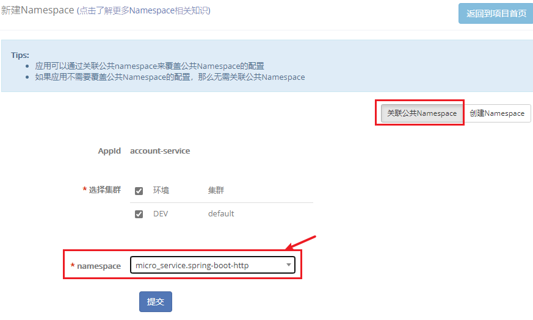

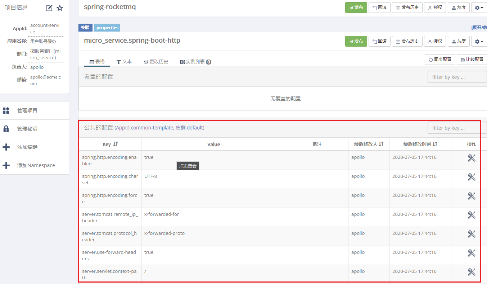

4. 根据需求可以覆盖引入公共Namespace中的配置，下面以覆盖`server.servlet.context-path`为例，将其修改为`/account-service`，发布修改的配置项

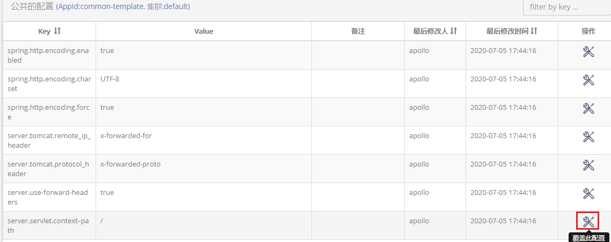

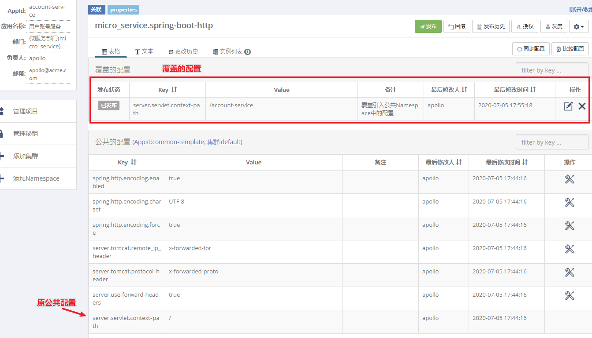

### 4.7. 多项目配置（Apollo Portal管理界面）

通常一个分布式系统包括多个项目，所以需要配置多个项目，下面以一个P2P金融的项目为例，添加交易中心微服务`transaction-service`。*详细操作以上章节已有*，步骤如下：

1. 添加交易中心微服务transaction-service
2. 关联公共Namespace（*任务应用都可以关联公共Namespace*），或者创建私有Namespace。
3. 覆盖配置，修改交易中心微服务的context-path为：`/transaction`
4. 发布修改后的配置

### 4.8. 集群管理

在有些情况下，应用有需求对不同的集群做不同的配置，比如部署在A机房的应用连接的 RocketMQ 服务器地址和部署在B机房的应用连接的 RocketMQ 服务器地址不一样。另外在项目开发过程中，也可为不同的开发人员创建不同的集群来满足开发人员的自定义配置

#### 4.8.1. 创建集群

1. 进入项目信息页面，点击页面左下角的【添加集群】按钮

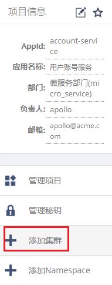

2. 输入集群名称`SHAJQ`，选择环境并提交：添加上海金桥数据中心为例

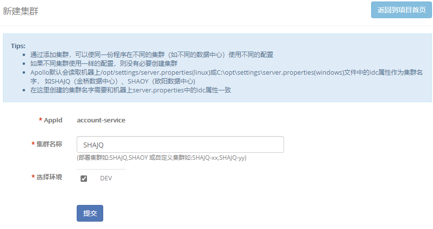

3. 切换到对应的集群，修改配置并发布即可

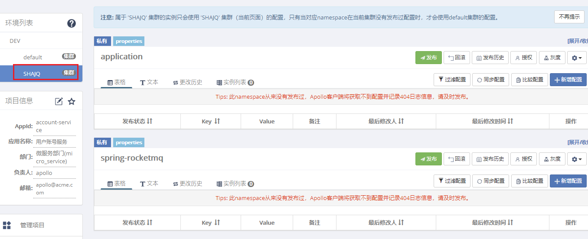

> <font color=red>**注：每个环境下都有一个`default`集群，通常创建项目后，添加的配置都是在此集群中。所以创建新的集群后，相应的配置都是空**</font>

#### 4.8.2. 同步集群配置

同步集群的配置是指在同一个应用中拷贝某个环境下的集群的配置到目标环境下的目标集群。

1. 切换到原有集群
2. 展开要同步的Namespace，点击【同步配置】

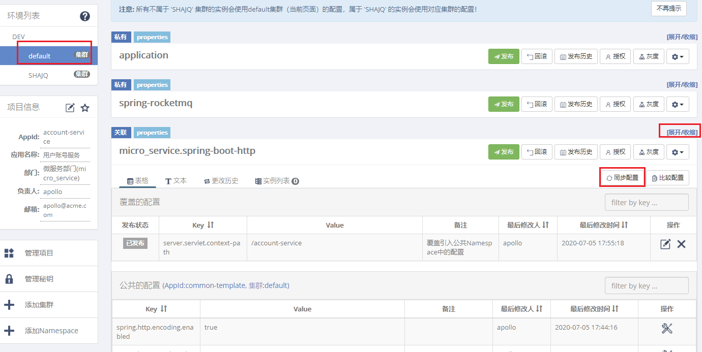

3. 选择同步到的新集群，再选择要同步的配置

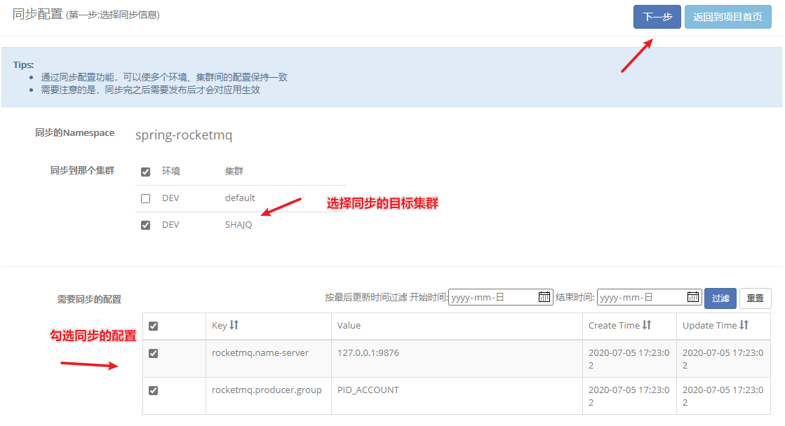

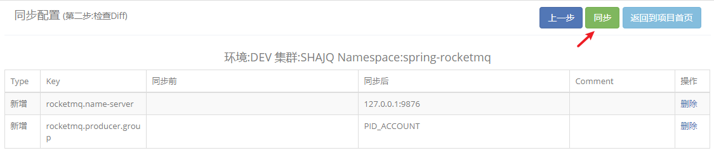

4. 同步完成后，切换到SHAJQ集群，发布配置

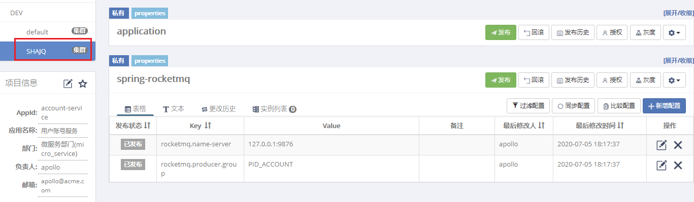

#### 4.8.3. 读取指定集群配置

读取某个集群的配置，需要启动应用时指定具体的应用、环境和集群。

```
-Dapp.id=应用名称
-Denv=环境名称
-Dapollo.cluster=集群名称
-D环境_meta=meta地址
```

修改启动测试程序的VM options，观察是否读取到不同集群的配置

```bash
-Dapp.id=account-service -Denv=DEV -Dapollo.cluster=SHAJQ -Ddev_meta=http://localhost:8080
```

## 5. Apollo 配置发布原理分析(！待整理)


## 6. Apollo应用于分布式系统

在微服务架构模式下，项目往往会切分成多个微服务，下面将以一个模拟P2P项目为例进行使用练习

### 6.1. 项目示例场景介绍

#### 6.1.1. 项目概述

万信金融是一款面向互联网大众提供的理财服务和个人消费信贷服务的金融平台，依托大数据风控技术，为用户提供方便、快捷、安心的P2P金融服务。本项目包括交易平台和业务支撑两个部分，交易平台主要实现理财服务，包括：借钱、出借等模块，业务支撑包括：标的管理、对账管理、风控管理等模块。项目采用先进的互联网技术进行研发，保证了P2P双方交易的安全性、快捷性及稳定性。

#### 6.1.2. 各微服务介绍

项目部分微服务作用简介，如下：

- 用户中心服务(consumer-service)：为借款人和投资人提供用户账户管理服务，包括：注册、开户、充值、提现等
- UAA认证服务(uaa-service)：为用户中心的用户提供认证服务
- 统一账户服务(account-service)：对借款人和投资人的登录平台账号进行管理，包括：注册账号、账号权限管理等
- 交易中心(transaction-service)：负责P2P平台用户发标和投标功能

### 6.2. Spring Boot 应用集成 Apollo

Spring Boot支持通过`application.properties`/`bootstrap.properties`来配置，该方式能使配置在更早的阶段注入，比如使用 `@ConditionalOnProperty` 的场景或者是有一些`spring-boot-starter`在启动阶段就需要读取配置做一些事情（如`dubbo-spring-boot-project`）

下面示例以集成统一账户服务(account-service)为例

#### 6.2.1. 导入 Apollo 客户端

> 注：参考网上资料account-service、transaction-service、uaa-service、consumer-service工程，手动创建这几个微服务

每个工程必须在 pom.xml 添加 Apollo 客户端依赖：

```xml
<dependency>
    <groupId>com.ctrip.framework.apollo</groupId>
    <artifactId>apollo-client</artifactId>
    <version>1.1.0</version>
</dependency>
```

以下是account-service的依赖，如其它工程可参考“资料”下的“微服务”

```xml
<?xml version="1.0" encoding="UTF-8"?>

<project xmlns="http://maven.apache.org/POM/4.0.0" xmlns:xsi="http://www.w3.org/2001/XMLSchema-instance"
         xsi:schemaLocation="http://maven.apache.org/POM/4.0.0 http://maven.apache.org/xsd/maven-4.0.0.xsd">
    <parent>
        <artifactId>java-stack-apollo</artifactId>
        <groupId>com.moon</groupId>
        <version>1.0-SNAPSHOT</version>
    </parent>

    <modelVersion>4.0.0</modelVersion>
    <artifactId>account-service</artifactId>
    <name>${project.artifactId}</name>
    <packaging>jar</packaging>
    <description>统一账户服务工程，用于测试apollo配置</description>

    <dependencies>
        <dependency>
            <groupId>org.springframework.boot</groupId>
            <artifactId>spring-boot-starter</artifactId>
            <exclusions>
                <exclusion>
                    <groupId>org.springframework.boot</groupId>
                    <artifactId>spring-boot-starter-logging</artifactId>
                </exclusion>
            </exclusions>
        </dependency>

        <dependency>
            <groupId>org.springframework.boot</groupId>
            <artifactId>spring-boot-starter-log4j2</artifactId>
        </dependency>

        <dependency>
            <groupId>org.springframework.boot</groupId>
            <artifactId>spring-boot-starter-web</artifactId>
        </dependency>

        <dependency>
            <groupId>org.springframework.boot</groupId>
            <artifactId>spring-boot-configuration-processor</artifactId>
            <optional>true</optional>
        </dependency>

        <dependency>
            <groupId>com.ctrip.framework.apollo</groupId>
            <artifactId>apollo-client</artifactId>
        </dependency>
    </dependencies>
</project>
```

#### 6.2.2. 整合 apollo 必选配置

在 Spring Boot 项目的 `application.properties` 或 `application.yml` 中配置以下必需项：

1. `app.id`：对应 apollo 项目的 **AppId** 配置。

```properties
app.id=account-service
```

```yml
app:
  id: account-service
```

2. `apollo.bootstrap`：用于集成 springboot，开启 apollo.bootstrap，指定 namespace，主要配置以下内容：

```properties
apollo.bootstrap.enabled = true
apollo.bootstrap.namespaces = application,micro_service.spring‐boot‐http,spring‐rocketmq,micro_service.spring‐boot‐druid
```

```yml
apollo:
  bootstrap:
    enabled: true
    namespaces: application,micro_service.spring-boot-http,spring-rocketmq,micro_service.spring-boot-druid
```

3. `xxx.meta`：**Apollo Meta Server** 的配置，主要有以下两种配置方式：
    - 第一种：通过 Java System Property 方式，设置 apollo.meta：`-Dapollo.meta=http://localhost:8080`
    - 第二种：在 resources 目录下新建 `apollo-env.properties` 文件，添加以下配置

```properties
# 开发环境
dev.meta=http://localhost:8080
# 生产环境
pro.meta=http://localhost:8081
# 功能验收测试环境
fat.meta=http://apollo.fat.xxx.com  
# 用户验收测试环境
uat.meta=http://apollo.uat.xxx.com 
```

4. 本地缓存路径

Apollo 客户端会把从服务端获取到的配置在本地文件系统缓存一份，用于在遇到服务不可用，或网络不通的时候，依然能从本地恢复配置，不影响应用正常运行。本地配置文件会以下面的文件名格式放置于配置的本地缓存路径下：`{appId}+{cluster}+{namespace}.properties`


可以通过如下方式指定缓存路径，通过 Java System Property 的 `apollo.cacheDir`：

```bash
-Dapollo.cacheDir=/opt/data/apollo-config
```

5. `env`：Apollo 配置环境(**Environment**)。通过 Java System Property 的 env 来指定环境：`-Denv=DEV`
6. `apollo.cluste`：**Cluster（集群）**配置项，通过 Java System Property 的来指定集群：`-Dapollo.cluster=DEFAULT`，或者选择使用之前新建的SHAJQ集群：`-Dapollo.cluster=SHAJQ`

#### 6.2.3. 开启 apollo 配置

创建项目的启动类，在启动类上增加 `@EnableApolloConfig` 注解开启Apollo配置

```java
package com.moon.apollo.account;

import com.ctrip.framework.apollo.spring.annotation.EnableApolloConfig;
import org.springframework.boot.SpringApplication;
import org.springframework.boot.autoconfigure.SpringBootApplication;

/**
 * 统一账户服务
 */
@SpringBootApplication
@EnableApolloConfig
public class AccountApplication {
    public static void main(String[] args) {
        SpringApplication.run(AccountApplication.class, args);
    }
}
```

#### 6.2.4. Apollo 应用配置

1. 将本示例项目的`\java-technology-stack\java-stack-apollo\scripts\apollo_config\account.properties`中的配置添加到apollo中

```properties
# 配置在application命名空间
swagger.enable=true
sms.enable=true

# 配置在spring-http命名空间
spring.http.encoding.charset=UTF-8
spring.http.encoding.force=true
spring.http.encoding.enabled=true
server.use-forward-headers=true
server.tomcat.protocol_header=x-forwarded-proto
server.servlet.context-path=/account-service
server.tomcat.remote_ip_header=x-forwarded-for

# 配置在spring-boot-druid命名空间
spring.datasource.driver-class-name=com.mysql.cj.jdbc.Driver
spring.datasource.druid.stat-view-servlet.allow=127.0.0.1,192.168.163.1
spring.datasource.druid.web-stat-filter.session-stat-enable=false
spring.datasource.druid.max-pool-prepared-statement-per-connection-size=20
spring.datasource.druid.max-active=20
spring.datasource.druid.stat-view-servlet.reset-enable=false
spring.datasource.druid.validation-query=SELECT 1 FROM DUAL
spring.datasource.druid.stat-view-servlet.enabled=true
spring.datasource.druid.web-stat-filter.enabled=true
spring.datasource.druid.stat-view-servlet.url-pattern=/druid/*
spring.datasource.druid.stat-view-servlet.deny=192.168.1.73
spring.datasource.url=jdbc\:mysql\://127.0.0.1\:3306/p2p_account?useUnicode\=true
spring.datasource.druid.filters=config,stat,wall,log4j2
spring.datasource.druid.test-on-return=false
spring.datasource.druid.web-stat-filter.profile-enable=true
spring.datasource.druid.initial-size=5
spring.datasource.druid.min-idle=5
spring.datasource.druid.max-wait=60000
spring.datasource.druid.web-stat-filter.session-stat-max-count=1000
spring.datasource.druid.pool-prepared-statements=true
spring.datasource.druid.test-while-idle=true
spring.datasource.password=itcast0430
spring.datasource.username=root
spring.datasource.druid.stat-view-servlet.login-password=admin
spring.datasource.druid.stat-view-servlet.login-username=admin
spring.datasource.druid.web-stat-filter.url-pattern=/*
spring.datasource.druid.time-between-eviction-runs-millis=60000
spring.datasource.druid.min-evictable-idle-time-millis=300000
spring.datasource.druid.test-on-borrow=false
spring.datasource.druid.web-stat-filter.principal-session-name=admin
spring.datasource.druid.filter.stat.log-slow-sql=true
spring.datasource.druid.web-stat-filter.principal-cookie-name=admin
spring.datasource.type=com.alibaba.druid.pool.DruidDataSource
spring.datasource.druid.aop-patterns=cn.itcast.wanxinp2p.*.service.*
spring.datasource.druid.filter.stat.slow-sql-millis=1
spring.datasource.druid.web-stat-filter.exclusions=*.js,*.gif,*.jpg,*.png,*.css,*.ico,/druid/*
```

2. 根据上面准备好的本地配置文件配置到对应的命名空间，然后发布配置。spring-http命名空间在之前已通过关联公共命名空间添加好了，添加到spring-boot-druid命名空间。
3. 在`account-service/src/main/resources/application.properties`中配置`apollo.bootstrap.namespaces`需要引入的命名空间

```properties
server.port=63000

# 定义读取 apollo 应用配置的id
app.id=account-service

apollo.bootstrap.enabled = true
# 定义读取配置的Namespace，中间以逗号分隔
apollo.bootstrap.namespaces = application,micro_service.spring‐boot‐http,spring‐rocketmq,micro_service.spring‐boot‐druid
```

```yml
server:
  port: 63000

# 定义读取 apollo 应用配置的id
app:
  id: account-service

# 定义apollo相关必须配置
apollo:
  bootstrap:
    enabled: true
    # 定义读取配置的Namespace，中间以逗号分隔
    namespaces: application,micro_service.spring-boot-http,spring-rocketmq,micro_service.spring-boot-druid
```

#### 6.2.5. 完整 VM options 配置

<font color=red>**为了保持灵活，都通过vm options 来匹配环境、集群、缓存路径等。项目启动完整的 VM options 配置如下：**</font>

```bash
-Denv=DEV -Dapollo.cacheDir=/opt/data/apollo-config -Dapollo.cluster=DEFAULT
```

#### 6.2.6. 读取配置测试

1. 配置好 VM options，启动项目
2. 访问：`http://127.0.0.1:63000/account-service/hi`，确认Spring Boot中配置的context-path是否生效。如果通过`/account-service`能正常访问，说明apollo的配置已生效


3. 确认spring-boot-druid配置

在account-service项目中AccountController中通过`@Value`获取来验证

```java
@GetMapping("/db-url")
public String getDBConfig(@Value("${spring.datasource.url}") String url) {
    return url;
}
```

访问`http://127.0.0.1:63000/account-service/db-url`，显示结果


#### 6.2.7. 创建其它服务项目（未完成）

参考account-service项目，创建其它微服务项目。

### 6.3. 生产环境部署

当一个项目要上线部署到生产环境时，项目的配置比如数据库连接、RocketMQ地址等都会发生变化，此时就需要通过Apollo为生产环境添加自己的配置。

#### 6.3.1. 企业部署方案

在企业中常用的部署方案为：`Apollo-adminservice`和`Apollo-configservice`两个服务分别在线上环境(pro)，仿真环境(uat)和开发环境(dev)各部署一套，`Apollo-portal`做为管理端只部署一套，统一管理上述三套环境。具体如下图所示：

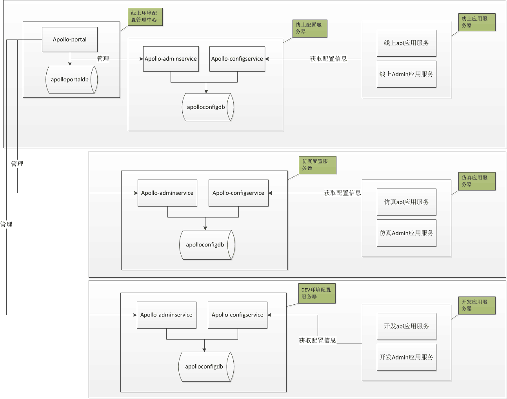

#### 6.3.2. 创建生产环境数据库

创建生产环境的ApolloConfigDB：每添加一套环境就需要部署一套ApolloConfgService和ApolloAdminService

> 创建数据的脚本位置：`java-technology-stack\java-stack-apollo\scripts\sql\ApolloConfigDB_PRO__initialization.sql`

#### 6.3.3. 配置启动参数

1. 配置启动参数
2. 设置ApolloConfigService端口为：8081，ApolloAdminService端口为8091。启动脚本（windows）如下：

```bash
echo

set url="localhost:3306"
set username="root"
set password="123456"

start "configService-PRO" java -Dserver.port=8081 -Xms256m -Xmx256m -Dapollo_profile=github -Dspring.datasource.url=jdbc:mysql://%url%/ApolloConfigDBPRO?characterEncoding=utf8 -Dspring.datasource.username=%username% -Dspring.datasource.password=%password% -Dlogging.file=.\logs\apollo-configservice.log -jar .\apollo-configservice-1.6.1.jar
start "adminService-PRO" java -Dserver.port=8091 -Xms256m -Xmx256m -Dapollo_profile=github -Dspring.datasource.url=jdbc:mysql://%url%/ApolloConfigDBPRO?characterEncoding=utf8 -Dspring.datasource.username=%username% -Dspring.datasource.password=%password% -Dlogging.file=.\logs\apollo-adminservice.log -jar .\apollo-adminservice-1.6.1.jar
```

3. 运行runApollo-PRO.bat（脚本位置java-technology-stack\java-stack-apollo\scripts\run\runApollo-PRO.bat|runApollo-PRO.sh）

#### 6.3.4. 修改Eureka地址

更新生产环境Apollo的Eureka地址：

```sql
USE ApolloConfigDBPRO;
UPDATE ServerConfig SET `Value` = "http://localhost:8081/eureka/" WHERE `key` = "eureka.service.url";
```

#### 6.3.5. 调整 ApolloPortal 服务配置

服务配置项统一存储在`ApolloPortalDB.ServerConfig`表中，可以通过点击【管理员工具】-->【系统参数】页面进行配置。输入key为`apollo.portal.envs`，查询可支持的环境列表。默认值是dev，如果portal需要管理多个环境的话，以逗号分隔即可（大小写不敏感），如：

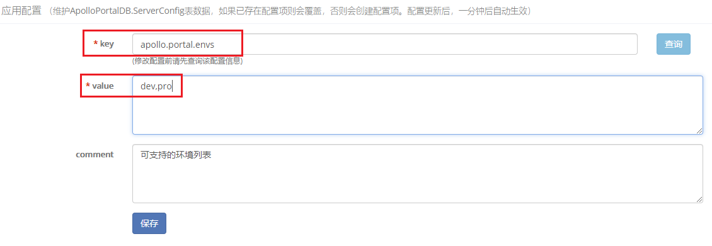

#### 6.3.6. 重新启动 ApolloPortal

Apollo Portal需要在不同的环境访问不同的meta service(apollo-configservice)地址，所以需要在配置中提供这些信息。

```bash
-Ddev_meta=http://localhost:8080/ -Dpro_meta=http://localhost:8081/
```

1. 关闭之前启动的ApolloPortal服务，使用runApolloPortal.bat启动多环境配置，启动脚本（windows）如下：

```bash
echo

set url="localhost:3306"
set username="root"
set password="123456"

start "ApolloPortal" java -Xms256m -Xmx256m -Dapollo_profile=github,auth -Ddev_meta=http://localhost:8080/ -Dpro_meta=http://localhost:8081/ -Dserver.port=8070 -Dspring.datasource.url=jdbc:mysql://%url%/ApolloPortalDB?characterEncoding=utf8 -Dspring.datasource.username=%username% -Dspring.datasource.password=%password% -Dlogging.file=.\logs\apollo-portal.log -jar .\apollo-portal-1.6.1.jar
```

> 脚本位置：java-technology-stack\java-stack-apollo\scripts\run\runApolloPortal.bat|runApolloPortal.sh

2. 重新启动之后，点击account-service服务配置后会提示环境缺失，此时需要补全上边新增生产环境的配置

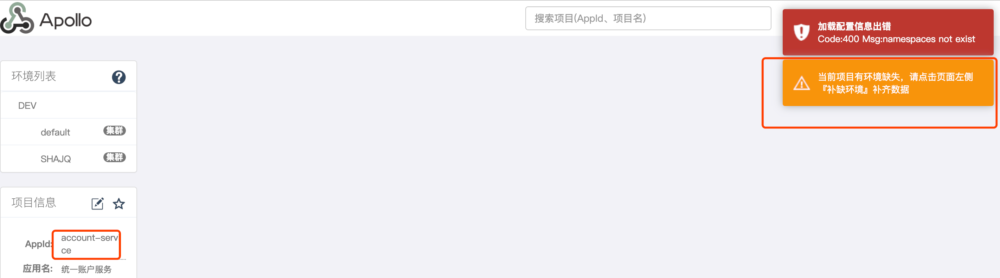

3. 点击补缺环境。补缺过生产环境后，切换到PRO环境后会提示有Namespace缺失，点击补缺


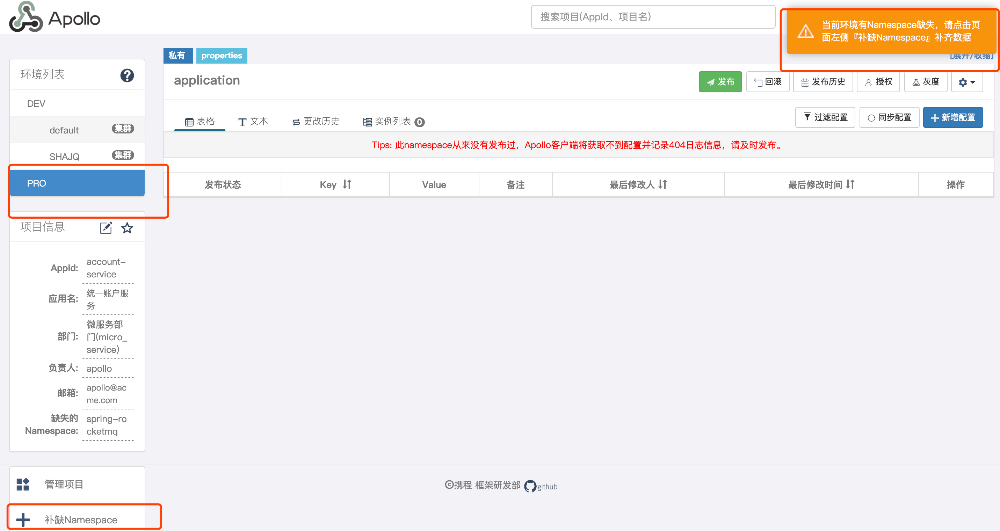

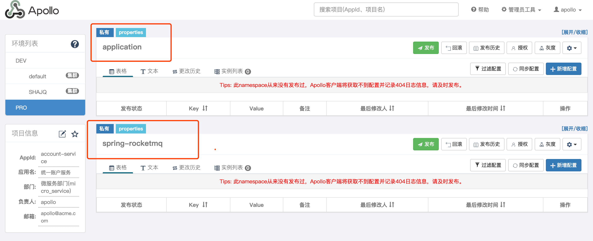

4. 从dev环境同步配置到pro

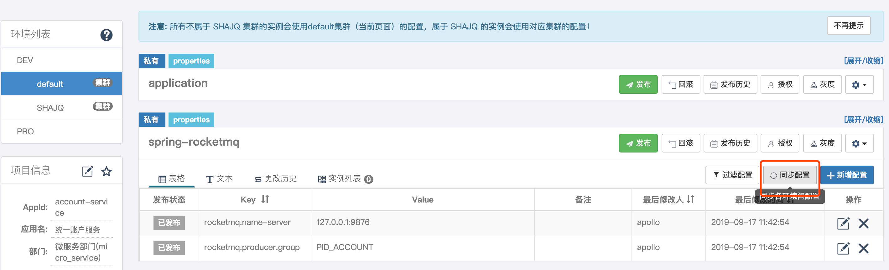

#### 6.3.7. 验证生产环境配置

1. 切换到pro环境，修改生产环境rocketmq地址后发布配置，用于测试
2. 在apollo-env.properties中增加`pro.meta=http://localhost:8081`
3. 修改account-service启动参数为：`-Denv=pro`

```bash
-Denv=pro -Dapollo.cacheDir=E:/opt/data/apollo-config -Dapollo.cluster=DEFAULT
```

4. 访问`http://127.0.0.1:63000/account-service/mq` 验证RocketMQ地址是否为上边设置的PRO环境的值

### 6.4. 灰度发布

#### 6.4.1. 灰度发布定义

灰度发布是指在黑与白之间，能够平滑过渡的一种发布方式。在其上可以进行A/B testing，即让一部分用户继续用产品特性A，一部分用户开始用产品特性B，如果用户对B没有什么反对意见，那么逐步扩大范围，把所有用户都迁移到B上面来

#### 6.4.2. Apollo 实现的功能

1. 对于一些对程序有比较大影响的配置，可以先在一个或者多个实例生效，观察一段时间没问题后再全量发布配置。
2. 对于一些需要调优的配置参数，可以通过灰度发布功能来实现A/B测试。可以在不同的机器上应用不同的配置，不断调整、测评一段时间后找出较优的配置再全量发布配置。

#### 6.4.3. 创建模拟灰度测试场景

1. 启动apollo-quickstart项目GrayTest类输出timeout的值。设置VM options: `-Dapp.id=apollo-quickstart -Denv=DEV -Ddev_meta=http://localhost:8080`

```java
package com.moon.apollo.quickstart;

import com.ctrip.framework.apollo.Config;
import com.ctrip.framework.apollo.ConfigService;

import java.time.LocalDateTime;

/**
 * 灰度发布测试
 */
public class GrayTest {
    public static void main(String[] args) throws InterruptedException {
        // 获取apollo配置对象
        Config config = ConfigService.getAppConfig();
        // 需要获取的配置对应的key
        String key = "timeout";
        while (true) {
            // 获取key的值
            String value = config.getProperty(key, null);
            System.out.printf("now: %s, timeout: %s%n", LocalDateTime.now().toString(), value);
            Thread.sleep(3000L);
        }
    }
}
```

2. 使用maven命令将apollo-quickstart项目打包成jar包，然后部署到linux系统中（本地虚拟机），模拟另一个服务器

```bash
package -Dmaven.test.skip=true -f pom.xml
```

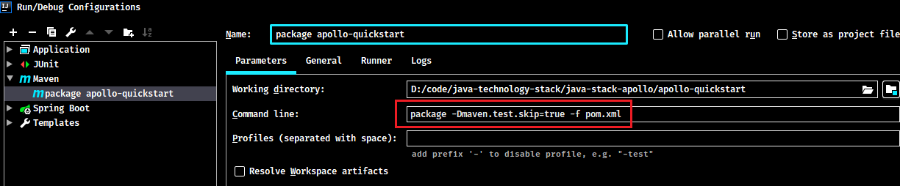

到target文件夹将jar包上传到linux系统（192.168.12.132）

```shell
java -Dapp.id=apollo-quickstart -Denv=DEV -Ddev_meta=http://192.168.200.165:8080 -jar apollo-quickstart.jar
```

本机与虚拟机成功连接后，在apollo控制台对应的项目信息里可以看到相应的ip

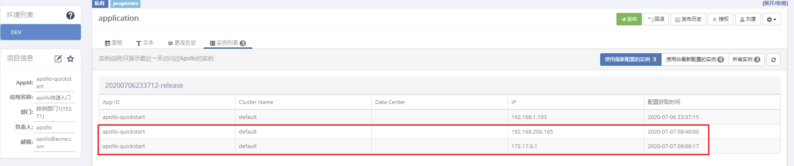

**灰度发布测试需求：**

当前有一个配置timeout=2000，最终测试结果需要对虚拟机（IP: 172.17.0.1）灰度发布timeout=3000，对本地（IP: 192.168.200.165）仍然是timeout=2000。

> *注：以上ip非固定，按实际情况修改*


#### 6.4.4. 创建灰度

1. 点击apollo-quickstart项目application namespace右上角的【创建灰度】按钮

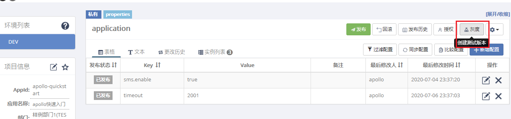

2. 点击确定后，灰度版本就创建成功了，页面会自动切换到【灰度版本】Tab

#### 6.4.5. 灰度配置

1. 点击【主版本的配置】中，timeout配置右边的【对此配置灰度】按钮

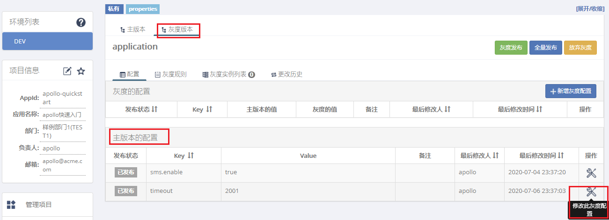

2. 在弹出框中填入要灰度的值：3000，点击提交。

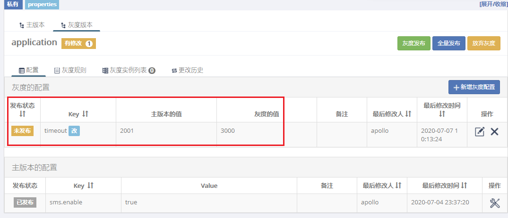

> **注：如果需要发布灰度，必须要配置了灰度规则**

#### 6.4.6. 配置灰度规则

1. 切换到【灰度规则】Tab页，点击【新增规则】按钮


2. 在弹出框中【灰度的IP】下拉框会默认展示当前使用配置的机器列表，选择要灰度的IP，点击完成


如果下拉框中没找到需要的IP，说明机器还没从Apollo取过配置，可以点击手动输入IP来输入，输入完后点击添加按钮


#### 6.4.7. 灰度发布

1. 启动本地apollo-quickstart项目的GrayTest类与启动虚拟机的jar包，此时输出timeout的值均为2001

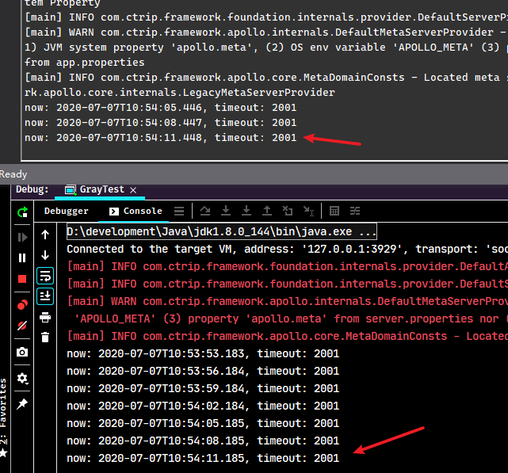

2. 切换到【配置】Tab页，再次检查灰度的配置部分，如果没有问题，点击【灰度发布】

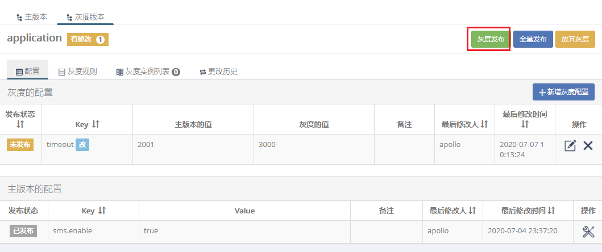

3. 在弹出框中可以看到主版本的值是2000，灰度版本即将发布的值是3000。填入其它信息后，点击发布

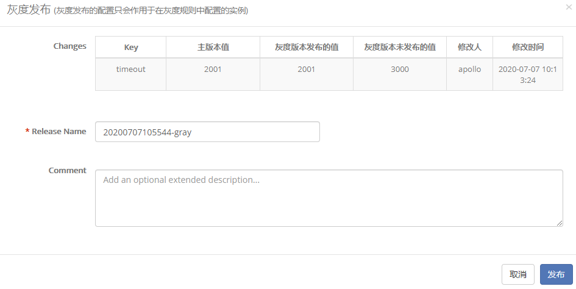

4. 发布后，切换到【灰度实例列表】Tab页，就能看到172.17.0.1实例已经使用了灰度发布的值

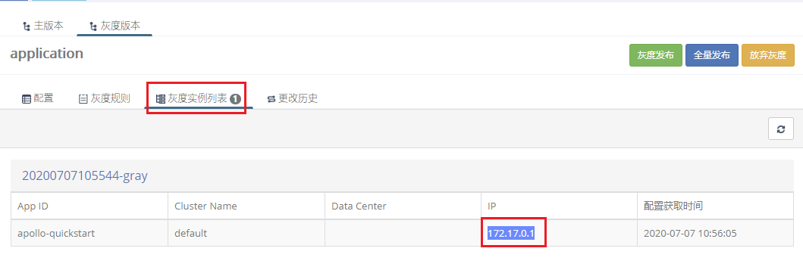

测试输出结果如下：

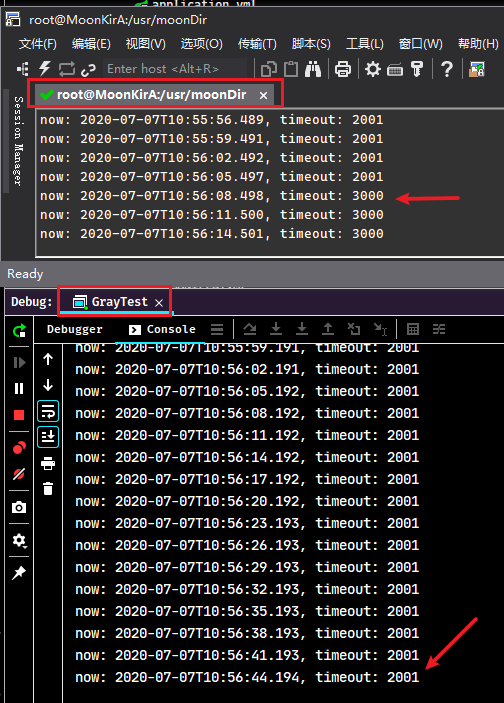

#### 6.4.8. 全量发布

如果灰度的配置测试下来比较理想，符合预期，那么就可以操作【全量发布】。全量发布的效果是：

1. 灰度版本的配置会合并回主版本，在这个例子中，就是主版本的timeout会被更新成3000
2. 主版本的配置会自动进行一次发布
3. 在全量发布页面，可以选择是否保留当前灰度版本，默认为不保留。

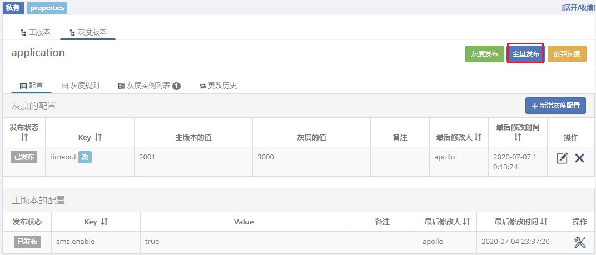


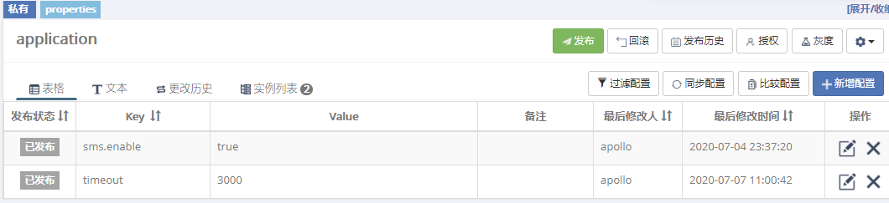

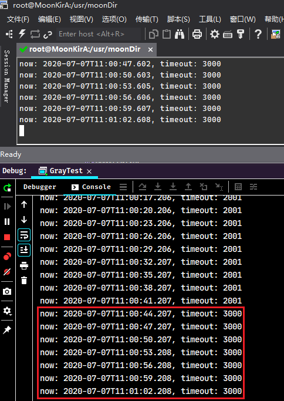

#### 6.4.9. 放弃灰度

如果灰度版本不理想或者不需要了，可以点击【放弃灰度】

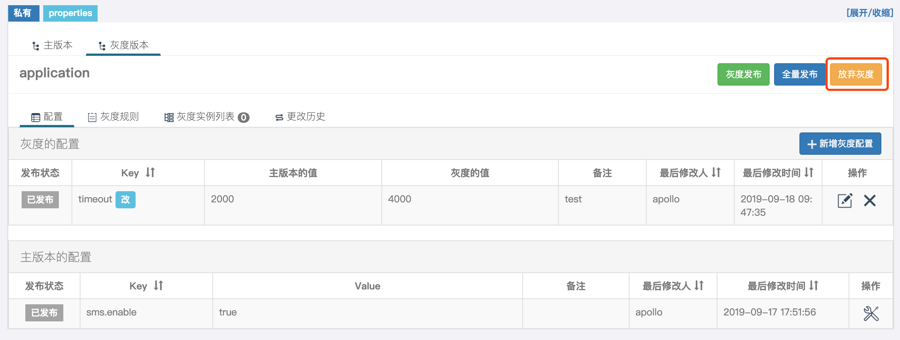

#### 6.4.10. 发布历史

点击主版本的【发布历史】按钮，可以看到当前namespace的主版本以及灰度版本的发布历史

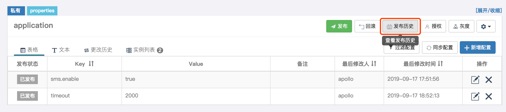

## 7. 其他

### 7.1. 测试灰度发布时编译jar遇到的问题

> 注：以下这种打包方式，打包成jar后，上传到linux系统，无法连接apollo服务，暂时没有分析出原因

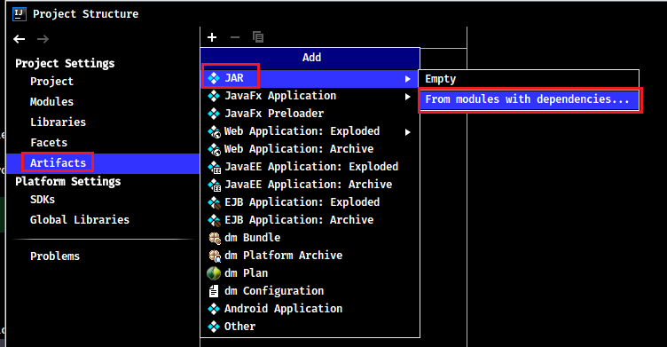

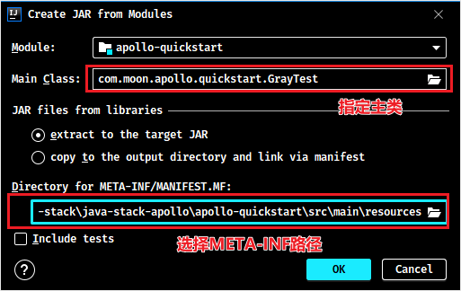

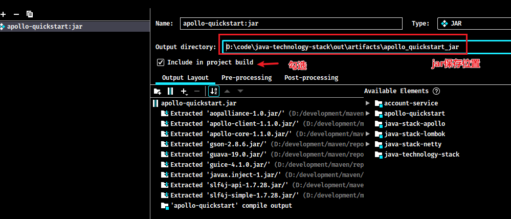

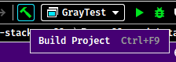

保存确认后，选择【Build Project】，到上图jar包保存路径下拿到生成的jar包。


