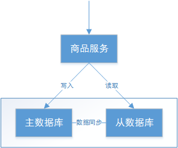

# 分布式事务基础理论

## 1. 概述

### 1.1. 什么是事务

什么是事务？举个生活中的例子：你去商店买东西就是一个事务的例子，买东西是一个交易，包含“一手交钱，一手交货”两个动作，交钱和交货这两个动作必须全部成功，交易才算成功，其中任何一个动作失败，交易就必须撤销。

事务的定义：**事务可以看做是一次大的活动，它由不同的小活动组成，这些小活动要么全部成功，要么全部失败。**

### 1.2. 本地事务

在软件系统中，通常由关系型数据库来控制事务，这是利用数据库本身的事务特性来实现的，因此叫数据库事务，由于应用主要靠关系数据库来控制事务，而数据库通常和应用在同一个服务器，所以基于关系型数据库的事务又被称为本地事务。以下回顾数据库事务的四大特性 ACID：

- **A（Atomic）**：原子性，构成事务的所有操作，要么都执行成功，要么全部不执行，不可能出现部分成功部分失败的情况。
- **C（Consistency）**：一致性，在事务执行前后，数据库的一致性约束没有被破坏。比如：张三向李四转100元，转账前和转账后的数据是正确状态这叫一致性，如果出现张三转出100元，李四账户没有增加100元这就出现了数据错误，就没有达到一致性。
- **I（Isolation）**：隔离性，数据库中的事务一般都是并发的，隔离性是指并发的两个事务的执行互不干扰，一个事务不能看到其他事务运行过程的中间状态。通过配置事务隔离级别可以避脏读、重复读等问题。
- **D（Durability）**：持久性，事务完成之后，该事务对数据的更改会被持久化到数据库，且不会被回滚。

<u>数据库事务在实现时会将一次事务涉及的所有操作全部纳入到一个不可分割的执行单元，该执行单元中的所有操作要么都成功，要么都失败，只要其中任一操作执行失败，都将导致整个事务的回滚</u>s

### 1.3. 分布式事务

随着互联网的快速发展，软件系统由原来的单体应用转变为分布式应用，下图描述了单体应用向分布式微服务应用的演变：


分布式系统会把一个应用系统拆分为可独立部署的多个服务，因此需要服务与服务之间远程协作才能完成事务操作，这种分布式系统环境下的事务机制称之为**分布式事务**。

本地事务依赖数据库本身提供的事务特性来实现，因此以下逻辑是可以实现事务控制：

```sql
begin transaction；
	-- 1.本地数据库操作：张三减少金额
	-- 2.本地数据库操作：李四增加金额
commit transaction;
```

在分布式环境下，就会变成操作不同数据库，因此以下逻辑是不可能实现事务控制：

```sql
begin transaction；
    -- 1.A微服务操作本地数据库A：张三减少金额
    -- 2.A微服务远程调用B微服务，操作数据库B：让李四增加金额
commit transaction;
```

因此在分布式架构的基础上，传统数据库事务就无法使用了，比如上例，张三和李四的账户不在一个数据库中甚至不在一个应用系统里，怎么实现转账事务？也就是说同样一个功能，原来是由一个系统完成的，即使这个功能包含很多个操作，也可以采用数据库事务(本地事务)搞定，而现在这个功能中包含的多个操作可能是由多个系统(微服务)参与完成的，此时数据库事务(本地事务)就无能为力了，这就需要新的分布式事务理论来支撑了。

## 2. 分布式事务基础理论

分布式事务与本地事务不同的是，分布式系统之所以叫分布式，是因为提供服务的各个节点分布在不同机器上，相互之间通过网络交互，那么必然存在出现网络故障的风险，这个网络断开的专业场景称之为网络分区，但不能因为这点网络问题就导致整个系统无法提供服务，网络因素成为了分布式事务的考量标准之一。因此，分布式事务需要更进一步的理论支持，通过分布式事务的基础理论知识指导来确定分布式事务控制的目标，从而理解每个解决方案。

### 2.1. 分布式事务产生的场景

1. 典型的场景就是微服务架构，微服务之间通过远程调用完成事务操作。 比如：订单微服务和库存微服务，下单的同时订单微服务请求库存微服务减库存。 总结：**跨JVM进程产生分布式事务**。


2. 单体系统访问多个数据库实例 当单体系统需要访问多个数据库（实例）时就会产生分布式事务。 比如：用户信息和订单信息分别在两个MySQL实例存储，用户管理系统删除用户信息，需要分别删除用户信息及用户的订单信息，由于数据分布在不同的数据实例，需要通过不同的数据库链接去操作数据，此时产生分布式事务。 总结：**跨数据库实例产生分布式事务**。


3. 多服务访问同一个数据库实例 比如：订单微服务和库存微服务即使访问同一个数据库也会产生分布式事务，原因就是跨JVM进程，两个微服务持有了不同的数据库链接进行数据库操作，此时产生分布式事务。


### 2.2. CAP 理论

CAP 是 Consistency、Availiability、Partition tolerance 三个词语的缩写，分别表示一致性、可用性、分区容忍性。

#### 2.2.1. 业务场景

结合电商系统中的一些业务场景来理解 CAP 理论。业务背景：

- 每台数据库服务器有它的最大连接数、负载和吞吐量，若有一天无法再满足业务的需求，就需要横向去扩展几台 Slave(从数据库) 去分担 Master(主数据库) 的压力。
- 如果服务对数据库的需求是 IO 密集型的，那可能会经常遇到增删改影响到了查询效率。这就需要进行读写分离，由主数据库应付增删改操作，由从数据库应付查询操作，主从数据库的数据要进行同步。



上图商品信息管理的执行流程：

1. 商品服务请求主数据库写入商品信息（添加商品、修改商品、删除商品）	
2. 主数据库向商品服务响应写入成功。
3. 商品服务请求从数据库读取商品信息。

##### 2.2.1.1. C - Consistency

一致性是指写操作后的读操作可以读取到最新的数据状态，当数据分布在多个节点上，从任意节点读取到的数据都是最新的状态。上图中，商品信息的读写要满足一致性就是要实现如下目标：

1. 商品服务写入主数据库成功，则向从数据库查询新数据也成功。
2. 商品服务写入主数据库失败，则向从数据库查询新数据也失败。

如何实现一致性？

1. 写入主数据库后要将数据同步到从数据库。
2. 写入主数据库后，在向从数据库同步期间要将从数据库锁定，待同步完成后再释放锁，以免在新数据写入成功后，向从数据库查询到旧的数据。

分布式系统一致性的特点：

1. 由于存在数据同步的过程，写操作的响应会有一定的延迟。
2. 为了保证数据一致性会对资源暂时锁定，待数据同步完成释放锁定资源。
3. 如果请求数据同步失败的结点则会返回错误信息，一定不会返回旧数据。

##### 2.2.1.2. A - Availability

可用性是指任何事务操作都可以得到响应结果，且不会出现响应超时或响应错误。上图中，商品信息读取满足可用性就是要实现如下目标：

1. 从数据库接收到数据查询的请求则立即能够响应数据查询结果。
2. 从数据库不允许出现响应超时或响应错误。

如何实现可用性？

1. 写入主数据库后要将数据同步到从数据库。
2. 由于要保证从数据库的可用性，不可将从数据库中的资源进行锁定。
3. 即时数据还没有同步过来，从数据库也要返回要查询的数据，哪怕是旧数据，如果连旧数据也没有则可以按照约定返回一个默认信息，但不能返回错误或响应超时。

> 为了保证可用性，一般需要通过增加从数据库节点来实现。

分布式系统可用性的特点：

1.  所有请求都有响应，且不会出现响应超时或响应错误。

##### 2.2.1.3. P - Partition tolerance

通常分布式系统的各个节点部署在不同的子网，这就是网络分区，不可避免的会出现由于网络故障而导致节点之间通信失败。分布式系统在遇到某节点或网络分区故障的时候，仍然能够对外提供满足一致性和可用性的服务，这就是分区容忍性。分布式系统中有某一个或者几个机器宕掉了，其他剩下的机器还能够正常运转满足系统需求，或者是机器之间有网络异常，将分布式系统分隔未独立的几个部分，各个部分还能维持分布式系统的运作，这样就具有较好的分区容忍性。上图中，商品信息读写满足分区容忍性就是要实现如下目标：

1. 主数据库向从数据库同步数据失败不影响读写操作。
2. 其中一个节点挂掉不影响另一个节点对外提供服务。

如何实现分区容忍性？

1. 尽量使用异步取代同步操作，例如使用异步方式将数据从主数据库同步到从数据，这样结点之间能有效的实现松耦合。
2. 添加从数据库结点，其中一个从结点挂掉其它从结点提供服务。

分布式分区容忍性的特点：

1. 分区容忍性分是布式系统具备的基本能力。

#### 2.2.2. CAP 组合方式

<font color=red>**在所有分布式事务场景中不会同时具备 CAP 三个特性，因为在具备了 P 的前提下 C 和 A 是不能共存的**</font>

在保证分区容忍性的前提下，一致性和可用性是无法兼顾，如果要提高系统的可用性就要增加多个节点，如果要保证数据的一致性就要实现每个节点的数据一致，节点越多可用性越好，但是数据一致性会越差。 CAP 的组合方式有如下几种：

- AP
