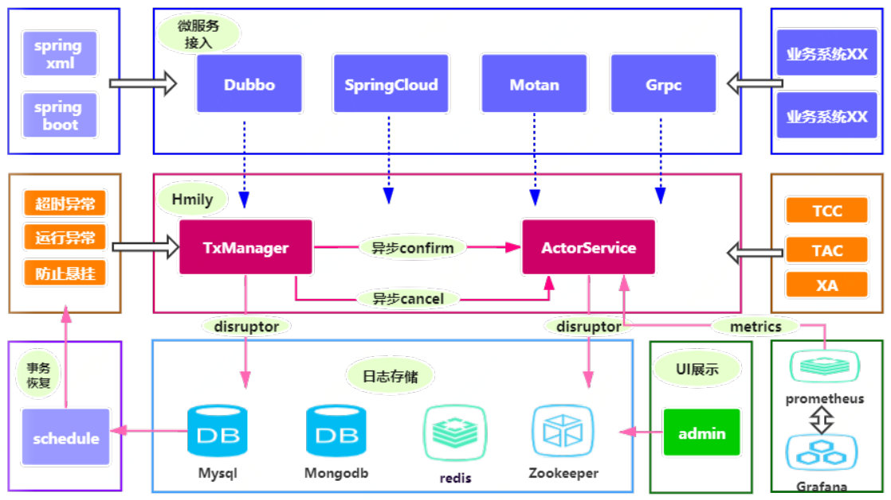
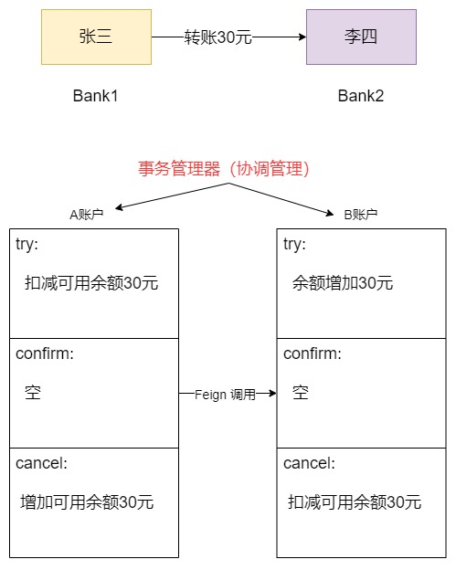

# Hmily - TCC 分布式事务解决方案

- Hmily 官方仓库：https://github.com/yu199195/hmily
- Hmily 官方文档：https://dromara.org/zh/projects/hmily/overview/

## 1. Hmily 概述

Hmily 是一款高性能，零侵入，金融级分布式事务解决方案，目前主要提供柔性事务的支持，包含 `TCC`, `TAC`(自动生成回滚SQL) 方案，未来还会支持 `XA` 等方案。



### 1.1. 功能

Hmily 是一个高性能分布式事务tcc开源框架。基于java语言来开发（JDK1.8），支持多种 rpc 框架进行分布式事务。它目前支持以下特性：

- 高可靠性 ：支持分布式场景下，事务异常回滚，超时异常恢复，防止事务悬挂。
- 易用性 ：提供零侵入性式的 `Spring-Boot`, `Spring-Namespace` 快速与业务系统集成。
- 高性能 ：去中心化设计，与业务系统完全融合，天然支持集群部署。
- 可观测性 ：Metrics多项指标性能监控，以及admin管理后台UI展示。
- 多种RPC ： 支持 `Dubbo`, `SpringCloud`,`Motan`, `brpc`, `tars` 等知名RPC框架。
- 日志存储 ： 支持 `mysql`, `oracle`, `mongodb`, `redis`, `zookeeper` 等方式。
- 复杂场景 ： 支持RPC嵌套调用事务。

Hmily 利用 AOP 对参与分布式事务的本地方法与远程方法进行拦截处理，通过多方拦截，事务参与者能透明的调用到另一方的 Try、Confirm、Cancel 方法；传递事务上下文；并记录事务日志，酌情进行补偿，重试等。

Hmily 不需要事务协调服务，但需要提供一个数据库(mysql/mongodb/zookeeper/redis/file)来进行日志存储。Hmily 实现的 TCC 服务与普通的服务一样，只需要暴露一个接口，也就是它的 Try 业务。Confirm/Cancel 业务逻辑，只是因为全局事务提交/回滚的需要才提供的，因此 Confirm/Cancel 业务只需要被 Hmily 事务框架发现即可，不需要被调用它的其他业务服务所感知。

### 1.2. 使用必要前提

- 必须使用 `JDK8+`
- TCC 模式下，用户必须要使用一款 `RPC` 框架, 比如 : `Dubbo`, `SpringCloud`,`Motan`
- TAC 模式下，用户必须使用关系型数据库, 比如：`mysql`, `oracle`, `sqlsever`

### 1.3. TCC 模式

TCC模式是经典的柔性事务解决方案，需要使用者提供 `try`, `confirm`, `cancel` 三个方法， 真正的情况下会执行 `try`, `confirm`, 异常情况下会执行`try`, `cancel`。 `confirm` 方法并不是 必须的，完全依赖于用户的`try` 方法如何去写。 `confirm`, `cancel` 2个方法也需要用户去保证幂等性, 这会附加一定的工作量，由于在`try`方法完成之后，数据已经提交了，因此它并不保证数据的隔离性。但是这样，它的 性能相对较高，一个好的系统设计，是非常适用适用`TCC`模式。下面是`Hmily` 框架的 `TCC` 流程图


当使用`TCC`模式的时候,用户根据自身业务需求提供 `try`, `confirm`, `cancel` 等三个方法， 并且 `confirm`, `cancel` 方法由自身完成实现，框架只是负责来调用，来达到事务的一致性。

- 在极端异常情况下，比如服务突然宕机，超时异常等，依赖与自身的调用任务，来进行日志的事务恢复。
- 在`confirm`, `cancel` 阶段，如果有任何异常会继续执行相应的阶段，如果超过最大重试次数还未成功，将不再进行重试，需要人工介入。
- 在服务集群的情况下，`confirm`, `cancel` 2个方法用户去尽量保证其幂等性。

### 1.4. TAC 模式

`TAC`模式其实是`TCC`模式的变种,顾名思义 `TAC` 模式被称为自动回滚,相比于 `TCC`模式，用户完全不用关心 回滚方法如何去写，减少了用户的开发量，对用户完全透明。


当用户使用`TAC`模式的时候，用户必须使用关系型数据库来进行业务操作，框架会自动生成`回滚SQL`, 当业务异常的时候，会执行`回滚SQL`来达到事务的一致性

- `TAC` 模式只适合于关系型数据库。
- `TAC` 模式会拦截用户的 SQL 语句生成反向回滚 SQL，SQL 的兼容度也会是一大考验。

## 2. Hmily 快速入门（Spring-Cloud 版本）

> 注：项目使用不同的分布式框架，其引入的依赖与配置有不一样，此示例是使用 Spring Cloud 框架。可参考 [官方文档 - SpringCloud用户指南](https://dromara.org/zh/projects/hmily/user-springcloud/)

### 2.1. 案例业务说明

本案例通过hmily框架实现 TCC 分布式事务，模拟两个账户的转账交易过程。两个账户分别在不同的银行(张三在bank1、李四在bank2)，bank1、bank2是两个微服务。对于交易过程中的每个操作，要么都成功，要么都失败。
 


### 2.2. 环境搭建

#### 2.2.1. 环境要求

- 数据库：MySQL 5.7.25+
- JDK： jdk1.8+
- 微服务：spring-boot-2.1.3、spring-cloud-Greenwich.RELEASE
- hmily：hmily-springcloud.2.0.4-RELEASE

#### 2.2.2. 数据库

执行以下脚本，创建测试数据库、表与测试数据

```sql
-- 创建 bank1 库，并导入以下表结构和数据：
DROP DATABASE IF EXISTS `bank1`;
CREATE DATABASE `bank1` CHARACTER SET 'utf8' COLLATE 'utf8_general_ci';

USE bank1;
DROP TABLE IF EXISTS `account_info`;
CREATE TABLE `account_info`  (
  `id` bigint(20) NOT NULL AUTO_INCREMENT,
  `account_name` varchar(100) CHARACTER SET utf8 COLLATE utf8_bin NULL DEFAULT NULL COMMENT '户主姓名',
  `account_no` varchar(100) CHARACTER SET utf8 COLLATE utf8_bin NULL DEFAULT NULL COMMENT '银行卡号',
  `account_password` varchar(100) CHARACTER SET utf8 COLLATE utf8_bin NULL DEFAULT NULL COMMENT '帐户密码',
  `account_balance` double NULL DEFAULT NULL COMMENT '帐户余额',
  PRIMARY KEY (`id`) USING BTREE
) ENGINE = InnoDB AUTO_INCREMENT = 5 CHARACTER SET = utf8 COLLATE = utf8_bin ROW_FORMAT = Dynamic;

INSERT INTO `account_info` VALUES (1, '张三', '1', '', 10000);

-- 创建bank2库，并导入以下表结构和数据：
DROP DATABASE IF EXISTS `bank2`;
CREATE DATABASE `bank2` CHARACTER SET 'utf8' COLLATE 'utf8_general_ci';

USE bank2;
DROP TABLE IF EXISTS `account_info`;
CREATE TABLE `account_info`  (
  `id` bigint(20) NOT NULL AUTO_INCREMENT,
  `account_name` varchar(100) CHARACTER SET utf8 COLLATE utf8_bin NULL DEFAULT NULL COMMENT '户主姓名',
  `account_no` varchar(100) CHARACTER SET utf8 COLLATE utf8_bin NULL DEFAULT NULL COMMENT '银行卡号',
  `account_password` varchar(100) CHARACTER SET utf8 COLLATE utf8_bin NULL DEFAULT NULL COMMENT '帐户密码',
  `account_balance` double NULL DEFAULT NULL COMMENT '帐户余额',
  PRIMARY KEY (`id`) USING BTREE
) ENGINE = InnoDB AUTO_INCREMENT = 5 CHARACTER SET = utf8 COLLATE = utf8_bin ROW_FORMAT = Dynamic;
INSERT INTO `account_info` VALUES (2, '李四', '2', NULL, 0);
```

> <font color=purple>**Hmily 用来存储日志的数据表由它自动创建，在使用的过程中，会在项目的数据库中创建相应的表**</font>

### 2.3. 创建 Maven 示例工程

#### 2.3.1. 聚合工程

- 创建 pom 聚合工程 tcc-hmily-demo，进行依赖管理

```xml
<dependencyManagement>
    <dependencies>
        <dependency>
            <groupId>org.dromara</groupId>
            <artifactId>hmily-springcloud</artifactId>
            <version>2.0.4-RELEASE</version>
        </dependency>

        <dependency>
            <groupId>org.springframework.cloud</groupId>
            <artifactId>spring-cloud-dependencies</artifactId>
            <version>Greenwich.RELEASE</version>
            <type>pom</type>
            <scope>import</scope>
        </dependency>

        <dependency>
            <groupId>org.springframework.boot</groupId>
            <artifactId>spring-boot-dependencies</artifactId>
            <version>2.1.3.RELEASE</version>
            <type>pom</type>
            <scope>import</scope>
        </dependency>

        <dependency>
            <groupId>org.projectlombok</groupId>
            <artifactId>lombok</artifactId>
            <version>1.18.0</version>
        </dependency>

        <dependency>
            <groupId>javax.servlet</groupId>
            <artifactId>javax.servlet-api</artifactId>
            <version>3.1.0</version>
            <scope>provided</scope>
        </dependency>

        <dependency>
            <groupId>javax.interceptor</groupId>
            <artifactId>javax.interceptor-api</artifactId>
            <version>1.2</version>
        </dependency>

        <dependency>
            <groupId>mysql</groupId>
            <artifactId>mysql-connector-java</artifactId>
            <version>8.0.11</version>
        </dependency>

        <dependency>
            <groupId>org.mybatis.spring.boot</groupId>
            <artifactId>mybatis-spring-boot-starter</artifactId>
            <version>2.0.0</version>
        </dependency>

        <dependency>
            <groupId>com.alibaba</groupId>
            <artifactId>druid-spring-boot-starter</artifactId>
            <version>1.1.16</version>
        </dependency>

        <dependency>
            <groupId>commons-lang</groupId>
            <artifactId>commons-lang</artifactId>
            <version>2.6</version>
        </dependency>
    </dependencies>
</dependencyManagement>

<build>
    <finalName>${project.name}</finalName>
    <resources>
        <resource>
            <directory>src/main/resources</directory>
            <filtering>true</filtering>
            <includes>
                <include>**/*</include>
            </includes>
        </resource>
        <resource>
            <directory>src/main/java</directory>
            <includes>
                <include>**/*.xml</include>
            </includes>
        </resource>
    </resources>
    <plugins>
        <plugin>
            <groupId>org.springframework.boot</groupId>
            <artifactId>spring-boot-maven-plugin</artifactId>
        </plugin>

        <plugin>
            <groupId>org.apache.maven.plugins</groupId>
            <artifactId>maven-compiler-plugin</artifactId>
            <configuration>
                <source>1.8</source>
                <target>1.8</target>
            </configuration>
        </plugin>

        <plugin>
            <artifactId>maven-resources-plugin</artifactId>
            <configuration>
                <encoding>utf-8</encoding>
                <useDefaultDelimiters>true</useDefaultDelimiters>
            </configuration>
        </plugin>
    </plugins>
</build>
```

#### 2.3.2. 服务注册中心

- 创建 hmily-demo-discover-server 工程，作为服务注册中心，引入相关依赖

```xml
<dependencies>
    <dependency>
        <groupId>org.springframework.cloud</groupId>
        <artifactId>spring-cloud-starter-netflix-eureka-server</artifactId>
    </dependency>

    <dependency>
        <groupId>org.springframework.boot</groupId>
        <artifactId>spring-boot-starter-actuator</artifactId>
    </dependency>

    <dependency>
        <groupId>org.springframework.boot</groupId>
        <artifactId>spring-boot-starter</artifactId>
    </dependency>
</dependencies>
```

- 项目配置文件

```yml
spring:
  application:
    name: hmily-demo-discovery
server:
  port: 56080 #启动端口

eureka:
  server:
    enable-self-preservation: false    #关闭服务器自我保护，客户端心跳检测15分钟内错误达到80%服务会保护，导致别人还认为是好用的服务
    eviction-interval-timer-in-ms: 10000 # 清理间隔（单位毫秒，默认是60*1000）5秒将客户端剔除的服务在服务注册列表中剔除#
    shouldUseReadOnlyResponseCache: true # eureka是CAP理论种基于AP策略，为了保证强一致性关闭此切换CP 默认不关闭 false关闭
    response-cache-update-interval-ms: 3000  # eureka server刷新readCacheMap的时间，注意，client读取的是readCacheMap，这个时间决定了多久会把readWriteCacheMap的缓存更新到readCacheMap上 #eureka server刷新readCacheMap的时间，注意，client读取的是readCacheMap，这个时间决定了多久会把readWriteCacheMap的缓存更新到readCacheMap上默认30s
    response-cache-auto-expiration-in-seconds: 180   # eureka server缓存readWriteCacheMap失效时间，这个只有在这个时间过去后缓存才会失效，失效前不会更新，过期后从registry重新读取注册服务信息，registry是一个ConcurrentHashMap。
  client:
    register-with-eureka: false  # false:不作为一个客户端注册到注册中心
    fetch-registry: false      # 为true时，可以启动，但报异常：Cannot execute request on any known server
    instance-info-replication-interval-seconds: 10
    serviceUrl:
      defaultZone: http://localhost:${server.port}/eureka/
  instance:
    hostname: ${spring.cloud.client.ip-address}
    prefer-ip-address: true
    instance-id: ${spring.application.name}:${spring.cloud.client.ip-address}:${spring.application.instance_id:${server.port}}
    lease-renewal-interval-in-seconds: 5    # 续约更新时间间隔（默认30秒）
    lease-expiration-duration-in-seconds: 10 # 续约到期时间（默认90秒）
```

- 启动类

```java
@SpringBootApplication
@EnableEurekaServer
public class DiscoveryServer {
    public static void main(String[] args) {
        SpringApplication.run(DiscoveryServer.class, args);
    }
}
```

#### 2.3.3. 创建微服务

- 创建 hmily-demo-bank1 工程，负责张三账户操作；创建 hmily-demo-bank2 工程，负责李四账户操作。同样引入以下依赖：

```xml
<dependencies>
    <dependency>
        <groupId>org.dromara</groupId>
        <artifactId>hmily-springcloud</artifactId>
    </dependency>

    <dependency>
        <groupId>org.springframework.cloud</groupId>
        <artifactId>spring-cloud-starter-openfeign</artifactId>
    </dependency>

    <dependency>
        <groupId>org.springframework.cloud</groupId>
        <artifactId>spring-cloud-starter-netflix-eureka-client</artifactId>
    </dependency>

    <dependency>
        <groupId>org.springframework.retry</groupId>
        <artifactId>spring-retry</artifactId>
    </dependency>

    <dependency>
        <groupId>org.springframework.boot</groupId>
        <artifactId>spring-boot-starter-web</artifactId>
    </dependency>

    <dependency>
        <groupId>org.springframework.boot</groupId>
        <artifactId>spring-boot-starter-actuator</artifactId>
    </dependency>

    <dependency>
        <groupId>org.mybatis.spring.boot</groupId>
        <artifactId>mybatis-spring-boot-starter</artifactId>
    </dependency>

    <dependency>
        <groupId>com.alibaba</groupId>
        <artifactId>druid-spring-boot-starter</artifactId>
    </dependency>

    <dependency>
        <groupId>mysql</groupId>
        <artifactId>mysql-connector-java</artifactId>
    </dependency>

    <dependency>
        <groupId>org.projectlombok</groupId>
        <artifactId>lombok</artifactId>
    </dependency>
</dependencies>
```

### 2.4. 功能实现

#### 2.4.1. hmily-demo-bank1 转出操作工程

- 项目配置 application.yml

```yml

```


