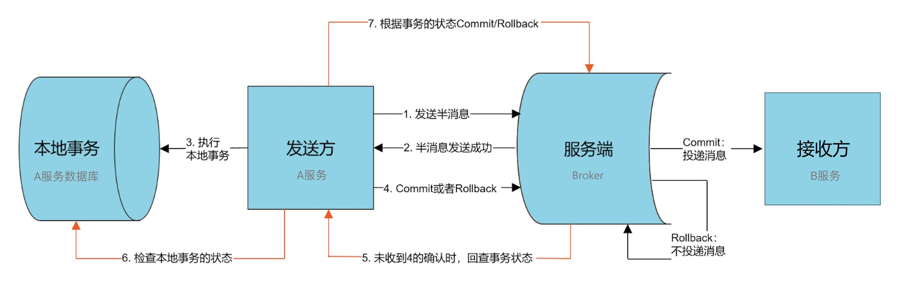
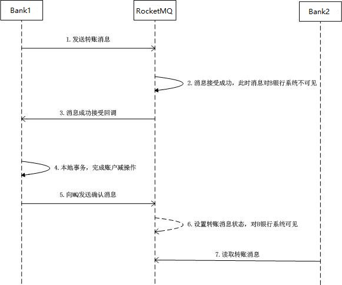
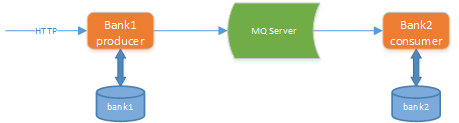

# RocketMQ - 可靠消息最终一致性事务解决方案

## 1. RocketMQ 事务消息方案概述

RocketMQ 是一个来自阿里巴巴的分布式消息中间件，于 2012 年开源，并在 2017 年正式成为 Apache 顶级项目。据了解，包括阿里云上的消息产品以及收购的子公司在内，阿里集团的消息产品全线都运行在 RocketMQ 之上，并且最近几年的双十一大促中，RocketMQ 都有抢眼表现。Apache RocketMQ 4.3之后的版本正式支持事务消息，为分布式事务实现提供了便利性支持。

RocketMQ 事务消息设计则主要是为了解决 Producer 端的消息发送与本地事务执行的原子性问题，RocketMQ 的设计中 broker 与 producer 端的双向通信能力，使得 broker 天生可以作为一个事务协调者存在；而 RocketMQ 本身提供的存储机制为事务消息提供了持久化能力；RocketMQ 的高可用机制以及可靠消息设计则为事务消息在系统发生异常时依然能够保证达成事务的最终一致性。

在 RocketMQ 4.3 后实现了完整的事务消息，实际上其实是对本地消息表的一个封装，将本地消息表移动到了 MQ 内部，解决 Producer 端的消息发送与本地事务执行的原子性问题。

### 1.1. 事务消息执行流程图



事务消息执行流程如下：

1. 发送方发送一个事务消息给 Broker，RocketMQ 会将消息状态标记为“Prepared”（预备状态），此时这条消息暂时不能被接收方消费。这样的消息称之为 Half Message，即半消息。
2. Broker 返回发送成功给发送方
3. 发送方执行本地事务(例如，操作数据库)，Producer 端执行业务代码逻辑，通过本地数据库事务控制。
4. 若本地事务执行成功，发送 commit 消息给 Broker，RocketMQ 会将消息状态标记为“可消费”，此时这条消息就可以被接收方消费；若本地事务执行失败，发送 rollback 消息给 Broker，RocketMQ 将删除该消息。
5. 如果发送方在本地事务过程中，出现服务挂掉，网络闪断或者超时，那 Broker 将无法收到确认结果。此时 RocketMQ 将会不停的询问发送方来获取本地事务的执行状态，这个过程叫**事务回查**。
6. 发送方会检查本地的事务状态
7. Broker 会根据事务回查的结果来决定 Commit 或 Rollback，这样就保证了消息发送与本地事务同时成功或同时失败。

### 1.2. RocketMQ 本地事务执行与回查实现

以上主干流程已由 RocketMQ 实现，对用户侧来说，用户只需分别实现本地事务执行以及本地事务回查方法，因此只需关注本地事务的执行状态即可。

RoacketMQ 提供 `RocketMQLocalTransactionListener` 接口：

```java
public interface RocketMQLocalTransactionListener {

    /**
     * 发送prepare消息成功此方法被回调，该方法用于执行本地事务
     *
     * @param msg 回传的消息，利用transactionId即可获取到该消息的唯一Id
     * @param arg 调用send方法时传递的参数，当send时候若有额外的参数可以传递到send方法中，这里能获取到
     * @return 返回事务状态，COMMIT：提交 ROLLBACK：回滚 UNKNOW：回调
     */
    RocketMQLocalTransactionState executeLocalTransaction(final Message msg, final Object arg);

    /**
     * 用于本地事务状态回查
     *
     * @param msg 通过获取 transactionId 来判断这条消息的本地事务执行状态
     * @return 返回事务状态，COMMIT：提交 ROLLBACK：回滚 UNKNOW：回调
     */
    RocketMQLocalTransactionState checkLocalTransaction(final Message msg);
}
```

### 1.3. RocketMQ 用于发送事务消息的 API

```java
TransactionMQProducer producer = new TransactionMQProducer("ProducerGroup");
producer.setNamesrvAddr("127.0.0.1:9876");
producer.start();
// 设置TransactionListener实现
producer.setTransactionListener(transactionListener);
// 发送事务消息
SendResult sendResult = producer.sendMessageInTransaction(msg, null);
```

## 2. RocketMQ 事务消息快速入门

### 2.1. 案例业务说明

本实例通过 RocketMQ 可靠消息实现最终一致性，模拟两个账户的转账交易过程。两个账户分别在不同的银行(张三在bank1、李四在bank2)，bank1、bank2是两个相互独立的微服务。交易过程是，张三给李四转账指定金额。

上述交易步骤，张三扣减金额与给bank2发转账消息，两个操作必须是一个整体性的事务。



本示例程序技术架构如下：



交互流程如下：

1. Bank1 向 MQ Server 发送转账消息
2. Bank1 执行本地事务，扣减金额
3. Bank2 接收消息，执行本地事务，添加金额

### 2.2. 环境搭建

#### 2.2.1. 环境要求

- 数据库：MySQL 5.7.25
    - 两个数据库：bank1和bank2
- JDK：64位 JDK 1.8.0_311
- rocketmq 服务端：RocketMQ-4.9.2
- rocketmq 客户端：RocketMQ-Spring-Boot-starter 2.0.2
- 微服务框架：spring-boot-2.1.3.RELEASE、spring-cloud-Greenwich.RELEASE
- 微服务及数据库的关系 ：
    - ensure-message-demo-bank1 服务，操作张三账户，连接数据库bank1
    - ensure-message-demo-bank2 服务，操作李四账户，连接数据库bank2

#### 2.2.2. 数据库

执行以下脚本，创建测试数据库、表与测试数据

```sql
-- 创建 bank1 库，并导入以下表结构和数据：
DROP DATABASE IF EXISTS `bank1`;
CREATE DATABASE `bank1` CHARACTER SET 'utf8' COLLATE 'utf8_general_ci';

USE bank1;
DROP TABLE IF EXISTS `account_info`;
CREATE TABLE `account_info`  (
  `id` bigint(20) NOT NULL AUTO_INCREMENT,
  `account_name` varchar(100) CHARACTER SET utf8 COLLATE utf8_bin NULL DEFAULT NULL COMMENT '户主姓名',
  `account_no` varchar(100) CHARACTER SET utf8 COLLATE utf8_bin NULL DEFAULT NULL COMMENT '银行卡号',
  `account_password` varchar(100) CHARACTER SET utf8 COLLATE utf8_bin NULL DEFAULT NULL COMMENT '帐户密码',
  `account_balance` double NULL DEFAULT NULL COMMENT '帐户余额',
  PRIMARY KEY (`id`) USING BTREE
) ENGINE = InnoDB AUTO_INCREMENT = 5 CHARACTER SET = utf8 COLLATE = utf8_bin ROW_FORMAT = Dynamic;

INSERT INTO `account_info` VALUES (1, '张三', '1', '', 10000);

DROP TABLE IF EXISTS `de_duplication`;
CREATE TABLE `de_duplication`  (
  `tx_no` bigint(20) NOT NULL,
  `create_time` datetime(0) NULL DEFAULT NULL,
  PRIMARY KEY (`tx_no`) USING BTREE
) ENGINE = InnoDB CHARACTER SET = utf8 COLLATE = utf8_bin ROW_FORMAT = Dynamic;

-- 创建bank2库，并导入以下表结构和数据：
DROP DATABASE IF EXISTS `bank2`;
CREATE DATABASE `bank2` CHARACTER SET 'utf8' COLLATE 'utf8_general_ci';

USE bank2;
DROP TABLE IF EXISTS `account_info`;
CREATE TABLE `account_info`  (
  `id` bigint(20) NOT NULL AUTO_INCREMENT,
  `account_name` varchar(100) CHARACTER SET utf8 COLLATE utf8_bin NULL DEFAULT NULL COMMENT '户主姓名',
  `account_no` varchar(100) CHARACTER SET utf8 COLLATE utf8_bin NULL DEFAULT NULL COMMENT '银行卡号',
  `account_password` varchar(100) CHARACTER SET utf8 COLLATE utf8_bin NULL DEFAULT NULL COMMENT '帐户密码',
  `account_balance` double NULL DEFAULT NULL COMMENT '帐户余额',
  PRIMARY KEY (`id`) USING BTREE
) ENGINE = InnoDB AUTO_INCREMENT = 5 CHARACTER SET = utf8 COLLATE = utf8_bin ROW_FORMAT = Dynamic;
INSERT INTO `account_info` VALUES (2, '李四', '2', NULL, 0);

DROP TABLE IF EXISTS `de_duplication`;
CREATE TABLE `de_duplication`  (
  `tx_no` bigint(20) NOT NULL,
  `create_time` datetime(0) NULL DEFAULT NULL,
  PRIMARY KEY (`tx_no`) USING BTREE
) ENGINE = InnoDB CHARACTER SET = utf8 COLLATE = utf8_bin ROW_FORMAT = Dynamic;
```

> 注：其中 de_duplication 交易记录表(去重表)，即是用于实现幂等性

#### 2.2.3. 启动 RocketMQ

> RocketMQ 详细教程详见[《分布式消息中件间 RocketMQ》笔记](/07-分布式架构&微服务架构/07-分布式消息中件间/04-RocketMQ)

到官网下载 RocketMQ 到本地并配置，到安装目录的 bin 文件中执行下面命令启动 RocketMQ

```bash
start mqnamesrv.cmd
start mqbroker.cmd -n 127.0.0.1:9876 autoCreateTopicEnable=true
```

启动 RocketMQ 图形化管理后台

```bash
java -jar rocketmq-console-ng-1.0.0.jar --server.port=7777 --rocketmq.config.namesrvAddr=127.0.0.1:9876
```

### 2.3. 创建 Maven 示例工程

#### 2.3.1. 聚合工程

- 创建 pom 聚合工程 ensure-message-demo，进行依赖管理

```xml
<?xml version="1.0" encoding="UTF-8"?>
<project xmlns="http://maven.apache.org/POM/4.0.0"
         xmlns:xsi="http://www.w3.org/2001/XMLSchema-instance"
         xsi:schemaLocation="http://maven.apache.org/POM/4.0.0 http://maven.apache.org/xsd/maven-4.0.0.xsd">

    <modelVersion>4.0.0</modelVersion>
    <groupId>com.moon</groupId>
    <artifactId>ensure-message-demo</artifactId>
    <version>1.0-SNAPSHOT</version>
    <packaging>pom</packaging>
    <name>${project.artifactId}</name>
    <description>RocketMQ 实现可靠消息最终一致性的分布式事务解决方案基础示例</description>

    <modules>
        <module>ensure-message-demo-bank1</module>
        <module>ensure-message-demo-bank2</module>
    </modules>

    <properties>
        <project.build.sourceEncoding>UTF-8</project.build.sourceEncoding>
        <project.reporting.outputEncoding>UTF-8</project.reporting.outputEncoding>
        <java.version>1.8</java.version>
    </properties>

    <dependencyManagement>
        <dependencies>
            <dependency>
                <groupId>org.projectlombok</groupId>
                <artifactId>lombok</artifactId>
                <version>1.18.0</version>
            </dependency>

            <dependency>
                <groupId>javax.servlet</groupId>
                <artifactId>javax.servlet-api</artifactId>
                <version>3.1.0</version>
                <scope>provided</scope>
            </dependency>

            <dependency>
                <groupId>javax.interceptor</groupId>
                <artifactId>javax.interceptor-api</artifactId>
                <version>1.2</version>
            </dependency>

            <dependency>
                <groupId>mysql</groupId>
                <artifactId>mysql-connector-java</artifactId>
                <version>5.1.47</version>
            </dependency>

            <dependency>
                <groupId>org.mybatis.spring.boot</groupId>
                <artifactId>mybatis-spring-boot-starter</artifactId>
                <version>2.0.0</version>
            </dependency>

            <dependency>
                <groupId>com.alibaba</groupId>
                <artifactId>druid-spring-boot-starter</artifactId>
                <version>1.1.16</version>
            </dependency>

            <dependency>
                <groupId>org.apache.rocketmq</groupId>
                <artifactId>rocketmq-spring-boot-starter</artifactId>
                <version>2.0.2</version>
            </dependency>

            <dependency>
                <groupId>commons-lang</groupId>
                <artifactId>commons-lang</artifactId>
                <version>2.6</version>
            </dependency>

            <dependency>
                <groupId>org.springframework.cloud</groupId>
                <artifactId>spring-cloud-dependencies</artifactId>
                <version>Greenwich.RELEASE</version>
                <type>pom</type>
                <scope>import</scope>
            </dependency>

            <dependency>
                <groupId>org.springframework.boot</groupId>
                <artifactId>spring-boot-dependencies</artifactId>
                <version>2.1.3.RELEASE</version>
                <type>pom</type>
                <scope>import</scope>
            </dependency>
        </dependencies>
    </dependencyManagement>

    <build>
        <finalName>${project.name}</finalName>
        <resources>
            <resource>
                <directory>src/main/resources</directory>
                <filtering>true</filtering>
                <includes>
                    <include>**/*</include>
                </includes>
            </resource>
            <resource>
                <directory>src/main/java</directory>
                <includes>
                    <include>**/*.xml</include>
                </includes>
            </resource>
        </resources>
        <plugins>
            <plugin>
                <groupId>org.springframework.boot</groupId>
                <artifactId>spring-boot-maven-plugin</artifactId>
            </plugin>

            <plugin>
                <groupId>org.apache.maven.plugins</groupId>
                <artifactId>maven-compiler-plugin</artifactId>
                <configuration>
                    <source>1.8</source>
                    <target>1.8</target>
                </configuration>
            </plugin>

            <plugin>
                <artifactId>maven-resources-plugin</artifactId>
                <configuration>
                    <encoding>utf-8</encoding>
                    <useDefaultDelimiters>true</useDefaultDelimiters>
                </configuration>
            </plugin>
        </plugins>
    </build>
</project>
```

#### 2.3.2. 创建微服务

- 创建 ensure-message-demo-bank1 工程，负责张三账户操作；创建 ensure-message-demo-bank2 工程，负责李四账户操作。同样引入以下依赖：

```xml
<dependencies>
    <dependency>
        <groupId>org.springframework.boot</groupId>
        <artifactId>spring-boot-starter-web</artifactId>
    </dependency>

    <dependency>
        <groupId>org.springframework.boot</groupId>
        <artifactId>spring-boot-starter-actuator</artifactId>
    </dependency>

    <dependency>
        <groupId>org.springframework.boot</groupId>
        <artifactId>spring-boot-configuration-processor</artifactId>
        <optional>true</optional>
    </dependency>

    <dependency>
        <groupId>org.mybatis.spring.boot</groupId>
        <artifactId>mybatis-spring-boot-starter</artifactId>
    </dependency>

    <dependency>
        <groupId>com.alibaba</groupId>
        <artifactId>druid-spring-boot-starter</artifactId>
    </dependency>

    <dependency>
        <groupId>mysql</groupId>
        <artifactId>mysql-connector-java</artifactId>
    </dependency>

    <dependency>
        <groupId>javax.interceptor</groupId>
        <artifactId>javax.interceptor-api</artifactId>
    </dependency>

    <dependency>
        <groupId>org.projectlombok</groupId>
        <artifactId>lombok</artifactId>
    </dependency>

    <dependency>
        <groupId>org.apache.rocketmq</groupId>
        <artifactId>rocketmq-spring-boot-starter</artifactId>
    </dependency>
</dependencies>
```

### 2.4. 案例功能实现

此部分两个微服务工程的具体实现

#### 2.4.1. ensure-message-demo-bank1 消息发送方工程

##### 2.4.1.1. 项目配置文件

- 项目配置 application.properties

```properties
spring.application.name=ensure-message-demo-bank1

server.port=56081
server.servlet.context-path=/bank1
spring.http.encoding.enabled=true
spring.http.encoding.charset=UTF-8
spring.mvc.throw-exception-if-no-handler-found=true

spring.datasource.type=com.alibaba.druid.pool.DruidDataSource
spring.datasource.driver-class-name=com.mysql.jdbc.Driver
spring.datasource.url=jdbc:mysql://localhost:3306/bank1?useUnicode=true&useSSL=false
spring.datasource.username=root
spring.datasource.password=123456

rocketmq.producer.group=producer_ensure_bank1
rocketmq.name-server=127.0.0.1:9876
```

##### 2.4.1.2. 实体类

- 定义封装转账消息的实体类

```java
@Data
@AllArgsConstructor
@NoArgsConstructor
public class AccountChangeEvent implements Serializable {
    private static final long serialVersionUID = 7726052118200407735L;
    /**
     * 账号
     */
    private String accountNo;
    /**
     * 变动金额
     */
    private double amount;
    /**
     * 事务号，时间戳
     */
    private long txNo;
}
```

##### 2.4.1.3. 持久层相关接口

创建持久层接口，定义扣减账户余额、查询账户信息、查询事务记录、保存事务记录等4个方法

```java
@Mapper
@Component
public interface AccountInfoDao {
    /**
     * 扣减某账号的余额
     *
     * @param accountNo 账号
     * @param amount    变动金额
     * @return
     */
    @Update("update account_info set account_balance=account_balance-#{amount} where account_no=#{accountNo}")
    int subtractAccountBalance(@Param("accountNo") String accountNo, @Param("amount") Double amount);


    /**
     * 查询某账号信息
     *
     * @param accountNo 账号
     * @return
     */
    @Select("select * from account_info where where account_no=#{accountNo}")
    AccountInfo findByIdAccountNo(@Param("accountNo") String accountNo);

    /**
     * 查询某事务记录是否已执行
     *
     * @param txNo 事务编号
     * @return
     */
    @Select("select count(1) from de_duplication where tx_no = #{txNo}")
    int isExistTx(long txNo);

    /**
     * 保存某事务执行记录
     *
     * @param txNo 事务编号
     * @return
     */
    @Insert("insert into de_duplication values(#{txNo},now());")
    int addTx(long txNo);
}
```

##### 2.4.1.4. 实现发送转账消息

封装 RocketMQ 发送消息处理类，定义通过 `RocketMQTemplate` 发送转账消息的方法

```java
@Component
public class BankMessageProducer {
    @Resource
    private RocketMQTemplate rocketMQTemplate;

    public void sendAccountChangeEvent(AccountChangeEvent accountChangeEvent) {
        // 构造消息
        JSONObject jsonObject = new JSONObject();
        jsonObject.put("accountChange", accountChangeEvent);
        // 转成 json 字符串
        Message<String> msg = MessageBuilder.withPayload(jsonObject.toJSONString()).build();

        // 发送消息
        rocketMQTemplate.sendMessageInTransaction("producer_ensure_transfer", "topic_ensure_transfer", msg, null);
    }
}
```

##### 2.4.1.5. 业务层接口与实现

业务层接口，分别定义发送事务消息(`sendUpdateAccountBalanceMsg`)与本地事务扣减金额(`doUpdateAccountBalance`)方法

```java
public interface AccountInfoService {

    /**
     * 更新帐号余额-发送消息
     *
     * @param accountChange
     */
    void sendUpdateAccountBalanceMsg(AccountChangeEvent accountChange);

    /**
     * 更新帐号余额-本地事务
     *
     * @param accountChange
     */
    void doUpdateAccountBalance(AccountChangeEvent accountChange);
}
```

业务实现类。注意：`doUpdateAccountBalance` 方法中的本地事务若执行成功，就会在交易记录去重表（de_duplication）保存一条数据。

```java
@Service
public class AccountInfoServiceImpl implements AccountInfoService {

    @Autowired
    private BankMessageProducer bankMessageProducer;

    @Autowired
    private AccountInfoDao accountInfoDao;

    /**
     * 更新帐号余额-发送消息
     *
     * @param accountChange
     */
    @Override
    public void sendUpdateAccountBalanceMsg(AccountChangeEvent accountChange) {
        bankMessageProducer.sendAccountChangeEvent(accountChange);
    }

    /**
     * 更新帐号余额-本地事务
     *
     * @param accountChange
     */
    @Override
    @Transactional(isolation = Isolation.SERIALIZABLE)
    public void doUpdateAccountBalance(AccountChangeEvent accountChange) {
        // 扣减余额
        accountInfoDao.subtractAccountBalance(accountChange.getAccountNo(), accountChange.getAmount());
        // 新增交易记录（与扣减余额操作在同一个事务中）
        accountInfoDao.addTx(accountChange.getTxNo());
    }
}
```

##### 2.4.1.6. RocketMQ 事务消息监听器

创建 RocketMQ 事务消息监听器，需要实现 `org.apache.rocketmq.spring.core.RocketMQLocalTransactionListener` 接口，并在类上标识 `@RocketMQTransactionListener` 注解，其中 `txProducerGroup` 属性是用于指定监听的消息分组名称

实现接口中的方法，功能分别是：

- `executeLocalTransaction`：该方法执行本地事务，会在发送半消息后，被 RocketMQ 自动调用
- `checkLocalTransaction`：该方法实现事务回查，利用了交易记录去重表（de_duplication），会在无法收到确认消息时，被 RocketMQ 自动调用


```java
@Component
@Slf4j
@RocketMQTransactionListener(txProducerGroup = "producer_ensure_transfer")
public class TransferTransactionListenerImpl implements RocketMQLocalTransactionListener {

    @Autowired
    private AccountInfoService accountInfoService;

    @Autowired
    private AccountInfoDao accountInfoDao;

    /**
     * 执行本地事务
     *
     * @param msg
     * @param arg
     * @return
     */
    @Override
    public RocketMQLocalTransactionState executeLocalTransaction(Message msg, Object arg) {
        // 1.接收并解析消息
        final JSONObject jsonObject = JSON.parseObject(new String((byte[]) msg.getPayload()));
        AccountChangeEvent accountChangeEvent = JSONObject
                .parseObject(jsonObject.getString("accountChange"), AccountChangeEvent.class);

        try {
            // 2.执行本地事务
            accountInfoService.doUpdateAccountBalance(accountChangeEvent);
            // 3.返回执行结果
            return RocketMQLocalTransactionState.COMMIT;
        } catch (Exception e) {
            return RocketMQLocalTransactionState.ROLLBACK;
        }
    }


    /**
     * 执行事务回查
     *
     * @param msg
     * @return
     */
    @Override
    public RocketMQLocalTransactionState checkLocalTransaction(Message msg) {
        log.info("TransferTransactionListenerImpl 执行事务回查");
        // 1.接收并解析消息
        final JSONObject jsonObject = JSON.parseObject(new String((byte[]) msg.getPayload()));
        AccountChangeEvent accountChangeEvent = JSONObject
                .parseObject(jsonObject.getString("accountChange"), AccountChangeEvent.class);

        // 2.查询de_duplication表
        int isExistTx = accountInfoDao.isExistTx(accountChangeEvent.getTxNo());

        // 3.根据查询结果返回值。（交易记录表存在记录，则说明本地事务成功）
        return isExistTx > 0 ? RocketMQLocalTransactionState.COMMIT : RocketMQLocalTransactionState.ROLLBACK;
    }
}
```

##### 2.4.1.7. 控制层

定义请求控制层方法，发送事务消息

```java
@RestController
public class AccountInfoController {

    @Autowired
    private AccountInfoService accountInfoService;

    @GetMapping("/transfer")
    public String transfer() {
        accountInfoService.sendUpdateAccountBalanceMsg(new AccountChangeEvent("1", 100, System.currentTimeMillis()));
        return "转账成功";
    }
}
```

#### 2.4.2. ensure-message-demo-bank2 消息接收方工程

##### 2.4.2.1. 项目配置文件

- 项目配置 application.properties

```properties
spring.application.name=ensure-message-demo-bank2

server.port=56082
server.servlet.context-path=/bank2
spring.http.encoding.enabled=true
spring.http.encoding.charset=UTF-8
spring.mvc.throw-exception-if-no-handler-found=true

spring.datasource.type=com.alibaba.druid.pool.DruidDataSource
spring.datasource.driver-class-name=com.mysql.jdbc.Driver
spring.datasource.url=jdbc:mysql://localhost:3306/bank2?useUnicode=true&useSSL=false
spring.datasource.username=root
spring.datasource.password=123456

rocketmq.producer.group=producer_ensure_bank2
rocketmq.name-server=127.0.0.1:9876
```

##### 2.4.2.2. 持久层与实体类

持久层接口、数据库表实体、消息实体均与 ensure-message-demo-bank1 工程几乎一样，只修改了增加账户余额方法名称与sql

```java
@Update("update account_info set account_balance=account_balance+#{amount} where account_no=#{accountNo}")
int addAccountBalance(@Param("accountNo") String accountNo, @Param("amount") Double amount);
```

##### 2.4.2.3. 业务层接口与实现

业务层接口定义增加账户余额方法

```java
public interface AccountInfoService {
    /**
     * 更新帐号余额
     *
     * @param accountChange
     */
    void updateAccountBalance(AccountChangeEvent accountChange);
}
```

值得注意的是：在实现类方法中使用交易记录去重表（de_duplication）来实现幂等性控制


```java
@Service
@Slf4j
public class AccountInfoServiceImpl implements AccountInfoService {

    @Autowired
    private AccountInfoDao accountInfoDao;

    @Override
    @Transactional(isolation = Isolation.SERIALIZABLE)
    public void updateAccountBalance(AccountChangeEvent accountChange) {
        log.info("bank2 工程 AccountInfoServiceImpl 执行本地事务");
        int isExistsTx = accountInfoDao.isExistTx(accountChange.getTxNo());
        if (isExistsTx == 0) {
            // 当交易记录表没有记录，才新增
            accountInfoDao.addAccountBalance(accountChange.getAccountNo(), accountChange.getAmount());
            accountInfoDao.addTx(accountChange.getTxNo());
        }
    }
}
```

##### 2.4.2.4. RocketMQ 事务消息监听器

创建消费 RocketMQ 事务消息监听器，需要实现 `org.apache.rocketmq.spring.core.RocketMQListener<T>` 接口，泛型 T 是消息的数据类型。在类上标识 `@RocketMQMessageListener` 注解，`topic` 属性指定消息的主题；`consumerGroup` 属性指定消息的分组

```java
@Component
@Slf4j
@RocketMQMessageListener(topic = "topic_ensure_transfer", consumerGroup = "consumer_ensure_transfer")
public class EnsureMessageConsumer implements RocketMQListener<String> {

    @Autowired
    private AccountInfoService accountInfoService;

    @Override
    public void onMessage(String message) {
        log.info("EnsureMessageConsumer 消费消息：{}", message);
        // 1.解析消息
        final JSONObject jsonObject = JSON.parseObject(message);
        AccountChangeEvent accountChangeEvent = JSONObject
                .parseObject(jsonObject.getString("accountChange"), AccountChangeEvent.class);
        // 2.执行本地事务
        accountChangeEvent.setAccountNo("2");
        accountInfoService.updateAccountBalance(accountChangeEvent);
    }
}
```

### 2.5. 功能测试

- bank1 和 bank2 都成功
- bank1 执行本地事务失败，则 bank2 接收不到转账消息。（在`AccountInfoServiceImpl.doUpdateAccountBalance`方法中模拟异常）
- bank1 执行完本地事务后，不返回任何信息，则 Broker 会进行事务回查。（在`TransferTransactionListenerImpl.executeLocalTransaction`方法返回结果前模拟异常）
- bank2 执行本地事务失败，会进行重试消费。（在 bank2 工程 `AccountInfoServiceImpl.updateAccountBalance`方法中模拟异常）

## 3. 总结

可靠消息最终一致性就是保证消息从生产方经过消息中间件传递到消费方的一致性，本案例使用了 RocketMQ 作为消息中间件，RocketMQ 主要解决了两个功能：

1. 本地事务与消息发送的原子性问题。
2. 事务参与方接收消息的可靠性。

可靠消息最终一致性事务适合执行周期长且实时性要求不高的场景。引入消息机制后，同步的事务操作变为基于消息执行的异步操作，避免了分布式事务中的同步阻塞操作的影响，并实现了两个服务的解耦。
