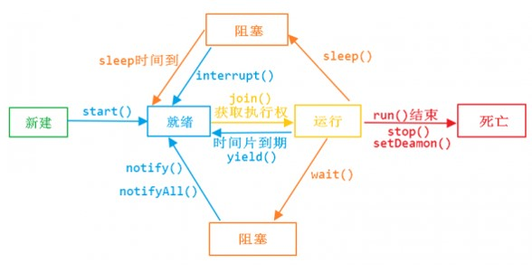
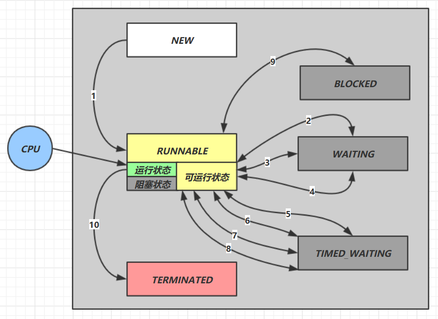
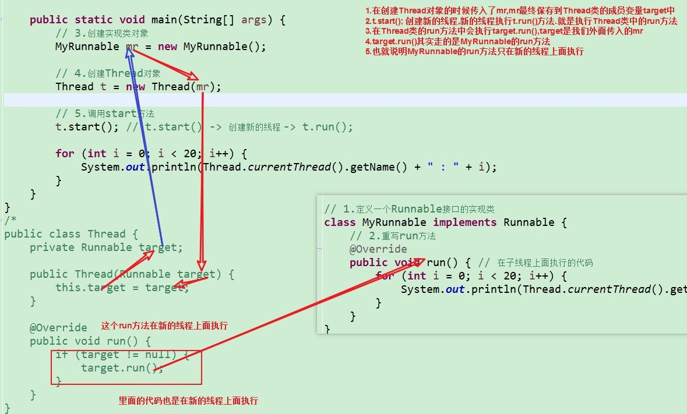

# Java 多线程

## 1. 进程与线程

### 1.1. 进程

- 程序由指令和数据组成，但这些指令要运行，数据要读写，就必须将指令加载至 CPU，数据加载至内存。在指令运行过程中还需要用到磁盘、网络等设备。进程就是用来加载指令、管理内存、管理 IO 的
- **进程是程序运行资源分配的最小单位**。其中资源包括：CPU、内存空间、磁盘 IO 等。
- 正在运行中的程序就是一个进程。确切的来说，当一个程序进入内存运行，即是一个或多个进程在运行，具有一定独立功能。进程也可以视为程序的一个实例。大部分程序可以同时运行多个实例进程（*例如记事本、画图、浏览器等*），也有的程序只能启动一个实例进程（*例如网易云音乐、杀毒软件等*）

### 1.2. 线程

- **线程是 CPU 调度的最小单位, 必须依赖于进程而存在**。在 windows 中进程是不活动的，只是作为线程的容器。
- **线程是进程中的一个独立的执行执行路径，线程就是来执行程序的代码**，负责当前进程中程序的执行，一个进程中至少有一个线程。一个进程中是可以有多个线程的，这个应用程序也可以称之为多线程程序。
- 一个线程就是一个指令流，将指令流中的一条条指令以一定的顺序交给 CPU 执行。

### 1.3. 线程和进程的作用与区别

**总结：一个程序运行后至少有一个进程，一个进程中可以包含多个线程。**

- 进程：用来封装线程，并为线程分配资源。
- 线程：用来执行代码。

两者的区别：

- 进程基本上相互独立的，而线程存在于进程内，是进程的一个子集
- 进程拥有共享的资源，如内存空间等，供其内部的线程共享
- 进程间的通信、线程间的通信
    - 进程间通信较为复杂。同一台计算机的进程通信称为 IPC（Inter-process communication）；不同计算机之间的进程通信，需要通过网络，并遵守共同的协议，例如 HTTP
    - 线程间通信相对简单，因为它们共享进程内的内存。比如，多个线程可以访问同一个共享变量
- 线程更轻量，线程上下文切换成本一般上要比进程上下文切换低

### 1.4. 线程运行的原理

#### 1.4.1. 栈与栈帧

Java Virtual Machine Stacks （Java 虚拟机栈）。 JVM 中由堆、栈、方法区所组成，而在每个线程启动后，虚拟机就为其分配一块栈内存。

- 每个栈由多个栈帧（Frame）组成，对应着每次方法调用时所占用的内存
- 每个线程只能有一个活动栈帧，对应着当前正在执行的那个方法

#### 1.4.2. 线程上下文切换

线程上下文切换（Thread Context Switch）是指，cpu 不再执行当前的线程，转而执行另一个线程的代码。出现 Context Switch 有如下原因：

- 线程的 cpu 时间片用完
- 垃圾回收
- 有更高优先级的线程需要运行
- 线程自己调用了 `sleep`、`yield`、`wait`、`join`、`park`、`synchronized`、`lock` 等方法

当 Context Switch 发生时，需要由操作系统保存当前线程的状态，并恢复另一个线程的状态，Java 中对应的概念就是程序计数器（Program Counter Register），它的作用是记住下一条 jvm 指令的执行地址，是线程私有的。

线程的状态包括程序计数器、虚拟机栈中每个栈帧的信息，如局部变量、操作数栈、返回地址等。Context Switch 频繁发生会影响性能！

## 2. 多线程概述

### 2.1. 线程的分类

- 单线程：程序中只有一条执行路径，同一时间只能做一件事情。
- 多线程：程序中有多条执行路径，同一时间可以做多件事。

### 2.2. 主线程和子线程

#### 2.2.1. 多线程程序

多线程程序，同时有多个线程在执行任务。**Java默认是一个多线程程序**。`Thread` 类是 `java.lang` 包下的一个常用类，每一个 `Thread` 类的对象，就代表一个处于某种状态的线程。异步是多线程的代名词：

- 如果不开多线程，按顺序执行的叫**同步**。
- 如果是多个线程开启，就是**异步**。

JVM虚拟机的启动是多线程的，原因是垃圾回收线程也要启动，否则很容易会出现内存溢出。现在的的垃圾回收线程加上前面的主线程，最低启动了两个线程，所以JVM的启动就是多线程的。

#### 2.2.2. 主线程

Java程序启动时自动创建并执行 `main` 方法的线程。

**主线程的执行路径**：从 `main` 开始直到 `main` 方法执行结束。

#### 2.2.3. 子线程

除了主线程以外的所有线程，都可以称为子线程。

**子线程的执行路径**：从 `run` 方法开始直到 `run` 方法执行结束。

### 2.3. 线程的运行模式

线程是由 CPU 负责调度执行的。CPU 同一时间只能处理一个线程。CPU 在多个线程之间快速切换，让我们感觉是多个线程在同时执行。

注：线程太多CPU要在很多线程间切换，会消耗CPU；线程的创建也是需要消耗资源(CPU和内存)

#### 2.3.1. 分时式模式

每一个线程平均分配CPU的使用权。（针对单核CPU）

#### 2.3.2. 抢占式模式

优先级高的线程高的抢到CPU的使用权的概率高。如果优先级相同，则多个线程一起去抢夺CPU的使用权（***只是概率高，不能保证优先执行。***）。Java的线程就是属于抢占式模式。

### 2.4. 多线程的随机性

- 在同一个线程中，代码是按顺序一行一行往下执行。
- 每一个线程都有自己独立的栈空间。
- 多个不同的线程的是交替执行，但执行的顺序不受控制

### 2.5. 使用多线程的场景

1. 同时做一些事情的时候
2. 将耗时操作放在子线程中

### 2.6. 多线程的优点和缺点

- 优点：**多线程并不能提高运行速度，提高了 CPU 的使用率，提高程序的运行效率**(执行效率)。
- 缺点：如果线程数量太多，分配给每一个线程的时间就少了。CPU来回在多个线程之间进行切换会导致线程执行效率低。

**注：如果多线程有安全问题的处理时，运算速度反而更低。**

### 2.7. 查看进程线程的方法

#### 2.7.1. windows

任务管理器可以查看进程和线程数，也可以用来杀死进程。也可以使用命令行：

查看系统进程

```bash
tasklist
```

杀死指定的进程

```bash
taskkill <PID>
```

#### 2.7.2. linux

查看系统所有进程

```bash
ps -fe
```

查看某个进程（PID）的所有线程

```bash
ps -fT -p <PID>
```

杀死进程

```bash
kill <PID>
```

按大写 H 切换是否显示线程

```bash
top
```

查看某个进程（PID）的所有线程

```bash
top -H -p <PID>
```

#### 2.7.3. Java 工具查看

命令查看所有 Java 进程

```bash
jps
```

查看某个 Java 进程（PID）的所有线程状态

```bash
jstack <PID>
```

jconsole 远程监控工具。是来查看某个 Java 进程中线程的运行情况（图形界面）。使用步骤如下：

1. 运行时需要配置java类

```bash
java -Djava.rmi.server.hostname=`ip地址` -Dcom.sun.management.jmxremote -Dcom.sun.management.jmxremote.port=`连接端口` -Dcom.sun.management.jmxremote.ssl=是否安全连接 - Dcom.sun.management.jmxremote.authenticate=是否认证 java类
```

2. 修改 `/etc/hosts` 文件将 `127.0.0.1` 映射至主机名（非必需，如不是连接本地则不需要）
3. 如开启认证访问，则需做以下步骤
    1. 复制 jmxremote.password 文件
    2. 修改 jmxremote.password 和 jmxremote.access 文件的权限为 600 即文件所有者可读写
    3. 连接时填入 controlRole（用户名），R&D（密码）

### 2.8. 线程状态(线程的生命周期) - 重点

当线程被创建并启动以后，它既不是一启动就进入了执行状态，也不是一直处于执行状态。在线程的生命周期中，它要经过新建(New)、就绪（Runnable）、运行（Running）、阻塞(Blocked)和死亡(Dead)5 种状态。尤其是当线程启动以后，它不可能一直"霸占"着 CPU 独自运行，所以 CPU 需要在多条线程之间切换，于是线程状态也会多次在运行、阻塞之间切换

#### 2.8.1. 新建状态（New）

**当程序使用 `new` 关键字创建了一个线程之后**，还没有调用 `start` 方法前。该线程就处于新建状态，此时仅由 JVM 为其分配内存，并初始化其成员变量的值

#### 2.8.2. 就绪状态（Runnable）

**线程对象调用了 `start` 方法之后**，此时有执行资格，没有CPU执行权（等待CPU调度），该线程处于就绪状态。Java 虚拟机会为其创建方法调用栈和程序计数器，等待调度运行

#### 2.8.3. 运行状态（Running）

如果**处于就绪状态的线程获得了CPU，开始执行`run()`方法的线程执行体**，则该线程处于运行状态。即有执行资格，也有执行权（被CPU调度或抢到CPU）。***但如果CPU被其他线程抢走，该线程就回去就绪状态***。

#### 2.8.4. 阻塞状态（Blocked）

阻塞状态是指线程因为某种原因放弃了 cpu 使用权，也即让出了 cpu timeslice，暂时停止运行。直到线程进入可运行(runnable)状态，才有机会再次获得 cpu timeslice 转到运行(running)状态。***即线程没有执行资格，也没有执行权***。阻塞的情况分三种：

1. 等待阻塞（调用 `Object` 类的 `wait()` 方法 -> 等待对列）
    - 运行(running)的线程执行 `o.wait()` 方法，JVM 会把该线程放入等待队列(waitting queue)中。
2. 同步阻塞（lock -> 锁池）
    - 运行(running)的线程在获取对象的同步锁时，若该同步锁被别的线程占用，则 JVM 会把该线程放入锁池(lock pool)中。
3. 其他阻塞（调用 `Thread.sleep()`、`t.join()` 方法或 `Thread.yield()`方法）
    - 运行(running)的线程执行 `Thread.sleep(long ms)`或 `t.join()`方法，或者发出了 I/O 请求时，JVM 会把该线程置为阻塞状态。当 `sleep()`状态超时、`join()`等待线程终止或者超时、或者 I/O 处理完毕时，线程重新转入可运行(runnable)状态。
    - `yield()` 方法：使当前线程让出 CPU 占有权，但让出的时间是不可设定的，也不会释放锁资源。注意：并不是每个线程都需要这个锁的，而且执行 `yield()`的线程不一定就会持有锁，完全可以在释放锁后再调用 `yield` 方法。所有执行 `yield` 方法的线程有可能在进入到就绪状态后会被操作系统再次选中马上又被执行
    - `join()` 方法：把指定的线程加入到当前线程，可以将两个交替执行的线程合并为顺序执行。比如在线程 B 中调用了线程 A 的 `join()` 方法，直到线程 A 执行完毕后，才会继续执行线程 B

#### 2.8.5. 死亡状态（Dead）

线程会以下面三种方式结束，结束后就是死亡状态。

1. **线程自然终止**：`run()`或`call()`方法执行完成，线程正常结束。
2. **调用`stop()`方法**：直接调用该线程的`stop()`方法来结束该线程，**该方法通常容易导致死锁，不推荐使用**。

> 暂停、恢复和停止操作对应在线程 Thread 的 API 就是 `suspend()`、`resume()` 和 `stop()`，但这些方法都标识已经过期，不建议使用。以 `suspend()` 方法为例，在调用后，线程不会释放已经占有的资源（比如锁），而是占有着资源进入睡眠状态，这样容易引发死锁问题。同样，stop()方法在终结一个线程时不会保证线程的资源正常释放，通常是没有给予线程完成资源释放工作的机会，因此会导致程序可能工作在不确定状态下。正因为 `suspend()`、`resume()`和 `stop()` 方法带来的副作用，这些方法才被标注为不建议使用的过期方法。

3. **异常结束**：线程抛出一个未捕获的 Exception 或 Error。
4. **中断**
    - 安全的中止则是其他线程通过调用某个线程 A 的 `interrupt()` 方法对其进行中断操作, 中断好比其他线程对该线程打了个招呼，“A，你要中断了”，不代表线程 A 会立即停止自己的工作，同样的 A 线程完全可以不理会这种中断请求。因为 java 里的线程是协作式的，不是抢占式的。线程通过检查自身的中断标志位是否被置为 true 来进行响应
    - 线程通过方法 `isInterrupted()` 来进行判断是否被中断，也可以调用静态方法`Thread.interrupted()`来进行判断当前线程是否被中断，不过`Thread.interrupted()`会同时将中断标识位改写为 false。
    - 如果一个线程处于了阻塞状态（如线程调用了 thread.sleep、thread.join、thread.wait 等），则在线程在检查中断标示时如果发现中断标示为 true，则会在这些阻塞方法调用处抛出 InterruptedException 异常，并且在抛出异常后会立即将线程的中断标示位清除，即重新设置为 false。
    - 不建议自定义一个取消标志位来中止线程的运行。因为 run 方法里有阻塞调用时会无法很快检测到取消标志，线程必须从阻塞调用返回后，才会检查这个取消标志。这种情况下，使用中断会更好，因为
        1. 一般的阻塞方法，如 sleep 等本身就支持中断的检查，
        2. 检查中断位的状态和检查取消标志位没什么区别，用中断位的状态还可以避免声明取消标志位，减少资源的消耗。

> <font color=red>**注意 ：处于死锁状态的线程无法被中断**</font>

#### 2.8.6. 线程的生命周期图




### 2.9. Java API 定义的6种线程状态

根据 Java API 层面的 `Thread.State` 枚举，定义线程的6种状态



- `NEW` 线程刚被创建，但是还没有调用 `start()` 方法
- `RUNNABLE` 当调用了 `start()` 方法之后，注意，Java API 层面的 `RUNNABLE` 状态涵盖了操作系统层面的【可运行状态】、【运行状态】和【阻塞状态】（由于 BIO 导致的线程阻塞，在 Java 里无法区分，仍然认为是可运行）
- `BLOCKED`，`WAITING`，`TIMED_WAITING` 都是 Java API 层面对【阻塞状态】的细分，在不同的条件下，这些状态是可以进行转换
- `TERMINATED` 当线程代码运行结束

假设有线程 `Thread t`

#### 2.9.1. 情况 1 NEW --> RUNNABLE

当调用 `t.start()` 方法时，由 `NEW --> RUNNABLE`

#### 2.9.2. 情况 2 RUNNABLE <--> WAITING

t 线程用 `synchronized(obj)` 获取了对象锁后

- 调用 `obj.wait()` 方法时，t 线程从 `RUNNABLE --> WAITING`
- 调用 `obj.notify()`，`obj.notifyAll()`，`t.interrupt()` 时
    - 竞争锁成功，t 线程从 `WAITING --> RUNNABLE`
    - 竞争锁失败，t 线程从 `WAITING --> BLOCKED`

#### 2.9.3. 情况 3 RUNNABLE <--> WAITING

- 当前线程调用 `t.join()` 方法时，当前线程从 `RUNNABLE --> WAITING` 。注意是当前线程在 t 线程对象的监视器上等待
- t 线程运行结束，或调用了当前线程的 `interrupt()` 时，当前线程从 `WAITING --> RUNNABLE`

#### 2.9.4. 情况 4 RUNNABLE <--> WAITING

- 当前线程调用 `LockSupport.park()` 方法会让当前线程从 `RUNNABLE --> WAITING`
- 调用 `LockSupport.unpark(目标线程)` 或调用了线程 的 `interrupt()`，会让目标线程从 `WAITING --> RUNNABLE`

#### 2.9.5. 情况 5 RUNNABLE <--> TIMED_WAITING

t 线程用 `synchronized(obj)` 获取了对象锁后

- 调用 `obj.wait(long n)` 方法时，t 线程从 `RUNNABLE --> TIMED_WAITING`
- t 线程等待时间超过了 n 毫秒，或调用 `obj.notify()`，`obj.notifyAll()`，`t.interrupt()`时
    - 竞争锁成功，t 线程从 `TIMED_WAITING --> RUNNABLE`
    - 竞争锁失败，t 线程从 `TIMED_WAITING --> BLOCKED`

#### 2.9.6. 情况 6 RUNNABLE <--> TIMED_WAITING

- 当前线程调用 `t.join(long n)` 方法时，当前线程从 `RUNNABLE --> TIMED_WAITING`。注意是当前线程在t 线程对象的监视器上等待
- 当前线程等待时间超过了 n 毫秒，或 t 线程运行结束，或调用了当前线程的 `interrupt()` 时，当前线程从 `TIMED_WAITING --> RUNNABLE`

#### 2.9.7. 情况 7 RUNNABLE <--> TIMED_WAITING

- 当前线程调用 `Thread.sleep(long n)`，当前线程从 `RUNNABLE --> TIMED_WAITING`
- 当前线程等待时间超过了 n 毫秒，当前线程从 `TIMED_WAITING --> RUNNABLE`

#### 2.9.8. 情况 8 RUNNABLE <--> TIMED_WAITING

- 当前线程调用 `LockSupport.parkNanos(long nanos)` 或 `LockSupport.parkUntil(long millis)` 时，当前线程从 `RUNNABLE --> TIMED_WAITING`
- 调用 `LockSupport.unpark(目标线程)` 或调用了线程 的 `interrupt()`，或是等待超时，会让目标线程从 `TIMED_WAITING--> RUNNABLE`

#### 2.9.9. 情况 9 RUNNABLE <--> BLOCKED

- t 线程用 `synchronized(obj)` 获取了对象锁时如果竞争失败，从 `RUNNABLE --> BLOCKED`
- 持 obj 锁线程的同步代码块执行完毕，会唤醒该对象上所有 `BLOCKED` 的线程重新竞争，如果其中 t 线程竞争成功，从 `BLOCKED --> RUNNABLE`，其它失败的线程仍然 `BLOCKED`

#### 2.9.10. 情况 10 RUNNABLE <--> TERMINATED

- 当前线程所有代码运行完毕，进入 `TERMINATED`

## 3. CPU 执行程序相关知识

### 3.1. CPU 核心数和线程数的关系（了解）

- **多核心**：也指单芯片多处理器( Chip Multiprocessors，简称 CMP)，CMP 是由美国斯坦福大学提出的，其思想是将大规模并行处理器中的 SMP(对称多处理器)集成到同一芯片内，各个处理器并行执行不同的进程。这种依靠多个 CPU 同时并行地运行程序是实现超高速计算的一个重要方向，称为并行处理
- **多线程**：Simultaneous Multithreading.简称 SMT.让同一个处理器上的多个线程同步执行并共享处理器的执行资源。
- **核心数、线程数**：目前主流 CPU 都是多核的。增加核心数目就是为了增加线程数，因为操作系统是通过线程来执行任务的，一般情况下它们是 1:1 对应关系，也就是说四核 CPU 一般拥有四个线程。但 Intel 引入超线程技术后，使核心数与线程数形成 1:2 的关系

### 3.2. CPU 时间片轮转机制（了解）

时间片轮转调度是一种最古老、最简单、最公平且使用最广的算法,又称 RR 调度。每个进程被分配一个时间段，称作它的时间片，即该进程允许运行的时间。

如果在时间片结束时进程还在运行，则 CPU 将被剥夺并分配给另一个进程。如果进程在时间片结束前阻塞或结来，则 CPU 当即进行切换。调度程序所要做的就是维护一张就绪进程列表，当进程用完它的时间片后，它被移到队列的末尾

### 3.3. 并发与并行的区别

- 单核CPU下，线程实际还是**串行执行**的。操作系统中有一个组件叫做**任务调度器**，将 cpu 的时间片（windows 系统下时间片最小约为 15 毫秒）分给不同的程序使用，只是由于 cpu 在线程间（时间片很短）的切换非常快，人类感觉是同时运行的 。总结为一句话就是：**微观串行，宏观并行**。<font color=red>**一般会将这种线程轮流使用CPU的做法称为并发（concurrent）**</font>
- 多核CPU下，每个核（core）都可以调度运行线程，这时候线程可以是并行（parallel）的。

并发与并行总结：

- **并发（concurrent）**是同一时间应对（dealing with）多件事情的能力，能够交替执行不同的任务
- **并行（parallel）**是同一时间动手做（doing）多件事情的能力，同时执行不同的任务

**两者区别：一个是交替执行，一个是同时执行**

## 4. Java 创建与运行线程

### 4.1. 创建新执行线程有两种方式

- 一种方法是将类声明为 `Thread` 的子类。该子类应重写 `Thread` 类的 `run` 方法。接下来可以分配并启动该子类的实例。
- 另一种方法是声明实现 `Runnable` 接口的类。该类然后实现 `run` 方法。然后可以分配该类的实例，在创建 `Thread` 时作为一个参数来传递并启动。

> 在JDK Thread 类的源码注释中，There are two ways to create a new thread of execution. 即`Thread`类与`Runnable`接口

### 4.2. 创建线程方式一：继承 Thread 类

继承 `Thread` 类创建线程的步骤：

1. 定义一个子类MyThread继承Thread
2. 重写run方法，写入线程要执行的任务
3. 创建子类的对象`MyThread mt = new MyThread();`
4. 调用mt.start()方法，开启线程

**注意事项：一个线程多次调用start会出现java.lang.IllegalThreadStateException(线程状态异常)**

**为什么要重写run()方法？**不是类中所有代码都需要被线程执行。为了区分哪些代码能够被线程执行，java提供了Thread类中的run()方法用来包含那些被线程执行的代码。

**注：父类Thread有这个赋名称的构造方法 Thread(String name)，因为不能继承构造方法，所以要子类生成这个构造方法，调用父亲的构造方法**

### 4.3. 创建线程方式二：实现 Runnable 接口（常用）

#### 4.3.1. Runnable 接口作用

Runnable的run方法中放的是在子线程上面执行的代码

#### 4.3.2. 使用 Runnable 接口实现多线程的步骤

1. 定义 Runnable 接口的实现类；
2. 重写 run() 方法；
3. 创建实现类对象；
4. 创建 Thread 对象，Thread 类构造方法中传入 Runnable 实现类对象；
    - 使用类的 `public Thread(Runnable target)` 构造方法来完成
    - eg：`Thread mr = new Thread(new MyRunnable());`
5. 调用 mr.start() 方法

**注：可以使用匿名内部类来创建实现类对象（不需要创建接口的实现类，如果重写的run方法的代码不是很复杂的话。）**

```java
Runnable target = new Runnable(){
    // 重写 run() 方法
};
```

#### 4.3.3. Runnable 接口创建线程的原理



#### 4.3.4. Runnable 接口实现多线程的好处

1. **避免了Java类单继承的局限性**

- 继承Thread类方式不能再继承其他类
- 实现Runnable接口方式可以再继承其他类

2. **可以在多个线程之间共享**

不需要定义静态的成员变量做为同步锁对象，因为在实现Runnable接口方式中，只创建了一个Runnable的实现类对象。**直接以Runnable对象做为同步锁对象**即可。

3. **将线程和任务分离，降低了程序的耦合性**

- **耦合性** -> 依赖性: 耦合高，依赖高；耦合低，依赖低 (高内聚，低耦合)
- **继承 Thread 类方式**
	1. 子类负责写在子线程上面执行的代码
	2. 子类负责创建线程
- **实现 Runnable 接口方式**（降低了 Runnable实现类和Thread类的耦合性）
	1. Runnable实现类负责写在子线程上面执行的代码
	2. Thread类负责创建线程

### 4.4. 创建线程方式三：FutureTask

创建线程示例

```java
// 创建线程任务对象
FutureTask<String> futureTask = new FutureTask<>(() -> {
    System.out.println("Callable 的 call() 方法开始执行...");
    Thread.sleep(2000);
    // 返回结果
    return "FutureTask 的返回";
});

/*
 * 创建并开启线程
 *  参数1: 线程任务对象
 *  参数2: 线程名称
 */
System.out.println("创建并开启线程...");
new Thread(futureTask, "th1").start();
System.out.println("FutureTask#get()方法执行前...");

// 调用 FutureTask 的 get 方法获取执行完毕的结果。此时主线程会阻塞，等线程执行的结果返回
String result = futureTask.get();
System.out.println("FutureTask#get()方法执行后...");
System.out.println("result: " + result);
```

### 4.5. 匿名内部类实现多线程(了解)

- 定义匿名内部类继承Thread类或现实Rannable接口，重写run方法
- 3种情况：
    1. 创建Thread的子类对象
    2. 创建Runnable的实现类对象,传入Thread对象中
    3. 在创建Thread参数中创建Runnable的实现类对象

Code Demo:(3种匿名内部类创建线程的案例)

```java
/*
    匿名内部类:
    new 父类/接口() {
        // 重写方法
    }
*/
public class MoonZero {
    public static void main(String[] args) {
        // 1.创建Thread的子类对象
        new Thread() {
            @Override
            public void run() {
                System.out.println("创建Thread的子类对象, " + getName());
            }
        }.start();

        // 2.创建Runnable的实现类对象,传入Thread对象中
        Runnable run = new Runnable() {
            @Override
            public void run() {
                String name = Thread.currentThread().getName();
                System.out.println("创建Runnable的实现类对象,传入Thread对象中: " + name);
            }
        };
        Thread t = new Thread(run);
        t.start();
        // 直接再用Rannable实现类对象再创建一个Thread匿名对象，再开一个线程
        new Thread(run).start();

        // 3.在创建Thread参数中创建Runnable的实现类对象
        new Thread(new Runnable() {
            @Override
            public void run() {
                String name = Thread.currentThread().getName();
                System.out.println("在创建Thread参数中创建Runnable的实现类对象: " + name);
            }
        }).start();
    }
}
```

### 4.6. Thread 和 Runnable 的区别

- Thread 才是 Java 里对线程的唯一抽象
- Runnable 只是对任务（业务逻辑）的抽象
- Thread 可以接受任意一个 Runnable 的实例并执行

## 5. 线程的常用方法分析

### 5.1. Thread 类 start 方法和 run 方法的区别

**`run` 方法**

- 直接调用`run`方法，不会开启新的线程，是在当前线程中执行。
- `run` 方法仅仅是封装被线程执行业务代码，直接调用是普通方法。

**`start` 方法**

- 会开辟一个新的执行路径，在新的线程会执行对象的 `run` 方法。
- `start` 首先启动了线程，然后再由jvm去调用该线程的 `run` 方法。

**总结**：

1. `start` 方法来启动线程，真正实现了多线程运行。这时无需等待`run`方法体代码执行完毕，可以直接继续执行下面的代码。
2. 通过调用 `Thread` 类的 `start` 方法来启动一个线程，这时此线程是处于就绪状态，并没有运行。
3. 方法 `run` 称为线程体，它包含了要执行的这个线程的内容，线程就进入了运行状态，开始运行 `run` 函数当中的代码。`run` 方法运行结束，此线程终止。然后CPU再调度其它线程

### 5.2. sleep 和 wait 方法的区别

1. `sleep` 方法是 `Thread` 类的方法；`wait` 方法是 `Object` 类的方法
2. 调用 `sleep` 方法的过程中，线程不会释放锁对象。调用 `wait` 方法的时候，线程会释放锁对象
3. 调用 `sleep` 方法与 `wait` 方法都会释放CPU的使用权。
    - `sleep` 方法导致了程序暂停执行指定的时间，当指定的时间到了又会自动恢复运行状态。（在休眠的时间内，不能唤醒）
    - `wait` 方法导致此对象进行等待，不会进入锁定池，只有针对此对象调用 `notify` 方法被调用后，本线程才进入对象锁定池准备获取对象锁进入运行状态。（在等待的时间内，能唤醒）

### 5.3. sleep 与 yield 方法的区别

`sleep` 方法

- 调用 `sleep` 方法会让当前线程从 `Running` 状态进入 `Timed Waiting` 状态（阻塞）
- 其它线程可以使用 `interrupt` 方法打断正在睡眠的线程，这时 `sleep` 方法会抛出 `InterruptedException`
- 睡眠结束后的线程未必会立刻得到执行

`yield` 方法

- 调用 `yield` 方法会让当前线程从 `Running` 进入 `Runnable` 就绪状态，然后调度执行其它线程，但也有可能继续执行当前线程，最终由CPU调度决定。
- 具体的实现依赖于操作系统的任务调度器

### 5.4. 线程的优先级（很少用）

通过 `Thread` 类的 `setPriority` 可设置线程的优先级

- 优先级的作用：优先级高的线程，被CPU执行到的概率大一些
- 最高优先级 `MAX_PRIORITY = 10;`
- 最低优先级 `MIN_PRIORITY = 1;`
- 默认优先级 `NORM_PRIORITY = 5;`

在 Java 线程中，通过一个整型成员变量 priority 来控制优先级，优先级的范围从 1~10，在线程构建的时候可以通过 `setPriority(int)`方法来修改优先级，默认优先级是 5，优先级高的线程分配时间片的数量要多于优先级低的线程

设置线程优先级时，针对频繁阻塞（休眠或者 I/O 操作）的线程需要设置较高优先级，而偏重计算（需要较多 CPU 时间或者偏运算）的线程则设置较低的优先级，确保处理器不会被独占。在不同的 JVM 以及操作系统上，线程规划会存在差异，有些操作系统甚至会忽略对线程优先级的设定

线程优先级会提示（hint）调度器优先调度该线程，但它仅仅是一个提示，调度器可以忽略它。如果 cpu 比较忙，那么优先级高的线程会获得更多的时间片，但 cpu 闲时，优先级几乎没作用

### 5.5. interrupt 打断线程

如线程调用`sleep`、`wait`、`join`等方法，会让线程进入阻塞状态，都可使用 `interrupt` 打断线程。

- 打断 `sleep` 的线程，会清空打断状态

```java
logger.info("主线程开始....");
Thread t1 = new Thread(() -> {
    logger.info("t1 线程开始休眠2秒....");
    try {
        TimeUnit.SECONDS.sleep(2);
    } catch (InterruptedException e) {
        logger.info("t1 线程被打断....");
        e.printStackTrace();
    }
    logger.info("t1 线程结束....");
}, "t1");
t1.start();
Thread.sleep(1000);

// 调用 interrupt 方法，打断休眠中的线程
logger.info("t1 interrupt");
t1.interrupt();
Thread.sleep(200);
// 线程的打断标识会被清空
logger.info("t1 线程打断标识：{}", t1.isInterrupted()); // 输出结果：false
logger.info("主线程结束....");
```

- 打断正常运行的线程，不会清空打断状态

```java
logger.info("主线程开始....");
Thread t1 = new Thread(() -> {
    logger.info("t1 线程开始....");
    while (true) {
        // 获取当前线程的打断标识
        boolean interrupted = Thread.currentThread().isInterrupted();
        logger.info("t1 线程打断标识：{}", interrupted); // 打断后输出结果：true
        if (interrupted) {
            // 线程的打断标识不会被清空
            logger.info("t1 线程被中断了，退出循环....");
            break;
        }
    }
    logger.info("t1 线程结束....");
}, "t1");
t1.start();
Thread.sleep(50);

// 调用 interrupt 方法，打断正常运行的线程
logger.info("t1 interrupt");
t1.interrupt();
logger.info("主线程结束....");
```

- 打断 park 线程，不会清空打断状态

```java
logger.info("主线程开始....");
Thread t1 = new Thread(() -> {
    logger.info("LockSupport.park start....");
    LockSupport.park();
    logger.info("LockSupport.park end....");
    logger.info("t1 线程打断标识：{}", Thread.currentThread().isInterrupted()); // 输出结果：true
}, "t1");
t1.start();
Thread.sleep(1000);

// 调用 interrupt 方法，打断 park 的线程
logger.info("t1 interrupt");
t1.interrupt();
logger.info("主线程结束....");
```

### 5.6. 守护线程

默认情况下，Java 进程需要等待所有线程都运行结束，才会结束。

但有一种特殊的线程：Daemon（守护）线程，它是一种支持型线程，因为它主要被用作程序中后台调度以及支持性工作。这意味着，当一个 Java 虚拟机中其它非守护线程运行结束了，Java 虚拟机将会退出。即使守护线程的代码没有执行完，也会强制结束。可以通过调用 `Thread.setDaemon(true)` 将线程设置为 Daemon 线程，<font color=red>**值得注意是：该方法必须在启动线程前调用**</font>。

Daemon 线程被用作完成支持性工作，但是在 Java 虚拟机退出时 Daemon 线程中的 `finally` 块并不一定会执行。在构建 Daemon 线程时，不能依靠 finally 块中的内容来确保执行关闭或清理资源的逻辑。但守护线程一般用不上。

```java
logger.info("主线程开始....");
Thread t1 = new Thread(() -> {
    logger.info("t1 线程开始....");
    try {
        TimeUnit.SECONDS.sleep(2);
    } catch (InterruptedException e) {
        e.printStackTrace();
    }
    logger.info("t1 线程结束....");
}, "t1");

// 设置该线程为守护线程，当主线程结束时，假如该线程的代码还没有执行完，也会强制结束
t1.setDaemon(true);
t1.start();
Thread.sleep(1000);
logger.info("主线程结束....");
```

> 垃圾回收器线程就是一种守护线程
>
> Tomcat 中的 `Acceptor` 和 `Poller` 线程都是守护线程，所以 Tomcat 接收到 `shutdown` 命令后，不会等待它们处理完当前请求


### 5.7. 过时方法（不推荐使用）

有一些已过时的方法，并且不再推荐使用，容易破坏同步代码块，造成线程死锁

- `stop()`：停止线程运行
- `suspend()`：挂起（暂停）线程运行
- `resume()`：恢复线程运行

## 6. 线程池

### 6.1. 线程池简介

#### 6.1.1. 线程池的概念与原理

JDK 1.5 后的新特性。不再需要开发者自定义容器，直接使用官方提供的即可。一个用来创建和管理线程对象的容器。

线程池做的工作主要是控制运行的线程的数量，处理过程中将任务放入队列，然后在线程创建后启动这些任务，如果线程数量超过了最大数量**超出数量的线程排队等候**，等其它线程执行完毕，再从队列中取出任务来执行。他的主要特点为：**线程复用、控制最大并发数、管理线程**。

#### 6.1.2. 使用线程池的好处

保证了线程的复用，避免频繁创建和销毁线程对象会带来很大的系统开销，消耗CPU资源。线程池里面存放一些线程，保证线程不死掉，可以重复执行代码。

#### 6.1.3. 线程池的组成

一般的线程池主要分为以下 4 个组成部分：

1. 线程池管理器：用于创建并管理线程池
2. 工作线程：线程池中的线程
3. 任务接口：每个任务必须实现的接口，用于工作线程调度其运行
4. 任务队列：用于存放待处理的任务，提供一种缓冲机制

Java 中的线程池是通过 Executor 框架实现的，该框架中用到了 Executor，Executors，ExecutorService，ThreadPoolExecutor，Callable 和 Future、FutureTask 这几个类。

#### 6.1.4. 线程池的相关方法

- **Executors**: 用来创建线程池，使用该类中的静态方法`newFixedThreadPool()`
- **ExecutorService**: 代表一个线程池，静态方法`newFixedThreadPool()`的返回值

```java
static ExecutorService newFixedThreadPool(int nThreads)
// 创建一个可重用固定线程数的线程池，方法返回值是ExecutorService对象。
// 参数int nThreads: 线程池中线程的数量

Future<?> submit(Runnable task)
// 提交一个 Runnable 任务用于执行，并返回一个表示该任务的 Future。

<T> Future<T> submit(Callable<T> task)
// 提交一个返回值的任务用于执行，返回一个表示任务的未决结果的 Future。
```

#### 6.1.5. 创建线程池的几个核心构造参数

可以通过配置不同的参数，创建出行为不同的线程池，这几个参数包括：

- corePoolSize：线程池的核心线程数
- maximumPoolSize：线程池允许的最大线程线
- keepAliveTime：超过核心线程数时闲置线程的存活时间
- workQueue：任务执行前保存任务的队列，保存由 execute 方法提交的 Runnable 任务

#### 6.1.6. 4种线程池

Java里面线程池的顶级接口是Executor，但是严格意义上讲Executor并不是一个线程池，而只是一个执行线程的工具。真正的线程池接口是ExecutorService。

##### 6.1.6.1. newCachedThreadPool

创建一个可根据需要创建新线程的线程池，但是在以前构造的线程可用时将重用它们。对于执行很多短期异步任务的程序而言，这些线程池通常可提高程序性能。**调用 execute 将重用以前构造的线程（如果线程可用）。如果现有线程没有可用的，则创建一个新线程并添加到池中。终止并从缓存中移除那些已有 60 秒钟未被使用的线程**。因此，长时间保持空闲的线程池不会使用任何资源。

##### 6.1.6.2. newFixedThreadPool

**创建一个可重用固定线程数的线程池，以共享的无界队列方式来运行这些线程**。在任意点，在大多数 nThreads 线程会处于处理任务的活动状态。如果在所有线程处于活动状态时提交附加任务，则在有可用线程之前，附加任务将在队列中等待。如果在关闭前的执行期间由于失败而导致任何线程终止，那么一个新线程将代替它执行后续的任务（如果需要）。在某个线程被显式地关闭之前，池中的线程将一直存在。

##### 6.1.6.3. newScheduledThreadPool

创建一个核心线程池固定，大小无限的线程池。此线程池支持定时以及周期性执行任务的需求。创建一个周期性执行任务的线程池。如果闲置，非核心线程池会在 DEFAULT_KEEPALIVEMILLIS 时间内回收

```java
ScheduledExecutorService scheduledThreadPool= Executors.newScheduledThreadPool(3);

scheduledThreadPool.schedule(newRunnable(){
    @Override
    public void run() {
        System.out.println("延迟三秒");
    }
}, 3, TimeUnit.SECONDS);

scheduledThreadPool.scheduleAtFixedRate(newRunnable(){
    @Override
    public void run() {
        System.out.println("延迟 1 秒后每三秒执行一次");
    }
}, 1, 3, TimeUnit.SECONDS);
```

##### 6.1.6.4. newSingleThreadExecutor

`Executors.newSingleThreadExecutor()`返回一个线程池（这个线程池只有一个线程），**这个线程池可以在线程死后（或发生异常时）重新启动一个线程来替代原来的线程继续执行下去**！ 此线程池保证所有任务的执行顺序按照任务的提交顺序执行。

### 6.2. 线程池使用 – Runnable 接口

#### 6.2.1. 线程池使用Runnable的步骤

1. 通过 Executors 工厂类的静态方法来创建线程池对象：`newFixedThreadPool(int size)`

```java
// 创建线程池对象
ExecutorService tp = Executors.newFixedThreadPool(线程数量);
```

2. 定义Runnable的实现类
3. 重写run方法
4. 创建Rannable实现类对象

```java
MyRunnable mr = new MyRunnable();
```

5. 调用`submit(Runnable task)`提交任务，每次调用该方法就使用线程池中的一条线程，线程完毕后再放回线程池。

```java
tp.submit(mr);
//或者使用匿名内部类的方法传入Runnable对象，调用submit方法
tp.submit(new Runnable(){
    @Override
    public void run(){
        //重写run方法
    }
});
```

6. 销毁线程池
    - `shutdown()`：销毁线程池，要等待线程池中的所有任务执行完成后才销毁。
    - `shutdownNow()`：立即销毁线程池，不管线程池中的任务是否执行完成。（一般比较少用）

#### 6.2.2. 线程池的执行任务过程

1. 刚开始创建好线程池，没有任务要执行，线程池的线程会等待任务
2. 往线程池中提交任务，线程池会派线程执行任务，有些线程没有任务接着等待
3. 如果线程池中的任务比线程多，线程池中个的线程执行任务，后面的任务等待，等到线程执行完任务，空闲的时候，就执行后面的任务
4. 如果所有任务都执行完，线程就等待任务，直到线程池被销毁，这些线程也就销毁

### 6.3. 线程池使用 – Callable 接口

#### 6.3.1. Callable 接口作用

也是放在子线程上面执行的代码，返回结果并且可能抛出异常的任务。

#### 6.3.2. Callable 接口方法

```java
@FunctionalInterface
public interface Callable<V> {
    /* 计算结果，如果无法计算结果，则抛出一个异常。 */
    V call() throws Exception;
}
```

`Callable` 与 `Runnable` 接口的区别：

- `Runnable` 接口的方法是 `run()`
- `Callable` 接口的方法是 `call()`

#### 6.3.3. call方法的特点

1. 可以有返回值
2. 可以抛出异常

#### 6.3.4. Callable使用线程池的步骤

1. 获取线程池

```java
// 使用Executors的静态方法，定义创建的线程池的线程数量
public static ExecutorService newFixedThreadPool(int nThreads);

// 例如：
ExecutorService tp = Executors.newFixedThreadPool(线程数量);
```

2. 定义 Callable 的实现类
3. 重写 call 方法
4. 创建 Callable 实现类对象

```java
MyCallable mc = new MyCallable();
```

5. 往线程池中调用 submit(Callable<T> task) 提交任务

```java
tp.submit(mc);
// 或者使用匿名内部类的方法传入Callable对象，调用submit方法
tp.submit(new Callable(){
    @Override
    public void call(){
        // 重写run方法
    }
});
```

6. 销毁线程池shutdown();

**注意：可以同时往线程池中提交 `Runnable` 和 `Callable` 任务**

#### 6.3.5. 获取call()方法中的返回值Future

1. 获取 Future 对象

```java
Future<Integer> future = pool.submit(mc);
```

2. 根据Fufutre对象调用get()方法拿到Call方法的返回值

```java
Integer i = future.get();
```

**注：如果多个线程调用了Future的get()方法，下面的线程是同步执行的。因为可能返回值会参与其他的操作，如果异步执行的话，那后面的操作就会出现问题，有些值还没有返回，所以系统规定了是同步执行。**

**Code Demo:(获取call方法返回值Future)**

```java
import java.util.concurrent.Callable;
import java.util.concurrent.ExecutorService;
import java.util.concurrent.Executors;
import java.util.concurrent.Future;

/*
	使用线程池方式执行任务,返回1-n的和
*/
public class MoonZero {
    public static void main(String[] args) throws Exception {
        // 创建线程池对象
        ExecutorService pool = Executors.newFixedThreadPool(2);
        // 定义变量接收线程的返回值，使用了匿名对象
        Future<Integer> future1 = pool.submit(new MyCallable(100));
        Integer sum1 = future1.get();
        Future<Integer> future2 = pool.submit(new MyCallable(50));
        Integer sum2 = future2.get();

        System.out.println("1-100的和是：" + sum1);
        System.out.println("1-50的和是：" + sum2);
        // 销毁线程池，这个会等待线程池中所有任务执行完成才销毁
        pool.shutdown();
    }
}

class MyCallable implements Callable<Integer> {
    // 定义一个成员变量用接收统计的n值
    private int num;

    // 定义一个有参的构造方法，用来传入需要统计的参数
    public MyCallable(int num) {
        this.num = num;
    }

    // 重写call方法
    @Override
    public Integer call() throws Exception {
        // 定义一个变量统计总和
        int sum = 0;
        for (int i = 1; i <= num; i++) {
            sum += i;
        }
        return sum;
    }
}
```

### 6.4. 线程池最常用的提交任务的两种方式
#### 6.4.1. execute()

`ExecutorService.execute()` 方法接收一个 Runnable 实例，它用来执行一个任务

```java
public void execute(Runnable runnable);
```

#### 6.4.2. submit()

`ExecutorService.submit()` 方法返回的是 Future 对象。可以用 `isDone()` 来查询 Future 是否已经完成，当任务完成时，它具有一个结果，可以调用 `get()` 来获取结果。也可以不用 `isDone()` 进行检查就直接调用 get()，在这种情况下， get() 将阻塞，直至结果准备就绪。

```java
public Future<?> submit(Runnable task);
public <T> Future<T> submit(Runnable task, T result);
public <T> Future<T> submit(Callable<T> task);
```

## 7. 线程安全

### 7.1. 多线程程序注意事项

1. 线程之间的安全性
    - 同一个进程里面的多线程是资源共享的，也就是都可以访问同一个内存地址当中的一个变量。例如：若每个线程中对全局变量、静态变量只有读操作，而无写操作，一般来说，这个全局变量是线程安全的：若有多个线程同时执行写操作，一般都需要考虑线程同步，否则就可能影响线程安全
2. 线程之间的死锁
    - 为了解决线程之间的安全性引入了 Java 的锁机制，而一不小心就会产生 Java 线程死锁的多线程问题，因为不同的线程都在等待那些根本不可能被释放的锁,，从而导致所有的工作都无法完成
3. 线程太多了会将服务器资源耗尽形成死机当机
    - 线程数太多有可能造成系统创建大量线程而导致消耗完系统内存以及 CPU 的“过渡切换”,造成系统的死机

### 7.2. 线程安全概念与解决方法

#### 7.2.1. 概念

- 多个线程同时操作一个共享资源时，仍然能得到正确的结果，则称为线程安全。
- 使用多线程，容易造成数据错乱。
- 可能会出现线程安全问题的因素：
    1. 多个线程
    2. 有共享数据
    3. 有多条语句操作共享数据

**注意**：实际开发中，要先保证单线程能够正确执行。

#### 7.2.2. 线程安全问题分析

一个程序运行多个线程本身是没有问题的，问题出在多个线程的共享资源。

多个线程读共享资源其实也没有问题，在多个线程对共享资源读写操作时发生指令交错，就会出现问题。一段代码块内如果存在对共享资源的多线程读写操作，称这段代码块为**临界区(Critical Section)**

多个线程在临界区内执行，由于代码的执行序列不同而导致结果无法预测，称之为发生了**竞态条件(Race Condition)**

#### 7.2.3. 解决方案

Java中提供了线程同步机制，它能够解决上述的线程安全问题。线程同步机制的作用：保证只有一个线程进入被同步的代码。解决线程案例的方案如下：

- 阻塞式的解决方案：`synchronized`，`Lock`
- 非阻塞式的解决方案：原子变量

### 7.3. 变量的线程安全分析

#### 7.3.1. 成员变量和静态变量是否线程安全

- 如果成员变量和静态变量都没有共享，则线程安全
- 如果成员变量和静态变量被共享了，根据它们的状态是否能够改变，又分两种情况
    - 如果只有读操作，则线程安全
    - 如果有读写操作，则这段代码是临界区，需要考虑线程安全

#### 7.3.2. 局部变量是否线程安全

- 局部变量是线程安全的
- 局部变量引用的对象可能会出现线程不安全的情况
    - 如果该对象没有逃离方法的作用范围，它是线程安全的
    - 如果该对象逃离方法的作用范围，则可能出现的线程安全

#### 7.3.3. 常见线程安全类

`String`、`Integer`、`StringBuffer`、`Random`、`Vector`、`Hashtable`、`java.util.concurrent` 包下的类。

以上线程安全的类是指，多个线程调用它们同一个实例的某个方法时，是线程安全的。它们的每个方法是原子的，但注意它们**多个方法的组合不是原子**的

##### 7.3.3.1. 线程安全类方法的组合

```java
Hashtable table = new Hashtable();
// 线程1，线程2
if( table.get("key") == null) {
    table.put("key", value);
}
```

以上方法的组合，不同线程可能都判断 `key` 值为空，然后同时调用 `put` 方法就可能出现线程安全问题

##### 7.3.3.2. 不可变类线程安全性

String、Integer 等都是不可变类，因为其内部的状态不可以改变，因此它们的方法都是线程安全的。

### 7.4. 死锁

#### 7.4.1. 死锁的概述

指两个或两个以上的线程在执行过程中，因争夺资源而造成一种相互等待的现象，称为死锁。这是同步锁使用的弊端。

```java
Object A = new Object();
Object B = new Object();
Thread t1 = new Thread(() -> {
    synchronized (A) {
        LOGGER.debug("t1 get lock A");
        try {
            Thread.sleep(1000);
        } catch (InterruptedException e) {
            e.printStackTrace();
        }
        synchronized (B) {
            LOGGER.debug("t1 get lock B");
            LOGGER.debug("t1 operate....");
        }
    }
}, "t1");

Thread t2 = new Thread(() -> {
    synchronized (B) {
        LOGGER.debug("t2 get lock B");
        try {
            Thread.sleep(500);
        } catch (InterruptedException e) {
            e.printStackTrace();
        }
        synchronized (A) {
            LOGGER.debug("t2 get lock A");
            LOGGER.debug("t2 operate...");
        }
    }
}, "t2");

t1.start();
t2.start();
```

#### 7.4.2. 使用同步代码块的弊端

1. 效率低
2. 可能产生死锁

#### 7.4.3. 产生死锁的4个必要条件

- **互斥条件**：同一个资源同一时间只能被一个线程访问。
- **请求与保持条件**：一个线程请求资源受阻，对自己已获取的资源又保持不放。
- **不可剥夺条件**：一个线程获取到资源后没有使用完，不能强制剥夺该线程释放。
- **循环等待条件**：多个线程循环请求资源。

#### 7.4.4. 定位死锁

- 检测死锁可以使用 jconsole 工具，或者使用 jps 定位进程 id，再用 jstack 定位死锁
- 避免死锁要注意加锁顺序
- 另外如果由于某个线程进入了死循环，导致其它线程一直等待，对于这种情况 linux 下可以通过 `top` 先定位到 CPU 占用高的 Java 进程，再利用 `top -Hp` 进程 id 来定位是哪个线程，最后再用 jstack 排查

### 7.5. 活锁

活锁有两种情况：

1. 两个线程互相改变对方的结束条件，最终两个线程都无法结束
2. 两个线程在尝试拿锁的机制中，发生多个线程之间互相谦让，不断发生同一个线程总是拿到同一把锁，在尝试拿另一把锁时因为拿不到，而将本来已经持有的锁释放的过程。

解决方法：每个线程休眠随机数，错开拿锁的时间。

```java
private static volatile int count = 10;

public static void main(String[] args) {
    new Thread(() -> {
        // 期望减到 0 退出循环
        while (count > 0) {
            try {
                Thread.sleep(200);
            } catch (InterruptedException e) {
                e.printStackTrace();
            }
            count--;
            System.out.println("count: " + count);
        }
    }, "t1").start();
    new Thread(() -> {
        // 期望超过 20 退出循环
        while (count < 20) {
            try {
                Thread.sleep(200);
            } catch (InterruptedException e) {
                e.printStackTrace();
            }
            count++;
            System.out.println("count: " + count);
        }
    }, "t2").start();
}
```

### 7.6. 线程饥饿

线程饥饿是指：一个线程由于优先级太低，始终得不到 CPU 调度执行，也不能够结束。

```java
for (int i = 0; i < 2; i++) {
    Thread thread = new Thread(() -> {
        while(true){
            System.out.println("高优先级线程执行....");
        }
    });
    thread.setPriority(Thread.MAX_PRIORITY);
    thread.start();
}

Thread.sleep(1000);
Thread me = new Thread(() ->  System.out.println("......................低优先级线程执行了。") );
me.setPriority(Thread.MIN_PRIORITY);
me.start();
```

## 8. synchronized 对象锁

### 8.1. 简介

`synchronized` 关键字，俗称的“对象锁”。它采用互斥的方式让同一时刻至多只有一个线程能持有“对象锁”，其它线程再想获取这个“对象锁”时就会阻塞住。这样就能保证拥有锁的线程可以安全的执行临界区内的代码，不用担心线程上下文切换

> 值得注意，虽然 java 中互斥和同步都可以采用 `synchronized` 关键字来完成，但它们还是有区别的：
>
> - 互斥是保证临界区的竞态条件发生，同一时刻只能有一个线程执行临界区代码
> - 同步是由于线程执行的先后、顺序不同、需要一个线程等待其它线程运行到某个点

### 8.2. synchronized 同步代码块

#### 8.2.1. 同步代码块语法格式

```java
synchronized (锁对象) {
	// 多个线程同时操作的共享资源的代码
}
```

**注意事项**：

- 锁对象可以是任意类型的对象。（可以创建 `Object` 对象）
- 该锁对象必须要被所有的线程共享。将锁对象定义为成员变量，并使用 `static` 修饰。

#### 8.2.2. 同步代码块作用

能够保证同一时间只有一个线程进入同步代码块中执行代码，作用于**调用的对象**。同步代码相当于那段代码是单线程执行，其他线程不能进去操作。

```java
import java.util.ArrayList;
import java.util.Random;

/*
 * 训练案例 3
 * 有一个抽奖池, 该抽奖池中存放了奖励的金额, 该抽奖池用一个数组
 * 	int[] arr = {10,5,20,50,100,200,500,800,2,80,300};
 * 	创建两个抽奖箱(线程)设置线程名称分别为“抽奖箱1”，“抽奖箱2”，
 * 	随机从arr 数组中获取奖项元素并打印在控制台上,格式如下:
 * 抽奖箱1 又产生了一个 10 元大奖
 * 抽奖箱2 又产生了一个 100 元大奖
 */
public class MyThread extends Thread {
    // 创建静态成员变量
    private static int[] arr = { 10, 5, 20, 50, 100, 200, 500, 800, 2, 80, 300 };
    private static Object obj = new Object();
    private static ArrayList<Integer> array = new ArrayList<Integer>();

    public MyThread() {
        super();
    }

    public MyThread(String name) {
        super(name);
    }

    @Override
    public void run() {
        Random ran = new Random();
        // 创建同步代码块
        while (array.size() < arr.length) {
            synchronized (obj) {
                int index = ran.nextInt(arr.length);
                // 判断元素有没有之前抽过
                if (array.contains(arr[index])) {
                    continue;
                } else {
                    array.add(arr[index]);
                }
                System.out.println(this.getName() + " 又产生了一个 " + arr[index] + " 元大奖。");
            }
        }
    }
}
```

### 8.3. synchronized 面向对象方式的改造

把需要保护的共享变量放入一个类，再使用 `synchronized` 关键字保存，示例如下：

```java
public class SynchronizedClass {
    public static void main(String[] args) throws InterruptedException {
        // 创建包含共享资源的对象，在对象中进行线程安全的控制
        Counter counter = new Counter();

        Thread t1 = new Thread(() -> {
            for (int i = 0; i < 5000; i++) {
                counter.increment();
            }
        }, "t1");

        Thread t2 = new Thread(() -> {
            for (int i = 0; i < 5000; i++) {
                counter.decrement();
            }
        }, "t2");

        t1.start();
        t2.start();
        t1.join();
        t2.join();
        // 程序如果是线程安全的，最终结果是0
        System.out.println("count: " + counter.get());
    }
}

class Counter {
    private int count = 0;

    public void increment() {
        // synchronized 修饰代码，让代码块内的代码同时只有一个线程能执行
        synchronized (this) {
            count++;
        }
    }

    public void decrement() {
        synchronized (this) {
            count--;
        }
    }

    public int get() {
        synchronized (this) {
            return count;
        }
    }
}
```

### 8.4. synchronized 同步方法

#### 8.4.1. 同步方法语法格式

同步方法的语法格式是：在返回值前面添加 `synchronized` 关键字即可

##### 8.4.1.1. 修饰普通方法

```java
修饰符 synchronized 返回值类型 方法名 ( 参数列表 ) {
	// 多个线程同时操作的共享资源的代码
}
```

相当于

```java
修饰符 返回值类型 方法名 ( 参数列表 ) {
	synchronized (this) {
	    // 多个线程同时操作的共享资源的代码
	}
}
```

> **注意事项**：非静态同步方法实质也是使用锁对象，默认锁对象是 `this`

##### 8.4.1.2. 修饰静态方法

```java
修饰符 static synchronized 返回值类型 方法名 ( 参数列表 ) {
	// 多个线程同时操作的共享资源的代码
}
```

相当于

```java
修饰符 static 返回值类型 方法名 ( 参数列表 ) {
	synchronized (当前类.class) {
	    // 多个线程同时操作的共享资源的代码
	}
}
```

> **注意事项**：静态同步方法的锁对象是 `类名.class`。每个类中的class对象都只有一个。无论多少个对象都共享这个class对象。（**加上静态修饰符之后，就默认锁对象是`.class`**）

#### 8.4.2. 同步方法注意问题

- **当一个对象被锁住时，对象里面所有用 `synchronized` 修饰的方法都将产生堵塞，而对象里非 `synchronized` 修饰的方法可正常被调用，不受锁影响。**
- `synchronized` 修饰静态方法，作用范围是整个静态方法，作用于**所有对象**
- `synchronized` 也可以修饰类，作用范围是类括号括起来的部分，作用于**所有对象**

#### 8.4.3. 同步方法示例

能够保证同一时间只有一个线程执行方法中的代码，作用于**调用的对象**

```java
/*
 * 训练案例4
 * 写一个卖票的程序,
 * 1.写一个类,该类继承Thread.有一个私有类型的int 作为参数tickets.
 * 	票的总数为100,完成run 方法,输出结果的格式如下:
 * 	当前窗口为:窗口a,剩余票数为19,其中窗口a 为线程的名字
 * 2.开启四个卖票窗口(开始四个线程),同时执行卖票的程序
 */
public class Tickets extends Thread {
    private static int tickets = 100;

    // 生成有参构造方法
    public Tickets() {
        super();
    }

    public Tickets(String name) {
        super(name);
    }

    @Override
    public void run() {
        while (tickets != 0) {
            saleTicket();
        }
    }

    // 同步方法
    public static synchronized void saleTicket() {
        if (tickets > 0) {
            System.out.println(Thread.currentThread().getName() + "剩余票数为:" + --tickets);
        }
    }
}
```

## 9. Lock接口（实现线程安全）

### 9.1. Lock 接口的概述

- JDK 1.5 新特性
- 专门用来实现线程安全的技术
- `Lock` 实现提供了比使用 `synchronized` 方法和语句可获得的更广泛的锁定操作
- **`Lock` 和 `synchronized` 都是用来同步代码的，保证线程安全**

### 9.2. Lock 接口的方法

```java
void lock()
```

- 获取锁

```java
void unlock()
```

- 释放锁

**`ReentrantLock` 是互斥锁，`ReentrantLock` 类就是实现了 `Lock` 接口**

### 9.3. Lock 使用步骤与格式

- Lock 使用步骤：
    1. 创建Lock的实现类对象(ReentrantLock)
    2. 调用 ReentrantLock 对象的 lock() 方法，获取锁
    3. 将需要共享的代码块包裹起来
    4. 调用 ReentrantLock 对象的 unlock() 方法，释放锁
- 格式：

```java
// 创建Lock现实类对象(成员变量)
private static Lock l = new ReentrantLock();

// 在run()方法中
l.lock();    // 获取锁
try {
    // 访问共享资源的代码
} finally {
    l.unlock();    // 释放锁, 锁一定要释放
}
```

> Tips:  **必须保证获取锁和释放锁要成对出现。**

### 9.4. Lock 和 synchronized 的区别与选择

#### 9.4.1. synchronized 和 ReentrantLock 的区别

- **两者的共同点**：
    1. 都是用来协调多线程对共享对象、变量的访问
    2. 都是可重入锁，同一线程可以多次获得同一个锁
    3. 都保证了可见性和互斥性
- **两者的不同点**：
    1. synchronized 是JKD 1.0 就出现的，Lock 接口是 JDK 1.5 后出现。
    2. ReentrantLock 显式的获得、释放锁（**即必须手动加锁与释放锁**），synchronized 隐式获得释放锁（**不需要手动释放锁**）
    2. ReentrantLock 可响应中断、可轮回，synchronized 是不可以响应中断的，为处理锁的不可用性提供了更高的灵活性
    3. ReentrantLock 是 API 级别的，synchronized 是 JVM 级别的
    4. ReentrantLock 可以实现公平锁
    5. ReentrantLock 通过 Condition 可以绑定多个条件
    6. 底层实现不一样， synchronized 是同步阻塞，使用的是悲观并发策略，lock 是同步非阻塞，采用的是乐观并发策略
    7. Lock 是一个接口，而 synchronized 是 Java 中的关键字，synchronized 是内置的语言实现。
    8. **synchronized 在发生异常时，会自动释放线程占有的锁，因此不会导致死锁现象发生；而 Lock 在发生异常时，如果没有主动通过 unLock()去释放锁，则很可能造成死锁现象，因此使用 Lock 时需要在 finally 块中释放锁。**
    9. Lock 可以让等待锁的线程响应中断，而 synchronized 却不行，使用 synchronized 时，等待的线程会一直等待下去，不能够响应中断。
    10. 通过 Lock 可以知道有没有成功获取锁，而 synchronized 却无法办到。
    11. Lock 可以提高多个线程进行读操作的效率，既就是实现读写锁等。

**注：synchronized 是悲观锁**

#### 9.4.2. 选择

从性能上考虑，如果有很多个线程同时抢夺资源时，`Lock` 接口的效率是要高于 `synchronized`，如果抢夺资源不激烈时，两个性能差不多。

## 10. （！待整理）JAVA 锁分类

### 10.1. 乐观锁

#### 10.1.1. 简介

乐观锁（Optimistic Locking）是一种乐观思想，即认为读多写少，遇到并发写的可能性低，每次去拿数据的时候都认为别人不会修改，所以不会上锁，但是**在更新的时候会判断一下在此期间别人有没有去更新这个数据，采取在写时先读出当前版本号，然后加锁操作**（比较跟上一次的版本号，如果一样则更新），如果失败则要重复读-比较-写的操作。

java 中的乐观锁基本都是通过 CAS 操作实现的，CAS 是一种更新的原子操作，**比较当前值跟传入值是否一样，一样则更新，否则失败**。

相对悲观锁而言，乐观锁机制采取了更加宽松的加锁机制。悲观锁大多数情况下依靠数据库的锁机制实现，以保证操作最大程度的独占性。但随之而来的就是数据库性能的大量开销，特别是对长事务而言，这样的开销往往无法承受。而乐观锁机制在一定程度上解决了这个问题。乐观锁，大多是基于数据版本( Version )记录机制实现。何谓数据版本?即为数据增加一个版本标识，在基于数据库表的版本解决方案中，一般是通过为数据库表增加一个 "version" 字段来实现。读取出数据时，将此版本号一同读出，之后更新时，对此版本号加一。此时，将提交数据的版本数据与数据库表对应记录的当前版本信息进行比对，如果提交的数据版本号大于数据库表当前版本号，则予以更新，否则认为是过期数据。

#### 10.1.2. 乐观锁示例

如一个金融系统，当某个操作员读取用户的数据，并在读出的用户数据的基础上进行修改时(如更改用户帐户余额)，如果采用悲观锁机制，也就意味着整个操作过 程中(从操作员读出数据、开始修改直至提交修改结果的全过程，甚至还包括操作 员中途去煮咖啡的时间)，数据库记录始终处于加锁状态，可以想见，如果面对几百上千个并发，这样的情况将导致怎样的后果。

乐观锁机制在一定程度上解决了这个问题。乐观锁，大多是基于数据版本 ( Version )记录机制实现。何谓数据版本?即为数据增加一个版本标识，在基于数据库表的版本解决方案中，一般是通过为数据库表增加一个 "version" 字段来实现。

读取出数据时，将此版本号一同读出，之后更新时，对此版本号加一。此时，将提交数据的版本数据与数据库表对应记录的当前版本信息进行比对，如果提交的数据版本号大于数据库表当前版本号，则予以更新，否则认为是过期数据。

对于上面修改用户帐户信息的例子而言，假设数据库中帐户信息表中有一个 version 字段，当前值为 1 ;而当前帐户余额字段( balance )为 $100 。

1. 操作员 A 此时将其读出( version=1 )，并从其帐户余额中扣除 $50( $100-$50 )。
2. 在操作员 A 操作的过程中，操作员B 也读入此用户信息( version=1 )，并从其帐户余额中扣除 $20 ( $100-$20 )。
3. 操作员 A 完成了修改工作，将数据版本号加一( version=2 )，连同帐户扣除后余额( balance=$50 )，提交至数据库更新，此时由于提交数据版本大于数据库记录当前版本，数据被更新，数据库记录 version 更新为 2 。
4. 操作员 B 完成了操作，也将版本号加一( version=2 )试图向数据库提交数据( balance=$80 )，但此时比对数据库记录版本时发现，操作员 B 提交的数据版本号为 2 ，数据库记录当前版本也为 2 ，不满足 " 提交版本必须大于记录当前版本才能执行更新 " 的乐观锁策略，因此，操作员 B 的提交被驳回。

这样，就避免了操作员 B 用基于 version=1 的旧数据修改的结果覆盖操作员A 的操作结果的可能。

### 10.2. 悲观锁

悲观锁是就是悲观思想，即认为写多，遇到并发写的可能性高，每次去拿数据的时候都认为别人会修改，所以每次在读写数据的时候都会上锁，这样别人想读写这个数据就会block直到拿到锁。**java中的悲观锁就是Synchronized**，AQS框架下的锁则是先尝试cas乐观锁去获取锁，获取不到，才会转换为悲观锁，如 `RetreenLock`。

### 10.3. 自旋锁

自旋锁原理非常简单，**如果持有锁的线程能在很短时间内释放锁资源，那么那些等待竞争锁的线程就不需要做内核态和用户态之间的切换进入阻塞挂起状态，它们只需要等一等（自旋），等持有锁的线程释放锁后即可立即获取锁，这样就避免用户线程和内核的切换的消耗。**

线程自旋是需要消耗 cup 的，说白了就是让 cup 在做无用功，如果一直获取不到锁，那线程也不能一直占用 cup 自旋做无用功，所以需要设定一个自旋等待的最大时间。

如果持有锁的线程执行的时间超过自旋等待的最大时间扔没有释放锁，就会导致其它争用锁的线程在最大等待时间内还是获取不到锁，这时争用线程会停止自旋进入阻塞状态。

#### 10.3.1. (待整理)自旋锁的优缺点


## 11. 等待与唤醒机制(wait/notify)

### 11.1. 等待唤醒机制概述

**线程之间的通信**：多个线程在处理同一个资源，但是处理的动作（线程的任务）却不相同。通过一定的手段使各个线程能有效的利用资源。而这种手段即**等待唤醒机制**。

### 11.2. 等待与唤醒机制相关实现

- `Object` 类中的 `wait`、`notify`、`notifyAll` 方法
- `LockSupport` 类中的 `park`、`unpark` 方法

### 11.3. 相关 API

#### 11.3.1. wait/notify

**相关方法是由Object类中提供**

```java
public final void wait();
```

- 让当前线程线程进入阻塞状态，会释放对象的锁，释放CPU使用权。如果是线程池中的线程，就将正在执行的线程释放其执行资格和执行权，并存储到线程池中。

```java
public final native void wait(long timeout) throws InterruptedException;
```

- 当前线程释放锁，并等待时间（单位：毫秒）

```java
public final void notify()
```

- 唤醒一个线程池中调用了 `wait()` 方法的线程，而且是随机唤醒一个。注意，唤醒的线程之间必须是同一个锁对象

```java
public final void notifyAll()
```

- 唤醒所有线程池中的所有调用了 `wait()` 方法的线程

#### 11.3.2. park/unpark

```java
public static void park()
```

- 暂停当前调用该方法的线程

```java
public static void unpark(Thread thread)
```

- 恢复运行指定的线程

### 11.4. wait/notify

#### 11.4.1. wait/notify 使用注意事项

- 它们都是线程之间进行协作的手段，都属于 `Object` 对象的方法
- <font color=red>**上述方法必须要由锁对象调用。在调用 `wait` 和 `notify` 方法时，当前线程必须已经持有锁，然后才可以调用**</font>，否则将会抛出 `IllegalMonitorStateException` 异常。
- 等待与唤醒方法必须在同步方法或同步代码块中调用。

#### 11.4.2. 最佳实践伪代码

以下是`wait`/`notify`的最佳实践

```java
// lock 是锁对象，尽量使用 final 修饰锁对象
synchronized (lock) {
    while (条件判断) {
        lock.wait(); // 让线程在 lock 锁对象上一直等待下去
    }
}

// 其他线程进行唤醒
synchronized (lock) {
    lock.notifyAll(); // 唤醒 lock 对象锁所有等待的线程
}
```

#### 11.4.3. sleep(long n) 和 wait(long n) 的区别

- `sleep` 是 `Thread` 类方法，而 `wait` 是 `Object` 类的方法
- `sleep` 不需要强制和 `synchronized` 配合使用，但 `wait` 需要和 `synchronized` 一起用
- `sleep` 在睡眠的同时，不会释放对象锁的，但 `wait` 在等待的时候会释放对象锁
- 它们方法调用后，线程状态都是 `TIMED_WAITING`

### 11.5. park/unpark

#### 11.5.1. 使用示例

```java
Thread t1 = new Thread(() -> {
    System.out.println("start...");
    try {
        Thread.sleep(2000);
    } catch (InterruptedException e) {
        e.printStackTrace();
    }
    System.out.println("park...");
    /*
     * park 方法，让当前线程暂停
     *   如在 unpark 方法之前调用，则会暂停当前线程
     *   如在一次 unpark 方法之后调用，则不会暂停，继续运行
     */
    LockSupport.park();
    System.out.println("resume...");
}, "t1");
t1.start();

Thread.sleep(1000);
System.out.println("unpark...");
// unpark 恢复运行指定的线程。在 park 方法前后均可调用
LockSupport.unpark(t1);
```

使用时会有两种情况，就是 `unpark` 与 `park` 先后调用顺序的不一样。

- 先调用`park`方法后再调用`unpark`方法，此时线程会在`park`方法调用处暂停，等其他线程调用`unpark`方法时，再继续往下执行。
- 先调用`unpark`方法后再调用`park`方法，此时线程执行到`park`方法时不会暂停，直接继续往下执行。

#### 11.5.2. park/unpark 与 wait/notify 的区别

- `wait`/`notify`/`notifyAll` 必须配合 Object Monitor（锁对象）一起使用，而 `park`/`unpark` 则不需要
- `park`/`unpark` 是指定线程“阻塞”和“唤醒”，而 `notify` 只能随机唤醒一个等待线程，`notifyAll` 是唤醒所有等待线程
- `unpark` 方法可以在 `park` 方法前后均可调用，但 `notify` 方法不能在 `wait` 方法之前调用

## 12. ReentrantLock

### 12.1. 概述

从Java 5开始，引入了一个高级的处理并发的`java.util.concurrent`包，它提供了大量更高级的并发功能，能大大简化多线程程序的编写。

`java.util.concurrent.locks` 包提供的 `ReentrantLock` 用于替代 `synchronized` 加锁。相对于 `synchronized`，它具备如下特点：

- 可中断
- 可以设置超时时间
- 可以设置为公平锁
- 支持多个条件变量

与 `synchronized` 一样，都支持可重入

### 12.2. 基础语法

```java
ReentrantLock lock = new ReentrantLock()
// 获取锁
reentrantLock.lock();
try {
    // 临界区
} finally {
    // 释放锁
    reentrantLock.unlock();
}
```

`ReentrantLock`获取锁更安全。必须先获取到锁，再进入`try {...}`代码块，最后使用 `finally` 保证释放锁；也可以使用`tryLock()`尝试获取锁。

### 12.3. 锁的可重入

可重入，是指同一个线程如果首次获得了锁，那么因为它是这把锁的拥有者，因此有权利多次获取这把锁的使用权。如果是不可重入锁，那么第二次获得锁时，自己也会被锁挡住

`synchronized` 关键字**隐式的支持重进入**，比如一个 `synchronized` 修饰的递归方法，在方法执行时，执行线程在获取了锁之后仍能连续多次地获得该锁。

`ReentrantLock` 在调用 `lock()` 方法时，已经获取到锁的线程，能够再次调用`lock()`方法获取锁而不被阻塞。

```java
private final static ReentrantLock reentrantLock = new ReentrantLock();

@Test
public void testReentrant() {
    method1();
}

public void method1() {
    // 第1次获取锁
    reentrantLock.lock();
    try {
        System.out.println("execute method1");
        method2();
    } finally {
        reentrantLock.unlock();
    }
}

public void method2() {
    // 第2次获取锁，可多次获取
    reentrantLock.lock();
    try {
        System.out.println("execute method2");
        method3();
    } finally {
        reentrantLock.unlock();
    }
}

public void method3() {
    reentrantLock.lock();
    try {
        System.out.println("execute method3");
    } finally {
        reentrantLock.unlock();
    }
}
```

### 12.4. 等待锁可打断

线程执行的过程中，调用`ReentrantLock`的`lock`等待获取锁，这是不可中断模式，此方式调用该线程的`interrupt`方法，不会打断线程的等待。示例如下：

```java
@Test
public void test1() throws IOException {
    Thread t1 = new Thread(() -> {
        System.out.println("t1线程启动了...");
        // lock 方法，t1 线程进行等待，获取锁。此方式不会被 interrupt 打断
        reentrantLock.lock();
        try {
            System.out.println("t1线程获得了锁...");
        } finally {
            // t1线程释放锁
            reentrantLock.unlock();
        }
    }, "t1");

    reentrantLock.lock();
    System.out.println("主线程获得了锁...");
    t1.start(); // 启动t1线程
    try {
        Thread.sleep(1000);
        t1.interrupt();
        System.out.println("主线程执行 interrupt 打断");
        Thread.sleep(1000);
    } catch (InterruptedException e) {
        e.printStackTrace();
    } finally {
        // 主线程释放锁
        reentrantLock.unlock();
        System.out.println("主线程释放锁");
    }
    System.in.read();
}
```

线程执行的过程中，调用`ReentrantLock`的`lockInterruptibly`等待获取锁，这是可中断模式，此方式调用该线程的`interrupt`方法，会打断线程的等待。示例如下：

```java
@Test
public void test2() throws IOException {
    Thread t1 = new Thread(() -> {
        System.out.println("t1线程启动了..");
        try {
            // lockInterruptibly 方法获取锁，等待过程是可以被打断
            reentrantLock.lockInterruptibly();
        } catch (InterruptedException e) {
            e.printStackTrace();
            System.out.println("t1线程等待锁的过程中被打断...");
            return;
        }
        try {
            System.out.println("t1线程获得了锁...");
        } finally {
            // t1线程释放锁
            reentrantLock.unlock();
        }
    }, "t1");

    reentrantLock.lock();
    System.out.println("主线程获得了锁...");
    t1.start();
    try {
        Thread.sleep(1000);
        t1.interrupt();
        System.out.println("主线程执行 interrupt 打断");
        Thread.sleep(1000);
    } catch (InterruptedException e) {
        e.printStackTrace();
    } finally {
        reentrantLock.unlock();
        System.out.println("主线程释放锁");
    }
    System.in.read();
}
```

### 12.5. 等待锁可超时

```java
public boolean tryLock()
public boolean tryLock(long timeout, TimeUnit unit) throws InterruptedException
```

`ReentrantLock`类的`tryLock()`方法作用是立即尝试获取锁。能成功获取锁则返回`true`，否则返回`false`

```java
@Test
public void test1() throws IOException {
    Thread t1 = new Thread(() -> {
        System.out.println("t1线程启动了...");
        // tryLock 方法立即获取锁对象，成功获取到锁则返回true，否则返回false
        if (!reentrantLock.tryLock()) {
            System.out.println("t1线程获取锁失败，返回...");
            return;
        }
        try {
            System.out.println("t1线程获得了锁...");
        } finally {
            // t1线程释放锁
            reentrantLock.unlock();
        }
    }, "t1");

    reentrantLock.lock();
    System.out.println("主线程获得了锁...");
    t1.start(); // 启动t1线程
    try {
        Thread.sleep(1000);
    } catch (InterruptedException e) {
        e.printStackTrace();
    } finally {
        // 主线程释放锁
        reentrantLock.unlock();
        System.out.println("主线程释放锁");
    }
    System.in.read();
}
```

`ReentrantLock`类的`tryLock(long timeout, TimeUnit unit)`方法作用是设置最大等待时间尝试获取锁，如在最大等待时间内可以获取到锁则返回`true`，否则返回`false`

```java
@Test
public void test2() throws IOException {
    Thread t1 = new Thread(() -> {
        System.out.println("t1线程启动了...");
        try {
            // tryLock 方法尝试获取，并可以设置最大等待时间。
            if (!reentrantLock.tryLock(1, TimeUnit.SECONDS)) {
                System.out.println("t1线程等1秒后获取锁失败，返回...");
                return;
            }
        } catch (InterruptedException e) {
            e.printStackTrace();
        }
        try {
            System.out.println("t1线程获得了锁...");
        } finally {
            // t1线程释放锁
            reentrantLock.unlock();
        }
    }, "t1");

    reentrantLock.lock();
    System.out.println("主线程获得了锁...");
    t1.start(); // 启动t1线程
    try {
        Thread.sleep(2000);
    } catch (InterruptedException e) {
        e.printStackTrace();
    } finally {
        // 主线程释放锁
        reentrantLock.unlock();
        System.out.println("主线程释放锁");
    }
    System.in.read();
}
```

### 12.6. 公平锁

`ReentrantLock` 提供了一个构造函数，能够控制锁是否是公平的，`ReentrantLock` 默认是不公平的。事实上，公平的锁机制往往没有非公平的效率高。

```java
public ReentrantLock(boolean fair)
```

参数说明：

- `fair`：是否公平锁标识。`true`是公平锁，`false`是非公平锁。

示例：

```java
ReentrantLock lock = new ReentrantLock(true);
lock.lock();
for (int i = 0; i < 500; i++) {
    new Thread(() -> {
        lock.lock();
        try {
            System.out.println(Thread.currentThread().getName() + " running...");
        } finally {
            lock.unlock();
        }
    }, "t" + i).start();
}
// 1s 之后去争抢锁
Thread.sleep(1000);
new Thread(() -> {
    System.out.println(Thread.currentThread().getName() + " start...");
    lock.lock();
    try {
        System.out.println(Thread.currentThread().getName() + " running...");
    } finally {
        lock.unlock();
    }
}, "强行插入").start();
lock.unlock();
```

> 注意：此测试不一定总能得到相应的结果。公平锁一般没有必要使用，会降低并发度，

### 12.7. 条件变量（整理中）


## 13. 多线程案例

### 13.1. 案例1

```java
import java.util.Random;

/*
 * 训练案例 5
 * 请按如下要求编写多线程程序：
 *	1.得到一个随机的整数n(n<=100)，创建n 个子线程对象。
 *	2.要求在子线程中把当前线程的名称作为元素添加一个集合中。
 *	3.当n 个线程的名称都添加到集合中，遍历集合打印每个线程的名称。
 */
public class Test05 {
    public static void main(String[] args) {
        // 创建随机对象
        Random ran = new Random();
        int n = ran.nextInt(100) + 1;
        System.out.println(n);
        // 使用循环启动线程
        for (int i = 0; i < n; i++) {
            new MyThread().start();
        }
        // 因为是多线程，所以在遍历集合时，出现array还没有完全放完所有元素，所以要做判断等到进程都走完才可以遍历集合
        while(MyThread.array.size() != n);

        // 遍历集合，输出线程的名称。
        for (MyThread mt : MyThread.array) {
            System.out.println(mt.getName());
        }
    }
}


import java.util.ArrayList;

public class MyThread extends Thread {

    public static ArrayList<MyThread> array = new ArrayList<>();
    private static Object lockObj = new Object();

    public MyThread() {
        super();
    }

    public MyThread(String name) {
        super(name);
    }

    @Override
    public void run() {
        synchronized (lockObj) {
            array.add(this);
        }
    }
}
```

## 14. ThreadLocal 类（线程本地存储）

### 14.1. ThreadLocal 的概念

`java.lang.ThreadLocal`，叫做线程本地变量，也有叫做线程本地存储。该类提供了线程内(thread-local)的局部变量，该变量在线程的生命周期内起作用，可以在同一个线程的多个方法之间共享该变量

*注：在服务器上每个用户都是一个单独的线程，每个线程可以使用不同的对象。*

### 14.2. ThreadLocal 结构

`ThreadLocal` 工具类底层本质就是一个集合，底层是Map结构，key 存放的当前线程对象，value 存放需要共享的数据。

### 14.3. ThreadLocal 类的方法

```java
public void set(T value);
    // 向当前线程中存入指定的值，类似于 map.put(key,value)。
    // eg: set("abc") --> map.put(线程对象,"abc");

public T get();
    // 从当前线程中获得值，类似于 map.get(线程对象);

public void remove();
    // 从当前线程中删除值，类似于 map.remove(线程对象);
```

**`ThreadLocal` 类测试**

```java
public class MoonZero {
    // 创建线程局部对象
    private static ThreadLocal<String> tl = new ThreadLocal<String>();

    public static void main(String[] args) {
        // 调用线程局部对象
        tl.set("测试");
        testA();
        System.out.println("我是main = " + tl.get());

        // 使用匿名内部类创建新的线程
        new Thread() {
            // 重写run方法
            @Override
            public void run() {
                tl.set("另一个值");
                System.out.println("子线程  = " + tl.get());
            };
        }.start();
    }

    public static void testB() {
        System.out.println("我是testB = " + tl.get());
    }

    public static void testA() {
        System.out.println("我是testA = " + tl.get());
        testB();
    }
}
```

### 14.4. ThreadLocalMap（线程的一个属性）

1. 每个线程中都有一个自己的 `ThreadLocalMap` 类对象，可以将线程自己的对象保持到其中，各管各的，线程可以正确的访问到自己的对象。
2. 将一个共用的 `ThreadLocal` 静态实例作为 key，将不同对象的引用保存到不同线程的 `ThreadLocalMap` 中，然后在线程执行的各处通过这个静态 `ThreadLocal` 实例的 `get()` 方法取得自己线程保存的那个对象，避免了将这个对象作为参数传递的麻烦。
3. `ThreadLocalMap` 其实就是线程里面的一个属性，它在 ThreadLocal 类中定义`ThreadLocal.ThreadLocalMap threadLocals = null;`

## 15. 多线程扩展知识

### 15.1. 为什么 wait, notify, notifyAll 等方法都定义在 Object 类中

因为锁对象可以是任意类型的对象

