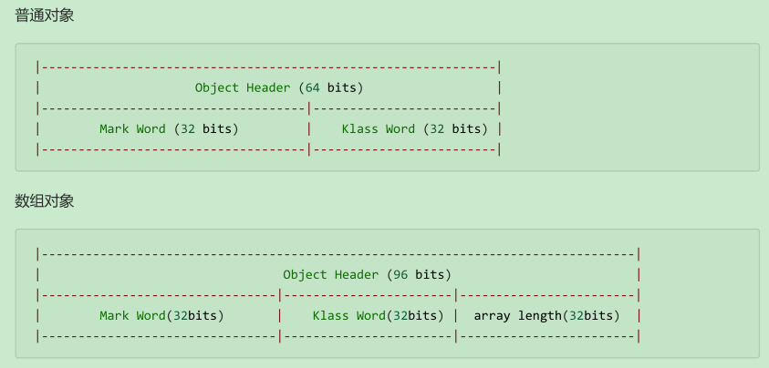

# 并发编程-原理篇

## 1. Monitor 原理

### 1.1. Java 对象头

以 32 位虚拟机为例




### 1.2. 实现原理分析

Monitor 被翻译为监视器或管程。

每个 Java 对象都可以关联一个 Monitor 对象，如果使用 `synchronized` 给对象上锁（重量级）之后，该对象头的 Mark Word 中就被设置指向 Monitor 对象的指针。

Monitor 结构如下：


监视流程分析：

- 刚开始 Monitor 中 Owner 为 null
- 当 Thread-2 执行 `synchronized(obj)` 就会将 Monitor 的所有者 Owner 置为 Thread-2，Monitor 中只能有一个 Owner
- 在 Thread-2 上锁的过程中，如果 Thread-3，Thread-4，Thread-5 也来执行 `synchronized(obj)`，就会进入 EntryList BLOCKED
- Thread-2 执行完同步代码块的内容，然后唤醒 EntryList 中等待的线程来竞争锁，竞争的时是非公平的
- 图中 WaitSet 中的 Thread-0，Thread-1 是之前获得过锁，但条件不满足进入 WAITING 状态的线程，<u>*详见 `wait-notify` 原理分析*</u>

注意事项：

- `synchronized` 必须是进入同一个对象的 monitor 才有上述的效果
- 不加 `synchronized` 的对象不会关联监视器，不遵从以上规则

## 2. synchronized 原理

### 2.1. 源码编译后分析

```java
static final Object lock = new Object();
static int counter = 0;

public static void main(String[] args) {
    synchronized (lock) {
        counter++;
    }
}
```

对应的字节码

```class
public static void main(java.lang.String[]);
    descriptor: ([Ljava/lang/String;)V
    flags: ACC_PUBLIC, ACC_STATIC
    Code:
        stack=2, locals=3, args_size=1
            0: getstatic #2     // <- lock引用 （synchronized开始）
            3: dup
            4: astore_1         // lock引用 -> slot 1
            5: monitorenter     // 将 lock对象 MarkWord 置为 Monitor 指针
            6: getstatic #3     // <- i
            9: iconst_1         // 准备常数 1
            10: iadd            // +1
            11: putstatic #3    // -> i
            14: aload_1         // <- lock引用
            15: monitorexit     // 将 lock对象 MarkWord 重置, 唤醒 EntryList
            16: goto 24
            19: astore_2        // e -> slot 2
            20: aload_1         // <- lock引用
            21: monitorexit     // 将 lock对象 MarkWord 重置, 唤醒 EntryList
            22: aload_2         // <- slot 2 (e)
            23: athrow          // throw e
            24: return
        Exception table:
            from to target  type
             6   16   19    any
             19  22   19    any
        LineNumberTable:
            line 8: 0
            line 9: 6
            line 10: 14
            line 11: 24
        LocalVariableTable:
            Start Length Slot Name   Signature
            0      25     0   args   s[Ljava/lang/String;
        StackMapTable: number_of_entries = 2
            frame_type = 255 /* full_frame */
                offset_delta = 19
                locals = [ class "[Ljava/lang/String;", class java/lang/Object ]
                stack = [ class java/lang/Throwable ]
            frame_type = 250 /* chop */
                offset_delta = 4
```

> 注意：方法级别的 `synchronized` 不会在字节码指令中有所体现

### 2.2. 轻量级锁

轻量级锁的使用场景：如果一个对象虽然有多线程要加锁，但加锁的时间是错开的（也就是没有竞争），那么可以使用轻量级锁来优化。轻量级锁对使用者是透明的，仍然使用 `synchronized` 关键字实现

假设有两个方法同步块，利用同一个对象加锁，代码如下：

```java
static final Object obj = new Object();
public static void method1() {
    synchronized( obj ) {
        // 同步块 A
        method2();
    }
}
public static void method2() {
    synchronized( obj ) {
        // 同步块 B
    }
}
```

加锁流程如下：

- 创建锁记录（Lock Record）对象，每个线程都的栈帧都会包含一个锁记录的结构，内部可以存储锁定对象的 Mark Word


- 让锁记录中 Object reference 指向锁对象，并尝试用 cas 替换 Object 的 Mark Word，将 Mark Word 的值存入锁记录


- 如果 cas 替换成功，对象头中存储了 锁记录地址和状态 00 ，表示由该线程给对象加锁，这时图示如下


- 如果 cas 失败，有两种情况
    - 如果是其它线程已经持有了该 Object 的轻量级锁，这时表明有竞争，进入锁膨胀过程
    - 如果是自己执行了 `synchronized` 锁重入，那么再添加一条 Lock Record 作为重入的计数


- 当退出 `synchronized` 代码块（解锁时）如果有取值为 `null` 的锁记录，表示有重入，这时重置锁记录，表示重入计数减一


- 当退出 `synchronized` 代码块（解锁时）锁记录的值不为 `null`，这时使用 cas 将 Mark Word 的值恢复给对象头
    - 成功，则解锁成功
    - 失败，说明轻量级锁进行了锁膨胀或已经升级为重量级锁，进入重量级锁解锁流程

### 2.3. 锁膨胀

如果在尝试加轻量级锁的过程中，CAS 操作无法成功，这时一种情况就是有其它线程为此对象加上了轻量级锁（有竞争），这时需要进行**锁膨胀，将轻量级锁变为重量级锁**。

```java
static Object obj = new Object();
public static void method1() {
    synchronized( obj ) {
        // 同步块
    }
}
```

- 当 Thread-1 进行轻量级加锁时，Thread-0 已经对该对象加了轻量级锁


- 此时 Thread-1 加轻量级锁失败，进入锁膨胀流程。即为 `Object` 对象申请 Monitor 锁，让 `Object` 指向重量级锁地址。然后自己进入 Monitor 的 EntryList BLOCKED


- 当 Thread-0 退出同步块解锁时，使用 cas 将 Mark Word 的值恢复给对象头，失败。这时会进入重量级解锁流程，即按照 Monitor 地址找到 Monitor 对象，设置 Owner 为 null，唤醒 EntryList 中 BLOCKED 线程

### 2.4. 自旋优化

重量级锁竞争的时候，还可以使用自旋来进行优化，如果当前线程自旋成功（即这时候持锁线程已经退出了同步块，释放了锁），这时当前线程就可以避免阻塞。

自旋重试成功的情况


自旋重试失败的情况


**自旋注意事项**：

- 自旋会占用 CPU 时间，单核 CPU 自旋就是浪费，多核 CPU 自旋才能发挥优势。
- 在 Java 6 之后自旋锁是自适应的，比如对象刚刚的一次自旋操作成功过，那么认为这次自旋成功的可能性会高，就多自旋几次；反之，就少自旋甚至不自旋。
- Java 7 之后不能控制是否开启自旋功能

### 2.5. 偏向锁

轻量级锁在没有竞争时（就自己这个线程），每次重入仍然需要执行 CAS 操作。

Java 6 中引入了偏向锁来做进一步优化：只有第一次使用 CAS 将线程 ID 设置到对象的 Mark Word 头，之后发现这个线程 ID 是自己的就表示没有竞争，不用重新 CAS。以后只要不发生竞争，这个对象就归该线程所有

```java
static final Object obj = new Object();
public static void m1() {
    synchronized( obj ) {
        // 同步块 A
        m2();
    }
}
public static void m2() {
    synchronized( obj ) {
        // 同步块 B
        m3();
    }
}
public static void m3() {
    synchronized( obj ) {
        // 同步块 C
    }
}
```


### 2.6. 锁消除(待整理)

## 3. wait/notify 原理


- Owner 线程发现条件不满足，调用 `wait` 方法，即可进入 WaitSet 变为 WAITING 状态
- BLOCKED 和 WAITING 的线程都处于阻塞状态，不占用 CPU 时间片
- BLOCKED 线程会在 Owner 线程释放锁时唤醒
- WAITING 线程会在 Owner 线程调用 `notify` 或 `notifyAll` 时唤醒，但唤醒后并不意味者立刻获得锁，仍需进入 EntryList 重新竞争

