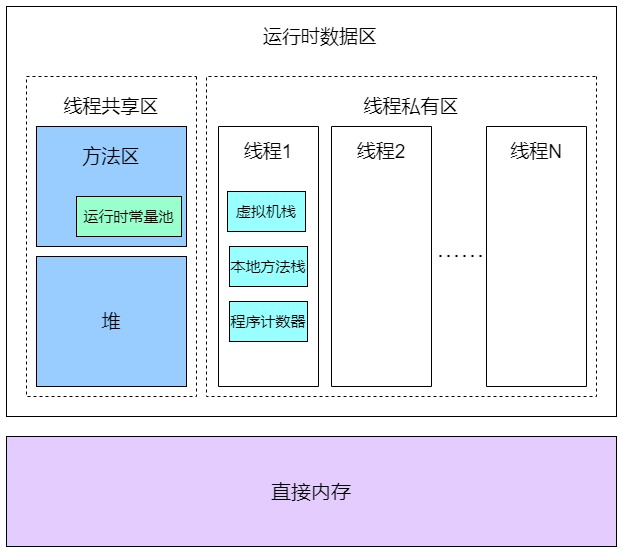
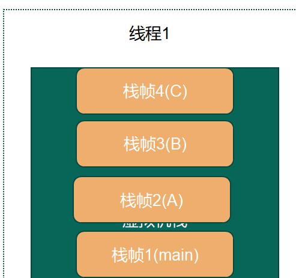
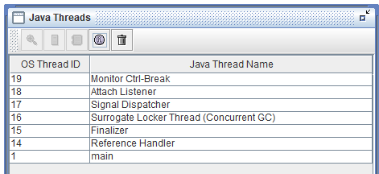
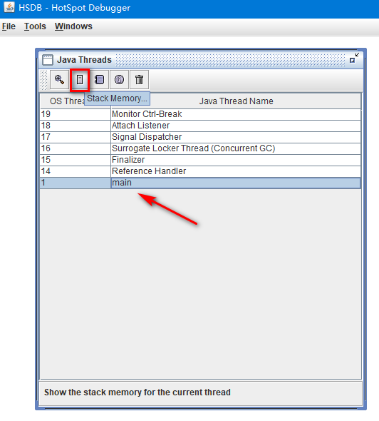
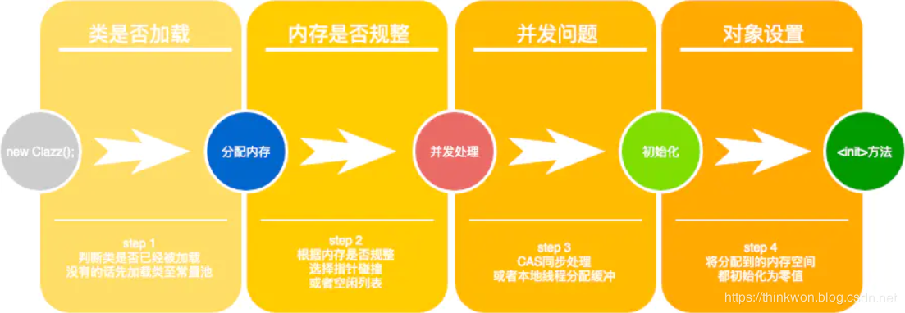
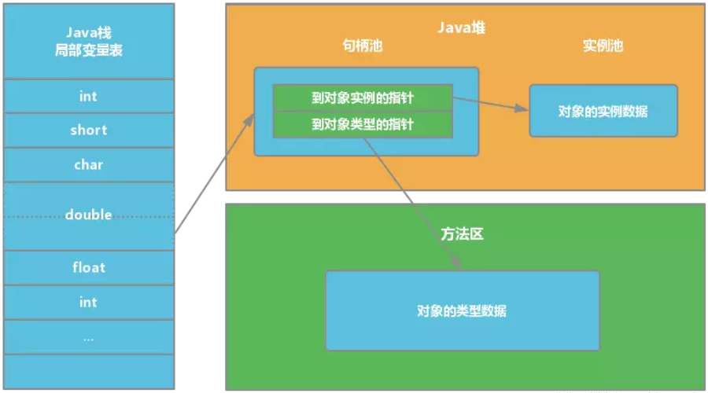
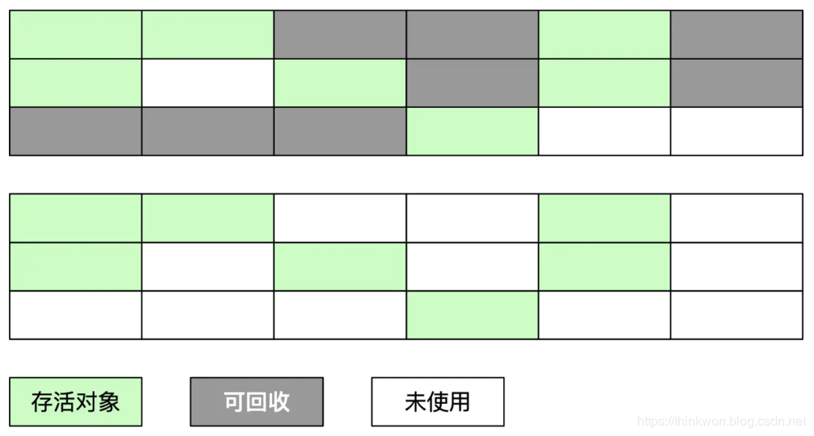
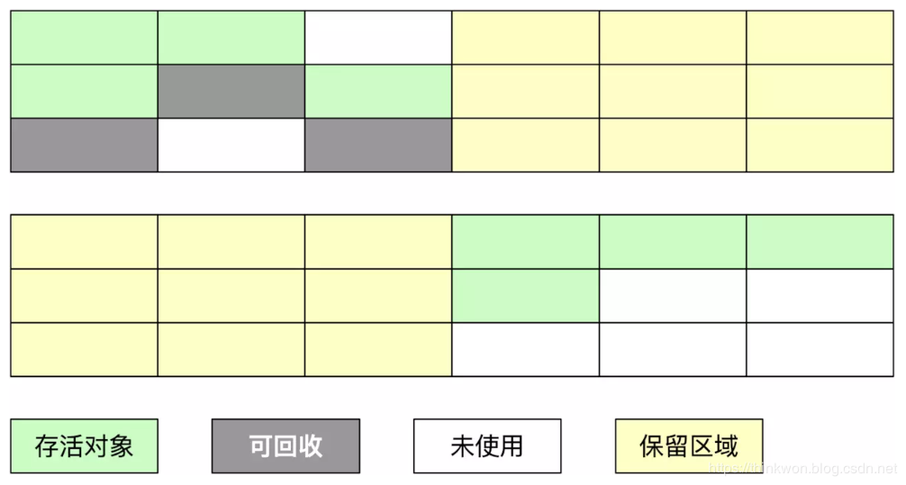
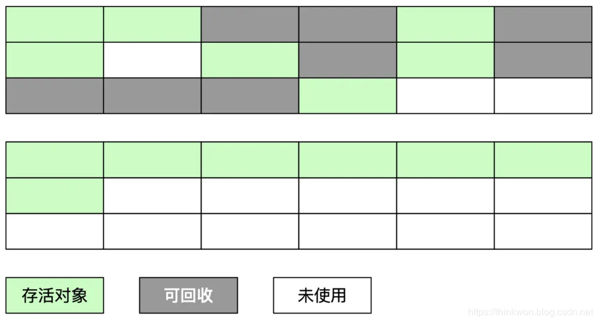

# JVM 基础笔记

## 1. JVM 概述

### 1.1. 什么是JVM

- JVM全称：Java Virtual Machine：Java虚拟机，用来保证Java语言**跨平台**
- Java 虚拟机可以看做是一个虚拟化的操作系统，类似于 Linux 或者 Windows 的操作系统，如同真实的计算机那样，它有自己的指令集以及各种运行时内存区域
- Java 虚拟机与Java语言并没有必然的联系，它只与特定的二进制文件格式(.class文件格式所关联)
- Java 虚拟机就是一个字节码翻译器，它将字节码文件翻译成各个系统对应的机器码，确保字节码文件能在各个系统正确运行

#### 1.1.1. Java 程序的执行过程

一个 Java 程序，首先经过 javac 编译成 `.class` 文件，然后 JVM 将其加载到方法区，执行引擎将会执行这些字节码。执行时，会翻译成操作系统相关的函数。JVM 作为 .class 文件的翻译存在，输入字节码，调用操作系统函数。

执行过程：Java 文件 -> 编译器 -> 字节码 -> JVM -> 机器码。

#### 1.1.2. 跨平台与跨语言

- **跨平台**：编写一个java类，在不同的操作系统上（Linux、Windows、MacOS 等平台）执行效果都是一样，这个就是 JVM 的跨平台性。**不同操作系统有对应的 JDK 的版本**
- **跨语言（语言无关性）**：JVM 只识别字节码，所以与语言没有直接强关联。**JVM不是解析Java文件，而是解析`.class`文件（俗称字节码文件）**。像其他语言（如：Groovy 、Kotlin、Scala等）它们编译成字节码后同样可以在JVM上运行，这就是JVM的跨语言的特性

### 1.2. JAVA SE 官方文档

- Java SE 8 版本的虚拟机规范地址：https://docs.oracle.com/javase/specs/jvms/se8/html/index.html
- JDK8 官网下载地址：https://www.oracle.com/java/technologies/javase/javase-jdk8-downloads.html
- Java SE 8 版本JVM虚拟机参数设置参考文档地址：https://docs.oracle.com/javase/8/docs/technotes/tools/unix/java.html

### 1.3. 常见的 JVM 实现

- Hotspot：目前使用的最多的 Java 虚拟机。在命令行输入`java –version`，会输出目前使用的虚拟机的名字、版本等信息、执行模式。


- Jrocket：曾号称世界上最快的JVM，被Oracle公司收购，合并于Hotspot
- J9: IBM自己的虚拟机
- TaobaoVM：淘宝自己的VM，实际上是 Hotspot 的定制版。只有一定体量、一定规模的厂商才会开发自己的虚拟机
- LiquidVM：针对硬件的虚拟机。下面是没有操作系统的（不是 Linux 也不是 windows），直接就是硬件，运行效率比较高。
- zing：其垃圾回收速度非常快（1 毫秒之内），是业界标杆。它的一个垃圾回收的算法后来被 Hotspot 吸收才有了现在的 ZGC。

### 1.4. JVM 整体知识体系

VM 能涉及非常庞大的一块知识体系，比如内存结构、垃圾回收、类加载、性能调优、JVM 自身优化技术、执行引擎、类文件结构、监控工具等。

在JVM的知识体系中，内存结构是核心重点，所有JVM相关的知识都或多或少涉及内存结构。比如垃圾回收回收的就是内存、类加载加载到的地方也是内存、性能优化也涉及到内存优化、执行引擎与内存密不可分、类文件结构与内存的设计有关系，监控工具也会监控内存。

## 2. JVM 内存结构（重点）

### 2.1. 运行时数据区域

#### 2.1.1. 定义




**运行时数据区的定义**：Java 虚拟机在执行 Java 程序的过程中会把它所管理的内存划分为若干个不同的数据区域

#### 2.1.2. 区域划分

JVM 内存主要分为**堆、程序计数器、方法区、虚拟机栈和本地方法栈**等。按照与线程的关系也可以这么划分区域：

- **线程私有区域**：一个线程拥有单独的一份内存区域。主要包含虚拟机栈、本地方法栈、程序计数器
- **线程共享区域**：被所有线程共享，且在内存中只有一份，主要包含堆、方法区

**直接内存**：没有被JVM没有被虚拟机化的操作系统上的其他内存。比如操作系统上有8G内存，被 JVM 虚拟化了3G，那么还剩余5G，JVM 是借助一些工具使用这5G内存的，这个内存部分称之为直接内存

### 2.2. 虚拟机栈

#### 2.2.1. Java程序的运行与虚拟机栈

<font color=red>**虚拟机栈是线程运行 java 方法所需的数据，指令、返回地址**</font>。其实在实际的代码中，一个线程是可以运行多个方法的。如下面的测试程序

```java
public class MethodAndStack {
    public static void main(String[] args) {
        System.out.println("main方法执行开始");
        A();
        System.out.println("main方法执行结束");
    }

    public static void A() {
        System.out.println("A方法执行");
        B();
    }

    public static void B() {
        System.out.println("B方法执行");
        C();
    }

    public static void C() {
        System.out.println("C方法执行");
    }
}
```

程序开始执行，会有一个线程1来运行这些代码，此时线程1会有一个对应的虚拟机栈，同时执行每个方法的时候都会打包成一个栈帧。



main方法执行时，会有一个栈帧（main）送入到虚拟机栈。在main方法中调用了A方法，此时又一个将A方法生成一个栈帧(A)进入虚拟机栈，同样的方式栈帧（B）与栈帧（C）进入虚拟机栈，最后等C方法执行结束后，栈帧(C)出栈，然后到B方法执行完，栈帧(B)出栈，同样依次进行，最后main方法执行完，栈帧(main)出栈

这就是 Java 方法运行时对虚拟机栈的影响。**虚拟机栈就是用来存储线程运行方法中的数据，而每一个方法对应一个栈帧**。

#### 2.2.2. 虚拟机栈及其相关概念

- **栈的数据结构**：先进后出(FILO)的数据结构
- **虚拟机栈的作用**：在 JVM 运行过程中存储当前线程运行方法所需的数据，指令、返回地址。
- **虚拟机栈是基于线程**：就算只有一个`main()`方法，也是以线程的方式运行的。在线程的生命周期中，参与计算的数据会频繁地入栈和出栈，栈的生命周期是和线程一样的。
- **虚拟机栈的大小**：缺省为1M（具体不同的操作系统的默认大小不一样），可用参数`–Xss`来调整大小，例如`-Xss256k`。

> 参数值的大小详见官方文档（JDK1.8）：《1.2 JAVA SE 官方文档》

- **栈帧**：在每个 Java 方法被调用的时候，都会创建一个栈帧，并进入虚拟机栈（入栈）。一旦方法完成相应的调用后，则出栈。
- **栈帧大体都包含四个区域**：(局部变量表、操作数栈、动态连接、返回地址)
    - **局部变量表**：用于存放局部变量的（方法中的变量）。它是一个 32 位的长度，主要存放我们的 Java 的八大基础数据类类型；如果是 64 位的就使用高低位占用两个也可以存放下；如果是局部的对象，比如 Object 对象，只需要存放它的一个引用地址即可
    - **操作数栈**：是存放 java 方法执行的操作数的，先进后出的栈结构。操作的的元素可以是任意的 java 数据类型，所以在一个方法刚刚开始的时候，这个方法操作数栈是空的。<font color=red>**操作数栈本质上是 JVM 执行引擎的一个工作区，也就是方法在执行，才会对操作数栈进行操作，如果代码不不执行，操作数栈其实就是空的**</font>
    - **动态连接**：Java 语言特性多态
    - **返回地址**：正常返回（调用程序计数器中的地址作为返回）、异常的话（通过异常处理器表[非栈帧中的]来确定）

虚拟机栈这个内存也不是无限大，它有大小限制，默认情况下是1M。如果不断的往虚拟机栈中入栈帧，但是不出栈的话，那么这个虚拟机栈就会出现栈溢出错误（`Exception in thread "main" java.lang.StackOverflowError`）

```java
public class StackError {
    public static void main(String[] args) {
        A();
    }
    public static void A() {
        A();
    }
}
```

#### 2.2.3. 栈帧执行对内存区域的影响

在 JVM 中，基于解释执行的这种方式是基于栈的引擎，这个就是操作数栈。对 class 进行反汇编，对照字节码参照资料，可以分析操作数栈的执行流程。

```bash
javap –c XXXX.class
```

> 字节码助记码解释参考资料地址：https://cloud.tencent.com/developer/article/1333540


### 2.3. 程序计数器

程序计数器是占用较小的内存空间，当前线程执行的字节码的行号指示器；各线程之间独立存储，互不影响。主要用来记录各个线程执行的字节码的地址，例如，分支、循环、跳转、异常、线程恢复等都依赖于计数器。

产生程序计数器的原因是，因为 Java 是多线程语言，当执行的线程数量超过 CPU 核数时，线程之间会根据时间片轮询争夺 CPU 资源。如果一个线程的时间片用完了，或者是其它原因导致这个线程的 CPU 资源被提前抢夺，那么这个退出的线程就需要单独的一个程序计数器，来记录下一条运行的指令。

JVM 是虚拟机，内部有完整的指令与执行的一套流程，所以在运行 Java 方法的时候需要使用程序计数器（记录字节码执行的地址或行号），如果是遇到本地方法（native 方法），这个方法不是 JVM 来具体执行，所以程序计数器不需要记录了，这个是因为在操作系统层面也有一个程序计数器，这个会记录本地代码的执行的地址，所以在执行 native 方法时，JVM 中程序计数器的值为空(Undefined)。

> <font color=red>**程序计数器也是 JVM 中唯一不会 OOM(OutOfMemory)的内存区域。**</font>

### 2.4. 本地方法栈

本地方法栈跟 Java 虚拟机栈的功能类似，Java 虚拟机栈用于管理 Java 函数的调用，而**本地方法栈则用于管理本地方法的调用**。但本地方法并不是用 Java 实现的，而是由 C 语言实现的(比如 Object.hashcode 方法)。

本地方法栈是和虚拟机栈非常相似的一个区域，它服务的对象是 native 方法。甚至可以认为虚拟机栈和本地方法栈是同一个区域。虚拟机规范无强制规定，各版本虚拟机自由实现，HotSpot直接把本地方法栈和虚拟机栈合二为一。


### 2.5. 方法区

**方法区主要是用来存放已被虚拟机加载的类相关信息，包括类信息、静态变量、常量、运行时常量池、字符串常量池等**

- 方法区是 JVM 对内存的“逻辑划分”
    - 在 JDK1.7 及之前很多开发者都习惯将方法区称为“永久代”
    - 在 JDK1.8 及以后使用了元空间来实现方法区。

JVM 在执行某个类的时候，必须先加载。在加载类（加载、验证、准备、解析、初始化）的时候，JVM 会先加载 class 文件，而在 class 文件中除了有类的版本、字段、方法和接口等描述信息外，还有一项信息是常量池 (Constant Pool Table)，用于存放编译期间生成的各种字面量和符号引用。

#### 2.5.1. 字面量

字面量包括字符串（`String a = "b"`）、基本类型的常量（`final` 修饰的变量）

#### 2.5.2. 符号引用

符号引用则包括类和方法的全限定名（例如 `String` 这个类，它的全限定名就是 `java.lang.String`）、字段的名称和描述符以及方法的名称和描述符。

例如：一个 java 类（假设为A类）被编译成一个 `.class` 文件时，如果 A 类引用了 B 类，但是在编译时 A 类并不知道引用类的实际内存地址，因此只能使用符号引用来代替。

在类装载器装载A类时，此时可以通过虚拟机获取B类的实际内存地址，因此便可以既将符号 `org.simple.B` 替换为 B 类的实际内存地址，及直接引用地址。即在编译时用符号引用来代替引用类，在加载时再通过虚拟机获取该引用类的实际地。以一组符号来描述所引用的目标，符号可以是任何形式的字面量，只要使用时能无歧义地定位到目标即可。

**符号引用与虚拟机实现的内存布局是无关的，引用的目标不一定已经加载到内存中**。

#### 2.5.3. 常量池与运行时常量池

- 当类加载到内存中后，JVM 就会将 class 文件常量池中的内容存放到运行时的常量池中。在解析阶段，JVM 会把符号引用替换为直接引用（对象的索引值）

例如：类中的一个字符串常量在 class 文件中时，存放在 class 文件常量池中的；在 JVM 加载完类之后，JVM 会将这个字符串常量放到运行时常量池中，并在解析阶段，指定该字符串对象的索引值。运行时常量池是全局共享的，多个类共用一个运行时常量池，class 文件中常量池多个相同的字符串在运行时常量池只会存在一份。

- 运行时常量池（Runtime Constant Pool）是每一个类或接口的常量池（Constant_Pool）的运行时表示形式，它包括了若干种不同的常量：从编译期可知的数值字面量到必须运行期解析后才能获得的方法或字段引用。
- 运行时常量池是方法区的一部分。运行时常量池相对于 Class 常量池的另外一个重要特征是具备**动态性**

#### 2.5.4. 元空间

JDK1.8及其之后称之为元空间，方法区与堆空间类似，也是一个共享内存区，所以方法区是线程共享的。

在 HotSpot 虚拟机、Java7 版本中已经将永久代的静态变量和运行时常量池转移到了堆中，其余部分则存储在 JVM 的非堆内存中，而 Java8 版本已经将方法区中实现的永久代去掉了，并用元空间（class metadata）代替了之前的永久代，并且元空间的存储位置是本地内存。

**元空间大小参数设置**

- jdk1.7 及以前（初始和最大值）：`-XX:PermSize; -XX:MaxPermSize;`
- jdk1.8 以后（初始和最大值）：`-XX:MetaspaceSize; -XX:MaxMetaspaceSize;`
- jdk1.8 以后大小就只受本机总内存的限制（如果不设置参数的话）

> JVM 参数参考：《1.2 JAVA SE 官方文档网址》，了解Java8 为什么使用元空间替代永久代，这样做有什么好处呢？
>
> - 官方解释：移除永久代是为了融合 HotSpot JVM 与 JRockit VM 而做出的努力，因为 JRockit 没有永久代，所以不需要配置永久代。
> - 永久代内存经常不够用或发生内存溢出，抛出异常 `java.lang.OutOfMemoryError: PermGen`。这是因为在 JDK1.7 版本中，指定的 PermGen 区大小为8M，由于 PermGen 中类的元数据信息在每次 FullGC 的时候都可能被收集，回收率都偏低，成绩很难令人满意；还有为 PermGen 分配多大的空间很难确定，PermSize 的大小依赖于很多因素，比如，JVM 加载的 class 总数、常量池的大小和方法的大小等。

### 2.6. 堆

#### 2.6.1. 定义

- 堆是 JVM 上最大的内存区域，程序运行几乎所有的创建的对象，都是在这里存储的。堆空间一般是程序启动时，就申请了，但是并不一定会全部使用。堆一般设置成可伸缩的。
- **垃圾回收**，操作的对象就是堆。随着对象的频繁创建，堆空间占用的越来越多，就需要不定期的对不再使用的对象进行回收。这个在 Java 中，就叫作 GC（Garbage Collection）。

#### 2.6.2. 在堆中对象的存储位置

对象创建后，是在堆上分配，还是在栈上分配，取决于对象的类型和在 Java 类中存在的位置。

Java 的对象可以分为基本数据类型和普通对象。

- 对于普通对象来说，JVM 会首先在堆上创建对象，然后在其他地方使用的其实是它存储地址的引用。比如，一个方法需要使用一个对象，将其引用地址保存在虚拟机栈的局部变量表中。
- 对于基本数据类型（byte、short、int、long、float、double、char)来说，有两种情况。当在方法体内声明了基本数据类型的对象，它就会在栈上直接分配。其他情况，都是在堆上分配。

#### 2.6.3. 堆大小参数

- `-Xms`：堆的最小值；
- `-Xmx`：堆的最大值；
- `-Xmn`：新生代的大小；
- `-XX:NewSize`；新生代最小值；
- `-XX:MaxNewSize`：新生代最大值

例如：`-Xmx256m`

#### 2.6.4. 堆空间分代划分

堆被划分为新生代和老年代（Tenured），新生代又被进一步划分为 Eden 和 Survivor 区，最后 Survivor 由 From Survivor 和 To Survivor 组成。


### 2.7. 直接内存（堆外内存）

直接内存，又称堆外内存，是用于进行数据存储

JVM 在运行时，会从操作系统申请大块的堆内存，进行数据的存储；同时还有虚拟机栈、本地方法栈和程序计数器，这块称之为栈区。操作系统剩余的内存也就是堆外内存。

它不是虚拟机运行时数据区的一部分，也不是 java 虚拟机规范中定义的内存区域；如果使用了 NIO,这块区域会被频繁使用，在 java 堆内可以用 `directByteBuffer` 对象直接引用并操作；

堆外内存不受 java 堆大小限制，但受本机总内存的限制，可以通过`-XX:MaxDirectMemorySize`来设置（默认与堆内存最大值一样），所以也会出现 OOM 异常

- **总结**：
    - 直接内存主要是通过 `DirectByteBuffer` 对象申请的内存，可以使用参数`-XX:MaxDirectMemorySize`来限制它的大小。
    - 其他堆外内存，主要是指使用了 Unsafe 或者其他 JNI 手段直接直接申请的内存。

> 堆外内存的泄漏是非常严重的，它的排查难度高、影响大，甚至会造成主机的程序死亡。
>
> 同时，要注意 Oracle 之前计划在 Java 9 中去掉 `sun.misc.Unsafe` API。这里删除 `sun.misc.Unsafe` 的原因之一是使 Java 更加安全，并且有替代方案。

### 2.8. 堆和栈的区别

**物理地址**：

- 堆的物理地址分配对对象是不连续的。因此性能慢些。在GC的时候也要考虑到不连续的分配，所以有各种算法。比如，标记-消除，复制，标记-压缩，分代（即新生代使用复制算法，老年代使用标记——压缩）
- 栈使用的是数据结构中的栈，先进后出的原则，物理地址分配是连续的。所以性能快。

**内存分别**：

- 堆因为是不连续的，所以<font color=red>**分配的内存是在运行期**</font>确认的，因此大小不固定。一般堆大小远远大于栈。
- 栈是连续的，所以<font color=red>**分配的内存大小要在编译期**</font>就确认，大小是固定的。

**存放的内容**：

- 堆存放的是对象的实例和数组。该区关注点是数据的存储
- 栈存放的是局部变量，操作数栈，返回结果。该区关注点是程序方法的执行

> Tips: 静态变量存放在方法区中，静态的对象依旧存放在堆

**程序的可见度**：

- 堆对于整个应用程序都是<font color=red>**共享、可见的**</font>。
- 栈只对于线程是可见的，所以也是<font color=red>**线程私有**</font>。栈的生命周期和线程相同。

## 3. JVM 运行流程示例

```java
/**
 * JVM执行流程测试
 * <p> VM参数配置 </p>
 * -Xms30m -Xmx30m -XX:MaxMetaspaceSize=30m -XX:+UseConcMarkSweepGC -XX:-UseCompressedOops
 *
 * <p> -XX:MaxMetaspaceSize 定义元空间的最大值 </p>
 * <p> -XX:+UseConcMarkSweepGC -XX:-UseCompressedOops 指定垃圾回收器 </p>
 */
public class JVMObject {
    public final static String MAN_TYPE = "man"; // 常量
    public static String WOMAN_TYPE = "woman";  // 静态变量
    public static void main(String[] args) throws InterruptedException {
        Person p1 = new Person();
        p1.setName("月の女祭司");
        p1.setSexType(WOMAN_TYPE);
        p1.setAge(28);

        // 主动触发GC 垃圾回收 15次
        for (int i = 0; i < 15; i++) {
            System.gc();
        }

        Person p2 = new Person();
        p2.setName("Moon");
        p2.setSexType(MAN_TYPE);
        p2.setAge(19);
        Thread.sleep(Integer.MAX_VALUE); // 线程休眠
    }
}
```

配置VM参数：`-Xms30m -Xmx30m -XX:MaxMetaspaceSize=30m -XX:+UseConcMarkSweepGC -XX:-UseCompressedOops`

**JVM运行的主要流程**如下：

1. JVM 向操作系统申请内存：通过配置参数或者默认配置参数向操作系统申请内存空间，根据内存大小找到具体的内存分配表，然后把内存段的起始地址和终止地址分配给 JVM，然后 JVM 再进行内部分配
2. JVM 获得内存空间后，会根据配置参数分配堆、栈以及方法区的内存大小，例如：`-Xms30m -Xmx30m -Xss1m -XX:MaxMetaspaceSize=30m`
3. 进行类加载，主要是把 class 放入方法区、还有 class 中的静态变量和常量也要放入方法区
4. 执行方法及创建对象。如上面测试代码：启动 main 线程，执行 main 方法，开始执行第一行代码。此时堆内存中会创建一个 Person 对象，对象引用 p1 就存放在栈中。后续代码中遇到 new 关键字，会再创建一个 Person 对象，对象引用 p2 就存放在栈中。


### 3.1. JVM 运行内存的整体流程总结

- JVM 在操作系统上启动，申请内存，先进行运行时数据区的初始化，然后把类加载到方法区，最后执行方法。
- 方法的执行和退出过程在内存上的体现上就是虚拟机栈中栈帧的入栈和出栈。
- 同时在方法的执行过程中创建的对象一般情况下都是放在堆中，最后堆中的对象也是需要进行垃圾回收清理的。

### 3.2. GC 概念

GC- Garbage Collection(垃圾回收)，在 JVM 中是自动化的垃圾回收机制，一般不用去关注，在 JVM 中 GC 的重要区域是堆空间。

可以通过一些额外方式主动发起GC垃圾回收，比如通过`System.gc()`方法可以主动发起。（**项目中切记不要使用**）

### 3.3. JHSDB 工具

JHSDB 是一款基于服务性代理实现的进程外调试工具。服务性代理是 HotSpot 虚拟机中一组用于映射 Java 虚拟机运行信息的，主要基于 Java 语言实现的API集合

#### 3.3.1. JDK1.8 的开启方式

开启 JHSDB 工具，在 JDK1.8 启动 JHSDB 的时候必须将 `sawindbg.dll`（一般会在JDK的目录下）复制到对应的jre/bin目录下(*注：在windows上安装了 JDK1.8 后往往同级目录下有一个
jre 的目录*)


然后到目录：`...\Java\jdk1.8.0_144\lib` 进入命令行，执行 `java -cp .\sa-jdi.jar sun.jvm.hotspot.HSDB`


#### 3.3.2. JDK1.9 及以后的开启方式

进入 JDK 的 bin 目录下，在命令行中使用 `jhsdb hsdb` 来启动JHSDB工具

#### 3.3.3. 配置程序运行时的VM参数

VM 参数加入：`-XX:+UseConcMarkSweepGC -XX:-UseCompressedOops`

```
节选官方文档参数解释：
-XX:+UseConcMarkSweepGC
Enables the use of the CMS garbage collector for the old generation. Oracle recommends that you use the CMS garbage collector when application latency requirements cannot be met by the throughput (-XX:+UseParallelGC) garbage collector. The G1 garbage collector (-XX:+UseG1GC) is another alternative.

By default, this option is disabled and the collector is chosen automatically based on the configuration of the machine and type of the JVM. When this option is enabled, the -XX:+UseParNewGC option is automatically set and you should not disable it, because the following combination of options has been deprecated in JDK 8: -XX:+UseConcMarkSweepGC -XX:-UseParNewGC.

-XX:-UseCompressedOops
Disables the use of compressed pointers. By default, this option is enabled, and compressed pointers are used when Java heap sizes are less than 32 GB. When this option is enabled, object references are represented as 32-bit offsets instead of 64-bit pointers, which typically increases performance when running the application with Java heap sizes less than 32 GB. This option works only for 64-bit JVMs.

It is also possible to use compressed pointers when Java heap sizes are greater than 32GB. See the -XX:ObjectAlignmentInBytes option.
```

> 详细说明参考官方文档：《1.2 JAVA SE 官方文档网址》

#### 3.3.4. JHSDB 工具的使用

##### 3.3.4.1. 打开查看程序的运行进程

启动上面的测试代码，因为 JVM 启动有一个进程，需要借助一个java的命令方 `jps` 查找到对应程序的进程


点击 JHSDB 工具中 【File】 --> 【Attach to HotSpot process...】，在【process ID】中输入程序的进程id，点击ok打开，查询当前程序中的所有线程信息




##### 3.3.4.2. 查看堆参数

点击【Tools】 --> 【Heap Parameters】，打开堆参数面板


上图中可以看到实际 JVM 启动过程中堆中参数的对照，在不启动内存压缩的情况下。堆空间里面的分代划分都是连续的。

##### 3.3.4.3. 查看程序中对象

点击【Tools】 --> 【Object Histogram】，可以看到 JVM 中所有的对象，都是基于 class 的对象。通过全路径名搜索，可以查询当前程序中的对象信息


双击出现这个Person类，弹出框可以查询到两个对象，就是上面示例程序中的p1和p2对象。选择对象再点击【Inspect】查看对象的详细信息


分开点开两个对象对比，在创建p1对象后，手动多次触发了gc垃圾回收后，p1位置在老年代，而最后创建的p2对象就在Eden区


##### 3.3.4.4. 查看栈

选择main线程，点击【Stack Memory...】按钮




从上图中可以验证栈内存，同时也可以验证到虚拟机栈和本地方法栈在 Hotspot 中是合二为一的实现了。

#### 3.3.5. JVM 的处理全过程总结

执行上面的示例程序，可以看到JVM在运行程序的全过程如下：

1. JVM 向操作系统申请内存，JVM 第一步就是通过配置参数或者默认配置参数向操作系统申请内存空间。
2. JVM 获得内存空间后，会根据配置参数分配堆、栈以及方法区的内存大小。
3. 完成上一个步骤后，JVM 首先会执行构造器，编译器会在`.java`文件被编译成`.class`文件时，收集所有类的初始化代码，包括静态变量赋值语句、静态代码块、静态方法，静态变量和常量放入方法区
4. 执行方法。启动 main 线程，执行 main 方法，开始执行第一行代码。此时堆内存中会创建一个 Person 对象，对象引用 p1 就存放在栈中。执行其他方法时，具体的操作查看上面章节的《栈帧执行对内存区域的影响》。

## 4. HotSpot 虚拟机对象

### 4.1. 对象的创建

Java 中提供的几种对象创建方式：

1. 使用 `new` 关键字（调用了构造函数）
2. 使用 `Class` 类的 `newInstance` 方法（调用了构造函数）
3. 使用 `Constructor` 类的 `newInstance` 方法（调用了构造函数）
4. 使用 `clone` 方法（没有调用了构造函数）
5. 使用反序列化（没有调用了构造函数）

对象创建的主要流程：



虚拟机遇到一条 new 指令时，先检查常量池是否已经加载相应的类，如果没有，必须先执行相应的类加载。类加载通过后，接下来分配内存。若Java堆中内存是绝对规整的，使用“指针碰撞”方式分配内存；如果不是规整的，就从空闲列表中分配，叫做“空闲列表”方式。划分内存时还需要考虑一个问题-并发，也有两种方式: CAS同步处理，或者本地线程分配缓冲(Thread Local Allocation Buffer, TLAB)。然后内存空间初始化操作，接着是做一些必要的对象设置(元信息、哈希码...)，最后执行方法。

### 4.2. 为对象分配内存

类加载完成后，接着会在Java堆中划分一块内存分配给对象。内存分配根据Java堆是否规整，有两种方式：

- **指针碰撞**：如果Java堆的内存是规整，即所有用过的内存放在一边，而空闲的的放在另一边。分配内存时将位于中间的指针指示器向空闲的内存移动一段与对象大小相等的距离，这样便完成分配内存工作。
- **空闲列表**：如果Java堆的内存不是规整的，则需要由虚拟机维护一个列表来记录那些内存是可用的，这样在分配的时候可以从列表中查询到足够大的内存分配给对象，并在分配后更新列表记录。

选择哪种分配方式是由 Java 堆是否规整来决定的，而 Java 堆是否规整又由所采用的垃圾收集器是否带有压缩整理功能决定。


### 4.3. 处理并发安全问题

对象的创建在虚拟机中是一个非常频繁的行为，哪怕只是修改一个指针所指向的位置，在并发情况下也是不安全的，可能出现正在给对象 A 分配内存，指针还没来得及修改，对象 B 又同时使用了原来的指针来分配内存的情况。解决这个问题有两种方案：

- 对分配内存空间的动作进行同步处理（采用 CAS + 失败重试来保障更新操作的原子性）
- 把内存分配的动作按照线程划分在不同的空间之中进行，即每个线程在 Java 堆中预先分配一小块内存，称为本地线程分配缓冲（Thread Local Allocation Buffer, TLAB）。哪个线程要分配内存，就在哪个线程的 TLAB 上分配。只有 TLAB 用完并分配新的 TLAB 时，才需要同步锁。通过 `-XX:+/-UserTLAB` 参数来设定虚拟机是否使用TLAB。


### 4.4. 对象的访问定位

Java 程序需要通过 JVM 栈上的引用访问堆中的具体对象。对象的访问方式取决于 JVM 虚拟机的实现。目前主流的访问方式有**句柄**和**直接指针**两种方式。

- **指针**：指向对象，代表一个对象在内存中的起始地址。
- **句柄**：可以理解为指向指针的指针，维护着对象的指针。句柄不直接指向对象，而是指向对象的指针（句柄不发生变化，指向固定内存地址），再由对象的指针指向对象的真实内存地址。

#### 4.4.1. 句柄访问

Java 堆中划分出一块内存来作为**句柄池**，引用中存储对象的**句柄地址**，而句柄中**包含了对象实例数据与对象类型数据各自的具体地址信息**，具体构造如下图所示：



使用句柄访问的优势：**引用中存储的是稳定的句柄地址，在对象被移动（垃圾收集时移动对象是非常普遍的行为）时只会改变句柄中的实例数据指针，而引用本身不需要修改**。

#### 4.4.2. 直接指针

如果使用**直接指针**访问，**引用中存储的直接就是对象地址**，那么 Java 堆对象内部的布局中就必须考虑如何放置访问**类型数据**的相关信息。


使用直接指针访问的优势：**速度更快，节省了一次指针定位的时间开销**。由于对象的访问在 Java 中非常频繁，因此这类开销积少成多后也是非常可观的执行成本。HotSpot 中采用的就是这种方式。

## 5. 垃圾收集器

### 5.1. 内存溢出（内存泄漏）

内存泄漏是指不再被使用的对象或者变量一直被占据在内存中。理论上来说，JVM 是有GC垃圾回收机制的，也就是说，不再被使用的对象，会被GC自动回收掉，自动从内存中清除。

但是 JVM 也还是存在着内存泄漏的情况，java 导致内存泄露的原因（场景）很明确：**长生命周期的对象持有短生命周期对象的引用就很可能发生内存泄露**，尽管短生命周期对象已经不再需要，但是因为长生命周期对象持有它的引用而导致不能被回收

### 5.2. Java 垃圾回收机制概述

在 java 中，程序员不需要显式的去释放一个对象的内存的，而是由虚拟机自行执行。在JVM中，有一个垃圾回收线程（守护线程？），它是低优先级的，在正常情况下是不会执行的，只有在虚拟机空闲或者当前堆内存不足时，才会触发执行，扫描那些没有被任何引用的对象，并将它们添加到要回收的集合中，进行回收。

GC（Gabage Collection）垃圾收集，Java 提供的 GC 功能可以自动监测对象是否超过作用域从而达到自动回收内存的目的，并且 Java 语言没有提供释放已分配内存的显示操作方法。

### 5.3. 垃圾回收器的基本原理

对于GC来说，当创建对象时，GC就开始监控这个对象的地址、大小以及使用情况。GC采用有向图的方式记录和管理堆(heap)中的所有对象。

可以手动执行 `System.gc()`，通知GC运行，但是Java语言规范并不保证GC一定会执行。

#### 5.3.1. GC 对 Java 中各种引用类型的处理

- **强引用**：发生 GC 的时候不会被回收。
- **软引用**：有用但不是必须的对象，在发生内存溢出之前会被回收。
- **弱引用**：有用但不是必须的对象，在下一次 GC 时会被回收。
- **虚引用**（幽灵引用/幻影引用）：无法通过虚引用获得对象，用 PhantomReference 实现虚引用，虚引用的用途是在 gc 时返回一个通知。

#### 5.3.2. GC 如何判断对象是否可以被回收

垃圾收集器在做垃圾回收的时候，首先需要判定的就是哪些内存是需要被回收的，“存活”的不可以被回收，“死亡”的需要被回收。一般有两种方法来判断：

- **引用计数器法**：为每个对象创建一个引用计数，有对象引用时计数器 +1，引用被释放时计数 -1，当计数器为 0 时就可以被回收。它有一个缺点不能解决循环引用的问题
- **可达性分析算法**：从 GC Roots 开始向下搜索，搜索所走过的路径称为引用链。当一个对象到 GC Roots 没有任何引用链相连时，则证明此对象是可以被回收的

### 5.4. JVM 的垃圾回收算法

- **标记-清除算法**：标记无用对象，然后进行清除回收。
- **复制算法**：按照容量划分二个大小相等的内存区域，当一块用完的时候将活着的对象复制到另一块上，然后再把已使用的内存空间一次清理掉。
- **标记-整理算法**：标记无用对象，让所有存活的对象都向一端移动，然后直接清除掉端边界以外的内存。
- **分代算法**：根据对象存活周期的不同将内存划分为几块，一般是新生代和老年代，新生代基本采用复制算法，老年代采用标记整理算法。

#### 5.4.1. 标记-清除算法

标记-清除算法（Mark-Sweep）是一种常见的基础垃圾收集算法，标记无用对象，然后进行清除回收。它将垃圾收集分为两个阶段：

- 标记阶段：标记出可以回收的对象
- 清除阶段：回收被标记的对象所占用的空间



算法的优缺点：

- 优点：实现简单，不需要对象进行移动。
- 缺点：标记、清除过程效率低，无法清除垃圾碎片。产生大量不连续的内存碎片，提高了垃圾回收的频率。

#### 5.4.2. 复制算法

为了解决标记-清除算法的效率不高的问题，产生了复制算法。它把内存空间划为两个相等的区域，每次只使用其中一个区域。垃圾收集时，遍历当前使用的区域，把存活对象复制到另外一个区域中，最后将当前使用的区域的可回收的对象进行回收。



- 优点：按顺序分配内存即可，实现简单、运行高效，不用考虑内存碎片。
- 缺点：内存使用率不高，可用的内存大小缩小为原来的一半，对象存活率高时会频繁进行复制。

#### 5.4.3. 标记-整理算法

在新生代中可以使用复制算法，但是在老年代就不能选择复制算法了，因为老年代的对象存活率会较高，这样会有较多的复制操作，导致效率变低。标记-清除算法可以应用在老年代中，但是它效率不高，在内存回收后容易产生大量内存碎片。

因此就出现了一种标记-整理算法（Mark-Compact）算法，与标记-整理算法不同的是，在标记可回收的对象后将所有存活的对象压缩到内存的一端，使他们紧凑的排列在一起，然后对端边界以外的内存进行回收。回收后，已用和未用的内存都各自一边。



- 优点：解决了标记-清理算法存在的内存碎片问题。
- 缺点：仍需要进行局部对象移动，一定程度上降低了效率。

#### 5.4.4. 分代收集算法

当前商业虚拟机都采用**分代收集**的垃圾收集算法。分代收集算法，是根据对象的存活周期将内存划分为几块。一般包括**年轻代、老年代 和永久代**，如图所示：


> Notes: Java 8 中已经移除了永久代，新加了一个叫做元数据区的 native 内存区

## 6. JVM 调优

### 6.1. 调优的工具

JDK 自带了很多监控工具，都位于 JDK 的 bin 目录下，其中最常用的是jconsole 和 jvisualvm 这两款视图监控工具。

- jconsole：用于对 JVM 中的内存、线程和类等进行监控；
- jvisualvm：JDK 自带的全能分析工具，可以分析：内存快照、线程快照、程序死锁、监控内存的变化、gc 变化等。

### 6.2. 常用的 JVM 调优的参数

- `-Xms2g`：初始化推大小为 2g；
- `-Xmx2g`：堆最大内存为 2g；
- `-XX:NewRatio=4`：设置年轻的和老年代的内存比例为 1:4；
- `-XX:SurvivorRatio=8`：设置新生代 Eden 和 Survivor 比例为 8:2；
- `–XX:+UseParNewGC`：指定使用 ParNew + Serial Old 垃圾回收器组合；
- `-XX:+UseParallelOldGC`：指定使用 ParNew + ParNew Old 垃圾回收器组合；
- `-XX:+UseConcMarkSweepGC`：指定使用 CMS + Serial Old 垃圾回收器组合；
- `-XX:+PrintGC`：开启打印 gc 信息；
- `-XX:+PrintGCDetails`：打印 gc 详细信息。

## 7. JVM指令手册（了解）

```
栈和局部变量操作 
将常量压入栈的指令 
aconst_null 将null对象引用压入栈 
iconst_m1 将int类型常量-1压入栈 
iconst_0 将int类型常量0压入栈 
iconst_1 将int类型常量1压入操作数栈 
iconst_2 将int类型常量2压入栈 
iconst_3 将int类型常量3压入栈 
iconst_4 将int类型常量4压入栈 
iconst_5 将int类型常量5压入栈 
lconst_0 将long类型常量0压入栈 
lconst_1 将long类型常量1压入栈 
fconst_0 将float类型常量0压入栈 
fconst_1 将float类型常量1压入栈 
dconst_0 将double类型常量0压入栈 
dconst_1 将double类型常量1压入栈 
bipush 将一个8位带符号整数压入栈 
sipush 将16位带符号整数压入栈 
ldc 把常量池中的项压入栈 
ldc_w 把常量池中的项压入栈（使用宽索引） 
ldc2_w 把常量池中long类型或者double类型的项压入栈（使用宽索引） 
从栈中的局部变量中装载值的指令 
iload 从局部变量中装载int类型值 
lload 从局部变量中装载long类型值 
fload 从局部变量中装载float类型值 
dload 从局部变量中装载double类型值 
aload 从局部变量中装载引用类型值（refernce） 
iload_0 从局部变量0中装载int类型值 
iload_1 从局部变量1中装载int类型值 
iload_2 从局部变量2中装载int类型值 
iload_3 从局部变量3中装载int类型值 
lload_0 从局部变量0中装载long类型值 
lload_1 从局部变量1中装载long类型值 
lload_2 从局部变量2中装载long类型值 
lload_3 从局部变量3中装载long类型值 
fload_0 从局部变量0中装载float类型值 
fload_1 从局部变量1中装载float类型值 
fload_2 从局部变量2中装载float类型值 
fload_3 从局部变量3中装载float类型值 
dload_0 从局部变量0中装载double类型值 
dload_1 从局部变量1中装载double类型值 
dload_2 从局部变量2中装载double类型值 
dload_3 从局部变量3中装载double类型值 
aload_0 从局部变量0中装载引用类型值 
aload_1 从局部变量1中装载引用类型值 
aload_2 从局部变量2中装载引用类型值 
aload_3 从局部变量3中装载引用类型值 
iaload 从数组中装载int类型值 
laload 从数组中装载long类型值 
faload 从数组中装载float类型值 
daload 从数组中装载double类型值 
aaload 从数组中装载引用类型值 
baload 从数组中装载byte类型或boolean类型值 
caload 从数组中装载char类型值 
saload 从数组中装载short类型值 
将栈中的值存入局部变量的指令 
istore 将int类型值存入局部变量 
lstore 将long类型值存入局部变量 
fstore 将float类型值存入局部变量 
dstore 将double类型值存入局部变量 
astore 将将引用类型或returnAddress类型值存入局部变量 
istore_0 将int类型值存入局部变量0 
istore_1 将int类型值存入局部变量1 
istore_2 将int类型值存入局部变量2 
istore_3 将int类型值存入局部变量3 
lstore_0 将long类型值存入局部变量0 
lstore_1 将long类型值存入局部变量1 
lstore_2 将long类型值存入局部变量2 
lstore_3 将long类型值存入局部变量3 
fstore_0 将float类型值存入局部变量0 
fstore_1 将float类型值存入局部变量1 
fstore_2 将float类型值存入局部变量2 
fstore_3 将float类型值存入局部变量3 
dstore_0 将double类型值存入局部变量0 
dstore_1 将double类型值存入局部变量1 
dstore_2 将double类型值存入局部变量2 
dstore_3 将double类型值存入局部变量3 
astore_0 将引用类型或returnAddress类型值存入局部变量0 
astore_1 将引用类型或returnAddress类型值存入局部变量1 
astore_2 将引用类型或returnAddress类型值存入局部变量2 
astore_3 将引用类型或returnAddress类型值存入局部变量3 
iastore 将int类型值存入数组中 
lastore 将long类型值存入数组中 
fastore 将float类型值存入数组中 
dastore 将double类型值存入数组中 
aastore 将引用类型值存入数组中 
bastore 将byte类型或者boolean类型值存入数组中 
castore 将char类型值存入数组中 
sastore 将short类型值存入数组中 
wide指令 
wide 使用附加字节扩展局部变量索引 
通用(无类型）栈操作 
nop 不做任何操作 
pop 弹出栈顶端一个字长的内容 
pop2 弹出栈顶端两个字长的内容 
dup 复制栈顶部一个字长内容 
dup_x1 复制栈顶部一个字长的内容，然后将复制内容及原来弹出的两个字长的内容压入栈
dup_x2 复制栈顶部一个字长的内容，然后将复制内容及原来弹出的三个字长的内容压入栈 
dup2 复制栈顶部两个字长内容 
dup2_x1 复制栈顶部两个字长的内容，然后将复制内容及原来弹出的三个字长的内容压入栈 
dup2_x2 复制栈顶部两个字长的内容，然后将复制内容及原来弹出的四个字长的内容压入栈 
swap 交换栈顶部两个字长内容 
类型转换 
i2l 把int类型的数据转化为long类型 
i2f 把int类型的数据转化为float类型 
i2d 把int类型的数据转化为double类型 
l2i 把long类型的数据转化为int类型 
l2f 把long类型的数据转化为float类型 
l2d 把long类型的数据转化为double类型 
f2i 把float类型的数据转化为int类型 
f2l 把float类型的数据转化为long类型 
f2d 把float类型的数据转化为double类型 
d2i 把double类型的数据转化为int类型 
d2l 把double类型的数据转化为long类型 
d2f 把double类型的数据转化为float类型 
i2b 把int类型的数据转化为byte类型 
i2c 把int类型的数据转化为char类型 
i2s 把int类型的数据转化为short类型 
整数运算 
iadd 执行int类型的加法 
ladd 执行long类型的加法 
isub 执行int类型的减法 
lsub 执行long类型的减法 
imul 执行int类型的乘法 
lmul 执行long类型的乘法 
idiv 执行int类型的除法 
ldiv 执行long类型的除法 
irem 计算int类型除法的余数 
lrem 计算long类型除法的余数 
ineg 对一个int类型值进行取反操作 
lneg 对一个long类型值进行取反操作 
iinc 把一个常量值加到一个int类型的局部变量上 
逻辑运算 
移位操作 
ishl 执行int类型的向左移位操作 
lshl 执行long类型的向左移位操作 
ishr 执行int类型的向右移位操作 
lshr 执行long类型的向右移位操作 
iushr 执行int类型的向右逻辑移位操作 
lushr 执行long类型的向右逻辑移位操作 
按位布尔运算 
iand 对int类型值进行“逻辑与”操作 
land 对long类型值进行“逻辑与”操作 
ior 对int类型值进行“逻辑或”操作 
lor 对long类型值进行“逻辑或”操作 
ixor 对int类型值进行“逻辑异或”操作 
lxor 对long类型值进行“逻辑异或”操作 
浮点运算 
fadd 执行float类型的加法 
dadd 执行double类型的加法 
fsub 执行float类型的减法 
dsub 执行double类型的减法 
fmul 执行float类型的乘法 
dmul 执行double类型的乘法 
fdiv 执行float类型的除法 
ddiv 执行double类型的除法 
frem 计算float类型除法的余数 
drem 计算double类型除法的余数 
fneg 将一个float类型的数值取反 
dneg 将一个double类型的数值取反 
对象和数组 
对象操作指令 
new 创建一个新对象 
checkcast 确定对象为所给定的类型 
getfield 从对象中获取字段 
putfield 设置对象中字段的值 
getstatic 从类中获取静态字段 
putstatic 设置类中静态字段的值 
instanceof 判断对象是否为给定的类型 
数组操作指令 
newarray 分配数据成员类型为基本上数据类型的新数组 
anewarray 分配数据成员类型为引用类型的新数组 
arraylength 获取数组长度 
multianewarray 分配新的多维数组 
控制流 
条件分支指令 
ifeq 如果等于0，则跳转 
ifne 如果不等于0，则跳转 
iflt 如果小于0，则跳转 
ifge 如果大于等于0，则跳转 
ifgt 如果大于0，则跳转 
ifle 如果小于等于0，则跳转 
if_icmpcq 如果两个int值相等，则跳转 
if_icmpne 如果两个int类型值不相等，则跳转 
if_icmplt 如果一个int类型值小于另外一个int类型值，则跳转 
if_icmpge 如果一个int类型值大于或者等于另外一个int类型值，则跳转 
if_icmpgt 如果一个int类型值大于另外一个int类型值，则跳转 
if_icmple 如果一个int类型值小于或者等于另外一个int类型值，则跳转 
ifnull 如果等于null，则跳转 
ifnonnull 如果不等于null，则跳转 
if_acmpeq 如果两个对象引用相等，则跳转 
if_acmpnc 如果两个对象引用不相等，则跳转 
比较指令 
lcmp 比较long类型值 
fcmpl 比较float类型值（当遇到NaN时，返回-1） 
fcmpg 比较float类型值（当遇到NaN时，返回1） 
dcmpl 比较double类型值（当遇到NaN时，返回-1） 
dcmpg 比较double类型值（当遇到NaN时，返回1） 
无条件转移指令 
goto 无条件跳转 
goto_w 无条件跳转（宽索引） 
表跳转指令 
tableswitch 通过索引访问跳转表，并跳转 
lookupswitch 通过键值匹配访问跳转表，并执行跳转操作 
异常 
athrow 抛出异常或错误 
finally子句 
jsr 跳转到子例程 
jsr_w 跳转到子例程（宽索引） 
rct 从子例程返回 
方法调用与返回 
方法调用指令 
invokcvirtual 运行时按照对象的类来调用实例方法 
invokespecial 根据编译时类型来调用实例方法 
invokestatic 调用类（静态）方法 
invokcinterface 调用接口方法 
方法返回指令 
ireturn 从方法中返回int类型的数据 
lreturn 从方法中返回long类型的数据 
freturn 从方法中返回float类型的数据 
dreturn 从方法中返回double类型的数据 
areturn 从方法中返回引用类型的数据 
return 从方法中返回，返回值为void 
线程同步 
montiorenter 进入并获取对象监视器 
monitorexit 释放并退出对象监视器
JVM指令助记符 
变量到操作数栈：iload,iload_,lload,lload_,fload,fload_,dload,dload_,aload,aload_ 
操作数栈到变量：istore,istore_,lstore,lstore_,fstore,fstore_,dstore,dstor_,astore,astore_ 
常数到操作数栈：bipush,sipush,ldc,ldc_w,ldc2_w,aconst_null,iconst_ml,iconst_,lconst_,fconst_,dconst_ 
加：iadd,ladd,fadd,dadd 
减：isub,lsub,fsub,dsub 
乘：imul,lmul,fmul,dmul 
除：idiv,ldiv,fdiv,ddiv 
余数：irem,lrem,frem,drem 
取负：ineg,lneg,fneg,dneg 
移位：ishl,lshr,iushr,lshl,lshr,lushr 
按位或：ior,lor 
按位与：iand,land 
按位异或：ixor,lxor 
类型转换：i2l,i2f,i2d,l2f,l2d,f2d(放宽数值转换) 
i2b,i2c,i2s,l2i,f2i,f2l,d2i,d2l,d2f(缩窄数值转换) 
创建类实便：new 
创建新数组：newarray,anewarray,multianwarray 
访问类的域和类实例域：getfield,putfield,getstatic,putstatic 
把数据装载到操作数栈：baload,caload,saload,iaload,laload,faload,daload,aaload 
从操作数栈存存储到数组：bastore,castore,sastore,iastore,lastore,fastore,dastore,aastore 
获取数组长度：arraylength 
检相类实例或数组属性：instanceof,checkcast 
操作数栈管理：pop,pop2,dup,dup2,dup_xl,dup2_xl,dup_x2,dup2_x2,swap 
有条件转移：ifeq,iflt,ifle,ifne,ifgt,ifge,ifnull,ifnonnull,if_icmpeq,if_icmpene, 
if_icmplt,if_icmpgt,if_icmple,if_icmpge,if_acmpeq,if_acmpne,lcmp,fcmpl 
fcmpg,dcmpl,dcmpg 
复合条件转移：tableswitch,lookupswitch 
无条件转移：goto,goto_w,jsr,jsr_w,ret 
调度对象的实便方法：invokevirtual 
调用由接口实现的方法：invokeinterface 
调用需要特殊处理的实例方法：invokespecial 
调用命名类中的静态方法：invokestatic 
方法返回：ireturn,lreturn,freturn,dreturn,areturn,return 
异常：athrow 
finally关键字的实现使用：jsr,jsr_w,ret
```

