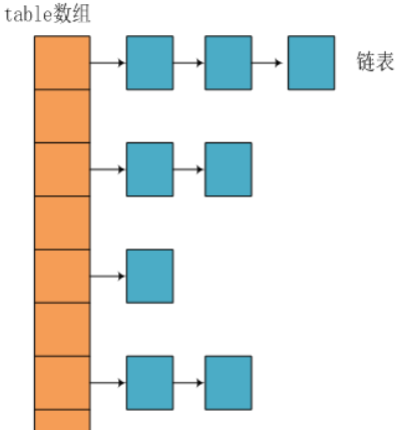
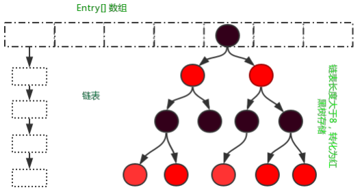
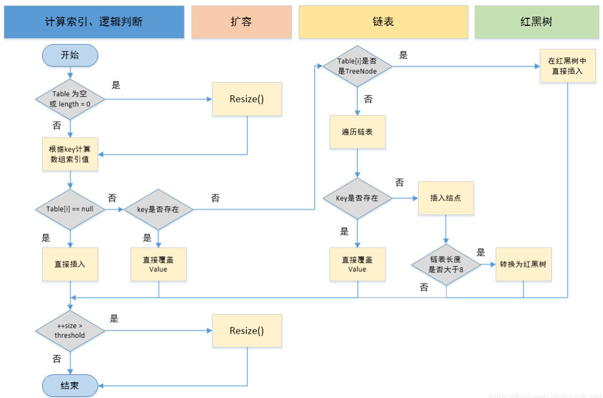

# Java基础面试题

## 1. String 是最基本的数据类型吗？

答：Java 中的基本数据类型只有8个：byte、short、int、long、float、double、char、boolean；除了基本类型（primitive type），剩下的都是引用类型（reference type），Java 5 以后引入的枚举类型也算是一种比较特殊的引用类型。

# Java 集合面试题

## 1. Java集合的快速失败机制 “fail-fast”？

“fail-fast” 是当多个线程对  java 集合进行结构上的改变的操作时的一种错误检测机制。例如：假设存在两个线程（线程1、线程2），线程1通过Iterator在遍历集合A中的元素，在某个时候线程2修改了集合A的结构（是结构上面的修改，而不是简单的修改集合元素的内容），那么这个时候程序就会抛出 `ConcurrentModificationException` 异常，从而产生fail-fast机制。

原因：迭代器在遍历时直接访问集合中的内容，并且在遍历过程中使用一个 modCount 变量。集合在被遍历期间如果内容发生变化，就会改变 modCount 的值。每当迭代器使用hashNext()/next()遍历下一个元素之前，都会检测 modCount 变量是否为 expectedmodCount 值，是的话就返回遍历；否则抛出异常，终止遍历。

解决办法如下：

1. 在遍历过程中，所有涉及到改变 modCount 值得地方全部加上 `synchronized`
2. 使用 `CopyOnWriteArrayList` 来替换 `ArrayList`

## 2. Iterator 和 ListIterator 的区别

- Iterator 可以遍历 Set 和 List 集合，而 ListIterator 只能遍历 List。
- Iterator 只能单向遍历，而 ListIterator 可以双向遍历（向前/后遍历）。
- ListIterator 实现 Iterator 接口，然后添加了一些额外的功能，比如添加一个元素、替换一个元素、获取前面或后面元素的索引位置

## 3. ArrayList 和 LinkedList 的区别与选择

区别：

- **数据结构实现**：ArrayList 是动态数组的数据结构实现，而 LinkedList 是双向链表的数据结构实现。
- **随机访问效率**：ArrayList 比 LinkedList 在随机访问的时候效率要高，因为 LinkedList 是线性的数据存储方式，所以需要移动指针从前往后依次查找。
- **增加和删除效率**：在非首尾的增加和删除操作，LinkedList 要比 ArrayList 效率要高，因为 ArrayList 增删操作要影响数组内的其他数据的下标。
- **内存空间占用**：LinkedList 比 ArrayList 更占内存，因为 LinkedList 的节点除了存储数据，还存储了两个引用，一个指向前一个元素，一个指向后一个元素。
- **线程安全**：ArrayList 和 LinkedList 都是不同步的，也就是不保证线程安全；

选择建议：

- 如果需要大量非首尾增删元素，则建议使用 LinkedList
- 如果只是遍历查询元素，不进行增删操作，则建议使用 ArrayList

## 4. ArrayList 和 Vector 的区别

此两个类都实现了 List 接口（List 接口继承了 Collection 接口），它们都是有序集合

- **线程安全**：Vector 使用了 `Synchronized` 来实现线程同步，是线程安全的，而 ArrayList 是非线程安全的。
- **性能**：ArrayList 在性能方面要优于 Vector。
- **扩容**：ArrayList 和 Vector 都会根据实际的需要动态的调整容量，只不过在 Vector 扩容每次会增加 1 倍，而 ArrayList 只会增加 50%。

Vector 类的所有方法都是同步的。可以由两个线程安全地访问一个 Vector 对象、但是一个线程访问 Vector 的话代码要在同步操作上耗费大量的时间。

Arraylist 不是同步的，所以在不需要保证线程安全时时建议使用 Arraylist

## 5. Map 的常用实现类 HashMap / LinkedHashMap / TreeMap 的区别

1. HashMap: 基于哈希表的 Map 接口的实现类，并允许使用 null 值和 null 键（**HashMap 最多只允许一条记录的键为 null，允许多条记录的值为 null。**），**键是唯一，存储和取出没有顺序**。
2. LinkedHashMap: 基于哈希表的 Map 接口的实现类，并允许使用 null 值和 null 键，**键是唯一，存储和取出有顺序**
3. TreeMap：从功能上讲，TreeMap 有着比 HashMap 更为强大的功能，它实现了 SortedMap 接口，这意味着它可以对元素进行排序。TreeMap 的性能略微低于 HashMap。如果在开发中需要对元素进行排序，那么使用 HashMap 便无法实现这种功能，使用 TreeMap 的迭代输出将会以元素顺序进行。**LinkedHashMap 是基于元素进入集合的顺序或者被访问的先后顺序排序，TreeMap 则是基于元素的固有顺序 (由 Comparator 或者 Comparable 确定)。即：LinkedHashMap 是根据元素增加或者访问的先后顺序进行排序，而 TreeMap 则根据元素的 Key 进行排序**。

## 6. HashSet 的实现原理？

HashSet 是基于 HashMap 实现的，HashSet的值存放于HashMap的key上，HashMap的value统一为PRESENT，因此 HashSet 的实现比较简单，相关 HashSet 的操作，基本上都是直接调用底层 HashMap 的相关方法来完成，HashSet 不允许重复的值

## 7. 为什么 ArrayList 的 elementData 加上 transient 修饰

ArrayList 实现了 Serializable 接口，可以支持序列化。transient 的作用是说不希望 elementData 数组被序列化，然后重写了 writeObject 实现。

每次序列化时，先调用 defaultWriteObject() 方法序列化 ArrayList 中的非 transient 元素，然后遍历 elementData，只序列化已存入的元素，这样既加快了序列化的速度，又减小了序列化之后的文件大小。

## 8. HashMap 的实现原理？

HashMap是基于哈希表的Map接口的非同步实现。此实现提供所有可选的映射操作，并允许使用null值和null键。此类不保证映射的顺序，特别是它不保证该顺序恒久不变。

在Java编程语言中，保存数据有两种比较简单的数据结构：数组和链表（模拟指针引用）。所有的数据结构都可以用这两个基本结构来构造的，HashMap也不例外。

- 数组的特点是：寻址容易，插入和删除困难；
- 链表的特点是：寻址困难，但插入和删除容易；

所以将数组和链表结合在一起，发挥两者各自的优势，使用一种叫做**拉链法**的方式可以解决哈希冲突。HashMap 的数据结构实际上是一个“链表散列”的数据结构，即数组和链表的结合体。

HashMap 基于 Hash 算法实现的，具体如下：

1. 当我们往Hashmap中put元素时，利用key的hashCode重新hash计算出当前对象的元素在数组中的下标
2. 存储时，如果出现hash值相同的key，此时有两种情况。
    1. 如果key相同，则覆盖原始值；
    2. 如果key不同（出现冲突），则将当前的key-value放入链表中
3. 获取时，直接找到hash值对应的下标，在进一步判断key是否相同，从而找到对应值。
4. 理解了以上过程就不难明白HashMap是如何解决hash冲突的问题，核心就是使用了数组的存储方式，然后将冲突的key的对象放入链表中，一旦发现冲突就在链表中做进一步的对比。

> 需要注意Jdk 1.8中对HashMap的实现做了优化，当链表中的节点数据超过八个之后，该链表会转为红黑树来提高查询效率，从原来的 `O(n)` 到 `O(logn)`

### 8.1. JDK1.8之前实现

JDK1.8之前采用的是拉链法。拉链法：将链表和数组相结合。也就是说创建一个链表数组，数组中每一格就是一个链表。若遇到哈希冲突，则将冲突的值加到链表中即可。

### 8.2. JDK1.8之后实现

相比于之前的版本，jdk1.8在解决哈希冲突时有了较大的变化，当链表长度大于阈值（默认为8）时，将链表转化为红黑树，以减少搜索时间。

### 8.3. JDK1.7 VS JDK1.8

JDK1.8主要解决或优化了一下问题：

1. resize 扩容优化
2. 引入了红黑树，目的是避免单条链表过长而影响查询效率
3. 解决了多线程死循环问题，但仍是非线程安全的，多线程时可能会造成数据丢失问题。

|          区别          |                               JDK1.7                               |                                           JDK1.8                                           |
| ---------------------- | ------------------------------------------------------------------ | ------------------------------------------------------------------------------------------ |
| 存储结构                | 数组+链表                                                           | 数组+链表+红黑树                                                                             |
| 初始化方式              | 单独函数：inflateTable()                                            | 直接集成到了扩容函数resize()中                                                                |
| hash值计算方式          | 扰动处理=9次扰动=4次位运算+5次异或运算                                 | 扰动处理=2次扰动=1次位运算+1次异或运算                                                         |
| 存放数据的规则          | 无冲突时，存放数组；冲突时，存放链表                                   | 无冲突时：存放数组 冲突 & `链表长度 < 8`：存放单链表 冲突 & `链表长度 > 8`：树化并存放红黑树 |
| 插入数据方式            | 头插法（先将原位置的数据移到后1位，再插入数据到该位置）                  | 尾插法（直接插入到链表尾部/红黑树）                                                            |
| 扩容后存储位置的计算方式 | 全部按照原来方法进行计算（即`hashCode ->> 扰动函数 ->> (h&length-1)`） | 按照扩容后的规律计算（即`扩容后的位置=原位置 or 原位置 + 旧容量`）                                |

## 9. (待学习)HashMap 的 put 方法的具体流程

当 put 元素的时候，首先计算 key 的 hash 值，这里调用了 hash 方法，hash 方法实际是让`key.hashCode()`与`key.hashCode()>>>16`进行异或操作，高16bit补0，一个数和0异或不变，所以 hash 函数大概的作用就是：**高16bit不变，低16bit和高16bit做了一个异或，目的是减少碰撞**。按照函数注释，因为bucket数组大小是2的幂，计算下标`index = (table.length - 1) & hash`，如果不做 hash 处理，相当于散列生效的只有几个低 bit 位，为了减少散列的碰撞，设计者综合考虑了速度、作用、质量之后，使用高16bit和低16bit异或来简单处理减少碰撞，而且JDK8中用了复杂度 `O(logn)`的树结构来提升碰撞下的性能。

putVal方法执行流程图

## 10. (待学习)HashMap的扩容操作是怎么实现的？

## 11. HashMap 、ConcurrentHashMap 和 Hashtable 的区别

1. 线程安全：HashMap是线程不安全；而ConcurrentHashMap 和 Hashtable是线程安全的。
2. key是否允许有null值：HashMap允许有null，但只能存在一个；而ConcurrentHashMap 和 Hashtable都不允许。

# Java IO 面试题

## 1. BIO,NIO,AIO 有什么区别?

- BIO：Block IO 同步阻塞式 IO，就是我们平常使用的传统 IO，它的特点是模式简单使用方便，并发处理能力低。
- NIO：Non IO 同步非阻塞 IO，是传统 IO 的升级，客户端和服务器端通过Channel（通道）通讯，实现了多路复用。
- AIO：Asynchronous IO 是 NIO 的升级，也叫 NIO2，实现了异步非堵塞 IO，异步 IO 的操作基于事件和回调机制。

详细回答

- BIO (Blocking I/O): 同步阻塞I/O模式，数据的读取写入必须阻塞在一个线程内等待其完成。在活动连接数不是特别高（小于单机1000）的情况下，这种模型是比较不错的，可以让每一个连接专注于自己的 I/O 并且编程模型简单，也不用过多考虑系统的过载、限流等问题。线程池本身就是一个天然的漏斗，可以缓冲一些系统处理不了的连接或请求。但是，当面对十万甚至百万级连接的时候，传统的 BIO 模型是无能为力的。因此，我们需要一种更高效的 I/O 处理模型来应对更高的并发量。
- NIO (New I/O): NIO是一种同步非阻塞的I/O模型，在Java 1.4 中引入了NIO框架，对应 java.nio 包，提供了 Channel , Selector，Buffer等抽象。NIO中的N可以理解为Non-blocking，不单纯是New。它支持面向缓冲的，基于通道的I/O操作方法。 NIO提供了与传统BIO模型中的 Socket 和 ServerSocket 相对应的SocketChannel 和 ServerSocketChannel 两种不同的套接字通道实现,两种通道都支持阻塞和非阻塞两种模式。阻塞模式使用就像传统中的支持一样，比较简单，但是性能和可靠性都不好；非阻塞模式正好与之相反。对于低负载、低并发的应用程序，可以使用同步阻塞I/O来提升开发速率和更好的维
- AIO (Asynchronous I/O): AIO 也就是 NIO 2。在 Java 7 中引入了 NIO 的改进版 NIO 2,它是异步非阻塞的IO模型。异步 IO 是基于事件和回调机制实现的，也就是应用操作之后会直接返回，不会堵塞在那里，当后台处理完成，操作系统会通知相应的线程进行后续的操作。AIO 是异步IO的缩写，虽然 NIO 在网络操作中，提供了非阻塞的方法，但是 NIO 的 IO 行为还是同步的。对于 NIO 来说，我们的业务线程是在 IO 操作准备好时，得到通知，接着就由这个线程自行进行 IO 操作，IO操作本身是同步的。查阅网上相关资料，我发现就目前来说 AIO 的应用还不是很广泛，Netty 之前也尝试使用过 AIO，不过又放弃了
