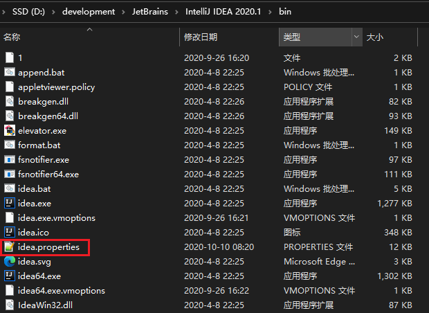
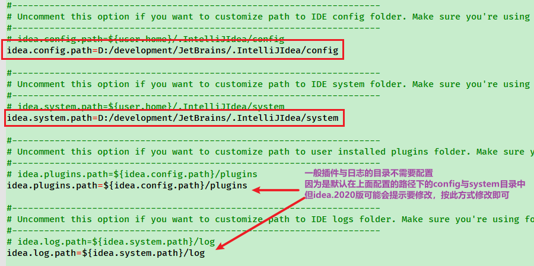
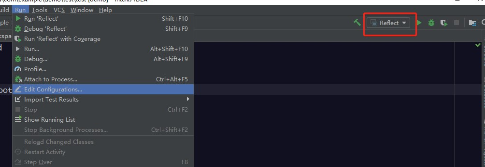
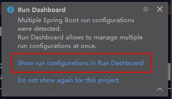
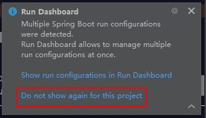
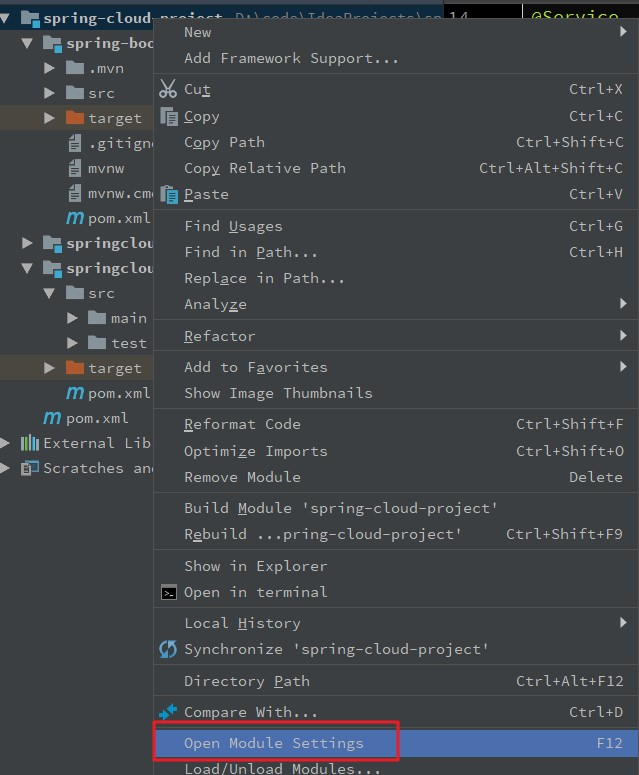
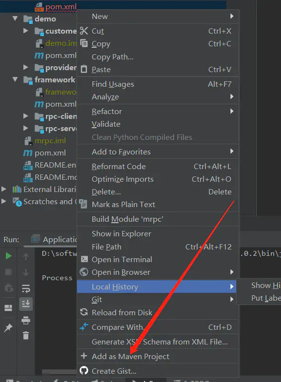

# IDEA

## 1. 初次启动 Intellij IDEA 前需进行的配置

第一次进入Intellij IDEA之前，先修改一下缓存的保存位置

1. 修改idea安装目录下的bin文件中的idea.properties文件（`%IDEA_HOME%/bin/idea.properties`）



2. 修改idea的配置config文件夹与系统system文件。*注：插件与日志的文件夹可以不需要设置，因为这两个文件夹是默认在config与system目录下，但如果打开idea提示*



```
idea.config.path=D:/development/JetBrains/.IntelliJIdea/config
idea.system.path=D:/development/JetBrains/.IntelliJIdea/system
```

3. 修改后，将idea的配置缓存文件不需要保存在c盘的用户目录下，保存在指定的目录下

## 2. 常用配置

### 2.1. 设置自动生成serialVersionUID

新建一个测试的实体类，实现`java.io.Serializable`接口，选择类名，按`Alt+Enter`键，出现的提示框中没有生成serialVersionUID的提示，这个需要设置之后才会有自动生成的提示信息

点击选择【File】-->【Settings】-->【Editor】-->【Inspections】。在右边的搜索框中输入`serialVersionUID`关键字，出现以下选项，勾选`Serializable class without serialVersionUID`


设置完后，光标放在类名上，再次按`Alt+Enter`键，这个时候可以看到`Add serialVersionUID field`提示信息


## 3. IDEA 启用/禁用 Run Dashboard

### 3.1. 启用 Run Dashboard

**方式一**：	创建/打开一个SpringBoot项目【或者点击Run --> Edit Configurations 添加 Spring Boot 类型的项目配置；或者如图在红框处添加配置】，会弹出一个 Run Dashboard 信息框，点击第一个蓝色连接(Show run configurations in Run Dashboard) 即可。






方式二：点击View --> Tool Windows --> Run Dashboard（此方式是Run Dashboard已经打开后，只是隐藏了才能使用此方式）


方式三：在项目`.idea`目录中的`workspace.xml`中找到 RunDashboard 的 component 接点内增加以下代码

```xml
<option name="configurationTypes">
	<set>
		<option value="SpringBootApplicationConfigurationType" />
	</set>
</option>
```

### 3.2. 禁用 Run Dashboard

方式一：在弹出的 Run Dashboard 信息框，点击第二个蓝色连接(Do not show again for this peoject) 即可



方式二：在项目`.idea`目录中的`workspace.xml`中找到 RunDashboard 的 component 接点内删除以下代码

```xml
<option name="configurationTypes">
	<set>
		<option value="SpringBootApplicationConfigurationType" />
	</set>
</option>
```

### 3.3. 其他操作

在弹出的 Run Dashboard 信息框，点击第二个蓝色连接(Do not show again for this peoject)后，会发现Run Dashboard 信息框不再有了，可以通过快捷键`Ctrl+Alt+S`打开Settings窗口【或点击File --> Settings】，在搜索框输入Notifications，然后修改右侧Run Dashboard栏信息即可。以下是Popup(弹出窗口)的设置说明：

- `Balloon`：弹出窗在屏幕上显示一小段时间，然后自动消失。通知也会显示在状态栏中，并添加到通知列表中。
- `Sticky balloon`：若不手动关闭，弹出窗会在屏幕上一直显示
- `No popup`：不显示该弹出窗


## 4. 导入maven项目时无法识别

导入项目父级目录不是 Maven Parent 目录而是普通的文件夹，里面的子 maven 项目无法识别（子module变灰）。

### 4.1. 方式1

1. 右键父项目 --> 选择【open Module Settings】 --> 选择【modules】 --> 点击【+】号 --> 选择【Import Module】




2. 选择变灰项目的【pom.xml】文件
3. 点击【ok】 --> 【next】 --> 一直选择到结束即可

### 4.2. 方式2

选择无法识别的 pom.xml 文件，右键选择【+ Add as Maven Project】


