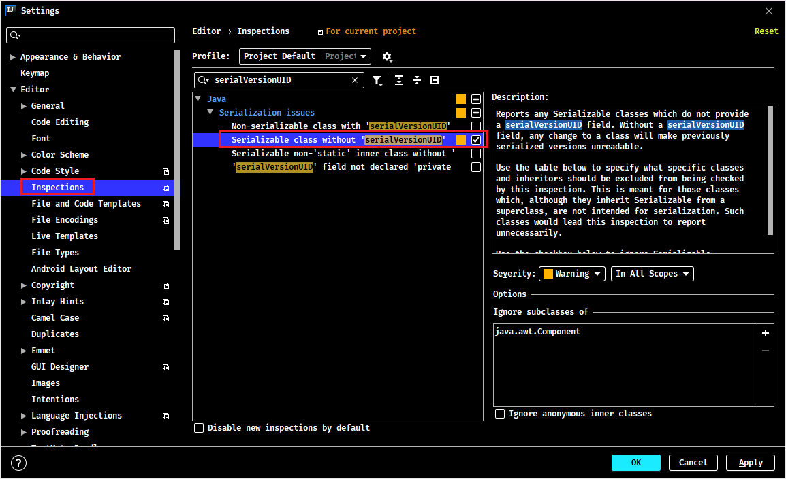
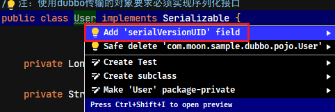

# IDEA 常用配置

## 1. 常用配置

### 1.1. 设置自动生成serialVersionUID

新建一个测试的实体类，实现`java.io.Serializable`接口，选择类名，按`Alt+Enter`键，出现的提示框中没有生成serialVersionUID的提示，这个需要设置之后才会有自动生成的提示信息

点击选择【File】-->【Settings】-->【Editor】-->【Inspections】。在右边的搜索框中输入`serialVersionUID`关键字，出现以下选项，勾选`Serializable class without serialVersionUID`

设置完后，光标放在类名上，再次按`Alt+Enter`键，这个时候可以看到`Add serialVersionUID field`提示信息

